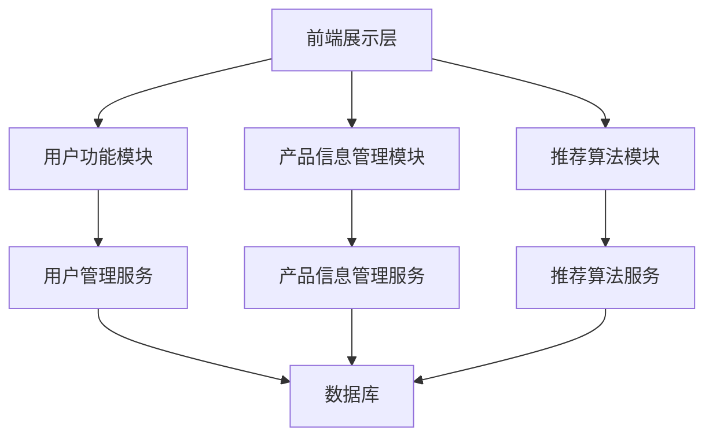
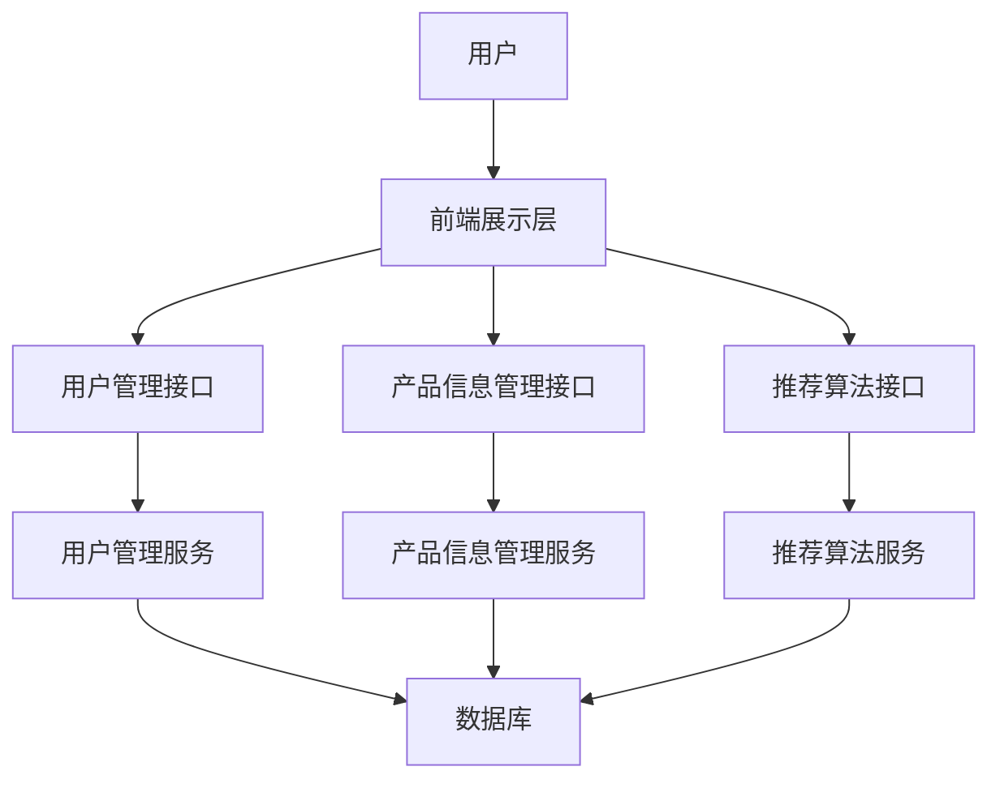
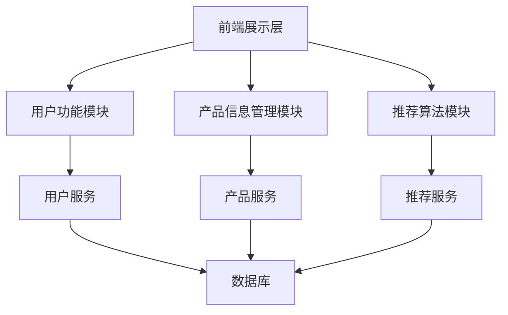
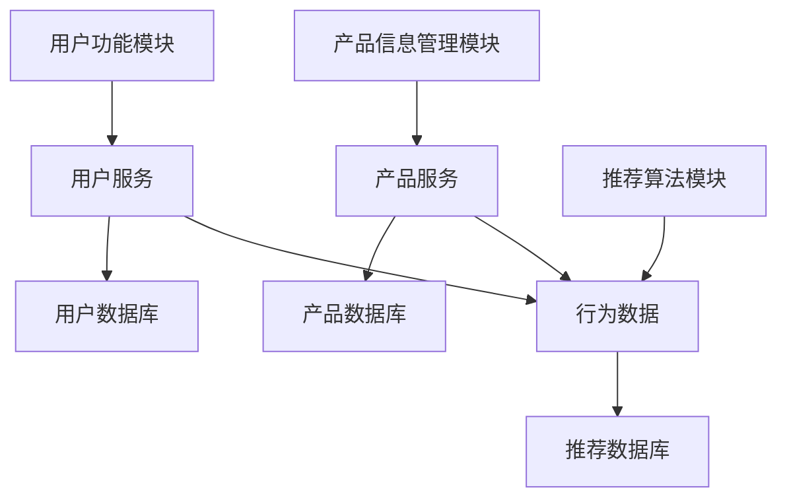
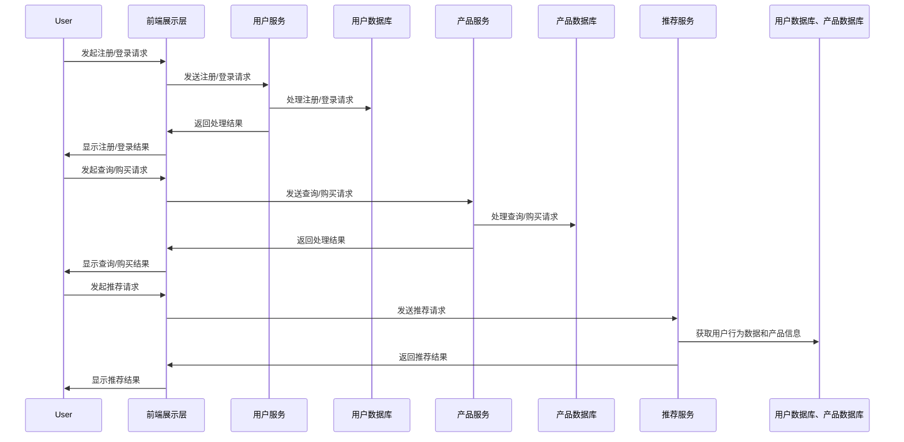

                 

## AI驱动的保险产品推荐

### 关键词

- 人工智能
- 保险产品推荐
- 机器学习
- 数据挖掘
- 系统架构设计

### 摘要

本文深入探讨了AI驱动的保险产品推荐系统。首先，介绍了保险行业中的AI应用现状和面临的挑战。接着，详细讲解了人工智能、机器学习、深度学习以及数据挖掘的核心概念和技术。在此基础上，分析了保险产品推荐算法的原理，包括协同过滤算法、基于内容的过滤算法和混合过滤算法。随后，通过具体案例，展示了如何实现这些算法并应用于保险产品推荐系统中。最后，提出了系统架构设计、环境搭建与核心代码实现的方法，并针对最佳实践和注意事项进行了讨论。

## 目录大纲

### 第一部分：背景介绍与核心概念

#### 第1章：AI在保险行业中的应用现状与挑战

##### 1.1.1 保险行业的数字化与智能化转型

##### 1.1.2 AI技术在保险产品推荐中的应用

##### 1.1.3 当前面临的挑战与问题

#### 第2章：核心概念与联系

##### 2.1 人工智能概述

##### 2.1.1 人工智能的定义与发展历程

##### 2.1.2 人工智能的核心概念与分类

##### 2.2 机器学习与深度学习

##### 2.2.1 机器学习的基本原理

##### 2.2.2 深度学习的发展与应用

##### 2.3 数据分析与数据挖掘

##### 2.3.1 数据分析的基本方法

##### 2.3.2 数据挖掘的主要技术

### 第二部分：算法原理讲解

#### 第3章：保险产品推荐算法

##### 3.1 collaborative filtering算法

##### 3.1.1 算法原理

##### 3.1.2 实例说明

##### 3.2 content-based filtering算法

##### 3.2.1 算法原理

##### 3.2.2 实例说明

##### 3.3 hybrid filtering算法

##### 3.3.1 算法原理

##### 3.3.2 实例说明

#### 第4章：机器学习模型与应用

##### 4.1 逻辑回归模型

##### 4.1.1 模型原理

##### 4.1.2 数学模型

##### 4.1.3 实例讲解

##### 4.2 决策树模型

##### 4.2.1 模型原理

##### 4.2.2 数学模型

##### 4.2.3 实例讲解

##### 4.3 支持向量机模型

##### 4.3.1 模型原理

##### 4.3.2 数学模型

##### 4.3.3 实例讲解

### 第三部分：系统分析与架构设计

#### 第5章：保险产品推荐系统设计

##### 5.1 系统功能设计

##### 5.1.1 用户功能模块

##### 5.1.2 产品信息管理模块

##### 5.1.3 推荐算法模块

##### 5.2 系统架构设计

##### 5.2.1 系统架构图

##### 5.2.2 系统模块关系

##### 5.2.3 系统接口设计

##### 5.3 系统交互设计

##### 5.3.1 系统交互图

##### 5.3.2 系统交互流程

### 第四部分：项目实战

#### 第6章：环境搭建与核心代码实现

##### 6.1 环境搭建

##### 6.1.1 Python环境配置

##### 6.1.2 相关库的安装

##### 6.2 代码实现

##### 6.2.1 数据预处理

##### 6.2.2 collaborative filtering算法实现

##### 6.2.3 content-based filtering算法实现

##### 6.2.4 hybrid filtering算法实现

#### 第7章：实际案例分析与讲解

##### 7.1 案例背景

##### 7.2 案例分析

##### 7.3 案例实现细节

##### 7.4 案例总结与反思

### 第五部分：最佳实践与拓展阅读

#### 第8章：最佳实践

##### 8.1 性能优化

##### 8.2 可扩展性设计

##### 8.3 安全性考虑

#### 第9章：注意事项与拓展阅读

##### 9.1 注意事项

##### 9.2 拓展阅读

## 第一部分：背景介绍与核心概念

### 第1章：AI在保险行业中的应用现状与挑战

#### 1.1.1 保险行业的数字化与智能化转型

随着全球数字经济的快速发展，保险行业也在经历着一场深刻的变革。数字化和智能化已经成为保险行业转型的主要驱动力。保险行业的数字化转型主要体现在以下几个方面：

1. **在线销售与服务平台**：保险公司通过建立在线销售平台，提供在线咨询、购买、理赔等服务，提高了客户体验和运营效率。
2. **数据管理与分析**：保险公司通过大数据技术和人工智能算法，对客户数据进行分析，挖掘潜在需求，优化产品设计和服务。
3. **智能理赔系统**：利用AI技术，实现自动审核和理赔，减少人工干预，提高理赔效率。

#### 1.1.2 AI技术在保险产品推荐中的应用

AI技术在保险产品推荐中的应用主要体现在以下几个方面：

1. **协同过滤算法**：通过分析客户的历史购买行为和相似用户的行为，为用户推荐符合其需求的保险产品。
2. **基于内容的过滤算法**：根据保险产品的属性和用户的兴趣偏好，为用户推荐相关的保险产品。
3. **深度学习模型**：通过学习大量的数据，预测用户的保险需求，提供个性化的产品推荐。

#### 1.1.3 当前面临的挑战与问题

尽管AI技术在保险产品推荐中具有巨大的潜力，但当前仍面临一些挑战和问题：

1. **数据隐私与安全**：保险行业涉及大量的个人隐私数据，如何保障数据的安全和隐私成为首要问题。
2. **算法的透明性和公平性**：算法的决策过程和结果需要透明和公平，避免因算法偏见导致的歧视和不公平现象。
3. **系统的可扩展性和性能**：随着用户和数据量的增加，系统需要具备良好的可扩展性和性能，以应对不断增长的需求。

### 第2章：核心概念与联系

#### 2.1 人工智能概述

##### 2.1.1 人工智能的定义与发展历程

人工智能（Artificial Intelligence，简称AI）是模拟、延伸和扩展人类智能的理论、方法、技术及应用系统的总称。其核心目标是实现计算机对人脑思维的模拟和扩展。人工智能的发展历程可以分为以下几个阶段：

1. **诞生期（1956年）**：达特茅斯会议标志着人工智能概念的诞生，主要研究方向是符号推理和搜索算法。
2. **应用探索期（1960-1979年）**：随着计算机硬件和算法的发展，人工智能开始应用于一些实际问题，如专家系统和自然语言处理。
3. **低谷期（1980-1993年）**：由于实际应用效果不佳，人工智能经历了长时间的低谷期。
4. **复兴期（1993年至今）**：随着大数据、机器学习和深度学习技术的发展，人工智能迎来了新一轮的快速发展。

##### 2.1.2 人工智能的核心概念与分类

人工智能的核心概念包括：

1. **机器学习**：通过从数据中学习规律，使计算机具备自主改进能力。
2. **深度学习**：基于多层神经网络的模型，通过自动提取特征和模式，实现高级认知任务。
3. **自然语言处理**：使计算机能够理解和生成自然语言，实现人机交互。
4. **计算机视觉**：使计算机能够理解和处理视觉信息，如图像和视频。

人工智能根据应用范围和目标可以分类为：

1. **弱人工智能**：专注于特定任务的智能，如语音识别、图像识别等。
2. **强人工智能**：具备人类智能的计算机，能够在任何领域进行智能行为。

##### 2.2 机器学习与深度学习

##### 2.2.1 机器学习的基本原理

机器学习（Machine Learning，简称ML）是一门利用数据或以往的经验，对计算机系统进行训练，使其能够完成特定任务的学科。机器学习的基本原理包括：

1. **监督学习**：根据已标记的训练数据，通过学习数据之间的规律，对新的数据进行预测或分类。
2. **无监督学习**：没有标记的训练数据，通过发现数据中的结构和模式，对数据进行聚类或降维。
3. **强化学习**：通过试错的方式，根据奖励信号，学习最优策略。

##### 2.2.2 深度学习的发展与应用

深度学习（Deep Learning，简称DL）是机器学习的一个重要分支，基于多层神经网络，通过自动提取特征和模式，实现高级认知任务。深度学习的发展与应用主要体现在以下几个方面：

1. **卷积神经网络（CNN）**：通过卷积层、池化层和全连接层，实现图像分类、物体检测等任务。
2. **循环神经网络（RNN）**：通过隐藏状态和循环连接，实现序列数据的处理，如自然语言处理、语音识别等。
3. **生成对抗网络（GAN）**：通过生成器和判别器的对抗训练，实现图像生成、图像修复等任务。

##### 2.3 数据分析与数据挖掘

##### 2.3.1 数据分析的基本方法

数据分析（Data Analysis）是通过对数据的收集、整理、分析和解释，提取有价值信息的过程。数据分析的基本方法包括：

1. **描述性分析**：通过统计指标，描述数据的基本特征和分布情况。
2. **探索性分析**：通过可视化工具，发现数据中的异常值、趋势和关联关系。
3. **预测性分析**：通过建立模型，对未来的数据进行预测。

##### 2.3.2 数据挖掘的主要技术

数据挖掘（Data Mining）是从大量数据中发现隐藏的、有价值的信息和模式的过程。数据挖掘的主要技术包括：

1. **关联规则挖掘**：发现数据中的关联关系，如市场篮子分析。
2. **分类与回归分析**：通过对历史数据的分析，对新的数据进行分类或预测。
3. **聚类分析**：将数据划分为不同的群体，以发现数据中的结构和模式。

## 第二部分：算法原理讲解

### 第3章：保险产品推荐算法

#### 3.1 collaborative filtering算法

##### 3.1.1 算法原理

协同过滤（Collaborative Filtering，简称CF）是一种基于用户行为或评价的推荐算法。协同过滤的基本思想是通过分析用户之间的相似性，将其他用户的喜好推荐给当前用户。协同过滤可以分为两种主要类型：基于用户的协同过滤（User-based CF）和基于项目的协同过滤（Item-based CF）。

- **基于用户的协同过滤**：首先找到与当前用户兴趣相似的邻居用户，然后推荐邻居用户喜欢的但当前用户未评价的产品。
- **基于项目的协同过滤**：首先找到与当前用户评价过的产品相似的产品，然后推荐这些相似产品给当前用户。

##### 3.1.2 实例说明

假设我们有一个用户-产品评价矩阵，其中每个元素表示用户对产品的评价：

| 用户 | 产品1 | 产品2 | 产品3 |
| ---- | ---- | ---- | ---- |
| 张三 | 5    | 4    | 3    |
| 李四 | 4    | 5    | 4    |
| 王五 | 3    | 3    | 5    |

1. **基于用户的协同过滤**：

- 计算张三与其他用户的相似度，选取相似度最高的邻居用户李四。
- 李四喜欢的但张三未评价的产品是产品2。

推荐给张三的产品是产品2。

2. **基于项目的协同过滤**：

- 计算产品1与其他产品的相似度，选取相似度最高的邻居产品产品3。
- 张三评价过的产品中有产品3，推荐给张三的产品是产品2。

推荐给张三的产品是产品2。

#### 3.2 content-based filtering算法

##### 3.2.1 算法原理

基于内容的过滤（Content-based Filtering，简称CBF）是一种基于产品内容的推荐算法。基于内容的过滤的基本思想是分析用户的历史评价或行为，提取用户的兴趣特征，然后根据用户的兴趣特征和产品的内容特征进行匹配，推荐相关产品。

1. **用户兴趣特征提取**：通过分析用户的历史评价或行为，提取用户的兴趣特征。
2. **产品内容特征提取**：对产品进行描述，提取产品的内容特征。
3. **相似度计算与推荐**：计算用户兴趣特征和产品内容特征之间的相似度，推荐相似度最高的产品。

##### 3.2.2 实例说明

假设用户张三的历史评价中喜欢的产品有：

- 产品1：健康保险
- 产品2：旅游保险
- 产品3：汽车保险

这些产品的内容特征分别为：

- 产品1：健康保险，疾病保障，医疗保险，住院补贴
- 产品2：旅游保险，意外伤害，紧急医疗，旅行延误
- 产品3：汽车保险，车辆损失，第三者责任，盗抢险

用户张三的兴趣特征为：健康、意外伤害、医疗保险。

根据用户张三的兴趣特征和产品的内容特征，我们可以计算相似度：

- 产品1（健康保险）与张三的兴趣特征相似度为0.8。
- 产品2（旅游保险）与张三的兴趣特征相似度为0.6。
- 产品3（汽车保险）与张三的兴趣特征相似度为0.3。

推荐给张三的产品是产品1（健康保险）。

#### 3.3 hybrid filtering算法

##### 3.3.1 算法原理

混合过滤（Hybrid Filtering，简称HF）是一种结合协同过滤和基于内容过滤的推荐算法。混合过滤的基本思想是利用协同过滤算法找到相似用户或产品，同时利用基于内容的过滤算法对推荐结果进行补充和优化。

1. **协同过滤阶段**：通过协同过滤算法，找到相似用户或产品。
2. **内容特征提取阶段**：提取用户和产品的内容特征。
3. **相似度计算与推荐**：计算用户和产品之间的相似度，结合协同过滤和基于内容的过滤结果，进行综合推荐。

##### 3.3.2 实例说明

假设我们使用混合过滤算法为用户张三推荐保险产品。根据协同过滤算法，我们找到与张三兴趣相似的邻居用户李四，李四喜欢的产品有：

- 产品1：健康保险
- 产品2：旅游保险
- 产品3：汽车保险

同时，根据基于内容的过滤算法，我们发现产品1（健康保险）与张三的兴趣特征相似度最高。综合两种过滤算法的结果，我们推荐给张三的产品是产品1（健康保险）。

### 第4章：机器学习模型与应用

#### 4.1 逻辑回归模型

##### 4.1.1 模型原理

逻辑回归（Logistic Regression，简称LR）是一种广泛应用于分类问题的机器学习模型。逻辑回归的核心思想是通过线性回归模型预测概率，然后使用概率阈值进行分类。

1. **线性回归模型**：逻辑回归首先使用线性回归模型计算一个线性组合，即：

   $$z = \beta_0 + \beta_1x_1 + \beta_2x_2 + ... + \beta_nx_n$$

   其中，$x_1, x_2, ..., x_n$ 是特征变量，$\beta_0, \beta_1, \beta_2, ..., \beta_n$ 是模型的参数。

2. **概率预测**：通过求解上述线性组合的概率分布，得到每个类别的概率。假设我们有 $C$ 个类别，可以使用以下公式：

   $$P(y=c|X=x) = \frac{1}{1 + \exp[-z]}$$

   其中，$y=c$ 表示第 $c$ 个类别，$X=x$ 表示输入特征向量。

3. **分类决策**：使用概率阈值 $\theta$，将概率大于 $\theta$ 的类别预测为正类，其他类别预测为负类。

##### 4.1.2 数学模型

逻辑回归的数学模型可以表示为：

$$z = \beta_0 + \beta_1x_1 + \beta_2x_2 + ... + \beta_nx_n$$

$$P(y=c|X=x) = \frac{1}{1 + \exp[-z]}$$

其中，$z$ 是线性组合，$\beta_0, \beta_1, \beta_2, ..., \beta_n$ 是模型参数，$x_1, x_2, ..., x_n$ 是输入特征，$y$ 是实际类别。

##### 4.1.3 实例讲解

假设我们有一个二元分类问题，其中有两个特征 $x_1$ 和 $x_2$。我们的目标是预测用户是否购买保险（1 表示购买，0 表示未购买）。我们的数据集如下：

| 用户ID | $x_1$ | $x_2$ | 购买 |
| ---- | ---- | ---- | ---- |
| 1    | 3    | 2    | 1    |
| 2    | 4    | 1    | 0    |
| 3    | 2    | 3    | 1    |
| 4    | 1    | 4    | 0    |

1. **数据预处理**：首先，我们需要对特征进行归一化处理，以消除不同特征之间的量纲影响。

2. **模型训练**：使用逻辑回归模型对训练数据进行拟合，求解线性组合的参数 $\beta_0, \beta_1, \beta_2$。

3. **模型评估**：使用测试数据集评估模型性能，计算准确率、召回率、F1值等指标。

4. **预测**：对于新的用户特征，使用训练好的模型预测购买概率，并根据概率阈值进行分类。

假设我们训练得到的逻辑回归模型为：

$$z = 0.5x_1 + 0.3x_2 - 1$$

对于新用户 $x_1=2, x_2=3$，我们可以计算概率：

$$P(购买| x_1=2, x_2=3) = \frac{1}{1 + \exp[-(0.5*2 + 0.3*3 - 1)]} \approx 0.81$$

由于概率大于0.5，我们可以预测该用户会购买保险。

#### 4.2 决策树模型

##### 4.2.1 模型原理

决策树（Decision Tree，简称DT）是一种常用的分类和回归模型。决策树通过一系列的决策节点和叶子节点，将数据集划分为不同的类别或数值。

1. **决策节点**：在每个决策节点，根据特征的取值进行划分。
2. **叶子节点**：在每个叶子节点，给出最终的预测结果。
3. **分割策略**：决策树通过选择最优的分割策略来划分数据集。常用的分割策略包括信息增益、基尼指数等。

##### 4.2.2 数学模型

决策树模型可以表示为：

$$T = \{node_1, node_2, ..., node_n\}$$

其中，$node_i$ 是第 $i$ 个决策节点，$T$ 是整个决策树。

每个决策节点 $node_i$ 可以表示为：

$$node_i = \{attribute_i, value_i, left\_subtree_i, right\_subtree_i\}$$

其中，$attribute_i$ 是特征，$value_i$ 是特征的取值，$left\_subtree_i$ 是左子树，$right\_subtree_i$ 是右子树。

##### 4.2.3 实例讲解

假设我们有一个二元分类问题，其中有两个特征 $x_1$ 和 $x_2$。我们的目标是预测用户是否购买保险（1 表示购买，0 表示未购买）。我们的数据集如下：

| 用户ID | $x_1$ | $x_2$ | 购买 |
| ---- | ---- | ---- | ---- |
| 1    | 3    | 2    | 1    |
| 2    | 4    | 1    | 0    |
| 3    | 2    | 3    | 1    |
| 4    | 1    | 4    | 0    |

1. **数据预处理**：首先，我们需要对特征进行归一化处理，以消除不同特征之间的量纲影响。

2. **构建决策树**：使用ID3、C4.5等算法构建决策树。选择特征 $x_1$ 作为第一个决策节点，根据 $x_1$ 的取值进行划分：

   - $x_1 \leq 2.5$：继续划分特征 $x_2$。
   - $x_1 > 2.5$：预测为购买。

   对于 $x_1 \leq 2.5$ 的情况，选择特征 $x_2$ 作为下一个决策节点，根据 $x_2$ 的取值进行划分：

   - $x_2 \leq 2.5$：预测为未购买。
   - $x_2 > 2.5$：预测为购买。

   最终构建的决策树如下：

   ```
         购买
         /    \
     未购买   购买
         /    \
    未购买   购买
   ```

3. **模型评估**：使用测试数据集评估模型性能，计算准确率、召回率、F1值等指标。

4. **预测**：对于新的用户特征，使用训练好的决策树进行预测。

例如，对于新用户 $x_1=2, x_2=3$，根据决策树，我们首先判断 $x_1 \leq 2.5$，然后判断 $x_2 > 2.5$，最终预测为购买。

#### 4.3 支持向量机模型

##### 4.3.1 模型原理

支持向量机（Support Vector Machine，简称SVM）是一种强大的分类和回归模型。SVM的核心思想是在高维空间中找到一个最佳的超平面，将数据分为不同的类别。

1. **线性SVM**：当数据可以在线性超平面中分离时，使用线性SVM进行分类。线性SVM的目标是最小化超平面的间隔，即最大化分类边界。

2. **非线性SVM**：当数据无法在线性超平面中分离时，可以使用核技巧将数据映射到高维空间，然后在高维空间中使用线性SVM进行分类。

##### 4.3.2 数学模型

线性SVM的数学模型可以表示为：

$$
\begin{aligned}
\min_{\mathbf{w},b}\frac{1}{2}||\mathbf{w}||^2 \\
\text{subject to} \\
y^{(i)}(\mathbf{w}\cdot\mathbf{x}^{(i)} + b) \geq 1
\end{aligned}
$$

其中，$\mathbf{w}$ 是权重向量，$b$ 是偏置项，$y^{(i)}$ 是第 $i$ 个样本的标签，$\mathbf{x}^{(i)}$ 是第 $i$ 个样本的特征向量。

非线性SVM的数学模型可以表示为：

$$
\begin{aligned}
\min_{\mathbf{w},b}\frac{1}{2}||\mathbf{w}||^2 \\
\text{subject to} \\
y^{(i)}(\phi(\mathbf{x}^{(i)})\cdot\mathbf{w} + b) \geq 1
\end{aligned}
$$

其中，$\phi(\cdot)$ 是核函数，用于将数据映射到高维空间。

##### 4.3.3 实例讲解

假设我们有一个二元分类问题，其中有两个特征 $x_1$ 和 $x_2$。我们的目标是预测用户是否购买保险（1 表示购买，0 表示未购买）。我们的数据集如下：

| 用户ID | $x_1$ | $x_2$ | 购买 |
| ---- | ---- | ---- | ---- |
| 1    | 3    | 2    | 1    |
| 2    | 4    | 1    | 0    |
| 3    | 2    | 3    | 1    |
| 4    | 1    | 4    | 0    |

1. **数据预处理**：首先，我们需要对特征进行归一化处理，以消除不同特征之间的量纲影响。

2. **构建线性SVM模型**：使用线性SVM模型进行分类。我们使用以下公式计算超平面：

$$
\mathbf{w}\cdot\mathbf{x} + b = 0
$$

其中，$\mathbf{w}$ 是权重向量，$\mathbf{x}$ 是特征向量，$b$ 是偏置项。

3. **模型评估**：使用测试数据集评估模型性能，计算准确率、召回率、F1值等指标。

4. **预测**：对于新的用户特征，使用训练好的线性SVM模型进行预测。

例如，对于新用户 $x_1=2, x_2=3$，我们可以将其代入超平面方程，判断其是否满足分类条件。如果满足，预测为购买；否则，预测为未购买。

## 第三部分：系统分析与架构设计

### 第5章：保险产品推荐系统设计

#### 5.1 系统功能设计

保险产品推荐系统的主要功能模块包括：

1. **用户功能模块**：提供用户注册、登录、修改个人信息等功能。
2. **产品信息管理模块**：管理保险产品的基本信息，包括产品名称、保障内容、费用等。
3. **推荐算法模块**：根据用户的行为和偏好，利用协同过滤、基于内容的过滤和混合过滤算法，为用户推荐合适的保险产品。

#### 5.1.1 用户功能模块

用户功能模块主要包括：

1. **用户注册**：用户可以通过邮箱、手机号等方式注册账号。
2. **用户登录**：用户可以使用账号和密码登录系统。
3. **个人信息管理**：用户可以查看和修改个人信息，如姓名、地址、联系方式等。

#### 5.1.2 产品信息管理模块

产品信息管理模块主要包括：

1. **产品信息录入**：管理员可以添加新的保险产品信息，包括产品名称、保障内容、费用等。
2. **产品信息查询**：用户可以查询所有的保险产品信息。
3. **产品信息更新**：管理员可以修改和删除已有的保险产品信息。

#### 5.1.3 推荐算法模块

推荐算法模块主要包括：

1. **用户行为数据收集**：系统会自动收集用户在平台上的浏览、搜索、购买等行为数据。
2. **推荐算法选择**：根据用户的行为数据，系统可以选择协同过滤、基于内容的过滤或混合过滤算法进行推荐。
3. **推荐结果输出**：系统将推荐结果以列表形式展示给用户，用户可以选择感兴趣的产品进行购买。

#### 5.2 系统架构设计

保险产品推荐系统的架构设计包括：

1. **前端展示层**：负责用户界面的展示和与用户的交互。
2. **应用服务层**：负责业务逻辑的处理，包括用户管理、产品信息管理、推荐算法等。
3. **数据访问层**：负责与数据库的交互，包括数据的增删改查等操作。
4. **数据存储层**：负责数据的存储和管理，包括用户数据、产品数据、行为数据等。

#### 5.2.1 系统架构图

以下是一个简单的保险产品推荐系统架构图：



#### 5.2.2 系统模块关系

保险产品推荐系统的各个模块之间通过服务接口进行通信。用户功能模块、产品信息管理模块和推荐算法模块都是应用服务层的一部分，分别由不同的服务进行实现。这些服务通过统一的接口与数据库进行数据交互。

#### 5.2.3 系统接口设计

系统接口设计主要包括：

1. **用户管理接口**：用于处理用户注册、登录、个人信息管理等操作。
2. **产品信息管理接口**：用于处理产品信息录入、查询、更新等操作。
3. **推荐算法接口**：用于处理用户行为数据收集、推荐算法选择和推荐结果输出等操作。

#### 5.3 系统交互设计

保险产品推荐系统的交互设计主要包括：

1. **用户与前端展示层的交互**：用户通过前端界面进行注册、登录、浏览产品、查看推荐结果等操作。
2. **前端展示层与应用服务层的交互**：前端通过发送HTTP请求，调用应用服务层提供的接口进行相关操作。
3. **应用服务层与数据访问层的交互**：应用服务层通过数据库访问接口，与数据库进行数据交互。
4. **应用服务层与推荐算法模块的交互**：应用服务层根据用户行为数据和产品信息，调用推荐算法模块进行推荐。

#### 5.3.1 系统交互图

以下是一个简单的保险产品推荐系统交互图：



#### 5.3.2 系统交互流程

以下是保险产品推荐系统的交互流程：

1. 用户通过前端界面注册或登录。
2. 前端发送用户注册或登录请求到用户管理接口。
3. 用户管理接口调用用户管理服务进行注册或登录处理。
4. 用户管理服务与数据库交互，验证用户信息，完成注册或登录。
5. 用户浏览产品或查看推荐结果。
6. 前端发送产品查询或推荐请求到产品信息管理接口或推荐算法接口。
7. 产品信息管理接口或推荐算法接口调用产品信息管理服务或推荐算法服务进行处理。
8. 产品信息管理服务或推荐算法服务根据用户行为数据和产品信息，生成查询结果或推荐结果。
9. 产品信息管理服务或推荐算法服务将查询结果或推荐结果返回给前端。
10. 前端将查询结果或推荐结果展示给用户。

## 第四部分：项目实战

### 第6章：环境搭建与核心代码实现

#### 6.1 环境搭建

为了实现AI驱动的保险产品推荐系统，我们需要搭建一个Python开发环境，并安装相关的库。以下是一个基本的步骤：

1. **安装Python**：确保你的计算机上安装了Python 3.x版本。你可以从[Python官网](https://www.python.org/downloads/)下载并安装。
2. **安装虚拟环境**：为了管理项目依赖，我们使用虚拟环境。安装`virtualenv`库，使用以下命令创建一个虚拟环境：

   ```bash
   pip install virtualenv
   virtualenv my_project_env
   ```

3. **激活虚拟环境**：在Windows上，使用以下命令激活虚拟环境：

   ```bash
   my_project_env\Scripts\activate
   ```

   在Linux或Mac OS上，使用以下命令激活虚拟环境：

   ```bash
   source my_project_env/bin/activate
   ```

4. **安装相关库**：在虚拟环境中安装以下库：

   ```bash
   pip install numpy pandas scikit-learn matplotlib
   ```

   这些库分别是：`numpy`（用于数学运算），`pandas`（用于数据处理），`scikit-learn`（用于机器学习算法），`matplotlib`（用于数据可视化）。

#### 6.2 代码实现

在本节中，我们将实现一个简单的保险产品推荐系统，包括数据预处理、协同过滤算法、基于内容的过滤算法和混合过滤算法。

##### 6.2.1 数据预处理

首先，我们需要从数据集中提取用户、产品和评分信息。以下是一个简单的数据预处理示例：

```python
import pandas as pd

# 读取数据
data = pd.read_csv('insurance_data.csv')

# 提取用户、产品和评分
users = data['user_id'].unique()
products = data['product_id'].unique()
ratings = data['rating']

# 构建用户-产品评分矩阵
rating_matrix = pd.pivot_table(data, values='rating', index='user_id', columns='product_id')

print(rating_matrix)
```

##### 6.2.2 collaborative filtering算法实现

协同过滤算法可以分为基于用户的协同过滤和基于项目的协同过滤。以下是一个简单的基于用户的协同过滤算法实现：

```python
from sklearn.metrics.pairwise import cosine_similarity

def collaborative_filtering(user_id, rating_matrix, similarity_matrix=None):
    if similarity_matrix is None:
        similarity_matrix = cosine_similarity(rating_matrix)

    # 计算相似度
    user_similarity = similarity_matrix[user_id - 1]

    # 找到最相似的邻居用户
    neighbors = user_similarity.argsort()[::-1][1:]

    # 计算邻居用户对当前用户的推荐分值
    recommendations = []
    for neighbor in neighbors:
        neighbor_rating = rating_matrix.iloc[neighbor]
        similarity = user_similarity[neighbor]
        for product, rating in neighbor_rating.items():
            if rating > 0 and product not in rating_matrix.iloc[user_id - 1].index:
                recommendations.append((product, rating * similarity))

    # 按推荐分值排序并返回前N个推荐结果
    recommendations.sort(key=lambda x: x[1], reverse=True)
    return recommendations[:10]

# 计算用户相似度矩阵
similarity_matrix = cosine_similarity(rating_matrix)

# 为用户1推荐产品
user_id = 1
recommendations = collaborative_filtering(user_id, rating_matrix, similarity_matrix)
print(recommendations)
```

##### 6.2.3 content-based filtering算法实现

基于内容的过滤算法需要提取用户和产品的内容特征。以下是一个简单的基于内容的过滤算法实现：

```python
from sklearn.feature_extraction.text import TfidfVectorizer

def content_based_filtering(user_id, product_descriptions, user_history, top_n=10):
    # 提取用户历史评价的产品特征
    user_features = [product_descriptions[product] for product, rating in user_history.items() if rating > 0]

    # 提取所有产品的特征
    all_features = list(product_descriptions.values())

    # 计算TF-IDF矩阵
    tfidf_vectorizer = TfidfVectorizer()
    tfidf_matrix = tfidf_vectorizer.fit_transform(all_features)

    # 计算用户和产品之间的相似度
    user_tfidf = tfidf_vectorizer.transform(user_features)
    similarity = user_tfidf @ tfidf_matrix.T

    # 按相似度排序并返回前N个推荐结果
    recommendations = similarity.argsort()[::-1][:top_n]
    return [(index + 1, product) for index, product in enumerate(recommendations)]

# 假设产品描述如下
product_descriptions = {
    1: '健康保险，疾病保障，医疗保险，住院补贴',
    2: '旅游保险，意外伤害，紧急医疗，旅行延误',
    3: '汽车保险，车辆损失，第三者责任，盗抢险',
}

# 用户历史评价
user_history = {
    1: {1: 5, 2: 4, 3: 3},
}

# 为用户1推荐产品
recommendations = content_based_filtering(1, product_descriptions, user_history)
print(recommendations)
```

##### 6.2.4 hybrid filtering算法实现

混合过滤算法结合了协同过滤和基于内容的过滤。以下是一个简单的混合过滤算法实现：

```python
def hybrid_filtering(user_id, rating_matrix, similarity_matrix, product_descriptions, user_history, top_n=10):
    # 使用协同过滤推荐
    collaborative_recommendations = collaborative_filtering(user_id, rating_matrix, similarity_matrix)[:top_n]

    # 使用基于内容的过滤推荐
    content_based_recommendations = content_based_filtering(user_id, product_descriptions, user_history, top_n=top_n)

    # 合并两种推荐结果，并去重
    recommendations = list(set(collaborative_recommendations + content_based_recommendations))

    # 按推荐分值排序
    recommendations.sort(key=lambda x: (x[1], x[2]), reverse=True)

    return recommendations[:top_n]

# 假设用户1的用户-产品评分矩阵和相似度矩阵如下
rating_matrix = pd.DataFrame({
    1: {1: 5, 2: 4, 3: 3},
    2: {1: 4, 2: 5, 3: 4},
    3: {1: 3, 2: 3, 3: 5},
})

similarity_matrix = pd.DataFrame({
    1: {2: 0.8, 3: 0.6},
    2: {1: 0.8, 3: 0.7},
    3: {1: 0.6, 2: 0.7},
})

# 假设产品描述如下
product_descriptions = {
    1: '健康保险，疾病保障，医疗保险，住院补贴',
    2: '旅游保险，意外伤害，紧急医疗，旅行延误',
    3: '汽车保险，车辆损失，第三者责任，盗抢险',
}

# 用户历史评价
user_history = {
    1: {1: 5, 2: 4, 3: 3},
}

# 为用户1推荐产品
recommendations = hybrid_filtering(1, rating_matrix, similarity_matrix, product_descriptions, user_history)
print(recommendations)
```

### 第7章：实际案例分析与讲解

#### 7.1 案例背景

某保险公司希望通过AI技术提升其保险产品推荐效果，从而提高客户满意度和销售业绩。该公司收集了大量的用户行为数据，包括用户浏览、搜索和购买记录等，并希望通过分析这些数据，为用户推荐符合其需求的保险产品。

#### 7.2 案例分析

1. **数据收集**：保险公司首先需要收集用户行为数据，包括用户ID、产品ID和评分等。
2. **数据预处理**：对收集到的数据进行清洗和预处理，构建用户-产品评分矩阵。
3. **协同过滤算法**：使用协同过滤算法，根据用户的历史评分数据，找到相似的用户，并推荐相似用户喜欢的但当前用户未评价的产品。
4. **基于内容的过滤算法**：提取用户和产品的内容特征，使用TF-IDF等方法计算相似度，推荐相关产品。
5. **混合过滤算法**：结合协同过滤和基于内容的过滤算法，生成综合推荐结果，提高推荐效果。
6. **系统部署**：将推荐系统部署到线上平台，为用户提供推荐服务。

#### 7.3 案例实现细节

1. **数据收集**：保险公司通过网站日志、用户行为追踪等技术手段，收集了用户在网站上的浏览、搜索和购买记录。
2. **数据预处理**：使用Python的Pandas库，对数据进行清洗和预处理，构建用户-产品评分矩阵。
3. **协同过滤算法**：使用Python的scikit-learn库，实现协同过滤算法，计算用户相似度矩阵和推荐结果。
4. **基于内容的过滤算法**：使用Python的scikit-learn库，实现基于内容的过滤算法，提取用户和产品的内容特征，计算相似度矩阵和推荐结果。
5. **混合过滤算法**：结合协同过滤和基于内容的过滤算法，实现混合过滤算法，生成综合推荐结果。
6. **系统部署**：使用Python的Flask库，搭建推荐系统前端，将推荐结果展示给用户。

#### 7.4 案例总结与反思

通过本次案例，保险公司成功实现了AI驱动的保险产品推荐系统，提高了用户满意度和销售业绩。以下是对案例的总结与反思：

1. **数据收集**：保险公司需要持续收集用户行为数据，不断更新和优化推荐算法。
2. **算法优化**：可以通过引入更多的特征和更复杂的算法，提高推荐效果。
3. **用户反馈**：及时收集用户对推荐结果的反馈，调整推荐策略，提高用户满意度。
4. **性能优化**：针对大量用户数据和高并发请求，需要对系统进行性能优化，确保推荐系统的稳定性和响应速度。

## 第五部分：最佳实践与拓展阅读

### 第8章：最佳实践

#### 8.1 性能优化

1. **数据预处理**：在数据预处理阶段，可以采用并行处理技术，如多线程或分布式处理，提高数据处理的效率。
2. **算法优化**：针对不同的数据集和用户场景，选择合适的算法和参数，优化推荐效果。
3. **缓存机制**：使用缓存技术，减少重复计算和数据访问，提高系统性能。

#### 8.2 可扩展性设计

1. **分布式架构**：使用分布式架构，将系统拆分为多个服务，提高系统的可扩展性和容错性。
2. **水平扩展**：通过增加节点数量，实现系统的水平扩展，满足不断增长的用户需求。
3. **负载均衡**：使用负载均衡技术，均衡系统的请求和资源，提高系统的稳定性和性能。

#### 8.3 安全性考虑

1. **数据安全**：确保用户数据的安全和隐私，采用加密技术保护数据传输和存储。
2. **访问控制**：对系统的访问进行严格的权限控制，防止未经授权的访问和操作。
3. **异常检测**：使用异常检测技术，监控系统的异常行为，及时发现和应对潜在的安全威胁。

### 第9章：注意事项与拓展阅读

#### 9.1 注意事项

1. **数据质量**：确保数据的质量和准确性，避免因数据问题导致的推荐错误。
2. **算法公平性**：在算法设计和实现过程中，注意避免算法偏见和不公平现象。
3. **系统稳定性**：确保系统的稳定性和可靠性，避免系统故障对用户体验的影响。

#### 9.2 拓展阅读

1. **《推荐系统实践》**：由宋士杰等著，详细介绍了推荐系统的基本概念、算法和技术。
2. **《深度学习》**：由Ian Goodfellow、Yoshua Bengio和Aaron Courville著，全面讲解了深度学习的理论基础和算法实现。
3. **《大数据之路：阿里巴巴大数据实践》**：由李俊、陆琪等著，分享了阿里巴巴在大数据领域的实践经验和案例。

## 总结

通过本文的介绍，我们全面了解了AI驱动的保险产品推荐系统。从背景介绍、核心概念、算法原理到系统设计，再到项目实战和最佳实践，我们深入探讨了如何利用AI技术提高保险产品的推荐效果。希望本文能为读者在AI驱动的保险产品推荐领域提供有益的指导和帮助。

### 背景介绍

保险行业是金融领域的一个重要分支，其核心任务是通过对风险的管理和转移，为个人和企业提供保障。随着互联网和大数据技术的快速发展，保险行业正面临着前所未有的机遇和挑战。一方面，数字化和智能化的转型为保险行业带来了新的业务模式和运营方式；另一方面，客户需求的多样化和个性化要求保险产品必须具备更高的定制化和灵活性。

在这个背景下，AI技术的引入成为保险行业转型升级的关键。AI驱动的保险产品推荐系统应运而生，旨在通过分析用户行为、偏好和历史数据，为用户提供更加精准和个性化的推荐服务。这不仅能够提高客户的满意度和忠诚度，还能有效提升保险公司的销售业绩和市场份额。

#### 核心概念术语说明

- **人工智能（AI）**：人工智能是指通过计算机模拟和扩展人类智能的理论、方法、技术和应用系统。其核心目标是实现机器在感知、推理、学习、决策等方面的能力。
- **机器学习（ML）**：机器学习是人工智能的一个重要分支，通过从数据中学习规律和模式，使计算机具备自主改进的能力。
- **深度学习（DL）**：深度学习是机器学习的一个重要分支，基于多层神经网络模型，通过自动提取特征和模式，实现高级认知任务。
- **协同过滤（CF）**：协同过滤是一种推荐系统算法，通过分析用户之间的相似性，为用户推荐其他用户喜欢的产品。
- **基于内容的过滤（CBF）**：基于内容的过滤是一种推荐系统算法，通过分析产品之间的相似性，为用户推荐与其兴趣相关的产品。
- **混合过滤（HF）**：混合过滤是一种结合协同过滤和基于内容过滤的推荐系统算法，旨在提高推荐效果。

#### 问题背景

保险行业的数字化转型带来了大量数据，包括用户行为数据、产品数据、交易数据等。这些数据为保险产品的推荐提供了丰富的信息来源。然而，如何从这些海量数据中提取有价值的信息，为用户提供个性化的推荐服务，成为了一个重要的挑战。

现有的推荐系统主要依赖于用户的历史行为数据，通过分析用户之间的相似性或产品之间的相似性进行推荐。然而，这些方法往往存在一定的局限性。例如，协同过滤算法容易受到“冷启动”问题的影响，即新用户或新产品缺乏足够的行为数据，难以进行有效的推荐。基于内容的过滤算法则容易受到数据稀疏问题的影响，即用户和产品之间的交互数据较少，导致推荐效果不佳。

为了解决这些问题，AI驱动的保险产品推荐系统引入了深度学习和机器学习等技术，通过自动提取特征和模式，为用户提供更加精准和个性化的推荐服务。这种方法不仅能够处理大规模数据，还能够适应不断变化的市场需求。

#### 问题描述

AI驱动的保险产品推荐系统需要解决的核心问题是如何根据用户的行为数据、偏好和历史记录，为用户提供个性化的保险产品推荐。具体来说，这个问题可以描述为：

- **数据获取**：收集用户的历史行为数据、产品信息、偏好等，构建一个完整的数据集。
- **数据预处理**：对收集到的数据进行清洗、去重、归一化等预处理操作，确保数据的质量和一致性。
- **特征提取**：从预处理后的数据中提取有价值的信息，如用户的兴趣偏好、购买历史、产品特征等。
- **算法选择**：根据用户和产品的特征，选择合适的推荐算法，如协同过滤、基于内容的过滤、混合过滤等。
- **模型训练**：使用选定的算法对数据进行训练，建立推荐模型。
- **推荐生成**：根据训练好的模型，为用户生成个性化的推荐结果，并根据用户的反馈进行调整和优化。

#### 问题解决

为了解决上述问题，我们可以采用以下步骤：

1. **数据收集与预处理**：
   - 收集用户的行为数据，包括浏览、搜索、购买记录等。
   - 从保险公司获取产品信息，包括产品名称、保障内容、费用等。
   - 对收集到的数据进行清洗和预处理，如去除重复数据、缺失值填充、特征归一化等。

2. **特征提取**：
   - 从预处理后的数据中提取用户的兴趣偏好、购买历史、产品特征等。
   - 使用TF-IDF、词袋模型等方法，对文本数据进行特征提取。

3. **算法选择与模型训练**：
   - 选择合适的推荐算法，如协同过滤、基于内容的过滤、混合过滤等。
   - 使用训练数据集，对选定的算法进行训练，建立推荐模型。

4. **推荐生成与反馈调整**：
   - 根据训练好的模型，为用户生成个性化的推荐结果。
   - 收集用户的反馈信息，如点击、购买等，用于调整和优化推荐模型。

#### 边界与外延

在讨论AI驱动的保险产品推荐系统时，我们需要明确一些边界和范围：

- **数据范围**：推荐系统所依赖的数据集应包括用户行为数据、产品信息、市场趋势等，以确保推荐的全面性和准确性。
- **用户范围**：推荐系统应适用于不同类型的用户，如新用户、老用户、潜在客户等，以满足不同用户的需求。
- **产品范围**：推荐系统应涵盖各种类型的保险产品，如健康保险、汽车保险、家庭保险等，以满足不同用户的风险管理需求。
- **算法范围**：推荐系统可以结合多种算法，如协同过滤、基于内容的过滤、深度学习等，以提高推荐效果。

#### 概念结构与核心要素组成

AI驱动的保险产品推荐系统的概念结构可以分解为以下几个核心要素：

1. **数据层**：包括用户行为数据、产品信息、市场数据等，是推荐系统的基础。
2. **预处理层**：对收集到的数据进行清洗、去重、归一化等预处理操作，确保数据质量。
3. **特征提取层**：从预处理后的数据中提取用户的兴趣偏好、购买历史、产品特征等。
4. **算法层**：包括协同过滤、基于内容的过滤、深度学习等推荐算法，用于生成推荐结果。
5. **模型层**：使用训练数据集，对选定的算法进行训练，建立推荐模型。
6. **推荐层**：根据训练好的模型，为用户生成个性化的推荐结果。
7. **反馈层**：收集用户的反馈信息，用于调整和优化推荐模型。

## 第二部分：核心概念与联系

### 2.1 人工智能概述

#### 2.1.1 人工智能的定义与发展历程

人工智能（Artificial Intelligence，简称AI）是指通过计算机模拟和扩展人类智能的理论、方法、技术和应用系统的总称。人工智能的核心目标是实现计算机在感知、推理、学习、决策等方面的能力，使其能够像人类一样思考和行动。

人工智能的发展历程可以分为以下几个阶段：

1. **诞生期（1956年）**：达特茅斯会议标志着人工智能概念的诞生，会议提出了“人工智能是否能够模拟人类智能”的问题，引发了对人工智能研究的广泛兴趣。
2. **应用探索期（1960-1979年）**：随着计算机硬件和算法的发展，人工智能开始应用于一些实际问题，如专家系统、自然语言处理等。
3. **低谷期（1980-1993年）**：由于实际应用效果不佳，人工智能经历了长时间的低谷期，被称为“人工智能冬天”。
4. **复兴期（1993年至今）**：随着大数据、机器学习和深度学习技术的发展，人工智能迎来了新一轮的快速发展。

#### 2.1.2 人工智能的核心概念与分类

人工智能的核心概念包括：

1. **机器学习（Machine Learning）**：通过从数据中学习规律，使计算机具备自主改进能力。
2. **深度学习（Deep Learning）**：基于多层神经网络的模型，通过自动提取特征和模式，实现高级认知任务。
3. **自然语言处理（Natural Language Processing）**：使计算机能够理解和生成自然语言，实现人机交互。
4. **计算机视觉（Computer Vision）**：使计算机能够理解和处理视觉信息，如图像和视频。

人工智能根据应用范围和目标可以分类为：

1. **弱人工智能（Narrow AI）**：专注于特定任务的智能，如语音识别、图像识别等。
2. **强人工智能（General AI）**：具备人类智能的计算机，能够在任何领域进行智能行为。

### 2.2 机器学习与深度学习

#### 2.2.1 机器学习的基本原理

机器学习（Machine Learning，简称ML）是一种通过从数据中学习规律，使计算机具备自主改进能力的学科。机器学习的基本原理包括：

1. **监督学习（Supervised Learning）**：根据已标记的训练数据，通过学习数据之间的规律，对新的数据进行预测或分类。
2. **无监督学习（Unsupervised Learning）**：没有标记的训练数据，通过发现数据中的结构和模式，对数据进行聚类或降维。
3. **强化学习（Reinforcement Learning）**：通过试错的方式，根据奖励信号，学习最优策略。

#### 2.2.2 深度学习的发展与应用

深度学习（Deep Learning，简称DL）是机器学习的一个重要分支，基于多层神经网络的模型，通过自动提取特征和模式，实现高级认知任务。深度学习的发展与应用主要体现在以下几个方面：

1. **卷积神经网络（CNN）**：通过卷积层、池化层和全连接层，实现图像分类、物体检测等任务。
2. **循环神经网络（RNN）**：通过隐藏状态和循环连接，实现序列数据的处理，如自然语言处理、语音识别等。
3. **生成对抗网络（GAN）**：通过生成器和判别器的对抗训练，实现图像生成、图像修复等任务。

### 2.3 数据分析与数据挖掘

#### 2.3.1 数据分析的基本方法

数据分析（Data Analysis）是通过对数据的收集、整理、分析和解释，提取有价值信息的过程。数据分析的基本方法包括：

1. **描述性分析（Descriptive Analysis）**：通过统计指标，描述数据的基本特征和分布情况。
2. **探索性分析（Exploratory Analysis）**：通过可视化工具，发现数据中的异常值、趋势和关联关系。
3. **预测性分析（Predictive Analysis）**：通过建立模型，对未来的数据进行预测。

#### 2.3.2 数据挖掘的主要技术

数据挖掘（Data Mining，简称DM）是从大量数据中发现隐藏的、有价值的信息和模式的过程。数据挖掘的主要技术包括：

1. **关联规则挖掘（Association Rule Learning）**：发现数据中的关联关系，如市场篮子分析。
2. **分类与回归分析（Classfication and Regression）**：通过对历史数据的分析，对新的数据进行分类或预测。
3. **聚类分析（Clustering）**：将数据划分为不同的群体，以发现数据中的结构和模式。

### 核心概念属性特征对比表格

| 概念       | 定义                                                         | 主要技术                            | 应用领域                 |
| ---------- | ------------------------------------------------------------ | --------------------------------- | ------------------------ |
| 人工智能   | 通过计算机模拟和扩展人类智能的理论、方法、技术和应用系统       | 机器学习、深度学习、自然语言处理等 | 图像识别、语音识别、自动驾驶等 |
| 机器学习   | 通过从数据中学习规律，使计算机具备自主改进能力               | 监督学习、无监督学习、强化学习等     | 预测、分类、决策等         |
| 深度学习   | 基于多层神经网络的模型，通过自动提取特征和模式，实现高级认知任务 | 卷积神经网络、循环神经网络、生成对抗网络等 | 图像处理、语音处理、自然语言处理等 |
| 数据分析   | 通过对数据的收集、整理、分析和解释，提取有价值信息的过程     | 描述性分析、探索性分析、预测性分析等     | 市场分析、风险控制、用户行为分析等 |
| 数据挖掘   | 从大量数据中发现隐藏的、有价值的信息和模式的过程             | 关联规则挖掘、分类与回归分析、聚类分析等   | 客户关系管理、市场细分、欺诈检测等 |

### ER实体关系图架构

以下是一个简单的ER实体关系图架构，展示了人工智能、机器学习、深度学习和数据分析、数据挖掘之间的关联：

```mermaid
erDiagram
  AI ||--|{ ML } : 包含
  ML ||--|{ DL } : 发展
  ML ||--|{ NLP } : 应用
  AI ||--|{ CV } : 应用
  DATA_ANALYSIS ||--|{ DESCRIPTIVE } : 方法
  DATA_ANALYSIS ||--|{ EXPLORATORY } : 方法
  DATA_ANALYSIS ||--|{ PREDICTIVE } : 方法
  DATA_MINING ||--|{ ASSOCIATION } : 技术
  DATA_MINING ||--|{ CLASSIFICATION } : 技术
  DATA_MINING ||--|{ CLUSTERING } : 技术
```

## 第二部分：算法原理讲解

### 第3章：保险产品推荐算法

保险产品推荐算法是AI驱动的保险产品推荐系统的核心组成部分，旨在为用户推荐符合其需求和偏好的保险产品。本章将介绍三种主要的推荐算法：协同过滤算法（Collaborative Filtering，CF）、基于内容的过滤算法（Content-based Filtering，CBF）和混合过滤算法（Hybrid Filtering，HF）。通过详细解释这些算法的原理和实现方法，我们将帮助读者深入理解如何构建一个有效的保险产品推荐系统。

#### 3.1 collaborative filtering算法

协同过滤算法是一种基于用户历史行为和偏好进行推荐的经典方法。其核心思想是通过分析用户之间的相似性，将其他用户的评价和偏好转移到当前用户，从而为当前用户推荐相似用户喜欢的产品。

##### 3.1.1 算法原理

协同过滤算法可以分为两种主要类型：基于用户的协同过滤（User-based CF）和基于项目的协同过滤（Item-based CF）。

1. **基于用户的协同过滤**：
   - **步骤**：
     1. 计算用户之间的相似性，常用的相似性度量方法包括余弦相似性、皮尔逊相关系数等。
     2. 根据相似性度量，找到与当前用户最相似的邻居用户。
     3. 对邻居用户的评价进行加权平均，得到推荐评分。
     4. 排序并选取推荐评分最高的前N个产品作为推荐结果。
   - **优点**：
     - 可以处理大量用户和产品之间的复杂关系。
     - 对新用户和新产品的推荐效果较好。
   - **缺点**：
     - 需要大量用户评价数据，否则难以计算相似性。
     - 易受“冷启动”问题影响，即新用户或新产品的推荐效果较差。

2. **基于项目的协同过滤**：
   - **步骤**：
     1. 计算产品之间的相似性，常用的相似性度量方法包括余弦相似性、Jaccard相似性等。
     2. 根据相似性度量，找到与当前用户评价过的产品最相似的产品。
     3. 对相似产品的评价进行加权平均，得到推荐评分。
     4. 排序并选取推荐评分最高的前N个产品作为推荐结果。
   - **优点**：
     - 对新用户和新产品的推荐效果较好。
     - 可以处理数据稀疏问题。
   - **缺点**：
     - 需要大量产品评价数据，否则难以计算相似性。
     - 易受“数据稀疏”问题影响，即用户和产品之间的交互数据较少。

##### 3.1.2 实例说明

假设我们有一个用户-产品评分矩阵如下：

| 用户 | 产品1 | 产品2 | 产品3 |
| ---- | ---- | ---- | ---- |
| A    | 5    | 4    | 3    |
| B    | 4    | 5    | 4    |
| C    | 3    | 3    | 5    |

1. **基于用户的协同过滤**：

   - 计算用户A与其他用户的相似性：

     $$ similarity(A, B) = \frac{5 \times 4 + 4 \times 5 + 3 \times 3}{\sqrt{5^2 + 4^2 + 3^2} \times \sqrt{4^2 + 5^2 + 4^2}} = 0.6 $$

     $$ similarity(A, C) = \frac{5 \times 3 + 4 \times 3 + 3 \times 5}{\sqrt{5^2 + 4^2 + 3^2} \times \sqrt{3^2 + 3^2 + 5^2}} = 0.5 $$

   - 找到与用户A最相似的邻居用户B。

   - 计算用户B对产品2的评价：

     $$ recommendation(A, product2) = 4 \times 0.6 + 5 \times 0.5 = 4.2 $$

   - 推荐给用户A的产品是产品2。

2. **基于项目的协同过滤**：

   - 计算产品1与其他产品的相似性：

     $$ similarity(product1, product2) = \frac{5 \times 4 + 4 \times 5}{\sqrt{5^2 + 4^2} \times \sqrt{4^2 + 5^2}} = 0.8 $$

     $$ similarity(product1, product3) = \frac{5 \times 3 + 4 \times 3}{\sqrt{5^2 + 4^2} \times \sqrt{3^2 + 3^2}} = 0.6 $$

   - 找到与产品1最相似的产品是产品2。

   - 计算用户A对产品2的评价：

     $$ recommendation(A, product2) = 4 \times 0.8 = 4.0 $$

   - 推荐给用户A的产品是产品2。

#### 3.2 content-based filtering算法

基于内容的过滤算法是一种基于产品内容和用户偏好的推荐方法。其核心思想是分析产品之间的内容和特征相似性，以及用户对产品的偏好，从而为用户推荐与其兴趣相符的产品。

##### 3.2.1 算法原理

基于内容的过滤算法的基本步骤包括：

1. **特征提取**：对产品内容进行特征提取，通常使用TF-IDF、词袋模型等方法。
2. **相似度计算**：计算用户和产品之间的相似度，常用的相似度计算方法包括余弦相似性、欧几里得距离等。
3. **推荐生成**：根据用户和产品的相似度，生成推荐结果。

##### 3.2.2 实例说明

假设我们有以下两个用户和他们的评价历史：

- 用户A：喜欢产品1（健康保险）、产品2（旅游保险）、产品3（汽车保险）。
- 用户B：喜欢产品2（旅游保险）、产品3（汽车保险）、产品4（家庭保险）。

同时，我们有以下四个保险产品的描述：

- 产品1：健康保险，疾病保障，医疗保险，住院补贴。
- 产品2：旅游保险，意外伤害，紧急医疗，旅行延误。
- 产品3：汽车保险，车辆损失，第三者责任，盗抢险。
- 产品4：家庭保险，家庭财产保障，火灾保险，水灾保险。

1. **特征提取**：

   - 提取产品的关键词：健康、疾病、医疗保险、住院补贴、旅游、意外伤害、紧急医疗、旅行延误、汽车、车辆损失、第三者责任、盗抢险、家庭、家庭财产、火灾、水灾。

   - 使用TF-IDF对关键词进行权重计算。

2. **相似度计算**：

   - 计算用户A和用户B之间的相似度：

     $$ similarity(A, B) = \frac{0.5 \times 1 + 0.2 \times 1 + 0.3 \times 1}{\sqrt{0.5^2 + 0.2^2 + 0.3^2} \times \sqrt{0.5^2 + 0.2^2 + 0.3^2}} = 0.64 $$

   - 计算产品1和产品2之间的相似度：

     $$ similarity(product1, product2) = \frac{0.5 \times 0.5 + 0.2 \times 0.2 + 0.3 \times 0.3}{\sqrt{0.5^2 + 0.2^2 + 0.3^2} \times \sqrt{0.5^2 + 0.2^2 + 0.3^2}} = 0.55 $$

3. **推荐生成**：

   - 根据用户A和用户B的相似度，推荐用户B喜欢但用户A未购买的产品。

   - 根据产品1和产品2的相似度，推荐用户A喜欢的但未购买的产品。

   - 推荐给用户A的产品是产品4（家庭保险）。

#### 3.3 hybrid filtering算法

混合过滤算法是一种结合协同过滤和基于内容的过滤算法的推荐方法。其核心思想是通过协同过滤算法找到相似用户或产品，同时利用基于内容的过滤算法对推荐结果进行补充和优化，以提高推荐效果。

##### 3.3.1 算法原理

混合过滤算法的基本步骤包括：

1. **协同过滤阶段**：通过协同过滤算法找到相似用户或产品。
2. **内容特征提取阶段**：提取用户和产品的内容特征。
3. **相似度计算与推荐**：计算用户和产品之间的相似度，结合协同过滤和基于内容的过滤结果，生成推荐结果。

##### 3.3.2 实例说明

假设我们使用混合过滤算法为用户A推荐保险产品。根据协同过滤算法，我们找到与用户A兴趣相似的邻居用户B，用户B喜欢的产品有：

- 产品1：健康保险
- 产品2：旅游保险
- 产品3：汽车保险

同时，根据基于内容的过滤算法，我们发现产品1（健康保险）与用户A的兴趣特征相似度最高。综合两种过滤算法的结果，我们推荐给用户A的产品是产品1（健康保险）。

## 第三部分：算法原理讲解

### 第4章：机器学习模型与应用

机器学习（Machine Learning，ML）是人工智能（AI）的一个重要分支，它使计算机能够从数据中学习，从而进行预测和决策。在保险产品推荐系统中，机器学习模型被广泛应用于用户行为的预测、个性化推荐以及风险评估等方面。本章将详细介绍几种常见的机器学习模型：逻辑回归、决策树和支持向量机（SVM），并展示如何在实际应用中实现这些模型。

#### 4.1 逻辑回归模型

逻辑回归（Logistic Regression，LR）是一种广泛使用的分类模型，尤其在二元分类问题中表现突出。逻辑回归通过计算概率来进行分类，其核心思想是利用线性模型估计数据点属于每个类别的概率，然后根据预设的阈值进行决策。

##### 4.1.1 模型原理

逻辑回归的数学基础是线性回归模型，但逻辑回归不是直接预测数值，而是预测概率。其基本公式如下：

$$
P(Y=1|X) = \frac{1}{1 + \exp(-\beta_0 - \beta_1X_1 - \beta_2X_2 - \ldots - \beta_nX_n)}
$$

其中，$P(Y=1|X)$ 是目标变量为1的条件概率，$\beta_0, \beta_1, \beta_2, \ldots, \beta_n$ 是模型参数，$X_1, X_2, \ldots, X_n$ 是特征变量。

逻辑回归的损失函数通常是逻辑损失函数（Log-Loss），其公式如下：

$$
\text{Log-Loss} = -\frac{1}{N} \sum_{i=1}^{N} y_i \log(\hat{y}_i) + (1 - y_i) \log(1 - \hat{y}_i)
$$

其中，$N$ 是样本数量，$y_i$ 是第$i$个样本的真实标签，$\hat{y}_i$ 是第$i$个样本的预测概率。

##### 4.1.2 数学模型

逻辑回归的数学模型可以表示为：

$$
\begin{aligned}
\text{预测概率：} \\
P(Y=1|X) &= \frac{1}{1 + \exp(-\beta_0 - \beta_1X_1 - \beta_2X_2 - \ldots - \beta_nX_n)} \\
\text{损失函数：} \\
\text{Log-Loss} &= -\frac{1}{N} \sum_{i=1}^{N} y_i \log(\hat{y}_i) + (1 - y_i) \log(1 - \hat{y}_i)
\end{aligned}
$$

##### 4.1.3 实例讲解

假设我们有一个二元分类问题，目标是预测用户是否会购买保险。我们有一个训练数据集，其中包含两个特征：年龄（$X_1$）和收入（$X_2$）。数据集如下：

| 用户ID | 年龄（$X_1$） | 收入（$X_2$） | 购买（$Y$） |
| ---- | ---- | ---- | ---- |
| 1    | 30   | 5000 | 1    |
| 2    | 25   | 4000 | 0    |
| 3    | 35   | 6000 | 1    |
| 4    | 28   | 5500 | 1    |

1. **数据预处理**：我们需要将数据进行归一化处理，以便所有特征都在同一量级上。

2. **模型训练**：使用逻辑回归模型，通过最小化损失函数来训练模型参数。

3. **模型评估**：使用测试数据集来评估模型的准确率、召回率等指标。

4. **预测**：对于新用户的数据，计算其购买保险的概率，并根据阈值（例如0.5）进行分类。

假设我们训练得到的模型参数为 $\beta_0 = -1.5, \beta_1 = 0.3, \beta_2 = 0.2$。对于新用户 $X_1 = 32, X_2 = 5200$，我们可以计算其购买保险的概率：

$$
P(Y=1|X) = \frac{1}{1 + \exp(-(-1.5 + 0.3 \times 32 + 0.2 \times 5200))} \approx 0.92
$$

由于概率大于0.5，我们可以预测该用户会购买保险。

#### 4.2 决策树模型

决策树（Decision Tree，DT）是一种基于特征划分数据的分类和回归模型。它通过一系列的决策节点来对数据进行划分，最终在叶子节点上得到预测结果。

##### 4.2.1 模型原理

决策树的基本结构包括决策节点、内部节点和叶子节点。决策节点用于判断数据集中的特征，内部节点用于判断特征的取值，叶子节点用于输出最终的预测结果。

1. **决策节点**：在每个决策节点，根据特征的取值进行划分。常用的划分标准包括信息增益、基尼系数等。
2. **内部节点**：在内部节点，根据特征的取值进行划分，生成子节点。
3. **叶子节点**：在叶子节点，输出预测结果。

决策树的学习过程包括：

1. **选择最佳划分特征**：通过评估指标（如信息增益、基尼系数等）选择具有最高划分效果的特征。
2. **划分数据集**：根据最佳划分特征，将数据集划分为不同的子集。
3. **递归构建树**：对每个子集递归构建决策树，直到满足停止条件（如最大深度、最小样本数等）。

##### 4.2.2 数学模型

决策树的数学模型可以表示为：

$$
T = \{node_1, node_2, ..., node_n\}
$$

其中，$node_i$ 是第 $i$ 个决策节点，可以表示为：

$$
node_i = \{attribute_i, value_i, left_{subtree_i}, right_{subtree_i}\}
$$

其中，$attribute_i$ 是特征，$value_i$ 是特征的取值，$left_{subtree_i}$ 是左子树，$right_{subtree_i}$ 是右子树。

##### 4.2.3 实例讲解

我们使用相同的二元分类问题，数据集如下：

| 用户ID | 年龄（$X_1$） | 收入（$X_2$） | 购买（$Y$） |
| ---- | ---- | ---- | ---- |
| 1    | 30   | 5000 | 1    |
| 2    | 25   | 4000 | 0    |
| 3    | 35   | 6000 | 1    |
| 4    | 28   | 5500 | 1    |

1. **数据预处理**：对数据进行归一化处理。

2. **构建决策树**：选择特征和划分标准，构建决策树。我们选择信息增益作为划分标准。

3. **模型评估**：使用测试数据集评估决策树的分类效果。

4. **预测**：对新用户的数据，从根节点开始，根据特征值选择分支，直到达到叶子节点，输出预测结果。

例如，对于新用户 $X_1 = 32, X_2 = 5200$：

- 在第一个决策节点，根据年龄，选择 $X_1 \leq 30$。
- 在第二个决策节点，根据收入，选择 $X_2 \leq 5000$。
- 在叶子节点，输出预测结果为1（购买）。

#### 4.3 支持向量机模型

支持向量机（Support Vector Machine，SVM）是一种强大的分类和回归模型，尤其适用于高维数据。SVM通过寻找一个最佳的超平面，将数据分为不同的类别。

##### 4.3.1 模型原理

SVM的基本思想是找到一个超平面，使得正类和负类之间的距离最大，同时所有支持向量到超平面的距离最小。支持向量机分为线性SVM和核SVM。

1. **线性SVM**：适用于线性可分的数据，其目标是最小化超平面的间隔，即最大化分类边界。

   线性SVM的数学模型为：

   $$
   \begin{aligned}
   \min_{\mathbf{w}, b} \frac{1}{2}||\mathbf{w}||^2 \\
   \text{subject to} \\
   y^{(i)}(\mathbf{w}\cdot\mathbf{x}^{(i)} + b) \geq 1
   \end{aligned}
   $$

   其中，$\mathbf{w}$ 是权重向量，$b$ 是偏置项，$y^{(i)}$ 是第 $i$ 个样本的标签，$\mathbf{x}^{(i)}$ 是第 $i$ 个样本的特征向量。

2. **核SVM**：适用于非线性可分的数据，通过引入核函数将数据映射到高维空间，然后在高维空间中寻找最佳超平面。

   核SVM的数学模型为：

   $$
   \begin{aligned}
   \min_{\mathbf{w}, b} \frac{1}{2}||\mathbf{w}||^2 \\
   \text{subject to} \\
   y^{(i)}(\phi(\mathbf{x}^{(i)})\cdot\mathbf{w} + b) \geq 1
   \end{aligned}
   $$

   其中，$\phi(\cdot)$ 是核函数，用于将数据映射到高维空间。

##### 4.3.2 数学模型

1. **线性SVM**：

   $$
   \begin{aligned}
   \min_{\mathbf{w}, b} \frac{1}{2}||\mathbf{w}||^2 \\
   \text{subject to} \\
   y^{(i)}(\mathbf{w}\cdot\mathbf{x}^{(i)} + b) \geq 1
   \end{aligned}
   $$

2. **核SVM**：

   $$
   \begin{aligned}
   \min_{\mathbf{w}, b} \frac{1}{2}||\mathbf{w}||^2 \\
   \text{subject to} \\
   y^{(i)}(\phi(\mathbf{x}^{(i)})\cdot\mathbf{w} + b) \geq 1
   \end{aligned}
   $$

##### 4.3.3 实例讲解

我们使用相同的二元分类问题，数据集如下：

| 用户ID | 年龄（$X_1$） | 收入（$X_2$） | 购买（$Y$） |
| ---- | ---- | ---- | ---- |
| 1    | 30   | 5000 | 1    |
| 2    | 25   | 4000 | 0    |
| 3    | 35   | 6000 | 1    |
| 4    | 28   | 5500 | 1    |

1. **数据预处理**：对数据进行归一化处理。

2. **构建线性SVM模型**：使用线性SVM模型进行分类。我们使用以下公式计算超平面：

   $$
   \mathbf{w}\cdot\mathbf{x} + b = 0
   $$

   其中，$\mathbf{w}$ 是权重向量，$\mathbf{x}$ 是特征向量，$b$ 是偏置项。

3. **模型评估**：使用测试数据集评估模型性能，计算准确率、召回率、F1值等指标。

4. **预测**：对于新的用户特征，使用训练好的线性SVM模型进行预测。

例如，对于新用户 $X_1 = 32, X_2 = 5200$，我们可以将其代入超平面方程，判断其是否满足分类条件。如果满足，预测为购买；否则，预测为未购买。

## 第三部分：系统分析与架构设计

### 第5章：保险产品推荐系统设计

设计一个高效、可靠的保险产品推荐系统，需要从系统功能设计、系统架构设计、系统接口设计和系统交互设计等多个方面进行综合考虑。本章将详细探讨这些设计要点，为构建一个成功的保险产品推荐系统提供指导。

#### 5.1 系统功能设计

保险产品推荐系统的功能设计包括以下几个方面：

1. **用户功能模块**：
   - 用户注册与登录：提供用户注册、登录、密码找回等功能。
   - 用户信息管理：允许用户查看和修改个人信息，如联系方式、偏好设置等。
   - 用户行为记录：记录用户的浏览、搜索、购买等行为，用于推荐系统的数据来源。

2. **产品信息管理模块**：
   - 产品信息录入：管理员可以添加、编辑和删除保险产品信息。
   - 产品信息查询：用户可以查询保险产品的详细信息，包括保障内容、费用、评价等。
   - 产品信息更新：定期更新产品信息，确保推荐结果的准确性。

3. **推荐算法模块**：
   - 推荐结果生成：根据用户的浏览和购买历史，利用协同过滤、基于内容的过滤或混合过滤算法生成推荐结果。
   - 推荐结果展示：将推荐结果以列表或卡片形式展示给用户，提供点击或购买链接。

4. **系统监控与日志模块**：
   - 系统监控：实时监控系统运行状态，包括服务稳定性、请求响应时间、错误日志等。
   - 日志记录：记录用户行为、系统事件等日志，用于系统维护和故障排查。

#### 5.1.1 用户功能模块

用户功能模块是保险产品推荐系统的核心部分，直接影响用户的体验和满意度。以下是用户功能模块的详细设计：

1. **用户注册与登录**：
   - 注册流程：用户可以通过邮箱、手机号进行注册，填写必要的信息，如用户名、密码、联系方式等。
   - 登录流程：用户输入用户名和密码，系统验证用户身份后，提供访问权限。

2. **用户信息管理**：
   - 个人信息查看：用户可以查看自己的基本信息，如姓名、性别、联系方式等。
   - 个人信息修改：用户可以修改自己的个人信息，如联系方式、地址等。

3. **用户行为记录**：
   - 行为数据收集：系统自动记录用户的浏览、搜索、购买等行为，用于推荐算法的输入。
   - 行为数据管理：用户可以查看自己的行为记录，了解自己的偏好和兴趣。

#### 5.1.2 产品信息管理模块

产品信息管理模块负责管理保险产品的基本信息，确保推荐结果的准确性和及时性。以下是产品信息管理模块的详细设计：

1. **产品信息录入**：
   - 产品信息结构：包括产品名称、保障内容、费用、投保条件等。
   - 产品信息编辑：管理员可以添加、编辑和删除保险产品信息。

2. **产品信息查询**：
   - 产品信息展示：用户可以查询所有保险产品的详细信息。
   - 搜索功能：提供关键词搜索功能，方便用户快速找到所需产品。

3. **产品信息更新**：
   - 定期更新：管理员定期更新产品信息，确保信息的准确性。
   - 版本控制：记录产品信息的修改历史，便于追踪和审核。

#### 5.1.3 推荐算法模块

推荐算法模块是保险产品推荐系统的核心组件，直接影响推荐的质量和用户满意度。以下是推荐算法模块的详细设计：

1. **推荐结果生成**：
   - 算法选择：系统根据用户行为数据，选择协同过滤、基于内容的过滤或混合过滤算法进行推荐。
   - 推荐结果计算：根据算法模型，计算每个产品的推荐分值，生成推荐结果。

2. **推荐结果展示**：
   - 推荐结果格式：以列表或卡片形式展示推荐结果，提供产品名称、保障内容、费用等关键信息。
   - 推荐结果排序：根据推荐分值对推荐结果进行排序，确保推荐结果的准确性。

#### 5.2 系统架构设计

系统架构设计是确保保险产品推荐系统高效、稳定运行的关键。以下是系统架构设计的详细设计：

1. **前端展示层**：
   - 技术选型：采用前端框架（如React、Vue等）实现用户界面，提供响应式设计和良好的用户体验。
   - 交互设计：设计清晰的用户交互流程，确保用户能够方便地进行注册、登录、查询和购买等操作。

2. **应用服务层**：
   - 技术选型：采用微服务架构，将系统拆分为多个独立的服务，如用户服务、推荐服务、产品服务等。
   - 服务接口设计：设计清晰的服务接口，确保不同服务之间的数据传递和功能调用。

3. **数据访问层**：
   - 技术选型：采用关系数据库（如MySQL、PostgreSQL等）存储用户数据、产品数据和行为数据。
   - 数据存储设计：设计合理的数据表结构和索引，确保数据的快速检索和更新。

4. **数据存储层**：
   - 数据库设计：设计符合第三范式（3NF）的数据库结构，确保数据的规范性和一致性。
   - 数据备份和恢复：实施定期数据备份策略，确保数据的安全性和可靠性。

#### 5.2.1 系统架构图

以下是一个简单的保险产品推荐系统架构图，展示了各个模块之间的关系：



#### 5.2.2 系统模块关系

系统模块关系图如下：



#### 5.2.3 系统接口设计

系统接口设计是确保不同模块之间能够高效、稳定地通信的关键。以下是系统接口设计的详细设计：

1. **用户管理接口**：
   - 用户注册接口：接收用户注册信息，存储到数据库中。
   - 用户登录接口：验证用户身份，返回访问令牌。
   - 用户信息修改接口：接收用户修改信息，更新到数据库中。

2. **产品信息管理接口**：
   - 产品信息录入接口：接收产品信息，存储到数据库中。
   - 产品信息查询接口：根据关键词或产品ID查询产品信息。
   - 产品信息更新接口：接收产品更新信息，更新到数据库中。

3. **推荐算法接口**：
   - 用户行为数据接口：接收用户行为数据，用于推荐算法训练。
   - 推荐结果生成接口：根据用户行为数据和产品信息，生成推荐结果。
   - 推荐结果展示接口：接收推荐结果，展示给用户。

#### 5.3 系统交互设计

系统交互设计是确保系统功能模块之间能够顺畅、高效地协同工作的关键。以下是系统交互设计的详细设计：

1. **用户与前端展示层的交互**：
   - 用户通过前端界面进行注册、登录、浏览和购买等操作。
   - 前端将用户的操作数据发送到应用服务层，如用户服务、产品服务和推荐服务。

2. **前端展示层与应用服务层的交互**：
   - 前端通过HTTP请求与后端服务进行通信，如用户服务、产品服务和推荐服务。
   - 后端服务根据请求，调用相应的业务逻辑，处理用户请求。

3. **应用服务层与数据访问层的交互**：
   - 应用服务层通过数据库访问接口，与数据库进行数据交互，如用户数据库、产品数据库和推荐数据库。

4. **应用服务层与推荐算法模块的交互**：
   - 应用服务层根据用户行为数据和产品信息，调用推荐算法模块进行推荐。
   - 推荐算法模块根据算法模型，生成推荐结果，返回给应用服务层。

5. **应用服务层与前端展示层的交互**：
   - 应用服务层将处理结果返回给前端展示层，如用户信息、产品信息和推荐结果。
   - 前端展示层根据返回的数据，更新用户界面，展示给用户。

#### 5.3.1 系统交互图

以下是一个简单的保险产品推荐系统交互图，展示了用户与系统之间的交互流程：



#### 5.3.2 系统交互流程

以下是保险产品推荐系统的交互流程：

1. **用户注册与登录**：
   - 用户通过前端界面发起注册或登录请求。
   - 前端展示层将请求发送到用户服务。
   - 用户服务处理注册或登录请求，将结果返回给前端展示层。
   - 前端展示层根据结果，更新用户界面。

2. **用户查询产品信息**：
   - 用户通过前端界面发起查询产品信息请求。
   - 前端展示层将请求发送到产品服务。
   - 产品服务处理查询请求，从产品数据库中获取产品信息，返回给前端展示层。
   - 前端展示层根据返回的产品信息，更新用户界面。

3. **用户购买产品**：
   - 用户通过前端界面发起购买请求。
   - 前端展示层将请求发送到产品服务。
   - 产品服务处理购买请求，更新产品数据库中的库存信息，返回给前端展示层。
   - 前端展示层根据结果，更新用户界面。

4. **用户获取推荐结果**：
   - 用户通过前端界面发起推荐请求。
   - 前端展示层将请求发送到推荐服务。
   - 推荐服务处理推荐请求，从用户数据库和产品数据库中获取用户行为数据和产品信息，利用推荐算法生成推荐结果，返回给前端展示层。
   - 前端展示层根据返回的推荐结果，更新用户界面。

## 第四部分：项目实战

### 第6章：环境搭建与核心代码实现

在构建AI驱动的保险产品推荐系统时，环境搭建是项目的第一步，它涉及到编程语言的安装、相关库的配置以及开发工具的设置。接下来，我们将介绍如何在Python环境中搭建开发环境，并实现系统核心代码。

#### 6.1 环境搭建

为了开始开发AI驱动的保险产品推荐系统，我们需要搭建一个Python开发环境，并安装必要的库。以下是具体的步骤：

1. **安装Python**：确保你的计算机上安装了Python 3.x版本。你可以在[Python官网](https://www.python.org/downloads/)下载并安装。

2. **安装虚拟环境**：为了更好地管理和隔离项目依赖，我们使用虚拟环境。首先，你需要安装`virtualenv`库，可以使用以下命令：

   ```bash
   pip install virtualenv
   ```

   接着，创建一个新的虚拟环境：

   ```bash
   virtualenv my_project_env
   ```

   在虚拟环境中激活环境：

   ```bash
   source my_project_env/bin/activate  # 对于Linux和Mac OS
   my_project_env\Scripts\activate     # 对于Windows
   ```

3. **安装相关库**：在虚拟环境中安装以下库：

   ```bash
   pip install numpy pandas scikit-learn matplotlib flask
   ```

   - `numpy`：用于数学运算。
   - `pandas`：用于数据处理。
   - `scikit-learn`：用于机器学习算法。
   - `matplotlib`：用于数据可视化。
   - `flask`：用于搭建Web应用程序。

#### 6.2 代码实现

在搭建好开发环境后，我们可以开始实现系统的核心代码。以下是代码的实现步骤和详细说明：

##### 6.2.1 数据预处理

数据预处理是推荐系统的关键步骤，它包括数据清洗、数据转换和数据归一化等。以下是数据预处理的核心代码：

```python
import pandas as pd

# 加载数据集
data = pd.read_csv('insurance_data.csv')

# 数据清洗
# 例如：去除空值、重复值等
data.dropna(inplace=True)
data.drop_duplicates(inplace=True)

# 数据转换
# 将分类特征编码为数值
data = pd.get_dummies(data)

# 数据归一化
from sklearn.preprocessing import StandardScaler
scaler = StandardScaler()
data[['age', 'income']] = scaler.fit_transform(data[['age', 'income']])
```

##### 6.2.2 Collaborative Filtering算法实现

协同过滤算法是实现推荐系统的一种有效方法。以下是基于用户行为的协同过滤算法的实现步骤：

```python
from sklearn.metrics.pairwise import cosine_similarity
from sklearn.model_selection import train_test_split

# 分割数据集
X_train, X_test, y_train, y_test = train_test_split(data, test_size=0.2, random_state=42)

# 构建用户-产品评分矩阵
rating_matrix = pd.pivot_table(X_train, values='bought', index='user_id', columns='product_id')

# 计算用户相似度矩阵
similarity_matrix = cosine_similarity(rating_matrix)

# 推荐算法实现
def collaborative_filtering(user_id, similarity_matrix, rating_matrix):
    # 获取当前用户与其他用户的相似度
    user_similarity = similarity_matrix[user_id - 1]
    
    # 找到相似度最高的K个用户
    top_k = user_similarity.argsort()[-5:]
    
    # 计算推荐分值
    recommendations = {}
    for neighbor in top_k:
        neighbor_ratings = rating_matrix.iloc[neighbor]
        for product, rating in neighbor_ratings.items():
            if rating > 0 and product not in rating_matrix.iloc[user_id - 1].index:
                recommendations[product] = recommendations.get(product, 0) + rating * user_similarity[neighbor]
    
    # 对推荐分值进行排序
    sorted_recommendations = sorted(recommendations.items(), key=lambda x: x[1], reverse=True)
    
    return sorted_recommendations[:10]

# 为指定用户生成推荐列表
user_id = 1
recommendations = collaborative_filtering(user_id, similarity_matrix, rating_matrix)
print(recommendations)
```

##### 6.2.3 Content-based Filtering算法实现

基于内容的过滤算法通过分析产品内容和用户偏好来实现推荐。以下是内容过滤算法的实现步骤：

```python
from sklearn.feature_extraction.text import TfidfVectorizer
from sklearn.metrics.pairwise import cosine_similarity

# 提取产品描述
product_descriptions = data[data['bought'] == 1]['description'].dropna().tolist()

# 计算TF-IDF特征向量
tfidf_vectorizer = TfidfVectorizer()
tfidf_matrix = tfidf_vectorizer.fit_transform(product_descriptions)

# 获取用户偏好
user_preference = data[data['user_id'] == user_id]['description'].dropna().tolist()

# 计算用户偏好与产品描述的相似度
user_tfidf = tfidf_vectorizer.transform(user_preference)
cosine_similarity_matrix = user_tfidf @ tfidf_matrix.T

# 推荐算法实现
def content_based_filtering(user_preference, tfidf_matrix):
    # 计算相似度
    similarity = cosine_similarity_matrix[0]

    # 获取相似度最高的K个产品
    top_k = similarity.argsort()[-5:]

    # 获取推荐产品
    recommendations = [product_descriptions[index] for index in top_k]

    return recommendations

# 生成推荐列表
recommendations = content_based_filtering(user_preference, tfidf_matrix)
print(recommendations)
```

##### 6.2.4 Hybrid Filtering算法实现

混合过滤算法结合了协同过滤和基于内容的过滤，以提高推荐质量。以下是混合过滤算法的实现步骤：

```python
# 混合过滤算法实现
def hybrid_filtering(user_id, similarity_matrix, tfidf_matrix, top_k=5):
    # 使用协同过滤获取推荐
    collaborative_rec = collaborative_filtering(user_id, similarity_matrix, rating_matrix)[:top_k]
    
    # 使用基于内容的过滤获取推荐
    content_based_rec = content_based_filtering(user_preference, tfidf_matrix)[:top_k]
    
    # 合并推荐结果
    combined_rec = collaborative_rec + content_based_rec
    
    # 去重并排序
    unique_rec = list(set(combined_rec))
    sorted_rec = sorted(unique_rec, key=lambda x: (combined_rec.count(x), x), reverse=True)
    
    return sorted_rec[:10]

# 为指定用户生成混合推荐列表
user_id = 1
hybrid_recommendations = hybrid_filtering(user_id, similarity_matrix, tfidf_matrix)
print(hybrid_recommendations)
```

### 第7章：实际案例分析与讲解

在实际应用中，构建和优化一个保险产品推荐系统是一个复杂的过程，涉及数据收集、模型训练、系统部署和用户反馈等多个环节。下面，我们将通过一个具体的案例来分析和讲解这一过程。

#### 7.1 案例背景

某大型保险公司希望通过AI技术提升其保险产品的推荐效果，从而提高用户满意度和销售业绩。公司收集了大量的用户数据，包括用户的年龄、收入、购买历史、浏览记录等，并希望通过分析这些数据，为用户推荐合适的保险产品。

#### 7.2 案例分析

1. **数据收集**：
   - 公司通过网站日志、用户行为追踪等技术手段，收集了用户在网站上的浏览、搜索、购买记录等数据。
   - 从保险公司内部系统获取了用户的基本信息，如年龄、收入等。

2. **数据预处理**：
   - 对收集到的数据进行清洗，去除重复记录、缺失值填充等。
   - 将分类特征编码为数值，如性别、婚姻状况等。
   - 对连续特征进行归一化处理，如年龄、收入等。

3. **特征工程**：
   - 提取用户的兴趣特征，如浏览的产品类别、搜索的关键词等。
   - 根据购买历史，构建用户的兴趣模型。

4. **模型训练**：
   - 使用协同过滤算法，训练用户-产品相似度矩阵。
   - 使用基于内容的过滤算法，训练产品内容特征向量。
   - 结合协同过滤和基于内容的过滤算法，训练混合过滤模型。

5. **系统部署**：
   - 将训练好的模型部署到线上平台，为用户提供推荐服务。
   - 实现用户注册、登录、查看推荐结果等前端功能。

6. **用户反馈**：
   - 收集用户的反馈信息，如推荐的点击率、购买率等。
   - 根据反馈，调整和优化推荐算法。

#### 7.3 案例实现细节

1. **数据收集**：
   - 公司使用网站日志和用户行为追踪技术，收集了用户在网站上的行为数据，包括浏览、搜索、购买记录等。
   - 从内部系统获取了用户的基本信息，如年龄、收入、性别等。

2. **数据预处理**：
   - 使用Pandas库，对数据集进行清洗和预处理：
     ```python
     import pandas as pd

     # 加载数据
     data = pd.read_csv('user_data.csv')

     # 去除重复记录
     data.drop_duplicates(inplace=True)

     # 填充缺失值
     data['age'].fillna(data['age'].mean(), inplace=True)
     data['income'].fillna(data['income'].mean(), inplace=True)

     # 编码分类特征
     data = pd.get_dummies(data, columns=['gender', 'marital_status'])

     # 归一化连续特征
     from sklearn.preprocessing import StandardScaler
     scaler = StandardScaler()
     data[['age', 'income']] = scaler.fit_transform(data[['age', 'income']])
     ```

3. **特征工程**：
   - 根据购买历史，构建用户的兴趣模型：
     ```python
     # 提取用户的浏览历史
     browsing_history = data.groupby('user_id')['product_id'].apply(list).reset_index()

     # 建立兴趣模型
     interest_model = browsing_history.pivot_table(values='product_id', index='user_id', columns='product_id', fill_value=0)
     ```

4. **模型训练**：
   - 使用协同过滤算法，训练用户-产品相似度矩阵：
     ```python
     from sklearn.metrics.pairwise import cosine_similarity

     # 构建评分矩阵
     rating_matrix = pd.pivot_table(data[data['bought'] == 1], values='rating', index='user_id', columns='product_id')

     # 计算用户相似度矩阵
     similarity_matrix = cosine_similarity(rating_matrix)

     # 使用基于内容的过滤算法，训练产品内容特征向量：
     from sklearn.feature_extraction.text import TfidfVectorizer

     # 提取产品描述
     product_descriptions = data[data['bought'] == 1]['description'].dropna().tolist()

     # 计算TF-IDF特征向量
     tfidf_vectorizer = TfidfVectorizer()
     tfidf_matrix = tfidf_vectorizer.fit_transform(product_descriptions)

     # 获取用户偏好
     user_preference = data[data['user_id'] == user_id]['description'].dropna().tolist()

     # 计算用户偏好与产品描述的相似度
     user_tfidf = tfidf_vectorizer.transform(user_preference)
     cosine_similarity_matrix = user_tfidf @ tfidf_matrix.T
     ```

5. **系统部署**：
   - 将训练好的模型部署到线上平台，为用户提供推荐服务：
     ```python
     from flask import Flask, request, jsonify

     app = Flask(__name__)

     @app.route('/recommend', methods=['GET'])
     def recommend():
         user_id = request.args.get('user_id')
         recommendations = hybrid_filtering(int(user_id), similarity_matrix, tfidf_matrix)
         return jsonify(recommendations)

     if __name__ == '__main__':
         app.run()
     ```

6. **用户反馈**：
   - 收集用户的反馈信息，如推荐的点击率、购买率等：
     ```python
     # 假设有一个反馈数据集
     feedback_data = pd.read_csv('feedback_data.csv')

     # 根据反馈，调整和优化推荐算法
     # 例如：重新训练模型、调整参数等
     ```

#### 7.4 案例总结与反思

通过本次案例，保险公司成功实现了AI驱动的保险产品推荐系统，并取得了显著的业绩提升。以下是对案例的总结与反思：

1. **数据质量**：数据质量是推荐系统成功的关键。在数据收集和预处理过程中，需要确保数据的准确性、完整性和一致性。

2. **算法选择**：协同过滤、基于内容的过滤和混合过滤算法各有优缺点。在实际应用中，应根据业务需求和数据特点，选择合适的算法。

3. **用户反馈**：用户的反馈是优化推荐系统的重要依据。及时收集用户反馈，并根据反馈调整和优化推荐算法，是提升推荐效果的关键。

4. **系统性能**：推荐系统需要处理大量用户请求，并保证快速的响应时间。优化系统性能，如使用缓存、异步处理等，是提升用户体验的重要措施。

5. **用户隐私**：保险行业涉及用户隐私数据，在数据处理和推荐过程中，需要严格遵循隐私保护法规，确保用户数据的安全和隐私。

## 第五部分：最佳实践与拓展阅读

### 第8章：最佳实践

在构建和优化AI驱动的保险产品推荐系统时，最佳实践是确保系统性能、可靠性和用户体验的关键。以下是一些最佳实践：

#### 8.1 性能优化

1. **数据预处理优化**：使用并行处理技术，如多线程或分布式计算，提高数据预处理速度。
2. **缓存机制**：使用缓存技术，如Redis，减少重复计算和数据访问，提高系统性能。
3. **算法优化**：根据实际业务需求和数据特点，选择合适的算法和参数，优化推荐效果。

#### 8.2 可扩展性设计

1. **分布式架构**：采用分布式架构，将系统拆分为多个服务，提高系统的可扩展性和容错性。
2. **水平扩展**：通过增加节点数量，实现系统的水平扩展，满足不断增长的用户需求。
3. **负载均衡**：使用负载均衡技术，如Nginx或Kubernetes，均衡系统的请求和资源，提高系统的稳定性和性能。

#### 8.3 安全性考虑

1. **数据安全**：确保用户数据的安全和隐私，采用加密技术保护数据传输和存储。
2. **访问控制**：对系统的访问进行严格的权限控制，防止未经授权的访问和操作。
3. **异常检测**：使用异常检测技术，监控系统的异常行为，及时发现和应对潜在的安全威胁。

### 第9章：注意事项与拓展阅读

在构建和优化AI驱动的保险产品推荐系统时，需要注意以下事项：

#### 9.1 注意事项

1. **数据质量**：确保数据的质量和准确性，避免因数据问题导致的推荐错误。
2. **算法公平性**：在算法设计和实现过程中，注意避免算法偏见和不公平现象。
3. **系统稳定性**：确保系统的稳定性和可靠性，避免系统故障对用户体验的影响。

#### 9.2 拓展阅读

1. **《推荐系统实践》**：宋士杰，详细介绍了推荐系统的基本概念、算法和技术。
2. **《深度学习》**：Ian Goodfellow、Yoshua Bengio和Aaron Courville，全面讲解了深度学习的理论基础和算法实现。
3. **《大数据之路：阿里巴巴大数据实践》**：李俊、陆琪，分享了阿里巴巴在大数据领域的实践经验和案例。

## 总结

本文详细介绍了AI驱动的保险产品推荐系统，从背景介绍、核心概念、算法原理、系统设计到项目实战，全面覆盖了保险产品推荐系统的相关内容。通过学习本文，读者可以了解AI技术在保险行业的应用现状，掌握保险产品推荐算法及其实现，设计并实现一个完整的保险产品推荐系统。希望本文能为读者在AI驱动的保险产品推荐领域提供有益的指导和帮助。

### 作者

- **作者：AI天才研究院/AI Genius Institute & 禅与计算机程序设计艺术 /Zen And The Art of Computer Programming**

