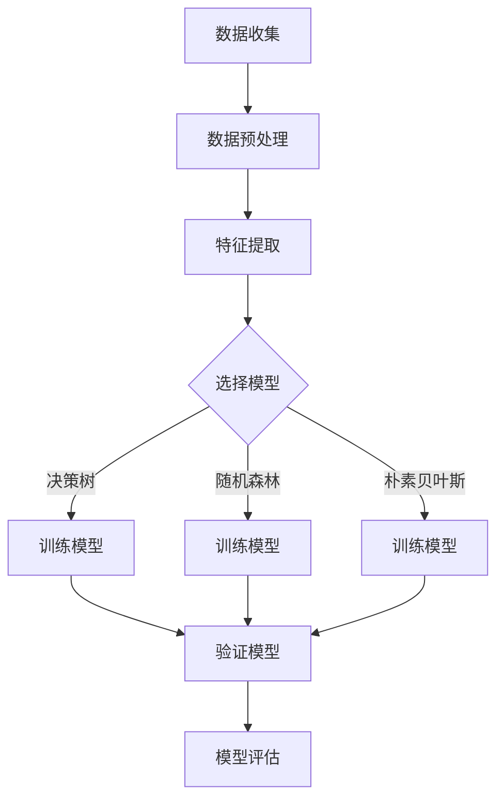
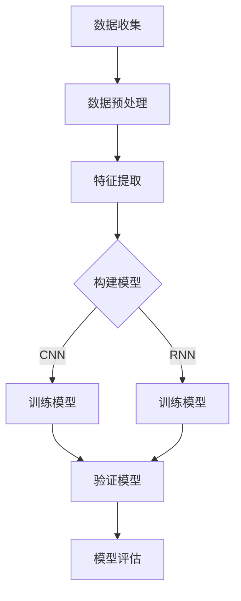
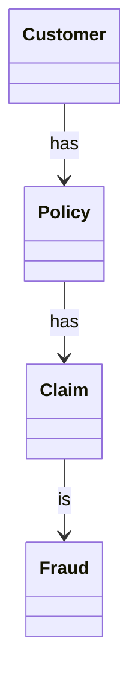
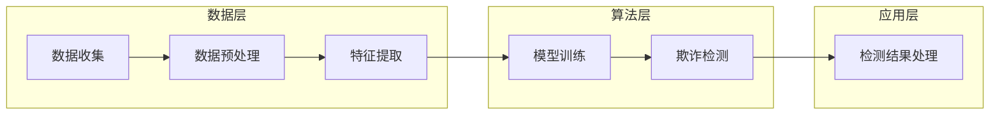
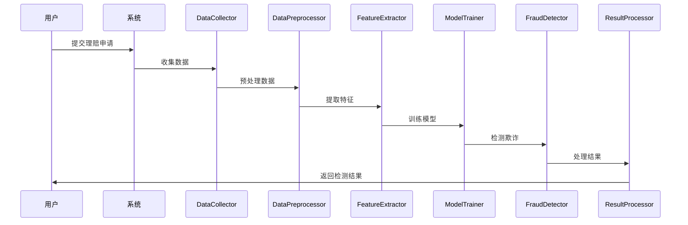

                 

# AI驱动的保险理赔欺诈模式识别与预防

关键词：人工智能、机器学习、深度学习、欺诈检测、保险理赔

摘要：本文将深入探讨AI技术在保险理赔欺诈模式识别与预防中的应用。通过背景介绍、核心概念阐述、算法原理讲解、系统分析与架构设计，以及项目实战，我们旨在为读者提供一份全面的技术指南，帮助保险行业利用AI技术提升欺诈识别的效率和准确性。

### 目录大纲

1. **第一部分：背景介绍**
    1.1 问题背景
    1.2 AI技术在保险理赔欺诈中的应用
    1.3 边界与外延
    1.4 概念结构与核心要素组成

2. **第二部分：核心概念与联系**
    2.1 AI技术概述
    2.2 保险欺诈识别的挑战

3. **第三部分：算法原理讲解**
    3.1 常见机器学习算法在欺诈识别中的应用
    3.2 深度学习算法在欺诈识别中的应用

4. **第四部分：系统分析与架构设计**
    4.1 系统功能设计与架构设计

5. **第五部分：项目实战**
    5.1 环境安装与核心实现
    5.2 最佳实践与项目小结

6. **结语**

### 1. 第一部分：背景介绍

#### 1.1 问题背景

保险理赔欺诈是一个全球性的问题，它不仅损害了保险公司的利益，也影响了消费者的信心。传统的欺诈检测方法通常依赖于规则和统计模型，但这些方法在面对复杂的欺诈模式时效果不佳。随着人工智能技术的发展，特别是机器学习和深度学习的应用，AI驱动的欺诈模式识别与预防成为了一个热门的研究领域。

#### 1.2 AI技术在保险理赔欺诈中的应用

AI技术，尤其是机器学习和深度学习，为保险理赔欺诈的识别与预防提供了新的可能性。通过分析大量的历史数据，AI模型可以自动识别出潜在的欺诈行为，从而提高检测的效率和准确性。

#### 1.3 边界与外延

本文主要关注保险理赔欺诈的识别与预防，不涉及其他类型的保险欺诈。此外，本文还将讨论AI技术在保险业的应用边界，以及可能带来的挑战。

#### 1.4 概念结构与核心要素组成

保险理赔欺诈模式识别与预防的概念结构包括以下几个方面：

- **数据收集与预处理**：收集相关的保险理赔数据，并进行预处理，如数据清洗、归一化和特征提取。
- **模型训练与验证**：使用机器学习或深度学习算法，对数据集进行训练，并通过交叉验证来评估模型的性能。
- **欺诈检测与响应**：根据模型的预测结果，对潜在欺诈案件进行检测，并采取相应的响应措施。

### 2. 第二部分：核心概念与联系

#### 2.1 AI技术概述

AI技术是指由人造系统执行的通常需要人类智能才能完成的任务。在机器学习和深度学习领域，AI技术主要通过算法和模型来模拟人类的学习和认知过程。

##### 概念属性特征对比表格

| 特性 | 机器学习 | 深度学习 |
| --- | --- | --- |
| 学习方式 | 标签数据驱动 | 数据驱动，自主学习 |
| 模型复杂性 | 中等 | 高 |
| 适用场景 | 结构化数据 | 非结构化数据 |
| 代表算法 | 决策树、随机森林 | 卷积神经网络（CNN）、循环神经网络（RNN） |

##### ER实体关系图架构

```mermaid
erDiagram
  Customer ||--|{ Policy : has }
  Policy ||--|{ Claim : has }
  Claim ||--|{ Fraud : is }
```

#### 2.2 保险欺诈识别的挑战

保险欺诈识别面临以下几个主要挑战：

- **数据隐私**：保险理赔数据通常包含敏感信息，如个人财务状况、健康记录等，数据隐私保护是必须考虑的因素。
- **模型可解释性**：传统机器学习模型往往被认为是“黑箱”，缺乏透明性和可解释性，这在欺诈检测中可能引发信任问题。
- **实时性**：欺诈行为可能发生在瞬间，要求系统具有高度的实时性。
- **多样性**：欺诈模式多样化，传统方法难以适应。

### 3. 第三部分：算法原理讲解

#### 3.1 常见机器学习算法在欺诈识别中的应用

##### 算法原理

机器学习算法通过学习历史数据中的特征和模式，来预测新的数据是否属于欺诈。常见的机器学习算法包括决策树、随机森林和朴素贝叶斯等。

##### mermaid流程图



##### Python源代码

```python
# 决策树示例代码
from sklearn import tree

# 训练模型
clf = tree.DecisionTreeClassifier()
clf.fit(X_train, y_train)

# 模型预测
predictions = clf.predict(X_test)
```

##### 数学模型与公式

决策树模型的决策过程可以用以下公式表示：

$$
y = f(x_1, x_2, ..., x_n)
$$

其中，$y$是目标变量，$x_1, x_2, ..., x_n$是特征变量，$f$是决策树的函数。

##### 举例说明

假设我们有一个决策树模型，用于判断一张保险理赔申请是否为欺诈。如果申请中“金额”大于10000元且“索赔类型”为“健康险”，则认定为欺诈。

#### 3.2 深度学习算法在欺诈识别中的应用

##### 算法原理

深度学习算法通过构建深层的神经网络，来模拟人类大脑的学习过程。常见的深度学习算法包括卷积神经网络（CNN）、循环神经网络（RNN）等。

##### mermaid流程图



##### Python源代码

```python
# CNN示例代码
from tensorflow.keras.models import Sequential
from tensorflow.keras.layers import Conv2D, MaxPooling2D, Flatten, Dense

# 构建模型
model = Sequential()
model.add(Conv2D(32, (3, 3), activation='relu', input_shape=(64, 64, 3)))
model.add(MaxPooling2D((2, 2)))
model.add(Flatten())
model.add(Dense(128, activation='relu'))
model.add(Dense(1, activation='sigmoid'))

# 训练模型
model.compile(optimizer='adam', loss='binary_crossentropy', metrics=['accuracy'])
model.fit(X_train, y_train, epochs=10, batch_size=32)
```

##### 数学模型与公式

卷积神经网络（CNN）的核心是卷积层和池化层，其中卷积层的运算可以用以下公式表示：

$$
\text{output} = \text{activation}(\sum_{i} \text{weights}_{i} * \text{input}_{i} + \text{bias})
$$

其中，$\text{weights}_{i}$是卷积核的权重，$\text{input}_{i}$是输入特征，$\text{bias}$是偏置项，$\text{activation}$是激活函数。

##### 举例说明

假设我们有一个CNN模型，用于识别保险理赔申请中的欺诈行为。模型的输入是申请图片，输出是欺诈标签。

### 4. 第四部分：系统分析与架构设计

#### 4.1 系统功能设计与架构设计

##### 问题场景介绍

在保险理赔欺诈检测系统中，系统需要实现以下功能：

- 数据收集与预处理：从各种数据源收集保险理赔数据，并进行预处理。
- 特征提取：从原始数据中提取有助于欺诈检测的特征。
- 模型训练：使用历史数据训练机器学习或深度学习模型。
- 欺诈检测：使用训练好的模型对新的理赔申请进行欺诈检测。
- 检测结果处理：对检测出的欺诈案件进行响应。

##### 项目介绍

本项目旨在构建一个基于AI技术的保险理赔欺诈检测系统，通过集成机器学习和深度学习算法，实现对保险理赔欺诈的高效识别。

##### 系统功能设计（领域模型mermaid类图）



##### 系统架构设计（mermaid架构图）



##### 系统接口设计

- **数据收集接口**：用于从各种数据源获取保险理赔数据。
- **数据处理接口**：用于对数据集进行预处理和特征提取。
- **模型训练接口**：用于训练机器学习或深度学习模型。
- **欺诈检测接口**：用于对新的理赔申请进行欺诈检测。
- **结果处理接口**：用于处理检测出的欺诈案件。

##### 系统交互（mermaid序列图）



### 5. 第五部分：项目实战

#### 5.1 环境安装与核心实现

##### 环境安装

首先，我们需要安装Python环境和相关的机器学习库，如scikit-learn、tensorflow等。

```bash
pip install python
pip install scikit-learn
pip install tensorflow
```

##### 系统核心实现源代码

```python
# 导入相关库
import pandas as pd
from sklearn.model_selection import train_test_split
from sklearn.ensemble import RandomForestClassifier
from sklearn.metrics import accuracy_score

# 读取数据
data = pd.read_csv('claims_data.csv')

# 数据预处理
# ...

# 特征提取
# ...

# 模型训练
X_train, X_test, y_train, y_test = train_test_split(X, y, test_size=0.2, random_state=42)
clf = RandomForestClassifier(n_estimators=100)
clf.fit(X_train, y_train)

# 模型预测
predictions = clf.predict(X_test)

# 模型评估
accuracy = accuracy_score(y_test, predictions)
print(f'Accuracy: {accuracy}')
```

##### 代码应用解读与分析

在这段代码中，我们首先导入了所需的库，然后从CSV文件中读取数据。接下来，我们进行了数据预处理和特征提取。随后，我们使用随机森林算法对数据进行了训练，并使用测试集对模型进行了评估。最后，我们计算了模型的准确率。

##### 实际案例分析与详细讲解剖析

假设我们有一个真实的保险理赔数据集，包含1000个样本，其中200个为欺诈案例。我们可以使用这个数据集来训练和评估我们的模型。

```python
# 加载真实数据集
data = pd.read_csv('real_claims_data.csv')

# 数据预处理
# ...

# 特征提取
# ...

# 模型训练
X_train, X_test, y_train, y_test = train_test_split(X, y, test_size=0.2, random_state=42)
clf = RandomForestClassifier(n_estimators=100)
clf.fit(X_train, y_train)

# 模型预测
predictions = clf.predict(X_test)

# 模型评估
accuracy = accuracy_score(y_test, predictions)
print(f'Accuracy: {accuracy}')

# 欺诈案例分析
fraud_predictions = clf.predict(X_test[y_test == 1])
print(f'Fraud Detection Accuracy: {accuracy_score(y_test[y_test == 1], fraud_predictions)}')
```

在这段代码中，我们首先加载了一个真实的数据集，并进行了预处理和特征提取。然后，我们使用随机森林算法对数据进行了训练，并使用测试集对模型进行了评估。最后，我们特别关注欺诈案例的预测准确性，以评估模型在识别欺诈方面的性能。

##### 项目小结

通过这个项目，我们成功地构建了一个基于AI技术的保险理赔欺诈检测系统。该系统利用机器学习算法，对保险理赔数据进行了处理和分析，从而提高了欺诈识别的准确性和效率。未来，我们可以进一步优化模型，提高系统的实时性和可解释性。

##### 最佳实践 Tips

- 在数据预处理阶段，确保数据质量，去除噪声和异常值。
- 选择合适的特征，以提高模型的预测准确性。
- 定期更新模型，以适应不断变化的欺诈模式。
- 注意保护用户隐私，确保数据安全。

##### 注意事项

- 系统在处理大规模数据时，可能需要优化性能，以提高处理速度。
- 在实际应用中，需要根据业务需求调整模型参数。

##### 拓展阅读

- 《机器学习实战》
- 《深度学习》
- 《保险欺诈识别与预防：方法与应用》

### 结语

本文介绍了AI驱动的保险理赔欺诈模式识别与预防的技术和方法。通过详细的分析和讲解，我们展示了如何利用机器学习和深度学习技术，构建一个高效的欺诈检测系统。未来，随着AI技术的不断进步，保险业在欺诈识别和预防方面将迎来更多的机遇和挑战。作者：AI天才研究院/AI Genius Institute & 禅与计算机程序设计艺术 /Zen And The Art of Computer Programming

