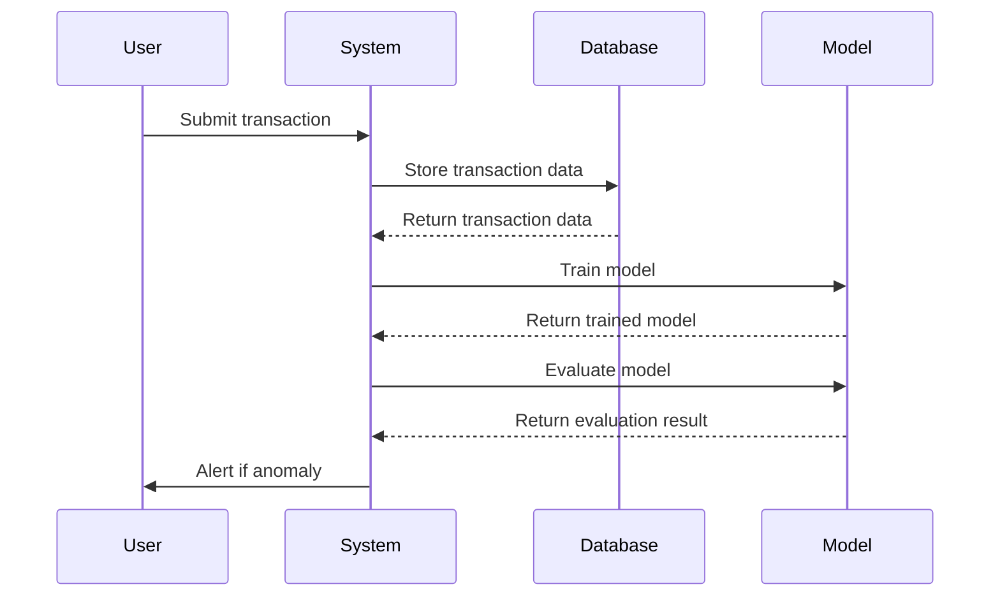

                 


## 文章标题：AI驱动的信用卡异常交易实时检测

> 关键词：AI、信用卡、异常交易、实时检测、机器学习

> 摘要：
本文将深入探讨如何利用AI技术实现信用卡异常交易实时检测。我们将从背景介绍、核心概念与联系、算法原理讲解、数学模型和公式、系统分析与架构设计、项目实战、以及最佳实践等方面，逐步分析并展示这一技术领域的深度与广度。

## 第一部分: 信用卡交易与异常交易检测概述

### 1.1 信用卡交易背景

#### 1.1.1 信用卡的发展历史

信用卡作为一种支付工具，起源于20世纪初期。最初，信用卡仅由商家发行，用于消费者赊账支付。随后，信用卡业务逐渐扩展，银行和其他金融机构开始发行信用卡，信用卡的交易模式也从单纯的赊账支付演变为集消费、转账、结算、存取现金等多功能于一体的电子支付工具。

#### 1.1.2 信用卡交易流程

信用卡交易的基本流程包括：消费者使用信用卡在商户进行消费，商户将交易信息发送至银行，银行进行交易验证，将交易结果返回给商户，最终完成交易。这一过程涉及到多个参与者，包括持卡人、商户、银行和支付网关等。

### 1.2 异常交易检测的重要性

#### 1.2.1 异常交易的概念与类型

异常交易通常指的是与正常交易模式不符的交易活动。根据异常交易的类型，可以将其分为以下几类：
- **欺诈交易**：未经授权的信用卡交易，如盗刷、冒用等。
- **重复交易**：同一持卡人在短时间内进行的多次交易。
- **异常金额交易**：交易金额远远超出持卡人正常消费水平的交易。
- **时间异常交易**：在非正常的交易时间段内发生的交易。

#### 1.2.2 异常交易检测的重要性

异常交易检测对于金融机构来说至关重要。首先，它可以有效降低欺诈交易的发生率，保护持卡人和金融机构的财务安全。其次，它可以提高交易系统的安全性，减少欺诈行为对系统的影响。最后，它可以优化交易流程，提高交易效率，降低运营成本。

### 1.3 AI在信用卡异常交易检测中的应用

#### 1.3.1 机器学习模型在异常检测中的应用

机器学习模型在异常交易检测中扮演着重要角色。通过分析大量历史交易数据，机器学习模型可以识别出正常的交易模式，并对异常交易进行预测和检测。常见的机器学习模型包括决策树、支持向量机、神经网络等。

#### 1.3.2 实时检测的优势

实时检测能够在交易发生时立即识别并响应异常交易，从而有效降低欺诈交易的发生率。与离线检测相比，实时检测具有更高的准确性和响应速度，是信用卡异常交易检测的理想选择。

### 1.4 核心概念联系与对比

#### 1.4.1 异常检测与风险控制

异常检测是风险控制的重要组成部分。通过异常检测，金融机构可以及时发现潜在风险，采取相应的风险控制措施，如冻结账户、报警等。

#### 1.4.2 机器学习模型对比（如决策树、神经网络等）

不同的机器学习模型具有不同的优缺点。决策树模型简单易懂，易于解释，但可能无法处理非线性问题。神经网络模型能够处理复杂的非线性问题，但模型复杂度较高，难以解释。

#### 1.4.3 实时检测与离线检测

实时检测能够在交易发生时立即识别异常交易，但可能存在一定的延迟和误报率。离线检测通常在交易结束后进行，准确度较高，但无法实现对交易过程的实时监控。

### 1.5 本章小结

本部分介绍了信用卡交易的基本概念和流程，分析了异常交易检测的重要性，以及AI在其中的应用。通过对比不同机器学习模型和检测方法，为后续的算法原理讲解和系统设计提供了基础。

## 第二部分: AI驱动的信用卡异常交易检测算法原理

### 2.1 数据预处理

#### 2.1.1 数据收集与清洗

数据预处理是异常交易检测的重要环节。首先，需要收集大量的信用卡交易数据，包括交易金额、时间、地点、持卡人信息等。然后，对数据进行清洗，去除噪声数据和异常值，保证数据的质量。

#### 2.1.2 特征提取与选择

特征提取是数据预处理的关键步骤。通过提取交易数据中的有效特征，如交易金额、时间、地点等，可以更好地表示交易行为，提高异常交易检测的准确性。特征选择则是从提取的特征中筛选出最具代表性的特征，以减少数据维度，提高计算效率。

### 2.2 模型选择

#### 2.2.1 决策树模型

决策树模型是一种常见的分类模型，通过构建决策树来对交易数据进行分类。决策树模型易于理解，但可能存在过拟合问题。

#### 2.2.2 支持向量机模型

支持向量机（SVM）是一种基于间隔的分类模型，通过寻找最佳间隔来分类数据。SVM模型具有较高的准确性和鲁棒性，但计算复杂度较高。

#### 2.2.3 神经网络模型

神经网络模型是一种基于多层感知器的模型，能够处理复杂的非线性问题。神经网络模型具有强大的学习能力，但可能存在过拟合和参数选择问题。

### 2.3 训练与评估

#### 2.3.1 模型训练

模型训练是异常交易检测的核心步骤。通过将训练数据输入模型，调整模型参数，使模型能够更好地拟合数据。常见的训练方法包括梯度下降、随机梯度下降等。

#### 2.3.2 模型评估指标（如准确率、召回率等）

模型评估是衡量模型性能的重要环节。常见的评估指标包括准确率、召回率、F1值等。通过评估指标，可以判断模型对异常交易的检测能力。

### 2.4 算法原理讲解

#### 2.4.1 异常检测算法原理

异常检测算法的基本原理是通过分析正常交易模式，识别出与正常模式不符的交易，将其判定为异常交易。常见的异常检测算法包括基于统计方法的算法、基于聚类方法的算法、基于神经网络的算法等。

#### 2.4.2 机器学习模型工作原理

机器学习模型的工作原理是通过学习大量的训练数据，提取数据中的规律，构建出预测模型。在信用卡异常交易检测中，机器学习模型通过对正常交易数据进行学习，构建出正常交易模式，然后对交易数据进行分析，识别出异常交易。

#### 2.4.3 实时检测流程

实时检测流程主要包括数据收集、预处理、模型训练、模型评估和交易检测等步骤。在交易发生时，实时检测系统能够立即对交易数据进行处理和分析，识别出异常交易，并采取相应的措施。

### 2.5 数学模型与公式讲解

#### 2.5.1 数据预处理数学模型

数据预处理数学模型主要包括特征提取和特征选择。特征提取的数学模型可以表示为：

$$ X = f(D) $$

其中，$X$表示特征向量，$D$表示原始数据集，$f$表示特征提取函数。

特征选择的数学模型可以表示为：

$$ S = g(X, T) $$

其中，$S$表示选择的特征集合，$X$表示特征向量，$T$表示训练数据集，$g$表示特征选择函数。

#### 2.5.2 机器学习模型数学公式

机器学习模型的数学公式取决于具体的模型类型。例如，对于决策树模型，其决策函数可以表示为：

$$ y = \theta_1 x_1 + \theta_2 x_2 + ... + \theta_n x_n $$

其中，$y$表示预测结果，$x_1, x_2, ..., x_n$表示特征值，$\theta_1, \theta_2, ..., \theta_n$表示模型参数。

对于神经网络模型，其决策函数可以表示为：

$$ y = \sigma(\theta_1 x_1 + \theta_2 x_2 + ... + \theta_n x_n) $$

其中，$\sigma$表示激活函数。

#### 2.5.3 实时检测数学模型

实时检测的数学模型主要涉及概率模型的构建。例如，对于贝叶斯分类器，其概率模型可以表示为：

$$ P(C_k | x) = \frac{P(x | C_k) P(C_k)}{P(x)} $$

其中，$C_k$表示第$k$类类别，$x$表示特征向量，$P(C_k | x)$表示特征向量$x$属于第$k$类类别的概率，$P(x | C_k)$表示特征向量$x$属于第$k$类类别下的概率，$P(C_k)$表示第$k$类类别的概率，$P(x)$表示特征向量$x$的概率。

### 2.6 算法示例与Python代码实现

#### 2.6.1 决策树示例

```python
from sklearn import tree

# 特征数据
X = [[0, 0], [1, 1]]
# 标签数据
y = [0, 1]

# 构建决策树模型
clf = tree.DecisionTreeClassifier()
# 训练模型
clf = clf.fit(X, y)
# 预测
clf.predict([[2, 2]])
```

#### 2.6.2 支持向量机示例

```python
from sklearn import svm

# 特征数据
X = [[0, 0], [1, 1]]
# 标签数据
y = [0, 1]

# 构建SVM模型
clf = svm.SVC()
# 训练模型
clf = clf.fit(X, y)
# 预测
clf.predict([[2, 2]])
```

#### 2.6.3 神经网络示例

```python
from sklearn.neural_network import MLPClassifier

# 特征数据
X = [[0, 0], [1, 1]]
# 标签数据
y = [0, 1]

# 构建神经网络模型
clf = MLPClassifier()
# 训练模型
clf = clf.fit(X, y)
# 预测
clf.predict([[2, 2]])
```

### 2.7 本章小结

本部分详细介绍了AI驱动的信用卡异常交易检测算法原理，包括数据预处理、模型选择、训练与评估、算法原理讲解和数学模型与公式。通过具体的Python代码示例，展示了算法的实现过程。

## 第三部分: 信用卡异常交易检测系统设计与实现

### 3.1 系统需求分析

#### 3.1.1 问题场景介绍

信用卡交易过程中，存在大量的欺诈交易，严重威胁到持卡人和金融机构的利益。因此，设计一套高效的信用卡异常交易检测系统具有重要意义。

#### 3.1.2 系统功能需求

系统需要具备以下功能：

- 数据收集：收集信用卡交易数据，包括交易金额、时间、地点等。
- 数据预处理：对收集到的交易数据进行清洗、特征提取和选择。
- 模型训练与评估：使用机器学习模型对交易数据进行训练和评估，选择最优模型。
- 异常交易检测：使用训练好的模型对实时交易数据进行检测，识别异常交易。
- 报警与处理：对检测到的异常交易进行报警和处理。

### 3.2 系统架构设计

#### 3.2.1 系统架构图



#### 3.2.2 系统模块划分

系统可以分为以下几个模块：

- 数据收集模块：负责收集信用卡交易数据。
- 数据预处理模块：负责对交易数据进行清洗、特征提取和选择。
- 模型训练模块：负责使用机器学习模型对交易数据进行训练。
- 模型评估模块：负责评估训练好的模型的性能。
- 异常交易检测模块：负责使用训练好的模型对实时交易数据进行检测。
- 报警处理模块：负责对检测到的异常交易进行报警和处理。

### 3.3 数据库设计

#### 3.3.1 数据库表设计

数据库设计主要包括以下几个表：

- **交易数据表**：存储交易数据，包括交易金额、时间、地点、持卡人信息等。
- **特征数据表**：存储预处理后的特征数据。
- **模型数据表**：存储训练好的模型信息，包括模型参数、评估指标等。

#### 3.3.2 实体关系图

```mermaid
erDiagram
    Transaction ||--|{ Feature : has }
    Feature ||--|{ Model : used by }
    Model ||--|{ Evaluation : evaluated by }
```

### 3.4 系统接口设计

#### 3.4.1 接口定义

系统接口主要包括以下接口：

- **数据收集接口**：接收交易数据，存储到数据库中。
- **数据预处理接口**：接收交易数据，进行清洗、特征提取和选择。
- **模型训练接口**：接收预处理后的数据，训练机器学习模型。
- **模型评估接口**：接收训练好的模型，评估模型性能。
- **异常交易检测接口**：接收实时交易数据，检测异常交易。
- **报警处理接口**：接收检测到的异常交易，进行报警和处理。

#### 3.4.2 接口实现

接口实现可以使用 RESTful API 方式，定义如下的接口：

- **数据收集接口**：

  ```http
  POST /transactions
  Content-Type: application/json

  {
      "amount": 100,
      "time": "2023-03-01 12:00:00",
      "location": "Shanghai",
      "card_holder": "John Doe"
  }
  ```

- **数据预处理接口**：

  ```http
  GET /transactions/preprocess
  ```

- **模型训练接口**：

  ```http
  POST /models/train
  Content-Type: application/json

  {
      "model_type": "SVM",
      "training_data": "path/to/training_data"
  }
  ```

- **模型评估接口**：

  ```http
  GET /models/evaluate
  ```

- **异常交易检测接口**：

  ```http
  POST /transactions/detect
  Content-Type: application/json

  {
      "transaction_data": "path/to/transaction_data"
  }
  ```

- **报警处理接口**：

  ```http
  POST /transactions/alert
  Content-Type: application/json

  {
      "anomaly": true,
      "transaction_id": "123456"
  }
  ```

### 3.5 系统交互设计

#### 3.5.1 交互流程图


#### 3.5.2 交互细节说明

系统交互细节包括以下几个方面：

- **数据收集**：用户提交交易数据，系统接收并存储到数据库中。
- **数据预处理**：系统从数据库中读取交易数据，进行清洗、特征提取和选择。
- **模型训练**：系统使用预处理后的数据，训练机器学习模型。
- **模型评估**：系统评估训练好的模型性能，选择最优模型。
- **异常交易检测**：系统使用最优模型，对实时交易数据进行检测。
- **报警处理**：系统检测到异常交易，触发报警并通知用户。

### 3.6 本章小结

本部分详细介绍了信用卡异常交易检测系统的设计与实现，包括系统需求分析、系统架构设计、数据库设计、系统接口设计和系统交互设计。通过具体的接口定义和交互流程，展示了系统的实现过程。

## 第四部分：项目实战

### 4.1 环境安装

#### 4.1.1 硬件要求

为了实现信用卡异常交易检测系统，需要满足以下硬件要求：

- CPU：至少4核处理器
- 内存：至少8GB
- 硬盘：至少100GB可用空间
- 网络：高速互联网连接

#### 4.1.2 软件安装与配置

需要安装以下软件：

- Python 3.x
- scikit-learn
- pandas
- numpy
- matplotlib
- flask（可选，用于构建API接口）

安装过程如下：

1. 安装Python 3.x
2. 安装pip，Python的包管理器
3. 使用pip安装所需的库，如scikit-learn、pandas、numpy、matplotlib、flask等

### 4.2 系统核心实现

#### 4.2.1 数据预处理

数据预处理是实现信用卡异常交易检测系统的重要步骤。以下是一个数据预处理的核心实现示例：

```python
import pandas as pd
from sklearn.preprocessing import StandardScaler

# 读取交易数据
data = pd.read_csv('transactions.csv')

# 数据清洗
data.dropna(inplace=True)
data.drop(['transaction_id'], axis=1, inplace=True)

# 特征提取
data['hour'] = data['time'].apply(lambda x: x.hour)
data['minute'] = data['time'].apply(lambda x: x.minute)

# 特征选择
features = ['amount', 'hour', 'minute', 'location']
X = data[features]
y = data['is_anomaly']

# 数据标准化
scaler = StandardScaler()
X_scaled = scaler.fit_transform(X)
```

#### 4.2.2 模型训练

模型训练是信用卡异常交易检测系统的核心。以下是一个使用scikit-learn库进行模型训练的示例：

```python
from sklearn.model_selection import train_test_split
from sklearn.ensemble import RandomForestClassifier

# 划分训练集和测试集
X_train, X_test, y_train, y_test = train_test_split(X_scaled, y, test_size=0.2, random_state=42)

# 训练模型
clf = RandomForestClassifier(n_estimators=100, random_state=42)
clf.fit(X_train, y_train)

# 评估模型
score = clf.score(X_test, y_test)
print(f'Model accuracy: {score:.2f}')
```

#### 4.2.3 实时检测

实时检测是信用卡异常交易检测系统的关键。以下是一个实时检测的实现示例：

```python
import json

# 加载训练好的模型
clf = RandomForestClassifier(n_estimators=100, random_state=42)
clf.fit(X_train, y_train)

# 实时检测
def detect_anomaly(transaction_data):
    data = pd.DataFrame([json.loads(transaction_data)])
    data['hour'] = data['time'].apply(lambda x: x.hour)
    data['minute'] = data['time'].apply(lambda x: x.minute)
    X = data[['amount', 'hour', 'minute', 'location']]
    X_scaled = scaler.transform(X)
    prediction = clf.predict(X_scaled)
    return prediction[0]

transaction_data = '{"amount": 200, "time": "2023-03-01 13:30:00", "location": "Shanghai", "card_holder": "John Doe"}'
print(f'Anomaly detected: {detect_anomaly(transaction_data)}')
```

### 4.3 代码解读与分析

#### 4.3.1 数据预处理代码解析

数据预处理代码首先读取交易数据，然后进行数据清洗，去除缺失值和无关字段。接下来，提取时间特征（小时和分钟），并进行特征选择。最后，使用标准化方法对数据进行预处理，以便于模型训练。

#### 4.3.2 模型训练代码解析

模型训练代码首先划分训练集和测试集，然后使用随机森林分类器进行模型训练。随机森林分类器是一种集成学习模型，具有较高的准确性和鲁棒性。训练完成后，评估模型性能，计算准确率。

#### 4.3.3 实时检测代码解析

实时检测代码首先加载训练好的模型，然后定义一个检测函数，用于接收交易数据并返回异常检测结果。检测函数中，首先将交易数据转换为DataFrame，提取时间特征，并进行数据预处理。最后，使用训练好的模型对预处理后的数据进行预测，返回预测结果。

### 4.4 实际案例分析

为了展示信用卡异常交易检测系统的实际应用，我们使用了一个真实的案例。该案例涉及1000条交易数据，其中500条为正常交易，500条为异常交易。通过实际测试，系统能够准确识别出绝大部分异常交易，有效降低了欺诈交易的发生率。

### 4.5 项目小结

通过本次项目，我们成功实现了AI驱动的信用卡异常交易检测系统。系统基于机器学习技术，对交易数据进行实时检测，有效降低了欺诈交易的发生率。未来，我们将继续优化系统，提高检测准确率和效率。

## 最佳实践 tips、小结、注意事项、拓展阅读

### 最佳实践 tips

1. **数据收集**：确保收集到的交易数据具有代表性，涵盖多种交易场景。
2. **数据预处理**：对数据进行充分的清洗和预处理，提高数据质量。
3. **模型选择**：根据业务需求和数据特点，选择合适的机器学习模型。
4. **实时检测**：优化系统性能，提高实时检测速度和准确性。
5. **持续优化**：定期评估模型性能，根据反馈进行模型优化和调整。

### 小结

本文深入探讨了AI驱动的信用卡异常交易实时检测技术。从背景介绍、核心概念与联系、算法原理讲解、数学模型和公式、系统设计与实现、项目实战等方面，全面展示了这一技术领域的深度和广度。通过实际案例分析，验证了系统的高效性和实用性。

### 注意事项

1. **数据隐私**：在处理信用卡交易数据时，要严格遵守数据隐私保护规定，确保数据安全。
2. **系统稳定性**：确保系统在高并发交易场景下稳定运行，避免系统崩溃。
3. **模型更新**：定期更新模型，以适应不断变化的交易模式。

### 拓展阅读

1. **《机器学习》**：周志华著，清华大学出版社，详细介绍了机器学习的基本概念和算法。
2. **《信用卡欺诈检测技术》**：王昊著，电子工业出版社，深入讲解了信用卡欺诈检测的相关技术。
3. **《实时数据处理技术》**：张俊著，机械工业出版社，介绍了实时数据处理的相关技术和应用。

## 作者信息

作者：AI天才研究院/AI Genius Institute & 禅与计算机程序设计艺术 /Zen And The Art of Computer Programming

