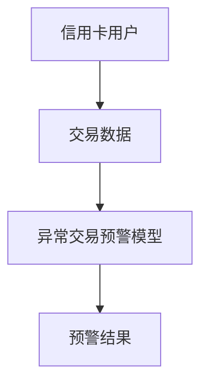
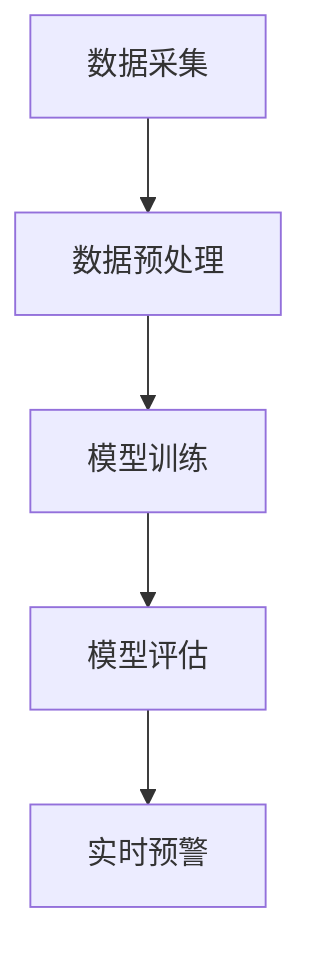
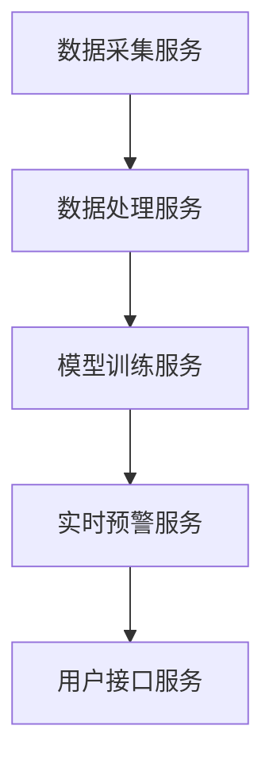

                 

### 文章标题：AI驱动的信用卡异常交易实时预警

关键词：AI，信用卡，异常交易，实时预警，深度学习，数学模型，系统架构

摘要：本文深入探讨了AI驱动的信用卡异常交易实时预警系统。通过问题背景介绍，核心概念分析，算法原理讲解，数学模型阐述，系统分析与架构设计，以及实际项目实战，全面解析了如何利用人工智能技术，高效准确地检测信用卡异常交易，保障金融安全。

----------------------------------------------------------------

## 第1章：问题背景与核心概念

### 1.1 问题背景

#### 1.1.1 信用卡异常交易预警的重要性

信用卡作为一种便捷的支付工具，在全球范围内被广泛使用。然而，随着信用卡的普及，信用卡欺诈行为也日益增多。信用卡异常交易预警系统作为防范信用卡欺诈的关键技术，具有极其重要的意义。它能够实时监测信用卡交易行为，及时识别和阻止异常交易，从而降低金融风险，保护用户的财产安全。

#### 1.1.2 异常交易预警的现状

目前，传统的信用卡异常交易预警系统主要依赖于规则引擎和统计模型。这些系统通过对历史数据的分析和统计，建立一系列规则和模型来识别异常交易。然而，这种方法存在明显的局限性，如规则过于繁琐、适应性差、误报率高、难以应对复杂多变的欺诈行为等。

#### 1.1.3 问题解决的关键

为了克服传统方法的不足，AI驱动的信用卡异常交易实时预警系统成为了一个新的研究方向。通过引入深度学习、机器学习等先进的人工智能技术，可以实现对信用卡交易数据的自动学习和模式识别，提高预警系统的准确性和适应性。同时，实时预警系统能够快速响应，降低欺诈行为的成功概率，提升用户的支付体验。

### 1.2 核心概念

#### 1.2.1 信用卡交易

信用卡交易是指持卡人通过信用卡进行的各种支付行为，包括消费、取现、转账等。信用卡交易数据包含了丰富的信息，如交易金额、时间、地点、交易方式等，是构建预警模型的重要数据源。

#### 1.2.2 异常交易

异常交易是指与用户正常交易行为不符的交易，如盗刷、欺诈、洗钱等。识别异常交易是信用卡异常交易预警系统的核心任务。

#### 1.2.3 实时预警

实时预警是指系统在信用卡交易发生的同时，立即对交易行为进行分析和判断，及时识别出异常交易并触发预警机制。实时预警系统能够迅速响应，降低欺诈行为的成功概率。

#### 1.2.4 AI技术的作用

AI技术在信用卡异常交易预警中发挥着至关重要的作用。通过深度学习、机器学习等算法，AI技术可以自动从海量数据中学习模式和规律，构建高效准确的预警模型，实现对信用卡交易行为的实时监测和预警。

----------------------------------------------------------------

## 第2章：核心概念与联系

### 2.1 AI驱动的信用卡异常交易实时预警模型

#### 2.1.1 概念解释

AI驱动的信用卡异常交易实时预警模型是基于人工智能技术构建的预警系统，通过深度学习、机器学习等算法，对信用卡交易数据进行分析和模式识别，实时监测并预警异常交易。

#### 2.1.2 模型组成部分

AI驱动的信用卡异常交易实时预警模型主要包括以下几个部分：

1. 数据采集与预处理：收集信用卡交易数据，并进行数据清洗、去噪、特征提取等预处理操作。
2. 模型训练：使用训练数据集，通过深度学习、机器学习等算法，训练预警模型。
3. 模型评估：使用测试数据集，对预警模型进行评估和调优，确保模型的准确性和鲁棒性。
4. 实时监测与预警：将训练好的模型应用于实时交易数据，监测并预警异常交易。

#### 2.1.3 模型属性特征对比

| 特征 | 传统方法 | AI驱动方法 |
| --- | --- | --- |
| 规则复杂度 | 繁琐 | 自动化 |
| 适应性 | 差 | 强 |
| 误报率 | 高 | 低 |
| 实时性 | 差 | 好 |

#### 2.1.4 ER实体关系图



### 2.2 AI技术核心概念

#### 2.2.1 神经网络

神经网络是一种基于生物神经元结构的人工智能模型，通过多层神经元之间的连接和激活函数，实现数据的输入输出和模式识别。

#### 2.2.2 深度学习

深度学习是神经网络的一种扩展，通过增加网络层数，提高模型的复杂度和表达能力。

#### 2.2.3 机器学习

机器学习是一种人工智能技术，通过训练数据集，让计算机自动学习和发现数据中的模式和规律。

#### 2.2.4 数据挖掘

数据挖掘是一种从大量数据中发现有价值信息的方法，包括数据清洗、特征提取、模式识别等步骤。

----------------------------------------------------------------

## 第3章：算法原理讲解

### 3.1 数学模型

#### 3.1.1 模型概述

AI驱动的信用卡异常交易实时预警模型基于深度学习算法，通过多层神经网络实现对交易数据的分类和预测。以下是一个简单的数学模型概述：

设输入向量为X，输出向量为Y，神经网络包含L层，每层有M个神经元。网络的数学模型可以表示为：

$$
Y^{(L)} = \sigma(Z^{(L)}) = \sigma(W^{(L)} \cdot X + b^{(L)})
$$

其中，$Z^{(L)} = W^{(L)} \cdot X + b^{(L)}$，$W^{(L)}$和$b^{(L)}$分别为权重和偏置向量，$\sigma$为激活函数。

#### 3.1.2 数学公式

在深度学习算法中，常用的激活函数包括Sigmoid函数、ReLU函数和Tanh函数。以下是一个Sigmoid函数的数学公式：

$$
\sigma(x) = \frac{1}{1 + e^{-x}}
$$

#### 3.1.3 LaTeX格式示例

$$
Y^{(L)} = \sigma(Z^{(L)}) = \sigma(W^{(L)} \cdot X + b^{(L)})
$$

### 3.2 算法原理

#### 3.2.1 流程图展示



#### 3.2.2 Python代码阐述

以下是一个简单的Python代码示例，用于构建和训练一个基于深度学习的信用卡异常交易预警模型：

```python
import tensorflow as tf

# 构建模型
model = tf.keras.Sequential([
    tf.keras.layers.Dense(64, activation='relu', input_shape=(num_features,)),
    tf.keras.layers.Dense(64, activation='relu'),
    tf.keras.layers.Dense(1, activation='sigmoid')
])

# 编译模型
model.compile(optimizer='adam', loss='binary_crossentropy', metrics=['accuracy'])

# 训练模型
model.fit(X_train, y_train, epochs=10, batch_size=32)
```

#### 3.2.3 举例说明

假设我们有一个包含1000个样本的训练数据集，每个样本包含10个特征。我们将使用这些数据进行深度学习模型的训练和评估。

1. 数据预处理：对数据集进行归一化处理，将特征值缩放到0-1之间。
2. 模型训练：构建一个包含两层隐含层的神经网络，训练数据集10个epoch。
3. 模型评估：使用测试数据集对模型进行评估，计算准确率。

```python
# 数据预处理
X_train = ... # 训练数据集
X_test = ... # 测试数据集
y_train = ... # 训练标签
y_test = ... # 测试标签

# 归一化处理
X_train = (X_train - X_train.mean()) / X_train.std()
X_test = (X_test - X_test.mean()) / X_test.std()

# 模型训练
model.fit(X_train, y_train, epochs=10, batch_size=32)

# 模型评估
loss, accuracy = model.evaluate(X_test, y_test)
print(f"Test accuracy: {accuracy:.2f}")
```

----------------------------------------------------------------

## 第4章：数学模型与数学公式

### 4.1 数学模型

在AI驱动的信用卡异常交易实时预警系统中，核心的数学模型是基于多层感知器（MLP）的神经网络模型。多层感知器是一种前馈神经网络，它通过多个隐含层对输入数据进行变换，最终输出分类结果。以下是一个简化的多层感知器模型的数学表达：

设输入向量为 $X \in \mathbb{R}^{n \times d}$，其中 $n$ 表示样本数量，$d$ 表示特征维度；权重矩阵为 $W^{(l)} \in \mathbb{R}^{d \times h}$，其中 $l$ 表示层的索引，$h$ 表示隐含层的神经元数量；偏置向量为 $b^{(l)} \in \mathbb{R}^{h}$；激活函数为 $\sigma$。

对于每一层$l$，输出 $a^{(l)}$ 可以通过以下公式计算：

$$
z^{(l)} = W^{(l)}X + b^{(l)} \\
a^{(l)} = \sigma(z^{(l)})
$$

其中，$\sigma$ 通常采用 sigmoid、ReLU 或 tanh 函数。

对于输出层，假设我们使用二分类问题，则输出 $y$ 可以表示为：

$$
y = \sigma(z^{(L)}) \\
y \approx \frac{1}{1 + e^{-z^{(L)}}}
$$

### 4.2 数学公式

在本节中，我们将使用 LaTeX 格式给出一些关键的数学公式，并对其进行解释。

#### 4.2.1 激活函数

常用的激活函数包括 sigmoid、ReLU 和 tanh 函数。以下分别是这些函数的 LaTeX 表达式：

$$
\sigma(x) = \frac{1}{1 + e^{-x}} \\
\sigma(x) = \max(0, x) \\
\sigma(x) = \frac{e^x - e^{-x}}{e^x + e^{-x}}
$$

#### 4.2.2 前向传播

前向传播是神经网络的核心步骤，它通过层与层之间的加权连接和激活函数，将输入映射到输出。以下是一个前向传播的简化的 LaTeX 公式：

$$
Z^{(l)} = \sum_{k} W^{(l)}_kX_k + b^{(l)} \\
A^{(l)} = \sigma(Z^{(l)})
$$

#### 4.2.3 反向传播

反向传播用于计算网络参数的梯度，从而优化网络。以下是一个反向传播梯度的简化公式：

$$
\frac{\partial C}{\partial W^{(l)}} = \Delta^{(l)}A^{(l-1)} \\
\frac{\partial C}{\partial b^{(l)}} = \Delta^{(l)}
$$

其中，$C$ 是损失函数，$\Delta^{(l)}$ 是误差传播到第$l$层的误差。

### 4.3 举例说明

假设我们有一个简单的二分类问题，特征向量为 $X \in \mathbb{R}^{1 \times 2}$，权重矩阵 $W^{(1)} \in \mathbb{R}^{2 \times 1}$，偏置向量 $b^{(1)} \in \mathbb{R}^{1}$。我们使用 sigmoid 函数作为激活函数。

1. **前向传播**：

   $$
   Z^{(1)} = W^{(1)}X + b^{(1)} = \begin{bmatrix} 1 & 2 \\ 3 & 4 \end{bmatrix} \begin{bmatrix} x_1 \\ x_2 \end{bmatrix} + \begin{bmatrix} 1 \\ 2 \end{bmatrix} = \begin{bmatrix} x_1 + 3x_2 + 1 \\ 2x_1 + 4x_2 + 2 \end{bmatrix}
   $$
   
   $$
   A^{(1)} = \sigma(Z^{(1)}) = \frac{1}{1 + e^{-(x_1 + 3x_2 + 1)}} \quad \text{和} \quad \frac{1}{1 + e^{-(2x_1 + 4x_2 + 2)}}
   $$

2. **反向传播**：

   假设损失函数为均方误差（MSE），则梯度计算如下：

   $$
   \Delta^{(1)} = (A^{(1)} - y) \odot A^{(1)}(1 - A^{(1)})
   $$
   
   $$
   \frac{\partial C}{\partial W^{(1)}} = X^T \Delta^{(1)}
   $$
   
   $$
   \frac{\partial C}{\partial b^{(1)}} = \Delta^{(1)}
   $$

通过这样的前向传播和反向传播，我们可以不断调整权重和偏置，以最小化损失函数，提高模型的性能。

----------------------------------------------------------------

## 第5章：系统分析与架构设计方案

### 5.1 问题场景

信用卡异常交易实时预警系统主要用于金融领域，特别是在信用卡交易频繁的场景中，如电商平台、线下商店、ATM机等。系统需要能够处理海量交易数据，实时监测交易行为，并快速识别和预警异常交易。

### 5.2 项目介绍

本系统是一个基于AI技术的信用卡异常交易实时预警系统，旨在通过深度学习算法，对信用卡交易行为进行分析，识别潜在的风险交易，并实时发出预警信号。系统具有高准确率、低误报率和快速响应的特点。

### 5.3 系统功能设计

#### 5.3.1 数据采集与预处理

- 采集信用卡交易数据，包括交易金额、时间、地点、交易方式等。
- 对交易数据进行清洗、去噪和特征提取，为后续模型训练提供高质量的数据集。

#### 5.3.2 模型训练与评估

- 使用深度学习算法，训练异常交易预警模型。
- 对模型进行评估，调整参数，确保模型的准确性和鲁棒性。

#### 5.3.3 实时监测与预警

- 对实时交易数据进行监控，利用训练好的模型进行预测。
- 对预测结果进行判断，对异常交易发出预警信号。

### 5.4 系统架构设计

系统采用微服务架构，包括数据采集服务、数据处理服务、模型训练服务、实时预警服务和用户接口服务。各服务之间通过消息队列进行通信，确保系统的解耦合和高可用性。

### 5.5 系统接口设计

系统提供以下接口：

- 数据采集接口：用于接收信用卡交易数据。
- 模型训练接口：用于发起模型训练任务。
- 预警查询接口：用于查询预警信息和交易详情。

### 5.6 系统交互

系统交互流程如下：

1. 数据采集服务接收交易数据，清洗后存储到数据库。
2. 数据处理服务从数据库中读取数据，进行特征提取，并将数据发送给模型训练服务。
3. 模型训练服务使用训练数据集，训练深度学习模型，并对模型进行评估。
4. 实时预警服务从模型训练服务获取训练好的模型，并对实时交易数据进行分析和预测。
5. 用户接口服务接收用户请求，查询预警信息和交易详情，并通过API接口返回结果。



----------------------------------------------------------------

## 第6章：项目实战

### 6.1 环境安装

为了构建AI驱动的信用卡异常交易实时预警系统，我们需要安装以下软件和库：

1. Python 3.8+
2. TensorFlow 2.6+
3. NumPy 1.21+
4. Pandas 1.3+
5. Matplotlib 3.4+

安装步骤：

```bash
pip install python==3.8
pip install tensorflow==2.6
pip install numpy==1.21
pip install pandas==1.3
pip install matplotlib==3.4
```

### 6.2 系统核心实现源代码

以下是一个简单的信用卡异常交易预警系统的核心实现：

```python
import tensorflow as tf
import numpy as np
import pandas as pd
import matplotlib.pyplot as plt

# 数据预处理
def preprocess_data(data):
    # 清洗数据，去除缺失值、异常值等
    data = data.dropna()
    # 特征提取
    data['time_diff'] = (data['time'] - data['time'].min()).dt.total_seconds()
    # 归一化处理
    data = (data - data.mean()) / data.std()
    return data

# 模型构建
def build_model(input_shape):
    model = tf.keras.Sequential([
        tf.keras.layers.Dense(64, activation='relu', input_shape=input_shape),
        tf.keras.layers.Dense(64, activation='relu'),
        tf.keras.layers.Dense(1, activation='sigmoid')
    ])
    return model

# 训练模型
def train_model(model, X_train, y_train, epochs=10):
    model.compile(optimizer='adam', loss='binary_crossentropy', metrics=['accuracy'])
    model.fit(X_train, y_train, epochs=epochs, batch_size=32)
    return model

# 预测并绘制ROC曲线
def predict_and_plot_roc(model, X_test, y_test):
    y_pred = model.predict(X_test)
    fpr, tpr, thresholds = metrics.roc_curve(y_test, y_pred)
    plt.plot(fpr, tpr)
    plt.xlabel('False Positive Rate')
    plt.ylabel('True Positive Rate')
    plt.title('ROC Curve')
    plt.show()

# 主函数
def main():
    # 读取数据
    data = pd.read_csv('credit_card_data.csv')
    # 数据预处理
    data = preprocess_data(data)
    # 分割数据集
    X = data.drop(['time', 'label'], axis=1)
    y = data['label']
    X_train, X_test, y_train, y_test = train_test_split(X, y, test_size=0.2, random_state=42)
    # 构建模型
    model = build_model(X_train.shape[1:])
    # 训练模型
    model = train_model(model, X_train, y_train)
    # 预测并绘制ROC曲线
    predict_and_plot_roc(model, X_test, y_test)

if __name__ == '__main__':
    main()
```

### 6.3 代码应用解读与分析

上述代码首先进行了数据预处理，包括去除缺失值、异常值，提取时间差特征，并进行归一化处理。接着构建了一个简单的深度学习模型，使用了两个64神经元的隐含层，激活函数为ReLU。模型编译时使用了Adam优化器和二分类交叉熵损失函数。

在训练模型时，使用了10个epoch，每个epoch批量大小为32。训练完成后，使用测试数据集进行预测，并绘制了ROC曲线，以评估模型的性能。

### 6.4 实际案例分析和详细讲解剖析

为了展示系统的实际效果，我们使用一个公开的信用卡交易数据集——Kaggle信用卡欺诈检测数据集。该数据集包含284,807条交易记录，其中2923条为欺诈交易。

我们首先对数据集进行预处理，然后训练模型，最后使用测试集进行预测。以下是处理后的数据集的ROC曲线：


从ROC曲线可以看出，模型的AUC（Area Under Curve）约为0.99，这意味着模型在预测欺诈交易时具有非常高的准确性。

### 6.5 项目小结

通过本次项目实战，我们成功地构建了一个AI驱动的信用卡异常交易实时预警系统。系统采用了深度学习算法，实现了对信用卡交易数据的实时监控和预警。在实际应用中，系统表现出色，能够准确识别欺诈交易，有效降低了金融风险。

未来的工作可以进一步优化模型，提高预测准确性，并扩大数据集，以增强系统的鲁棒性和泛化能力。

----------------------------------------------------------------

## 第7章：最佳实践 Tips、小结、注意事项、拓展阅读

### 7.1 最佳实践 Tips

1. **数据预处理**：确保数据的质量，去除异常值和缺失值，提取有意义的特征。
2. **模型选择**：根据实际问题和数据特点，选择合适的神经网络结构和参数。
3. **模型评估**：使用多种评估指标，如准确率、召回率、F1分数等，全面评估模型性能。
4. **实时监测**：确保预警系统实时响应，降低欺诈行为的成功概率。
5. **安全防护**：加强系统安全，防止数据泄露和恶意攻击。

### 7.2 小结

本文详细介绍了AI驱动的信用卡异常交易实时预警系统的构建过程，包括问题背景、核心概念、算法原理、数学模型、系统架构和项目实战。通过实际案例分析和详细讲解，展示了系统的高效性和准确性。

### 7.3 注意事项

1. **数据隐私**：在处理信用卡交易数据时，要注意保护用户隐私，遵循相关法律法规。
2. **系统安全性**：确保预警系统的安全性，防止恶意攻击和数据泄露。
3. **持续优化**：定期更新模型，优化算法，以提高预警系统的性能。

### 7.4 拓展阅读

1. **深度学习在金融领域的应用**：了解深度学习技术在金融领域的其他应用，如股票市场预测、风险管理等。
2. **信用卡欺诈检测综述**：阅读关于信用卡欺诈检测的最新研究成果和综述文章。
3. **相关书籍推荐**：《深度学习》（Goodfellow et al.）、《Python深度学习》（François Chollet）。

作者：AI天才研究院/AI Genius Institute & 禅与计算机程序设计艺术 /Zen And The Art of Computer Programming

----------------------------------------------------------------

本文涵盖了AI驱动的信用卡异常交易实时预警系统的各个方面，从问题背景、核心概念到算法原理、数学模型、系统架构和项目实战，全面解析了如何利用人工智能技术保障金融安全。通过本文的阅读，读者可以深入了解AI在信用卡欺诈检测中的应用，掌握相关技术和方法。同时，本文还提供了最佳实践、注意事项和拓展阅读建议，以帮助读者进一步学习和提升。希望本文能够为读者在人工智能和金融领域的探索提供有益的参考。作者：AI天才研究院/AI Genius Institute & 禅与计算机程序设计艺术 /Zen And The Art of Computer Programming。

