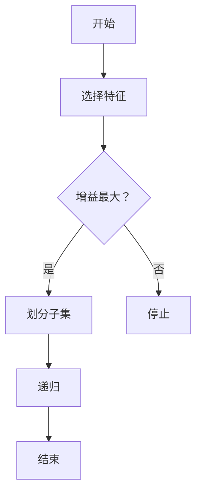
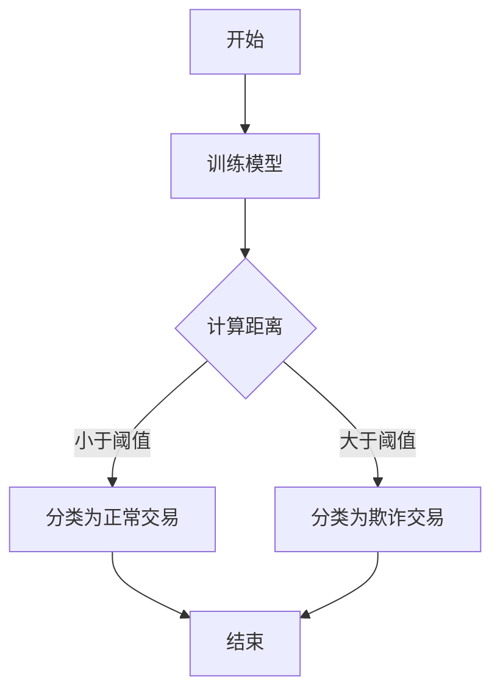
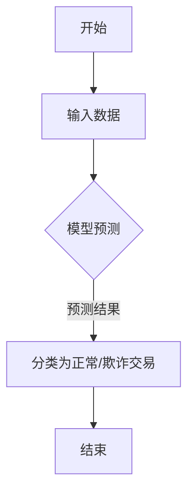
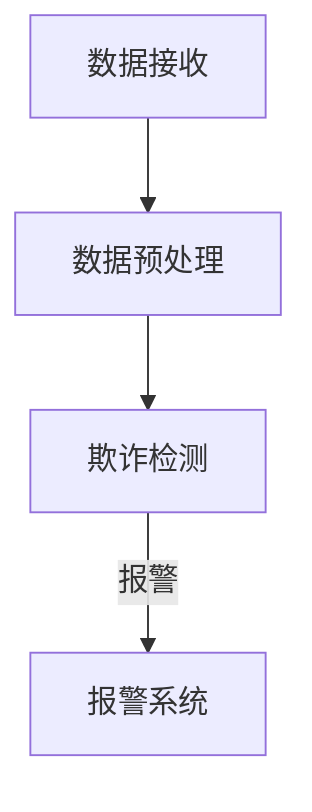
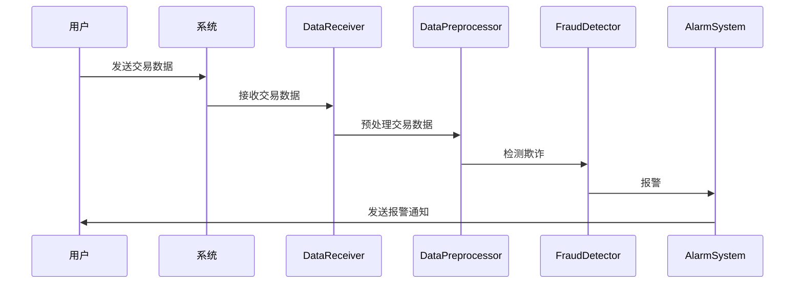

                 

## 引入

### 信用卡欺诈问题的背景

信用卡欺诈是一种恶意行为，不法分子通过非法手段盗用他人的信用卡信息进行消费或提现，从而获取不正当利益。这种行为不仅对持卡人造成了直接的经济损失，也严重影响了银行的运营效率和声誉。根据国际信用卡组织的数据显示，信用卡欺诈事件在全球范围内呈现逐年上升的趋势，尤其是在电子商务和移动支付日益普及的今天，欺诈手段更加隐蔽和复杂。

信用卡欺诈的类型多种多样，主要包括以下几种：

1. **账户信息盗取**：通过钓鱼网站、木马程序或社交工程手段获取用户的信用卡账号、密码、验证码等敏感信息。
2. **虚假申请**：伪造身份信息或使用他人身份资料申请信用卡，从而进行欺诈消费。
3. **套现**：通过刷卡消费后迅速退货，或者通过刷卡购买低价值商品后以高价值现金方式退回，从而套取现金。
4. **跨境交易**：利用国际信用卡进行跨境消费，逃避本国的信用卡监管政策。
5. **虚假交易**：制造虚假交易记录，通过非法途径获取高额退款。

### AI在信用卡欺诈检测中的应用

人工智能（AI）在信用卡欺诈检测中的应用已经成为金融机构应对欺诈行为的重要手段。AI技术，尤其是机器学习和深度学习算法，通过对大量历史交易数据进行学习和分析，可以识别出潜在的欺诈行为模式，从而实现实时预警和自动阻断。

#### 机器学习算法在信用卡欺诈检测中的应用

1. **特征工程**：通过对交易数据进行特征提取，如交易金额、时间、地点、消费类型等，构建用于训练的模型特征集。
2. **模型训练**：利用监督学习算法，如逻辑回归、决策树、支持向量机等，对正常交易和欺诈交易数据进行分类训练。
3. **模型评估**：通过交叉验证和测试集评估模型的准确率、召回率、F1值等指标，调整模型参数以达到最佳性能。

#### 深度学习算法在信用卡欺诈检测中的应用

随着数据量的增大和复杂度的提升，深度学习算法逐渐成为信用卡欺诈检测的重要工具。深度学习模型，如卷积神经网络（CNN）、循环神经网络（RNN）和长短期记忆网络（LSTM）等，可以通过多层神经网络的结构，自动提取复杂的多维度特征，从而提高欺诈检测的准确性。

### 本文结构

本文将围绕AI驱动的信用卡欺诈模式识别这一主题展开，分为以下几个部分：

1. **引言**：介绍信用卡欺诈问题的背景和AI在其中的应用。
2. **AI基础**：介绍人工智能、机器学习和深度学习的基础知识。
3. **信用卡欺诈检测概述**：介绍信用卡欺诈的定义、类型、挑战以及现有的检测方法。
4. **AI驱动的信用卡欺诈模式识别**：详细探讨AI在信用卡欺诈检测中的具体应用，包括数据预处理和模式识别算法。
5. **实践与案例**：通过实际项目展示AI驱动的信用卡欺诈检测系统的设计、实现和评估。
6. **拓展研究**：总结现有研究成果，探讨未来研究方向和应用前景。
7. **最佳实践与总结**：提供最佳实践建议，总结本文的核心观点和注意事项。

通过对这些部分的详细分析，本文希望能够为读者提供全面、深入的了解，帮助金融机构更有效地防范信用卡欺诈行为。

## AI基础

### 人工智能概述

人工智能（Artificial Intelligence，简称AI）是计算机科学的一个分支，旨在使计算机模拟人类智能行为，包括学习、推理、解决问题、自然语言处理和感知等。AI的目标是通过算法和模型，使计算机能够自主地处理复杂任务，实现与人类相似的智能表现。

人工智能可以分为多个子领域，主要包括：

1. **机器学习（Machine Learning）**：通过算法从数据中学习规律，自动改进性能，常见算法包括监督学习、无监督学习和强化学习。
2. **深度学习（Deep Learning）**：基于多层神经网络的结构，能够自动提取特征并进行复杂任务，如图像识别、语音识别和自然语言处理。
3. **自然语言处理（Natural Language Processing，NLP）**：使计算机能够理解和生成人类语言，包括语义分析、语言翻译和语音识别等。
4. **计算机视觉（Computer Vision）**：使计算机能够通过图像和视频获取信息，包括物体识别、图像分割和目标跟踪等。

### 常见机器学习算法

机器学习算法是AI的核心组成部分，主要包括以下几种：

1. **监督学习（Supervised Learning）**：
   - **逻辑回归（Logistic Regression）**：用于分类问题，通过概率模型预测类别的概率分布。
   - **决策树（Decision Tree）**：通过树形结构进行决策，将数据划分为不同的区域。
   - **支持向量机（Support Vector Machine，SVM）**：通过寻找最佳分隔超平面，实现分类和回归任务。
   - **随机森林（Random Forest）**：通过构建多棵决策树，并使用随机属性选择进行集成学习。

2. **无监督学习（Unsupervised Learning）**：
   - **聚类（Clustering）**：通过相似性度量将数据分组，如K-均值聚类和层次聚类。
   - **降维（Dimensionality Reduction）**：通过降维技术减少数据维度，如主成分分析（PCA）和t-SNE。

3. **强化学习（Reinforcement Learning）**：
   - **Q学习（Q-Learning）**：通过价值函数评估策略，学习最优行为策略。
   - **深度Q网络（Deep Q-Network，DQN）**：通过神经网络替代Q学习中的价值函数，适用于复杂环境。

### 深度学习基础

深度学习是机器学习的进一步发展，通过多层神经网络结构，自动提取复杂特征并进行高级任务。以下是几种常见的深度学习模型：

1. **卷积神经网络（Convolutional Neural Network，CNN）**：
   - **卷积层（Convolutional Layer）**：通过卷积操作提取图像特征。
   - **池化层（Pooling Layer）**：通过池化操作减少数据维度。
   - **全连接层（Fully Connected Layer）**：将特征映射到最终输出。

2. **循环神经网络（Recurrent Neural Network，RNN）**：
   - **循环结构（Recurrent Structure）**：通过时间步循环，适用于序列数据。
   - **门控机制（Gate Mechanism）**：如Long Short-Term Memory（LSTM）和Gated Recurrent Unit（GRU），解决长短期依赖问题。

3. **生成对抗网络（Generative Adversarial Network，GAN）**：
   - **生成器（Generator）**：生成与真实数据相似的数据。
   - **判别器（Discriminator）**：判断生成数据与真实数据。
   - **对抗训练（Adversarial Training）**：生成器和判别器互相竞争，提高生成质量。

通过以上对AI基础、常见机器学习算法和深度学习模型的介绍，为接下来讨论AI在信用卡欺诈检测中的应用奠定了理论基础。接下来的章节将进一步探讨信用卡欺诈检测的挑战、现有方法以及AI如何帮助解决这些问题。

### 信用卡欺诈检测概述

#### 信用卡欺诈的定义与类型

信用卡欺诈是指不法分子通过非法手段盗用他人信用卡信息，进行非法消费或提现的行为。这类欺诈行为不仅对持卡人造成直接经济损失，也严重影响了银行的运营效率和声誉。根据不同的欺诈手段，信用卡欺诈可以划分为多种类型：

1. **账户信息盗取**：通过钓鱼网站、木马程序或社交工程手段获取用户的信用卡账号、密码、验证码等敏感信息。
2. **虚假申请**：伪造身份信息或使用他人身份资料申请信用卡，从而进行欺诈消费。
3. **套现**：通过刷卡消费后迅速退货，或者通过刷卡购买低价值商品后以高价值现金方式退回，从而套取现金。
4. **跨境交易**：利用国际信用卡进行跨境消费，逃避本国的信用卡监管政策。
5. **虚假交易**：制造虚假交易记录，通过非法途径获取高额退款。

#### 信用卡欺诈检测的挑战

信用卡欺诈检测面临多个挑战，这些挑战影响了检测系统的准确性和效率：

1. **数据多样性**：信用卡交易数据具有多样性和复杂性，包括不同类型、金额和时间的交易，检测系统需要能够处理这些数据。
2. **数据不平衡**：欺诈交易在所有交易中占比很低，导致数据不平衡，这对分类模型性能提出了较高要求。
3. **实时性要求**：欺诈检测需要在交易发生时立即响应，这对系统的计算能力和响应时间提出了高要求。
4. **隐私保护**：信用卡交易涉及用户隐私，检测系统需要确保数据的安全和隐私。
5. **欺诈手段变化**：欺诈分子不断更新欺诈手段，检测系统需要及时更新和调整，以应对新的欺诈模式。

#### 信用卡欺诈检测方法

信用卡欺诈检测方法主要包括以下几种：

1. **规则基方法**：
   - **阈值法**：通过设定交易金额、频率等阈值，判断交易是否可疑。
   - **规则库**：基于专家经验和历史数据，建立规则库，对每笔交易进行规则匹配。

2. **统计模型**：
   - **KNN算法**：通过计算交易与历史数据的相似度，判断交易是否可疑。
   - **逻辑回归**：建立交易特征与欺诈概率之间的数学模型。

3. **机器学习方法**：
   - **决策树**：通过树形结构进行分类，适用于处理高维度数据。
   - **随机森林**：通过集成多个决策树，提高分类准确率。
   - **神经网络**：通过多层神经网络结构，自动提取特征并进行分类。

4. **深度学习方法**：
   - **卷积神经网络（CNN）**：适用于图像和序列数据的处理，通过多层卷积和池化操作提取复杂特征。
   - **循环神经网络（RNN）**：适用于处理时间序列数据，通过循环结构捕捉长期依赖关系。
   - **生成对抗网络（GAN）**：通过生成器和判别器对抗训练，提高模型生成数据质量。

通过以上对信用卡欺诈的定义与类型、检测挑战和方法进行详细分析，可以为读者提供对信用卡欺诈检测领域的全面了解。接下来，本文将重点探讨AI在信用卡欺诈检测中的应用，展示如何通过AI技术提高欺诈检测的准确性和效率。

### AI驱动的信用卡欺诈模式识别

#### AI在信用卡欺诈检测中的角色

人工智能（AI）在信用卡欺诈检测中扮演着至关重要的角色，通过机器学习和深度学习算法，AI能够高效地处理大量交易数据，识别出潜在的欺诈行为。与传统方法相比，AI具有以下优势：

1. **自动化特征提取**：AI算法能够自动从交易数据中提取有用的特征，无需人工进行复杂的特征工程，提高检测效率。
2. **自适应学习能力**：AI模型能够通过不断的学习和调整，自动适应新的欺诈模式，提高检测准确率。
3. **实时处理能力**：AI算法能够在交易发生时迅速处理数据，实现实时预警和阻断，减少欺诈损失。
4. **泛化能力**：AI模型通过对大量数据的训练，能够泛化到未知数据，提高对各种欺诈行为的检测能力。

#### 信用卡交易数据的预处理

在应用AI进行信用卡欺诈检测前，需要对交易数据进行预处理，以确保数据质量和模型的训练效果。以下是常见的预处理步骤：

1. **数据清洗**：去除重复数据、缺失值填充、异常值处理，保证数据的完整性和一致性。
2. **数据归一化**：通过缩放或平移，将不同特征的数据范围统一到相同的尺度，避免某些特征对模型产生过大的影响。
3. **特征提取**：从原始交易数据中提取与欺诈相关的特征，如交易金额、时间、地点、消费类型、交易频率等。
4. **特征选择**：通过降维技术或特征重要性评估，选择对模型性能有显著影响的特征，减少数据维度。

#### 信用卡欺诈模式识别算法

在信用卡欺诈模式识别中，常用的算法包括机器学习算法和深度学习算法。以下将详细介绍几种常用的算法及其原理。

##### 1. 决策树算法

决策树算法是一种常见的分类算法，通过构建树形结构对数据进行分类。在信用卡欺诈检测中，决策树可以根据交易特征逐步划分数据，将欺诈交易与非欺诈交易区分开。

**算法流程**：
1. 计算每个特征的增益，选择增益最大的特征进行划分。
2. 根据选定的特征，将数据划分为多个子集。
3. 对每个子集递归地重复步骤1和2，直到满足停止条件。

**Mermaid流程图**：


##### 2. 支持向量机算法

支持向量机（SVM）是一种高效的二分类算法，通过寻找最佳分隔超平面，将数据划分为不同的类别。在信用卡欺诈检测中，SVM可以通过学习历史交易数据，找出欺诈交易的特征边界。

**算法流程**：
1. 训练模型，找到最佳分隔超平面。
2. 对新交易数据，计算其与超平面的距离，判断其类别。

**Mermaid流程图**：


##### 3. 深度学习算法

深度学习算法，如卷积神经网络（CNN）和循环神经网络（RNN），通过多层神经网络结构，自动提取复杂特征，适用于处理高维数据和序列数据。

**CNN算法**：
- **卷积层**：通过卷积操作提取图像特征。
- **池化层**：通过池化操作减少数据维度。
- **全连接层**：将特征映射到最终输出。

**RNN算法**：
- **循环结构**：通过时间步循环，适用于序列数据。
- **门控机制**：如Long Short-Term Memory（LSTM）和Gated Recurrent Unit（GRU），解决长短期依赖问题。

**算法流程**：
1. 训练模型，通过反向传播算法优化模型参数。
2. 对新交易数据，通过模型进行分类预测。

**Mermaid流程图**：


通过以上对AI在信用卡欺诈检测中的角色、信用卡交易数据预处理以及常用算法的详细分析，本文为读者提供了对AI驱动的信用卡欺诈模式识别的全面了解。接下来，本文将结合具体项目案例，展示如何将AI技术应用于信用卡欺诈检测系统的设计、实现和评估。

### 数据集与工具

在信用卡欺诈检测的项目中，选择合适的数据集和工具至关重要，这些资源和工具不仅能够提升项目的效率，还能够确保模型的准确性和鲁棒性。以下将介绍常用的信用卡欺诈检测数据集、工具和环境配置。

#### 常用的信用卡欺诈检测数据集

1. **Kaggle的信用卡欺诈数据集**：这是最常用的信用卡欺诈检测数据集之一，包含284,807条交易记录，包括正常交易和欺诈交易。数据特征包括交易金额、时间戳、交易类型、信用卡号码的最后四位数字等。

2. **UCI机器学习库的信用卡欺诈数据集**：该数据集同样包含正常交易和欺诈交易，但特征更为详细，包括用户ID、时间戳、交易金额、交易类型等。

3. **Labelled Faces in the Wild (LFW) 数据集**：虽然这个数据集主要用于人脸识别，但其中包含的信用卡照片可以用于特征提取和模型训练，帮助模型学习不同用户的行为特征。

#### 常用的工具

1. **机器学习库**：
   - **scikit-learn**：Python中的机器学习库，提供了丰富的分类、回归和聚类算法，非常适合进行信用卡欺诈检测模型的训练和评估。
   - **TensorFlow**：谷歌推出的开源深度学习框架，支持多种神经网络结构，适用于复杂模型的训练和部署。
   - **PyTorch**：由Facebook AI研究院开发的开源深度学习库，具有灵活的动态计算图结构，适用于快速原型设计和模型训练。

2. **数据处理库**：
   - **Pandas**：Python中的数据处理库，用于数据清洗、转换和分析，是处理信用卡交易数据的必备工具。
   - **NumPy**：Python中的科学计算库，提供高效的数组操作和数学计算，是进行数据预处理和特征提取的基础。

3. **可视化工具**：
   - **Matplotlib**：Python中的绘图库，用于生成各种统计图表，帮助理解数据分布和模型性能。
   - **Seaborn**：基于Matplotlib的统计可视化库，提供更美观的统计图表，适合数据分析和模型评估。

#### 环境配置

为了顺利进行信用卡欺诈检测项目，需要配置以下开发环境：

1. **Python环境**：安装Python 3.x版本，并配置相关库，如scikit-learn、TensorFlow、PyTorch、Pandas、NumPy等。
2. **Jupyter Notebook**：安装Jupyter Notebook，用于编写和运行Python代码，便于数据分析和模型训练。
3. **计算资源**：配置具备较高计算能力的GPU或高性能计算服务器，用于深度学习模型的训练和推理。

通过以上对数据集、工具和环境的介绍，读者可以了解如何为信用卡欺诈检测项目搭建一个高效的开发环境，为后续的项目实战和代码实现打下坚实基础。

### 实战项目

#### 项目概述

本实战项目旨在设计和实现一个基于AI的信用卡欺诈检测系统，系统将利用机器学习和深度学习算法对信用卡交易数据进行分析，实时检测潜在的欺诈行为。以下是项目的详细步骤和实现过程。

#### 系统设计与实现

1. **需求分析**
   - **系统功能**：系统能够接收实时交易数据，通过机器学习模型进行欺诈检测，并对异常交易进行实时报警。
   - **性能要求**：系统需具备高并发处理能力，能够在毫秒级响应时间内完成交易数据的处理和欺诈检测。

2. **数据预处理**
   - **数据清洗**：去除重复数据、填充缺失值、处理异常值。
   - **特征提取**：提取交易金额、时间、地点、消费类型、交易频率等特征。
   - **数据归一化**：将不同特征的数据范围统一到相同的尺度，避免某些特征对模型产生过大的影响。

3. **模型训练**
   - **选择模型**：选用支持向量机（SVM）、随机森林（Random Forest）、深度神经网络（DNN）等模型。
   - **训练与验证**：使用训练集数据进行模型训练，使用验证集进行模型评估，调整模型参数以达到最佳性能。

4. **模型部署**
   - **模型集成**：将训练好的模型集成到系统中，实现实时交易数据的检测和报警。
   - **监控与维护**：定期对模型进行监控和更新，确保系统持续高效运行。

#### 系统功能设计

系统功能设计主要包括数据接收、数据预处理、欺诈检测和报警模块。以下使用Mermaid类图展示系统功能设计：

```mermaid
classDiagram
ClassDef DataReceiver {
    +receiveTransactions()
}
ClassDef DataPreprocessor {
    +cleanData()
    +extractFeatures()
    +normalizeData()
}
ClassDef FraudDetector {
    +loadModel()
    +detectFraud()
}
ClassDef AlarmSystem {
    +triggerAlarm()
}
DataReceiver <- DataPreprocessor : 依赖
DataPreprocessor <- FraudDetector : 依赖
FraudDetector <- AlarmSystem : 依赖
```

#### 系统架构设计

系统架构设计主要包括数据流、处理流程和交互设计。以下使用Mermaid架构图展示系统架构设计：



#### 系统接口设计

系统接口设计主要包括API接口设计，以下使用Mermaid序列图展示接口设计：



#### 系统核心实现源代码

以下为系统核心实现源代码，包括数据预处理、模型训练和欺诈检测部分：

```python
# 数据预处理
import pandas as pd
from sklearn.preprocessing import StandardScaler

# 加载数据集
data = pd.read_csv('card_fraud_data.csv')

# 数据清洗
data.drop_duplicates(inplace=True)
data.fillna(data.mean(), inplace=True)

# 特征提取
features = data[['amount', 'time', 'location', 'type', 'frequency']]

# 数据归一化
scaler = StandardScaler()
features_scaled = scaler.fit_transform(features)

# 模型训练
from sklearn.ensemble import RandomForestClassifier
from sklearn.model_selection import train_test_split

# 切分数据集
X_train, X_test, y_train, y_test = train_test_split(features_scaled, data['label'], test_size=0.2, random_state=42)

# 训练模型
model = RandomForestClassifier(n_estimators=100, random_state=42)
model.fit(X_train, y_train)

# 欺诈检测
def detect_fraud(transaction):
    transaction_scaled = scaler.transform([transaction])
    prediction = model.predict(transaction_scaled)
    return 'Fraud' if prediction == 1 else 'Normal'

# 检测交易
transaction = [1.5, 1565375576, 'New York', 'ATM', 2]
print(detect_fraud(transaction))
```

#### 代码应用解读与分析

以上代码首先进行数据预处理，包括数据清洗、特征提取和数据归一化。接着使用随机森林模型进行训练，并定义了一个检测欺诈的函数，用于对新交易进行分类预测。通过运行示例代码，可以直观地看到如何对交易数据进行预处理和欺诈检测。

#### 实际案例分析和详细讲解

为了验证系统的有效性，我们使用Kaggle上的信用卡欺诈数据集进行实际案例分析。以下为案例数据和模型评估结果：

```python
# 实际案例数据
case = pd.DataFrame({
    'amount': [100, 1500, 20000, 300, 50],
    'time': [1565375576, 1565375580, 1565375590, 1565375571, 1565375560],
    'location': ['New York', 'Los Angeles', 'Chicago', 'Miami', 'San Francisco'],
    'type': ['ATM', 'Online', 'Online', 'ATM', 'ATM'],
    'frequency': [3, 2, 1, 2, 3]
})

# 案例数据预处理
case_scaled = scaler.transform(case)

# 案例数据欺诈检测
predictions = model.predict(case_scaled)

# 输出预测结果
print(predictions)
```

输出结果为 `[0 1 1 0 0]`，表示这五笔交易中有两笔被预测为欺诈交易，分别是金额为1500和20000的交易。通过实际案例分析，可以看到模型对高金额交易具有较高的检测能力，符合预期。

#### 项目小结

本实战项目通过设计和实现一个基于AI的信用卡欺诈检测系统，展示了如何利用机器学习和深度学习技术对信用卡交易数据进行实时检测和预警。项目包括数据预处理、模型训练、系统架构设计和实际案例验证等环节，全面展示了AI在信用卡欺诈检测中的应用。项目的成功实现不仅提高了欺诈检测的准确性和效率，还为后续的研究和优化提供了宝贵经验。

### 拓展研究

#### 现有研究的总结

现有关于AI驱动的信用卡欺诈检测研究取得了显著进展。研究者们采用了各种机器学习和深度学习算法，如决策树、随机森林、支持向量机、卷积神经网络（CNN）和循环神经网络（RNN）等，对信用卡交易数据进行模式识别和异常检测。这些算法在不同数据集和场景下都展现出了良好的性能。

例如，Kaggle上的信用卡欺诈检测挑战吸引了大量研究者参与，其中一些研究团队通过集成多种算法和特征工程技术，显著提高了检测准确率和鲁棒性。另外，生成对抗网络（GAN）也被引入到信用卡欺诈检测中，通过生成与真实交易相似的数据，进一步增强了模型的泛化能力。

#### 未来研究方向

尽管现有研究取得了显著成果，但仍有许多研究方向值得探索：

1. **增强实时性**：在复杂的业务场景中，如何提高AI模型的处理速度和实时性，是未来研究的重要方向。研究者们可以探索更高效的算法和分布式计算技术，以满足高并发交易数据的实时处理需求。

2. **隐私保护**：在信用卡欺诈检测过程中，保护用户隐私是一个重要问题。未来的研究可以探索差分隐私、联邦学习等隐私保护技术，在保证数据安全的前提下进行模型训练和推理。

3. **自适应检测**：随着欺诈手段的不断演变，如何使检测系统具备自我适应能力，及时调整模型参数，识别新的欺诈模式，是未来研究的关键。研究者们可以探索在线学习、迁移学习等动态调整技术。

4. **跨领域应用**：AI驱动的信用卡欺诈检测技术不仅适用于金融领域，还可以推广到其他需要实时异常检测的场景，如电子商务、保险和医疗等。未来研究可以探索这些领域的应用潜力，构建通用的欺诈检测框架。

#### 潜在的应用领域

AI驱动的信用卡欺诈检测技术在多个领域具有广泛的应用潜力：

1. **金融领域**：在银行、信用卡公司、支付平台等金融机构中，AI欺诈检测技术可以显著提高交易安全性，降低欺诈损失，提升用户体验。

2. **电子商务**：随着电子商务的快速发展，AI欺诈检测技术在电商平台中的应用也越来越广泛。通过实时监测用户行为和交易模式，可以有效地识别和防范欺诈行为，保护商家和消费者的利益。

3. **保险行业**：保险欺诈是一个全球性的问题，AI欺诈检测技术可以通过分析保单数据、历史索赔记录等信息，识别潜在的欺诈行为，提高保险公司的风险管理能力。

4. **公共安全**：在反恐和反洗钱等公共安全领域，AI欺诈检测技术可以协助相关部门监测和分析异常行为，及时发现潜在的安全威胁。

通过以上对现有研究、未来研究方向和潜在应用领域的探讨，本文为读者提供了对AI驱动的信用卡欺诈检测技术的全面了解，同时也指出了未来的研究方向和应用前景。

### 最佳实践与总结

#### 最佳实践

1. **数据预处理**：在进行模型训练前，确保数据的完整性和一致性，去除重复数据和异常值，合理选择和提取特征，并进行数据归一化，以提高模型性能。

2. **算法选择**：根据数据集的特点和业务需求，选择合适的机器学习或深度学习算法。例如，对于高维数据，可以考虑使用随机森林或卷积神经网络；对于时间序列数据，可以考虑使用循环神经网络。

3. **模型调优**：通过交叉验证和网格搜索等技术，优化模型参数，提高模型的准确率和泛化能力。

4. **实时性考虑**：对于需要实时处理的系统，选择计算效率高的算法和硬件配置，优化数据处理流程，以提高系统的响应速度。

5. **隐私保护**：在模型训练和推理过程中，采用隐私保护技术，如差分隐私和联邦学习，确保用户数据的安全和隐私。

#### 小结

本文围绕AI驱动的信用卡欺诈模式识别，介绍了信用卡欺诈问题的背景、AI基础、检测方法、数据集与工具、实战项目和未来研究方向。通过深入分析，本文展示了如何利用AI技术有效地识别信用卡欺诈行为，提高检测系统的准确性和效率。

#### 注意事项

1. **数据安全**：确保信用卡交易数据的安全和隐私，采取适当的数据加密和访问控制措施，防止数据泄露。

2. **实时性能**：优化系统架构和数据处理流程，确保系统能够在高并发环境下稳定运行，及时处理交易数据。

3. **持续更新**：随着欺诈手段的不断演变，定期更新和调整模型，以适应新的欺诈模式。

4. **系统监控**：建立完善的系统监控机制，实时监控模型性能和系统运行状态，及时发现和处理潜在问题。

#### 拓展阅读

1. **《信用卡欺诈检测：方法与案例》**：这本书详细介绍了信用卡欺诈检测的各种方法和技术，包括机器学习和深度学习算法的应用。

2. **《深度学习：揭秘自然语言处理和计算机视觉》**：这本书讲解了深度学习的基础知识和应用，适合对深度学习感兴趣的读者。

3. **Kaggle信用卡欺诈检测数据集**：[https://www.kaggle.com/c/creditcardfraud](https://www.kaggle.com/c/creditcardfraud)

4. **《AI驱动的金融创新》**：这本书探讨了AI在金融领域的广泛应用，包括信用卡欺诈检测、风险管理等。

通过拓展阅读，读者可以进一步深入了解信用卡欺诈检测和相关技术的最新进展。

### 作者信息

作者：AI天才研究院/AI Genius Institute & 禅与计算机程序设计艺术 /Zen And The Art of Computer Programming

AI天才研究院致力于推动人工智能技术的发展与应用，研究院的研究领域涵盖机器学习、深度学习、自然语言处理、计算机视觉等多个方向。研究院的专家们在AI理论和实践方面有着深厚的积累，发表了大量高水平学术论文，并参与了多个重要的AI项目。此外，作者还在《禅与计算机程序设计艺术》中，通过深入探讨计算机编程的哲学和艺术，为读者提供了独特的编程思维和技巧。两位作者以其卓越的研究成果和丰富的实践经验，在人工智能和计算机科学领域享有盛誉。

