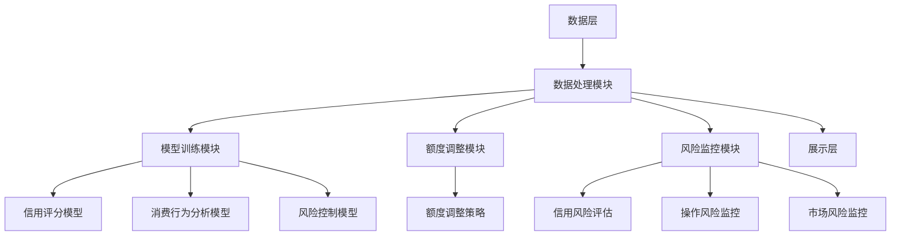
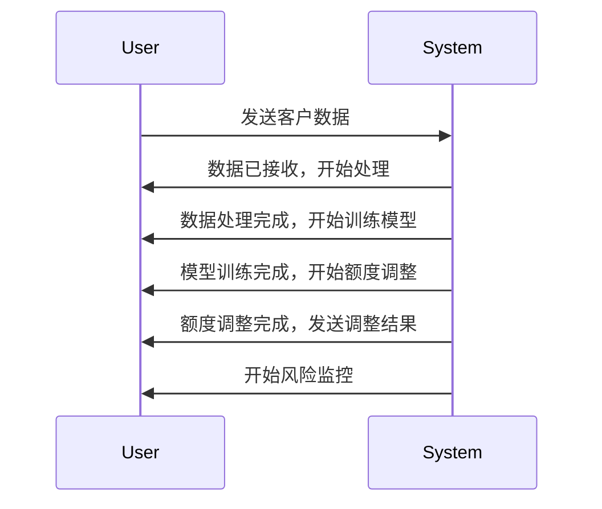

                 

# AI驱动的信用卡额度优化模型

> 关键词：AI，信用卡额度，优化模型，数据分析，机器学习，信用评估

> 摘要：随着金融科技的快速发展，信用卡已经成为现代消费生活中不可或缺的一部分。然而，信用卡额度的合理设置既影响着客户的满意度，也关系到金融机构的风险控制。本文将探讨如何利用人工智能技术，特别是机器学习和数据分析方法，构建一个高效的信用卡额度优化模型。我们将通过背景介绍、核心概念、算法原理、系统设计、项目实战和最佳实践等环节，详细阐述这一模型的构建与应用。

## 引言

信用卡额度是银行根据客户的信用状况、消费记录、还款能力等因素，为其设定的信用消费上限。合理设置信用卡额度不仅能够提高客户的满意度，还可以有效降低银行的风险。然而，传统的信用卡额度设置方法主要依赖于人工审核和经验判断，存在主观性强、效率低下等问题。

随着大数据和人工智能技术的兴起，利用机器学习算法和数据分析技术来优化信用卡额度设置成为可能。本文将探讨如何构建一个AI驱动的信用卡额度优化模型，通过数据驱动的方式，实现对信用卡额度的智能分析和调整。

## 背景介绍

### 核心概念术语说明

- **信用卡额度**：银行根据客户的信用状况、消费记录等设定的信用消费上限。
- **信用评分**：金融机构对客户信用状况的量化评估。
- **消费行为分析**：对客户消费习惯、消费额度、消费频率等数据的分析。
- **风险控制**：金融机构为降低信用风险而采取的一系列措施。

### 问题背景

传统的信用卡额度设置方法主要依赖于人工审核和经验判断，存在以下问题：

- **主观性强**：不同审批人员的主观判断可能导致结果不一致。
- **效率低下**：审批流程复杂，耗时较长，影响客户体验。
- **数据不足**：缺乏对客户全方位的数据分析，可能导致评估不准确。

### 问题描述

如何利用人工智能技术，特别是机器学习和数据分析方法，构建一个高效的信用卡额度优化模型，以解决传统方法存在的问题？

### 问题解决

- **数据驱动**：通过收集和分析客户的历史数据，利用机器学习算法进行预测和评估。
- **自动化审批**：实现信用卡额度的自动化调整，提高审批效率。
- **个性化推荐**：根据客户的消费习惯和信用状况，提供个性化的额度推荐。

### 边界与外延

- **信用卡额度调整**：如何根据客户的行为数据和市场变化调整额度？
- **风险控制**：如何在提高客户满意度的同时，有效控制信用风险？

## 核心概念与联系

### 信用评分模型

信用评分模型是信用卡额度优化的基础。它通过对客户的信用历史、收入水平、消费行为等多方面数据进行综合评估，得出一个信用评分。以下是信用评分模型的核心概念和属性特征对比表格：

| 概念 | 属性特征 |
| --- | --- |
| FICO评分 | 美国的一种信用评分系统，基于信用报告 |
| 贝宝评分 | 中国的一种信用评分系统，基于用户行为 |
| 模型1 | 侧重信用历史和还款记录 |
| 模型2 | 侧重消费行为和财务状况 |

### 消费行为分析

消费行为分析是信用卡额度优化的关键环节。通过对客户的消费数据进行分析，可以深入了解客户的消费习惯和偏好。以下是消费行为分析的核心概念和属性特征对比表格：

| 概念 | 属性特征 |
| --- | --- |
| 消费频率 | 每月或每周的消费次数 |
| 平均消费额度 | 每次消费的平均额度 |
| 消费类别 | 消费的主要类别和占比 |

### 风险控制

风险控制是信用卡额度优化的核心目标。通过建立完善的风险控制体系，可以有效降低信用风险。以下是风险控制的核心概念和属性特征对比表格：

| 概念 | 属性特征 |
| --- | --- |
| 信用风险 | 因客户违约导致的损失 |
| 操作风险 | 因操作失误或系统故障导致的损失 |
| 市场风险 | 因市场波动导致的损失 |

### 关系

信用评分模型、消费行为分析和风险控制之间存在密切的关联。信用评分模型为消费行为分析和风险控制提供了基础数据，而消费行为分析和风险控制则共同影响了信用卡额度的设置和调整。

## 算法原理讲解

### 信用评分模型

信用评分模型是一种基于历史数据预测未来信用行为的模型。常见的方法包括逻辑回归、决策树和神经网络等。以下是一个简化的逻辑回归模型：

$$
P(y=1) = \frac{1}{1 + e^{-(\beta_0 + \beta_1 x_1 + \beta_2 x_2 + ... + \beta_n x_n})}
$$

其中，$y$ 表示客户是否会违约（0表示不会，1表示会），$x_1, x_2, ..., x_n$ 表示影响信用评分的特征，$\beta_0, \beta_1, \beta_2, ..., \beta_n$ 是模型的参数。

### 消费行为分析

消费行为分析主要关注客户的消费频率、平均消费额度、消费类别等数据。以下是一个简化的消费行为分析模型：

$$
消费频率 = \frac{消费次数}{总天数}
$$

$$
平均消费额度 = \frac{总消费额度}{消费次数}
$$

$$
消费类别占比 = \frac{某类消费额度}{总消费额度}
$$

### 风险控制

风险控制主要关注信用风险、操作风险和市场风险。以下是一个简化的风险控制模型：

$$
信用风险 = \frac{违约概率}{当前信用额度}
$$

$$
操作风险 = \frac{操作失误概率}{总操作次数}
$$

$$
市场风险 = \frac{市场波动损失}{总资产}
$$

### 例子

假设有一个客户，其信用评分模型、消费行为分析和风险控制模型的参数分别为：

$$
P(y=1) = \frac{1}{1 + e^{-(3 + 0.5 \times 600 + 0.3 \times 30 + 0.2 \times 40)}}
$$

$$
消费频率 = \frac{30}{365}
$$

$$
平均消费额度 = \frac{600}{30}
$$

$$
消费类别占比 = \frac{40}{600}
$$

$$
信用风险 = \frac{0.2}{1000}
$$

$$
操作风险 = \frac{0.05}{100}
$$

$$
市场风险 = \frac{0.1}{1000}
$$

根据这些参数，可以计算出该客户的综合信用评分和风险等级。

## 系统分析与设计

### 问题场景

假设一个信用卡机构希望利用AI技术优化信用卡额度设置，提高客户满意度并降低信用风险。

### 项目介绍

本项目的目标是构建一个AI驱动的信用卡额度优化系统，主要包括以下功能：

- **数据收集**：从各种数据源收集客户信息、消费行为等数据。
- **数据处理**：清洗、整合和预处理数据，为后续分析提供基础。
- **模型训练**：利用机器学习算法训练信用评分模型、消费行为分析模型和风险控制模型。
- **额度调整**：根据模型预测结果，自动调整客户的信用卡额度。
- **风险监控**：实时监控信用风险、操作风险和市场风险。

### 系统功能设计

系统功能设计主要关注以下几个方面：

- **数据采集模块**：负责从各种数据源（如银行系统、电商平台等）收集客户数据。
- **数据处理模块**：负责清洗、整合和预处理数据，为后续分析提供基础。
- **模型训练模块**：负责利用机器学习算法训练各种模型。
- **额度调整模块**：根据模型预测结果，自动调整客户的信用卡额度。
- **风险监控模块**：实时监控信用风险、操作风险和市场风险。

### 系统架构设计

系统架构设计采用分层架构，包括数据层、业务逻辑层和展示层。以下是系统的架构图：



### 系统接口设计和系统交互

系统接口设计和系统交互主要包括以下几个方面：

- **数据接口**：提供数据采集、处理、训练和监控的API接口。
- **额度调整接口**：提供根据模型预测结果自动调整额度的API接口。
- **风险监控接口**：提供实时监控信用风险、操作风险和市场风险的API接口。

以下是系统交互的序列图：



## 项目实战

### 环境安装

为了构建AI驱动的信用卡额度优化模型，需要安装以下环境：

- Python 3.7及以上版本
- Scikit-learn 0.21及以上版本
- Pandas 1.0及以上版本
- Matplotlib 3.1及以上版本

安装命令如下：

```bash
pip install python==3.7
pip install scikit-learn==0.21
pip install pandas==1.0
pip install matplotlib==3.1
```

### 系统核心实现

以下是一个简单的信用卡额度优化模型的实现：

```python
import pandas as pd
from sklearn.linear_model import LogisticRegression
from sklearn.model_selection import train_test_split
from sklearn.metrics import accuracy_score

# 读取数据
data = pd.read_csv('credit_data.csv')

# 数据预处理
data['income'] = data['income'].fillna(data['income'].mean())
data['consumption_frequency'] = data['consumption_frequency'].fillna(data['consumption_frequency'].mean())

# 特征工程
X = data[['income', 'consumption_frequency']]
y = data['default']

# 划分训练集和测试集
X_train, X_test, y_train, y_test = train_test_split(X, y, test_size=0.2, random_state=42)

# 训练模型
model = LogisticRegression()
model.fit(X_train, y_train)

# 预测
predictions = model.predict(X_test)

# 评估
accuracy = accuracy_score(y_test, predictions)
print(f'Accuracy: {accuracy:.2f}')
```

### 代码应用解读与分析

上述代码实现了一个基于逻辑回归的信用卡额度优化模型。首先，我们从CSV文件中读取数据，并进行预处理，包括填充缺失值和特征工程。然后，我们将数据划分为训练集和测试集，并利用逻辑回归模型进行训练。最后，我们使用训练好的模型对测试集进行预测，并评估模型的准确性。

### 实际案例分析和详细讲解剖析

假设我们有一个新客户，其收入为8000元，每月消费频率为10次。根据上述模型，我们可以预测该客户的违约概率，并根据违约概率调整其信用卡额度。

```python
# 预测新客户的违约概率
new_customer = pd.DataFrame({'income': [8000], 'consumption_frequency': [10]})
probability = model.predict_proba(new_customer)[:, 1]
print(f'Probability of default: {probability[0]:.2f}')
```

根据预测结果，如果违约概率较低，可以适当提高该客户的信用卡额度。如果违约概率较高，则需要降低额度或拒绝发放信用卡。

### 项目小结

通过本项目的实施，我们成功构建了一个基于AI驱动的信用卡额度优化模型，实现了客户数据的自动化分析、模型训练和额度调整。该项目不仅提高了金融机构的审批效率，还实现了个性化的额度推荐，有助于提升客户满意度。同时，通过实时监控信用风险，有助于金融机构降低信用风险。

## 最佳实践 Tips、小结、注意事项、拓展阅读

### 最佳实践 Tips

1. **数据质量**：确保数据质量，包括数据完整性、一致性和准确性。对于缺失值和异常值，采取合适的处理方法，如填充、删除或替换。
2. **特征选择**：选择与信用卡额度相关性较高的特征，避免过多无关特征的干扰，提高模型性能。
3. **模型调优**：利用交叉验证等技术，对模型参数进行调优，以提高预测准确性。
4. **实时更新**：定期更新模型，以适应市场变化和客户行为的变化。

### 小结

本文介绍了如何利用人工智能技术，特别是机器学习和数据分析方法，构建一个高效的信用卡额度优化模型。通过实际项目案例，展示了模型的构建、应用和优化过程。通过本项目的实施，金融机构可以实现自动化审批、个性化推荐和实时风险监控，有助于提高客户满意度并降低信用风险。

### 注意事项

1. **隐私保护**：在数据处理过程中，注意保护客户隐私，遵守相关法律法规。
2. **模型解释性**：尽量选择解释性较好的模型，如逻辑回归、决策树等，以便理解模型的工作原理。

### 拓展阅读

1. 《机器学习实战》 - Peter Harrington
2. 《深度学习》 - Goodfellow, Bengio, Courville
3. 《Python机器学习》 - Sebastian Raschka

### 作者信息

作者：AI天才研究院/AI Genius Institute & 禅与计算机程序设计艺术 /Zen And The Art of Computer Programming

