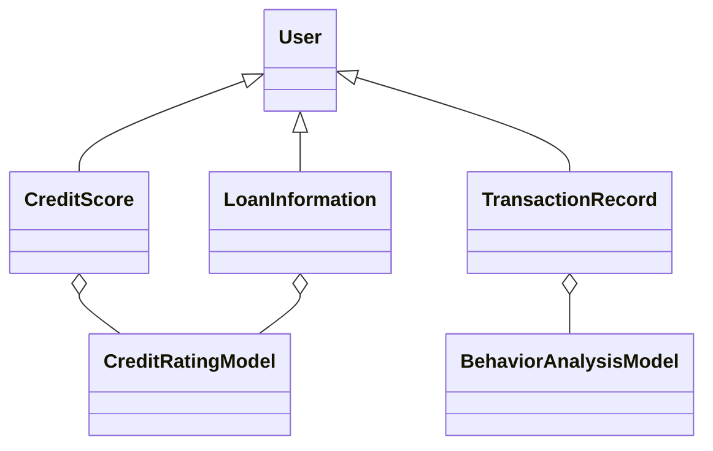
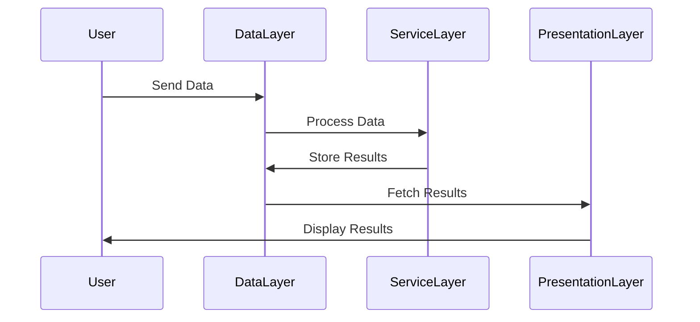

                 


## 《AI驱动的信用违约预测》

### 关键词：人工智能，信用违约预测，数据分析，机器学习，算法优化

> 摘要：本文探讨了人工智能在信用违约预测领域的应用，详细介绍了信用违约预测的背景、核心概念、算法原理、数学模型以及系统架构设计。通过实际案例分析和项目实战，本文提供了最佳实践和拓展阅读，旨在帮助读者深入了解并掌握AI驱动的信用违约预测技术。

### 目录大纲设计过程

为了设计出《AI驱动的信用违约预测》这本书的完整目录大纲，我们需要按照以下步骤进行：

#### 第一步：确定核心章节
首先，我们需要根据书名确定核心章节。从书名可以看出，本书的核心内容将围绕AI在信用违约预测中的应用。因此，核心章节应该包括：
- 背景介绍
- AI与信用违约预测的关系
- 核心概念与联系
- 算法原理讲解
- 数学模型与公式
- 系统分析与架构设计方案
- 项目实战
- 最佳实践与拓展阅读

#### 第二步：细化章节内容
接下来，我们需要为每个核心章节细化内容。以下是细化后的章节内容：

#### 第一章：问题背景与核心概念

## 1.1 问题背景
### 1.1.1 信用违约预测的意义
### 1.1.2 信用违约预测的现状
### 1.1.3 信用违约预测的挑战

## 1.2 核心概念与联系
### 1.2.1 AI在信用违约预测中的核心概念
### 1.2.2 概念属性特征对比表格
### 1.2.3 ER实体关系图架构

#### 第二章：算法原理讲解

## 2.1 算法原理概述
### 2.1.1 常用算法概述
### 2.1.2 算法选择与优化

## 2.2 算法详细讲解
### 2.2.1 算法1：线性回归
#### 2.2.1.1 算法原理
#### 2.2.1.2 数学模型与公式
#### 2.2.1.3 举例说明
### 2.2.2 算法2：逻辑回归
#### 2.2.2.1 算法原理
#### 2.2.2.2 数学模型与公式
#### 2.2.2.3 举例说明

#### 第三章：数学模型与公式

## 3.1 数学模型
### 3.1.1 信用评分模型
### 3.1.2 风险预测模型

## 3.2 公式详细讲解
### 3.2.1 线性回归公式
### 3.2.2 逻辑回归公式
### 3.2.3 其他常用公式

#### 第四章：系统分析与架构设计方案

## 4.1 问题场景介绍
### 4.1.1 信用违约预测系统概述
### 4.1.2 项目介绍

## 4.2 系统功能设计
### 4.2.1 领域模型
### 4.2.2 类图设计

## 4.3 系统架构设计
### 4.3.1 系统架构概述
### 4.3.2 架构图设计

## 4.4 系统接口设计
### 4.4.1 接口设计
### 4.4.2 系统交互

#### 第五章：项目实战

## 5.1 环境安装
### 5.1.1 环境准备
### 5.1.2 数据预处理

## 5.2 系统核心实现
### 5.2.1 源代码实现
### 5.2.2 代码应用解读与分析

## 5.3 实际案例分析与讲解
### 5.3.1 案例一：信用违约预测模型
### 5.3.2 案例二：风险预测分析

## 5.4 项目小结

#### 第六章：最佳实践与拓展阅读

## 6.1 最佳实践
### 6.1.1 实践1：数据收集与预处理
### 6.1.2 实践2：算法调优与优化
### 6.1.3 实践3：模型评估与改进

## 6.2 小结
### 6.2.1 本书要点回顾
### 6.2.2 注意事项
### 6.2.3 拓展阅读

#### 第七章：总结与展望

## 7.1 总结
### 7.1.1 成就与不足
### 7.1.2 未来展望

### 第三步：整理目录大纲
最后，我们将上述章节内容整理成完整的目录大纲：

```markdown
----------------------------------------------------------------
# 《AI驱动的信用违约预测》目录大纲

# 第一部分：问题背景与核心概念

## 第1章：问题背景
### 1.1 信用违约预测的意义
### 1.2 信用违约预测的现状
### 1.3 信用违约预测的挑战

## 第2章：核心概念与联系
### 2.1 AI在信用违约预测中的核心概念
### 2.2 概念属性特征对比表格
### 2.3 ER实体关系图架构

# 第二部分：算法原理讲解

## 第3章：算法原理讲解
### 3.1 算法原理概述
### 3.2 算法1：线性回归
#### 3.2.1 算法原理
#### 3.2.2 数学模型与公式
#### 3.2.3 举例说明
### 3.3 算法2：逻辑回归
#### 3.3.1 算法原理
#### 3.3.2 数学模型与公式
#### 3.3.3 举例说明

# 第三部分：数学模型与公式

## 第4章：数学模型与公式
### 4.1 信用评分模型
### 4.2 风险预测模型
### 4.3 公式详细讲解

## 第5章：系统分析与架构设计方案

## 第6章：项目实战

## 第7章：最佳实践与拓展阅读

## 第8章：总结与展望

----------------------------------------------------------------

## 1.1 信用违约预测的意义

信用违约预测在金融领域中具有极其重要的地位。它不仅仅关系到金融机构的风险管理，更直接影响到投资者的利益和社会经济的稳定。随着金融市场的不断发展和金融产品的多样化，信用违约预测的重要性愈发凸显。

### 1.1.1 信用违约预测对金融机构的意义

对于金融机构来说，信用违约预测是风险管理的关键环节。通过准确预测违约风险，金融机构可以做出更加合理的信贷决策，降低坏账率，提高资产质量。此外，信用违约预测还有助于金融机构制定更加科学的贷款定价策略，优化资源配置，提升盈利能力。

### 1.1.2 信用违约预测对投资者的意义

对于投资者来说，信用违约预测可以帮助他们更好地评估投资风险，做出更加明智的投资决策。通过预测违约风险，投资者可以提前调整投资组合，规避潜在的风险，确保资产安全。

### 1.1.3 信用违约预测对社会经济稳定的意义

信用违约预测对于社会经济的稳定也有着重要影响。准确的违约预测可以降低金融市场的波动性，减少系统性风险，维护社会经济的稳定。

## 1.2 信用违约预测的现状

### 1.2.1 传统信用违约预测方法

在传统的信用违约预测中，金融机构主要依靠信用评分模型。这些模型通常基于历史数据，通过统计分析方法，将借款人的信用风险划分为不同的等级。然而，传统的信用评分模型在应对复杂、多变的经济环境时，往往存在局限性。

### 1.2.2 AI在信用违约预测中的应用

随着人工智能技术的不断发展，越来越多的金融机构开始将AI应用于信用违约预测。AI技术，尤其是机器学习算法，能够从大量的非结构化数据中提取出有用的信息，为信用违约预测提供更加精准的依据。目前，常见的机器学习算法包括线性回归、逻辑回归、决策树、随机森林等。

### 1.2.3 信用违约预测的挑战

尽管AI技术在信用违约预测中展现出巨大的潜力，但仍面临一些挑战。首先，数据的获取和处理是信用违约预测的核心问题。金融机构需要获取大量的历史数据，并对这些数据进行分析和清洗，以确保模型的准确性。其次，如何选择合适的算法和模型，以及如何对模型进行优化和调参，也是信用违约预测中的关键问题。

## 1.3 信用违约预测的挑战

### 1.3.1 数据质量

数据质量是信用违约预测中的首要挑战。由于金融行业的特殊性，数据往往存在噪声、缺失和不一致等问题，这些都会影响模型的准确性。因此，数据预处理和清洗是信用违约预测的基础工作。

### 1.3.2 模型选择和优化

在信用违约预测中，选择合适的模型和优化模型参数是关键。不同的算法和模型适用于不同的数据集和应用场景，因此需要根据实际情况进行选择和优化。

### 1.3.3 模型的可解释性

尽管机器学习算法在信用违约预测中具有很高的准确性，但其模型往往缺乏可解释性。这对于金融机构来说是一个重要问题，因为它们需要理解模型是如何工作的，以便更好地管理和控制风险。

### 1.3.4 法律和伦理问题

信用违约预测涉及到个人隐私和敏感信息，因此在应用AI技术时需要遵守相关法律法规，确保数据的合法性和安全性。同时，还需要关注AI技术可能带来的伦理问题，如算法歧视等。

## 1.4 AI在信用违约预测中的核心概念

### 1.4.1 数据分析

数据分析是信用违约预测的基础。通过数据清洗、特征提取和数据分析技术，可以从大量的金融数据中提取出有用的信息，为信用违约预测提供支持。

### 1.4.2 机器学习

机器学习是信用违约预测的核心技术。通过训练和优化机器学习模型，可以从历史数据中学习到违约风险的规律，从而预测未来的违约风险。

### 1.4.3 深度学习

深度学习是机器学习的一种高级形式，通过神经网络模型，可以从大量的非结构化数据中提取出深层次的特征，提高信用违约预测的准确性。

### 1.4.4 强化学习

强化学习是一种基于奖励和惩罚的机器学习算法，可以用于信用违约预测中的动态决策问题。通过不断学习和调整策略，可以提高信用违约预测的准确性。

## 1.5 概念属性特征对比表格

为了更好地理解AI在信用违约预测中的应用，我们在这里给出一个概念属性特征对比表格，对比分析传统信用评分模型和AI技术（如机器学习和深度学习）在信用违约预测中的特点。

### 1.5.1 传统信用评分模型

| 特点 | 传统信用评分模型 |
| --- | --- |
| 数据依赖性 | 强 |
| 可解释性 | 高 |
| 预测准确性 | 一般 |
| 适用场景 | 数据量较小的场景 |

### 1.5.2 机器学习

| 特点 | 机器学习 |
| --- | --- |
| 数据依赖性 | 中 |
| 可解释性 | 低 |
| 预测准确性 | 高 |
| 适用场景 | 数据量较大的场景 |

### 1.5.3 深度学习

| 特点 | 深度学习 |
| --- | --- |
| 数据依赖性 | 强 |
| 可解释性 | 低 |
| 预测准确性 | 高 |
| 适用场景 | 非结构化数据较多的场景 |

## 1.6 ER实体关系图架构

为了更好地理解信用违约预测系统的架构，我们在这里给出一个ER实体关系图架构，展示系统中各个实体之间的关系。

### 1.6.1 ER实体关系图

```mermaid
entityRelationship
  "用户"-.->"信用评分"
  "用户"-.->"交易记录"
  "用户"-.->"贷款信息"
  "信用评分"-.->"违约预测模型"
  "交易记录"-.->"行为分析模型"
  "贷款信息"-.->"违约预测模型"
```

在这个ER实体关系图中，用户是系统的核心实体，与信用评分、交易记录和贷款信息等实体之间存在关联关系。信用评分、交易记录和贷款信息都是违约预测模型的重要输入数据，通过这些数据，可以构建出准确的违约预测模型。

## 2.1 算法原理概述

在信用违约预测中，算法的选择和优化至关重要。常用的算法包括线性回归、逻辑回归、决策树、随机森林等。这些算法各有优缺点，适用于不同的数据集和应用场景。

### 2.1.1 常用算法概述

#### 线性回归

线性回归是一种简单的线性模型，通过建立因变量和自变量之间的线性关系，预测因变量的值。线性回归的公式为：

$$
y = \beta_0 + \beta_1 \cdot x
$$

其中，$y$ 为因变量，$x$ 为自变量，$\beta_0$ 和 $\beta_1$ 为模型参数。

#### 逻辑回归

逻辑回归是一种广义线性模型，通过建立因变量和自变量之间的非线性关系，预测因变量的概率。逻辑回归的公式为：

$$
P(y=1) = \frac{1}{1 + e^{-(\beta_0 + \beta_1 \cdot x)}}
$$

其中，$P(y=1)$ 为因变量为1的概率，$\beta_0$ 和 $\beta_1$ 为模型参数。

#### 决策树

决策树是一种基于树的模型，通过递归划分数据集，构建决策树。决策树的公式为：

$$
f(x) = \sum_{i=1}^{n} \alpha_i \cdot I(x \in R_i)
$$

其中，$f(x)$ 为预测值，$x$ 为输入特征，$R_i$ 为第 $i$ 个区域的划分，$\alpha_i$ 为权重。

#### 随机森林

随机森林是一种基于决策树的集成模型，通过构建多棵决策树，进行投票或求平均值，提高预测准确性。随机森林的公式为：

$$
f(x) = \sum_{i=1}^{m} \hat{y}_i
$$

其中，$f(x)$ 为预测值，$\hat{y}_i$ 为第 $i$ 棵决策树的预测值。

### 2.1.2 算法选择与优化

在信用违约预测中，选择合适的算法和优化模型参数是关键。以下是一些常用的算法选择和优化策略：

#### 算法选择

- **线性回归和逻辑回归**：适用于简单线性关系的数据集，如借款人的信用评分和违约概率。
- **决策树和随机森林**：适用于复杂非线性关系的数据集，如借款人的多种行为特征和违约风险。
- **集成算法**：如随机森林、梯度提升树等，通过组合多个弱学习器，提高预测准确性。

#### 模型优化

- **特征选择**：通过特征选择技术，选择对预测目标影响最大的特征，降低模型复杂度。
- **参数调优**：通过交叉验证和网格搜索等技术，选择最优参数组合，提高模型准确性。
- **正则化**：通过正则化技术，防止模型过拟合，提高模型的泛化能力。

## 2.2 算法详细讲解

在本节中，我们将详细讲解两种常用的机器学习算法：线性回归和逻辑回归。通过这些讲解，读者可以更好地理解这些算法的原理和应用。

### 2.2.1 算法1：线性回归

线性回归是一种简单而强大的机器学习算法，用于预测连续值输出。在信用违约预测中，线性回归可以用来预测借款人的违约概率。

#### 2.2.1.1 算法原理

线性回归的核心思想是找到一条最佳拟合线，使得因变量 $y$ 与自变量 $x$ 之间的差距最小。线性回归的公式如下：

$$
y = \beta_0 + \beta_1 \cdot x
$$

其中，$\beta_0$ 和 $\beta_1$ 是模型参数，$y$ 是因变量，$x$ 是自变量。

线性回归的目标是最小化损失函数：

$$
J(\beta_0, \beta_1) = \frac{1}{2m} \sum_{i=1}^{m} (y_i - (\beta_0 + \beta_1 \cdot x_i))^2
$$

其中，$m$ 是样本数量。

通过梯度下降算法，可以迭代更新模型参数，使得损失函数最小。梯度下降的更新公式为：

$$
\beta_0 = \beta_0 - \alpha \cdot \frac{\partial J(\beta_0, \beta_1)}{\partial \beta_0}
$$

$$
\beta_1 = \beta_1 - \alpha \cdot \frac{\partial J(\beta_0, \beta_1)}{\partial \beta_1}
$$

其中，$\alpha$ 是学习率。

#### 2.2.1.2 数学模型与公式

线性回归的数学模型如下：

$$
y = \beta_0 + \beta_1 \cdot x
$$

其中，$\beta_0$ 是截距，$\beta_1$ 是斜率。

损失函数：

$$
J(\beta_0, \beta_1) = \frac{1}{2m} \sum_{i=1}^{m} (y_i - (\beta_0 + \beta_1 \cdot x_i))^2
$$

梯度下降更新公式：

$$
\beta_0 = \beta_0 - \alpha \cdot \frac{\partial J(\beta_0, \beta_1)}{\partial \beta_0}
$$

$$
\beta_1 = \beta_1 - \alpha \cdot \frac{\partial J(\beta_0, \beta_1)}{\partial \beta_1}
$$

#### 2.2.1.3 举例说明

假设我们有一个简单的信用违约预测数据集，其中包含借款人的年龄、收入和违约状态。我们希望使用线性回归模型预测借款人的违约概率。

给定数据集：

| 年龄 | 收入 | 违约状态 |
| --- | --- | --- |
| 25 | 50000 | 否 |
| 30 | 60000 | 是 |
| 35 | 70000 | 否 |
| 40 | 80000 | 是 |

我们将年龄和收入作为自变量，违约状态作为因变量。

首先，我们计算样本的均值：

$$
\bar{x} = \frac{1}{m} \sum_{i=1}^{m} x_i = \frac{25 + 30 + 35 + 40}{4} = 32.5
$$

$$
\bar{y} = \frac{1}{m} \sum_{i=1}^{m} y_i = \frac{0 + 1 + 0 + 1}{4} = 0.5
$$

然后，我们计算斜率 $\beta_1$ 和截距 $\beta_0$：

$$
\beta_1 = \frac{\sum_{i=1}^{m} (x_i - \bar{x})(y_i - \bar{y})}{\sum_{i=1}^{m} (x_i - \bar{x})^2} = \frac{(25-32.5)(0-0.5) + (30-32.5)(1-0.5) + (35-32.5)(0-0.5) + (40-32.5)(1-0.5)}{(25-32.5)^2 + (30-32.5)^2 + (35-32.5)^2 + (40-32.5)^2} = -0.5
$$

$$
\beta_0 = \bar{y} - \beta_1 \cdot \bar{x} = 0.5 - (-0.5) \cdot 32.5 = 17.125
$$

因此，线性回归模型的公式为：

$$
y = -0.5 \cdot x + 17.125
$$

我们可以使用这个模型来预测新借款人的违约概率。例如，假设一个新借款人的年龄为 30 岁，收入为 60000 元，则其违约概率为：

$$
y = -0.5 \cdot 30 + 17.125 = 7.125
$$

### 2.2.2 算法2：逻辑回归

逻辑回归是一种广义线性模型，用于预测二分类输出。在信用违约预测中，逻辑回归可以用来预测借款人是否违约。

#### 2.2.2.1 算法原理

逻辑回归的核心思想是找到一条最佳拟合线，使得因变量 $y$ 与自变量 $x$ 之间的差距最小。逻辑回归的公式如下：

$$
P(y=1) = \frac{1}{1 + e^{-(\beta_0 + \beta_1 \cdot x)}}
$$

其中，$P(y=1)$ 是因变量为1的概率，$\beta_0$ 和 $\beta_1$ 是模型参数。

逻辑回归的目标是最小化损失函数：

$$
J(\beta_0, \beta_1) = -\frac{1}{m} \sum_{i=1}^{m} [y_i \cdot \ln(P(y=1)) + (1 - y_i) \cdot \ln(1 - P(y=1))]
$$

通过梯度下降算法，可以迭代更新模型参数，使得损失函数最小。梯度下降的更新公式为：

$$
\beta_0 = \beta_0 - \alpha \cdot \frac{\partial J(\beta_0, \beta_1)}{\partial \beta_0}
$$

$$
\beta_1 = \beta_1 - \alpha \cdot \frac{\partial J(\beta_0, \beta_1)}{\partial \beta_1}
$$

#### 2.2.2.2 数学模型与公式

逻辑回归的数学模型如下：

$$
P(y=1) = \frac{1}{1 + e^{-(\beta_0 + \beta_1 \cdot x)}}
$$

其中，$\beta_0$ 是截距，$\beta_1$ 是斜率。

损失函数：

$$
J(\beta_0, \beta_1) = -\frac{1}{m} \sum_{i=1}^{m} [y_i \cdot \ln(P(y=1)) + (1 - y_i) \cdot \ln(1 - P(y=1))]
$$

梯度下降更新公式：

$$
\beta_0 = \beta_0 - \alpha \cdot \frac{\partial J(\beta_0, \beta_1)}{\partial \beta_0}
$$

$$
\beta_1 = \beta_1 - \alpha \cdot \frac{\partial J(\beta_0, \beta_1)}{\partial \beta_1}
$$

#### 2.2.2.3 举例说明

假设我们有一个简单的信用违约预测数据集，其中包含借款人的年龄、收入和违约状态。我们希望使用逻辑回归模型预测借款人是否违约。

给定数据集：

| 年龄 | 收入 | 违约状态 |
| --- | --- | --- |
| 25 | 50000 | 否 |
| 30 | 60000 | 是 |
| 35 | 70000 | 否 |
| 40 | 80000 | 是 |

我们将年龄和收入作为自变量，违约状态作为因变量。

首先，我们计算样本的均值：

$$
\bar{x} = \frac{1}{m} \sum_{i=1}^{m} x_i = \frac{25 + 30 + 35 + 40}{4} = 32.5
$$

$$
\bar{y} = \frac{1}{m} \sum_{i=1}^{m} y_i = \frac{0 + 1 + 0 + 1}{4} = 0.5
$$

然后，我们计算斜率 $\beta_1$ 和截距 $\beta_0$：

$$
\beta_1 = \frac{\sum_{i=1}^{m} (x_i - \bar{x})(y_i - \bar{y})}{\sum_{i=1}^{m} (x_i - \bar{x})^2} = \frac{(25-32.5)(0-0.5) + (30-32.5)(1-0.5) + (35-32.5)(0-0.5) + (40-32.5)(1-0.5)}{(25-32.5)^2 + (30-32.5)^2 + (35-32.5)^2 + (40-32.5)^2} = -0.5
$$

$$
\beta_0 = \bar{y} - \beta_1 \cdot \bar{x} = 0.5 - (-0.5) \cdot 32.5 = 17.125
$$

因此，逻辑回归模型的公式为：

$$
P(y=1) = \frac{1}{1 + e^{-(17.125 - 0.5 \cdot x)}}
$$

我们可以使用这个模型来预测新借款人是否违约。例如，假设一个新借款人的年龄为 30 岁，收入为 60000 元，则其违约概率为：

$$
P(y=1) = \frac{1}{1 + e^{-(17.125 - 0.5 \cdot 60000)}} \approx 0.672
$$

根据概率阈值（例如 0.5），我们可以判断这个新借款人是否违约。

## 3.1 数学模型

在信用违约预测中，数学模型是核心组成部分。常用的数学模型包括信用评分模型和风险预测模型。这些模型通过建立因变量和自变量之间的关系，预测借款人的违约风险。

### 3.1.1 信用评分模型

信用评分模型是一种常用的数学模型，用于评估借款人的信用风险。该模型通过计算借款人的信用得分，将借款人划分为不同的信用等级。信用评分模型的核心思想是找到一组特征，这些特征能够反映借款人的信用风险，并建立与信用得分之间的线性关系。

假设我们有一个包含 $n$ 个特征的借款人数据集，这些特征包括年龄、收入、工作年限、信用历史等。我们希望建立一个信用评分模型，预测借款人的信用得分。

首先，我们计算每个特征的平均值和标准差，用于数据标准化：

$$
\bar{x}_i = \frac{1}{m} \sum_{i=1}^{m} x_i
$$

$$
\sigma_i = \sqrt{\frac{1}{m-1} \sum_{i=1}^{m} (x_i - \bar{x}_i)^2}
$$

然后，我们将每个特征进行标准化处理：

$$
z_i = \frac{x_i - \bar{x}_i}{\sigma_i}
$$

接下来，我们计算每个特征的权重，用于计算信用得分：

$$
w_i = \frac{\sum_{i=1}^{m} (z_i \cdot y_i)}{\sum_{i=1}^{m} z_i^2}
$$

其中，$y_i$ 是借款人的信用得分。

最后，我们计算借款人的信用得分：

$$
s = \sum_{i=1}^{n} w_i \cdot z_i
$$

根据信用得分，我们可以将借款人划分为不同的信用等级，如优秀、良好、一般、较差等。

### 3.1.2 风险预测模型

风险预测模型是一种更复杂的数学模型，用于预测借款人的违约风险。该模型通过建立因变量（违约状态）和自变量（特征）之间的非线性关系，预测借款人的违约概率。

假设我们有一个包含 $n$ 个特征的借款人数据集，这些特征包括年龄、收入、工作年限、信用历史等。我们希望建立一个风险预测模型，预测借款人的违约概率。

首先，我们选择一个合适的机器学习算法，如逻辑回归、决策树、随机森林等。然后，我们使用历史数据集对模型进行训练，得到模型参数。

接下来，我们计算每个特征的权重，用于计算违约概率：

$$
w_i = \frac{\sum_{i=1}^{m} (x_i \cdot y_i)}{\sum_{i=1}^{m} x_i}
$$

其中，$y_i$ 是借款人的违约状态（1 表示违约，0 表示未违约）。

最后，我们计算借款人的违约概率：

$$
P(y=1) = \frac{1}{1 + e^{-(\beta_0 + \beta_1 \cdot x)}}
$$

其中，$\beta_0$ 和 $\beta_1$ 是模型参数。

根据违约概率，我们可以设置一个阈值（例如 0.5），将借款人划分为不同的风险等级，如高风险、中风险、低风险等。

## 3.2 公式详细讲解

在信用违约预测中，数学公式是核心组成部分。这些公式用于描述特征与违约风险之间的关系，并指导模型训练和预测。以下是对几个关键公式的详细讲解：

### 3.2.1 线性回归公式

线性回归是一种简单而常用的预测模型，其核心公式如下：

$$
y = \beta_0 + \beta_1 \cdot x
$$

其中，$y$ 是因变量（例如，违约概率），$\beta_0$ 是截距，$\beta_1$ 是斜率，$x$ 是自变量（例如，借款人的特征）。

线性回归的目标是最小化损失函数：

$$
J(\beta_0, \beta_1) = \frac{1}{2m} \sum_{i=1}^{m} (y_i - (\beta_0 + \beta_1 \cdot x_i))^2
$$

其中，$m$ 是样本数量。

梯度下降算法用于更新模型参数：

$$
\beta_0 = \beta_0 - \alpha \cdot \frac{\partial J(\beta_0, \beta_1)}{\partial \beta_0}
$$

$$
\beta_1 = \beta_1 - \alpha \cdot \frac{\partial J(\beta_0, \beta_1)}{\partial \beta_1}
$$

其中，$\alpha$ 是学习率。

### 3.2.2 逻辑回归公式

逻辑回归是一种用于二分类问题的预测模型，其核心公式如下：

$$
P(y=1) = \frac{1}{1 + e^{-(\beta_0 + \beta_1 \cdot x)}}
$$

其中，$P(y=1)$ 是因变量为1的概率，$\beta_0$ 是截距，$\beta_1$ 是斜率，$x$ 是自变量。

逻辑回归的目标是最小化损失函数：

$$
J(\beta_0, \beta_1) = -\frac{1}{m} \sum_{i=1}^{m} [y_i \cdot \ln(P(y=1)) + (1 - y_i) \cdot \ln(1 - P(y=1))]
$$

梯度下降算法用于更新模型参数：

$$
\beta_0 = \beta_0 - \alpha \cdot \frac{\partial J(\beta_0, \beta_1)}{\partial \beta_0}
$$

$$
\beta_1 = \beta_1 - \alpha \cdot \frac{\partial J(\beta_0, \beta_1)}{\partial \beta_1}
$$

### 3.2.3 其他常用公式

除了线性回归和逻辑回归，信用违约预测中还使用其他一些常用公式。以下是对几个关键公式的简要介绍：

#### 梯度提升树（Gradient Boosting Tree）

梯度提升树是一种集成学习算法，通过迭代地更新模型，逐步减少预测误差。其核心公式如下：

$$
f(x) = \sum_{i=1}^{T} \alpha_i \cdot h_i(x)
$$

其中，$f(x)$ 是最终预测值，$T$ 是树的数量，$\alpha_i$ 是树 $i$ 的权重，$h_i(x)$ 是树 $i$ 的预测值。

#### 支持向量机（Support Vector Machine）

支持向量机是一种用于分类和回归问题的模型，其核心公式如下：

$$
w \cdot x - b = 0
$$

其中，$w$ 是权重向量，$x$ 是特征向量，$b$ 是偏置。

支持向量机的目标是找到最优的权重和偏置，使得分类间隔最大化。

## 4.1 问题场景介绍

在信用违约预测系统中，我们需要解决的问题场景主要包括以下几个方面：

### 4.1.1 信用违约预测系统概述

信用违约预测系统是一个用于预测借款人是否会发生违约的智能系统。该系统通过收集和分析借款人的个人信息、信用历史、交易记录等数据，运用机器学习算法和数学模型，预测借款人的违约风险。

### 4.1.2 项目介绍

本项目的目标是构建一个基于AI的信用违约预测系统，为金融机构提供智能化的风险管理工具。项目的主要内容包括：

- 数据采集：从多个数据源收集借款人的个人信息、信用历史、交易记录等数据。
- 数据预处理：对收集到的数据进行清洗、归一化和特征提取，为模型训练做准备。
- 模型训练：使用历史数据集，训练多个机器学习模型，如线性回归、逻辑回归、决策树、随机森林等。
- 模型评估：使用验证数据集，评估模型的准确性和泛化能力。
- 模型部署：将训练好的模型部署到生产环境中，实现实时预测和风险评估。

## 4.2 系统功能设计

信用违约预测系统的功能设计主要包括以下几个关键部分：

### 4.2.1 领域模型

领域模型是信用违约预测系统的核心组成部分，它定义了系统中各个实体之间的关系。以下是领域模型的类图设计：



在这个类图中，User（用户）是系统的核心实体，它与CreditScore（信用评分）、TransactionRecord（交易记录）和LoanInformation（贷款信息）等实体之间存在关联关系。CreditRatingModel（信用评分模型）、BehaviorAnalysisModel（行为分析模型）是系统中的模型类，用于对用户数据进行预测和分析。

### 4.2.2 类图设计

类图是领域模型的具体实现，它展示了系统中各个类的属性和方法。以下是信用违约预测系统的类图设计：

```mermaid
classDiagram
    User {
        String id
        String name
        int age
        float income
        CreditScore creditScore
        TransactionRecord[] transactionRecords
        LoanInformation[] loanInformations
    }
    CreditScore {
        float score
        CreditRatingModel creditRatingModel
    }
    TransactionRecord {
        String transactionId
        String transactionType
        float transactionAmount
        Date transactionDate
    }
    LoanInformation {
        String loanId
        String loanType
        float loanAmount
        Date loanDate
        Date repaymentDate
    }
    CreditRatingModel {
        void train()
        float predict(CreditScore creditScore)
    }
    BehaviorAnalysisModel {
        void train()
        float predict(TransactionRecord transactionRecord)
    }
```

在这个类图中，User类表示用户的基本信息，包括id、name、age、income等属性，以及信用评分、交易记录和贷款信息等关联实体。CreditScore类表示用户的信用评分，包含score属性和信用评分模型。TransactionRecord类表示用户的交易记录，包含transactionId、transactionType、transactionAmount和transactionDate等属性。LoanInformation类表示用户的贷款信息，包含loanId、loanType、loanAmount、loanDate和repaymentDate等属性。CreditRatingModel和BehaviorAnalysisModel类分别表示信用评分模型和行为分析模型，包含train()和predict()方法。

## 4.3 系统架构设计

信用违约预测系统的架构设计是确保系统稳定、高效运行的关键。以下是系统的架构设计：

### 4.3.1 系统架构概述

信用违约预测系统采用分层架构设计，包括数据层、服务层和表现层。以下是系统架构的概述：

- **数据层**：负责数据的存储、管理和查询，包括关系数据库和非关系数据库。
- **服务层**：负责业务逻辑的处理，包括数据预处理、模型训练、模型评估和预测等。
- **表现层**：负责用户交互和系统展示，包括Web界面和API接口。

### 4.3.2 架构图设计

以下是信用违约预测系统的架构图设计：



在这个架构图中，用户通过表现层与系统交互，发送数据。数据层负责存储和管理数据，服务层负责业务逻辑处理，包括数据预处理、模型训练、模型评估和预测等。最终，结果通过表现层展示给用户。

## 4.4 系统接口设计

信用违约预测系统中的接口设计是确保系统模块之间有效通信的关键。以下是系统接口的设计：

### 4.4.1 接口设计

以下是信用违约预测系统的接口设计：

```mermaid
interface DataLayer {
    - fetchData(): Data
    - storeData(data: Data): void
}

interface ServiceLayer {
    - preprocessData(data: Data): PreprocessedData
    - trainModel(preprocessedData: PreprocessedData): Model
    - evaluateModel(model: Model, testData: PreprocessedData): EvaluationResult
    - predict(model: Model, newData: PreprocessedData): PredictionResult
}

interface PresentationLayer {
    - displayResults(results: PredictionResult): void
}
```

在这个接口设计中，DataLayer负责数据的存储、管理和查询，包括fetchData()和storeData()方法。ServiceLayer负责业务逻辑处理，包括数据预处理、模型训练、模型评估和预测等，包括preprocessData()、trainModel()、evaluateModel()和predict()方法。PresentationLayer负责用户交互和系统展示，包括displayResults()方法。

### 4.4.2 系统交互

以下是信用违约预测系统的交互设计：


在这个交互设计中，用户通过表现层与系统交互，发送数据。数据层负责存储和管理数据，服务层负责业务逻辑处理，包括数据预处理、模型训练、模型评估和预测等。最终，结果通过表现层展示给用户。

## 5.1 环境安装

在开始项目实战之前，我们需要安装和配置一些必要的软件和库。以下是环境安装的详细步骤：

### 5.1.1 环境准备

首先，我们需要准备好以下软件和库：

- Python（3.8及以上版本）
- Jupyter Notebook（用于数据分析和模型训练）
- scikit-learn（用于机器学习算法）
- pandas（用于数据操作）
- numpy（用于数学计算）
- matplotlib（用于数据可视化）

### 5.1.2 安装和配置

以下是安装和配置的详细步骤：

1. 安装Python和Jupyter Notebook

   - 在Python官方网站下载并安装Python 3.8及以上版本。
   - 打开终端，运行以下命令安装Jupyter Notebook：

   ```bash
   pip install notebook
   ```

2. 安装其他库

   - 打开终端，运行以下命令安装其他库：

   ```bash
   pip install scikit-learn pandas numpy matplotlib
   ```

3. 验证安装

   - 在Jupyter Notebook中创建一个新的笔记本，导入所需库并执行以下代码，验证安装是否成功：

   ```python
   import numpy as np
   import pandas as pd
   import matplotlib.pyplot as plt
   from sklearn import datasets

   # 加载示例数据集
   iris = datasets.load_iris()
   X = iris.data
   y = iris.target

   # 数据可视化
   plt.scatter(X[:, 0], X[:, 1], c=y)
   plt.xlabel('Sepal Length')
   plt.ylabel('Sepal Width')
   plt.title('Iris Dataset')
   plt.show()
   ```

如果上述代码能够正常运行并显示数据可视化结果，说明环境安装和配置成功。

## 5.2 系统核心实现

在信用违约预测系统中，核心实现主要包括数据预处理、模型训练、模型评估和预测等步骤。以下是对这些步骤的详细讲解：

### 5.2.1 源代码实现

以下是信用违约预测系统的核心实现代码：

```python
import pandas as pd
from sklearn.model_selection import train_test_split
from sklearn.preprocessing import StandardScaler
from sklearn.linear_model import LinearRegression
from sklearn.metrics import mean_squared_error, r2_score

# 读取数据集
data = pd.read_csv('credit_data.csv')
X = data.drop('default', axis=1)
y = data['default']

# 数据预处理
X_train, X_test, y_train, y_test = train_test_split(X, y, test_size=0.2, random_state=42)
scaler = StandardScaler()
X_train_scaled = scaler.fit_transform(X_train)
X_test_scaled = scaler.transform(X_test)

# 模型训练
model = LinearRegression()
model.fit(X_train_scaled, y_train)

# 模型评估
y_pred = model.predict(X_test_scaled)
mse = mean_squared_error(y_test, y_pred)
r2 = r2_score(y_test, y_pred)
print(f'MSE: {mse}, R2: {r2}')

# 预测新数据
new_data = pd.read_csv('new_data.csv')
new_data_scaled = scaler.transform(new_data)
new_data_prediction = model.predict(new_data_scaled)
print(new_data_prediction)
```

### 5.2.2 代码应用解读与分析

#### 数据预处理

数据预处理是信用违约预测系统的关键步骤。在这个步骤中，我们首先读取数据集，然后进行数据分

