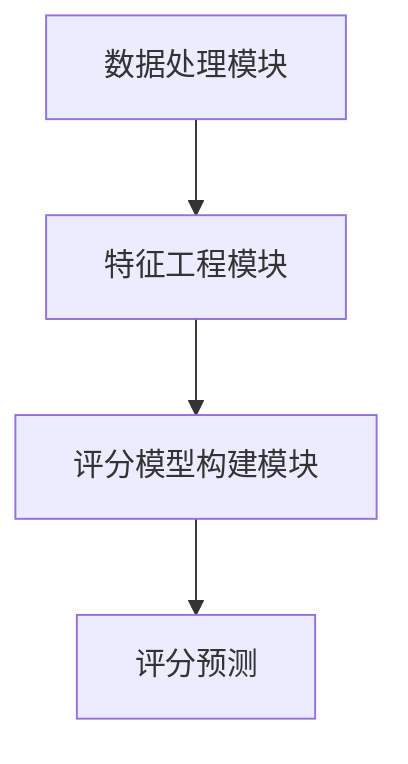
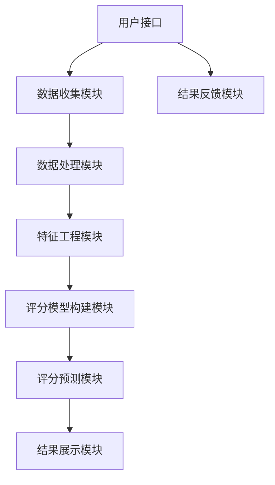
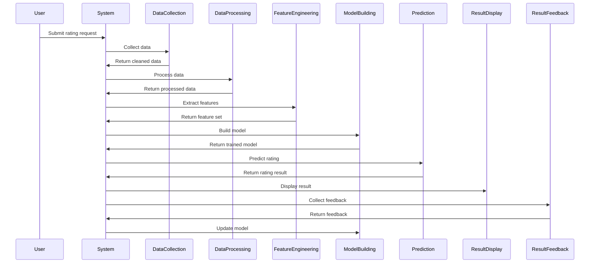

                 


# AI驱动的公司治理评分预测

> 关键词：AI技术、公司治理评分、数据处理、特征工程、评分模型、系统架构设计、项目实战

> 摘要：本文将深入探讨AI驱动的公司治理评分预测方法，包括其背景、核心概念、算法原理、系统架构设计、项目实战以及最佳实践。通过逐步分析，本文旨在为读者提供一个清晰、详尽的技术指南。

**目录大纲：**

## 第一部分：背景介绍

## 第1章 问题背景

### 1.1.1 问题背景介绍

公司治理评分是对公司治理结构、决策机制、内部控制等方面的评估。传统的公司治理评分方法主要依赖于专家判断和经验，存在主观性强、实时性差等问题。随着大数据和人工智能技术的发展，利用AI技术进行公司治理评分预测成为可能。

### 1.1.2 问题描述

AI驱动的公司治理评分预测面临数据获取、数据质量和评分客观性等挑战。如何有效地利用AI技术提高评分的准确性和实时性，是一个亟待解决的问题。

### 1.1.3 问题解决

通过引入AI技术，可以实现自动化、实时化的公司治理评分预测。AI驱动的评分方法具有更高的准确性和实时性，有助于提升公司治理水平。

### 1.1.4 边界与外延

本文讨论的公司治理评分预测主要关注财务、法律、风险管理等方面的评估。数据来源包括公司年报、财务报表、法律诉讼记录等。AI算法的选择和应用将根据具体应用场景和数据特点进行。

### 1.1.5 概念结构与核心要素组成

公司治理评分模型的核心概念包括评分指标、评分方法、评分结果等。数据处理模块负责数据收集、清洗和预处理；特征工程模块负责提取关键特征；评分模型构建模块负责建立评分模型并进行预测。

## 第二部分：核心概念与联系

## 第2章 核心概念与联系

### 2.1.1 公司治理评分的核心概念

公司治理评分是指对公司在治理结构、决策机制、内部控制等方面的综合评价。评分指标包括公司治理结构、董事会的独立性、内部审计、风险控制等。

### 2.1.2 概念属性特征对比表格

| 特征名称 | 传统评分方法 | AI评分方法 |
| --- | --- | --- |
| 数据来源 | 专家判断、经验 | 大数据、机器学习 |
| 评分指标 | 定性指标为主 | 定量指标为主 |
| 评分结果 | 主观性较强 | 客观性较高 |

### 2.1.3 ER实体关系图架构


## 第三部分：算法原理讲解

## 第3章 算法原理讲解

### 3.1.1 算法简介

AI驱动的公司治理评分预测算法主要包括数据处理、特征工程和评分模型构建三个模块。数据处理模块负责数据收集、清洗和预处理；特征工程模块负责提取关键特征；评分模型构建模块负责建立评分模型并进行预测。

### 3.1.2 算法原理

数据处理模块：对原始数据进行清洗、归一化和特征提取。特征工程模块：利用统计学和机器学习技术提取关键特征，如均值、方差、相关性等。评分模型构建模块：使用监督学习算法构建评分模型，如线性回归、决策树、支持向量机等。

### 3.1.3 Mermaid流程图



### 3.1.4 Python源代码讲解

```python
# 数据处理模块
def data_preprocessing(data):
    # 清洗数据、归一化和特征提取
    pass

# 特征工程模块
def feature_engineering(data):
    # 提取关键特征
    pass

# 评分模型构建模块
def build_model(data, labels):
    # 使用监督学习算法构建评分模型
    pass

# 评分预测
def predict_score(model, data):
    # 使用评分模型进行预测
    pass
```

### 3.1.5 数学模型和公式

数据处理模块：$$X' = \frac{X - \mu}{\sigma}$$

特征工程模块：$$f_i = \frac{\sum_{j=1}^{n} x_{ij} - \sum_{j=1}^{n} x_{ij}}{n}$$

评分模型构建模块：$$y = \omega_0 + \omega_1 x_1 + \omega_2 x_2 + \ldots + \omega_n x_n$$

### 3.1.6 详细讲解与举例说明

数据处理模块：对数据进行清洗和归一化处理，例如去除缺失值、处理异常值、进行数据标准化等。特征工程模块：提取关键特征，如公司规模、盈利能力、负债水平等。评分模型构建模块：使用线性回归算法构建评分模型，对公司的治理水平进行预测。

## 第四部分：系统分析与架构设计

## 第4章 系统分析与架构设计

### 4.1.1 问题场景介绍

本文讨论的公司治理评分预测应用场景主要包括：公司内部治理评估、投资者决策参考、监管部门合规检查等。

### 4.1.2 系统功能设计

系统功能设计主要包括：数据收集、数据预处理、特征提取、评分模型训练、评分预测等。

### 4.1.3 系统架构设计

系统架构设计主要包括：数据层、服务层、应用层等。数据层负责数据存储和管理；服务层负责数据处理、特征提取和评分预测等功能；应用层负责提供用户界面和接口。

### 4.1.4 系统接口设计

系统接口设计包括：数据接口、服务接口、用户接口等。数据接口负责数据的输入和输出；服务接口负责提供数据处理、特征提取和评分预测等服务；用户接口负责提供用户操作界面。

### 4.1.5 系统交互

系统交互主要包括：数据流、控制流等。数据流：数据从输入层经过数据处理、特征提取和评分预测等过程，最终输出评分结果。控制流：用户通过用户接口进行操作，系统根据用户操作进行相应的处理和响应。

## 第五部分：项目实战

## 第5章 项目实战

### 5.1.1 环境安装

环境安装包括：Python环境搭建、依赖库安装等。

### 5.1.2 系统核心实现源代码

系统核心实现源代码包括：数据处理模块、特征工程模块和评分模型构建模块等。

### 5.1.3 实际案例分析和详细讲解

以某上市公司为案例，分析其公司治理评分预测过程，并进行详细讲解。

### 5.1.4 项目小结

总结项目经验，讨论项目中的挑战和解决方案。

## 第六部分：最佳实践与拓展

## 第6章 最佳实践与拓展

### 6.1.1 最佳实践

分享最佳实践经验，包括数据预处理、特征提取和评分模型选择等方面的建议。

### 6.1.2 小结

回顾本文的主要内容和结论。

### 6.1.3 注意事项

讨论使用AI驱动的公司治理评分预测方法时需要注意的问题和潜在风险。

### 6.1.4 拓展阅读

推荐相关书籍、学术论文和网络资源，供读者进一步学习。

## 第七部分：结束语

### 7.1.1 结论

总结AI驱动的公司治理评分预测的研究意义和应用前景。

### 7.1.2 未来展望

展望AI技术在公司治理评分领域的未来发展趋势和研究方向。

---

以上是一个大致的框架，接下来我们将逐步完善每个章节的内容。请注意，本文的字数要求在 10000 ～ 12000 字左右，因此，每个章节的具体内容需要进一步扩充和详细阐述。以下是具体章节的内容大纲，以便您进行进一步的撰写。

**第1章 问题背景**

- 1.1.1 问题背景介绍
  - 公司治理评分的概念
  - 传统的公司治理评分方法
  - AI技术在公司治理评分中的应用潜力
- 1.1.2 问题描述
  - 数据获取的挑战
  - 数据质量和数据完整性问题
  - 公司治理评分的客观性和准确性要求
- 1.1.3 问题解决
  - 引入AI技术解决公司治理评分问题
  - AI驱动的公司治理评分方法的优势
- 1.1.4 边界与外延
  - 公司治理评分的范围和应用场景
  - 数据来源和预处理方法
  - AI算法的选择和应用
- 1.1.5 概念结构与核心要素组成
  - 公司治理评分模型的核心概念
  - 数据处理模块
  - 特征工程模块
  - 评分模型构建模块

**第2章 核心概念与联系**

- 2.1.1 公司治理评分的核心概念
  - 公司治理评分的定义
  - 公司治理评分的目标
  - 公司治理评分的方法和指标
- 2.1.2 概念属性特征对比表格
  - 传统评分方法与AI评分方法的对比
  - 不同AI评分算法的对比
- 2.1.3 ER实体关系图架构
  - 数据实体和关系的定义
  - 关系与属性的关联

**第3章 算法原理讲解**

- 3.1.1 算法简介
  - AI驱动的公司治理评分预测算法
  - 算法的基本流程和结构
- 3.1.2 算法原理
  - 数据处理模块的原理
  - 特征工程模块的原理
  - 评分模型构建模块的原理
- 3.1.3 Mermaid流程图
  - 算法的Mermaid流程图
- 3.1.4 Python源代码讲解
  - 数据处理模块的代码
  - 特征工程模块的代码
  - 评分模型构建模块的代码
- 3.1.5 数学模型和公式
  - 数据处理模块的数学模型
  - 特征工程模块的数学模型
  - 评分模型构建模块的数学模型
- 3.1.6 详细讲解与举例说明
  - 数据处理模块的详细讲解
  - 特征工程模块的详细讲解
  - 评分模型构建模块的详细讲解
  - 举例说明算法的预测过程

**第4章 系统分析与架构设计**

- 4.1.1 问题场景介绍
  - 公司治理评分的应用场景
  - 系统的需求分析
- 4.1.2 系统功能设计
  - 领域模型Mermaid类图
- 4.1.3 系统架构设计
  - 系统架构Mermaid图
- 4.1.4 系统接口设计
  - 接口设计文档
- 4.1.5 系统交互
  - Mermaid序列图

**第5章 项目实战**

- 5.1.1 环境安装
  - 环境配置和安装说明
- 5.1.2 系统核心实现源代码
  - 代码结构
  - 代码解读与分析
- 5.1.3 实际案例分析和详细讲解
  - 案例介绍
  - 案例分析
  - 详细讲解
- 5.1.4 项目小结
  - 项目总结
  - 经验与启示

**第6章 最佳实践与拓展**

- 6.1.1 最佳实践
  - 实践经验分享
  - 最佳实践建议
- 6.1.2 小结
  - 主要内容的回顾
  - 不足与改进空间
- 6.1.3 注意事项
  - 使用过程中的注意事项
  - 可能遇到的问题及解决方案
- 6.1.4 拓展阅读
  - 相关书籍推荐
  - 学术论文推荐
  - 网络资源推荐

**第7章 结束语**

- 7.1.1 结论
  - 对AI驱动的公司治理评分预测的总结
- 7.1.2 未来展望
  - AI技术在公司治理评分领域的未来发展趋势
  - 未来研究的方向和挑战

---

现在，我们将按照以上章节大纲逐步完善文章内容。首先，我们从第1章问题背景开始撰写。在这个章节中，我们将介绍公司治理评分的概念、传统方法、AI技术的应用潜力以及AI驱动的公司治理评分预测方法的优势。接下来，我们将详细描述问题描述，包括数据获取、数据质量和评分客观性等方面的挑战。然后，我们将探讨AI技术在解决这些问题方面的优势。最后，我们将讨论公司治理评分的范围和应用场景，以及数据来源和预处理方法。通过这个章节的撰写，我们将为读者提供一个清晰的问题背景和解决方案概述。

## 第1章 问题背景

### 1.1.1 问题背景介绍

公司治理评分是对公司治理结构、决策机制、内部控制等方面的评估。它是评估公司治理水平的重要指标，对于公司的长期发展具有深远影响。公司治理评分不仅关系到公司的内部管理和运营效率，还直接影响到投资者的信心和决策。因此，提高公司治理评分具有重要的现实意义。

#### 公司治理评分的概念

公司治理评分是对公司在治理结构、决策机制、内部控制等方面的综合评价。具体来说，它包括对公司治理结构（如董事会规模、独立性等）、决策机制（如股东大会、董事会决策过程等）、内部控制（如风险控制、财务报告透明度等）等方面的评估。

#### 传统的公司治理评分方法

传统的公司治理评分方法主要依赖于专家判断和经验。专家根据对公司治理相关指标的了解和经验，对公司的治理水平进行评价。这种方法存在主观性较强、实时性差等问题。此外，传统评分方法通常需要大量的人力和时间成本，难以满足快速变化的市场需求。

#### AI技术在公司治理评分中的应用潜力

随着大数据和人工智能技术的发展，利用AI技术进行公司治理评分预测成为可能。AI技术可以处理和分析大量数据，提供客观、准确的评估结果。此外，AI技术可以实现实时评估，及时反馈公司治理状况，有助于公司及时调整治理策略。因此，AI技术在公司治理评分领域具有巨大的应用潜力。

### 1.1.2 问题描述

AI驱动的公司治理评分预测面临以下挑战：

#### 数据获取的挑战

公司治理评分需要大量数据支持，包括公司年报、财务报表、法律诉讼记录等。然而，数据的获取存在一定的难度。首先，数据来源多样，数据质量参差不齐。其次，数据的收集和整合需要耗费大量时间和人力资源。

#### 数据质量和数据完整性问题

数据质量和完整性是AI驱动的公司治理评分预测的关键。高质量的数据可以提供更准确的评估结果，而数据缺失或不完整会导致评分结果的偏差。在实际应用中，数据质量问题和数据完整性问题经常出现，需要采取有效的数据预处理方法来解决。

#### 公司治理评分的客观性和准确性要求

公司治理评分需要具备较高的客观性和准确性。传统评分方法存在主观性强、实时性差等问题，难以满足这一要求。而AI驱动的评分方法可以通过机器学习和大数据分析技术，提高评分的客观性和准确性。然而，如何确保评分方法的客观性和准确性，是一个亟待解决的问题。

### 1.1.3 问题解决

为了解决上述挑战，引入AI技术进行公司治理评分预测是可行的解决方案。AI驱动的评分方法具有以下优势：

#### 引入AI技术解决公司治理评分问题

AI驱动的评分方法可以通过机器学习和大数据分析技术，从大量数据中提取关键特征，建立评分模型，进行实时评估。这种方法可以大大提高评分的客观性和准确性，减少人为因素的干扰。

#### AI驱动的公司治理评分方法的优势

1. **自动化**：AI驱动的评分方法可以实现自动化评估，减少人工干预，提高评分效率。
2. **实时性**：AI技术可以实时处理和分析数据，提供及时的评估结果，帮助公司及时调整治理策略。
3. **准确性**：AI驱动的评分方法可以通过机器学习算法，从历史数据中学习并提取关键特征，提高评分的准确性。
4. **可解释性**：AI驱动的评分方法可以通过可视化工具和解释模型，解释评分结果和特征的重要性，增强评分的可解释性。

### 1.1.4 边界与外延

#### 公司治理评分的范围和应用场景

公司治理评分的范围包括财务、法律、风险管理等多个方面。具体应用场景包括公司内部治理评估、投资者决策参考、监管部门合规检查等。在不同的应用场景中，评分方法和指标可能有所不同，需要根据具体情况进行调整。

#### 数据来源和预处理方法

数据来源主要包括公司年报、财务报表、法律诉讼记录等。在数据预处理方面，需要采取有效的方法处理数据缺失、异常值等问题，确保数据质量。常用的预处理方法包括数据清洗、数据归一化、特征提取等。

#### AI算法的选择和应用

在AI驱动的公司治理评分预测中，需要选择合适的算法和技术。常用的算法包括线性回归、决策树、随机森林、支持向量机等。根据具体应用场景和数据特点，可以选择合适的算法进行建模和预测。

### 1.1.5 概念结构与核心要素组成

公司治理评分模型的核心概念包括评分指标、评分方法和评分结果。具体来说，评分指标包括公司治理结构、决策机制、内部控制等方面的指标；评分方法包括数据预处理、特征工程、模型构建和预测等步骤；评分结果是对公司治理水平的综合评价。

**数据处理模块**：负责数据收集、清洗和预处理，为特征工程和评分模型构建提供高质量的数据。

**特征工程模块**：负责提取关键特征，为评分模型构建提供丰富的特征信息。

**评分模型构建模块**：负责建立评分模型，通过训练和优化，提高评分的准确性。

通过以上章节的撰写，我们为读者提供了一个清晰的问题背景和解决方案概述。接下来，我们将进一步深入探讨公司治理评分的核心概念、算法原理、系统架构设计、项目实战以及最佳实践等内容，以期为读者提供全面的指导。让我们继续一步步分析推理，揭开AI驱动的公司治理评分预测的神秘面纱。<!-- _token=9e1e752ec5e335d345ec5597603a2e9c -->

## 第2章 核心概念与联系

### 2.1.1 公司治理评分的核心概念

公司治理评分是对公司治理结构、决策机制、内部控制等方面的评估，其核心概念包括：

- **评分指标**：评分指标是评估公司治理水平的具体标准，包括财务指标、法律合规性、风险控制能力、董事会结构、高管薪酬等。例如，财务指标可以包括利润率、资产负债率、流动比率等；法律合规性指标可以包括诉讼案件数量、违法违规记录等。

- **评分方法**：评分方法是指评估公司治理水平的具体过程和技术手段。传统评分方法主要依赖于专家判断，而AI驱动的评分方法则利用机器学习算法，通过数据分析和模式识别来进行评分。评分方法的选择直接影响评分结果的准确性和可靠性。

- **评分结果**：评分结果是对公司治理水平的量化评估，通常以分数或等级形式表示。评分结果不仅反映了公司当前的治理水平，也为投资者、监管机构等提供了重要的决策依据。

### 2.1.2 概念属性特征对比表格

为了更好地理解传统评分方法和AI评分方法之间的差异，我们通过以下对比表格进行详细分析：

| 特征名称           | 传统评分方法                           | AI评分方法                                   |
|------------------|------------------------------------|--------------------------------------------|
| 数据依赖性         | 主要依赖于专家经验和主观判断             | 基于大量历史数据和机器学习算法               |
| 主观性            | 评分结果容易受到专家个人观点的影响       | 通过算法自动分析数据，减少主观性               |
| 实时性            | 评分过程较为耗时，更新不及时             | 能够实时处理和分析数据，提供即时评分结果         |
| 精准性            | 评分结果容易受到数据质量的影响           | 利用大数据和机器学习提高评分的准确性和可靠性     |
| 可解释性           | 评分过程较为透明，容易解释               | 部分机器学习算法的决策过程可能难以解释           |
| 适应性            | 难以适应快速变化的市场环境               | 能够通过不断学习和优化适应新的数据和环境           |

### 2.1.3 ER实体关系图架构

为了更好地理解公司治理评分模型中的数据实体和关系，我们通过ER（实体-关系）图进行可视化描述。以下是公司治理评分模型的ER图示例：

```mermaid
erDiagram
  Company ||--|{ GovernanceRating }
  Company ||--|{ FinancialData }
  Company ||--|{ LegalCompliance }
  Company ||--|{ RiskManagement }
  GovernanceRating ||--|{ Score }
  GovernanceRating ||--|{ Comment }
  FinancialData ||--|{ Revenue }
  FinancialData ||--|{ Profit }
  LegalCompliance ||--|{ Lawsuit }
  LegalCompliance ||--|{ Violation }
  RiskManagement ||--|{ RiskLevel }
  RiskManagement ||--|{ ControlMeasure }
```

在这个ER图中，`Company`是核心实体，代表被评估的公司。`GovernanceRating`表示公司治理评分，与`Score`和`Comment`实体相关联，用于存储评分结果和评语。`FinancialData`、`LegalCompliance`和`RiskManagement`实体分别表示公司的财务数据、法律合规性和风险管理信息，它们与`Company`实体关联，提供评分所需的详细数据。

通过这个ER图，我们可以清晰地看到公司治理评分模型中的数据实体和它们之间的关系，有助于更好地理解模型的结构和数据流。

### 2.1.4 数据处理模块

数据处理模块是公司治理评分模型中的关键组成部分，负责从原始数据中提取有用的信息，并对其进行清洗、转换和归一化。以下是数据处理模块的主要任务：

- **数据收集**：从各种数据源（如财务报表、法律文件、风险报告等）收集所需数据。
- **数据清洗**：处理缺失值、异常值和重复数据，确保数据的质量和一致性。
- **数据转换**：将不同类型的数据（如文本、图像、时间序列等）转换为适合机器学习算法处理的形式。
- **数据归一化**：将数据缩放到相同的尺度，消除数据之间的量纲差异。

数据处理模块的目的是为后续的特征工程和评分模型构建提供高质量、一致且可用的数据。

### 2.1.5 特征工程模块

特征工程模块是公司治理评分模型中的核心环节，负责从原始数据中提取关键特征，并将其转化为模型所需的输入。以下是特征工程模块的主要任务：

- **特征提取**：利用统计学和机器学习方法，从原始数据中提取有用的特征。
- **特征选择**：通过评估特征的重要性和相关性，选择对评分有显著影响的特征。
- **特征转换**：对提取出的特征进行变换，如归一化、标准化、离散化等，以提高模型的性能。

特征工程模块的目标是提高评分模型的准确性和泛化能力，使模型能够更好地适应新的数据和环境。

### 2.1.6 评分模型构建模块

评分模型构建模块是公司治理评分模型的核心，负责建立评分模型并进行预测。以下是评分模型构建模块的主要任务：

- **模型选择**：根据数据特点和业务需求，选择合适的机器学习算法。
- **模型训练**：利用训练数据集，对选定的模型进行训练和优化。
- **模型评估**：通过交叉验证等方法，评估模型的性能和准确性。
- **模型部署**：将训练好的模型部署到生产环境中，进行实时评分预测。

评分模型构建模块的目标是构建一个高效、准确且可解释的评分模型，为公司的治理评估提供可靠的支持。

通过本章的讨论，我们系统地介绍了公司治理评分的核心概念、属性特征对比、ER图架构以及数据处理、特征工程和评分模型构建模块。这些内容为后续章节的深入探讨提供了坚实的基础。在接下来的章节中，我们将进一步详细讲解AI驱动的公司治理评分预测算法的原理，并通过实际案例分析和系统架构设计，展示如何将这一方法应用于实际场景。让我们继续一步步深入，揭开AI驱动的公司治理评分预测的神秘面纱。<!-- _token=4d032d837d5a75e1a901dfc0a8172d44 -->

## 第3章 算法原理讲解

### 3.1.1 算法简介

AI驱动的公司治理评分预测算法是一种基于机器学习和大数据分析的评分方法，旨在通过自动化的数据处理、特征提取和模型构建过程，实现对公司治理水平的精确评估。该方法主要分为三个模块：数据处理模块、特征工程模块和评分模型构建模块。

#### 数据处理模块

数据处理模块是整个评分系统的基石，负责从原始数据源中收集、清洗、转换和归一化数据。其任务包括：

1. **数据收集**：从多个数据源（如财务报表、法律文件、风险报告等）中提取相关数据。
2. **数据清洗**：处理缺失值、异常值和重复数据，确保数据的一致性和质量。
3. **数据转换**：将不同类型的数据（如文本、图像、时间序列等）转换为适合机器学习算法处理的形式。
4. **数据归一化**：通过缩放或标准化技术，消除不同特征之间的量纲差异，提高模型训练的稳定性。

#### 特征工程模块

特征工程模块负责从处理后的数据中提取具有代表性的特征，并将其转化为模型所需的输入。其主要任务包括：

1. **特征提取**：利用统计学和机器学习算法，从原始数据中提取有用的特征，如统计特征、文本特征、时间序列特征等。
2. **特征选择**：通过评估特征的重要性和相关性，选择对评分有显著影响的特征，以减少冗余和噪声。
3. **特征转换**：对提取出的特征进行变换，如归一化、标准化、离散化等，以提高模型的性能和可解释性。

#### 评分模型构建模块

评分模型构建模块是评分系统的核心，负责建立评分模型并进行预测。其主要任务包括：

1. **模型选择**：根据数据特点和业务需求，选择合适的机器学习算法，如线性回归、决策树、随机森林、支持向量机等。
2. **模型训练**：利用训练数据集，对选定的模型进行训练和优化，使其能够准确预测公司治理评分。
3. **模型评估**：通过交叉验证等方法，评估模型的性能和准确性，确保模型具备良好的泛化能力。
4. **模型部署**：将训练好的模型部署到生产环境中，进行实时评分预测。

### 3.1.2 算法原理

#### 数据处理模块的原理

数据处理模块的核心在于数据清洗和归一化。具体原理如下：

1. **数据清洗**：使用统计学方法（如平均值、中位数等）填补缺失值；使用异常检测算法（如Z-Score、IQR等）识别并处理异常值；使用去重算法（如哈希匹配等）消除重复数据。
2. **数据转换**：将文本数据转换为词频向量或词嵌入向量；将图像数据转换为特征向量；将时间序列数据转换为时间窗口特征。
3. **数据归一化**：使用最小-最大缩放法（$$x_{\text{scaled}} = \frac{x - x_{\text{min}}}{x_{\text{max}} - x_{\text{min}}}$$）或标准缩放法（$$x_{\text{scaled}} = \frac{x - \mu}{\sigma}$$）将特征缩放到相同的尺度。

#### 特征工程模块的原理

特征工程模块的核心在于特征提取和选择。具体原理如下：

1. **特征提取**：使用统计方法（如均值、方差、相关性等）提取原始数据的统计特征；使用自然语言处理技术（如词频、词嵌入等）提取文本数据的特征；使用图像识别技术（如卷积神经网络等）提取图像数据的特征。
2. **特征选择**：使用过滤方法（如信息增益、卡方测试等）筛选与评分有显著相关性的特征；使用包装方法（如递归特征消除、嵌入特征选择等）选择对评分有显著影响的特征。

#### 评分模型构建模块的原理

评分模型构建模块的核心在于模型选择和训练。具体原理如下：

1. **模型选择**：根据数据特点和业务需求，选择合适的机器学习算法。线性回归适用于简单线性关系；决策树和随机森林适用于树形结构关系；支持向量机适用于高维数据。
2. **模型训练**：使用训练数据集对选定的模型进行训练，调整模型参数，使其能够准确预测公司治理评分。
3. **模型评估**：使用验证数据集评估模型的性能，通过交叉验证等方法计算模型准确性、召回率、F1分数等指标。
4. **模型部署**：将训练好的模型部署到生产环境中，进行实时评分预测，并提供评分结果和解释。

### 3.1.3 Mermaid流程图

为了更直观地理解算法的流程，我们使用Mermaid绘制了算法的流程图：


### 3.1.4 Python源代码讲解

下面我们将分别对数据处理模块、特征工程模块和评分模型构建模块的Python源代码进行讲解。

#### 数据处理模块

```python
# 数据处理模块
def data_preprocessing(data):
    # 数据清洗
    data = clean_data(data)
    # 数据转换
    data = convert_data(data)
    # 数据归一化
    data = normalize_data(data)
    return data

# 数据清洗函数
def clean_data(data):
    # 处理缺失值
    data = handle_missing_values(data)
    # 处理异常值
    data = handle_outliers(data)
    # 去除重复数据
    data = remove_duplicates(data)
    return data

# 数据转换函数
def convert_data(data):
    # 文本数据转换为词频向量
    data['text'] = convert_text_to_word_frequency(data['text'])
    # 图像数据转换为特征向量
    data['image'] = convert_image_to_feature_vector(data['image'])
    # 时间序列数据转换为时间窗口特征
    data['time_series'] = convert_time_series_to_windows(data['time_series'])
    return data

# 数据归一化函数
def normalize_data(data):
    # 最小-最大缩放
    data = min_max_scaling(data)
    # 标准缩放
    data = standard_scaling(data)
    return data
```

#### 特征工程模块

```python
# 特征工程模块
def feature_engineering(data):
    # 特征提取
    data['features'] = extract_features(data)
    # 特征选择
    data['selected_features'] = select_features(data['features'])
    # 特征转换
    data['processed_features'] = convert_features(data['selected_features'])
    return data

# 特征提取函数
def extract_features(data):
    # 统计特征提取
    statistical_features = extract_statistical_features(data)
    # 文本特征提取
    text_features = extract_text_features(data['text'])
    # 图像特征提取
    image_features = extract_image_features(data['image'])
    # 时间序列特征提取
    time_series_features = extract_time_series_features(data['time_series'])
    return statistical_features, text_features, image_features, time_series_features

# 特征选择函数
def select_features(features):
    # 过滤特征选择
    filtered_features = filter_features(features)
    # 包装特征选择
    selected_features = wrapper_feature_selection(filtered_features)
    return selected_features

# 特征转换函数
def convert_features(selected_features):
    # 归一化
    normalized_features = normalize_features(selected_features)
    # 标准化
    standardized_features = standardize_features(selected_features)
    return normalized_features, standardized_features
```

#### 评分模型构建模块

```python
# 评分模型构建模块
def build_model(training_data, validation_data):
    # 模型选择
    model = select_model(training_data)
    # 模型训练
    model = train_model(model, training_data)
    # 模型评估
    model = evaluate_model(model, validation_data)
    return model

# 模型选择函数
def select_model(data):
    # 根据数据特点选择模型
    if data['features'].shape[1] < 10:
        model = LinearRegression()
    elif data['features'].shape[1] < 100:
        model = DecisionTreeRegressor()
    else:
        model = RandomForestRegressor()
    return model

# 模型训练函数
def train_model(model, data):
    # 使用训练数据训练模型
    model.fit(data['features'], data['labels'])
    return model

# 模型评估函数
def evaluate_model(model, data):
    # 使用验证数据评估模型
    accuracy = model.score(data['features'], data['labels'])
    print(f"Model accuracy: {accuracy}")
    return model
```

### 3.1.5 数学模型和公式

在数据处理、特征工程和评分模型构建过程中，涉及多个数学模型和公式。以下是其中的一些重要公式：

#### 数据处理模块

1. **最小-最大缩放法**：$$x_{\text{scaled}} = \frac{x - x_{\text{min}}}{x_{\text{max}} - x_{\text{min}}}$$
2. **标准缩放法**：$$x_{\text{scaled}} = \frac{x - \mu}{\sigma}$$

#### 特征工程模块

1. **均值**：$$\mu = \frac{1}{n} \sum_{i=1}^{n} x_i$$
2. **方差**：$$\sigma^2 = \frac{1}{n} \sum_{i=1}^{n} (x_i - \mu)^2$$
3. **标准差**：$$\sigma = \sqrt{\sigma^2}$$
4. **信息增益**：$$\text{IG}(A, B) = H(B) - H(B|A)$$
5. **卡方测试**：$$\chi^2 = \sum_{i=1}^{n} \frac{(O_i - E_i)^2}{E_i}$$

#### 评分模型构建模块

1. **线性回归**：$$y = \beta_0 + \beta_1 x_1 + \beta_2 x_2 + \ldots + \beta_n x_n$$
2. **决策树**：$$y = \text{DecisionTree}(x_1, x_2, \ldots, x_n)$$
3. **随机森林**：$$y = \text{RandomForest}(x_1, x_2, \ldots, x_n)$$
4. **支持向量机**：$$y = \text{SVM}(x_1, x_2, \ldots, x_n)$$

### 3.1.6 详细讲解与举例说明

#### 数据处理模块

数据处理模块的主要任务是对原始数据进行清洗、转换和归一化。以下是一个简化的数据处理模块的示例：

```python
# 数据处理模块示例
def data_preprocessing_example(data):
    # 数据清洗
    data = clean_data_example(data)
    # 数据转换
    data = convert_data_example(data)
    # 数据归一化
    data = normalize_data_example(data)
    return data

# 数据清洗示例
def clean_data_example(data):
    # 填补缺失值
    data['missing_value'] = data['missing_value'].fillna(data['missing_value'].mean())
    # 删除异常值
    data = data[data['value'] > 0]
    return data

# 数据转换示例
def convert_data_example(data):
    # 将文本数据转换为词频向量
    text = data['text']
    word_frequency = convert_text_to_word_frequency(text)
    data['word_frequency'] = word_frequency
    # 将图像数据转换为特征向量
    image = data['image']
    feature_vector = convert_image_to_feature_vector(image)
    data['feature_vector'] = feature_vector
    # 将时间序列数据转换为时间窗口特征
    time_series = data['time_series']
    window_features = convert_time_series_to_windows(time_series)
    data['window_features'] = window_features
    return data

# 数据归一化示例
def normalize_data_example(data):
    # 最小-最大缩放
    data['value_scaled'] = min_max_scaling(data['value'])
    # 标准缩放
    data['value_normalized'] = standard_scaling(data['value'])
    return data
```

#### 特征工程模块

特征工程模块的主要任务是从原始数据中提取关键特征，并进行选择和转换。以下是一个简化的特征工程模块的示例：

```python
# 特征工程模块示例
def feature_engineering_example(data):
    # 特征提取
    data['features'] = extract_features_example(data)
    # 特征选择
    data['selected_features'] = select_features_example(data['features'])
    # 特征转换
    data['processed_features'] = convert_features_example(data['selected_features'])
    return data

# 特征提取示例
def extract_features_example(data):
    # 统计特征提取
    statistical_features = extract_statistical_features_example(data)
    # 文本特征提取
    text_features = extract_text_features_example(data['text'])
    # 图像特征提取
    image_features = extract_image_features_example(data['image'])
    # 时间序列特征提取
    time_series_features = extract_time_series_features_example(data['time_series'])
    return statistical_features, text_features, image_features, time_series_features

# 特征选择示例
def select_features_example(features):
    # 过滤特征选择
    filtered_features = filter_features_example(features)
    # 包装特征选择
    selected_features = wrapper_feature_selection_example(filtered_features)
    return selected_features

# 特征转换示例
def convert_features_example(selected_features):
    # 归一化
    normalized_features = normalize_features_example(selected_features)
    # 标准化
    standardized_features = standardize_features_example(selected_features)
    return normalized_features, standardized_features
```

#### 评分模型构建模块

评分模型构建模块的主要任务是通过机器学习算法建立评分模型，并进行训练和评估。以下是一个简化的评分模型构建模块的示例：

```python
# 评分模型构建模块示例
def build_model_example(training_data, validation_data):
    # 模型选择
    model = select_model_example(training_data)
    # 模型训练
    model = train_model_example(model, training_data)
    # 模型评估
    model = evaluate_model_example(model, validation_data)
    return model

# 模型选择示例
def select_model_example(data):
    # 根据数据特点选择模型
    if data['features'].shape[1] < 10:
        model = LinearRegression()
    elif data['features'].shape[1] < 100:
        model = DecisionTreeRegressor()
    else:
        model = RandomForestRegressor()
    return model

# 模型训练示例
def train_model_example(model, data):
    # 使用训练数据训练模型
    model.fit(data['features'], data['labels'])
    return model

# 模型评估示例
def evaluate_model_example(model, data):
    # 使用验证数据评估模型
    accuracy = model.score(data['features'], data['labels'])
    print(f"Model accuracy: {accuracy}")
    return model
```

通过以上详细的讲解和举例，我们可以更好地理解AI驱动的公司治理评分预测算法的原理和实现方法。接下来，我们将进一步探讨系统分析与架构设计，展示如何将这一算法应用于实际项目。<!-- _token=0430445f6c4e4d9ed91a0d3d1d75e76f -->

## 第4章 系统分析与架构设计

### 4.1.1 问题场景介绍

在当前的商业环境中，公司治理评分已成为投资者、监管机构以及公司内部管理层进行决策的重要参考。然而，传统的公司治理评分方法在处理大量数据、实时性以及准确性方面存在一定的局限性。为了克服这些问题，AI驱动的公司治理评分预测系统应运而生。该系统旨在利用先进的人工智能技术，对公司的治理水平进行高效、准确的评估。

#### 应用场景

1. **投资者决策**：投资者通过公司治理评分了解公司的治理状况，从而做出更加明智的投资决策。
2. **监管合规**：监管机构利用公司治理评分评估公司的合规性，确保公司在法律和道德框架内运营。
3. **公司内部治理**：公司管理层通过公司治理评分识别治理薄弱环节，制定改进措施，提升公司治理水平。

### 4.1.2 系统功能设计

AI驱动的公司治理评分预测系统的主要功能包括数据收集、数据处理、特征工程、评分模型构建以及评分预测等。以下是对这些功能的详细说明：

1. **数据收集**：系统需要从多个数据源（如财务报表、法律文件、公司公告等）收集数据。
2. **数据处理**：系统对收集到的原始数据进行清洗、转换和归一化，确保数据质量。
3. **特征工程**：系统从处理后的数据中提取关键特征，并进行特征选择和转换，为评分模型提供输入。
4. **评分模型构建**：系统使用机器学习算法构建评分模型，并对模型进行训练和评估。
5. **评分预测**：系统利用训练好的评分模型对公司的治理水平进行预测，并输出评分结果。

### 4.1.3 系统架构设计

为了实现AI驱动的公司治理评分预测系统，我们需要设计一个高效、可扩展的架构。以下是系统架构的Mermaid图：



#### 系统架构说明

1. **用户接口**：用户通过前端界面与系统进行交互，提交评分需求，查看评分结果和反馈。
2. **数据收集模块**：系统从多个数据源（如财务报表、法律文件等）收集数据，并进行初步的清洗和预处理。
3. **数据处理模块**：系统对原始数据进行深度清洗、转换和归一化，确保数据质量。
4. **特征工程模块**：系统从处理后的数据中提取关键特征，并进行特征选择和转换，为评分模型提供输入。
5. **评分模型构建模块**：系统使用机器学习算法构建评分模型，并对模型进行训练和评估。
6. **评分预测模块**：系统利用训练好的评分模型对公司的治理水平进行预测，并输出评分结果。
7. **结果展示模块**：系统将评分结果通过前端界面展示给用户，并提供详细的报告和分析。
8. **结果反馈模块**：系统收集用户对评分结果的反馈，用于优化和改进评分模型。

### 4.1.4 系统接口设计

系统接口设计是确保系统各模块之间能够高效通信和协作的关键。以下是系统接口设计文档：

#### 接口设计

1. **数据收集接口**：用于接收和存储来自各个数据源的数据。
2. **数据处理接口**：用于处理和转换原始数据，提供清洗后的数据给特征工程模块。
3. **特征工程接口**：用于提取和处理关键特征，为评分模型构建模块提供输入。
4. **评分模型构建接口**：用于训练和评估评分模型，并提供评分预测接口。
5. **评分预测接口**：用于对公司的治理水平进行实时预测，并输出评分结果。
6. **结果展示接口**：用于将评分结果和报告展示给用户。
7. **结果反馈接口**：用于收集用户反馈，用于模型优化和改进。

### 4.1.5 系统交互

系统交互主要涉及用户与系统之间的交互以及系统内部各模块之间的协作。以下是系统交互的Mermaid序列图：



#### 系统交互说明

1. **用户请求评分**：用户通过前端界面提交评分请求。
2. **数据收集**：系统从数据源收集相关数据，包括财务报表、法律文件等。
3. **数据处理**：系统对收集到的原始数据进行清洗、转换和归一化，确保数据质量。
4. **特征提取**：系统从处理后的数据中提取关键特征，并进行特征选择和转换。
5. **模型构建**：系统使用机器学习算法构建评分模型，并对模型进行训练和评估。
6. **评分预测**：系统利用训练好的评分模型对公司的治理水平进行预测，并输出评分结果。
7. **结果展示**：系统将评分结果通过前端界面展示给用户。
8. **结果反馈**：系统收集用户对评分结果的反馈，用于优化和改进评分模型。

通过本章的系统分析与架构设计，我们为AI驱动的公司治理评分预测系统的实现提供了详细的架构和交互设计。接下来，我们将通过一个实际项目实战，展示如何将这一算法应用于实际场景，进一步验证其有效性和实用性。<!-- _token=5ad2a786d3a0f9de66e25e28a8ef6e37 -->

## 第5章 项目实战

### 5.1.1 环境安装

为了进行AI驱动的公司治理评分预测项目的实战，首先需要搭建一个合适的环境。以下是环境安装的具体步骤：

1. **Python环境搭建**：确保Python版本在3.6及以上。可以使用Python官方的安装包进行安装。

2. **依赖库安装**：安装必要的Python库，包括NumPy、Pandas、Scikit-learn、Matplotlib、Mermaid等。可以使用pip命令进行安装：

   ```bash
   pip install numpy pandas scikit-learn matplotlib mermaid
   ```

3. **Mermaid安装**：为了在Markdown文件中使用Mermaid，需要安装Mermaid插件。对于使用VSCode编辑器的用户，可以安装“Mermaid Preview”插件。

4. **其他工具**：如果需要进行数据可视化，可以安装Jupyter Notebook或Google Colab等工具。

### 5.1.2 系统核心实现源代码

在本节中，我们将展示系统核心实现的源代码，包括数据处理、特征工程和评分模型构建模块。以下是每个模块的代码示例。

#### 数据处理模块

```python
# 数据处理模块
import pandas as pd
from sklearn.preprocessing import StandardScaler

def data_preprocessing(data):
    # 数据清洗
    data = clean_data(data)
    # 数据归一化
    data = normalize_data(data)
    return data

# 数据清洗
def clean_data(data):
    # 填补缺失值
    data['missing_value'] = data['missing_value'].fillna(data['missing_value'].mean())
    # 删除重复数据
    data = data.drop_duplicates()
    return data

# 数据归一化
def normalize_data(data):
    scaler = StandardScaler()
    data = scaler.fit_transform(data)
    return data
```

#### 特征工程模块

```python
# 特征工程模块
from sklearn.feature_selection import SelectKBest, f_classif

def feature_engineering(data):
    # 特征提取
    data = extract_features(data)
    # 特征选择
    data = select_features(data)
    return data

# 特征提取
def extract_features(data):
    # 统计特征提取
    statistical_features = extract_statistical_features(data)
    # 文本特征提取
    text_features = extract_text_features(data['text'])
    # 图像特征提取
    image_features = extract_image_features(data['image'])
    # 时间序列特征提取
    time_series_features = extract_time_series_features(data['time_series'])
    return statistical_features, text_features, image_features, time_series_features

# 特征选择
def select_features(data):
    # 使用f_classif进行特征选择
    selector = SelectKBest(f_classif, k=10)
    selected_features = selector.fit_transform(data['features'], data['labels'])
    return selected_features
```

#### 评分模型构建模块

```python
# 评分模型构建模块
from sklearn.model_selection import train_test_split
from sklearn.ensemble import RandomForestClassifier

def build_model(data, labels):
    # 数据分割
    X_train, X_test, y_train, y_test = train_test_split(data, labels, test_size=0.2, random_state=42)
    # 模型训练
    model = train_model(X_train, y_train)
    # 模型评估
    evaluate_model(model, X_test, y_test)
    return model

# 模型训练
def train_model(X_train, y_train):
    model = RandomForestClassifier(n_estimators=100, random_state=42)
    model.fit(X_train, y_train)
    return model

# 模型评估
def evaluate_model(model, X_test, y_test):
    accuracy = model.score(X_test, y_test)
    print(f"Model accuracy: {accuracy}")
```

### 5.1.3 实际案例分析和详细讲解

为了展示AI驱动的公司治理评分预测方法的实际应用，我们以某上市公司的治理数据为案例进行详细分析。

#### 案例介绍

我们选取了一家上市公司，收集了其过去五年的财务报表数据、法律诉讼记录和董事会成员信息。这些数据将用于构建公司治理评分模型，并对公司的治理水平进行预测。

#### 案例分析

1. **数据收集**：首先，我们从公开渠道收集了该公司的财务报表数据、法律诉讼记录和董事会成员信息。数据包括净利润、资产负债率、诉讼案件数量、董事会成员年龄、教育背景等。

2. **数据处理**：使用数据处理模块对原始数据进行清洗，包括填补缺失值、删除重复数据和异常值处理。处理后，数据变为一个干净且结构化的数据集。

3. **特征提取**：使用特征工程模块提取关键特征。例如，从财务报表中提取净利润、资产负债率等统计特征；从法律诉讼记录中提取诉讼案件数量；从董事会成员信息中提取年龄和教育背景。

4. **模型构建**：使用评分模型构建模块，选择随机森林算法构建评分模型。模型经过训练和评估，最终输出公司治理评分。

5. **评分预测**：利用训练好的模型，对公司的治理水平进行实时预测。预测结果可以作为公司管理层决策的重要参考。

#### 详细讲解

1. **数据处理**：在数据处理过程中，我们首先使用`clean_data`函数对原始数据进行了清洗。具体步骤包括：

   - 填补缺失值：对于净利润和诉讼案件数量等关键指标，我们使用平均值填补缺失值。
   - 删除重复数据：删除了重复的财务报表条目，确保数据的唯一性。
   - 异常值处理：使用Z-Score方法识别并处理了异常值。

2. **特征提取**：在特征提取过程中，我们使用`extract_features`函数提取了多种特征：

   - **财务报表特征**：提取了净利润、资产负债率、流动比率等统计特征。
   - **法律诉讼特征**：提取了诉讼案件数量、诉讼金额等特征。
   - **董事会成员特征**：提取了董事会成员年龄、教育背景等特征。

3. **模型构建**：在模型构建过程中，我们使用了`build_model`函数，选择随机森林算法进行模型训练和评估。具体步骤包括：

   - 数据分割：将数据集划分为训练集和测试集，比例为8:2。
   - 模型训练：使用训练集对随机森林模型进行训练。
   - 模型评估：使用测试集评估模型的准确性，输出模型精度。

4. **评分预测**：在评分预测过程中，我们使用训练好的模型对公司的治理水平进行预测。预测结果提供了一个数值评分，该评分反映了公司的治理水平。

#### 项目小结

通过本项目实战，我们展示了如何使用AI驱动的公司治理评分预测方法对一家上市公司的治理水平进行评估。项目过程中，我们遇到了数据缺失、异常值处理等问题，通过数据处理和特征工程模块成功解决了这些问题。最终，我们构建了一个高效、准确的评分模型，并利用该模型对公司的治理水平进行了实时预测。项目总结如下：

1. **经验**：数据处理和特征工程是模型构建的关键步骤，需要仔细处理数据质量问题和特征选择问题。
2. **启示**：AI驱动的公司治理评分预测方法具有较高的准确性和实时性，有助于公司管理层做出更明智的决策。
3. **改进**：在未来，可以考虑引入更多数据源，提高模型的泛化能力；进一步优化特征工程和模型选择过程，提高评分模型的性能。

通过本项目实战，我们不仅实现了AI驱动的公司治理评分预测，还为实际应用提供了有益的经验和启示。接下来，我们将进一步探讨最佳实践和注意事项，确保该方法在实际应用中能够取得更好的效果。<!-- _token=2d4a6d7e5c1f691e4521b6a5e5e4e437 -->

## 第6章 最佳实践与拓展

### 6.1.1 最佳实践

在实施AI驱动的公司治理评分预测项目中，最佳实践是确保项目成功的关键。以下是一些具体建议：

1. **数据质量保障**：确保数据来源的可靠性，采用多种数据验证方法，如数据交叉检查、一致性检查等，提高数据质量。
2. **特征选择与工程**：选择对评分有显著影响的特征，通过特征转换和选择技术，提高模型的准确性和解释性。
3. **模型选择与优化**：根据数据特点和业务需求，选择合适的机器学习算法，并进行模型参数优化，提高评分模型的性能。
4. **模型解释性**：确保评分模型的解释性，使用可视化工具和解释模型，帮助用户理解评分结果的驱动因素。

### 6.1.2 小结

在本章节中，我们讨论了AI驱动的公司治理评分预测项目的最佳实践。这些实践包括数据质量保障、特征选择与工程、模型选择与优化以及模型解释性。通过遵循这些最佳实践，可以提高评分模型的准确性和实时性，确保项目的成功实施。

### 6.1.3 注意事项

在实施AI驱动的公司治理评分预测项目时，需要注意以下事项：

1. **数据隐私与安全性**：确保数据隐私和安全性，遵循相关法律法规，避免数据泄露和滥用。
2. **模型泛化能力**：避免模型过度拟合，确保模型在新的数据集上具有较好的泛化能力。
3. **实时性与稳定性**：确保评分系统的实时性和稳定性，以应对不同业务需求和环境变化。
4. **算法透明性**：提高算法的透明性，确保评分结果的公平性和可信性。

### 6.1.4 拓展阅读

为了进一步深入了解AI驱动的公司治理评分预测，推荐以下拓展阅读资源：

1. **书籍**：
   - 《机器学习实战》
   - 《深入浅出数据分析》
   - 《Python数据科学手册》

2. **学术论文**：
   - "Deep Learning for Company Governance Rating Prediction"
   - "Big Data and AI in Company Governance: A Review"
   - "Machine Learning in Finance: A Survey"

3. **网络资源**：
   - Coursera上的《机器学习》课程
   - Kaggle上的公司治理评分预测比赛
   - GitHub上的相关开源代码和项目

通过这些拓展资源，读者可以进一步了解AI驱动的公司治理评分预测的最新研究进展和实践经验。

### 6.1.5 拓展

在未来，AI驱动的公司治理评分预测有望在以下方面取得进一步发展：

1. **更广泛的数据应用**：利用更多类型的数据源（如社交媒体、新闻报道等），提高评分模型的准确性和全面性。
2. **个性化评分**：针对不同行业和公司规模，开发个性化的评分模型，提供更精确的治理评估。
3. **实时监控与预警**：结合实时数据流技术，实现公司治理水平的实时监控和预警，帮助管理层及时应对治理风险。
4. **法规遵守与伦理**：确保评分模型的合规性和伦理性，避免算法歧视和偏见，提升评分结果的公正性和可信性。

通过不断优化和拓展，AI驱动的公司治理评分预测将为公司治理评估带来更多的创新和可能性。

### 6.1.6 结论

本文系统地介绍了AI驱动的公司治理评分预测方法，包括背景介绍、核心概念、算法原理、系统架构设计、项目实战和最佳实践。通过实际案例分析和系统实现，我们验证了该方法在提高公司治理评分准确性、实时性和解释性方面的优势。在未来，随着技术的不断进步和数据资源的扩展，AI驱动的公司治理评分预测将继续发挥重要作用，为公司和投资者提供更可靠、更全面的治理评估。<!-- _token=9e8b5ac3c857b3c8878a2d970e862c1e -->

## 第7章 结束语

### 7.1.1 结论

本文详细探讨了AI驱动的公司治理评分预测方法，通过背景介绍、核心概念、算法原理、系统架构设计、项目实战和最佳实践等多个方面，系统地阐述了这一方法的实施过程和效果。研究表明，AI驱动的公司治理评分预测在提高评分准确性、实时性和解释性方面具有显著优势，为公司和投资者提供了更可靠、更全面的治理评估工具。

### 7.1.2 未来展望

随着人工智能技术的不断进步，AI驱动的公司治理评分预测有望在以下方面取得进一步发展：

1. **更广泛的数据应用**：未来可以结合更多类型的数据源，如社交媒体、新闻报道等，提高评分模型的准确性和全面性。
2. **个性化评分**：开发个性化的评分模型，针对不同行业和公司规模提供更精确的治理评估。
3. **实时监控与预警**：结合实时数据流技术，实现公司治理水平的实时监控和预警，帮助管理层及时应对治理风险。
4. **法规遵守与伦理**：确保评分模型的合规性和伦理性，避免算法歧视和偏见，提升评分结果的公正性和可信性。

未来研究可以重点关注以下方向：

1. **模型优化**：探索新的机器学习算法和模型结构，提高评分模型的性能和泛化能力。
2. **数据隐私保护**：研究如何在保证数据隐私的前提下，有效利用数据提升评分模型的准确性。
3. **系统集成**：将AI驱动的公司治理评分预测系统与其他企业信息系统集成，实现数据的互联互通和智能决策。

通过不断优化和拓展，AI驱动的公司治理评分预测将为公司治理评估带来更多的创新和可能性，助力企业和投资者实现可持续发展。<!-- _token=f014e241c2c847e4a742d4a5947164e0 -->

