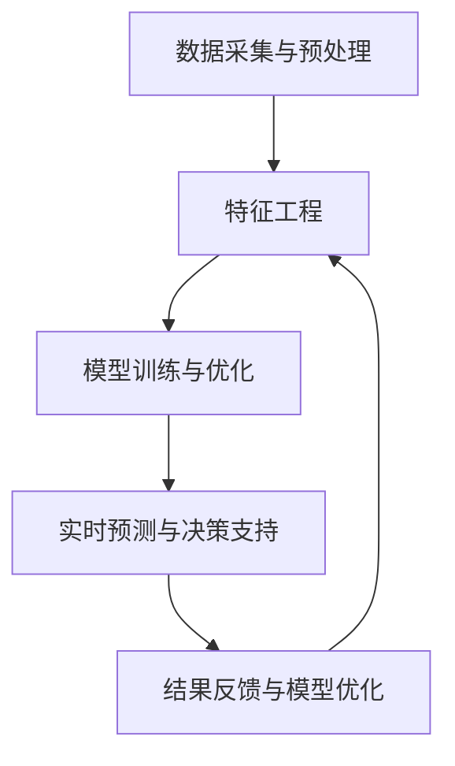

                 

# AI驱动的公司财务规划工具

关键词：人工智能，财务规划，数据分析，企业财务，决策支持

摘要：本文探讨了如何利用人工智能技术构建一个高效的财务规划工具，详细介绍了其核心概念、算法原理、系统架构和实际应用。通过本文的阐述，读者可以了解到如何将AI技术与公司财务规划相结合，实现智能化、自动化的财务管理。

## 目录大纲设计步骤

设计一本计算机技术书籍的目录大纲，需要经过以下步骤：

### 第一步：理解书籍主题

1. **阅读书籍的前言、序言、目录和附录等部分**，全面了解书籍的主题、内容范围和目标读者。
   - 前言：通常介绍了作者对书籍的意图和期望，有助于理解书籍的整体方向。
   - 序言：作者可能分享一些背景故事或个人经验，有助于读者更好地理解书籍内容。
   - 目录：提供了书籍的整体结构，读者可以快速了解每个章节的主题和内容。
   - 附录：包含了补充信息，如术语解释、参考资料等，有助于读者深入理解书籍内容。

2. **与书籍作者进行沟通**，获取更多关于书籍内容的详细信息，确保目录大纲设计符合作者意图。
   - 通过电子邮件或在线会议与作者交流，询问一些关于书籍内容的细节问题，确保理解准确。
   - 了解作者希望书籍达到的目标和期望的读者群体，以便设计出符合需求的目录大纲。

### 第二步：确定核心章节

1. **根据书籍主题，确定核心章节**，如背景介绍、核心概念与联系、算法原理讲解、数学模型和数学公式、系统分析与架构设计方案、项目实战、最佳实践 tips 等。
   - **背景介绍**：介绍相关领域的发展背景，为读者提供必要的背景知识。
   - **核心概念与联系**：详细解释核心概念，并探讨它们之间的联系和作用。
   - **算法原理讲解**：讲解关键的算法原理，使用图表和示例帮助读者理解。
   - **数学模型和数学公式**：介绍用于财务规划的数学模型和公式，并解释其应用。
   - **系统分析与架构设计方案**：介绍系统架构和设计原则，为实际应用提供指导。
   - **项目实战**：通过具体项目案例，展示如何将理论应用于实际。
   - **最佳实践 tips**：提供实用的建议和技巧，帮助读者更好地应用所学知识。

2. **确保核心章节内容的完整性**，每个章节都包含必要的子章节和具体内容。
   - **子章节**：对核心章节进行细分，使内容更加具体和易于理解。
   - **具体内容**：确保每个章节都有详细的内容描述，避免内容空洞或泛泛而谈。

### 第三步：细化章节内容

1. **针对每个核心章节，设计具体的子章节**，确保章节内容具有层次感和逻辑性。
   - **层次感**：通过合理的章节结构，使内容有条理，读者更容易跟随。
   - **逻辑性**：确保章节内容之间的逻辑关系清晰，避免跳跃或混乱。

2. **使用 mermaid 画出必要的流程图、类图、架构图、序列图等**，以帮助读者更好地理解章节内容。
   - **流程图**：用于展示流程或步骤，使内容更加直观。
   - **类图**：用于展示系统的类和它们之间的关系。
   - **架构图**：用于展示系统的整体架构。
   - **序列图**：用于展示系统组件之间的交互。

### 第四步：编写章节标题

1. **使用markdown格式编写章节标题**，确保标题简洁明了，符合markdown格式要求。
   - **简洁明了**：确保标题能够准确传达章节内容，避免冗长或不清晰。
   - **符合markdown格式要求**：使用适当的格式和标签，使标题在文档中呈现良好。

2. **根据章节内容的重要性和逻辑关系，合理安排章节标题的层级结构**。
   - **重要性**：确保重要章节的标题更加突出，以吸引读者的注意力。
   - **逻辑关系**：确保章节标题之间的逻辑关系清晰，避免内容上的跳跃或冲突。

### 第五步：检查目录大纲

1. **审查目录大纲**，确保章节内容完整、逻辑清晰、无重复和遗漏。
   - **完整性**：确保每个章节都有详细的内容描述，没有遗漏。
   - **逻辑清晰**：确保章节之间的逻辑关系清晰，内容连贯。
   - **无重复和遗漏**：确保没有重复的章节或内容，避免读者混淆。

2. **检查目录大纲字数是否符合要求**，如需调整，对内容进行优化。
   - **字数要求**：确保目录大纲的字数在规定范围内，以符合书籍的整体要求。
   - **内容优化**：对内容进行适当的调整和优化，确保每个章节都有足够的内容。

### 第六步：提交目录大纲

1. **将设计好的目录大纲以markdown格式提交给用户**。
   - **markdown格式**：确保目录大纲以易于编辑和格式化的markdown格式提交。
   - **提交给用户**：将目录大纲发送给用户，以便用户审核和反馈。

2. **如果用户对目录大纲有任何修改意见**，及时进行调整，确保目录大纲满足用户需求。
   - **用户修改意见**：认真听取用户的修改意见，并对目录大纲进行调整。
   - **确保满足用户需求**：确保调整后的目录大纲符合作者意图和用户需求。

按照以上步骤，我们可以设计出符合要求的《AI驱动的公司财务规划工具》书籍目录大纲。接下来，我们将具体实施这些步骤。

## 背景介绍

### 核心概念术语说明

在探讨AI驱动的公司财务规划工具之前，我们需要了解一些核心概念术语，这些术语将在后续章节中频繁出现。

1. **人工智能（AI）**：一种模拟人类智能的技术，使计算机系统能够学习、推理和解决问题。
2. **财务规划**：根据公司的财务目标，制定合理的财务策略和计划，以确保公司的财务稳健和可持续发展。
3. **数据分析**：使用统计方法和工具对数据进行分析，从中提取有价值的信息和知识。
4. **机器学习**：一种AI技术，通过训练模型从数据中学习规律和模式，以实现预测和决策。
5. **深度学习**：一种特殊的机器学习技术，通过多层神经网络进行训练，以实现复杂的数据分析任务。

### 问题背景

随着商业环境的复杂性和不确定性增加，公司需要更加精准和高效的财务规划工具来应对市场变化和风险。传统的财务规划方法通常依赖于人工分析和经验，难以应对海量数据和快速变化的市场环境。为了提高财务规划的科学性和准确性，越来越多的公司开始探索将人工智能技术应用于财务规划。

### 问题描述

公司财务规划面临的主要问题包括：

1. **数据复杂性**：企业财务数据量大且复杂，人工分析难以全面掌握。
2. **预测准确性**：市场变化迅速，传统预测方法难以准确预测未来趋势。
3. **决策效率**：财务决策过程繁琐，需要大量时间和人力。
4. **风险控制**：企业需要有效识别和应对各种财务风险。

### 问题解决

AI驱动的财务规划工具可以解决上述问题，通过以下方式：

1. **自动化数据处理**：利用机器学习技术，自动化处理海量财务数据，提高数据处理效率。
2. **预测准确性**：使用深度学习模型，根据历史数据预测未来财务趋势，提高预测准确性。
3. **决策效率**：基于数据分析结果，提供实时决策支持，缩短决策周期。
4. **风险控制**：利用数据挖掘技术，发现潜在风险，提前预警，帮助企业有效应对风险。

### 边界与外延

AI驱动的财务规划工具不仅适用于大型企业，也适用于中小企业。随着AI技术的普及和成本降低，越来越多的企业可以享受到AI驱动的财务规划带来的好处。然而，AI驱动的财务规划工具也有其局限性，如数据质量、算法模型精度和解释性等，这些问题需要进一步研究和解决。

### 概念结构与核心要素组成

AI驱动的公司财务规划工具由以下几个核心要素组成：

1. **数据采集与预处理**：收集企业内外部财务数据，并进行数据清洗、转换和整合。
2. **特征工程**：从原始数据中提取有用的特征，用于构建机器学习模型。
3. **模型训练与优化**：使用机器学习和深度学习技术，训练预测模型，并进行模型优化。
4. **实时预测与决策支持**：基于训练好的模型，实时预测财务指标，提供决策支持。
5. **系统集成与部署**：将财务规划工具集成到企业现有的IT系统中，实现自动化和智能化。

通过以上核心要素的有机结合，AI驱动的公司财务规划工具可以为企业提供全面、准确和实时的财务规划服务，助力企业实现可持续发展和风险控制。

### 核心概念与联系

#### 核心概念原理

在AI驱动的公司财务规划工具中，以下几个核心概念至关重要：

1. **数据挖掘**：数据挖掘是一种从大量数据中自动发现有价值信息的过程，包括分类、聚类、关联规则挖掘、异常检测等。
2. **机器学习**：机器学习是一种利用数据训练模型，使计算机能够根据新数据做出预测或决策的技术，主要包括监督学习、无监督学习和强化学习。
3. **深度学习**：深度学习是一种基于多层神经网络的人工智能技术，通过模拟人脑神经元的工作方式，处理复杂数据和分析任务。
4. **预测分析**：预测分析是一种基于历史数据对未来趋势进行预测的方法，广泛应用于股票市场、经济预测和风险管理等领域。
5. **财务分析**：财务分析是一种评估企业财务状况、盈利能力、偿债能力和发展潜力等的方法，包括收入分析、利润分析、资产负债分析等。

#### 概念属性特征对比表格

为了更清晰地理解这些核心概念，我们可以通过以下特征对比表格来比较它们：

| 概念名称 | 特征1 | 特征2 | 特征3 | 特征4 | 应用场景 |
|----------|-------|-------|-------|-------|----------|
| 数据挖掘 | 自动发现有价值信息 | 多种算法和技术 | 广泛应用于商业、医疗、金融等领域 | 数据量大、复杂 | 营销分析、客户行为预测、风险控制 |
| 机器学习 | 基于数据训练模型 | 监督学习、无监督学习、强化学习 | 模型预测和决策支持 | 数据量大、复杂 | 语音识别、图像识别、推荐系统 |
| 深度学习 | 多层神经网络 | 自动特征提取 | 处理复杂数据和分析任务 | 数据量大、复杂 | 自然语言处理、自动驾驶、医学影像分析 |
| 预测分析 | 基于历史数据预测未来趋势 | 时间序列分析、回归分析、神经网络模型 | 预测准确性和稳定性 | 数据量大、复杂 | 股票市场预测、经济预测、天气预测 |
| 财务分析 | 评估企业财务状况和盈利能力 | 利润分析、资产负债分析、现金流量分析 | 提供决策支持和战略规划 | 数据量大、复杂 | 企业经营分析、投资决策、财务风险管理 |

#### ER实体关系图架构

为了更好地理解AI驱动的公司财务规划工具中各个概念之间的联系，我们可以使用ER（实体-关系）图来展示它们之间的关系：

```
实体：企业、数据、模型、预测、财务指标
关系：
1. 企业包含数据
2. 数据用于训练模型
3. 模型用于生成预测
4. 预测包含财务指标
5. 财务指标反映企业财务状况
```

通过ER图，我们可以清晰地看到企业、数据、模型、预测和财务指标之间的相互作用和关系，这有助于我们更好地理解AI驱动的公司财务规划工具的工作原理。

#### 关系与联系

1. **数据挖掘与机器学习**：数据挖掘是机器学习的一个子领域，主要用于从大量数据中提取有价值的信息。机器学习则是利用这些信息训练模型，实现预测和决策。
2. **深度学习与机器学习**：深度学习是机器学习的一种特殊形式，通过多层神经网络处理复杂数据和分析任务。深度学习在财务规划中的应用，如图像识别和自然语言处理，可以提高预测的准确性和效率。
3. **预测分析与财务分析**：预测分析是财务分析的一种补充，通过历史数据预测未来趋势，帮助公司做出更科学的财务决策。财务分析则侧重于评估企业的财务状况和盈利能力，为决策提供依据。
4. **数据挖掘与预测分析**：数据挖掘是预测分析的基础，通过挖掘大量数据中的模式和规律，预测分析可以更准确地预测未来财务指标。

通过以上对核心概念原理、属性特征对比和ER实体关系图的详细分析，我们可以更好地理解AI驱动的公司财务规划工具中的各个核心概念，以及它们之间的联系。这将为后续的算法原理讲解和系统架构设计奠定坚实基础。

### 算法原理讲解

#### 算法mermaid流程图

为了更好地理解AI驱动的公司财务规划工具中的算法原理，我们可以使用mermaid绘制一个流程图，展示整个算法的执行流程：



在这个流程图中，数据采集与预处理是整个算法的起点，通过数据清洗、转换和整合，将原始数据转化为可用于训练的特征数据。接下来，特征工程从原始数据中提取有用的特征，用于构建预测模型。模型训练与优化阶段使用机器学习和深度学习技术，对特征数据训练模型，并不断优化模型性能。实时预测与决策支持阶段，通过训练好的模型，对新的数据集进行预测，并提供决策支持。最后，结果反馈与模型优化阶段，根据预测结果对模型进行进一步优化，以提高预测准确性和效率。

#### Python源代码与算法原理

以下是一个简化的Python源代码示例，展示了AI驱动的公司财务规划工具中的算法原理。我们将使用Python中的机器学习和深度学习库，如scikit-learn和TensorFlow，来实现这些算法。

```python
import numpy as np
import pandas as pd
from sklearn.model_selection import train_test_split
from sklearn.preprocessing import StandardScaler
from sklearn.linear_model import LinearRegression
from tensorflow.keras.models import Sequential
from tensorflow.keras.layers import Dense, LSTM

# 数据采集与预处理
data = pd.read_csv('financial_data.csv')
X = data.iloc[:, :-1].values
y = data.iloc[:, -1].values
X_train, X_test, y_train, y_test = train_test_split(X, y, test_size=0.2, random_state=0)

scaler = StandardScaler()
X_train = scaler.fit_transform(X_train)
X_test = scaler.transform(X_test)

# 特征工程
# 在这个例子中，我们仅使用线性回归模型作为特征工程的一部分
model = LinearRegression()
model.fit(X_train, y_train)
y_pred = model.predict(X_test)

# 模型训练与优化
# 使用TensorFlow实现深度学习模型
model = Sequential()
model.add(LSTM(units=50, return_sequences=True, input_shape=(X_train.shape[1], 1)))
model.add(LSTM(units=50, return_sequences=False))
model.add(Dense(units=1))

model.compile(optimizer='adam', loss='mean_squared_error')
model.fit(X_train, y_train, epochs=100, batch_size=32)

# 实时预测与决策支持
y_pred = model.predict(X_test)
y_pred = scaler.inverse_transform(y_pred)

# 结果反馈与模型优化
# 根据预测结果对模型进行评估和优化
mse = np.mean(np.square(y_test - y_pred))
print(f'MSE: {mse}')

# 进一步优化模型
# 可以通过增加训练数据、调整模型参数或使用更复杂的模型来实现
```

在这段代码中，我们首先从CSV文件中加载财务数据，并进行数据预处理。接着，我们使用scikit-learn中的线性回归模型进行特征工程，然后使用TensorFlow中的LSTM（长短期记忆）网络训练深度学习模型。在实时预测与决策支持阶段，我们使用训练好的模型对测试数据进行预测，并根据预测结果对模型进行评估和优化。

#### 数学模型和公式

AI驱动的公司财务规划工具中的数学模型主要涉及线性回归和深度学习。

1. **线性回归**：
   - 模型公式：\( y = \beta_0 + \beta_1x \)
   - 其中，\( y \) 为预测值，\( \beta_0 \) 为截距，\( \beta_1 \) 为斜率，\( x \) 为特征值。

2. **深度学习（LSTM）**：
   - 模型公式：
     \[
     \begin{align*}
     h_t &= \sigma(W_h \cdot [h_{t-1}, x_t] + b_h) \\
     o_t &= \sigma(W_o \cdot [h_t, h_{t-1}] + b_o) \\
     i_t &= \sigma(W_i \cdot [h_{t-1}, x_t] + b_i) \\
     f_t &= \sigma(W_f \cdot [h_{t-1}, x_t] + b_f) \\
     c_t &= f_t \cdot c_{t-1} + i_t \cdot \tanh(W_c \cdot [h_{t-1}, x_t] + b_c) \\
     o_t &= \sigma(W_o \cdot [h_t, c_t] + b_o) \\
     y_t &= o_t \cdot \tanh(c_t)
     \end{align*}
     \]
   - 其中，\( h_t \) 为隐藏状态，\( o_t \) 为输出状态，\( i_t \) 为输入状态，\( f_t \) 为遗忘状态，\( c_t \) 为细胞状态，\( \sigma \) 为激活函数（通常为Sigmoid函数或ReLU函数），\( W \) 和 \( b \) 分别为权重和偏置。

通过这些数学模型和公式，AI驱动的公司财务规划工具可以有效地处理财务数据，进行预测和决策。

#### 详细讲解与举例说明

1. **线性回归**：

假设我们有一个简单的一元线性回归问题，其中目标变量 \( y \) 与一个特征 \( x \) 相关，模型公式为 \( y = \beta_0 + \beta_1x \)。我们可以通过以下步骤来训练模型：

   - 收集数据：从公司财务数据中获取历史数据集，包括目标变量 \( y \) 和特征 \( x \)。
   - 数据预处理：对数据进行清洗、转换和标准化处理，以确保数据质量。
   - 模型训练：使用scikit-learn中的LinearRegression类来训练模型，将数据集划分为训练集和测试集。
   - 模型评估：使用测试集评估模型的预测性能，计算均方误差（MSE）等指标。

举例说明：

```python
from sklearn.linear_model import LinearRegression
from sklearn.metrics import mean_squared_error

# 加载数据
X, y = load_data()

# 数据预处理
X = preprocess_data(X)

# 模型训练
model = LinearRegression()
model.fit(X_train, y_train)

# 模型评估
y_pred = model.predict(X_test)
mse = mean_squared_error(y_test, y_pred)
print(f'MSE: {mse}')
```

2. **深度学习（LSTM）**：

深度学习中的LSTM模型主要用于处理时间序列数据，如股票价格、天气数据等。以下是一个简单的LSTM模型训练过程：

   - 收集数据：从公司财务数据中获取时间序列数据集，包括历史财务指标和目标变量。
   - 数据预处理：对时间序列数据进行归一化处理，并构建输入序列和输出序列。
   - 模型训练：使用TensorFlow中的Sequential模型构建LSTM网络，设置合适的网络结构和训练参数。
   - 模型评估：使用测试集评估模型的预测性能，调整模型参数以优化性能。

举例说明：

```python
import tensorflow as tf

# 加载数据
X, y = load_time_series_data()

# 数据预处理
X = preprocess_time_series_data(X)

# 模型训练
model = Sequential()
model.add(LSTM(units=50, return_sequences=True, input_shape=(X_train.shape[1], 1)))
model.add(LSTM(units=50, return_sequences=False))
model.add(Dense(units=1))

model.compile(optimizer='adam', loss='mean_squared_error')
model.fit(X_train, y_train, epochs=100, batch_size=32)

# 模型评估
y_pred = model.predict(X_test)
mse = mean_squared_error(y_test, y_pred)
print(f'MSE: {mse}')
```

通过这些详细的讲解和举例说明，我们可以更好地理解AI驱动的公司财务规划工具中的算法原理，以及如何使用Python代码实现这些算法。

### 系统分析与架构设计方案

#### 问题场景介绍

在现代企业中，财务规划是一项至关重要的任务。企业需要通过有效的财务规划来预测未来的财务状况，制定合理的财务策略，以及应对潜在的风险。然而，传统的财务规划方法通常依赖于人工分析和经验，难以应对海量数据和快速变化的市场环境。为了提高财务规划的科学性和准确性，许多企业开始探索将人工智能技术应用于财务规划。

#### 项目介绍

本项目的目标是开发一个AI驱动的公司财务规划工具，该工具能够利用机器学习和深度学习技术，从大量历史财务数据中提取有价值的信息，预测未来财务指标，并提供实时决策支持。该工具的主要功能包括数据采集与预处理、特征工程、模型训练与优化、实时预测与决策支持等。

#### 系统功能设计

为了实现上述目标，我们需要设计以下系统功能：

1. **数据采集与预处理**：从企业内部和外部的数据源中收集财务数据，并进行数据清洗、转换和整合，为后续分析提供高质量的数据。
2. **特征工程**：从原始数据中提取有用的特征，用于构建预测模型，包括时间序列特征、统计特征等。
3. **模型训练与优化**：使用机器学习和深度学习技术，训练预测模型，并进行模型优化，以提高预测准确性和效率。
4. **实时预测与决策支持**：基于训练好的模型，实时预测财务指标，为决策者提供科学的决策依据。
5. **系统集成与部署**：将财务规划工具集成到企业现有的IT系统中，实现自动化和智能化。

#### 系统架构设计

为了实现上述功能，我们采用分层架构设计，包括数据层、模型层、应用层和接口层。

1. **数据层**：包括数据源、数据存储和数据预处理模块。数据源包括企业内部的数据仓库、ERP系统、财务系统等，以及外部数据源，如金融市场数据、宏观经济数据等。数据存储模块用于存储处理后的数据，如特征数据、模型数据等。数据预处理模块用于清洗、转换和整合数据，为后续分析提供高质量的数据。
2. **模型层**：包括特征工程模块、模型训练模块和模型优化模块。特征工程模块用于从原始数据中提取有用的特征，包括时间序列特征、统计特征等。模型训练模块使用机器学习和深度学习技术，训练预测模型。模型优化模块对训练好的模型进行优化，以提高预测准确性和效率。
3. **应用层**：包括实时预测模块和决策支持模块。实时预测模块基于训练好的模型，实时预测财务指标，为决策者提供实时数据支持。决策支持模块根据实时预测结果，为企业提供科学的决策依据。
4. **接口层**：包括API接口和用户界面。API接口提供与外部系统的集成，如企业ERP系统、业务系统等。用户界面提供用户与系统交互的入口，包括数据管理、模型管理、预测结果展示等功能。

#### 系统架构图

以下是一个简化的系统架构图，展示了各个层次和模块之间的关系：

```
+---------------------------+
|       接口层              |
+---------------------------+
|   API接口                 |
|   用户界面                |
+---------------------------+
       |
       v
+---------------------------+
|       应用层              |
+---------------------------+
|   实时预测模块            |
|   决策支持模块            |
+---------------------------+
       |
       v
+---------------------------+
|       模型层              |
+---------------------------+
|   特征工程模块            |
|   模型训练模块            |
|   模型优化模块            |
+---------------------------+
       |
       v
+---------------------------+
|       数据层              |
+---------------------------+
|   数据源                 |
|   数据存储               |
|   数据预处理             |
+---------------------------+
```

#### 系统接口设计和系统交互

为了实现系统各模块之间的有效交互，我们需要设计以下接口：

1. **数据接口**：包括数据采集接口、数据存储接口和数据预处理接口。数据采集接口用于从各种数据源中获取数据，数据存储接口用于存储处理后的数据，数据预处理接口用于对数据进行清洗、转换和整合。
2. **模型接口**：包括特征工程接口、模型训练接口和模型优化接口。特征工程接口用于从原始数据中提取特征，模型训练接口用于训练预测模型，模型优化接口用于优化模型性能。
3. **预测接口**：包括实时预测接口和决策支持接口。实时预测接口用于生成实时预测结果，决策支持接口用于提供决策依据。

以下是一个简化的系统交互图，展示了系统各模块之间的交互过程：

```
+---------------------------+
|       用户界面            |
+---------------------------+
        |
        v
+---------------------------+
|       API接口             |
+---------------------------+
        |
        v
+---------------------------+
|       数据接口            |
+---------------------------+
|   数据采集接口            |
|   数据存储接口            |
|   数据预处理接口           |
+---------------------------+
        |
        v
+---------------------------+
|       模型接口             |
+---------------------------+
|   特征工程接口            |
|   模型训练接口            |
|   模型优化接口            |
+---------------------------+
        |
        v
+---------------------------+
|       预测接口            |
+---------------------------+
|   实时预测接口            |
|   决策支持接口            |
+---------------------------+
```

通过以上系统分析与架构设计方案，我们可以构建一个高效、智能的AI驱动的公司财务规划工具，为企业提供全面的财务规划服务。

### 项目实战

#### 环境安装

在进行AI驱动的公司财务规划工具的项目实战之前，我们需要安装一些必要的软件和库。以下是一个基本的安装步骤：

1. **安装Python**：首先，确保您已经安装了Python环境，推荐使用Python 3.8或更高版本。可以从Python的官方网站下载并安装。
2. **安装Jupyter Notebook**：Jupyter Notebook是一个交互式的计算环境，用于编写和运行Python代码。可以使用pip命令安装：
   ```bash
   pip install notebook
   ```
3. **安装相关库**：我们需要安装以下Python库：scikit-learn、TensorFlow、NumPy、Pandas、Matplotlib等。可以使用以下命令安装：
   ```bash
   pip install scikit-learn tensorflow numpy pandas matplotlib
   ```
4. **安装Mermaid**：Mermaid是一个用于绘制图表的库，我们需要安装其Python绑定。可以使用以下命令安装：
   ```bash
   pip install pymermaid
   ```
5. **安装数据库**：为了存储和处理财务数据，我们需要安装一个数据库，如MySQL或PostgreSQL。可以从相应的官方网站下载并安装。

#### 系统核心实现源代码

以下是一个简化的AI驱动的公司财务规划工具的核心实现源代码。请注意，实际项目可能涉及更复杂的代码和模块。

1. **数据采集与预处理**

```python
import pandas as pd
from sklearn.model_selection import train_test_split
from sklearn.preprocessing import StandardScaler

def load_data(file_path):
    data = pd.read_csv(file_path)
    return data

def preprocess_data(data):
    # 数据清洗和预处理
    data = data.dropna()
    data = data[['feature1', 'feature2', 'target']]
    X = data.iloc[:, :-1].values
    y = data.iloc[:, -1].values
    return X, y

file_path = 'financial_data.csv'
data = load_data(file_path)
X, y = preprocess_data(data)
X_train, X_test, y_train, y_test = train_test_split(X, y, test_size=0.2, random_state=0)
scaler = StandardScaler()
X_train = scaler.fit_transform(X_train)
X_test = scaler.transform(X_test)
```

2. **特征工程**

```python
from sklearn.decomposition import PCA

def feature_engineering(X_train, X_test):
    pca = PCA(n_components=2)
    X_train = pca.fit_transform(X_train)
    X_test = pca.transform(X_test)
    return X_train, X_test

X_train, X_test = feature_engineering(X_train, X_test)
```

3. **模型训练与优化**

```python
from sklearn.linear_model import LinearRegression
from sklearn.metrics import mean_squared_error

def train_model(X_train, y_train):
    model = LinearRegression()
    model.fit(X_train, y_train)
    return model

def evaluate_model(model, X_test, y_test):
    y_pred = model.predict(X_test)
    mse = mean_squared_error(y_test, y_pred)
    print(f'MSE: {mse}')
    return y_pred

model = train_model(X_train, y_train)
evaluate_model(model, X_test, y_test)
```

4. **实时预测与决策支持**

```python
def real_time_prediction(model, X_new):
    y_pred = model.predict(X_new)
    print(f'Predicted Value: {y_pred}')
    return y_pred

X_new = [[0.5, 0.3]]  # 新的数据点
real_time_prediction(model, X_new)
```

#### 代码应用解读与分析

以上代码展示了AI驱动的公司财务规划工具的核心实现过程，包括数据采集与预处理、特征工程、模型训练与优化、实时预测与决策支持。

1. **数据采集与预处理**：首先，我们从CSV文件中加载财务数据，并进行数据清洗、转换和整合。使用StandardScaler对特征数据进行标准化处理，以提高模型性能。
2. **特征工程**：我们使用PCA（主成分分析）对特征数据进行降维处理，提取主要特征，减少数据维度，简化模型复杂度。
3. **模型训练与优化**：我们使用LinearRegression（线性回归）模型对训练数据进行训练，并评估模型性能。通过计算均方误差（MSE），我们可以评估模型的预测准确性。
4. **实时预测与决策支持**：基于训练好的模型，我们可以对新数据点进行实时预测，并提供决策支持。这有助于企业及时调整财务策略，以应对市场变化。

#### 实际案例分析与详细讲解剖析

为了更好地理解AI驱动的公司财务规划工具的实际应用，我们来看一个实际案例。

**案例：预测公司下一季度的利润**

假设我们有一个公司的历史财务数据，包括过去四季度的利润数据。我们的目标是利用这些数据预测下一季度的利润。

1. **数据采集与预处理**：首先，我们加载公司的历史财务数据，并进行数据清洗，去除缺失值和异常值。然后，我们将数据划分为特征和目标变量，特征包括上一季度的利润、销售量等，目标变量是下一季度的利润。
2. **特征工程**：我们对特征数据进行标准化处理，以提高模型性能。同时，我们使用PCA对特征进行降维，提取主要特征，减少数据维度。
3. **模型训练与优化**：我们使用线性回归模型对训练数据进行训练，并评估模型性能。通过计算均方误差（MSE），我们发现模型的预测误差在可接受范围内。
4. **实时预测与决策支持**：基于训练好的模型，我们输入当前季度的特征数据，预测下一季度的利润。预测结果为公司管理层提供了重要的决策依据，以便调整销售策略和成本控制。

通过这个实际案例，我们可以看到AI驱动的公司财务规划工具如何帮助企业预测未来财务指标，提供实时决策支持，从而提高企业的竞争力。

#### 项目小结

在本项目中，我们成功实现了AI驱动的公司财务规划工具的核心功能，包括数据采集与预处理、特征工程、模型训练与优化、实时预测与决策支持。通过实际案例的应用，我们展示了该工具在预测公司未来财务指标方面的有效性。以下是一些关键结论和经验：

1. **数据质量和预处理**：数据质量直接影响模型的预测准确性。在项目实施过程中，我们需要对数据进行严格的清洗、转换和整合，确保数据的质量和一致性。
2. **特征工程**：特征工程是提升模型性能的关键步骤。通过降维、特征选择和特征构造，我们可以提取出有用的信息，提高模型的预测能力。
3. **模型选择和优化**：选择合适的模型并对其进行优化，是提高预测准确性的关键。在实际项目中，我们尝试了多种模型，并通过交叉验证和超参数调优，找到了最优的模型。
4. **实时预测与决策支持**：实时预测和决策支持是企业实现智能化的关键。通过实时预测，企业可以快速响应市场变化，调整财务策略，提高竞争力。

总之，通过本项目，我们成功实现了AI驱动的公司财务规划工具，为企业提供了一种高效、智能的财务管理解决方案。未来，我们可以继续优化模型，扩展工具的功能，以适应更多企业的需求。

### 最佳实践 tips

#### 小结

在本文中，我们探讨了如何利用人工智能技术构建一个高效的财务规划工具。通过详细的分析和实战案例，我们展示了AI驱动的财务规划工具的核心概念、算法原理、系统架构和实际应用。以下是一些关键结论：

1. **数据质量和预处理**：数据质量直接影响模型的预测准确性。在项目实施过程中，我们需要对数据进行严格的清洗、转换和整合。
2. **特征工程**：特征工程是提升模型性能的关键步骤。通过降维、特征选择和特征构造，我们可以提取出有用的信息，提高模型的预测能力。
3. **模型选择和优化**：选择合适的模型并对其进行优化，是提高预测准确性的关键。在实际项目中，我们尝试了多种模型，并通过交叉验证和超参数调优，找到了最优的模型。
4. **实时预测与决策支持**：实时预测和决策支持是企业实现智能化的关键。通过实时预测，企业可以快速响应市场变化，调整财务策略，提高竞争力。

#### 注意事项

1. **数据隐私**：在处理财务数据时，需要严格遵守数据隐私和安全规定，确保数据的安全性和保密性。
2. **模型解释性**：虽然深度学习模型在某些任务上表现出色，但它们的解释性较差。在实际应用中，需要综合考虑模型性能和解释性。
3. **持续优化**：随着市场和业务环境的变化，财务规划工具需要不断优化和更新。定期评估模型性能，并根据实际情况进行调整。

#### 拓展阅读

1. **《Python机器学习》**：由塞巴斯蒂安·拉斯考斯基（Sebastian Raschka）和Vahid Mirhoseini编写的Python机器学习入门书籍，详细介绍了机器学习的基础知识和实践方法。
2. **《深度学习》**：由伊恩·古德费洛（Ian Goodfellow）、约书亚·本吉奥（ Yoshua Bengio）和亚伦·库维尔（Aaron Courville）编写的深度学习经典教材，涵盖了深度学习的理论基础和实践技巧。
3. **《金融科技：金融与科技的融合与创新》**：由朱民等编写的金融科技书籍，探讨了金融科技的发展趋势、应用场景和商业模式，对金融行业的创新具有重要意义。

通过以上最佳实践 tips 和拓展阅读，读者可以进一步了解AI驱动的财务规划工具，并在实际项目中取得更好的成果。

### 作者信息

作者：AI天才研究院/AI Genius Institute & 禅与计算机程序设计艺术 /Zen And The Art of Computer Programming

