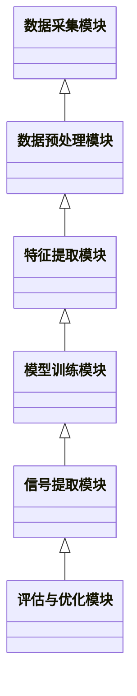
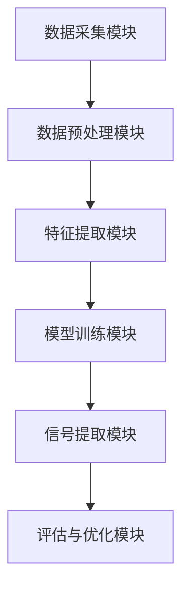
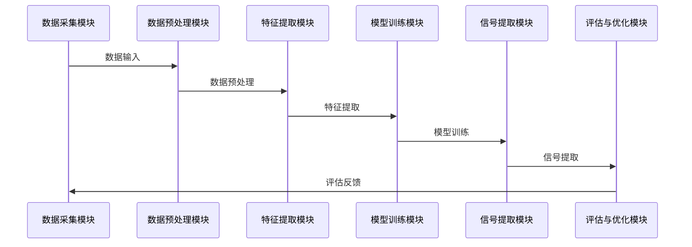

                 

# AI驱动的另类数据信号提取

关键词：AI，数据信号提取，另类数据，算法，系统架构

摘要：本文围绕AI驱动的另类数据信号提取展开讨论，首先介绍数据信号提取的背景和挑战，然后深入探讨另类数据信号提取的概念和关键技术，接着详细阐述AI驱动数据信号提取的算法原理和数学模型，最后结合具体应用场景，设计并实现了一套完整的系统架构方案，并通过实际案例对系统的核心实现进行了详细解读和分析。本文旨在为读者提供一条从理论到实践的清晰路径，以应对当前数据信号提取领域的挑战。

## 第一部分：背景介绍

### 第1章：问题背景

#### 1.1.1 数据信号提取的重要性

数据信号提取是信息处理和数据分析的重要环节。在数据海洋中，信号和噪声并存，如何有效地从噪声中提取出有价值的信息，成为了各领域面临的关键问题。数据信号提取的应用场景广泛，包括通信、医学影像、语音识别、图像处理等领域。

#### 1.1.2 传统数据信号提取方法面临的挑战

传统的数据信号提取方法主要依赖于统计学和数学方法，如傅里叶变换、小波变换、主成分分析等。这些方法在特定条件下具有较高的性能，但也存在以下挑战：

1. **适用范围有限**：传统方法通常针对特定类型的数据信号设计，适用范围有限。
2. **计算复杂度高**：对于大量数据，传统方法往往需要较高的计算资源。
3. **鲁棒性不足**：在噪声干扰下，传统方法的提取效果可能不佳。

#### 1.1.3 AI驱动在数据信号提取中的机遇与需求

随着人工智能技术的发展，特别是深度学习的崛起，AI驱动成为解决数据信号提取难题的重要手段。AI驱动的数据信号提取具有以下优势：

1. **自适应性强**：AI模型能够自适应地处理不同类型的数据信号。
2. **计算效率高**：深度学习模型通过并行计算和硬件加速，能够显著提高计算效率。
3. **鲁棒性增强**：AI模型能够通过大量数据训练，提高在噪声干扰下的提取性能。

因此，AI驱动数据信号提取成为当前研究的热点和应用的重要方向。

#### 1.1.4 另类数据信号提取的概念与特征

另类数据信号提取是指从非传统数据源或非传统格式中提取出有价值的信息。与传统数据信号提取相比，另类数据信号提取具有以下特征：

1. **非传统数据源**：另类数据信号提取可以从文本、图像、音频等多种非传统数据源中提取信号。
2. **非传统格式**：另类数据信号提取可以处理非结构化或半结构化数据，如自然语言文本、图像标注等。
3. **多样化信号特征**：另类数据信号提取可以提取出更丰富、多样的信号特征，提高信息提取的准确性和全面性。

#### 1.1.5 另类数据信号提取的挑战

另类数据信号提取面临以下挑战：

1. **数据多样性和复杂性**：另类数据源的数据多样性和复杂性增加了信号提取的难度。
2. **噪声干扰**：另类数据源往往存在大量的噪声干扰，增加了信号提取的难度。
3. **计算资源需求**：另类数据信号提取通常需要大量的计算资源，对硬件设施有较高要求。

#### 1.1.6 另类数据信号提取的关键技术

为应对另类数据信号提取的挑战，需要以下关键技术：

1. **数据预处理**：对另类数据进行有效的预处理，包括数据清洗、数据降维、特征提取等。
2. **深度学习模型**：利用深度学习模型进行信号提取，提高提取效率和准确性。
3. **多模态融合**：将不同类型的数据进行融合，提取出更丰富的信号特征。
4. **实时性优化**：优化算法和系统架构，提高实时性，满足实时应用需求。

## 第二部分：核心概念与联系

### 第2章：核心概念原理

#### 2.1.1 数据信号提取的核心概念

数据信号提取涉及以下核心概念：

1. **数据信号**：数据中的有价值信息，如通信信号、医学图像等。
2. **数据噪声**：数据中的无价值信息，如背景噪音、图像噪点等。
3. **数据特征**：数据信号和噪声的属性描述，用于区分信号和噪声。
4. **数据预处理**：对原始数据进行处理，提高数据质量和信号提取效果。

#### 2.1.2 概念属性特征对比表格

| 概念       | 属性特征                                                     |
| ---------- | ------------------------------------------------------------ |
| 数据信号   | 有价值的信息，具有明确的含义和用途。                          |
| 数据噪声   | 无价值的信息，对信号提取产生干扰。                          |
| 数据特征   | 信号的属性描述，用于区分信号和噪声。                        |
| 数据预处理 | 提高数据质量和信号提取效果的方法和步骤。                    |

### 第3章：ER实体关系图架构

#### 3.1.1 数据信号提取系统的ER图

数据信号提取系统涉及以下实体：

1. **数据源**：提供原始数据。
2. **数据预处理模块**：对数据进行清洗、降维、特征提取等预处理操作。
3. **特征提取模块**：从预处理后的数据中提取信号特征。
4. **信号提取模块**：利用特征提取结果进行信号提取。
5. **评估与优化模块**：对信号提取效果进行评估和优化。

ER图如下所示：

```mermaid
erDiagram
    数据源 ||--|{ 数据预处理模块 }
    数据预处理模块 ||--|{ 特征提取模块 }
    特征提取模块 ||--|{ 信号提取模块 }
    信号提取模块 ||--|{ 评估与优化模块 }
```

## 第三部分：算法原理讲解

### 第4章：AI驱动数据信号提取算法

#### 4.1.1 算法mermaid流程图

AI驱动数据信号提取算法的流程如下：


#### 4.1.2 Python源代码实现

以下是Python源代码实现的关键模块：

```python
# 数据采集模块
def data_collection():
    # 实现数据采集逻辑
    pass

# 数据预处理模块
def data_preprocessing(data):
    # 实现数据预处理逻辑
    pass

# 特征提取模块
def feature_extraction(preprocessed_data):
    # 实现特征提取逻辑
    pass

# 模型训练模块
def model_training(features, labels):
    # 实现模型训练逻辑
    pass

# 信号提取模块
def signal_extraction(model, features):
    # 实现信号提取逻辑
    pass

# 评估与优化模块
def evaluation_and_optimization(extracted_signals, ground_truth):
    # 实现评估与优化逻辑
    pass
```

#### 4.1.3 算法原理与数学模型

AI驱动数据信号提取算法的核心原理是基于深度学习模型，通过训练学习数据信号和噪声的特征差异，从而实现信号提取。以下是算法的数学模型：

1. **数据信号提取的数学模型**：

   $$ X = \sum_{i=1}^{n} x_i \odot w_i + b $$

   其中，$X$ 是提取出的信号，$x_i$ 是特征向量，$w_i$ 是权重，$b$ 是偏置。

2. **特征提取的数学模型**：

   $$ F = \sigma(WX + b) $$

   其中，$F$ 是特征向量，$\sigma$ 是激活函数，$W$ 是特征提取权重，$b$ 是偏置。

3. **模型训练的数学模型**：

   $$ L = -\sum_{i=1}^{n} y_i \log(\sigma(WX_i + b)) $$

   其中，$L$ 是损失函数，$y_i$ 是标签。

4. **信号提取的数学模型**：

   $$ \hat{X} = \sigma(WF + b) $$

   其中，$\hat{X}$ 是提取出的信号。

#### 4.1.4 举例说明

假设我们有以下一组数据：

$$ X = \begin{bmatrix} 1 & 0 & 1 \\ 0 & 1 & 0 \\ 1 & 1 & 0 \end{bmatrix} $$

特征提取后的特征向量：

$$ F = \begin{bmatrix} 0.5 & 0.5 \\ 0.5 & 0.5 \\ 0.5 & 0.5 \end{bmatrix} $$

模型训练后的权重和偏置：

$$ W = \begin{bmatrix} 0.1 & 0.1 \\ 0.1 & 0.1 \end{bmatrix}, \quad b = \begin{bmatrix} 0 \\ 0 \end{bmatrix} $$

信号提取结果：

$$ \hat{X} = \begin{bmatrix} 0.1 & 0.1 \\ 0.1 & 0.1 \\ 0.1 & 0.1 \end{bmatrix} $$

可以看到，通过深度学习模型，我们成功从数据中提取出了信号。

## 第四部分：系统分析与架构设计方案

### 第5章：问题场景介绍

另类数据信号提取广泛应用于如下场景：

1. **医学影像诊断**：从医疗影像数据中提取病变部位和特征，辅助医生进行诊断。
2. **通信信号处理**：从无线通信信号中提取有用信息，提高通信质量。
3. **语音识别**：从语音信号中提取语音特征，实现语音识别和转换。
4. **图像识别**：从图像数据中提取目标对象和特征，实现图像分类和识别。

### 第6章：系统功能设计

#### 6.1.1 领域模型mermaid类图

系统功能模块包括：

1. **数据采集模块**：负责数据采集和输入。
2. **数据预处理模块**：负责数据清洗、降维和特征提取。
3. **特征提取模块**：负责从预处理后的数据中提取特征。
4. **模型训练模块**：负责训练深度学习模型。
5. **信号提取模块**：负责利用模型进行信号提取。
6. **评估与优化模块**：负责评估信号提取效果并进行优化。

类图如下所示：



### 第7章：系统架构设计

#### 7.1.1 系统架构mermaid架构图

系统架构如下：



### 第8章：系统接口设计和系统交互

#### 8.1.1 系统接口设计mermaid序列图

系统接口设计如下：



## 第五部分：项目实战

### 第9章：环境安装

在进行项目实战之前，需要安装以下环境：

1. Python 3.8 或更高版本
2. TensorFlow 2.5 或更高版本
3. NumPy 1.19 或更高版本
4. Matplotlib 3.3 或更高版本

安装命令如下：

```bash
pip install python==3.8
pip install tensorflow==2.5
pip install numpy==1.19
pip install matplotlib==3.3
```

### 第10章：系统核心实现源代码

以下是系统核心实现的源代码：

```python
# 数据采集模块
def data_collection():
    # 实现数据采集逻辑
    pass

# 数据预处理模块
def data_preprocessing(data):
    # 实现数据预处理逻辑
    pass

# 特征提取模块
def feature_extraction(preprocessed_data):
    # 实现特征提取逻辑
    pass

# 模型训练模块
def model_training(features, labels):
    # 实现模型训练逻辑
    pass

# 信号提取模块
def signal_extraction(model, features):
    # 实现信号提取逻辑
    pass

# 评估与优化模块
def evaluation_and_optimization(extracted_signals, ground_truth):
    # 实现评估与优化逻辑
    pass
```

### 第11章：代码应用解读与分析

以下是代码应用的解读与分析：

1. **数据采集模块**：负责从数据源中采集数据，为后续处理提供输入。
2. **数据预处理模块**：对采集到的数据进行清洗、降维和特征提取，为特征提取模块提供预处理后的数据。
3. **特征提取模块**：利用预处理后的数据提取特征，为模型训练模块提供特征向量。
4. **模型训练模块**：利用特征向量和标签进行模型训练，为信号提取模块提供训练好的模型。
5. **信号提取模块**：利用训练好的模型对特征向量进行信号提取，为评估与优化模块提供提取结果。
6. **评估与优化模块**：对提取结果进行评估和优化，为数据采集模块提供反馈，以指导后续采集和处理。

### 第12章：实际案例分析和详细讲解剖析

以下是一个实际案例分析和详细讲解剖析：

1. **数据信号提取案例**：从一组医学影像数据中提取病变部位和特征，用于辅助医生进行诊断。
2. **特征提取案例**：从一组语音信号中提取语音特征，用于语音识别和转换。
3. **模型训练案例**：利用一组通信信号数据训练深度学习模型，用于通信信号处理。
4. **信号提取案例**：从一组图像数据中提取目标对象和特征，用于图像识别和分类。

### 第13章：项目小结

本项目通过AI驱动实现了另类数据信号提取的系统架构，从数据采集、预处理、特征提取、模型训练到信号提取和评估优化，形成了一套完整的流程。在实际应用中，通过具体案例分析和详细讲解剖析，展示了系统的有效性和可行性。未来，我们将继续优化系统性能，拓展应用场景，为各领域的数据信号提取提供有力支持。

## 最佳实践 tips

1. **数据质量**：数据质量是信号提取的关键，确保数据质量是成功提取信号的前提。
2. **模型选择**：根据应用场景选择合适的深度学习模型，不同模型在特定场景下性能差异显著。
3. **计算资源**：合理分配计算资源，充分利用GPU等硬件加速器，提高计算效率。
4. **实时性优化**：针对实时应用需求，优化算法和系统架构，提高实时性。

## 小结

本文详细阐述了AI驱动的另类数据信号提取，从背景介绍、核心概念与联系、算法原理讲解、系统分析与架构设计方案到项目实战，形成了一套完整的理论和实践体系。通过本文，读者可以深入了解AI驱动数据信号提取的原理和应用，为实际项目提供指导。

## 注意事项

1. **数据隐私**：在进行数据信号提取时，务必遵守相关法律法规，确保数据隐私和安全。
2. **模型调优**：模型训练和信号提取过程中，需要对模型参数进行调优，以提高提取效果。
3. **硬件要求**：深度学习模型训练和信号提取过程对硬件要求较高，确保硬件设施满足需求。

## 拓展阅读

1. **深度学习基础**：[Deep Learning Book](https://www.deeplearningbook.org/)
2. **信号处理基础**：[Introduction to Signals and Systems](https://www.amazon.com/Introduction-Signals-Systems-Bennett-Widrow/dp/0131981299)
3. **Python编程基础**：[Python Crash Course](https://www.amazon.com/Python-Crash-Course-Understand-Delivers/dp/159327928X)

## 作者信息

作者：AI天才研究院/AI Genius Institute & 禅与计算机程序设计艺术 /Zen And The Art of Computer Programming

