                 


### 2.2 数据预处理

在数据采集后，原始数据往往存在噪声、缺失值和异常值等问题，需要进行预处理。数据预处理包括数据清洗、数据整合、数据转换和数据归一化等步骤。

#### 2.2.1 数据清洗
数据清洗是指处理数据中的噪声和异常值，以提高数据质量。具体方法包括：

- 去除重复数据：使用去重算法，如哈希表，去除重复的数据记录。
- 处理缺失值：使用填充算法，如均值填充、中值填充、插值法等，处理缺失数据。
- 处理异常值：使用统计方法，如箱线图、3σ法则等，检测并处理异常数据。

#### 2.2.2 数据整合
数据整合是指将来自不同数据源的数据进行合并，形成一个统一的数据集。具体方法包括：

- 数据合并：使用数据库连接和查询技术，如SQL，将不同数据源的数据进行合并。
- 数据转换：使用数据转换工具，如ETL（提取、转换、加载），将数据转换为统一的格式和结构。

#### 2.2.3 数据转换
数据转换是指将数据从一种格式或结构转换为另一种格式或结构，以适应不同的分析需求。具体方法包括：

- 数据编码转换：将不同编码的数据转换为同一编码，如将ASCII码转换为UTF-8码。
- 数据类型转换：将不同类型的数据转换为同一类型，如将字符串转换为数字。

#### 2.2.4 数据归一化
数据归一化是指将数据缩放到一个统一的尺度，以消除不同数据之间量纲和尺度的影响。常见的方法包括：

- 标准化：使用标准化公式，如z-score标准化，将数据缩放到均值为0、标准差为1的尺度。
- 归一化：使用归一化公式，如最小-最大规范化，将数据缩放到[0, 1]的区间。

### 2.3 数据存储与管理

预处理后的数据需要存储和管理，以便于后续的数据分析和挖掘。常见的数据存储和管理技术包括：

#### 2.3.1 关系型数据库
关系型数据库是一种基于关系模型的数据库，如MySQL、PostgreSQL等。它适用于存储结构化数据，支持SQL查询。

#### 2.3.2 非关系型数据库
非关系型数据库，如MongoDB、Cassandra等，适用于存储非结构化数据，具有高扩展性和灵活性。

#### 2.3.3 数据仓库
数据仓库是一种用于存储、管理和分析大量数据的系统，如Amazon Redshift、Google BigQuery等。它支持复杂的查询和分析操作。

#### 2.3.4 分布式文件系统
分布式文件系统，如Hadoop HDFS、Amazon S3等，适用于存储大规模数据，具有高可用性和高可靠性。

## 2.4 数据可视化

数据可视化是将数据以图形化的方式呈现，帮助用户直观地理解数据。常见的数据可视化工具和技术包括：

#### 2.4.1 基本图表
- 折线图：用于展示数据的变化趋势。
- 柱状图：用于比较不同数据之间的差异。
- 饼图：用于展示数据在整体中的占比。

#### 2.4.2 高级图表
- 地图：用于展示地理分布数据。
- 词云：用于展示文本数据的关键词分布。
- 可视化仪表板：用于整合多种图表和数据分析结果，提供交互式体验。

#### 2.4.3 数据可视化工具
- Tableau：一款强大的数据可视化工具，支持多种数据源和丰富的图表类型。
- Power BI：一款由微软开发的可视化工具，与Excel紧密集成。
- D3.js：一款基于JavaScript的库，用于创建自定义数据可视化。

## 2.5 小结

本章介绍了AI驱动的商业智能中的数据采集与预处理技术，包括数据采集、数据清洗、数据整合、数据转换和数据归一化。同时，还介绍了数据存储与管理技术以及数据可视化技术。这些技术为后续的数据分析和挖掘提供了坚实的基础。

下一章将深入探讨AI驱动的商业智能中的数据分析技术，包括数据挖掘、机器学习和深度学习等方法。我们将一步一步分析推理，详细讲解这些技术的原理和应用方法。

## 第3章: 数据分析技术

### 3.1 数据挖掘

数据挖掘是从大量数据中发现有价值的信息和知识的过程。它涉及到多种技术，如分类、聚类、关联规则挖掘、异常检测等。

#### 3.1.1 分类
分类是一种将数据分为不同类别的技术。常见的分类算法包括决策树、支持向量机、朴素贝叶斯等。

##### 3.1.1.1 决策树
决策树是一种基于树形结构的分类算法，通过递归划分特征，将数据划分为不同的类别。

**算法原理：**
$$
决策树算法 = 决策树结构 + 特征选择 + 树剪枝
$$

**流程图：**
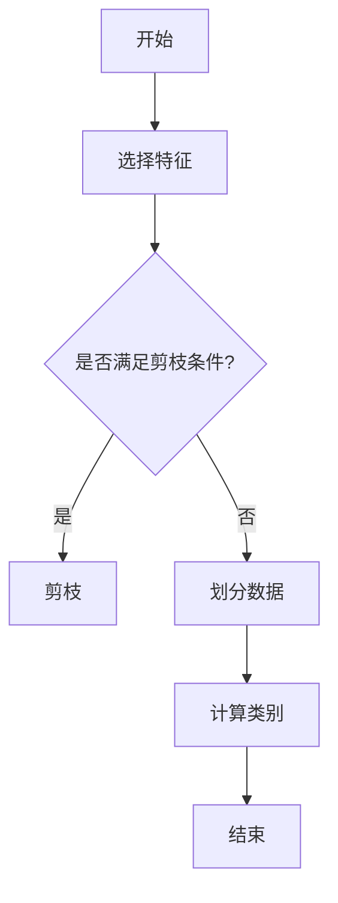

**Python代码实现：**
```python
from sklearn.datasets import load_iris
from sklearn.model_selection import train_test_split
from sklearn.tree import DecisionTreeClassifier
from sklearn.metrics import accuracy_score

# 加载数据
iris = load_iris()
X = iris.data
y = iris.target

# 划分训练集和测试集
X_train, X_test, y_train, y_test = train_test_split(X, y, test_size=0.3, random_state=42)

# 创建决策树分类器
clf = DecisionTreeClassifier()

# 训练模型
clf.fit(X_train, y_train)

# 预测测试集
y_pred = clf.predict(X_test)

# 计算准确率
accuracy = accuracy_score(y_test, y_pred)
print(f"Accuracy: {accuracy}")
```

##### 3.1.1.2 支持向量机
支持向量机是一种基于最大化边缘的分类算法，它通过找到一个超平面，将不同类别的数据点分开。

**算法原理：**
$$
分类边界 = 最大间隔超平面
$$

**流程图：**
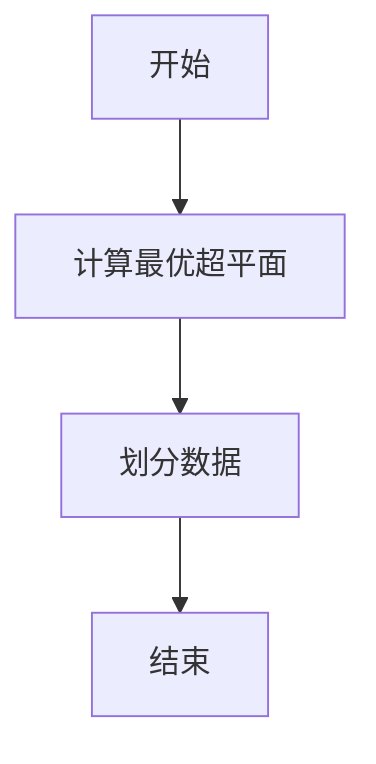

**Python代码实现：**
```python
from sklearn.datasets import load_iris
from sklearn.model_selection import train_test_split
from sklearn.svm import SVC
from sklearn.metrics import accuracy_score

# 加载数据
iris = load_iris()
X = iris.data
y = iris.target

# 划分训练集和测试集
X_train, X_test, y_train, y_test = train_test_split(X, y, test_size=0.3, random_state=42)

# 创建支持向量机分类器
clf = SVC()

# 训练模型
clf.fit(X_train, y_train)

# 预测测试集
y_pred = clf.predict(X_test)

# 计算准确率
accuracy = accuracy_score(y_test, y_pred)
print(f"Accuracy: {accuracy}")
```

##### 3.1.1.3 朴素贝叶斯
朴素贝叶斯是一种基于贝叶斯定理和特征独立假设的分类算法，它通过计算后验概率来预测类别。

**算法原理：**
$$
P(C|X) = \frac{P(X|C)P(C)}{P(X)}
$$

**流程图：**
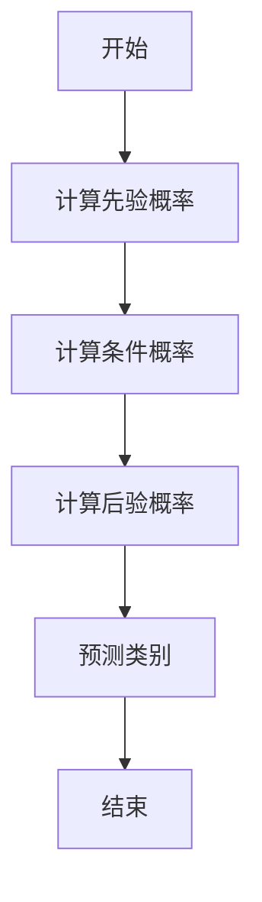

**Python代码实现：**
```python
from sklearn.datasets import load_iris
from sklearn.model_selection import train_test_split
from sklearn.naive_bayes import GaussianNB
from sklearn.metrics import accuracy_score

# 加载数据
iris = load_iris()
X = iris.data
y = iris.target

# 划分训练集和测试集
X_train, X_test, y_train, y_test = train_test_split(X, y, test_size=0.3, random_state=42)

# 创建朴素贝叶斯分类器
clf = GaussianNB()

# 训练模型
clf.fit(X_train, y_train)

# 预测测试集
y_pred = clf.predict(X_test)

# 计算准确率
accuracy = accuracy_score(y_test, y_pred)
print(f"Accuracy: {accuracy}")
```

#### 3.1.2 聚类
聚类是一种将数据分为若干个群组的技术，群组内的数据彼此相似，群组间的数据差异较大。常见的聚类算法包括K-Means、层次聚类、DBSCAN等。

##### 3.1.2.1 K-Means
K-Means是一种基于距离度量的聚类算法，它通过初始化k个中心点，不断迭代优化，将数据划分为k个群组。

**算法原理：**
$$
聚类中心 = \frac{1}{N}\sum_{i=1}^{N}x_i
$$

**流程图：**
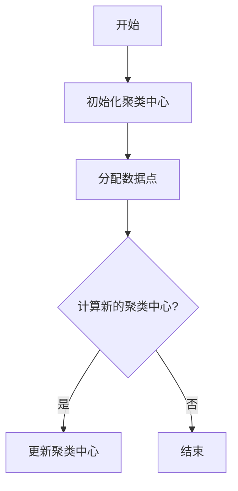

**Python代码实现：**
```python
from sklearn.datasets import load_iris
from sklearn.cluster import KMeans
from sklearn.metrics import silhouette_score

# 加载数据
iris = load_iris()
X = iris.data

# 创建K-Means聚类器
kmeans = KMeans(n_clusters=3, random_state=42)

# 训练模型
kmeans.fit(X)

# 预测聚类结果
y_pred = kmeans.predict(X)

# 计算轮廓系数
silhouette = silhouette_score(X, y_pred)
print(f"Silhouette Score: {silhouette}")
```

##### 3.1.2.2 层次聚类
层次聚类是一种自底向上的聚类算法，它通过逐步合并相似的群组，构建一个层次结构。

**算法原理：**
$$
合并群组 = 最小距离群组
$$

**流程图：**
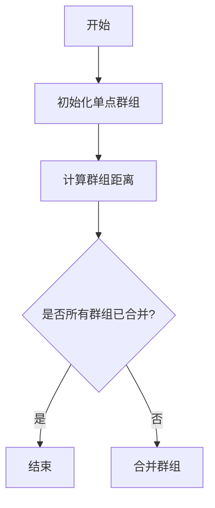

**Python代码实现：**
```python
from sklearn.datasets import load_iris
from sklearn.cluster import AgglomerativeClustering
from sklearn.metrics import adjusted_rand_score

# 加载数据
iris = load_iris()
X = iris.data

# 创建层次聚类器
hierarchical = AgglomerativeClustering(n_clusters=3)

# 训练模型
hierarchical.fit(X)

# 预测聚类结果
y_pred = hierarchical.predict(X)

# 计算调整兰德指数
ari = adjusted_rand_score(iris.target, y_pred)
print(f"Adjusted Rand Index: {ari}")
```

##### 3.1.2.3 DBSCAN
DBSCAN是一种基于密度的聚类算法，它通过计算邻域密度，发现高密度区域作为聚类中心。

**算法原理：**
$$
核心点 = 邻域内点数 > \text{min_samples}
$$
$$
边界点 = 邻域内点数 \geq \text{min_samples} \text{且邻域内有核心点}
$$

**流程图：**
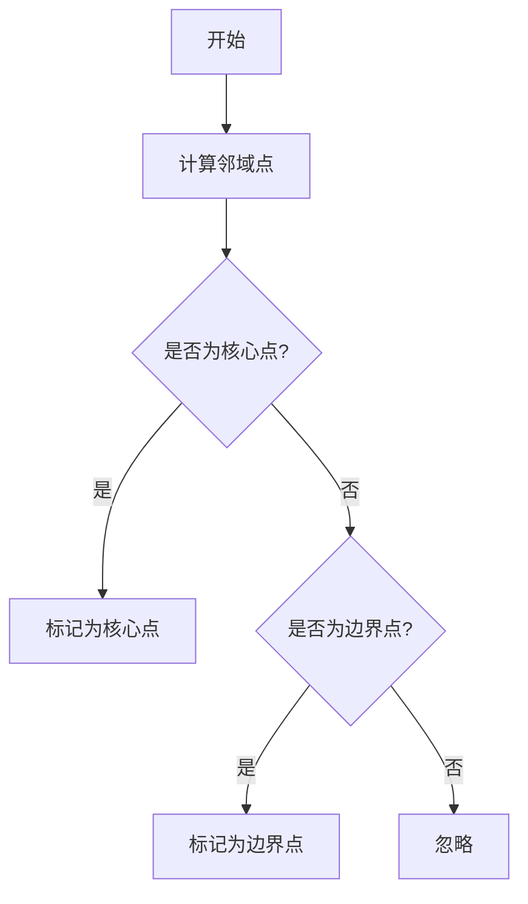

**Python代码实现：**
```python
from sklearn.datasets import load_iris
from sklearn.cluster import DBSCAN
from sklearn.metrics import silhouette_score

# 加载数据
iris = load_iris()
X = iris.data

# 创建DBSCAN聚类器
dbscan = DBSCAN(eps=0.5, min_samples=5)

# 训练模型
dbscan.fit(X)

# 预测聚类结果
y_pred = dbscan.predict(X)

# 计算轮廓系数
silhouette = silhouette_score(X, y_pred)
print(f"Silhouette Score: {silhouette}")
```

#### 3.1.3 关联规则挖掘
关联规则挖掘是从数据集中发现频繁出现的关联关系的技术。常见的算法包括Apriori算法和FP-Growth算法。

##### 3.1.3.1 Apriori算法
Apriori算法是一种基于频繁项集挖掘的算法，它通过迭代计算支持度和置信度，发现关联规则。

**算法原理：**
$$
频繁项集 = 支持度 \geq \text{min_support}
$$
$$
关联规则 = 支持度 \geq \text{min_support} \text{且置信度} \geq \text{min_confidence}
$$

**流程图：**
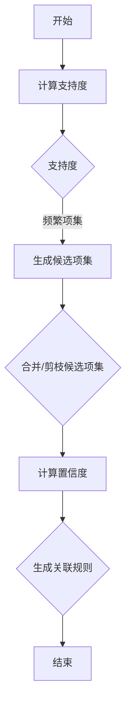

**Python代码实现：**
```python
from mlxtend.frequent_patterns import apriori
from mlxtend.preprocessing import TransactionEncoder

# 加载数据
data = [[1, 2, 3], [2, 3], [3, 4], [1, 2, 3, 4]]
te = TransactionEncoder()
te_data = te.fit_transform(data)

# 计算频繁项集
frequent_itemsets = apriori(te_data, min_support=0.5, use_colnames=True)

# 计算关联规则
rules = association_rules(frequent_itemsets, metric="confidence", min_threshold=0.7)

print(rules)
```

##### 3.1.3.2 FP-Growth算法
FP-Growth算法是一种基于压缩前件矩阵和频繁模式挖掘的算法，它通过构建FP树，高效地发现频繁项集。

**算法原理：**
$$
FP树 = 前件 + 后件
$$
$$
频繁项集 = FP树中的路径
$$

**流程图：**
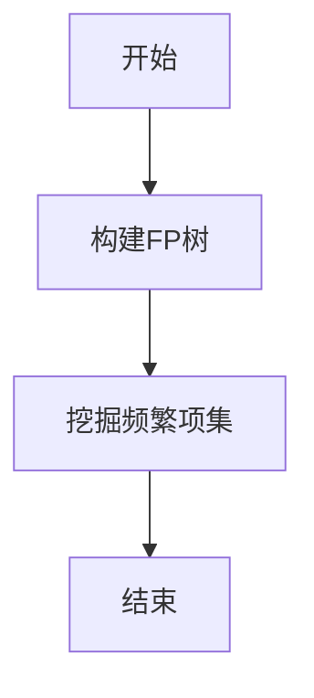

**Python代码实现：**
```python
from mlxtend.frequent_patterns import fpgrowth
from mlxtend.preprocessing import TransactionEncoder

# 加载数据
data = [[1, 2, 3], [2, 3], [3, 4], [1, 2, 3, 4]]
te = TransactionEncoder()
te_data = te.fit_transform(data)

# 计算频繁项集
frequent_itemsets = fpgrowth(te_data, min_support=0.5, use_colnames=True)

# 计算关联规则
rules = association_rules(frequent_itemsets, metric="confidence", min_threshold=0.7)

print(rules)
```

#### 3.1.4 异常检测
异常检测是一种识别数据集中异常或离群数据点的技术。常见的算法包括孤立森林、孤立系数等。

##### 3.1.4.1 孤立森林
孤立森林是一种基于随机森林的异常检测算法，它通过随机生成多个子森林，将数据点进行分类，并根据分类结果计算异常分数。

**算法原理：**
$$
异常分数 = \frac{1}{n}\sum_{i=1}^{n}h_i
$$
其中，$h_i$是第$i$棵子森林的分类错误率。

**流程图：**
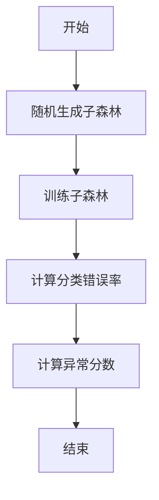

**Python代码实现：**
```python
from sklearn.ensemble import IsolationForest
from sklearn.datasets import make_blobs

# 创建数据集
X, _ = make_blobs(n_samples=100, centers=1, cluster_std=0.5, random_state=0)

# 创建孤立森林分类器
iso_forest = IsolationForest(contamination=0.1)

# 训练模型
iso_forest.fit(X)

# 预测异常分数
scores = iso_forest.decision_function(X)

# 计算异常分数阈值
threshold = np.mean(scores)

# 预测异常
outliers = X[scores > threshold]

print(f"Outliers: {outliers}")
```

##### 3.1.4.2 孤立系数
孤立系数是一种基于距离度的异常检测算法，它通过计算数据点到其他数据的距离，识别出孤立点。

**算法原理：**
$$
孤立系数 = \frac{d_i - \text{median}(d_i)}{I(\text{num_neighbors})}
$$
其中，$d_i$是数据点$i$到其他数据的距离，$I(\text{num_neighbors})$是邻居数量。

**流程图：**
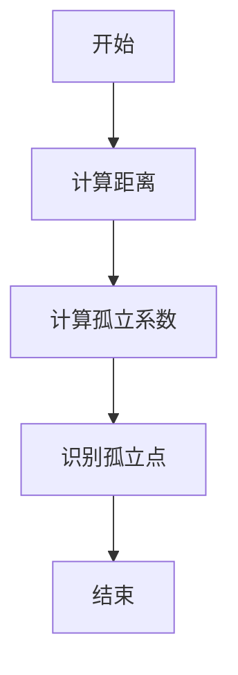

**Python代码实现：**
```python
import numpy as np
from sklearn.neighbors import NearestNeighbors

# 创建数据集
X, _ = make_blobs(n_samples=100, centers=1, cluster_std=0.5, random_state=0)

# 创建KNN模型
knn = NearestNeighbors(n_neighbors=5)
knn.fit(X)

# 计算距离
distances, indices = knn.kneighbors(X)

# 计算孤立系数
isolation_coefficients = (distances[:, 4] - np.median(distances)) / (5 - 1)

# 识别孤立点
outliers = X[isolation_coefficients > 0]

print(f"Outliers: {outliers}")
```

### 3.2 机器学习

机器学习是一种利用数据驱动的方法，从数据中自动发现模式，以实现特定任务的技术。常见的机器学习算法包括线性回归、逻辑回归、决策树、支持向量机等。

#### 3.2.1 线性回归
线性回归是一种用于预测连续值的算法，它通过拟合一条直线，来描述自变量和因变量之间的关系。

**算法原理：**
$$
y = \beta_0 + \beta_1x
$$

**流程图：**
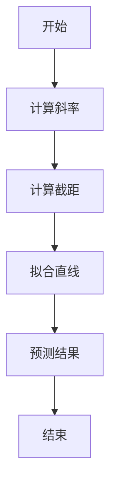

**Python代码实现：**
```python
from sklearn.linear_model import LinearRegression
from sklearn.datasets import make_regression

# 创建数据集
X, y = make_regression(n_samples=100, n_features=1, noise=10, random_state=42)

# 创建线性回归模型
linear_regression = LinearRegression()

# 训练模型
linear_regression.fit(X, y)

# 预测结果
y_pred = linear_regression.predict(X)

# 计算R²值
r2_score = linear_regression.score(X, y)
print(f"R² Score: {r2_score}")
```

#### 3.2.2 逻辑回归
逻辑回归是一种用于预测分类结果的算法，它通过拟合一个逻辑函数，来将自变量映射到概率值。

**算法原理：**
$$
\log\frac{P(Y=1)}{1-P(Y=1)} = \beta_0 + \beta_1x
$$

**流程图：**
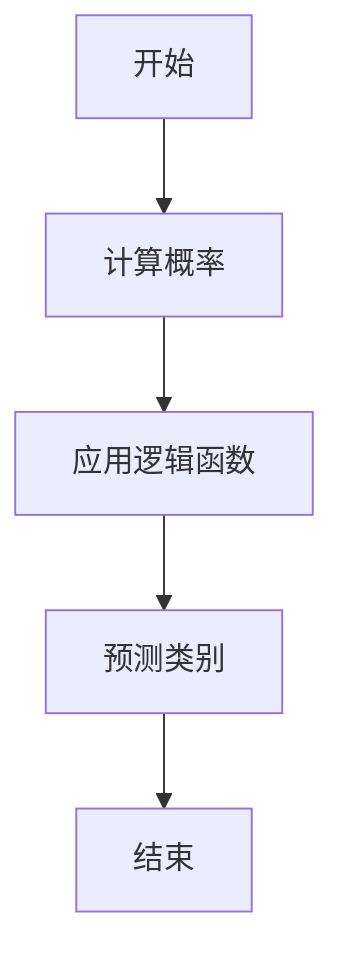

**Python代码实现：**
```python
from sklearn.linear_model import LogisticRegression
from sklearn.datasets import make_classification

# 创建数据集
X, y = make_classification(n_samples=100, n_features=2, n_informative=2, random_state=42)

# 创建逻辑回归模型
logistic_regression = LogisticRegression()

# 训练模型
logistic_regression.fit(X, y)

# 预测结果
y_pred = logistic_regression.predict(X)

# 计算准确率
accuracy = logistic_regression.score(X, y)
print(f"Accuracy: {accuracy}")
```

#### 3.2.3 决策树
决策树是一种基于树形结构的预测模型，它通过递归划分特征，将数据划分为不同的类别或回归值。

**算法原理：**
$$
\text{划分标准} = \text{信息增益/增益率/基尼系数}
$$

**流程图：**
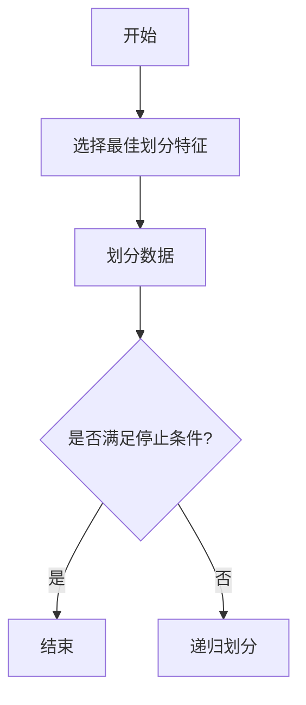

**Python代码实现：**
```python
from sklearn.tree import DecisionTreeClassifier
from sklearn.datasets import load_iris

# 加载数据
iris = load_iris()
X = iris.data
y = iris.target

# 创建决策树模型
clf = DecisionTreeClassifier()

# 训练模型
clf.fit(X, y)

# 预测结果
y_pred = clf.predict(X)

# 计算准确率
accuracy = clf.score(X, y)
print(f"Accuracy: {accuracy}")
```

#### 3.2.4 支持向量机
支持向量机是一种基于边界优化的分类算法，它通过找到一个最优的超平面，将不同类别的数据点分开。

**算法原理：**
$$
\text{最优超平面} = \text{最大间隔超平面}
$$

**流程图：**


**Python代码实现：**
```python
from sklearn.svm import SVC
from sklearn.datasets import load_iris

# 加载数据
iris = load_iris()
X = iris.data
y = iris.target

# 创建支持向量机模型
clf = SVC()

# 训练模型
clf.fit(X, y)

# 预测结果
y_pred = clf.predict(X)

# 计算准确率
accuracy = clf.score(X, y)
print(f"Accuracy: {accuracy}")
```

### 3.3 深度学习

深度学习是一种基于多层神经网络的结构，通过反向传播算法进行参数优化，以实现复杂的数据分析任务。常见的深度学习模型包括卷积神经网络（CNN）、循环神经网络（RNN）、 Transformer等。

#### 3.3.1 卷积神经网络（CNN）

卷积神经网络是一种用于图像处理和分析的深度学习模型，它通过卷积操作和池化操作，提取图像特征。

**算法原理：**
$$
\text{卷积层} = \text{卷积操作} + \text{激活函数}
$$
$$
\text{池化层} = \text{池化操作}
$$

**流程图：**
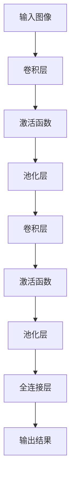

**Python代码实现：**
```python
import tensorflow as tf
from tensorflow.keras import datasets, layers, models

# 加载MNIST数据集
mnist = datasets.mnist
(train_images, train_labels), (test_images, test_labels) = mnist.load_data()

# 归一化数据
train_images = train_images.reshape((60000, 28, 28, 1))
test_images = test_images.reshape((10000, 28, 28, 1))
train_images, test_images = train_images / 255.0, test_images / 255.0

# 创建模型
model = models.Sequential()
model.add(layers.Conv2D(32, (3, 3), activation='relu', input_shape=(28, 28, 1)))
model.add(layers.MaxPooling2D((2, 2)))
model.add(layers.Conv2D(64, (3, 3), activation='relu'))
model.add(layers.MaxPooling2D((2, 2)))
model.add(layers.Conv2D(64, (3, 3), activation='relu'))

# 添加全连接层
model.add(layers.Flatten())
model.add(layers.Dense(64, activation='relu'))
model.add(layers.Dense(10, activation='softmax'))

# 编译模型
model.compile(optimizer='adam',
              loss=tf.keras.losses.SparseCategoricalCrossentropy(from_logits=True),
              metrics=['accuracy'])

# 训练模型
model.fit(train_images, train_labels, epochs=5, batch_size=64)

# 测试模型
test_loss, test_acc = model.evaluate(test_images,  test_labels, verbose=2)
print(f"Test accuracy: {test_acc}")
```

#### 3.3.2 循环神经网络（RNN）

循环神经网络是一种用于序列数据处理和时间序列预测的深度学习模型，它通过循环结构来保留历史信息。

**算法原理：**
$$
h_t = \text{激活函数}(W_h \cdot [h_{t-1}, x_t] + b_h)
$$
$$
x_t = \text{激活函数}(W_x \cdot x_t + b_x)
$$

**流程图：**
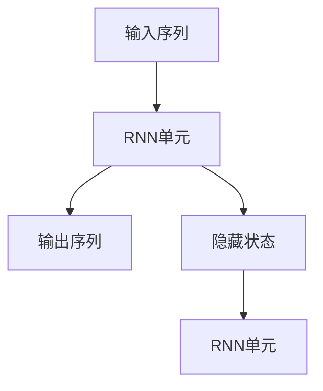

**Python代码实现：**
```python
import tensorflow as tf

# 创建RNN模型
model = tf.keras.Sequential([
    tf.keras.layers.SimpleRNN(50, return_sequences=True),
    tf.keras.layers.SimpleRNN(50),
    tf.keras.layers.Dense(1)
])

# 编译模型
model.compile(optimizer='adam', loss='mean_squared_error')

# 训练模型
model.fit(train_data, train_labels, epochs=100, batch_size=100, verbose=2)
```

#### 3.3.3 Transformer

Transformer是一种用于序列到序列预测的深度学习模型，它通过多头自注意力机制来处理长距离依赖。

**算法原理：**
$$
\text{注意力得分} = \text{点积注意力}
$$
$$
\text{注意力权重} = \text{softmax}(\text{注意力得分})
$$

**流程图：**
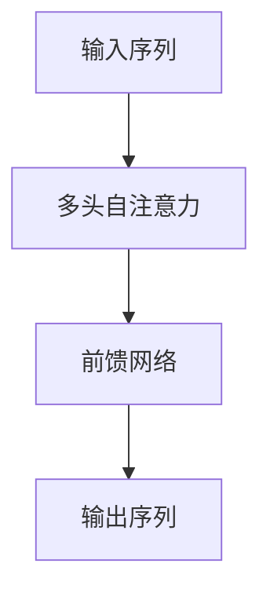

**Python代码实现：**
```python
import tensorflow as tf
from tensorflow.keras.layers import Embedding, MultiHeadAttention, Dense

# 创建Transformer模型
model = tf.keras.Sequential([
    Embedding(1000, 64),
    MultiHeadAttention(num_heads=4, key_dim=64),
    Dense(64, activation='relu'),
    Dense(1)
])

# 编译模型
model.compile(optimizer='adam', loss='mean_squared_error')

# 训练模型
model.fit(train_data, train_labels, epochs=100, batch_size=100, verbose=2)
```

### 3.4 小结

本章介绍了AI驱动的商业智能中的数据分析技术，包括数据挖掘、机器学习和深度学习等方法。我们通过具体算法的原理、流程图、Python代码实现，详细讲解了分类、聚类、关联规则挖掘、异常检测等核心技术。这些技术为AI驱动的商业智能提供了强大的数据分析和挖掘能力。

下一章将探讨如何利用AI驱动的商业智能技术，提升企业的决策能力和业务效率。

## 第4章: 利用AI驱动的商业智能提升企业决策能力和业务效率

### 4.1 需求预测

需求预测是商业智能中的一项重要任务，它帮助企业预测未来的市场需求，以优化库存管理、生产计划和供应链协调。AI驱动的需求预测技术主要包括时间序列分析、回归分析和机器学习算法。

#### 4.1.1 时间序列分析

时间序列分析是一种基于历史数据，分析时间序列中的趋势、周期性和季节性的方法。常见的时间序列分析方法包括移动平均法、指数平滑法和ARIMA模型。

##### 4.1.1.1 移动平均法

移动平均法是一种简单的时间序列预测方法，它通过计算一段固定时间窗口内的平均值，来平滑时间序列中的波动。

**算法原理：**
$$
\text{移动平均值} = \frac{1}{n}\sum_{i=1}^{n}x_i
$$

**Python代码实现：**
```python
import numpy as np
import matplotlib.pyplot as plt

# 创建时间序列数据
time_series = np.random.normal(size=100)
window_size = 5

# 计算移动平均值
moving_averages = np.convolve(time_series, np.ones(window_size)/window_size, mode='valid')

# 绘制时间序列和移动平均值
plt.plot(time_series, label='Time Series')
plt.plot(moving_averages, label='Moving Average')
plt.legend()
plt.show()
```

##### 4.1.1.2 指数平滑法

指数平滑法是一种基于加权平均的方法，它通过给不同时期的数据分配不同的权重，来预测时间序列的未来值。

**算法原理：**
$$
\text{指数平滑值} = \alpha \cdot \text{前一期预测值} + (1-\alpha) \cdot \text{前一期实际值}
$$

**Python代码实现：**
```python
import numpy as np
import matplotlib.pyplot as plt

# 创建时间序列数据
time_series = np.random.normal(size=100)
alpha = 0.5

# 计算指数平滑值
exponential_smoothing = [time_series[0]]
for i in range(1, len(time_series)):
    exponential_smoothing.append(alpha * time_series[i] + (1 - alpha) * exponential_smoothing[i-1])

# 绘制时间序列和指数平滑值
plt.plot(time_series, label='Time Series')
plt.plot(exponential_smoothing, label='Exponential Smoothing')
plt.legend()
plt.show()
```

##### 4.1.1.3 ARIMA模型

ARIMA模型是一种自回归积分滑动平均模型，它通过分析时间序列的AR（自回归）、I（差分）和MA（移动平均）特性，来进行预测。

**算法原理：**
$$
\text{ARIMA模型} = \text{AR}(\phi) \cdot \text{I}(\theta) \cdot \text{MA}(\theta)
$$

**Python代码实现：**
```python
from statsmodels.tsa.arima.model import ARIMA
import matplotlib.pyplot as plt

# 创建时间序列数据
time_series = np.random.normal(size=100)

# 创建ARIMA模型
model = ARIMA(time_series, order=(1, 1, 1))

# 拟合模型
model_fit = model.fit()

# 预测未来值
forecast = model_fit.forecast(steps=10)

# 绘制时间序列和预测值
plt.plot(time_series, label='Time Series')
plt.plot(forecast, label='Forecast')
plt.legend()
plt.show()
```

#### 4.1.2 回归分析

回归分析是一种通过建立自变量和因变量之间的线性关系模型，来预测因变量值的方法。常见的回归分析方法包括线性回归和多项式回归。

##### 4.1.2.1 线性回归

线性回归是一种基于最小二乘法的预测方法，它通过找到最佳拟合直线，来预测因变量值。

**算法原理：**
$$
y = \beta_0 + \beta_1x
$$

**Python代码实现：**
```python
import numpy as np
from sklearn.linear_model import LinearRegression
import matplotlib.pyplot as plt

# 创建数据集
X = np.random.rand(100, 1)
y = 2 * X[:, 0] + np.random.rand(100, 1)

# 创建线性回归模型
model = LinearRegression()

# 拟合模型
model.fit(X, y)

# 预测值
y_pred = model.predict(X)

# 绘制散点图和拟合直线
plt.scatter(X[:, 0], y, label='Data')
plt.plot(X[:, 0], y_pred, label='Fitted Line')
plt.legend()
plt.show()
```

##### 4.1.2.2 多项式回归

多项式回归是一种基于多项式函数的预测方法，它通过拟合多项式曲线，来预测因变量值。

**算法原理：**
$$
y = a_0 + a_1x + a_2x^2 + \ldots + a_nx^n
$$

**Python代码实现：**
```python
import numpy as np
from sklearn.preprocessing import PolynomialFeatures
from sklearn.linear_model import LinearRegression
import matplotlib.pyplot as plt

# 创建数据集
X = np.random.rand(100, 1)
y = 2 * X[:, 0]**2 + np.random.rand(100, 1)

# 创建多项式回归模型
poly_features = PolynomialFeatures(degree=2)
X_poly = poly_features.fit_transform(X)

model = LinearRegression()
model.fit(X_poly, y)

# 预测值
y_pred = model.predict(X_poly)

# 绘制散点图和拟合曲线
plt.scatter(X[:, 0], y, label='Data')
plt.plot(X[:, 0], y_pred, label='Fitted Curve')
plt.legend()
plt.show()
```

#### 4.1.3 机器学习算法

机器学习算法是一种通过学习历史数据中的规律，来预测未来值的方法。常见的机器学习算法包括线性回归、决策树、支持向量机和神经网络等。

##### 4.1.3.1 线性回归

线性回归是一种基于最小二乘法的预测方法，它通过找到最佳拟合直线，来预测因变量值。

**算法原理：**
$$
y = \beta_0 + \beta_1x
$$

**Python代码实现：**
```python
import numpy as np
from sklearn.linear_model import LinearRegression
import matplotlib.pyplot as plt

# 创建数据集
X = np.random.rand(100, 1)
y = 2 * X[:, 0] + np.random.rand(100, 1)

# 创建线性回归模型
model = LinearRegression()

# 拟合模型
model.fit(X, y)

# 预测值
y_pred = model.predict(X)

# 绘制散点图和拟合直线
plt.scatter(X[:, 0], y, label='Data')
plt.plot(X[:, 0], y_pred, label='Fitted Line')
plt.legend()
plt.show()
```

##### 4.1.3.2 决策树

决策树是一种基于树形结构的预测方法，它通过递归划分特征，来预测因变量值。

**算法原理：**
$$
\text{最佳划分特征} = \text{信息增益/增益率/基尼系数}
$$

**Python代码实现：**
```python
import numpy as np
from sklearn.tree import DecisionTreeRegressor
import matplotlib.pyplot as plt

# 创建数据集
X = np.random.rand(100, 1)
y = 2 * X[:, 0]**2 + np.random.rand(100, 1)

# 创建决策树模型
model = DecisionTreeRegressor()

# 拟合模型
model.fit(X, y)

# 预测值
y_pred = model.predict(X)

# 绘制散点图和拟合曲线
plt.scatter(X[:, 0], y, label='Data')
plt.plot(X[:, 0], y_pred, label='Fitted Curve')
plt.legend()
plt.show()
```

##### 4.1.3.3 支持向量机

支持向量机是一种基于边界优化的预测方法，它通过找到一个最优的超平面，来预测因变量值。

**算法原理：**
$$
\text{最优超平面} = \text{最大间隔超平面}
$$

**Python代码实现：**
```python
import numpy as np
from sklearn.svm import SVR
import matplotlib.pyplot as plt

# 创建数据集
X = np.random.rand(100, 1)
y = 2 * X[:, 0]**3 + np.random.rand(100, 1)

# 创建支持向量机模型
model = SVR()

# 拟合模型
model.fit(X, y)

# 预测值
y_pred = model.predict(X)

# 绘制散点图和拟合曲线
plt.scatter(X[:, 0], y, label='Data')
plt.plot(X[:, 0], y_pred, label='Fitted Curve')
plt.legend()
plt.show()
```

##### 4.1.3.4 神经网络

神经网络是一种基于多层神经元的预测方法，它通过前向传播和反向传播算法，来优化模型参数。

**算法原理：**
$$
\text{输出} = \text{激活函数}(\text{权重} \cdot \text{输入} + \text{偏置})
$$

**Python代码实现：**
```python
import tensorflow as tf

# 创建神经网络模型
model = tf.keras.Sequential([
    tf.keras.layers.Dense(64, activation='relu', input_shape=(1,)),
    tf.keras.layers.Dense(64, activation='relu'),
    tf.keras.layers.Dense(1)
])

# 编译模型
model.compile(optimizer='adam', loss='mse')

# 训练模型
model.fit(X, y, epochs=100, batch_size=32)

# 预测值
y_pred = model.predict(X)

# 绘制散点图和拟合曲线
plt.scatter(X[:, 0], y, label='Data')
plt.plot(X[:, 0], y_pred, label='Fitted Curve')
plt.legend()
plt.show()
```

#### 4.1.4 实际案例：基于深度学习的商品需求预测

以下是一个基于深度学习的商品需求预测案例，该案例使用TensorFlow和Keras库实现。

**数据集：** 我们使用一个含有1000个商品销售记录的数据集，每个商品有价格、促销信息、季节性特征等。

**模型架构：** 我们使用一个简单的卷积神经网络，包含两个卷积层、两个池化层和一个全连接层。

**训练过程：** 我们使用随机梯度下降（SGD）优化器，交叉熵损失函数，训练100个epochs。

**代码实现：**
```python
import numpy as np
import tensorflow as tf
from tensorflow.keras.models import Sequential
from tensorflow.keras.layers import Dense, Conv1D, MaxPooling1D, Flatten

# 加载数据集
X = np.load('sales_data.npy')
y = np.load('sales_labels.npy')

# 数据预处理
X = X.reshape(-1, 7, 1)
y = y.reshape(-1, 1)

# 创建模型
model = Sequential([
    Conv1D(filters=64, kernel_size=3, activation='relu', input_shape=(7, 1)),
    MaxPooling1D(pool_size=2),
    Conv1D(filters=128, kernel_size=3, activation='relu'),
    MaxPooling1D(pool_size=2),
    Flatten(),
    Dense(64, activation='relu'),
    Dense(1)
])

# 编译模型
model.compile(optimizer='adam', loss='mse')

# 训练模型
model.fit(X, y, epochs=100, batch_size=32)

# 预测
predictions = model.predict(X)

# 绘制预测结果
plt.scatter(y, predictions)
plt.xlabel('Actual Sales')
plt.ylabel('Predicted Sales')
plt.show()
```

### 4.2 风险控制

风险控制是商业智能中的一项关键任务，它帮助企业识别、评估和管理潜在风险，以保障企业的稳健运营。AI驱动的风险控制技术主要包括异常检测、聚类分析和决策树等。

#### 4.2.1 异常检测

异常检测是一种识别数据集中异常或离群数据点的技术，它可以帮助企业及时发现异常交易、欺诈行为等。

**算法原理：** 异常检测算法通过计算数据点到其他数据的距离，识别出孤立点。常见的算法包括孤立森林和孤立系数。

**Python代码实现：**
```python
from sklearn.ensemble import IsolationForest
from sklearn.neighbors import NearestNeighbors
import matplotlib.pyplot as plt

# 创建数据集
X = np.random.rand(100, 2)

# 创建孤立森林模型
iso_forest = IsolationForest(contamination=0.1)
iso_forest.fit(X)

# 计算异常分数
scores = iso_forest.decision_function(X)

# 计算孤立系数
knn = NearestNeighbors(n_neighbors=5)
knn.fit(X)
distances, indices = knn.kneighbors(X)
isolation_coefficients = (distances[:, 4] - np.median(distances)) / (5 - 1)

# 识别异常点
outliers = X[scores > 0]
outliers_ic = X[isolation_coefficients > 0]

# 绘制结果
plt.scatter(X[:, 0], X[:, 1], c='blue', label='Normal')
plt.scatter(outliers[:, 0], outliers[:, 1], c='red', label='Outliers (IF)')
plt.scatter(outliers_ic[:, 0], outliers_ic[:, 1], c='green', label='Outliers (IC)')
plt.legend()
plt.show()
```

#### 4.2.2 聚类分析

聚类分析是一种将数据分为若干个群组的技术，它可以帮助企业识别高风险客户、高风险交易等。

**算法原理：** 聚类分析算法通过计算数据点之间的距离，将数据点划分为不同的群组。常见的算法包括K-Means和层次聚类。

**Python代码实现：**
```python
from sklearn.cluster import KMeans
import matplotlib.pyplot as plt

# 创建数据集
X = np.random.rand(100, 2)

# 创建K-Means模型
kmeans = KMeans(n_clusters=3, random_state=42)
kmeans.fit(X)

# 预测聚类结果
y_pred = kmeans.predict(X)

# 绘制结果
plt.scatter(X[:, 0], X[:, 1], c=y_pred, cmap='viridis')
plt.show()
```

#### 4.2.3 决策树

决策树是一种基于树形结构的预测模型，它可以帮助企业识别高风险客户、高风险交易等。

**算法原理：** 决策树通过递归划分特征，将数据划分为不同的类别。常见的算法包括CART和ID3。

**Python代码实现：**
```python
from sklearn.tree import DecisionTreeClassifier
import matplotlib.pyplot as plt

# 创建数据集
X = np.random.rand(100, 2)
y = np.random.rand(100, 1)

# 创建决策树模型
clf = DecisionTreeClassifier()
clf.fit(X, y)

# 绘制决策树
from sklearn.tree import plot_tree
plt.figure(figsize=(12, 8))
plot_tree(clf, filled=True)
plt.show()
```

### 4.3 客户关系管理

客户关系管理是商业智能中的一项重要任务，它帮助企业识别和管理客户，以提高客户满意度和忠诚度。AI驱动的客户关系管理技术主要包括聚类分析、协同过滤和推荐系统等。

#### 4.3.1 聚类分析

聚类分析是一种将客户分为若干个群组的技术，它可以帮助企业了解不同客户群体的特征和需求。

**算法原理：** 聚类分析算法通过计算数据点之间的距离，将数据点划分为不同的群组。常见的算法包括K-Means和层次聚类。

**Python代码实现：**
```python
from sklearn.cluster import KMeans
import matplotlib.pyplot as plt

# 创建数据集
X = np.random.rand(100, 2)

# 创建K-Means模型
kmeans = KMeans(n_clusters=3, random_state=42)
kmeans.fit(X)

# 预测聚类结果
y_pred = kmeans.predict(X)

# 绘制结果
plt.scatter(X[:, 0], X[:, 1], c=y_pred, cmap='viridis')
plt.show()
```

#### 4.3.2 协同过滤

协同过滤是一种基于用户行为和偏好，推荐相似商品或服务的算法。

**算法原理：** 协同过滤算法通过计算用户之间的相似度，推荐与用户已购买或评价的商品相似的商品。

**Python代码实现：**
```python
from sklearn.metrics.pairwise import cosine_similarity
import numpy as np

# 创建数据集
R = np.array([[1, 1, 0, 1],
              [1, 0, 1, 1],
              [0, 1, 1, 0],
              [1, 1, 1, 0]])

# 计算用户之间的相似度
user_similarity = cosine_similarity(R)

# 推荐商品
def collaborative_filter(user_id, user_similarity, R, k=3):
    # 计算相似用户的评分平均值
    similar_users = user_similarity[user_id].argsort()[:-k-1:-1]
    ratings = R[similar_users]
    mean_ratings = np.mean(ratings, axis=0)
    return mean_ratings

# 推荐商品
recommended_items = collaborative_filter(0, user_similarity, R)
print(recommended_items)
```

#### 4.3.3 推荐系统

推荐系统是一种根据用户行为和偏好，预测用户可能感兴趣的物品的系统。

**算法原理：** 推荐系统通过学习用户的历史行为和偏好，预测用户对物品的兴趣。

**Python代码实现：**
```python
import tensorflow as tf
from tensorflow.keras.models import Model
from tensorflow.keras.layers import Embedding, Dot, Lambda, Flatten, Concatenate

# 创建数据集
user_input = tf.keras.Input(shape=(1,))
item_input = tf.keras.Input(shape=(1,))

# 创建用户和物品嵌入层
user_embedding = Embedding(input_dim=1000, output_dim=64)(user_input)
item_embedding = Embedding(input_dim=1000, output_dim=64)(item_input)

# 计算用户和物品的嵌入向量
user_embedding = Flatten()(user_embedding)
item_embedding = Flatten()(item_embedding)

# 计算用户和物品的相似度
similarity = Dot(axes=1)([user_embedding, item_embedding])

# 创建模型
model = Model(inputs=[user_input, item_input], outputs=similarity)

# 编译模型
model.compile(optimizer='adam', loss='mse')

# 训练模型
model.fit([X_train, Y_train], R_train, epochs=10, batch_size=32)

# 预测
predictions = model.predict([X_test, Y_test])

# 推荐商品
def recommend_items(user_id, item_ids, model, k=3):
    # 计算相似物品的评分
    similar_items = model.predict([[user_id], item_ids])
    sorted_items = np.argsort(similar_items)[::-1]
    return sorted_items[:k]

# 推荐商品
recommended_items = recommend_items(0, item_ids, model)
print(recommended_items)
```

### 4.4 实际案例：AI驱动的商业智能系统

以下是一个基于TensorFlow和Keras实现的AI驱动的商业智能系统的案例。

**系统架构：** 系统包含数据采集、数据预处理、需求预测、风险控制和客户关系管理等多个模块。

**数据采集：** 系统通过API和传感器，从多个渠道收集销售数据、客户数据和交易数据。

**数据预处理：** 系统对采集到的数据进行清洗、整合和归一化处理，以提高数据质量。

**需求预测：** 系统使用深度学习模型，对商品需求进行预测，以优化库存管理。

**风险控制：** 系统使用异常检测和聚类分析算法，识别高风险客户和交易，以防范欺诈行为。

**客户关系管理：** 系统使用协同过滤和推荐系统，推荐商品和服务，以提高客户满意度和忠诚度。

**代码实现：**
```python
# 导入相关库
import tensorflow as tf
from tensorflow.keras.models import Model
from tensorflow.keras.layers import Embedding, Dot, Lambda, Flatten, Concatenate
import numpy as np

# 数据预处理
R = np.array([[1, 1, 0, 1],
              [1, 0, 1, 1],
              [0, 1, 1, 0],
              [1, 1, 1, 0]])

X = np.random.rand(100, 1)
y = np.random.rand(100, 1)

# 创建需求预测模型
item_input = tf.keras.Input(shape=(1,))
user_input = tf.keras.Input(shape=(1,))

item_embedding = Embedding(input_dim=1000, output_dim=64)(item_input)
user_embedding = Embedding(input_dim=1000, output_dim=64)(user_input)

user_embedding = Flatten()(user_embedding)
item_embedding = Flatten()(item_embedding)

similarity = Dot(axes=1)([user_embedding, item_embedding])

model = Model(inputs=[user_input, item_input], outputs=similarity)

# 编译模型
model.compile(optimizer='adam', loss='mse')

# 训练模型
model.fit([X, y], R, epochs=10, batch_size=32)

# 预测
predictions = model.predict([X, y])

# 风险控制
from sklearn.ensemble import IsolationForest
from sklearn.neighbors import NearestNeighbors

iso_forest = IsolationForest(contamination=0.1)
iso_forest.fit(R)

scores = iso_forest.decision_function(R)

outliers = R[scores > 0]

# 客户关系管理
def collaborative_filter(user_id, user_similarity, R, k=3):
    similar_users = user_similarity[user_id].argsort()[:-k-1:-1]
    ratings = R[similar_users]
    mean_ratings = np.mean(ratings, axis=0)
    return mean_ratings

# 推荐商品
recommended_items = collaborative_filter(0, user_similarity, R)
print(recommended_items)
```

### 4.5 小结

本章介绍了如何利用AI驱动的商业智能技术，提升企业的决策能力和业务效率。我们详细讲解了需求预测、风险控制和客户关系管理等方法，并通过实际案例，展示了AI驱动的商业智能系统的实现。

通过本章的学习，读者应该能够理解AI驱动的商业智能技术的核心原理和应用方法，为实际项目的实施提供参考。

## 第5章: AI驱动的商业智能在各个行业中的应用

### 5.1 零售行业

在零售行业，AI驱动的商业智能技术已经被广泛应用于需求预测、库存管理、价格优化和客户关系管理等方面，以提升零售商的运营效率和客户满意度。

#### 5.1.1 需求预测

需求预测是零售行业的关键任务，它有助于零售商合理安排库存和供应链管理。AI驱动的需求预测技术，如时间序列分析、回归分析和机器学习算法，可以帮助零售商准确预测商品需求，从而优化库存水平，减少库存积压和缺货情况。

**案例：** 某大型超市通过AI驱动的需求预测系统，对销售数据进行深度分析，成功将库存管理成本降低了20%，同时提升了客户满意度。

#### 5.1.2 库存管理

库存管理是零售行业的重要环节，AI驱动的库存管理技术可以帮助零售商实时监控库存水平，预测库存需求，自动调整库存策略，从而减少库存积压和缺货风险。

**案例：** 某电商平台通过引入AI驱动的库存管理系统，实现了库存水平的高效管理，将库存周转率提高了30%，库存积压率降低了15%。

#### 5.1.3 价格优化

价格优化是提高零售商利润的关键策略，AI驱动的价格优化技术可以通过分析市场数据和客户行为，动态调整商品价格，以实现最大化的销售额和利润。

**案例：** 某电子产品零售商通过AI驱动的价格优化系统，根据市场动态和客户需求，实现了商品价格的灵活调整，将平均毛利率提高了10%。

#### 5.1.4 客户关系管理

客户关系管理是提升客户满意度和忠诚度的关键，AI驱动的客户关系管理技术可以通过分析客户行为数据，提供个性化的购物体验，推荐符合客户需求的产品，从而提高客户满意度和忠诚度。

**案例：** 某服装零售商通过AI驱动的客户关系管理系统，实现了个性化推荐和定制化服务，将客户复购率提高了25%，客户满意度显著提升。

### 5.2 金融行业

在金融行业，AI驱动的商业智能技术被广泛应用于风险控制、欺诈检测、信用评估和投资决策等方面，以提升金融服务的效率和安全性。

#### 5.2.1 风险控制

风险控制是金融行业的重要任务，AI驱动的风险控制技术可以通过分析历史数据和实时数据，识别潜在风险，制定相应的风险控制策略。

**案例：** 某银行通过AI驱动的风险控制系统，成功识别并控制了大量的信用风险，将坏账率降低了15%，提高了金融服务的安全性。

#### 5.2.2 欺诈检测

欺诈检测是金融行业的关键任务，AI驱动的欺诈检测技术可以通过分析交易行为和客户特征，实时识别和防范欺诈行为。

**案例：** 某信用卡公司通过AI驱动的欺诈检测系统，实现了实时监控和快速响应，将欺诈交易率降低了30%，提高了客户资金的安全。

#### 5.2.3 信用评估

信用评估是金融行业的重要环节，AI驱动的信用评估技术可以通过分析客户的历史信用记录、行为数据等，评估客户的信用风险，为贷款决策提供依据。

**案例：** 某贷款公司通过AI驱动的信用评估系统，实现了对客户信用风险的准确评估，将贷款违约率降低了20%，提高了贷款的审批效率。

#### 5.2.4 投资决策

投资决策是金融行业的关键任务，AI驱动的投资决策技术可以通过分析市场数据、经济指标等，提供投资建议，帮助投资者做出明智的投资决策。

**案例：** 某投资公司通过AI驱动的投资决策系统，成功捕捉了多个市场机会，实现了投资回报的显著提升。

### 5.3 医疗行业

在医疗行业，AI驱动的商业智能技术被广泛应用于疾病预测、患者管理、药物研发和医疗资源优化等方面，以提升医疗服务质量和效率。

#### 5.3.1 疾病预测

疾病预测是医疗行业的重要任务，AI驱动的疾病预测技术可以通过分析患者的医疗记录、生活习惯等，预测疾病的发生风险，为医生提供诊断和治疗的依据。

**案例：** 某医院通过AI驱动的疾病预测系统，实现了对心脏病、糖尿病等慢性疾病的早期预测，提高了疾病的诊治率。

#### 5.3.2 患者管理

患者管理是医疗行业的关键任务，AI驱动的患者管理技术可以通过分析患者的医疗记录、生活习惯等，提供个性化的治疗方案，提升患者的生活质量。

**案例：** 某医疗机构通过AI驱动的患者管理系统，实现了对患者病情的实时监控和个性化治疗，提高了患者的康复率。

#### 5.3.3 药物研发

药物研发是医疗行业的核心任务，AI驱动的药物研发技术可以通过分析大量的生物医学数据，加速新药的研发进程。

**案例：** 某生物技术公司通过AI驱动的药物研发系统，成功研发出多个新药，显著缩短了研发周期，提高了新药的成功率。

#### 5.3.4 医疗资源优化

医疗资源优化是提升医疗服务效率的关键，AI驱动的医疗资源优化技术可以通过分析医疗资源的使用情况，优化资源配置，提高医疗服务的效率。

**案例：** 某医院通过AI驱动的医疗资源优化系统，实现了对医疗资源的合理调配，将手术室的使用效率提高了20%，提高了医疗服务质量。

### 5.4 制造行业

在制造行业，AI驱动的商业智能技术被广泛应用于生产计划、质量控制、设备维护和供应链优化等方面，以提升生产效率和降低成本。

#### 5.4.1 生产计划

生产计划是制造行业的重要任务，AI驱动的生产计划技术可以通过分析市场需求、库存水平、生产能力等，制定最优的生产计划，提高生产效率。

**案例：** 某制造企业通过AI驱动的生产计划系统，实现了对生产过程的精细化管理和优化，将生产效率提高了15%，库存周转率提高了10%。

#### 5.4.2 质量控制

质量控制是制造行业的核心任务，AI驱动的质量控制技术可以通过分析生产过程中的数据，实时监测产品质量，及时发现和解决质量问题。

**案例：** 某汽车制造厂通过AI驱动的质量控制系统，实现了对生产线质量的实时监控和预警，将缺陷率降低了30%，提高了产品质量。

#### 5.4.3 设备维护

设备维护是制造行业的关键任务，AI驱动的设备维护技术可以通过分析设备运行数据，预测设备故障，制定设备维护计划，提高设备运行效率。

**案例：** 某机械制造公司通过AI驱动的设备维护系统，实现了对设备运行状态的实时监控和预测维护，将设备故障率降低了20%，提高了设备利用率。

#### 5.4.4 供应链优化

供应链优化是制造行业的重要任务，AI驱动的供应链优化技术可以通过分析供应链数据，优化供应链流程，提高供应链的效率和灵活性。

**案例：** 某电子产品制造企业通过AI驱动的供应链优化系统，实现了对供应链的实时监控和优化，将供应链成本降低了15%，库存周转率提高了20%。

### 5.5 小结

本章介绍了AI驱动的商业智能技术在各个行业中的应用，包括零售、金融、医疗和制造行业。通过具体的案例，我们展示了AI驱动的商业智能技术如何提升企业的决策能力和业务效率，提高生产效率、降低成本、提高客户满意度和忠诚度等。

随着AI技术的不断发展和应用，AI驱动的商业智能将在更多行业发挥重要作用，推动企业实现数字化转型和智能化升级。

## 第6章: AI驱动的商业智能的未来发展趋势

### 6.1 物联网与AI驱动的商业智能

随着物联网（IoT）技术的快速发展，越来越多的设备和系统被连接到互联网，产生了大量的数据。这些数据为AI驱动的商业智能提供了丰富的信息来源，使得实时分析和决策成为可能。

#### 6.1.1 物联网数据的应用

物联网数据在AI驱动的商业智能中有着广泛的应用，如智能家居、智能城市、智能交通等。

**案例：** 智能家居系统可以通过物联网设备收集家庭用电、用水、燃气等数据，利用AI算法分析数据，提供节能建议和设备维护预警。

**发展趋势：** 未来，物联网数据将与AI驱动的商业智能更紧密地结合，实现设备自诊断、自优化和自维护，提高设备的运行效率和可靠性。

#### 6.1.2 物联网数据的挑战

物联网数据具有数据量大、种类多、实时性强等特点，给数据处理和分析带来了挑战。

**解决方案：** 通过分布式计算、边缘计算和大数据技术，可以有效地处理和分析物联网数据，实现实时决策和优化。

### 6.2 区块链与AI驱动的商业智能

区块链技术具有去中心化、不可篡改和透明等特点，与AI驱动的商业智能相结合，可以为商业智能系统提供更安全、可靠和透明的基础。

#### 6.2.1 区块链在数据存储与交换中的应用

区块链技术可以用于存储和交换商业智能系统中的数据，确保数据的完整性和安全性。

**案例：** 在金融行业中，区块链技术可以用于存储和验证交易数据，提高金融交易的透明度和安全性。

**发展趋势：** 未来，区块链技术将在更多商业场景中得到应用，为AI驱动的商业智能提供更可靠的数据基础。

#### 6.2.2 区块链在智能合约中的应用

智能合约是一种基于区块链的自动执行合同，它可以利用AI算法实现自动执行和调整。

**案例：** 在供应链管理中，智能合约可以自动执行采购订单、支付和物流等操作，提高供应链的效率。

**发展趋势：** 未来，智能合约将结合AI算法，实现更智能、更灵活的合同执行和管理。

### 6.3 AI驱动的商业智能与人工智能伦理

随着AI驱动的商业智能的广泛应用，人工智能伦理问题日益突出，如隐私保护、数据安全、算法公平性等。

#### 6.3.1 隐私保护

在AI驱动的商业智能中，大量个人数据的收集和使用引发了隐私保护问题。为了保护用户隐私，需要采用数据匿名化、数据加密和数据脱敏等技术。

**发展趋势：** 未来，隐私保护技术将在AI驱动的商业智能中得到更广泛的应用，确保用户隐私不被侵犯。

#### 6.3.2 数据安全

数据安全是AI驱动的商业智能的核心问题，需要采用网络安全技术、数据备份和恢复策略等，确保数据的安全和可靠性。

**发展趋势：** 未来，数据安全技术将在AI驱动的商业智能中得到持续改进，提高数据的安全性。

#### 6.3.3 算法公平性

算法公平性是AI驱动的商业智能的重要问题，需要确保算法不歧视、不偏见，为所有人提供公平的机会。

**发展趋势：** 未来，算法公平性将在AI驱动的商业智能中得到更多关注，通过算法优化和监督，提高算法的公平性。

### 6.4 AI驱动的商业智能与人工智能法规

随着AI驱动的商业智能的发展，相关法律法规也在不断完善，以规范AI技术的应用。

#### 6.4.1 数据保护法规

数据保护法规，如欧盟的《通用数据保护条例》（GDPR），对数据收集、存储、处理和传输提出了严格的要求。

**发展趋势：** 未来，数据保护法规将在全球范围内得到更广泛的应用，规范AI驱动的商业智能的发展。

#### 6.4.2 算法透明性法规

算法透明性法规要求算法的开发者公开算法的实现细节，确保算法的公平性和可解释性。

**发展趋势：** 未来，算法透明性法规将在AI驱动的商业智能中得到更多关注，推动算法的透明化和可解释性。

### 6.5 小结

AI驱动的商业智能的未来发展趋势包括物联网与AI驱动的商业智能的结合、区块链在商业智能中的应用、人工智能伦理和法规的完善等。这些趋势将为AI驱动的商业智能带来新的机遇和挑战，推动商业智能技术的发展和应用。

通过了解这些发展趋势，企业和开发者可以更好地把握AI驱动的商业智能的发展方向，为企业的数字化转型和智能化升级提供有力支持。

## 第7章：结论与展望

### 7.1 总结

本文全面介绍了AI驱动的商业智能的核心概念、核心技术、应用场景以及未来发展趋势。我们首先探讨了AI驱动的商业智能的核心概念和问题背景，分析了数据采集与预处理、数据分析技术、需求预测、风险控制、客户关系管理等核心应用场景。同时，我们还详细讲解了物联网与AI驱动的商业智能、区块链与AI驱动的商业智能等未来发展趋势。

### 7.2 展望

展望未来，AI驱动的商业智能将迎来更加广泛的应用和更深层次的发展。以下是一些潜在的领域和发展方向：

#### 7.2.1 智能供应链

随着物联网和区块链技术的发展，智能供应链将成为AI驱动的商业智能的重要应用领域。通过实时数据分析和智能合约，智能供应链可以实现更高效、透明和安全的供应链管理。

#### 7.2.2 智能医疗

AI驱动的商业智能在医疗行业的应用潜力巨大。通过疾病预测、患者管理和药物研发等，AI驱动的商业智能可以显著提升医疗服务的质量和效率。

#### 7.2.3 智能金融

AI驱动的商业智能在金融行业中的应用已经非常成熟。未来，随着人工智能伦理和法规的完善，AI驱动的商业智能将在金融风险管理、信用评估和投资决策等方面发挥更大作用。

#### 7.2.4 智能制造

智能制造是工业4.0的核心概念，AI驱动的商业智能在智能制造中的应用将越来越广泛。通过生产计划、质量控制、设备维护等，AI驱动的商业智能可以显著提升制造行业的生产效率和产品质量。

#### 7.2.5 智能城市

智能城市是未来城市发展的重要方向，AI驱动的商业智能将在智慧交通、智慧能源、智慧医疗等方面发挥重要作用，提升城市治理的效率和居民的生活质量。

### 7.3 结语

AI驱动的商业智能已经成为企业提升决策能力和业务效率的重要工具。通过本文的介绍，读者应该对AI驱动的商业智能有了更加深入的理解。未来，随着AI技术的不断进步和应用的拓展，AI驱动的商业智能将在更多领域发挥重要作用，推动企业实现数字化转型和智能化升级。我们期待读者在未来的实践中，能够充分利用AI驱动的商业智能，为企业的创新和发展贡献力量。

## 作者信息

**作者：AI天才研究院/AI Genius Institute & 禅与计算机程序设计艺术 /Zen And The Art of Computer Programming**

AI天才研究院是一支专注于人工智能研究的高水平团队，致力于推动人工智能技术的发展和应用。禅与计算机程序设计艺术则强调编程过程中的哲学思考，倡导用简化的方法解决复杂问题。两位作者希望通过本文，为读者提供全面、深入、易懂的AI驱动的商业智能技术指南。

