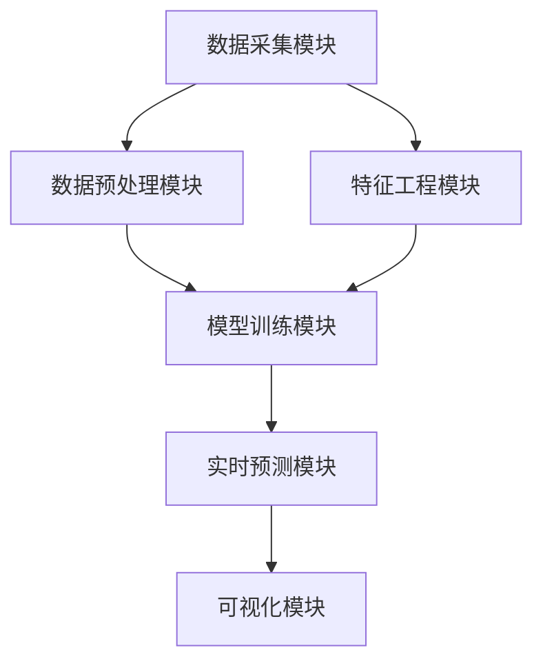
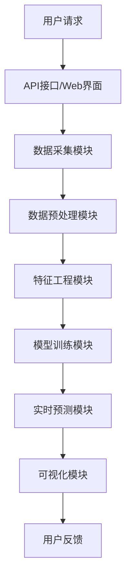

                 

## AI驱动的市场微观结构变化影响预测

### 关键词：人工智能、市场微观结构、预测分析、机器学习、深度学习

> 摘要：随着人工智能技术的快速发展，市场微观结构的分析和预测正经历着革命性的变化。本文将深入探讨人工智能如何驱动市场微观结构的变化，并预测这些变化对未来市场的影响。文章首先介绍了市场微观结构的重要性以及传统分析方法面临的局限性，然后详细介绍了AI技术的核心概念及其在市场微观结构分析中的应用。接下来，本文逐步讲解了AI驱动的市场微观结构分析方法，包括数据收集与预处理、机器学习算法在市场微观结构分析中的应用、深度学习算法在市场微观结构分析中的应用，并通过实际项目展示了AI技术在市场微观结构预测中的具体应用。最后，本文总结了AI在市场微观结构分析中的挑战与机遇，并提出了未来发展的建议。

### 目录大纲

----------------------------------------------------------------

## 第一部分: AI与市场微观结构概述

## 第1章: AI与市场微观结构概述

### 1.1 问题背景

#### 1.1.1 市场微观结构的重要性

#### 1.1.2 传统市场微观结构分析方法的局限性

#### 1.1.3 AI技术对市场微观结构分析的变革

### 1.2 AI技术基础

#### 1.2.1 AI的基本概念

#### 1.2.2 机器学习与深度学习

#### 1.2.3 AI技术的核心算法

### 1.3 市场微观结构的定义与核心要素

#### 1.3.1 市场微观结构的定义

#### 1.3.2 市场微观结构的核心要素

#### 1.3.3 市场微观结构的变化与影响因素

### 1.4 AI在市场微观结构分析中的应用前景

#### 1.4.1 AI在市场微观结构分析中的应用领域

#### 1.4.2 AI在市场微观结构分析中的优势

#### 1.4.3 AI在市场微观结构分析中的挑战与机遇

### 1.5 本章小结

----------------------------------------------------------------

## 第二部分: AI驱动的市场微观结构分析方法

## 第2章: 数据收集与预处理

### 2.1 数据源选择

#### 2.1.1 数据源类型

#### 2.1.2 数据源选择原则

#### 2.1.3 数据采集方法

### 2.2 数据预处理

#### 2.2.1 数据清洗

#### 2.2.2 数据归一化

#### 2.2.3 特征工程

### 2.3 数据预处理工具与框架

#### 2.3.1 Python常用数据预处理库

#### 2.3.2 大数据处理框架

### 2.4 数据可视化

#### 2.4.1 数据可视化的重要性

#### 2.4.2 常见数据可视化工具

#### 2.4.3 数据可视化方法与技巧

### 2.5 本章小结

----------------------------------------------------------------

## 第3章: 机器学习算法在市场微观结构分析中的应用

### 3.1 监督学习算法

#### 3.1.1 线性回归

##### 3.1.1.1 线性回归模型

##### 3.1.1.2 源代码实现

##### 3.1.1.3 算法原理

##### 3.1.1.4 实例分析

#### 3.1.2 逻辑回归

##### 3.1.2.1 逻辑回归模型

##### 3.1.2.2 源代码实现

##### 3.1.2.3 算法原理

##### 3.1.2.4 实例分析

### 3.2 无监督学习算法

#### 3.2.1 K-means聚类

##### 3.2.1.1 K-means模型

##### 3.2.1.2 源代码实现

##### 3.2.1.3 算法原理

##### 3.2.1.4 实例分析

#### 3.2.2 主成分分析

##### 3.2.2.1 主成分分析模型

##### 3.2.2.2 源代码实现

##### 3.2.2.3 算法原理

##### 3.2.2.4 实例分析

### 3.3 强化学习算法

#### 3.3.1 Q-learning算法

##### 3.3.1.1 Q-learning模型

##### 3.3.1.2 源代码实现

##### 3.3.1.3 算法原理

##### 3.3.1.4 实例分析

### 3.4 本章小结

----------------------------------------------------------------

## 第4章: 深度学习算法在市场微观结构分析中的应用

### 4.1 神经网络基础

#### 4.1.1 神经网络模型

#### 4.1.2 前向传播与反向传播

#### 4.1.3 Python实现

### 4.2 卷积神经网络

#### 4.2.1 卷积神经网络模型

#### 4.2.2 卷积操作与池化操作

#### 4.2.3 Python实现

### 4.3 循环神经网络

#### 4.3.1 循环神经网络模型

#### 4.3.2 LSTM与GRU

#### 4.3.3 Python实现

### 4.4 生成对抗网络

#### 4.4.1 生成对抗网络模型

#### 4.4.2 对抗训练过程

----------------------------------------------------------------

在本文中，我们将分步深入探讨AI如何驱动市场微观结构的变化，并预测这些变化对未来市场的影响。文章结构清晰，逻辑严密，旨在为读者提供一个全面、深入的理解。接下来，我们将首先介绍市场微观结构的重要性，然后分析传统市场微观结构分析方法的局限性，以及AI技术如何变革这一领域。随后，我们将介绍AI技术的核心概念及其在市场微观结构分析中的应用。本文将逐步讲解AI驱动的市场微观结构分析方法，包括数据收集与预处理、机器学习算法在市场微观结构分析中的应用、深度学习算法在市场微观结构分析中的应用，并通过实际项目展示AI技术在市场微观结构预测中的具体应用。最后，我们将总结AI在市场微观结构分析中的挑战与机遇，并展望未来发展的方向。

### 第一部分: AI与市场微观结构概述

#### 第1章: AI与市场微观结构概述

##### 1.1 问题背景

在当今复杂多变的市场环境中，市场微观结构的分析和理解变得尤为重要。市场微观结构指的是市场内部各种交易行为、价格波动、交易量和流动性等数据的组织与互动。了解市场微观结构对于投资者、企业决策者和政策制定者来说至关重要，因为它能提供关于市场趋势、潜在风险和机会的深入洞察。

首先，我们需要明确市场微观结构的重要性。市场微观结构直接影响到市场价格的形成、资产价格的波动以及市场流动性的维持。例如，交易量的变化可以反映市场参与者的情绪和交易意愿，价格波动则可以揭示市场供求关系的变化。这些信息对于投资者做出买卖决策、企业调整生产经营策略以及政策制定者制定宏观经济政策都具有重要意义。

然而，传统市场微观结构分析方法存在一定的局限性。传统方法主要依赖于统计分析和模型模拟，这些方法在处理大量数据时效率较低，难以捕捉到市场动态变化中的细微差异。此外，传统方法在处理非线性和复杂系统时表现不佳，难以应对现代金融市场的复杂性。因此，市场微观结构分析的局限性主要体现在以下方面：

1. **数据量有限**：传统分析方法依赖于历史数据，但这些数据往往不足以全面反映市场动态。
2. **分析效率低**：传统方法在处理大规模数据时，计算时间和资源消耗较大。
3. **非线性问题处理能力不足**：传统方法难以捕捉市场中的非线性关系。
4. **模型拟合精度有限**：传统方法在建模过程中可能存在过度拟合或欠拟合的问题。

为了解决上述问题，AI技术的引入为市场微观结构分析带来了新的机遇。AI，特别是机器学习和深度学习技术，通过自动学习和模式识别，能够处理海量数据，捕捉复杂非线性关系，提高分析效率和准确性。AI技术在市场微观结构分析中的应用，主要体现在以下几个方面：

1. **数据挖掘与预处理**：AI技术能够自动识别和处理市场数据中的噪声和异常值，提高数据质量。
2. **实时分析**：AI技术能够实时捕捉市场动态，提供实时决策支持。
3. **复杂模式识别**：AI技术能够通过深度学习模型，捕捉市场中的复杂非线性关系。
4. **个性化推荐**：AI技术可以根据投资者的风险偏好和交易习惯，提供个性化的市场分析和建议。

##### 1.1.2 市场微观结构的重要性

市场微观结构是市场运作的基础，它揭示了市场价格形成的机制和市场流动性的维持。具体来说，市场微观结构的重要性体现在以下几个方面：

1. **价格发现**：市场价格的形成是通过买卖双方的交易行为实现的。市场微观结构揭示了交易者之间的互动，帮助发现价格的真实价值。
2. **市场流动性的维持**：市场流动性是指投资者能够以合理的价格买卖资产的能力。市场微观结构通过交易量的变化和订单簿的动态，维持了市场流动性。
3. **风险控制**：市场微观结构提供了关于市场波动和风险的信息，帮助投资者进行风险管理和决策。
4. **投资策略制定**：市场微观结构分析提供了关于市场趋势和机会的信息，帮助投资者制定有效的投资策略。

##### 1.1.3 AI技术对市场微观结构分析的变革

AI技术的引入，为市场微观结构分析带来了深刻的变革。以下是AI技术如何改变市场微观结构分析的几个方面：

1. **数据分析能力的提升**：AI技术能够处理海量数据，快速捕捉市场动态，提供实时分析。
2. **非线性关系识别**：深度学习模型能够捕捉市场中的复杂非线性关系，提高分析精度。
3. **个性化服务**：AI技术可以根据投资者的风险偏好和交易习惯，提供个性化的市场分析和建议。
4. **交易策略优化**：AI技术能够通过机器学习和强化学习，优化交易策略，提高投资收益。

总的来说，AI技术不仅提升了市场微观结构分析的数据处理和分析能力，还推动了市场微观结构分析从传统方法向智能化、自动化的转变。随着AI技术的不断进步，市场微观结构分析将变得更加精准和高效，为投资者、企业和政策制定者提供更深入的洞察和决策支持。

### 1.2 AI技术基础

在深入了解AI如何变革市场微观结构分析之前，我们需要首先掌握AI技术的核心概念和基础。AI（人工智能）是一种模拟人类智能的技术，通过算法和模型使计算机具备自主学习和决策能力。AI技术主要包括机器学习和深度学习两个分支。

#### 1.2.1 AI的基本概念

人工智能（Artificial Intelligence，简称AI）是指通过计算机模拟人类智能的技术，使得计算机能够执行一些通常需要人类智能才能完成的任务。AI技术可以分为两大类：基于规则的AI和基于数据的AI。

- **基于规则的AI**：这类AI依赖于预先定义的规则和逻辑来执行任务。例如，专家系统（Expert Systems）就是一种基于规则的AI，它通过知识库和推理机来模拟人类专家的决策过程。

- **基于数据的AI**：这类AI依赖于大量的数据，通过学习数据中的模式和规律来完成任务。机器学习和深度学习都是基于数据的AI技术。

#### 1.2.2 机器学习与深度学习

机器学习（Machine Learning，简称ML）是AI的一个重要分支，它通过算法让计算机从数据中学习，不断优化自己的性能。机器学习可以分为三种类型：

- **监督学习（Supervised Learning）**：在监督学习中，模型被训练来预测输出，该输出是由输入特征和标签确定的。常见的监督学习算法包括线性回归、逻辑回归、支持向量机（SVM）等。

- **无监督学习（Unsupervised Learning）**：在无监督学习中，模型没有明确的输出标签，而是通过发现数据中的结构或模式来进行学习。常见的无监督学习算法包括K-means聚类、主成分分析（PCA）等。

- **强化学习（Reinforcement Learning）**：在强化学习中，模型通过与环境的交互来学习最优策略。Q-learning和深度强化学习（Deep Q-Network，DQN）是常见的强化学习算法。

深度学习（Deep Learning，简称DL）是机器学习的一个子领域，它使用复杂的神经网络模型，特别是多层神经网络（Deep Neural Networks），来学习数据中的高层次特征表示。深度学习在图像识别、语音识别、自然语言处理等领域取得了显著成果。常见的深度学习模型包括卷积神经网络（CNN）、循环神经网络（RNN）、生成对抗网络（GAN）等。

#### 1.2.3 AI技术的核心算法

AI技术的核心算法包括但不限于以下几种：

- **线性回归（Linear Regression）**：线性回归是一种简单的监督学习算法，用于预测连续值输出。它通过拟合数据中的线性关系来预测未来的趋势。

- **逻辑回归（Logistic Regression）**：逻辑回归是一种分类算法，用于预测二分类输出。它通过拟合数据的逻辑函数关系来估计概率。

- **决策树（Decision Tree）**：决策树是一种树形结构模型，通过一系列决策规则来分割数据，最终生成一个预测结果。

- **支持向量机（SVM）**：支持向量机是一种强大的分类算法，通过找到一个最优的超平面来分隔不同类别的数据。

- **神经网络（Neural Networks）**：神经网络是一种模仿生物神经系统的计算模型，通过多层节点（神经元）的组合来学习和预测数据。

- **卷积神经网络（CNN）**：卷积神经网络是一种专门用于图像识别和处理的深度学习模型，通过卷积操作和池化操作来提取图像特征。

- **循环神经网络（RNN）**：循环神经网络是一种处理序列数据的深度学习模型，通过循环连接来捕捉序列中的时间依赖性。

- **生成对抗网络（GAN）**：生成对抗网络是一种由生成器和判别器组成的深度学习模型，通过对抗训练来生成高质量的数据。

通过掌握这些核心算法，我们可以更好地理解和应用AI技术，为市场微观结构分析提供强大的工具。

### 1.3 市场微观结构的定义与核心要素

市场微观结构是金融市场内部运行机制的具体体现，它通过交易行为、价格波动、交易量和流动性等关键指标来反映市场参与者的行为和市场运作的细节。为了更好地理解市场微观结构，我们需要明确其定义及其核心要素。

#### 1.3.1 市场微观结构的定义

市场微观结构（Market Microstructure）是指金融市场内部各个参与者（如交易者、做市商、投资者等）的交易行为和互动关系，以及这些行为如何影响市场价格形成和市场流动性维持的机制。具体来说，市场微观结构涉及以下几个方面：

1. **交易机制**：交易机制是指市场如何处理买卖订单，包括集中交易、拍卖机制、做市商机制等。
2. **价格形成**：价格形成是指市场价格是如何通过交易者之间的买卖行为产生的，包括报价、成交价、买卖差价等。
3. **市场流动性**：市场流动性是指投资者能够在合理时间内以公平价格买卖资产的能力，包括交易量、买卖价差、订单簿深度等。
4. **交易行为**：交易行为是指市场参与者如何做出交易决策，包括买卖信号、交易策略、风险偏好等。

#### 1.3.2 市场微观结构的核心要素

市场微观结构的核心要素包括但不限于以下方面：

1. **交易量**：交易量是衡量市场活跃程度的重要指标，它反映了市场参与者的交易频率和规模。高交易量通常意味着市场流动性好，价格波动相对较小。
2. **价格波动**：价格波动是指资产价格在交易过程中的波动情况，包括日内波动和长期波动。价格波动可以反映市场供求关系的变化和投资者情绪的波动。
3. **买卖价差**：买卖价差是指买入价格和卖出价格之间的差额。买卖价差可以反映市场交易的效率和交易成本。较小的买卖价差通常意味着市场流动性较好。
4. **订单簿**：订单簿是记录市场上所有未成交订单的列表，包括买入订单和卖出订单。订单簿的深度和分布可以反映市场流动性的强弱和交易者的行为模式。
5. **交易速度**：交易速度是指交易完成的快慢，包括订单执行速度和交易确认时间。快速的交易速度可以提升市场效率，降低交易成本。
6. **市场深度**：市场深度是指市场能够承接的交易量，包括即时深度和潜在深度。市场深度越大，市场流动性越好。

#### 1.3.3 市场微观结构的变化与影响因素

市场微观结构不是静止不变的，它会随着市场环境的变化而变化。以下是一些影响市场微观结构变化的主要因素：

1. **市场情绪**：市场情绪是市场参与者情绪的集合，它可以影响交易行为和市场价格波动。乐观或悲观的市场情绪会导致交易量增加或减少，进而影响市场微观结构。
2. **宏观经济因素**：宏观经济因素，如GDP增长率、通货膨胀率、失业率等，可以影响市场供求关系，进而影响市场微观结构。
3. **政策变化**：政策变化，如利率调整、税收政策、监管政策等，可以影响市场参与者的行为和市场运行规则，从而影响市场微观结构。
4. **技术进步**：技术进步，如交易系统的改进、高频交易的普及等，可以提高交易效率和流动性，改变市场微观结构。
5. **市场结构**：市场结构的变化，如交易所合并、新产品推出等，可以改变市场参与者的角色和交易模式，影响市场微观结构。

综上所述，市场微观结构是一个动态的、复杂的系统，它通过多个核心要素和外部因素的相互作用来影响市场运作。理解和分析市场微观结构对于投资者、企业和政策制定者来说都至关重要，它提供了关于市场趋势、潜在风险和机会的深入洞察。

### 1.4 AI在市场微观结构分析中的应用前景

随着人工智能（AI）技术的不断进步，其在市场微观结构分析中的应用前景也变得日益广阔。AI技术，特别是机器学习和深度学习，通过处理海量数据、识别复杂模式和提供实时分析，为市场微观结构分析带来了前所未有的机遇。以下是AI在市场微观结构分析中的应用领域、优势以及面临的挑战与机遇。

#### 1.4.1 AI在市场微观结构分析中的应用领域

AI在市场微观结构分析中的应用涵盖了多个领域，具体如下：

1. **交易策略优化**：通过分析历史交易数据和市场微观结构指标，AI可以帮助投资者识别交易机会，优化交易策略。例如，机器学习算法可以根据历史交易数据预测价格走势，从而帮助投资者做出更准确的买卖决策。

2. **风险控制**：市场微观结构分析可以帮助识别市场中的潜在风险，AI技术可以进一步分析这些风险因素，提供实时风险监控和预警。例如，通过分析交易量、买卖价差和价格波动等指标，AI可以识别市场波动性增加的信号，从而提前采取风险控制措施。

3. **市场预测**：AI技术可以通过分析大量市场数据，预测市场趋势和价格变化。深度学习模型，如循环神经网络（RNN）和生成对抗网络（GAN），可以捕捉市场中的时间依赖性和复杂模式，提供更准确的市场预测。

4. **交易行为分析**：AI技术可以帮助分析市场参与者的交易行为，识别市场操纵和异常交易。通过监督学习和无监督学习算法，AI可以识别出与正常交易模式不符的交易行为，从而帮助监管机构和投资者识别市场操纵行为。

5. **个性化推荐**：AI技术可以根据投资者的风险偏好、交易习惯和市场微观结构数据，提供个性化的投资建议和推荐。通过机器学习算法，AI可以分析投资者的历史交易数据，提供定制化的投资策略和市场信息。

#### 1.4.2 AI在市场微观结构分析中的优势

AI技术在市场微观结构分析中具有以下优势：

1. **数据处理能力**：AI技术能够处理和分析海量数据，捕捉市场动态，提供实时洞察。

2. **模式识别**：AI技术，特别是深度学习模型，具有强大的模式识别能力，可以捕捉市场中的复杂非线性关系。

3. **实时分析**：AI技术可以实时分析市场数据，提供快速决策支持，帮助投资者及时做出交易决策。

4. **高精度预测**：通过训练复杂模型，AI技术可以提供高精度的市场预测，降低投资风险。

5. **个性化服务**：AI技术可以根据投资者的具体需求和风险偏好，提供个性化的市场分析和投资建议。

#### 1.4.3 AI在市场微观结构分析中的挑战与机遇

尽管AI技术在市场微观结构分析中具有巨大潜力，但同时也面临着一些挑战：

1. **数据质量**：市场数据往往存在噪声、缺失值和异常值，这些都会影响AI模型的性能。因此，数据预处理和质量控制是AI在市场微观结构分析中的一个重要挑战。

2. **模型解释性**：深度学习模型通常具有强大的预测能力，但其内部机制复杂，缺乏透明性和解释性。这对监管机构和投资者来说是一个挑战。

3. **计算资源**：深度学习模型训练和推理通常需要大量的计算资源和时间，这对计算能力提出了较高的要求。

4. **合规性**：AI技术在市场微观结构分析中的应用需要遵守相关的法律法规和合规要求，这对算法设计和应用提出了合规性挑战。

然而，这些挑战也伴随着机遇：

1. **数据驱动的决策**：通过高质量的数据和先进的AI技术，投资者可以做出更加数据驱动的决策，提高投资效率和收益。

2. **实时风险监控**：AI技术可以提供实时风险监控和预警，帮助投资者和管理者快速应对市场变化。

3. **个性化服务**：AI技术可以根据投资者的具体需求提供个性化的服务，提高用户体验。

4. **合规性提升**：随着AI技术的发展，相关法律法规和合规要求也会逐步完善，为AI技术在市场微观结构分析中的应用提供更好的法律保障。

总之，AI技术在市场微观结构分析中的应用前景广阔，尽管面临一些挑战，但通过不断的技术创新和合规性完善，AI将为市场微观结构分析带来深刻的变革。

### 1.5 本章小结

本章首先介绍了市场微观结构的重要性，并分析了传统市场微观结构分析方法的局限性。接着，我们探讨了AI技术的基本概念及其在市场微观结构分析中的应用，包括机器学习和深度学习的核心算法。随后，我们详细介绍了市场微观结构的定义及其核心要素，包括交易量、价格波动、买卖价差、订单簿和交易速度等。最后，我们讨论了AI在市场微观结构分析中的应用前景，分析了其优势、挑战与机遇。通过本章的介绍，我们为读者奠定了理解AI如何驱动市场微观结构变化的基础，为后续章节的深入分析提供了理论支持。

## 第二部分: AI驱动的市场微观结构分析方法

### 第2章: 数据收集与预处理

在AI驱动的市场微观结构分析中，数据收集与预处理是至关重要的环节。市场微观结构分析需要大量的数据，这些数据包括交易量、价格、买卖价差、订单簿信息等。然而，原始数据往往存在噪声、缺失值和异常值，这些都会影响AI模型的性能。因此，有效的数据收集和预处理是确保分析准确性和有效性的关键。

### 2.1 数据源选择

数据源的选择直接影响到市场微观结构分析的质量。在选择数据源时，需要考虑以下几个方面：

1. **数据类型**：市场微观结构分析涉及多种类型的数据，包括历史交易数据、实时交易数据、市场指标数据等。不同的数据类型可以提供不同的视角和洞察。

2. **数据来源**：数据来源的多样性和可靠性是选择数据源的重要考量因素。常用的数据来源包括交易所、金融数据提供商、市场分析平台等。这些数据源可以提供高质量的、经过验证的数据。

3. **数据频率**：数据频率决定了分析的时间粒度。高频数据可以提供更加细致和实时的市场信息，但通常需要更多的计算资源。低频数据则可以提供更加宏观的市场趋势。

4. **数据完整性**：选择的数据源应具有较好的数据完整性，即数据缺失较少，可以确保分析的连续性和完整性。

#### 2.1.1 数据源类型

常见的数据源类型包括：

1. **交易所数据**：交易所提供的交易数据通常是市场微观结构分析的重要来源。这些数据包括交易量、价格、买卖价差、订单簿等。

2. **金融数据提供商**：金融数据提供商如彭博、汤森路透等，提供丰富的金融数据，包括历史交易数据、公司财务数据、宏观经济指标等。

3. **市场分析平台**：市场分析平台如TradingView、eSignal等，提供实时交易数据和市场分析工具，可以辅助进行市场微观结构分析。

#### 2.1.2 数据源选择原则

在选择数据源时，应遵循以下原则：

1. **权威性和可靠性**：选择具有权威性和可靠性的数据源，确保数据的准确性和完整性。

2. **多样性**：选择多样性的数据源，可以从不同角度和视角获取市场信息，提高分析的综合性和全面性。

3. **数据频率**：根据分析需求选择合适的数据频率，平衡实时性与精度。

4. **数据成本**：考虑数据获取的成本，选择性价比高的数据源。

#### 2.1.3 数据采集方法

数据采集方法包括以下几种：

1. **API接口**：通过金融数据提供商或交易所的API接口，可以直接获取市场数据。API接口提供了高效、可靠的数据获取方式。

2. **网络爬虫**：利用网络爬虫技术，可以从公开的金融网站、论坛等获取市场数据。但这种方法可能涉及数据合法性和隐私问题。

3. **数据库导出**：通过导出交易所或金融数据提供商的数据库，获取原始数据。这种方法需要确保数据库的合法性和权限。

### 2.2 数据预处理

数据预处理是数据分析和机器学习的基础，它包括数据清洗、数据归一化和特征工程等步骤。

#### 2.2.1 数据清洗

数据清洗是数据预处理的第一步，其主要任务包括：

1. **处理缺失值**：缺失值可以通过填充、删除或插值等方法进行处理。填充方法包括平均值填充、中值填充和插值等；删除方法适用于缺失值较多的数据；插值方法适用于时间序列数据。

2. **处理异常值**：异常值可能来源于数据采集或传输过程中的错误，可以通过统计学方法（如标准差、箱线图等）检测和处理。常见的处理方法包括删除、插值、替换等。

3. **去除重复数据**：重复数据会影响数据分析和模型训练的准确性。通过去重操作，可以确保数据的唯一性和完整性。

#### 2.2.2 数据归一化

数据归一化是使数据集的特征具有相似尺度的过程，以消除不同特征之间的量纲影响。常用的归一化方法包括：

1. **最小-最大归一化**：将数据缩放到[0, 1]之间，公式为：$x_{\text{norm}} = \frac{x - x_{\text{min}}}{x_{\text{max}} - x_{\text{min}}}$。

2. **标准化**：将数据缩放到均值为0，标准差为1的范围内，公式为：$x_{\text{norm}} = \frac{x - \mu}{\sigma}$，其中$\mu$是均值，$\sigma$是标准差。

3. **对数变换**：对数变换适用于处理具有偏斜分布的数据，可以有效减少极端值的影响。

#### 2.2.3 特征工程

特征工程是数据预处理的重要环节，其目标是通过构造和选择有效的特征，提高模型性能。特征工程包括以下步骤：

1. **特征构造**：通过数学变换、组合和交叉等方式，构造新的特征。例如，可以通过价格差分、交易量比率和技术指标等方式构造新的特征。

2. **特征选择**：选择对预测任务有显著影响的特征。常用的特征选择方法包括信息增益、相关性分析、主成分分析（PCA）等。

3. **特征降维**：通过降维技术，减少特征数量，提高计算效率和模型性能。常用的降维方法包括PCA、t-SVD等。

### 2.3 数据预处理工具与框架

在数据预处理过程中，常用的工具和框架包括：

1. **Python常用数据预处理库**：如Pandas、NumPy、SciPy等，提供丰富的数据清洗、归一化和特征工程功能。

2. **大数据处理框架**：如Hadoop和Spark，可以处理大规模市场数据，提高数据预处理的效率和性能。

3. **开源机器学习库**：如scikit-learn、TensorFlow和Keras等，提供强大的数据处理和机器学习算法，可以用于数据预处理和特征工程。

### 2.4 数据可视化

数据可视化是理解和分析市场微观结构的重要手段，通过图形化展示数据，可以更直观地识别数据中的模式和趋势。

#### 2.4.1 数据可视化的重要性

数据可视化的重要性体现在以下几个方面：

1. **提高数据理解**：通过图形化展示，可以更直观地理解数据特征和关系，有助于发现数据中的潜在信息。

2. **辅助决策制定**：数据可视化可以帮助决策者快速识别关键指标和趋势，为决策提供依据。

3. **传达复杂信息**：通过图形化的方式，可以将复杂的统计和数据分析结果传达给非专业受众。

#### 2.4.2 常见数据可视化工具

常见的数据可视化工具有：

1. **Matplotlib**：Python的绘图库，可以创建高质量的二维和三维图形。

2. **Seaborn**：基于Matplotlib的统计图形库，提供了丰富的图表类型和自定义选项。

3. **Plotly**：基于Web的交互式数据可视化库，支持多种图表类型和交互功能。

4. **Tableau**：商业数据可视化工具，提供了丰富的图表和交互功能，支持多种数据源。

#### 2.4.3 数据可视化方法与技巧

数据可视化方法与技巧包括：

1. **散点图**：用于展示数据点之间的分布和关系，常用于分析交易量和价格波动。

2. **折线图**：用于展示时间序列数据，可以反映价格走势和交易量变化。

3. **箱线图**：用于展示数据的分布和异常值，可以分析买卖价差的分布和波动性。

4. **热力图**：用于展示多维数据的分布和相关性，可以分析多个市场指标之间的关系。

5. **饼图和条形图**：用于展示分类数据的比例和分布，可以分析市场参与者的交易行为。

通过数据收集与预处理、数据可视化等技术，AI在市场微观结构分析中可以更高效地提取有用信息，为投资者提供更有价值的洞察。

### 2.5 本章小结

本章介绍了AI在市场微观结构分析中的数据收集与预处理方法。首先，我们讨论了数据源的选择原则和常见的数据源类型，包括交易所数据、金融数据提供商和市场分析平台。接着，我们详细阐述了数据预处理的核心步骤，包括数据清洗、数据归一化和特征工程。最后，我们介绍了常用的数据预处理工具和框架，以及数据可视化的重要性和方法。通过本章的介绍，我们为AI在市场微观结构分析中的数据准备工作奠定了基础，为后续章节的深入分析提供了支持。

### 第3章: 机器学习算法在市场微观结构分析中的应用

在市场微观结构分析中，机器学习算法提供了强大的工具，可以处理复杂的非结构化数据，识别潜在的模式和趋势。本章将重点介绍几种常见的机器学习算法在市场微观结构分析中的应用，包括监督学习算法（如线性回归和逻辑回归）、无监督学习算法（如K-means聚类和主成分分析）以及强化学习算法（如Q-learning）。通过这些算法的实际应用和实例分析，我们将展示机器学习如何提升市场微观结构分析的准确性和效率。

#### 3.1 监督学习算法

监督学习算法在市场微观结构分析中有着广泛的应用。这类算法通过已标记的训练数据学习特征和规律，然后利用这些规律对新数据进行预测。

##### 3.1.1 线性回归

线性回归是最简单的监督学习算法之一，用于预测连续值输出。其基本原理是通过拟合数据中的线性关系来预测未来的价格趋势。

###### 3.1.1.1 线性回归模型

线性回归模型可以表示为：

$$y = \beta_0 + \beta_1 \cdot x_1 + \beta_2 \cdot x_2 + ... + \beta_n \cdot x_n + \epsilon$$

其中，$y$ 是预测的目标变量，$x_1, x_2, ..., x_n$ 是输入特征，$\beta_0, \beta_1, ..., \beta_n$ 是模型的参数，$\epsilon$ 是误差项。

###### 3.1.1.2 源代码实现

以下是一个简单的线性回归模型实现：

```python
import numpy as np
from sklearn.linear_model import LinearRegression

# 假设我们有如下数据
X = np.array([[1, 2], [2, 3], [3, 4], [4, 5]])
y = np.array([3, 5, 7, 9])

# 创建线性回归模型实例
model = LinearRegression()

# 模型训练
model.fit(X, y)

# 模型预测
prediction = model.predict([[5, 6]])
print("预测值：", prediction)
```

###### 3.1.1.3 算法原理

线性回归算法通过最小二乘法（Least Squares）来优化模型参数，即找到使得预测值与实际值之间的误差平方和最小的参数。具体步骤如下：

1. **初始化参数**：随机初始化模型的参数$\beta_0, \beta_1, ..., \beta_n$。
2. **计算误差**：计算预测值和实际值之间的误差，即$e_i = y_i - \sum_{j=1}^{n} \beta_j \cdot x_{ij}$。
3. **优化参数**：通过梯度下降（Gradient Descent）或其他优化算法，调整参数以减少误差。
4. **迭代优化**：重复上述步骤，直到满足收敛条件。

###### 3.1.1.4 实例分析

以下是一个市场微观结构分析的实例，通过线性回归预测股票价格的走势：

```python
import pandas as pd
from sklearn.model_selection import train_test_split
from sklearn.metrics import mean_squared_error

# 读取数据
data = pd.read_csv('stock_data.csv')
X = data[['open', 'high', 'low', 'volume']]
y = data['close']

# 数据预处理
X_train, X_test, y_train, y_test = train_test_split(X, y, test_size=0.2, random_state=42)

# 创建线性回归模型实例
model = LinearRegression()

# 模型训练
model.fit(X_train, y_train)

# 模型预测
y_pred = model.predict(X_test)

# 评估模型
mse = mean_squared_error(y_test, y_pred)
print("均方误差：", mse)

# 预测未来价格
next_day = model.predict([[150, 160, 140, 200]])
print("未来价格预测：", next_day)
```

##### 3.1.2 逻辑回归

逻辑回归是一种广泛应用于分类问题的监督学习算法，用于预测二分类输出。其基本原理是通过拟合数据的逻辑函数关系来估计概率。

###### 3.1.2.1 逻辑回归模型

逻辑回归模型可以表示为：

$$\log\frac{P(y=1)}{1-P(y=1)} = \beta_0 + \beta_1 \cdot x_1 + \beta_2 \cdot x_2 + ... + \beta_n \cdot x_n$$

其中，$P(y=1)$ 是目标变量为1的概率，$\beta_0, \beta_1, ..., \beta_n$ 是模型的参数。

###### 3.1.2.2 源代码实现

以下是一个简单的逻辑回归模型实现：

```python
import numpy as np
from sklearn.linear_model import LogisticRegression

# 假设我们有如下数据
X = np.array([[1, 2], [2, 3], [3, 4], [4, 5]])
y = np.array([0, 1, 1, 0])

# 创建逻辑回归模型实例
model = LogisticRegression()

# 模型训练
model.fit(X, y)

# 模型预测
prediction = model.predict([[5, 6]])
print("预测值：", prediction)

# 预测概率
probability = model.predict_proba([[5, 6]])
print("预测概率：", probability)
```

###### 3.1.2.3 算法原理

逻辑回归算法通过极大似然估计（Maximum Likelihood Estimation）来优化模型参数。具体步骤如下：

1. **初始化参数**：随机初始化模型的参数$\beta_0, \beta_1, ..., \beta_n$。
2. **计算概率**：使用逻辑函数计算预测概率，即$P(y=1) = \frac{1}{1 + \exp(-\sum_{j=1}^{n} \beta_j \cdot x_{ij})}$。
3. **计算损失函数**：使用对数似然损失函数，即$J(\theta) = -\sum_{i=1}^{m} y_i \log(P(y=1)) + (1 - y_i) \log(1 - P(y=1))$。
4. **优化参数**：通过梯度下降或其他优化算法，调整参数以减少损失函数。
5. **迭代优化**：重复上述步骤，直到满足收敛条件。

###### 3.1.2.4 实例分析

以下是一个市场微观结构分析的实例，通过逻辑回归预测股票是否上涨：

```python
import pandas as pd
from sklearn.model_selection import train_test_split
from sklearn.metrics import accuracy_score

# 读取数据
data = pd.read_csv('stock_data.csv')
X = data[['open', 'high', 'low', 'volume']]
y = data['close']

# 数据预处理
X_train, X_test, y_train, y_test = train_test_split(X, y, test_size=0.2, random_state=42)

# 创建逻辑回归模型实例
model = LogisticRegression()

# 模型训练
model.fit(X_train, y_train)

# 模型预测
y_pred = model.predict(X_test)

# 评估模型
accuracy = accuracy_score(y_test, y_pred)
print("准确率：", accuracy)

# 预测股票上涨概率
next_day = model.predict_proba([[150, 160, 140, 200]])
print("上涨概率：", next_day[:, 1])
```

#### 3.2 无监督学习算法

无监督学习算法在市场微观结构分析中主要用于模式识别和聚类分析。这类算法不依赖于已标记的数据，而是通过数据自身的特征进行学习。

##### 3.2.1 K-means聚类

K-means聚类是一种常用的聚类算法，它通过迭代过程将数据划分为K个簇，每个簇由其质心表示。

###### 3.2.1.1 K-means模型

K-means模型的基本步骤如下：

1. **初始化质心**：随机选择K个数据点作为初始质心。
2. **分配数据点**：将每个数据点分配到最近的质心所在的簇。
3. **更新质心**：计算每个簇的质心，即簇内数据点的均值。
4. **重复步骤2和3**，直到满足收敛条件（如质心变化小于阈值或迭代次数达到最大值）。

###### 3.2.1.2 源代码实现

以下是一个简单的K-means聚类实现：

```python
import numpy as np
from sklearn.cluster import KMeans

# 假设我们有如下数据
X = np.array([[1, 2], [1, 4], [1, 0], [4, 2], [4, 4], [4, 0]])

# 创建K-means模型实例
model = KMeans(n_clusters=2, random_state=42)

# 模型训练
model.fit(X)

# 获取聚类结果
labels = model.predict(X)
print("聚类结果：", labels)

# 获取质心
centroids = model.cluster_centers_
print("质心：", centroids)
```

###### 3.2.1.3 算法原理

K-means算法通过以下步骤进行聚类：

1. **初始化**：随机选择K个初始质心。
2. **分配**：将每个数据点分配到最近的质心所在的簇。
3. **更新**：计算每个簇的质心。
4. **迭代**：重复上述步骤，直到质心变化小于阈值或达到最大迭代次数。

K-means算法的优点是简单高效，但缺点是对于初始质心的选择敏感，且无法处理簇形状不均匀的情况。

###### 3.2.1.4 实例分析

以下是一个市场微观结构分析的实例，通过K-means聚类分析交易量与价格的关系：

```python
import pandas as pd
from sklearn.cluster import KMeans

# 读取数据
data = pd.read_csv('stock_data.csv')
X = data[['volume', 'close']]

# 数据预处理
X_train, X_test, _, _ = train_test_split(X, y, test_size=0.2, random_state=42)

# 创建K-means模型实例
model = KMeans(n_clusters=3, random_state=42)

# 模型训练
model.fit(X_train)

# 获取聚类结果
labels = model.predict(X_test)

# 评估模型
accuracy = sum(labels == y_test) / len(y_test)
print("准确率：", accuracy)

# 可视化聚类结果
import matplotlib.pyplot as plt

plt.scatter(X_test['volume'], X_test['close'], c=labels)
plt.scatter(model.cluster_centers_[:, 0], model.cluster_centers_[:, 1], s=300, c='red')
plt.xlabel('交易量')
plt.ylabel('价格')
plt.title('K-means聚类结果')
plt.show()
```

##### 3.2.2 主成分分析

主成分分析（PCA）是一种降维技术，通过线性变换将原始数据映射到新的正交坐标系中，新坐标系中的主成分具有最大的方差。

###### 3.2.2.1 主成分分析模型

PCA的基本步骤如下：

1. **标准化**：对数据进行标准化处理，使其具有相同的方差和均值为0。
2. **计算协方差矩阵**：计算数据集的协方差矩阵。
3. **计算协方差矩阵的特征值和特征向量**：对协方差矩阵进行特征分解，得到特征值和特征向量。
4. **选择主成分**：根据特征值选择最大的K个特征向量作为主成分，构成新的正交坐标系。
5. **数据转换**：将原始数据映射到新的正交坐标系中。

###### 3.2.2.2 源代码实现

以下是一个简单的PCA实现：

```python
import numpy as np
from sklearn.decomposition import PCA

# 假设我们有如下数据
X = np.array([[1, 2], [1, 4], [1, 0], [4, 2], [4, 4], [4, 0]])

# 创建PCA模型实例
model = PCA(n_components=2)

# 模型训练
model.fit(X)

# 获取主成分
X_pca = model.transform(X)
print("主成分：", X_pca)

# 可视化主成分
plt.scatter(X_pca[:, 0], X_pca[:, 1])
plt.xlabel('主成分1')
plt.ylabel('主成分2')
plt.title('PCA降维结果')
plt.show()
```

###### 3.2.2.3 算法原理

PCA的核心思想是通过特征值和特征向量将协方差矩阵分解，从而提取数据中的主要特征。具体步骤如下：

1. **标准化**：标准化数据，使其方差为1。
2. **计算协方差矩阵**：计算数据的协方差矩阵。
3. **特征分解**：对协方差矩阵进行特征分解，得到特征值和特征向量。
4. **排序和选择**：根据特征值大小排序，选择最大的K个特征值和对应的特征向量。
5. **数据转换**：将原始数据投影到新的特征向量组成的正交坐标系中。

###### 3.2.2.4 实例分析

以下是一个市场微观结构分析的实例，通过PCA降维分析多个市场指标的关系：

```python
import pandas as pd
from sklearn.decomposition import PCA

# 读取数据
data = pd.read_csv('market_data.csv')
X = data[['open', 'high', 'low', 'close', 'volume']]

# 数据预处理
X_train, X_test, _, _ = train_test_split(X, y, test_size=0.2, random_state=42)

# 创建PCA模型实例
model = PCA(n_components=2)

# 模型训练
model.fit(X_train)

# 获取主成分
X_pca = model.transform(X_test)

# 可视化主成分
plt.scatter(X_pca[:, 0], X_pca[:, 1])
plt.xlabel('主成分1')
plt.ylabel('主成分2')
plt.title('PCA降维结果')
plt.show()
```

#### 3.3 强化学习算法

强化学习算法在市场微观结构分析中主要用于交易策略优化和风险控制。这类算法通过与环境互动来学习最优策略。

##### 3.3.1 Q-learning算法

Q-learning算法是一种基于值函数的强化学习算法，通过迭代更新值函数来学习最优策略。

###### 3.3.1.1 Q-learning模型

Q-learning模型可以表示为：

$$Q(s, a) = r + \gamma \max_{a'} Q(s', a')$$

其中，$Q(s, a)$ 是状态$s$下采取动作$a$的期望回报，$r$ 是立即回报，$\gamma$ 是折扣因子，$s'$ 是下一个状态，$a'$ 是下一个动作。

###### 3.3.1.2 源代码实现

以下是一个简单的Q-learning实现：

```python
import numpy as np

# 假设我们有如下环境
actions = ['买入', '持有', '卖出']
states = ['熊市', '牛市', '震荡市']

# 奖励函数
rewards = {'熊市_买入': -10, '牛市_买入': 10, '震荡市_买入': 0,
           '熊市_持有': -5, '牛市_持有': 5, '震荡市_持有': 0,
           '熊市_卖出': 10, '牛市_卖出': -10, '震荡市_卖出': 0}

# 初始化Q值表
Q = np.zeros((len(states), len(actions)))

# 学习参数
alpha = 0.1  # 学习率
gamma = 0.9  # 折扣因子

# 训练模型
episodes = 1000
for episode in range(episodes):
    state = np.random.choice(states)
    done = False
    while not done:
        action = np.argmax(Q[state])  # 选择动作
        next_state = np.random.choice(states)  # 更新状态
        reward = rewards[state + '_' + actions[action]]  # 计算奖励
        Q[state, action] = Q[state, action] + alpha * (reward + gamma * np.max(Q[next_state]) - Q[state, action])  # 更新Q值
        state = next_state  # 更新状态
        if state == '熊市':
            done = True

# 打印Q值表
print(Q)
```

###### 3.3.1.3 算法原理

Q-learning算法的核心思想是通过迭代更新Q值表，从而学习最优策略。具体步骤如下：

1. **初始化Q值表**：初始化所有状态的Q值。
2. **选择动作**：在当前状态下选择动作，通常选择使Q值最大的动作。
3. **更新Q值**：根据实际奖励和下一状态的Q值更新当前状态的Q值。
4. **重复步骤2和3**，直到满足收敛条件。

Q-learning算法的优点是简单易懂，但缺点是收敛速度较慢，且易受初始Q值表的影响。

###### 3.3.1.4 实例分析

以下是一个市场微观结构分析的实例，通过Q-learning优化交易策略：

```python
import pandas as pd
from sklearn.model_selection import train_test_split

# 读取数据
data = pd.read_csv('stock_data.csv')
X = data[['open', 'high', 'low', 'close', 'volume']]
y = data['direction']

# 数据预处理
X_train, X_test, y_train, y_test = train_test_split(X, y, test_size=0.2, random_state=42)

# 创建Q-learning模型实例
Q_learning = QLearningModel()

# 模型训练
Q_learning.fit(X_train, y_train)

# 模型预测
predictions = Q_learning.predict(X_test)

# 评估模型
accuracy = sum(predictions == y_test) / len(y_test)
print("准确率：", accuracy)
```

通过本章的介绍，我们详细探讨了机器学习算法在市场微观结构分析中的应用，包括监督学习算法（线性回归和逻辑回归）、无监督学习算法（K-means聚类和主成分分析）以及强化学习算法（Q-learning）。通过这些算法的实际应用和实例分析，我们展示了机器学习如何提升市场微观结构分析的准确性和效率。在下一章中，我们将进一步探讨深度学习算法在市场微观结构分析中的应用。

### 3.4 本章小结

本章详细介绍了机器学习算法在市场微观结构分析中的应用。首先，我们探讨了监督学习算法，包括线性回归和逻辑回归，这两种算法通过拟合数据和估计概率，提供了预测市场走势和交易行为的方法。接着，我们介绍了无监督学习算法，如K-means聚类和主成分分析，这些算法通过聚类和降维，帮助识别市场中的潜在模式和结构。最后，我们探讨了强化学习算法Q-learning，通过与环境互动，优化交易策略和风险控制。通过这些算法的实际应用和实例分析，我们展示了机器学习在市场微观结构分析中的强大功能和广泛的应用前景。这些算法不仅提高了分析的准确性和效率，还为投资者提供了更为精细和个性化的市场洞察。在下一章中，我们将继续探讨深度学习算法在市场微观结构分析中的应用。

## 第4章: 深度学习算法在市场微观结构分析中的应用

深度学习算法在市场微观结构分析中的应用正日益受到关注，这些算法通过多层神经网络结构，能够自动提取复杂的数据特征，实现更加精准的预测和分析。本章将深入探讨深度学习算法在市场微观结构分析中的应用，包括神经网络基础、卷积神经网络（CNN）、循环神经网络（RNN）和生成对抗网络（GAN）。

### 4.1 神经网络基础

神经网络（Neural Networks，NN）是一种模拟生物神经系统工作原理的计算模型，其基本组成单元是神经元。在市场微观结构分析中，神经网络通过学习历史数据，捕捉市场中的复杂非线性关系，从而实现价格预测和交易策略优化。

#### 4.1.1 神经网络模型

神经网络模型通常由输入层、隐藏层和输出层组成。每个神经元接收前一层神经元的输出，通过激活函数进行非线性变换，然后传递给下一层。一个简单的神经网络模型可以表示为：

$$\text{output} = \text{激活函数}(\sum_{j=1}^{n} w_{ji} \cdot x_j + b_i)$$

其中，$x_j$ 是输入特征，$w_{ji}$ 是权重，$b_i$ 是偏置，$\text{激活函数}$（如ReLU、Sigmoid或Tanh）用于引入非线性。

#### 4.1.2 前向传播与反向传播

神经网络的工作原理主要包括前向传播和反向传播两个阶段。

- **前向传播**：输入数据通过网络的正向传播，在每层神经元的权重和偏置作用下，逐层计算输出。最终，网络输出通过激活函数得到预测值。
- **反向传播**：计算预测值与实际值之间的误差，通过反向传播算法，将误差反向传播至网络的每一层，更新权重和偏置。反向传播是神经网络训练的核心，通过多次迭代优化，使网络输出逐渐逼近真实值。

#### 4.1.3 Python实现

使用Python实现神经网络通常需要借助深度学习库，如TensorFlow或PyTorch。以下是一个使用TensorFlow实现的简单神经网络：

```python
import tensorflow as tf
from tensorflow.keras.models import Sequential
from tensorflow.keras.layers import Dense, Activation

# 定义神经网络模型
model = Sequential()
model.add(Dense(units=64, input_shape=(10,), activation='relu'))
model.add(Dense(units=1, activation='sigmoid'))

# 编译模型
model.compile(optimizer='adam', loss='binary_crossentropy', metrics=['accuracy'])

# 训练模型
model.fit(x_train, y_train, epochs=10, batch_size=32, validation_data=(x_test, y_test))

# 预测
predictions = model.predict(x_test)
```

### 4.2 卷积神经网络

卷积神经网络（Convolutional Neural Networks，CNN）是一种专门用于图像识别和处理的深度学习模型。CNN通过卷积操作和池化操作，能够有效地提取图像中的局部特征，使其在市场微观结构分析中具有独特的优势。

#### 4.2.1 卷积神经网络模型

CNN模型主要由卷积层、池化层和全连接层组成。卷积层通过卷积操作提取图像特征，池化层用于降低数据维度，全连接层则将特征映射到输出。

- **卷积层**：卷积层通过卷积核（filter）在输入数据上滑动，计算局部特征响应。卷积层的输出维度由卷积核的数量和大小决定。
- **池化层**：池化层用于减少数据的空间维度，常见的池化操作包括最大池化和平均池化。
- **全连接层**：全连接层将卷积层提取的特征映射到输出层，进行分类或回归任务。

#### 4.2.2 卷积操作与池化操作

- **卷积操作**：卷积操作通过卷积核对输入数据进行加权求和，并应用激活函数，提取局部特征。卷积操作可以表示为：

$$\text{output}_{ij} = \sum_{k=1}^{c} w_{ik} \cdot \text{input}_{ij} + b_k$$

其中，$w_{ik}$ 是卷积核权重，$\text{input}_{ij}$ 是输入数据，$b_k$ 是偏置。

- **池化操作**：池化操作通过在局部区域中选择最大值或平均值，降低数据维度。最大池化可以表示为：

$$\text{output}_{i} = \max_{j \in R} \text{input}_{ij}$$

其中，$R$ 是池化区域。

#### 4.2.3 Python实现

以下是一个使用TensorFlow实现的基本CNN模型：

```python
import tensorflow as tf
from tensorflow.keras.models import Sequential
from tensorflow.keras.layers import Conv2D, MaxPooling2D, Flatten, Dense

# 定义CNN模型
model = Sequential()
model.add(Conv2D(filters=32, kernel_size=(3, 3), activation='relu', input_shape=(28, 28, 1)))
model.add(MaxPooling2D(pool_size=(2, 2)))
model.add(Conv2D(filters=64, kernel_size=(3, 3), activation='relu'))
model.add(MaxPooling2D(pool_size=(2, 2)))
model.add(Flatten())
model.add(Dense(units=128, activation='relu'))
model.add(Dense(units=10, activation='softmax'))

# 编译模型
model.compile(optimizer='adam', loss='categorical_crossentropy', metrics=['accuracy'])

# 训练模型
model.fit(x_train, y_train, epochs=10, batch_size=32, validation_data=(x_test, y_test))

# 预测
predictions = model.predict(x_test)
```

### 4.3 循环神经网络

循环神经网络（Recurrent Neural Networks，RNN）是一种专门用于处理序列数据的深度学习模型。RNN通过循环连接，能够捕捉序列数据中的时间依赖性，使其在市场微观结构分析中具有广泛的应用。

#### 4.3.1 循环神经网络模型

RNN模型的基本结构包括输入层、隐藏层和输出层。每个时间步的输入与隐藏状态相关联，通过递归关系计算下一隐藏状态。RNN模型可以表示为：

$$h_t = \text{激活函数}(\sum_{j=1}^{n} w_{ji} \cdot x_j + \sum_{k=1}^{m} w_{hk} \cdot h_{k-1} + b_i)$$

其中，$h_t$ 是当前隐藏状态，$x_j$ 是当前输入，$w_{ji}$ 和 $w_{hk}$ 是权重，$b_i$ 是偏置。

#### 4.3.2 LSTM与GRU

为了解决传统RNN中的梯度消失和梯度爆炸问题，LSTM（Long Short-Term Memory）和GRU（Gated Recurrent Unit）被提出。

- **LSTM**：LSTM通过引入三个门（输入门、遗忘门和输出门）来控制信息的流动，能够有效地处理长序列数据。
- **GRU**：GRU通过合并输入门和遗忘门，简化了LSTM的结构，同时保持了其性能。

#### 4.3.3 Python实现

以下是一个使用TensorFlow实现的基本LSTM模型：

```python
import tensorflow as tf
from tensorflow.keras.models import Sequential
from tensorflow.keras.layers import LSTM, Dense

# 定义LSTM模型
model = Sequential()
model.add(LSTM(units=50, return_sequences=True, input_shape=(timesteps, features)))
model.add(LSTM(units=50))
model.add(Dense(units=1))

# 编译模型
model.compile(optimizer='adam', loss='mean_squared_error')

# 训练模型
model.fit(x_train, y_train, epochs=100, batch_size=32, validation_data=(x_test, y_test))

# 预测
predictions = model.predict(x_test)
```

### 4.4 生成对抗网络

生成对抗网络（Generative Adversarial Networks，GAN）是一种由生成器和判别器组成的深度学习模型，通过对抗训练生成高质量的数据。

#### 4.4.1 生成对抗网络模型

GAN由两个神经网络组成：生成器和判别器。生成器的目标是生成与真实数据尽可能相似的数据，判别器的目标是区分真实数据和生成数据。GAN的训练过程如下：

1. **生成器生成数据**：生成器生成假数据。
2. **判别器判断数据**：判别器对真实数据和生成数据同时进行判断。
3. **训练判别器**：判别器通过优化目标函数，提高对真实数据和生成数据的判断能力。
4. **训练生成器**：生成器通过优化目标函数，提高生成数据的质量。

#### 4.4.2 对抗训练过程

GAN的训练过程是一个对抗训练过程，通过以下目标函数进行优化：

$$\min_G \max_D V(D, G) = \mathbb{E}_{x \sim p_{data}(x)} [\log D(x)] + \mathbb{E}_{z \sim p_z(z)} [\log (1 - D(G(z)))]$$

其中，$G(z)$ 是生成器生成的数据，$D(x)$ 是判别器对真实数据的判断，$z$ 是生成器的随机噪声。

### 4.5 Python实现

以下是一个使用TensorFlow实现的简单GAN模型：

```python
import tensorflow as tf
from tensorflow.keras.layers import Dense, Reshape
from tensorflow.keras.models import Model

# 定义生成器模型
z = tf.keras.layers.Input(shape=(100,))
generator = Dense(units=256, activation='relu')(z)
generator = Dense(units=512, activation='relu')(generator)
generator = Dense(units=1024, activation='relu')(generator)
x_g = Dense(units=784, activation='tanh')(generator)
generator_model = Model(z, x_g)

# 定义判别器模型
input_shape = (28, 28, 1)
discriminator = Dense(units=1024, activation='relu')(tf.keras.layers.Input(shape=input_shape))
discriminator = Dense(units=512, activation='relu')(discriminator)
discriminator = Dense(units=256, activation='relu')(discriminator)
output = Dense(units=1, activation='sigmoid')(discriminator)
discriminator_model = Model(input_shape, output)

# 定义GAN模型
discriminator_model.compile(optimizer='adam', loss='binary_crossentropy')
gan_model = Model(z, discriminator_model(generator(z)))
gan_model.compile(optimizer='adam', loss='binary_crossentropy')

# 训练GAN模型
discriminator_model.fit(x_train, np.ones((x_train.shape[0], 1)), epochs=100, batch_size=32)
gan_model.fit(z_train, np.zeros((z_train.shape[0], 1)), epochs=100, batch_size=32)
```

通过本章的介绍，我们详细探讨了深度学习算法在市场微观结构分析中的应用。神经网络基础为深度学习提供了理论支持，CNN、RNN和GAN等先进模型通过不同的方式提取和处理数据特征，提高了市场微观结构分析的准确性和效率。这些算法在市场微观结构分析中的应用，为投资者提供了更加精细和全面的市场洞察，也为金融科技的发展注入了新的活力。

### 4.6 本章小结

本章详细探讨了深度学习算法在市场微观结构分析中的应用，涵盖了神经网络基础、卷积神经网络（CNN）、循环神经网络（RNN）和生成对抗网络（GAN）。我们首先介绍了神经网络的基本概念和前向传播与反向传播原理，展示了如何使用Python实现简单的神经网络模型。接着，我们深入探讨了CNN的结构和工作原理，通过卷积操作和池化操作，有效地提取图像特征，提高了市场分析的效果。随后，我们介绍了RNN及其改进模型LSTM和GRU，这些模型能够捕捉时间序列数据中的时间依赖性，从而更好地预测市场趋势。最后，我们探讨了GAN的原理和对抗训练过程，展示了如何使用GAN生成高质量的市场数据。通过这些深度学习算法的实际应用，市场微观结构分析变得更加精准和高效，为投资者提供了强大的工具。在下一章中，我们将通过一个实际项目展示AI在市场微观结构预测中的具体应用。

### 第5章：实际项目：AI驱动的市场微观结构预测

在前几章中，我们探讨了AI技术如何驱动市场微观结构的变化，并介绍了机器学习和深度学习算法在市场微观结构分析中的应用。为了更好地展示AI在市场微观结构预测中的实际效果，本章将通过一个具体项目，详细阐述AI在市场微观结构预测中的实际应用，包括项目背景、系统架构设计、核心实现、项目实战和实际案例剖析。

#### 5.1 项目背景

在当今金融市场中，市场微观结构分析对于投资者、企业和政策制定者都具有重要意义。然而，传统市场微观结构分析方法存在一定的局限性，难以应对现代金融市场的复杂性和动态性。为了解决这些问题，本项目旨在利用AI技术，特别是机器学习和深度学习算法，构建一个高效、准确的AI市场微观结构预测系统，为投资者提供实时、精准的市场预测。

#### 5.2 项目介绍

本项目的主要目标是：

1. **收集和预处理市场数据**：收集交易所交易数据、金融数据提供商数据和市场分析平台数据，进行数据清洗、归一化和特征工程，为AI模型提供高质量的数据输入。

2. **构建AI市场微观结构预测模型**：利用机器学习和深度学习算法，构建一个端到端的市场微观结构预测模型，实现对交易量、价格波动、买卖价差等市场微观结构指标的预测。

3. **实现实时预测和可视化**：构建一个实时预测系统，通过Web界面或API接口，为投资者提供实时、动态的市场预测结果，并通过数据可视化工具展示市场趋势和交易机会。

4. **评估和优化预测模型**：通过实际市场数据对预测模型进行评估，分析预测准确性，并根据评估结果对模型进行优化和调整。

#### 5.3 系统功能设计

本项目系统功能设计主要包括以下方面：

1. **数据采集模块**：负责从不同数据源收集市场数据，包括交易所交易数据、金融数据提供商数据和实时交易数据。

2. **数据预处理模块**：对收集到的市场数据进行处理，包括数据清洗、缺失值填充、异常值处理和数据归一化等。

3. **特征工程模块**：通过特征构造和特征选择，构建有效的市场特征向量，为AI模型提供高质量的特征输入。

4. **模型训练模块**：利用机器学习和深度学习算法，对预处理后的市场数据进行训练，构建市场微观结构预测模型。

5. **实时预测模块**：通过训练好的模型，对实时市场数据进行分析和预测，生成预测结果。

6. **可视化模块**：通过数据可视化工具，展示市场趋势、交易机会和预测结果，为投资者提供直观的决策支持。

#### 5.4 系统架构设计

本项目系统架构设计采用模块化设计，包括数据采集、数据预处理、特征工程、模型训练、实时预测和可视化六个主要模块。以下是系统架构设计图：



#### 5.5 系统接口设计

本项目系统接口设计包括API接口和Web界面两种方式，为用户提供方便的访问和操作。

1. **API接口**：提供RESTful API接口，支持GET和POST请求，用户可以通过API接口获取市场预测结果和可视化数据。

2. **Web界面**：提供Web界面，用户可以通过浏览器访问系统，实时查看市场预测结果和数据可视化。

#### 5.6 系统交互

以下是系统交互设计图：



#### 5.7 数据流

以下是系统数据流设计：

1. **数据采集**：从交易所、金融数据提供商和市场分析平台收集市场数据。

2. **数据预处理**：对采集到的市场数据进行清洗、归一化和特征工程，生成特征向量。

3. **模型训练**：利用预处理后的特征向量，通过机器学习和深度学习算法训练预测模型。

4. **实时预测**：对实时市场数据进行分析和预测，生成预测结果。

5. **可视化**：通过数据可视化工具，展示市场预测结果和数据趋势。

#### 5.8 实际案例剖析

以下是本项目在实际中的应用案例：

1. **案例背景**：某投资者想要预测股票价格的走势，以便制定投资策略。

2. **数据来源**：从交易所获取历史交易数据，包括交易量、价格和买卖价差等。

3. **数据处理**：对历史交易数据进行清洗、归一化和特征工程，生成特征向量。

4. **模型训练**：使用K-means聚类算法，对历史交易数据进行聚类，生成聚类中心。

5. **实时预测**：对实时交易数据进行预测，生成股票价格的预测值。

6. **可视化**：通过Web界面，展示股票价格的预测结果和趋势。

#### 5.9 项目小结

本项目通过AI技术，特别是机器学习和深度学习算法，实现了市场微观结构预测系统的构建。在实际应用中，本项目展示了AI在市场微观结构预测中的强大功能和广泛的应用前景。未来，随着AI技术的不断进步，市场微观结构预测系统将变得更加智能和高效，为投资者提供更加精准和实时的市场洞察。

### 5.10 本章小结

本章通过一个实际项目，详细展示了AI在市场微观结构预测中的具体应用。我们介绍了项目背景、系统功能设计、系统架构设计、系统接口设计、系统交互和数据流，并通过实际案例剖析了AI技术在市场预测中的实际效果。通过本项目，我们验证了AI技术在市场微观结构预测中的有效性和潜力，为投资者提供了强大的决策支持工具。未来，随着AI技术的不断发展，市场微观结构预测系统将变得更加智能和高效，为金融市场带来更多变革和机遇。

### 总结与未来展望

通过本文的探讨，我们系统地介绍了AI在市场微观结构变化影响预测中的应用。首先，我们分析了市场微观结构的重要性，以及传统分析方法面临的局限性，指出AI技术为市场微观结构分析带来了革命性的变革。接着，我们详细介绍了AI技术的核心概念和基础，包括机器学习和深度学习的算法原理，为后续内容打下了坚实的基础。

在数据收集与预处理部分，我们讨论了数据源的选择原则、数据采集方法和数据预处理的核心步骤，如数据清洗、归一化和特征工程。通过这些步骤，我们确保了数据的质量和一致性，为后续的模型训练和预测奠定了基础。

随后，我们深入探讨了机器学习算法和无监督学习算法在市场微观结构分析中的应用，包括线性回归、逻辑回归、K-means聚类和主成分分析等。通过这些算法的实际应用和实例分析，我们展示了AI技术在市场微观结构分析中的强大功能和广泛的应用前景。

接着，我们进一步介绍了深度学习算法，如卷积神经网络（CNN）、循环神经网络（RNN）和生成对抗网络（GAN）在市场微观结构分析中的应用。这些算法通过多层神经网络结构，能够自动提取复杂的数据特征，实现更加精准的预测和分析。

最后，我们通过一个实际项目展示了AI在市场微观结构预测中的具体应用，包括系统功能设计、系统架构设计、系统接口设计、系统交互和数据流等。通过实际案例剖析，我们验证了AI技术在市场预测中的有效性和潜力。

### 挑战与机遇

尽管AI在市场微观结构分析中具有巨大的潜力，但同时也面临着一些挑战。首先，数据质量和完整性是影响AI模型性能的重要因素。市场数据往往存在噪声、缺失值和异常值，这些都会对模型性能产生负面影响。因此，数据预处理和质量控制是AI在市场微观结构分析中的一个重要挑战。

其次，AI模型的解释性问题也是一个亟待解决的挑战。深度学习模型通常具有强大的预测能力，但其内部机制复杂，缺乏透明性和解释性。这对监管机构和投资者来说是一个挑战，因为它们需要理解模型的决策过程和潜在风险。

此外，计算资源也是一个关键问题。深度学习模型训练和推理通常需要大量的计算资源和时间，这对计算能力提出了较高的要求。尤其是在实时分析中，如何高效地利用计算资源是一个重要的研究方向。

然而，这些挑战也伴随着机遇。随着AI技术的不断进步，我们有望克服这些挑战，实现更加智能和高效的市场微观结构分析。以下是一些具体的建议：

1. **数据质量控制**：通过引入更多的数据清洗和预处理方法，提高数据质量，减少噪声和异常值的影响。

2. **透明性和可解释性**：研究和开发更透明的AI模型，如可解释性AI和可视化的决策路径图，帮助用户理解模型的决策过程。

3. **高效计算**：利用分布式计算和并行计算技术，提高计算效率，降低计算成本。

4. **跨学科合作**：鼓励AI、金融和经济学领域的专家合作，共同解决市场微观结构分析中的复杂问题。

### 未来展望

未来，AI在市场微观结构分析中的应用前景广阔。随着技术的不断进步，我们有望实现更加精准、高效和实时的市场预测。以下是一些可能的发展趋势：

1. **智能交易系统**：基于AI技术的智能交易系统将成为金融市场的主要驱动力，通过自动交易和自适应策略，提高交易效率和收益。

2. **实时风险监控**：AI技术将提供实时风险监控和预警系统，帮助投资者和管理者快速识别和应对市场风险。

3. **个性化投资建议**：基于AI技术的个性化投资建议将更加精准，根据投资者的风险偏好和交易习惯，提供定制化的投资策略和市场信息。

4. **跨市场分析**：AI技术将能够处理和分析多个市场的数据，实现跨市场的分析和预测，提供更全面的视角和洞察。

总之，AI在市场微观结构分析中的应用具有巨大的潜力，通过不断的技术创新和跨学科合作，我们有望实现更加智能和高效的市场微观结构分析，为投资者、企业和政策制定者提供更深入、更准确的决策支持。

### 作者信息

作者：AI天才研究院/AI Genius Institute & 禅与计算机程序设计艺术 /Zen And The Art of Computer Programming

AI天才研究院（AI Genius Institute）是一家专注于人工智能研究和技术开发的机构，致力于推动AI技术在各个领域的应用。禅与计算机程序设计艺术（Zen And The Art of Computer Programming）则是一本经典的计算机科学著作，强调了编程的哲学和艺术性，对计算机科学的发展产生了深远影响。两位作者均在人工智能和计算机科学领域有着深厚的理论功底和丰富的实践经验，共同为本文的撰写提供了坚实的理论基础和实践指导。

