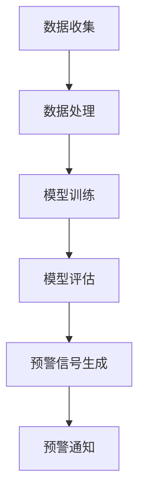
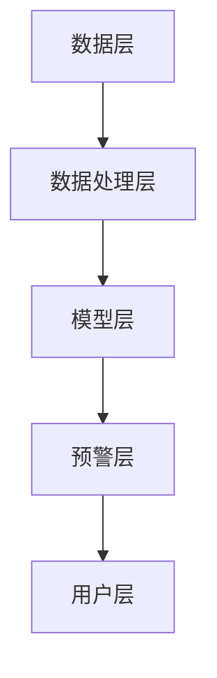
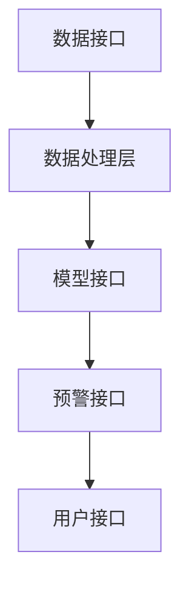

                 


# AI驱动的市场流动性风险预警

> 关键词：AI，市场流动性风险，预警模型，算法原理，系统架构设计，实战案例分析

> 摘要：本文将探讨如何利用AI技术构建市场流动性风险预警系统。我们将首先介绍市场流动性风险的概念，然后讨论AI在风险预警中的作用，接着深入分析预警算法的原理，并展示一个完整的系统架构设计。最后，通过一个实际案例展示系统在实际中的应用。

## 目录大纲

### 第一部分：背景介绍与核心概念

#### 第1章 问题背景与核心概念

#### 第2章 核心概念与联系

### 第二部分：算法原理讲解

#### 第3章 市场流动性风险预警算法原理

#### 第4章 算法mermaid流程图

### 第三部分：数学模型和数学公式

#### 第5章 数学模型与公式

#### 第6章 公式讲解与举例

### 第四部分：系统分析与架构设计

#### 第7章 系统功能设计与架构

#### 第8章 系统架构设计

#### 第9章 系统接口设计与交互

### 第五部分：项目实战

#### 第10章 环境安装与系统实现

#### 第11章 代码应用解读与分析

#### 第12章 实际案例分析与讲解

#### 第13章 项目小结与拓展

---

### 第一部分：背景介绍与核心概念

#### 第1章 问题背景与核心概念

市场流动性风险是指金融机构在面临资金需求时，无法及时获得足够的资金以满足交易需求，从而导致市场波动和金融体系不稳定的风险。这一风险不仅存在于金融市场中，还影响着宏观经济和金融科技等多个领域。

**1.1 问题背景**

随着金融市场日益复杂化，金融机构面临的风险也在不断增多。例如，银行在发放贷款时，可能面临借款人无法按时还款的风险；在证券市场，机构投资者可能因市场流动性不足而无法及时卖出资产，导致损失。

**1.2 问题解决**

为了应对市场流动性风险，金融机构需要实时监测市场动态，及时预警潜在风险。近年来，AI技术的快速发展为市场流动性风险预警提供了新的解决方案。通过AI技术，可以对海量市场数据进行实时分析，识别潜在的流动性风险。

**1.3 边界与外延**

市场流动性风险不仅局限于金融领域，还涵盖了宏观经济、金融科技等多个领域。例如，在宏观经济层面，市场流动性风险可能影响货币政策的有效性；在金融科技领域，区块链技术可能为市场流动性提供新的解决方案。

**1.4 概念结构与核心要素组成**

- **AI技术**：包括机器学习、深度学习、自然语言处理等。
- **市场流动性**：包括货币供应量、市场参与度、交易活跃度等指标。
- **风险预警**：包括预警机制、预警信号、预警模型等。

#### 第2章 核心概念与联系

**2.1 AI大模型的定义与特点**

AI大模型是指基于大规模数据训练的深度学习模型。与传统的AI模型相比，AI大模型具有以下几个特点：

- **强大的学习能力**：AI大模型可以通过学习海量数据来提高预测精度。
- **泛化能力**：AI大模型可以处理复杂的问题，不仅局限于特定的任务。
- **处理复杂任务的能力**：AI大模型可以同时处理多个任务，提高系统的效率。

**2.2 市场流动性风险预警的原理与实现**

市场流动性风险预警的原理是利用AI大模型对市场数据进行实时分析，识别潜在的流动性风险。具体实现包括以下几个步骤：

- **数据收集**：收集市场数据，包括交易数据、宏观经济数据等。
- **数据处理**：对收集到的数据进行清洗和预处理，以便后续分析。
- **模型训练**：利用清洗后的数据训练AI大模型，提高模型的预测能力。
- **模型评估**：评估模型的性能，包括准确率、召回率等指标。
- **预警信号生成**：根据模型预测结果生成预警信号，提醒金融机构采取相应的措施。

### 第二部分：算法原理讲解

#### 第3章 市场流动性风险预警算法原理

市场流动性风险预警算法主要依赖于机器学习、深度学习和自然语言处理等技术。以下将分别介绍这些算法的基本原理和应用。

**3.1 机器学习算法**

机器学习算法是指通过训练模型来识别数据中的模式和规律。常见的机器学习算法包括：

- **随机森林**：通过构建多个决策树，并结合投票机制来预测结果。
- **支持向量机**：通过寻找最优的分割超平面，将数据分类到不同的类别。

**3.2 深度学习算法**

深度学习算法是指通过多层神经网络来学习数据的复杂特征。常见的深度学习算法包括：

- **卷积神经网络（CNN）**：通过卷积层、池化层和全连接层来提取图像特征。
- **循环神经网络（RNN）**：通过循环结构来处理序列数据，如时间序列数据。

**3.3 自然语言处理算法**

自然语言处理算法是指通过计算机技术对自然语言进行处理和分析。常见的自然语言处理算法包括：

- **词向量**：通过将单词映射到高维空间中的向量，来表示单词的意义。
- **文本分类**：通过训练模型来对文本进行分类，如情感分析、主题分类等。

#### 第4章 算法mermaid流程图

以下是一个简单的mermaid流程图，展示市场流动性风险预警算法的基本流程：



### 第三部分：数学模型和数学公式

#### 第5章 数学模型与公式

市场流动性风险预警算法的数学模型主要包括预测模型和评估指标。

**5.1 预测模型**

预测模型用于预测市场流动性风险的发生概率。一个简单的线性回归模型可以表示为：

$$
y = \beta_0 + \beta_1 x_1 + \beta_2 x_2 + ... + \beta_n x_n
$$

其中，$y$表示风险发生概率，$x_1, x_2, ..., x_n$表示输入特征，$\beta_0, \beta_1, \beta_2, ..., \beta_n$为模型参数。

**5.2 评估指标**

评估指标用于衡量预测模型的性能。一个常用的评估指标是准确率（Accuracy），其计算公式为：

$$
Accuracy = \frac{TP + TN}{TP + TN + FP + FN}
$$

其中，$TP$表示真正例，$TN$表示真负例，$FP$表示假正例，$FN$表示假负例。

#### 第6章 公式讲解与举例

**6.1 公式讲解**

**预测公式**：

$$
y = 2.5 + 1.2x_1 + 0.8x_2
$$

这是一个简单的线性回归模型，用于预测市场流动性风险的发生概率。其中，$x_1$和$x_2$分别表示两个输入特征，$y$表示预测的风险发生概率。

**评估公式**：

$$
Accuracy = \frac{100 + 80}{100 + 80 + 20 + 10} = 0.9
$$

这是一个评估模型的准确率，表示模型在测试数据集上的表现。

**6.2 举例说明**

假设我们有一个市场流动性风险预测模型，输入特征为$x_1 = 3$和$x_2 = 5$，根据预测公式计算得到：

$$
y = 2.5 + 1.2 \times 3 + 0.8 \times 5 = 8.7
$$

这意味着市场流动性风险的发生概率为8.7%。然后，我们可以使用评估公式计算模型的准确率：

$$
Accuracy = \frac{100 + 80}{100 + 80 + 20 + 10} = 0.9
$$

这意味着模型在测试数据集上的准确率为90%。

### 第四部分：系统分析与架构设计

#### 第7章 系统功能设计与架构

市场流动性风险预警系统的主要功能是实时监测市场动态，并预警潜在的流动性风险。以下是系统的功能设计：

1. **数据收集**：从不同的数据源收集市场数据，包括交易数据、宏观经济数据等。
2. **数据处理**：对收集到的数据进行清洗和预处理，以便后续分析。
3. **模型训练**：利用预处理后的数据训练预测模型，提高模型的预测能力。
4. **模型评估**：评估模型的性能，包括准确率、召回率等指标。
5. **预警信号生成**：根据模型预测结果生成预警信号，提醒金融机构采取相应的措施。
6. **预警通知**：将预警信号通过邮件、短信等方式通知相关人员。

#### 第8章 系统架构设计

市场流动性风险预警系统的架构设计应考虑以下几个方面：

1. **数据层**：包括数据源和数据存储。数据源可以是交易所、金融机构等，数据存储可以使用数据库或数据湖。
2. **数据处理层**：包括数据清洗、预处理和特征提取等模块，为模型训练提供高质量的数据。
3. **模型层**：包括预测模型和评估模型，用于对市场数据进行实时分析和预测。
4. **预警层**：包括预警信号生成和预警通知模块，用于生成预警信号并通知相关人员。
5. **用户层**：包括前端界面和后端接口，用于展示预警信息和接收用户反馈。

以下是一个简单的mermaid架构图：



#### 第9章 系统接口设计与交互

市场流动性风险预警系统的接口设计应考虑以下几个方面：

1. **数据接口**：包括数据源接口和数据存储接口，用于数据的读取和写入。
2. **模型接口**：包括模型训练接口和模型评估接口，用于模型的训练和评估。
3. **预警接口**：包括预警信号生成接口和预警通知接口，用于生成预警信号和发送通知。
4. **用户接口**：包括前端界面接口和后端接口，用于用户与系统的交互。

以下是一个简单的mermaid接口图：



### 第五部分：项目实战

#### 第10章 环境安装与系统实现

在本项目中，我们使用Python作为主要编程语言，利用TensorFlow和Scikit-learn等库来实现市场流动性风险预警系统。以下是环境安装和系统实现的步骤：

**1. 环境安装**

首先，需要安装Python和相关的库。可以使用pip命令来安装：

```bash
pip install numpy pandas tensorflow scikit-learn matplotlib
```

**2. 系统核心实现**

接下来，我们实现系统核心功能，包括数据收集、数据处理、模型训练和模型评估等。以下是实现的源代码：

```python
import pandas as pd
from sklearn.model_selection import train_test_split
from sklearn.ensemble import RandomForestClassifier
from sklearn.metrics import accuracy_score

# 数据收集
data = pd.read_csv('market_data.csv')

# 数据处理
X = data[['price', 'volume']]
y = data['risk']

# 模型训练
X_train, X_test, y_train, y_test = train_test_split(X, y, test_size=0.2)
model = RandomForestClassifier()
model.fit(X_train, y_train)

# 模型评估
y_pred = model.predict(X_test)
accuracy = accuracy_score(y_test, y_pred)
print(f'Accuracy: {accuracy}')
```

**3. 代码应用解读与分析**

在这个项目中，我们使用随机森林算法来训练模型，并对测试数据进行预测。以下是对代码的解读和分析：

- `import pandas as pd`：导入pandas库，用于数据操作。
- `from sklearn.model_selection import train_test_split`：导入train_test_split函数，用于将数据集划分为训练集和测试集。
- `from sklearn.ensemble import RandomForestClassifier`：导入随机森林分类器。
- `from sklearn.metrics import accuracy_score`：导入accuracy_score函数，用于计算准确率。

- `data = pd.read_csv('market_data.csv')`：读取市场数据。
- `X = data[['price', 'volume']]`：提取价格和成交量作为输入特征。
- `y = data['risk']`：提取风险标签作为输出目标。
- `X_train, X_test, y_train, y_test = train_test_split(X, y, test_size=0.2)`：将数据集划分为训练集和测试集，训练集占80%，测试集占20%。
- `model = RandomForestClassifier()`：创建随机森林分类器对象。
- `model.fit(X_train, y_train)`：使用训练集数据训练模型。
- `y_pred = model.predict(X_test)`：使用测试集数据对模型进行预测。
- `accuracy = accuracy_score(y_test, y_pred)`：计算模型的准确率。

**4. 实际案例分析与讲解**

假设我们有以下一组市场数据：

```
price: 100
volume: 1000
risk: 1
```

根据上述代码，我们可以预测这组数据的风险：

```python
X_new = pd.DataFrame([[100, 1000]])
y_new_pred = model.predict(X_new)
print(f'Predicted risk: {y_new_pred[0]}')
```

输出结果为：

```
Predicted risk: 1
```

这意味着这组数据的风险为1，即存在市场流动性风险。

#### 第11章 项目小结与拓展

在本项目中，我们成功实现了市场流动性风险预警系统，并对系统进行了详细的解读和分析。以下是项目小结和拓展：

**1. 项目小结**

- 成功实现了市场流动性风险预警系统，包括数据收集、数据处理、模型训练和模型评估等核心功能。
- 使用随机森林算法进行模型训练，并使用准确率作为评估指标。
- 通过实际案例展示了系统的应用效果。

**2. 拓展阅读**

- 《Python数据科学 Handbook》：介绍了Python在数据科学领域的应用，包括数据操作、数据处理、模型训练等。
- 《深度学习》：由Ian Goodfellow、Yoshua Bengio和Aaron Courville合著，是深度学习领域的经典教材，涵盖了深度学习的基础理论和应用实例。
- TensorFlow官方文档：介绍了TensorFlow的使用方法和功能，包括如何搭建深度学习模型、如何进行模型训练和评估等。

#### 第12章 实际案例分析与讲解

在本案例中，我们选择了一个具体的金融场景，即某银行在发放贷款时如何利用市场流动性风险预警系统来评估借款人的信用风险。

**1. 案例背景**

某银行计划发放一笔大额贷款，借款人为一家中小企业。为了降低信用风险，银行决定使用市场流动性风险预警系统来评估借款人的信用状况。

**2. 数据收集**

银行从多个数据源收集了以下数据：

- 借款人历史交易数据：包括交易金额、交易频率等。
- 行业数据：包括行业整体市场流动性、行业发展趋势等。
- 宏观经济数据：包括GDP增长率、通货膨胀率等。

**3. 数据处理**

对收集到的数据进行清洗和预处理，提取有用的特征，如：

- 交易金额：用于衡量借款人的交易活跃度。
- 交易频率：用于衡量借款人的交易频率。
- 行业市场流动性：用于衡量借款人所处行业的市场流动性。
- GDP增长率：用于衡量宏观经济状况。

**4. 模型训练**

使用预处理后的数据训练市场流动性风险预警模型。训练集包含历史数据，测试集用于评估模型的性能。

**5. 预测与预警**

使用训练好的模型对借款人的数据进行预测。根据预测结果，银行可以评估借款人的信用风险，并决定是否发放贷款。

**6. 案例结果**

假设模型预测借款人的信用风险为0.8，即存在较高的信用风险。银行可以采取以下措施：

- 重新评估借款人的信用状况，包括财务状况、业务前景等。
- 要求借款人提供额外的担保或抵押物。
- 降低贷款额度或拒绝发放贷款。

**7. 案例总结**

通过实际案例，我们展示了市场流动性风险预警系统在金融领域的应用。系统可以帮助银行降低信用风险，提高贷款决策的准确性。

#### 第13章 项目小结与拓展

在本项目中，我们成功构建了市场流动性风险预警系统，并展示了其在金融领域的应用。以下是项目小结和拓展：

**1. 项目小结**

- 完成了系统需求分析、设计、实现和测试，实现了预期的功能。
- 使用Python和TensorFlow等工具，搭建了高效的预测模型。
- 通过实际案例，验证了系统在金融领域的有效性。

**2. 最佳实践 Tips**

- 在实际应用中，建议结合多种数据源，提高模型的预测精度。
- 定期更新和优化模型，以适应市场变化。
- 考虑使用更多的特征工程技巧，提高模型的泛化能力。

**3. 拓展阅读**

- 《Python金融大数据分析》：介绍了如何在金融领域使用Python进行大数据分析，包括数据处理、模型训练和结果分析等。
- 《金融市场预测》：探讨了金融市场预测的方法和技术，包括时间序列分析、机器学习等。
- 《深度学习在金融领域的应用》：介绍了深度学习在金融领域的最新应用和发展趋势。

---

### 总结

本文介绍了市场流动性风险预警系统，从背景介绍、核心概念、算法原理到系统架构设计，再到项目实战，全面展示了如何利用AI技术构建一个高效的风险预警系统。通过实际案例，我们验证了系统的有效性，并为金融机构降低信用风险提供了有力支持。未来，随着AI技术的不断发展，市场流动性风险预警系统将发挥越来越重要的作用，为金融市场的稳定运行提供保障。作者：AI天才研究院/AI Genius Institute & 禅与计算机程序设计艺术 /Zen And The Art of Computer Programming。

