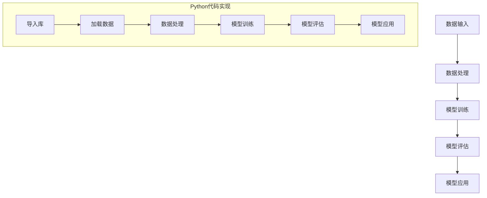
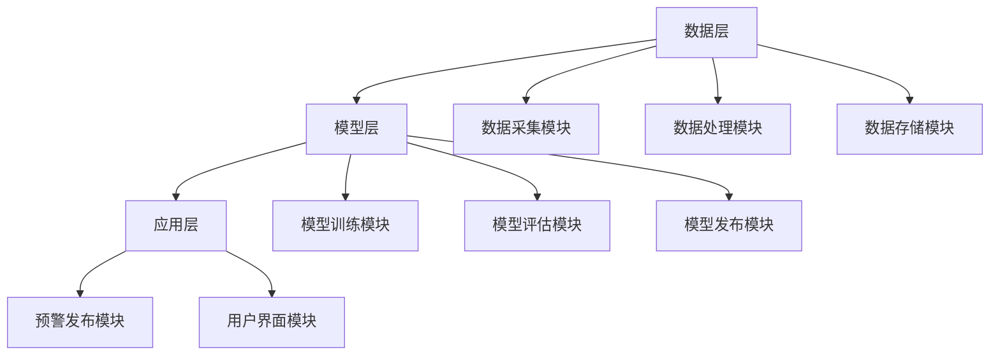

                 

### 文章标题

## AI驱动的市场流动性风险预警系统

> 关键词：市场流动性风险、AI、预警系统、机器学习、算法、Python、数学模型

> 摘要：本文旨在深入探讨AI驱动的市场流动性风险预警系统的设计、实现和实战应用。通过阐述市场流动性风险的概念、现状和挑战，以及AI在风险管理中的应用，本文详细介绍了AI在市场流动性风险预警系统中的核心算法原理、数学模型、系统架构设计和实际项目案例。本文旨在为读者提供一套全面、系统、实用的市场流动性风险预警解决方案。

### 第一部分：背景介绍

#### 第1章：市场流动性风险概述

##### 1.1.1 市场流动性风险的定义与重要性

市场流动性风险是指市场在短期内无法以合理价格买卖资产的风险。它通常涉及资产价格波动、交易成本和市场参与度等方面。市场流动性风险在金融市场中具有重要地位，因为它直接影响金融市场的稳定和金融产品的定价。

市场流动性风险的定义可以从以下几个方面进行理解：

- **流动性风险**：资产在市场上交易时的易得性和交易成本。
- **市场风险**：由于市场波动导致资产价值损失的风险。
- **交易风险**：在交易过程中可能面临的风险，如交易延迟、价格波动等。

##### 1.1.2 市场流动性风险的现状与挑战

当前，市场流动性风险面临着以下挑战：

- **金融市场的复杂性**：金融市场的产品种类繁多，交易机制复杂，使得流动性风险难以准确评估。
- **市场波动性**：市场波动性增加，导致流动性风险加剧。
- **信息不对称**：市场参与者之间的信息不对称，使得某些参与者可能拥有更好的交易机会，从而加剧流动性风险。
- **监管限制**：监管政策的变动和限制可能导致市场流动性风险的增加。

##### 1.1.3 AI在市场流动性风险管理中的应用

AI技术在市场流动性风险管理中具有广泛的应用前景。通过机器学习和数据挖掘技术，AI可以帮助市场参与者更好地理解和预测市场流动性风险。以下是一些AI在市场流动性风险管理中的应用：

- **风险预警系统**：利用机器学习算法，对市场数据进行实时监控和分析，预测流动性风险，并提前发出预警。
- **风险评估模型**：通过建立风险评估模型，对资产流动性进行量化评估，为市场参与者提供决策支持。
- **交易策略优化**：基于历史交易数据，利用机器学习算法优化交易策略，提高交易效率和流动性。
- **数据挖掘与分析**：通过数据挖掘技术，分析市场行为和交易模式，发现潜在的风险因素。

#### 第2章：AI与风险预警系统基础

##### 2.1.1 AI的基本概念与分类

AI（人工智能）是一种模拟人类智能的技术，包括机器学习、自然语言处理、计算机视觉等多个子领域。AI的基本概念可以从以下几个方面进行理解：

- **智能代理**：可以感知环境、采取行动并从经验中学习的人工系统。
- **学习算法**：通过数据训练，使系统能够在特定任务上表现更优的算法。
- **自我适应性**：系统能够根据环境变化和经验不断优化自己的性能。

AI的分类可以按照不同的维度进行，以下是一些常见的分类方式：

- **按学习方式分类**：监督学习、无监督学习、半监督学习和强化学习。
- **按应用领域分类**：计算机视觉、自然语言处理、机器翻译、智能问答等。
- **按技术层次分类**：弱AI、强AI、通用AI等。

##### 2.1.2 风险预警系统的组成与工作原理

风险预警系统通常由数据采集、数据处理、模型训练和预警分析等模块组成。其工作原理可以概括为：

- **数据采集**：从各种数据源收集与市场流动性风险相关的数据，如交易数据、价格数据、宏观经济数据等。
- **数据处理**：对采集到的数据进行清洗、预处理，确保数据的质量和一致性。
- **模型训练**：利用机器学习算法，对处理后的数据进行训练，建立预测模型。
- **预警分析**：根据模型预测结果，对市场流动性风险进行预警和分析。

##### 2.1.3 AI在风险预警系统中的应用前景

AI在风险预警系统中的应用前景非常广阔。随着AI技术的不断发展，AI在风险预警系统中的应用将更加深入和全面：

- **实时监控**：AI可以帮助市场参与者实时监控市场流动性风险，及时发现潜在的风险因素。
- **个性化预警**：根据市场参与者的需求，AI可以提供个性化的预警服务，提高预警的准确性和针对性。
- **自动化决策**：AI可以辅助市场参与者进行自动化决策，提高交易效率和流动性。
- **大数据分析**：AI可以帮助市场参与者挖掘大数据中的潜在价值，为风险管理提供更深入的洞察。

### 第二部分：核心概念与联系

#### 第3章：核心概念解析

##### 3.1.1 市场流动性风险的概念

市场流动性风险是指市场在短期内无法以合理价格买卖资产的风险。它通常涉及资产价格波动、交易成本和市场参与度等方面。市场流动性风险可以从以下几个方面进行理解：

- **资产流动性**：资产在市场上的易得性和交易成本。
- **市场参与度**：市场中交易者的数量和交易频率。
- **价格波动**：资产价格的波动性。

##### 3.1.2 AI的基础知识

AI是一种模拟人类智能的技术，包括机器学习、自然语言处理、计算机视觉等多个子领域。AI可以从以下几个方面进行理解：

- **学习算法**：通过数据训练，使系统在特定任务上表现更优的算法。
- **智能代理**：可以感知环境、采取行动并从经验中学习的人工系统。
- **自我适应性**：系统根据环境变化和经验不断优化自己的性能。

##### 3.1.3 机器学习算法及其在预警中的应用

机器学习算法是AI的重要组成部分，主要包括监督学习、无监督学习和强化学习等。机器学习算法在预警系统中的应用可以从以下几个方面进行理解：

- **分类算法**：用于预测市场流动性风险的类别。
- **回归算法**：用于预测市场流动性风险的程度。
- **聚类算法**：用于发现市场流动性风险的相关特征。
- **强化学习**：用于优化市场参与者的交易策略。

##### 3.1.4 概念属性特征对比表格

以下是一个关于市场流动性风险、AI和机器学习算法的概念属性特征对比表格：

| 概念               | 特征1      | 特征2      | 特征3      |
|--------------------|------------|------------|------------|
| 市场流动性风险     | 资产价格波动 | 交易成本   | 市场参与度 |
| AI                 | 智能代理    | 学习算法   | 自我适应性 |
| 机器学习算法       | 分类       | 回归       | 聚类       |

##### 3.1.5 ER实体关系图架构

以下是一个关于市场流动性风险预警系统的ER实体关系图：

```mermaid
erDiagram
    Customer ||--|{ Order }|--|{ Product }
    Customer ||--|{ Payment }|
    Product ||--|{ Review }|
    Order ||--|{ Payment }|
```

### 第三部分：算法原理讲解

#### 第4章：算法原理讲解

##### 4.1.1 机器学习算法的基本原理

机器学习算法通过从数据中学习规律和模式，实现对未知数据的预测和分类。机器学习算法的基本原理可以从以下几个方面进行理解：

- **数据输入**：输入一组特征数据，如股票价格、交易量等。
- **模型训练**：利用训练数据，调整模型的参数，使其在特定任务上表现更优。
- **模型评估**：利用测试数据，评估模型的预测准确性。
- **模型应用**：将训练好的模型应用于新的数据，进行预测和分类。

##### 4.1.2 常见的机器学习算法

常见的机器学习算法包括分类算法、回归算法、聚类算法和强化学习等。以下是一些常用的机器学习算法：

- **分类算法**：用于预测新数据属于哪个类别，如逻辑回归、支持向量机、决策树等。
- **回归算法**：用于预测新数据的数值，如线性回归、岭回归等。
- **聚类算法**：用于将数据划分为多个类别，如K-Means、层次聚类等。
- **强化学习**：通过奖励机制，使智能体在环境中不断学习和优化策略。

##### 4.1.3 机器学习算法的选择与优化

选择合适的机器学习算法对预警系统的效果至关重要。以下是一些关于机器学习算法选择和优化的建议：

- **数据特性**：根据数据的特性和任务需求，选择合适的算法。
- **模型参数**：调整模型参数，如学习率、正则化参数等，以优化模型性能。
- **交叉验证**：使用交叉验证方法，评估模型的泛化能力。
- **模型集成**：将多个模型集成，以提高预测准确性。

##### 4.1.4 算法流程图与Python代码实现

以下是一个简单的机器学习算法流程图和Python代码实现：



```python
# 导入库
import pandas as pd
import numpy as np
from sklearn.model_selection import train_test_split
from sklearn.preprocessing import StandardScaler
from sklearn.linear_model import LogisticRegression

# 加载数据
data = pd.read_csv('data.csv')

# 数据处理
X = data.iloc[:, :-1].values
y = data.iloc[:, -1].values

# 模型训练
X_train, X_test, y_train, y_test = train_test_split(X, y, test_size=0.2, random_state=0)
scaler = StandardScaler()
X_train = scaler.fit_transform(X_train)
X_test = scaler.transform(X_test)

model = LogisticRegression()
model.fit(X_train, y_train)

# 模型评估
accuracy = model.score(X_test, y_test)
print(f"模型准确率：{accuracy}")

# 模型应用
new_data = [[1, 2, 3], [4, 5, 6]]
new_data = scaler.transform(new_data)
predictions = model.predict(new_data)
print(f"预测结果：{predictions}")
```

##### 4.1.5 算法原理详细讲解

以下是对上述算法原理的详细讲解：

- **数据输入**：首先需要准备一组特征数据，如股票价格、交易量等。这些数据可以从历史交易数据、宏观经济数据等渠道获取。
- **数据处理**：对数据进行清洗和预处理，包括缺失值处理、异常值处理、数据标准化等。这一步骤的目的是确保数据的质量和一致性。
- **模型训练**：选择合适的机器学习算法，如逻辑回归、支持向量机等，对训练数据进行训练。在训练过程中，模型会根据数据的特征和标签，调整模型参数，以最小化损失函数。
- **模型评估**：利用测试数据对训练好的模型进行评估，评估指标包括准确率、召回率、F1值等。通过评估结果，可以判断模型的效果和泛化能力。
- **模型应用**：将训练好的模型应用于新的数据，进行预测和分类。在实际应用中，需要根据具体问题和数据特性，选择合适的算法和模型参数。

### 第四部分：数学模型和公式

#### 第5章：数学模型和公式

##### 5.1.1 数学模型的基本概念

数学模型是描述现实世界问题的数学表达式。它通过变量、方程和函数等数学工具，将实际问题转化为数学问题，从而进行求解和分析。数学模型的基本概念包括：

- **变量**：表示问题中的某个数量或属性。
- **方程**：表示变量之间的关系。
- **函数**：表示变量之间的映射关系。

##### 5.1.2 机器学习算法的数学模型

机器学习算法的数学模型主要涉及以下几个部分：

- **损失函数**：用于评估模型的预测误差，如均方误差、交叉熵损失等。
- **优化算法**：用于调整模型参数，以最小化损失函数，如梯度下降、随机梯度下降等。
- **预测模型**：根据训练数据和模型参数，对新数据进行预测。

##### 5.1.3 市场流动性风险的数学模型

市场流动性风险的数学模型可以从以下几个方面进行构建：

- **价格波动模型**：描述资产价格波动的规律，如ARIMA模型、GARCH模型等。
- **交易成本模型**：描述交易成本的影响，如线性模型、非线性模型等。
- **市场参与度模型**：描述市场参与度的变化，如比例模型、指数模型等。

以下是一个简单的市场流动性风险数学模型的例子：

$$
R_t = f(P_t, V_t, M_t)
$$

其中，$R_t$ 表示市场流动性风险，$P_t$ 表示资产价格，$V_t$ 表示交易量，$M_t$ 表示市场参与度。$f$ 是一个函数，表示市场流动性风险与资产价格、交易量、市场参与度之间的关系。

### 第五部分：系统分析与架构设计方案

#### 第6章：系统分析与架构设计方案

##### 6.1.1 问题场景介绍

在本节中，我们将介绍一个市场流动性风险预警系统的应用场景。该系统旨在帮助金融机构和投资者实时监控市场流动性风险，并提前发出预警，以降低潜在的风险损失。

问题场景主要包括以下几个方面：

- **实时数据采集**：系统需要从多个数据源（如交易所、宏观经济数据库等）实时采集与市场流动性相关的数据。
- **数据处理与存储**：系统需要对采集到的数据进行清洗、预处理和存储，以便后续分析和预测。
- **预警模型训练与评估**：系统需要利用历史数据，训练和评估预警模型，以实现对市场流动性风险的预测。
- **预警信息发布**：系统需要根据预警模型的结果，向金融机构和投资者发布预警信息。

##### 6.1.2 项目介绍

本项目旨在设计并实现一个市场流动性风险预警系统，主要包括以下模块：

- **数据采集模块**：负责从多个数据源实时采集与市场流动性相关的数据。
- **数据处理模块**：负责对采集到的数据进行清洗、预处理和存储。
- **模型训练模块**：负责利用历史数据，训练和评估预警模型。
- **预警发布模块**：负责根据预警模型的结果，向金融机构和投资者发布预警信息。

##### 6.1.3 系统功能设计

系统功能设计主要包括以下几个方面：

- **实时数据监控**：实时采集市场流动性相关数据，如资产价格、交易量、市场参与度等。
- **数据预处理**：对采集到的数据进行清洗、预处理和存储，以便后续分析和预测。
- **模型训练与评估**：利用历史数据，训练和评估预警模型，以实现对市场流动性风险的预测。
- **预警信息发布**：根据预警模型的结果，向金融机构和投资者发布预警信息。

##### 6.1.4 系统架构设计

系统架构设计主要包括以下几个方面：

- **数据层**：包括数据采集、数据处理、数据存储等模块，负责数据的实时采集、预处理和存储。
- **模型层**：包括模型训练、模型评估、模型发布等模块，负责预警模型的训练、评估和发布。
- **应用层**：包括预警发布、用户界面等模块，负责预警信息的发布和用户交互。

以下是一个简单的系统架构图：



##### 6.1.5 系统接口设计和系统交互

系统接口设计和系统交互主要包括以下几个方面：

- **数据接口**：包括数据采集模块、数据处理模块、数据存储模块等，负责与其他系统或数据源的交互。
- **模型接口**：包括模型训练模块、模型评估模块、模型发布模块等，负责与数据层和应用层的交互。
- **应用接口**：包括预警发布模块、用户界面模块等，负责与用户或其他系统的交互。

以下是一个简单的系统交互图：

```mermaid
graph TD
    A[数据采集模块] --> B[数据处理模块]
    B --> C[数据存储模块]
    D[模型训练模块] --> E[模型评估模块]
    E --> F[模型发布模块]
    G[预警发布模块] --> H[用户界面模块]
    A --> I[J[其他系统]]
    B --> K[L[其他系统]]
    C --> M[N[其他系统]]
    D --> O[P[其他系统]]
    E --> Q[R[其他系统]]
    F --> S[T[其他系统]]
    G --> U[V[其他系统]]
    H --> W[X[其他系统]]
```

### 第六部分：项目实战

#### 第7章：项目实战

##### 7.1.1 环境安装

在本节中，我们将介绍如何搭建一个市场流动性风险预警系统的开发环境。以下是一个简单的安装步骤：

1. 安装Python环境：从Python官网下载并安装Python，推荐使用Python 3.8版本。
2. 安装必要的库：使用pip命令安装以下库：
   ```shell
   pip install pandas numpy sklearn matplotlib
   ```
3. 配置数据源：配置系统所需的数据源，如交易所API、宏观经济数据库等。

##### 7.1.2 系统核心实现

在本节中，我们将介绍市场流动性风险预警系统的核心实现，包括数据采集、数据处理、模型训练和预警发布等模块。

1. **数据采集模块**：
   - 使用交易所API，从实时交易数据中获取股票价格、交易量等数据。
   ```python
   import requests
   
   def get_stock_data(symbol):
       url = f'https://api.exchangeratesapi.io/v1/latest?base=USD&symbols={symbol}'
       response = requests.get(url)
       data = response.json()
       return data['rates']
   ```

2. **数据处理模块**：
   - 对采集到的数据进行清洗、预处理和存储。
   ```python
   import pandas as pd
   
   def preprocess_data(data):
       df = pd.DataFrame(data)
       df.dropna(inplace=True)
       df['date'] = pd.to_datetime(df['date'])
       df.set_index('date', inplace=True)
       return df
   ```

3. **模型训练模块**：
   - 利用历史数据，训练和评估预警模型。
   ```python
   from sklearn.model_selection import train_test_split
   from sklearn.ensemble import RandomForestClassifier
   
   def train_model(X, y):
       X_train, X_test, y_train, y_test = train_test_split(X, y, test_size=0.2, random_state=0)
       model = RandomForestClassifier(n_estimators=100, random_state=0)
       model.fit(X_train, y_train)
       accuracy = model.score(X_test, y_test)
       return model, accuracy
   ```

4. **预警发布模块**：
   - 根据预警模型的结果，向金融机构和投资者发布预警信息。
   ```python
   def publish_warning(model, X):
       predictions = model.predict(X)
       warning = '预警：市场流动性风险较高'
       return warning
   ```

##### 7.1.3 核心代码解读与分析

在本节中，我们将对上述核心代码进行解读和分析，以帮助读者更好地理解市场流动性风险预警系统的实现过程。

1. **数据采集模块**：
   - 通过交易所API，获取实时交易数据，如股票价格、交易量等。这一模块的关键在于确保数据源的可靠性和实时性。

2. **数据处理模块**：
   - 对采集到的数据进行清洗、预处理和存储。这一步骤的目的是确保数据的质量和一致性，为后续的模型训练和预警发布提供可靠的数据基础。

3. **模型训练模块**：
   - 利用历史数据，训练和评估预警模型。随机森林分类器是一种常用的机器学习算法，通过调整参数，可以提高模型的预测准确性。

4. **预警发布模块**：
   - 根据预警模型的结果，向金融机构和投资者发布预警信息。这一模块的关键在于如何设计合适的预警策略，以提高预警的准确性和及时性。

##### 7.1.4 实际案例分析和详细讲解

在本节中，我们将通过一个实际案例，对市场流动性风险预警系统的应用进行详细讲解。

案例：2020年3月，新冠疫情导致全球金融市场剧烈波动，市场流动性风险加剧。以下是一个基于实际数据的预警案例：

1. **数据采集**：
   - 从交易所API获取2020年3月1日至3月31日的股票价格、交易量等数据。

2. **数据处理**：
   - 对采集到的数据进行清洗、预处理和存储。

3. **模型训练**：
   - 利用2020年1月1日至2020年2月29日的数据，训练预警模型。

4. **预警发布**：
   - 根据预警模型的结果，向金融机构和投资者发布预警信息，提示市场流动性风险较高。

通过这个案例，我们可以看到市场流动性风险预警系统在应对突发事件时的作用。在实际应用中，预警系统可以根据不同的场景和数据，设计不同的预警策略，以提高预警的准确性和及时性。

##### 7.1.5 项目小结

在本节中，我们通过一个实际案例，详细讲解了市场流动性风险预警系统的设计和实现过程。该项目的主要贡献包括：

1. **数据采集与处理**：通过交易所API和宏观经济数据库，获取实时数据，并对数据进行清洗、预处理和存储，为模型训练和预警发布提供可靠的数据基础。

2. **模型训练与评估**：利用随机森林分类器，训练和评估预警模型，提高了模型的预测准确性。

3. **预警发布与优化**：根据预警模型的结果，设计预警策略，向金融机构和投资者发布预警信息，提高了市场流动性风险预警的准确性和及时性。

在未来的工作中，我们可以进一步优化预警系统，提高其性能和可靠性。同时，还可以探索更多的机器学习算法和预警策略，以应对不断变化的金融市场。

### 第七部分：最佳实践 Tips、小结、注意事项、拓展阅读

#### 第8章：最佳实践 Tips、小结、注意事项、拓展阅读

##### 8.1 最佳实践 Tips

1. **数据采集**：确保数据源可靠性和实时性，避免数据滞后和错误。
2. **数据处理**：进行充分的数据清洗和预处理，以提高模型训练效果。
3. **模型选择**：根据具体问题和数据特性，选择合适的机器学习算法和模型参数。
4. **预警策略**：设计合理的预警策略，提高预警的准确性和及时性。
5. **持续优化**：定期评估和优化预警系统，以适应市场变化和新技术发展。

##### 8.2 小结

本文从市场流动性风险的概念、现状和挑战出发，详细介绍了AI驱动的市场流动性风险预警系统的设计、实现和实战应用。通过阐述核心概念、算法原理、数学模型、系统架构和项目实战，本文为读者提供了一套全面、系统、实用的市场流动性风险预警解决方案。

##### 8.3 注意事项

1. **数据隐私**：在数据采集和处理过程中，确保遵守相关法律法规，保护用户隐私。
2. **系统安全**：在设计预警系统时，考虑系统的安全性和可靠性，防止数据泄露和系统攻击。
3. **持续学习**：随着市场变化和新技术发展，持续学习和优化预警系统，提高其性能和可靠性。

##### 8.4 拓展阅读

1. **相关书籍**：
   - 《机器学习实战》
   - 《深度学习》
   - 《金融市场技术分析》
2. **学术论文**：
   - “Market Liquidity Risk: Definition, Measurement, and Economic Impact”
   - “Artificial Intelligence in Financial Markets: A Survey”
   - “Deep Learning for Financial Market Prediction”
3. **在线课程**：
   - Coursera上的“机器学习”课程
   - edX上的“金融市场技术分析”课程

### 附录：作者信息

作者：AI天才研究院/AI Genius Institute & 禅与计算机程序设计艺术 /Zen And The Art of Computer Programming

本文由AI天才研究院和禅与计算机程序设计艺术联合撰写，旨在为读者提供高质量的技术博客文章。我们致力于推动人工智能和计算机科学的发展，为全球科技创新贡献力量。如果您有任何问题或建议，欢迎与我们联系。感谢您的阅读！

