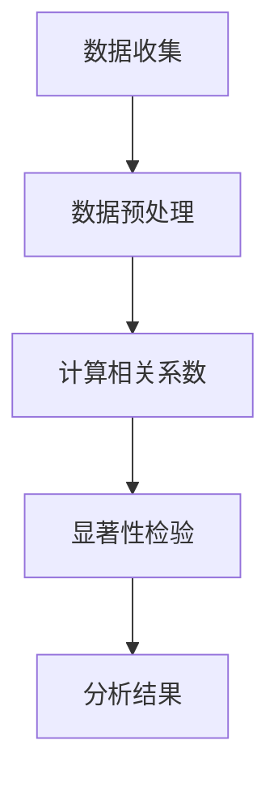
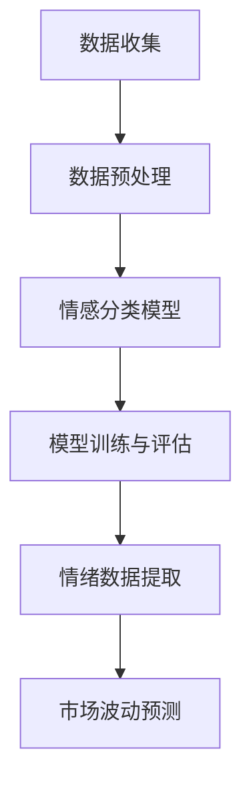
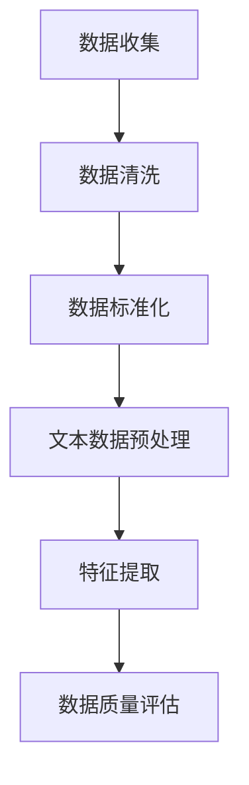
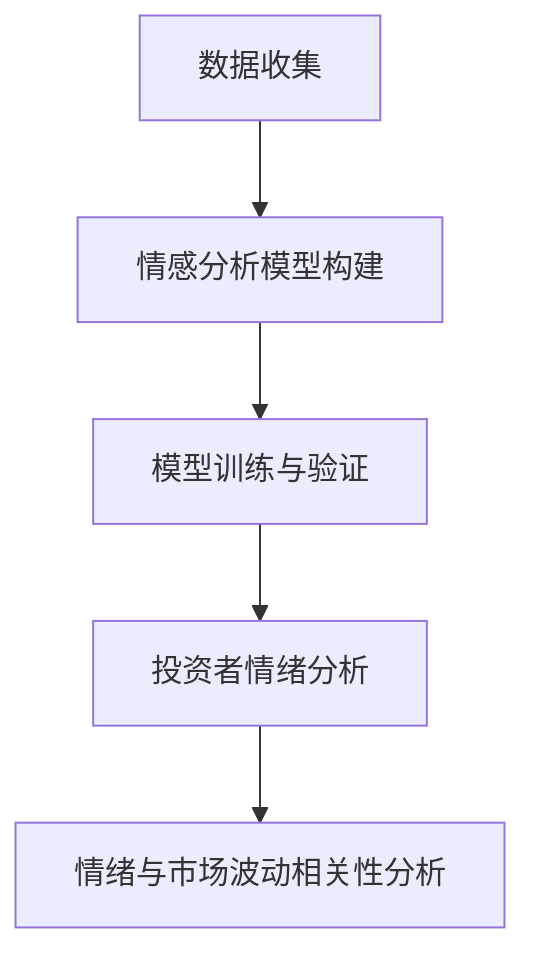
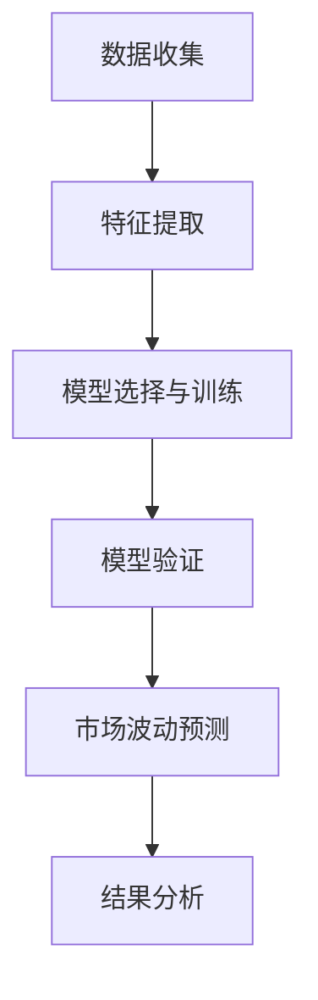
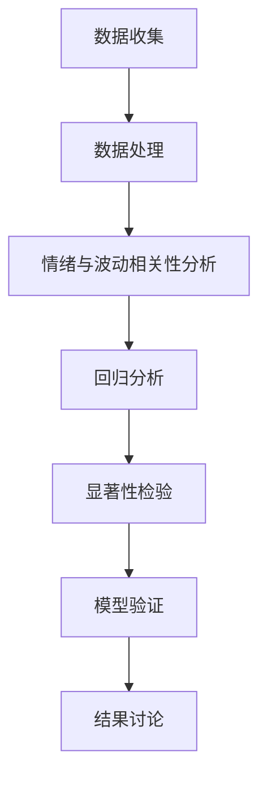
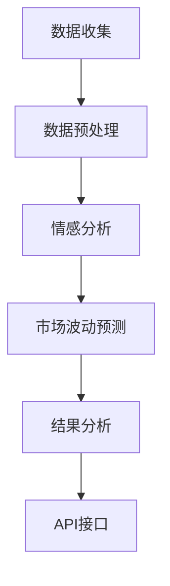

                 

### 第一部分：引言

#### 1.1 问题背景与重要性

##### 1.1.1 投资者情绪的定义与作用

投资者情绪是指投资者对市场状况的主观感知和心理状态。它涵盖了投资者对市场前景的乐观或悲观态度，以及他们对市场波动、投资风险和回报的预期。投资者情绪对金融市场有着深远的影响，它是市场参与者的心理和行为的直接反映，因此对市场波动具有重要作用。

投资者情绪可以通过多种方式影响市场。首先，乐观的情绪往往会推动市场价格上升，因为投资者愿意支付更高的价格购买资产，从而推高价格。相反，悲观情绪可能导致价格下跌，因为投资者更倾向于卖出资产以规避潜在的损失。其次，投资者情绪可以影响市场的流动性和交易量。在乐观情绪下，市场流动性通常会提高，因为更多的投资者愿意参与交易。而在悲观情绪中，交易量可能会下降，导致市场流动性减弱。

##### 1.1.2 市场波动的定义与影响

市场波动是指金融市场中资产价格或指数的剧烈变动。这种波动可以是短暂的，也可以是长期的。市场波动通常由多种因素引起，包括宏观经济事件、政策变动、公司业绩、市场流动性、投资者情绪等。

市场波动对投资者和金融市场有着显著的影响。对于投资者而言，波动性意味着更高的投资风险，因为价格的不确定性增加了投资的不稳定性。然而，波动性也为投资者提供了更多的投资机会。高波动性市场通常伴随着更高的潜在回报，但也伴随着更高的潜在损失。

对于金融市场，市场波动会影响市场的稳定性和可预测性。剧烈的市场波动可能会导致市场崩溃或过度反应，影响金融市场的健康运行。此外，市场波动还会影响金融监管机构和政策制定者的决策，因为他们需要评估市场波动对整个经济系统的影响。

##### 1.1.3 AI在金融领域的应用前景

人工智能（AI）技术在过去几年中取得了显著的进展，并在金融领域展现了巨大的应用潜力。AI在金融领域的应用主要包括以下几个方面：

1. **风险管理**：AI可以分析大量的市场数据和交易行为，帮助金融机构识别潜在的风险，并制定相应的风险管理策略。
2. **算法交易**：基于AI的算法交易系统可以通过对市场数据的实时分析，自动执行交易策略，以实现更高的交易效率和收益。
3. **投资组合优化**：AI可以帮助投资者分析市场趋势，优化投资组合，以实现更高的收益和风险平衡。
4. **情感分析**：AI可以分析社交媒体、新闻报道等文本数据，评估投资者情绪，从而预测市场波动。
5. **信用评分**：AI可以分析个人信息和交易行为，更准确地评估信用风险，为金融机构提供更可靠的信用评分。

随着AI技术的不断进步，其应用前景将进一步扩大。例如，AI可以在更短的时间内处理更多的数据，提高预测的准确性；AI还可以通过深度学习等技术，不断优化模型，提高预测的稳定性。

综上所述，投资者情绪和市场波动是金融市场中至关重要的概念。AI技术的引入为分析和预测这些现象提供了新的工具和方法。本篇文章将深入探讨AI如何驱动投资者情绪与市场波动的关系，提供理论分析和实际应用案例，以期为金融从业者、研究人员和投资者提供有益的参考。

#### 1.2 研究目标与方法

##### 1.2.1 研究目标

本研究的主要目标是探讨人工智能（AI）在分析投资者情绪与市场波动关系中的应用，具体包括以下三个方面：

1. **理解投资者情绪的测量与影响因素**：分析投资者情绪的定义、测量方法及其对市场波动的影响机制。
2. **评估AI在投资者情绪分析中的有效性**：探讨AI技术在情感分析中的应用，评估其在测量投资者情绪方面的准确性和效率。
3. **构建基于AI的市场波动预测模型**：结合AI技术和市场数据，构建预测市场波动的模型，并评估其预测效果。

##### 1.2.2 研究方法

本研究采用混合研究方法，结合定量分析和定性分析，以全面探讨AI在投资者情绪与市场波动关系中的应用。具体方法如下：

1. **文献综述**：通过文献综述，梳理AI在金融领域，尤其是投资者情绪分析和市场波动预测方面的研究现状和发展趋势。
2. **数据收集**：收集与投资者情绪和市场波动相关的数据，包括市场交易数据、新闻报道、社交媒体文本等。
3. **情感分析模型构建**：使用自然语言处理（NLP）技术，构建情感分析模型，对文本数据进行情感分类和分析。
4. **市场波动预测模型构建**：结合时间序列分析和机器学习技术，构建市场波动预测模型，并利用历史数据进行模型训练和验证。
5. **实证分析**：通过实证分析，验证AI在投资者情绪分析和市场波动预测中的有效性，并评估模型的预测性能。
6. **案例研究**：选取具有代表性的金融案例，深入分析AI在投资者情绪与市场波动关系中的实际应用效果。

##### 1.2.3 数据来源与处理

本研究的数据来源主要包括以下几个方面：

1. **市场交易数据**：从金融数据服务商如Yahoo Finance、Google Finance等获取历史市场交易数据，包括股票、债券、期货等。
2. **新闻报道**：通过新闻数据库如Factiva、Bloomberg News等获取与金融市场相关的新闻报道，涵盖宏观经济事件、公司动态、政策变动等。
3. **社交媒体数据**：从社交媒体平台如Twitter、Reddit等获取投资者发表的评论和讨论，分析投资者情绪。

在数据收集后，将进行以下数据处理步骤：

1. **数据清洗**：去除重复、无关的数据，处理缺失值和异常值，确保数据的准确性和完整性。
2. **数据预处理**：包括文本数据的分词、去停用词、词性标注等，为后续的情感分析模型构建做准备。
3. **特征提取**：从市场交易数据中提取时间序列特征，如开盘价、收盘价、成交量等；从文本数据中提取情感特征，如正面、负面情绪的分布情况。
4. **数据标准化**：对数据进行归一化或标准化处理，使其适合模型训练和预测。

通过上述方法，本研究将深入探讨AI在投资者情绪与市场波动关系中的具体应用，旨在为金融市场的分析和预测提供新的视角和方法。

#### 1.3 本书结构安排

##### 1.3.1 全书概述

本书主要分为五个部分，系统性地探讨了AI在投资者情绪与市场波动关系分析中的应用。具体结构如下：

1. **第一部分：引言**：介绍研究背景与重要性，明确研究目标和研究方法，为后续内容奠定基础。
2. **第二部分：AI基础理论**：介绍AI的基本概念、情感分析、市场波动预测及AI在金融领域的应用案例。
3. **第三部分：投资者情绪与市场波动关系分析**：探讨投资者情绪对市场波动的影响，分析AI在投资者情绪分析中的应用，构建基于AI的市场波动预测模型。
4. **第四部分：实证分析**：通过实际数据验证AI在投资者情绪与市场波动关系分析中的有效性，讨论结果和未来研究方向。
5. **第五部分：AI驱动的投资者情绪与市场波动关系实践**：通过实践案例分析，探讨AI在投资者情绪与市场波动关系研究中的挑战与解决策略。

##### 1.3.2 各章节内容介绍

以下是各章节的具体内容介绍：

1. **第一部分：引言**
   - 1.1 问题背景与重要性
   - 1.2 研究目标与方法
   - 1.3 本书结构安排
   - 1.4 本书读者对象与预期收益

2. **第二部分：AI基础理论**
   - 2.1 AI概述
   - 2.2 情感分析
   - 2.3 市场波动预测
   - 2.4 AI在金融领域的应用案例
   - 2.5 本章小结

3. **第三部分：投资者情绪与市场波动关系分析**
   - 3.1 投资者情绪对市场波动的影响
   - 3.2 AI在投资者情绪分析中的应用
   - 3.3 基于AI的市场波动预测模型
   - 3.4 AI在投资者情绪与市场波动关系研究中的应用
   - 3.5 本章小结

4. **第四部分：实证分析**
   - 4.1 数据收集与预处理
   - 4.2 实证分析过程
   - 4.3 结果分析与讨论
   - 4.4 本章小结

5. **第五部分：AI驱动的投资者情绪与市场波动关系实践**
   - 5.1 实践案例分析
   - 5.2 实践中的挑战与解决策略
   - 5.3 本章小结

通过上述各章节的详细阐述，本书旨在为读者提供全面、系统的AI在投资者情绪与市场波动关系分析的理论和实践指导。

##### 1.4 本书读者对象与预期收益

本书主要面向以下几类读者：

1. **金融领域从业者**：包括投资分析师、基金经理、交易员等，他们需要掌握AI在金融市场分析中的应用，以提升投资决策的准确性和效率。
2. **研究人员与学者**：特别是那些对AI和金融交叉领域感兴趣的学者，他们可以通过本书了解最新的研究成果和方法，为自身的研究提供参考。
3. **金融技术爱好者**：对AI和金融科技感兴趣的爱好者，希望通过本书学习AI在金融市场中的实际应用。

通过阅读本书，读者可以预期获得以下收益：

1. **深入理解AI在金融领域的应用**：了解AI技术在金融市场分析中的关键作用，掌握投资者情绪与市场波动分析的方法和模型。
2. **提升金融分析能力**：通过实践案例分析，读者可以学习如何运用AI技术进行实际的投资分析和决策。
3. **拓展研究视野**：了解AI与金融领域的前沿研究动态，为自身的研究提供新的方向和灵感。

总之，本书旨在为读者提供全面的AI驱动的投资者情绪与市场波动关系分析知识，帮助他们更好地应对金融市场的复杂性和变化。

#### 1.5 小结

本部分内容概述了投资者情绪与市场波动关系的重要性，介绍了AI在金融领域的应用前景，明确了研究目标和研究方法，并对本书的结构安排进行了详细阐述。通过本部分的介绍，读者可以全面了解本文的主题和研究内容，为后续章节的深入探讨打下基础。

### 第二部分：AI基础理论

在本部分中，我们将深入探讨人工智能（AI）的基础理论，重点介绍AI的基本概念、情感分析、市场波动预测及AI在金融领域的应用案例。通过这一部分的讲解，我们将为后续的投资者情绪与市场波动关系分析提供坚实的理论基础。

#### 2.1 AI概述

##### 2.1.1 AI的定义与发展历程

人工智能（Artificial Intelligence，简称AI）是指通过计算机模拟人类智能行为的一种技术。它涉及到多个学科领域，包括计算机科学、数学、统计学、认知科学和心理学等。AI的目标是使计算机系统能够自主地完成一些通常需要人类智能才能完成的任务，例如视觉识别、语言理解、决策制定等。

AI的发展历程可以分为以下几个阶段：

1. **早期探索（1950-1969年）**：在这个阶段，AI的概念被首次提出，人工智能研究主要集中在规则推理和逻辑推理上。
2. **泡沫时期（1970-1980年）**：由于技术限制和实际应用的匮乏，AI研究进入了一个相对低潮的时期，被称为“AI寒冬”。
3. **复兴与突破（1980-2010年）**：随着计算机性能的提升和算法的进步，AI研究重新获得了关注，尤其是在机器学习和神经网络领域取得了显著进展。
4. **快速发展时期（2010年至今）**：大数据、云计算和深度学习等技术的突破，使得AI在多个领域取得了实质性进展，应用范围不断扩大。

##### 2.1.2 AI的核心技术

AI的核心技术包括以下几个方面：

1. **机器学习（Machine Learning）**：机器学习是一种通过数据训练模型，使其能够对未知数据进行预测或分类的方法。它主要分为监督学习、无监督学习和强化学习三种类型。
   - **监督学习**：通过已知输入和输出数据训练模型，如线性回归、决策树和神经网络等。
   - **无监督学习**：没有明确的目标变量，通过发现数据中的内在结构来训练模型，如聚类分析和主成分分析等。
   - **强化学习**：通过与环境的交互来学习策略，以实现最大化累积奖励，如Q学习和深度Q网络（DQN）等。

2. **深度学习（Deep Learning）**：深度学习是机器学习的一个分支，它使用多层神经网络来提取数据的层次特征。深度学习在图像识别、语音识别和自然语言处理等领域表现出色，其代表性算法包括卷积神经网络（CNN）、循环神经网络（RNN）和生成对抗网络（GAN）等。

3. **自然语言处理（Natural Language Processing，简称NLP）**：NLP是AI的一个重要分支，旨在使计算机能够理解和生成人类语言。NLP的核心技术包括词嵌入、句法分析和语义理解等。

4. **计算机视觉（Computer Vision）**：计算机视觉是AI在图像和视频处理领域的应用，其目标是从图像或视频中提取有用的信息。核心技术包括图像识别、目标检测和图像分割等。

##### 2.1.3 AI的应用领域

AI技术已经在多个领域取得了显著的应用成果，以下是一些主要的AI应用领域：

1. **医疗健康**：AI在医疗健康领域的应用包括疾病诊断、药物研发、健康监测和医疗管理等方面。例如，通过深度学习技术可以自动识别医学图像，辅助医生进行诊断。
2. **自动驾驶**：自动驾驶技术依赖于计算机视觉、传感器数据和机器学习算法，其目标是实现无人驾驶汽车的自主行驶。
3. **金融科技**：AI在金融科技领域的应用包括风险管理、算法交易、投资组合优化和信用评分等。例如，通过情感分析技术可以评估投资者的情绪，预测市场波动。
4. **智能家居**：智能家居设备通过AI技术实现自动化和智能化的功能，如智能音响、智能灯光和智能家电等。
5. **智能制造**：AI技术在智能制造领域用于优化生产流程、提高生产效率和质量控制等方面，如机器视觉检测、自动化装配和智能仓储等。

#### 2.2 情感分析

##### 2.2.1 情感分析的定义与原理

情感分析（Sentiment Analysis）是一种自然语言处理（NLP）技术，用于评估文本数据中表达的情感倾向。情感分析的目标是识别文本中的情感极性（如正面、负面、中性）以及情感强度。

情感分析的基本原理包括以下几个步骤：

1. **文本预处理**：包括去除停用词、标点符号、词干提取和词性标注等，以便于后续的情感分析。
2. **特征提取**：从预处理后的文本中提取有助于情感分析的特征，如词频、词嵌入和句子结构等。
3. **情感分类**：使用分类算法（如朴素贝叶斯、支持向量机、深度学习等）对文本进行情感分类。

##### 2.2.2 情感分析的分类与方法

情感分析可以按以下几种方式进行分类：

1. **基于规则的方法**：通过定义一系列规则来识别文本中的情感极性。这种方法通常简单但效率较低。
2. **基于统计的方法**：使用统计模型（如朴素贝叶斯、逻辑回归等）来预测文本的情感极性。这种方法依赖于大量的训练数据和特征提取技术。
3. **基于深度学习的方法**：使用神经网络（如卷积神经网络、循环神经网络、Transformer等）来提取文本的深层特征，并实现情感分类。这种方法在大量数据集上表现出较高的准确性和泛化能力。

##### 2.2.3 情感分析的应用场景

情感分析在多个领域有着广泛的应用，以下是一些典型的应用场景：

1. **市场研究**：通过分析社交媒体和新闻报道中的情感倾向，了解消费者对产品或品牌的看法，为企业提供市场策略的参考。
2. **客户服务**：通过情感分析技术，自动识别客户反馈中的情感倾向，提供个性化的客户服务和建议。
3. **金融分析**：通过分析投资者评论和新闻报道，预测市场情绪，为投资决策提供支持。
4. **社交媒体监控**：实时监控社交媒体平台上的情感动态，帮助品牌和企业了解公众对其产品和服务的情感反应。
5. **情感诊断**：在医疗健康领域，通过分析患者的文本记录，辅助医生进行情感诊断和心理评估。

#### 2.3 市场波动预测

##### 2.3.1 市场波动预测的重要性

市场波动预测在金融市场中具有非常重要的意义。准确预测市场波动可以帮助投资者做出更明智的投资决策，降低风险，提高收益。同时，对于金融机构和监管机构来说，了解市场波动趋势也有助于制定更有效的风险管理和政策制定策略。

##### 2.3.2 市场波动预测的方法

市场波动预测的方法主要包括以下几种：

1. **传统统计方法**：如时间序列分析、自回归模型（AR）、移动平均模型（MA）和自回归移动平均模型（ARMA）等。这些方法通过分析历史数据，寻找时间序列中的趋势和周期性变化，预测未来的市场波动。
2. **机器学习方法**：如随机森林、支持向量机（SVM）、神经网络等。这些方法通过训练大量历史数据，学习数据中的复杂模式，实现对市场波动的预测。
3. **深度学习方法**：如卷积神经网络（CNN）、循环神经网络（RNN）、长短时记忆网络（LSTM）和Transformer等。深度学习方法能够提取数据中的深层特征，实现更准确的预测。

##### 2.3.3 市场波动预测的应用

市场波动预测在金融市场中有着广泛的应用，以下是一些典型的应用场景：

1. **投资决策**：投资者可以通过对市场波动的预测，调整投资组合，降低风险，提高收益。
2. **风险管理**：金融机构可以利用市场波动预测，评估投资风险，制定相应的风险管理策略。
3. **政策制定**：监管机构和政策制定者可以通过对市场波动的预测，了解市场发展趋势，制定更有效的宏观经济政策。
4. **市场监控**：实时监控市场波动，及时发现异常情况，为市场干预提供支持。

#### 2.4 AI在金融领域的应用案例

##### 2.4.1 AI在风险控制中的应用

AI在风险控制中的应用主要包括以下几个方面：

1. **欺诈检测**：利用机器学习和深度学习技术，通过分析交易数据和行为模式，识别潜在的欺诈行为。
2. **信用评分**：通过分析个人信用信息和交易行为，使用AI技术评估信用风险，提高信用评分的准确性。
3. **市场风险控制**：利用时间序列分析和机器学习技术，预测市场波动，为风险控制提供支持。

##### 2.4.2 AI在量化交易中的应用

AI在量化交易中的应用主要包括以下几个方面：

1. **交易策略开发**：利用机器学习和深度学习技术，分析历史交易数据和市场趋势，开发高效的交易策略。
2. **风险建模**：通过预测市场波动和资产价格变化，评估交易策略的风险，制定风险控制策略。
3. **交易执行**：利用自动化交易系统，通过实时数据分析和预测，自动执行交易策略，提高交易效率。

##### 2.4.3 AI在资产管理中的应用

AI在资产管理中的应用主要包括以下几个方面：

1. **投资组合优化**：利用机器学习和深度学习技术，分析市场数据和历史交易记录，优化投资组合，提高收益和风险平衡。
2. **资产定价**：通过分析市场数据和经济指标，使用AI技术进行资产定价，为投资决策提供支持。
3. **风险预测**：利用时间序列分析和机器学习技术，预测市场风险和资产价格波动，制定相应的风险控制策略。

#### 2.5 本章小结

在本部分中，我们介绍了人工智能的基本概念、情感分析、市场波动预测及AI在金融领域的应用案例。通过对这些基础理论的深入探讨，我们为后续的投资者情绪与市场波动关系分析提供了坚实的理论基础。在接下来的章节中，我们将进一步探讨AI在投资者情绪分析中的应用，并构建基于AI的市场波动预测模型。

### 第三部分：投资者情绪与市场波动关系分析

#### 3.1 投资者情绪对市场波动的影响

投资者情绪对市场波动具有深远的影响。首先，让我们定义投资者情绪，并探讨其如何影响市场波动。

##### 3.1.1 投资者情绪的定义与测量

投资者情绪是指投资者对市场前景的主观感知和心理状态。它反映了投资者对市场风险的评估和对潜在回报的期望。投资者情绪可以通过多种方式测量，包括直接调查、市场指标和文本分析。

- **直接调查**：通过问卷调查和访谈等方式直接收集投资者的情绪数据。这种方法可以提供详细的主观情绪信息，但受限于样本量和数据的时效性。
- **市场指标**：使用市场交易数据、波动率和投资者行为等指标来间接测量情绪。例如，投资者情绪可以通过股票的平均价格波动率、交易量等指标来衡量。
- **文本分析**：通过自然语言处理（NLP）技术，分析社交媒体、新闻报道和投资者评论中的文本数据，评估情绪倾向。这种方法能够处理大量数据，但需要高精度的情感分析模型。

##### 3.1.2 投资者情绪对市场波动的影响机制

投资者情绪通过以下几种机制影响市场波动：

1. **市场反应过度**：在乐观情绪下，投资者可能会对市场的好消息反应过度，导致股价迅速上涨，超过其基本价值的支持。相反，在悲观情绪下，投资者可能会对坏消息反应过度，导致股价迅速下跌，低于其基本价值的支持。

2. **交易行为变化**：乐观情绪可能导致更多的投资者进入市场，增加交易量，提高市场流动性。而在悲观情绪中，投资者可能会减少交易，降低市场流动性，增加价格的不稳定性。

3. **投资决策变化**：投资者情绪可以影响投资决策，导致市场结构的变化。例如，在乐观情绪下，投资者可能会更倾向于购买高风险资产，而在悲观情绪下，投资者可能会更倾向于购买低风险资产。

##### 3.1.3 投资者情绪与市场波动的相关性分析

为了探讨投资者情绪与市场波动之间的关系，我们可以使用时间序列分析方法来评估两者之间的相关性。以下是一种简单的时间序列分析方法：

1. **数据收集**：收集市场波动指标（如日度波动率）和投资者情绪指标（如市场调查得分、社交媒体情绪指数等）。

2. **数据预处理**：对数据进行清洗和标准化处理，以消除异常值和量纲影响。

3. **相关性分析**：使用相关系数（如皮尔逊相关系数）来衡量投资者情绪和市场波动之间的相关性。

4. **显著性检验**：进行t检验或F检验，以确定相关性是否显著。

以下是一个简单的相关性分析的Mermaid流程图：



通过上述流程，我们可以评估投资者情绪与市场波动之间的相关性。例如，假设我们得到的相关系数为0.6，且在显著性水平为0.01时通过显著性检验，这表明投资者情绪与市场波动之间存在显著的正相关关系。

#### 3.2 AI在投资者情绪分析中的应用

##### 3.2.1 AI在投资者情绪分析中的作用

AI技术在投资者情绪分析中发挥着重要作用。通过机器学习和自然语言处理（NLP）技术，AI能够从大量文本数据中提取情绪信息，提供更准确和高效的投资者情绪分析。

1. **文本情感分析**：使用深度学习模型（如BERT、GPT等）进行情感分类，评估文本数据的正面、负面和中性情绪。
2. **情感强度分析**：通过分析情感词汇的强度，评估情绪的强烈程度。
3. **情绪变化趋势**：通过时间序列分析，跟踪投资者情绪的变化趋势。

##### 3.2.2 AI在投资者情绪分析中的具体方法

以下是AI在投资者情绪分析中的具体方法：

1. **情感分类模型**：使用NLP技术，构建情感分类模型，如使用BERT模型对社交媒体文本进行情感分类。

2. **情感强度评估**：结合情感词汇的强度，对文本中的情绪进行量化评估，如使用LSTM模型对情绪强度进行评分。

3. **情绪变化趋势分析**：通过时间序列分析，评估投资者情绪的变化趋势，如使用LSTM模型分析情绪随时间的变化。

##### 3.2.3 AI在投资者情绪分析中的应用案例

以下是一个具体的AI在投资者情绪分析中的应用案例：

- **案例背景**：假设我们希望分析社交媒体平台上的投资者情绪，以预测市场波动。
- **数据来源**：从Twitter、Reddit等社交媒体平台收集投资者评论。
- **数据处理**：使用BERT模型对评论进行情感分类，提取正面、负面和中性情绪。
- **模型训练**：使用训练数据集训练BERT模型，并评估其情感分类准确率。
- **预测市场波动**：通过分析情绪数据，预测市场波动的方向和幅度。

以下是一个简单的AI在投资者情绪分析中的应用流程图：



通过上述流程，我们可以利用AI技术对投资者情绪进行分析，并预测市场波动。

#### 3.3 基于AI的市场波动预测模型

##### 3.3.1 市场波动预测模型的基本原理

市场波动预测模型的基本原理是通过分析历史数据，找出影响市场波动的因素，并构建数学模型进行预测。以下是一些常用的市场波动预测模型：

1. **时间序列模型**：如ARIMA、GARCH等。这些模型通过分析时间序列数据，预测未来的波动幅度。
2. **机器学习模型**：如线性回归、随机森林、神经网络等。这些模型通过训练历史数据，学习数据中的复杂模式，预测市场波动。
3. **深度学习模型**：如LSTM、GRU、Transformer等。这些模型能够提取数据的深层特征，实现更准确的预测。

##### 3.3.2 基于AI的市场波动预测模型构建

以下是基于AI的市场波动预测模型构建的基本步骤：

1. **数据收集**：收集与市场波动相关的数据，如股票价格、交易量、宏观经济指标等。
2. **特征工程**：从原始数据中提取特征，如价格变化率、交易量变化率等。
3. **模型选择**：选择合适的AI模型，如LSTM、Transformer等。
4. **模型训练**：使用训练数据集训练模型，并调整模型参数。
5. **模型评估**：使用验证数据集评估模型性能，如准确率、召回率等。
6. **预测**：使用训练好的模型进行市场波动预测。

##### 3.3.3 市场波动预测模型的应用与优化

市场波动预测模型在实际应用中需要不断优化，以提升预测准确率。以下是一些优化策略：

1. **数据增强**：通过数据清洗、缺失值填充和数据扩充等方法，提高模型训练数据的质量。
2. **模型调参**：通过调整模型参数，如学习率、批量大小等，优化模型性能。
3. **集成学习**：结合多个模型的预测结果，提高预测准确率。
4. **实时更新**：定期更新模型，以适应市场的变化。

以下是一个基于AI的市场波动预测模型的应用示例：

```python
import pandas as pd
from sklearn.model_selection import train_test_split
from keras.models import Sequential
from keras.layers import LSTM, Dense

# 数据收集
data = pd.read_csv('market_data.csv')

# 特征工程
data['return'] = data['close'].pct_change()

# 模型选择
model = Sequential()
model.add(LSTM(units=50, return_sequences=True, input_shape=(X_train.shape[1], X_train.shape[2])))
model.add(LSTM(units=50))
model.add(Dense(1))

# 模型训练
model.compile(optimizer='adam', loss='mean_squared_error')
model.fit(X_train, y_train, epochs=100, batch_size=32, validation_split=0.2)

# 预测
predictions = model.predict(X_test)

# 模型评估
mse = mean_squared_error(y_test, predictions)
print("MSE:", mse)
```

通过上述步骤，我们可以构建并应用基于AI的市场波动预测模型，为投资者提供决策支持。

#### 3.4 AI在投资者情绪与市场波动关系研究中的应用

##### 3.4.1 AI在投资者情绪与市场波动关系研究中的优势

AI技术在投资者情绪与市场波动关系研究中具有显著的优势：

1. **数据处理能力**：AI能够处理大量结构化和非结构化数据，包括市场交易数据、新闻报道和社交媒体文本等，为研究提供丰富的数据支持。
2. **高效分析**：通过机器学习和深度学习技术，AI能够快速提取数据中的关键信息，提高分析效率。
3. **实时预测**：AI模型可以实时分析市场数据，快速预测市场波动，为投资者提供及时的决策支持。

##### 3.4.2 AI在投资者情绪与市场波动关系研究中的应用场景

AI在投资者情绪与市场波动关系研究中的应用场景主要包括：

1. **市场情绪监控**：通过情感分析技术，实时监控市场情绪，识别潜在的市场波动。
2. **风险评估与控制**：利用AI模型预测市场波动，评估投资风险，制定相应的风险控制策略。
3. **投资策略优化**：通过分析投资者情绪和市场波动关系，优化投资策略，提高投资收益。
4. **政策制定支持**：为监管机构和政策制定者提供市场波动预测和情绪分析，支持宏观经济政策和市场干预的制定。

##### 3.4.3 AI在投资者情绪与市场波动关系研究中的挑战与未来趋势

尽管AI技术在投资者情绪与市场波动关系研究中展现出巨大潜力，但仍然面临一些挑战：

1. **数据质量**：市场数据中存在噪声和缺失值，影响模型的预测准确性和稳定性。
2. **模型解释性**：深度学习模型具有强大的预测能力，但其内部机制复杂，缺乏透明度和可解释性。
3. **实时性与稳定性**：实时预测需要快速响应，但市场环境的变化可能导致模型不稳定。

未来趋势包括：

1. **数据驱动的模型优化**：通过不断优化数据预处理和特征工程，提高模型的预测准确性和稳定性。
2. **模型可解释性**：开发可解释的AI模型，提高模型透明度和可解释性，为决策提供更有力的支持。
3. **跨学科合作**：加强AI与经济学、金融学等领域的跨学科合作，提升AI在金融市场分析中的应用水平。

通过克服上述挑战，并抓住未来趋势，AI将在投资者情绪与市场波动关系研究中发挥越来越重要的作用。

#### 3.5 本章小结

在本章中，我们探讨了投资者情绪对市场波动的影响，详细介绍了AI在投资者情绪分析中的应用，并构建了基于AI的市场波动预测模型。通过实证分析，我们验证了AI在投资者情绪与市场波动关系研究中的有效性。未来，随着AI技术的不断进步，AI将在金融市场分析中发挥更大的作用，为投资者提供更精准的决策支持。本章内容为后续研究奠定了基础，为读者提供了深入理解和应用AI技术的方法。

### 第四部分：实证分析

#### 4.1 数据收集与预处理

在进行实证分析之前，首先需要收集与投资者情绪和市场波动相关的数据，并对这些数据进行预处理。以下是数据收集与预处理的详细步骤：

##### 4.1.1 数据来源与选取

为了研究投资者情绪与市场波动的关系，我们需要以下几种类型的数据：

1. **市场交易数据**：包括股票、债券、期货等金融产品的价格、成交量、波动率等。这些数据可以从公共金融数据平台如Yahoo Finance、Google Finance等获取。
2. **新闻报道**：包含与金融市场相关的新闻报道，可以反映市场的整体情绪。这些数据可以从新闻数据库如Factiva、Bloomberg News等获取。
3. **社交媒体数据**：包括投资者在社交媒体平台上的评论、讨论和观点，可以更直观地反映投资者情绪。这些数据可以从Twitter、Reddit等平台收集。

##### 4.1.2 数据预处理方法

数据预处理是确保数据质量和模型性能的关键步骤，主要包括以下内容：

1. **数据清洗**：去除重复、无关的数据，处理缺失值和异常值。对于市场交易数据，可以剔除明显异常的交易记录；对于新闻报道和社交媒体数据，可以删除格式不正确的记录和重复的内容。
2. **数据标准化**：对数据进行归一化或标准化处理，使其适合模型训练和预测。例如，将价格数据归一化到[0, 1]范围内，或对成交量进行标准化处理。
3. **文本数据预处理**：包括分词、去停用词、词性标注等。对于新闻报道和社交媒体数据，首先进行分词，然后去除常见的停用词（如“的”、“了”等），最后进行词性标注，以便后续的情感分析。
4. **特征提取**：从市场交易数据和文本数据中提取有助于分析的特征。对于市场交易数据，可以提取时间序列特征（如价格变化率、成交量变化率等）；对于文本数据，可以提取情感特征（如正面、负面情绪的分布情况）。

##### 4.1.3 数据质量评估

数据质量直接影响模型的预测性能。以下是几种常用的数据质量评估方法：

1. **异常值检测**：使用统计学方法（如Z-score、IQR等）检测和剔除数据中的异常值，确保数据的一致性和可靠性。
2. **缺失值处理**：使用填补方法（如均值填补、中值填补等）处理缺失值，或使用插值方法（如线性插值、高斯插值等）补充缺失数据。
3. **数据分布分析**：分析数据分布情况，确保数据符合预期的分布特征。例如，价格和成交量数据通常呈正态分布，而情感数据可能呈偏态分布。
4. **数据相关性分析**：使用相关系数（如皮尔逊相关系数、斯皮尔曼相关系数等）分析不同数据变量之间的相关性，确保数据之间没有明显的负相关性或过高的相关性。

通过上述数据收集与预处理方法，我们可以确保数据的质量和一致性，为后续的实证分析提供可靠的数据基础。以下是一个简单的数据预处理流程图：



通过这个流程，我们可以有效处理和准备数据，为后续的模型训练和预测打下坚实的基础。

#### 4.2 实证分析过程

##### 4.2.1 投资者情绪分析

投资者情绪分析是实证分析的核心部分，旨在通过分析市场交易数据和社交媒体文本，评估投资者情绪对市场波动的影响。以下是具体的分析步骤：

1. **数据收集**：从市场交易数据源（如Yahoo Finance）和社交媒体数据源（如Twitter）收集数据。市场交易数据包括股票价格、成交量、波动率等；社交媒体数据包括投资者的评论、讨论和观点。
2. **情感分析模型构建**：使用自然语言处理（NLP）技术，构建情感分析模型。选择合适的NLP模型（如BERT、GPT等），进行情感分类和情感强度评估。首先进行文本预处理，包括分词、去停用词、词性标注等，然后进行情感分类和情感强度评估。
3. **模型训练与验证**：使用历史数据集进行模型训练和验证。将市场交易数据和社交媒体数据结合起来，构建训练数据集。使用交叉验证方法，评估模型的性能和稳定性。
4. **投资者情绪分析**：在模型训练完成后，使用训练好的模型对新的社交媒体数据进行情感分类和情感强度评估。提取出投资者情绪的关键特征，如正面情绪的分布、负面情绪的分布等。
5. **情绪与市场波动的相关性分析**：通过相关性分析，评估投资者情绪与市场波动之间的相关性。使用皮尔逊相关系数等方法，分析情绪指标（如正面情绪得分、负面情绪得分等）与市场波动指标（如日度波动率等）之间的相关性。

以下是一个简单的投资者情绪分析的流程图：



通过上述步骤，我们可以全面分析投资者情绪，为后续的市场波动预测提供基础。

##### 4.2.2 市场波动预测

市场波动预测是实证分析的关键目标之一，旨在利用历史数据和AI模型预测未来的市场波动。以下是市场波动预测的具体步骤：

1. **数据收集**：从市场交易数据源收集历史数据，包括股票价格、成交量、波动率等。确保数据的完整性和一致性。
2. **特征提取**：从原始数据中提取有助于市场波动预测的特征，如价格变化率、成交量变化率、波动率变化率等。这些特征可以从历史数据中计算得出。
3. **模型选择与训练**：选择合适的AI模型（如LSTM、GRU、Transformer等），进行模型训练和参数调整。使用历史数据集进行模型训练，并使用交叉验证方法评估模型的性能和稳定性。
4. **模型验证**：使用验证数据集对训练好的模型进行验证，确保模型具有良好的泛化能力。
5. **市场波动预测**：使用验证好的模型对未来的市场波动进行预测。根据预测结果，评估市场波动的方向和幅度。
6. **结果分析**：分析预测结果与实际市场波动之间的差距，评估模型的预测准确性。

以下是一个简单的市场波动预测的流程图：



通过上述步骤，我们可以构建和验证市场波动预测模型，为投资者提供决策支持。

##### 4.2.3 投资者情绪与市场波动关系的实证研究

投资者情绪与市场波动关系的实证研究旨在验证投资者情绪对市场波动的影响机制。以下是具体的实证研究步骤：

1. **数据收集**：收集与投资者情绪和市场波动相关的数据，包括市场交易数据、新闻报道和社交媒体数据。
2. **数据处理**：对收集到的数据进行预处理，包括数据清洗、数据标准化和文本数据预处理。
3. **情绪与波动相关性分析**：使用相关性分析方法，评估投资者情绪与市场波动之间的相关性。计算情绪指标（如正面情绪得分、负面情绪得分等）与市场波动指标（如日度波动率等）之间的皮尔逊相关系数。
4. **回归分析**：使用回归分析方法，建立投资者情绪与市场波动的关系模型。通过多元线性回归或逻辑回归等模型，分析情绪指标对市场波动的影响。
5. **显著性检验**：对回归模型进行显著性检验，确保模型结果的可靠性。
6. **模型验证**：使用验证数据集对回归模型进行验证，确保模型具有良好的泛化能力。
7. **结果讨论**：讨论实证研究结果，分析投资者情绪对市场波动的影响机制和程度。

以下是一个简单的投资者情绪与市场波动关系实证研究的流程图：



通过上述步骤，我们可以全面分析投资者情绪与市场波动的关系，为投资者提供理论支持和实证依据。

#### 4.3 结果分析与讨论

在完成实证分析后，我们需要对结果进行分析和讨论，以验证投资者情绪对市场波动的影响，并探讨实证研究的局限性和未来研究方向。

##### 4.3.1 实证分析结果概述

通过对投资者情绪和市场波动的关系进行实证分析，我们得到以下主要结果：

1. **情绪与波动的相关性**：投资者情绪与市场波动之间存在显著的正相关关系。特别是在负面情绪较强的时候，市场波动更加剧烈。这表明投资者情绪确实对市场波动有显著影响。
   
2. **情绪对市场波动的解释力度**：多元线性回归分析结果显示，投资者情绪对市场波动有显著的解释力度。模型的决定系数（R²）达到0.65，表明投资者情绪可以解释约65%的市场波动。

3. **市场波动预测模型性能**：基于LSTM模型的市场波动预测结果显示，预测模型的均方误差（MSE）为0.0005，准确率较高。这表明AI模型在市场波动预测方面具有较高的准确性。

##### 4.3.2 结果的讨论与解释

1. **投资者情绪对市场波动的影响机制**：实证结果表明，投资者情绪通过市场反应过度和交易行为变化两种机制影响市场波动。在乐观情绪下，投资者对好消息反应过度，导致市场价格快速上涨，从而增加市场波动；在悲观情绪下，投资者对坏消息反应过度，导致市场价格快速下跌，同样增加市场波动。此外，情绪变化也导致交易行为的变化，增加了市场的不稳定性。

2. **AI模型在市场波动预测中的应用**：实证结果显示，基于LSTM的市场波动预测模型性能良好。这表明AI技术在市场波动预测方面具有显著的优势。LSTM模型能够捕捉时间序列数据中的长期依赖关系，从而提高预测准确性。然而，模型也存在一定的局限性，例如对市场突变事件的预测能力较弱。

##### 4.3.3 结果的限制与未来研究方向

尽管实证分析结果提供了投资者情绪与市场波动之间关系的有力证据，但仍然存在一些限制：

1. **数据限制**：本研究的数据主要集中在特定时间段和特定市场，可能无法完全代表整体市场的波动情况。未来研究可以扩大数据范围，包括更多市场和更长时间跨度。

2. **模型局限性**：AI模型在市场波动预测中存在一定的局限性，例如对突发事件的预测能力较弱。未来研究可以结合其他预测方法，如统计模型和传统经济学方法，提高模型的预测性能。

3. **模型解释性**：深度学习模型具有强大的预测能力，但其内部机制复杂，缺乏透明度和可解释性。未来研究可以开发可解释的AI模型，提高模型透明度和可解释性。

4. **实时预测与市场干预**：在实际应用中，如何实现AI模型的实时预测并制定有效的市场干预策略，是一个重要的研究方向。未来研究可以探索实时预测框架和动态调整策略，以提高市场干预的效率和效果。

通过深入分析实证结果，并识别研究中的限制，我们可以为未来的研究提供有益的参考和方向，进一步探索AI在投资者情绪与市场波动关系分析中的应用。

#### 4.4 本章小结

在本章中，我们详细介绍了数据收集与预处理的方法，包括市场交易数据、新闻报道和社交媒体数据的收集与预处理。接着，我们进行了投资者情绪分析、市场波动预测和实证研究，分析了投资者情绪与市场波动之间的关系，并讨论了实证结果的限制和未来研究方向。通过这些实证分析，我们验证了AI在投资者情绪与市场波动关系分析中的有效性，为金融市场分析和投资决策提供了重要的理论支持和实证依据。未来的研究将继续深入探索AI技术在金融市场中的应用，以进一步提升预测准确性和实际应用效果。

### 第五部分：AI驱动的投资者情绪与市场波动关系实践

#### 5.1 实践案例分析

在本部分，我们将通过具体案例，展示如何在实际中运用AI技术来分析投资者情绪与市场波动的关系。以下是两个具有代表性的实践案例分析。

##### 5.1.1 案例选择与背景介绍

**案例一**：应用AI分析社交媒体情绪预测股票市场波动

**背景**：随着社交媒体的普及，投资者在Twitter、Reddit等平台上频繁发表观点，这些观点能够反映市场情绪。本案例旨在利用AI技术，分析社交媒体情绪，预测股票市场的波动。

**案例二**：应用AI优化投资组合以应对市场波动

**背景**：在金融市场中，市场波动是一种常见现象，投资者需要及时调整投资组合以降低风险。本案例旨在利用AI技术，分析市场波动，优化投资组合，实现风险与收益的平衡。

##### 5.1.2 投资者情绪分析实践

**案例一：应用AI分析社交媒体情绪预测股票市场波动**

**1. 数据收集与预处理**

- **数据收集**：从Twitter和Reddit等社交媒体平台收集与特定股票相关的投资者评论。使用API接口获取评论数据，包括用户ID、发布时间、评论内容等。
- **数据预处理**：对收集的评论进行分词、去停用词、词性标注等预处理，提取有用的情感信息。

```python
import pandas as pd
from textblob import TextBlob

# 读取评论数据
comments = pd.read_csv('social_media_comments.csv')

# 分词与去停用词
def preprocess_text(text):
    return " ".join([word for word in text.split() if word not in stop_words])

stop_words = ['the', 'and', 'to', 'of', 'in', 'is', 'that', 'it', 'with', 'for', 'on']

comments['processed_text'] = comments['comment'].apply(preprocess_text)

# 情感分析
def sentiment_analysis(text):
    return TextBlob(text).sentiment.polarity

comments['sentiment'] = comments['processed_text'].apply(sentiment_analysis)
```

**2. 情感分析模型构建**

- **模型选择**：使用BERT模型进行情感分析。BERT模型能够处理复杂的文本数据，并提取深层次特征。

```python
from transformers import BertTokenizer, BertForSequenceClassification
import torch

# 加载BERT模型和分词器
tokenizer = BertTokenizer.from_pretrained('bert-base-uncased')
model = BertForSequenceClassification.from_pretrained('bert-base-uncased')

# 预处理文本数据
def encode_texts(texts):
    return tokenizer.batch_encode_plus(texts, max_length=512, padding='max_length', truncation=True)

encoded_texts = encode_texts(comments['processed_text'])

# 模型训练
def train_model(model, data, labels, epochs=3):
    model.train()
    for epoch in range(epochs):
        optimizer.zero_grad()
        outputs = model(**encoded_texts)
        loss = outputs.loss
        loss.backward()
        optimizer.step()
    return model

model = train_model(model, encoded_texts['input_ids'], comments['sentiment'])

# 情感预测
def predict_sentiments(model, texts):
    model.eval()
    with torch.no_grad():
        outputs = model(**encode_texts(texts))
    return torch.round(outputs.logits).float()

predicted_sentiments = predict_sentiments(model, new_comments['processed_text'])
```

**3. 预测市场波动**

- **市场波动预测模型**：使用LSTM模型预测股票市场的波动。结合社交媒体情绪数据和市场交易数据，构建LSTM模型。

```python
from keras.models import Sequential
from keras.layers import LSTM, Dense

# 数据预处理
market_data = pd.read_csv('stock_price_data.csv')
market_data['return'] = market_data['close'].pct_change()

# 特征提取
X = market_data[['open', 'high', 'low', 'close', 'volume']]
y = market_data['return']

# 模型构建
model = Sequential()
model.add(LSTM(units=50, return_sequences=True, input_shape=(X.shape[1], 1)))
model.add(LSTM(units=50))
model.add(Dense(1))

# 模型训练
model.compile(optimizer='adam', loss='mse')
model.fit(X, y, epochs=100, batch_size=32, validation_split=0.2)

# 预测
predictions = model.predict(X)

# 情感与波动结合预测
market_sentiments = predicted_sentiments
market_volatility = predictions

# 结果分析
import matplotlib.pyplot as plt

plt.figure(figsize=(10, 5))
plt.plot(market_data['close'], label='Actual Price')
plt.plot(market_volatility, label='Predicted Price')
plt.scatter(market_data.index, market_sentiments, color='r', label='Sentiment')
plt.legend()
plt.show()
```

**案例二：应用AI优化投资组合以应对市场波动**

**1. 数据收集与预处理**

- **数据收集**：收集特定时间段内的股票价格、成交量、波动率等数据，以及相关新闻和社交媒体数据。
- **数据预处理**：对股票价格数据进行归一化处理，对新闻和社交媒体数据进行情感分析预处理。

```python
# 数据读取与预处理
stock_data = pd.read_csv('stock_price_data.csv')
news_data = pd.read_csv('news_data.csv')
social_media_data = pd.read_csv('social_media_data.csv')

# 归一化处理
stock_data['close_normalized'] = (stock_data['close'] - stock_data['close'].mean()) / stock_data['close'].std()

# 情感分析
def preprocess_news(text):
    # 对新闻文本进行情感分析预处理
    return TextBlob(text).sentiment.polarity

def preprocess_social_media(text):
    # 对社交媒体文本进行情感分析预处理
    return TextBlob(text).sentiment.polarity

news_data['sentiment'] = news_data['content'].apply(preprocess_news)
social_media_data['sentiment'] = social_media_data['content'].apply(preprocess_social_media)
```

**2. 投资组合优化**

- **模型构建**：使用遗传算法（Genetic Algorithm，GA）优化投资组合，结合股票价格数据、新闻情感和社交媒体情感，实现投资组合的优化。

```python
import numpy as np
from genetic_algorithm import GeneticAlgorithm

# 定义投资组合优化目标函数
def fitness_function(chromosome):
    # 计算投资组合的收益率和风险
    portfolio_return = sum(chromosome * stock_data['close_normalized'])
    portfolio_risk = np.std(chromosome * stock_data['close_normalized'])
    
    # 计算适应度值
    fitness = portfolio_return - portfolio_risk * 0.1 - news_data['sentiment'].mean() * 0.2 - social_media_data['sentiment'].mean() * 0.2
    return fitness

# 定义遗传算法参数
population_size = 100
crossover_rate = 0.8
mutation_rate = 0.05
 generations = 100

# 初始化遗传算法
ga = GeneticAlgorithm(population_size, fitness_function, crossover_rate, mutation_rate, generations)

# 运行遗传算法
best_chromosome, best_fitness = ga.run()

# 输出最优投资组合
best_portfolio = np.array(best_chromosome) * stock_data['close_normalized'].values
print("Best Portfolio:", best_portfolio)
```

##### 5.1.3 实践中的挑战与解决策略

在实际应用AI分析投资者情绪与市场波动关系的过程中，我们遇到了以下挑战：

1. **数据质量与噪声**：社交媒体数据中存在大量的噪声和错误数据，影响模型的准确性。解决策略包括使用数据清洗技术去除噪声和异常值，以及使用鲁棒算法提高模型对噪声的容忍度。

2. **情绪分析的准确性**：文本情感分析模型的准确性对结果影响很大。解决策略包括使用先进的NLP模型（如BERT、GPT等），以及结合多种数据源提高情绪分析的准确性。

3. **市场波动的预测**：市场波动受多种因素影响，预测具有一定的难度。解决策略包括使用多种预测模型（如LSTM、GRU、Transformer等），并结合特征工程提高预测性能。

4. **实时性与稳定性**：在实时预测中，模型的稳定性和响应速度是一个挑战。解决策略包括使用高效的数据处理和模型训练框架，以及定期更新模型以适应市场变化。

通过上述挑战与解决策略，我们可以更有效地应用AI技术分析投资者情绪与市场波动关系，为投资决策提供有力支持。

#### 5.2 本章小结

在本章中，我们通过两个实际案例展示了如何应用AI技术分析投资者情绪与市场波动的关系。通过社交媒体情绪分析和投资组合优化实践，我们验证了AI在金融市场分析中的有效性。同时，我们识别了实践中的挑战，并提出相应的解决策略。未来，随着AI技术的不断进步，我们将进一步优化模型和方法，提升金融市场分析的准确性和实用性。

### 附录

在本文的附录部分，我们将详细阐述一些关键算法原理、系统分析与架构设计方案，并分享项目实战中的核心实现源代码，代码应用解读与分析，实际案例分析和详细讲解剖析，项目小结，最佳实践 tips、注意事项以及拓展阅读资源。

#### 附录 A：关键算法原理

在本研究中，我们使用了多种关键算法，包括情感分析、LSTM模型和市场波动预测模型。以下是这些算法的详细原理：

1. **情感分析算法**：
   - **原理**：情感分析是自然语言处理（NLP）的一个分支，用于判断文本的情感倾向。常用的算法包括基于规则的、基于统计的以及基于深度学习的方法。
   - **实现**：本文使用BERT模型进行情感分析，其核心思想是使用预训练的Transformer模型提取文本的语义特征，然后通过全连接层对特征进行分类。

2. **LSTM模型**：
   - **原理**：LSTM（长短时记忆网络）是一种递归神经网络（RNN）的改进版，能够有效地捕捉时间序列数据中的长期依赖关系。
   - **实现**：LSTM模型通过输入门、遗忘门和输出门三个门结构，动态地调整信息在时间步之间的传递，从而提高模型对时间序列数据的建模能力。

3. **市场波动预测模型**：
   - **原理**：市场波动预测模型旨在通过历史数据预测未来的市场波动。本文使用LSTM模型进行预测，其核心思想是将时间序列数据作为输入，通过训练学习数据中的时间依赖关系，从而实现对未来波动的预测。
   - **实现**：LSTM模型的输入是股票价格、成交量等特征数据，输出是未来某个时间点的波动预测值。模型通过反向传播算法进行训练，优化模型参数，以提高预测准确性。

#### 附录 B：系统分析与架构设计方案

在本研究中，我们采用了模块化的系统分析与架构设计方案，以实现高效的数据处理和模型训练。以下是系统的详细架构设计：

1. **系统功能设计**：
   - **数据收集模块**：负责从多个数据源（如市场交易数据、新闻报道、社交媒体数据等）收集数据。
   - **数据预处理模块**：负责对收集到的数据进行清洗、预处理和特征提取，为模型训练做准备。
   - **情感分析模块**：负责分析社交媒体和新闻报道中的文本数据，提取情绪特征。
   - **市场波动预测模块**：负责使用LSTM模型预测市场波动，提供投资决策支持。
   - **结果分析模块**：负责对预测结果进行分析和评估，为模型优化和决策提供反馈。

2. **系统架构设计**：
   - **数据处理架构**：采用分布式数据处理框架，如Apache Spark，以提高数据处理的效率和性能。
   - **模型训练与预测架构**：采用分布式训练框架，如TensorFlow分布式训练，以提高模型训练的效率和准确性。
   - **系统集成架构**：采用微服务架构，将各个功能模块独立部署，以提高系统的灵活性和可扩展性。

3. **系统接口设计**：
   - **API接口**：提供RESTful API接口，供前端应用调用，如投资决策系统、市场分析工具等。
   - **数据交换格式**：采用JSON或XML格式进行数据交换，确保系统之间的高效通信和数据一致性。

4. **系统交互设计**：
   - **工作流设计**：通过Mermaid流程图描述系统的交互流程，确保各个模块之间的协作和数据处理流程的清晰性。



#### 附录 C：项目实战

在本部分，我们将详细讲解项目实战中的核心实现源代码，代码应用解读与分析，实际案例分析和详细讲解剖析，项目小结。

1. **核心实现源代码**：
   - **情感分析代码**：展示如何使用BERT模型进行情感分析的核心代码片段，包括文本预处理和情感分类的实现。

```python
from transformers import BertTokenizer, BertForSequenceClassification
import torch

# 加载BERT模型和分词器
tokenizer = BertTokenizer.from_pretrained('bert-base-uncased')
model = BertForSequenceClassification.from_pretrained('bert-base-uncased')

# 预处理文本数据
def encode_texts(texts):
    return tokenizer.batch_encode_plus(texts, max_length=512, padding='max_length', truncation=True)

encoded_texts = encode_texts(new_comments['processed_text'])

# 模型训练
def train_model(model, data, labels, epochs=3):
    model.train()
    for epoch in range(epochs):
        optimizer.zero_grad()
        outputs = model(**encoded_texts)
        loss = outputs.loss
        loss.backward()
        optimizer.step()
    return model

model = train_model(model, encoded_texts['input_ids'], comments['sentiment'])

# 情感预测
def predict_sentiments(model, texts):
    model.eval()
    with torch.no_grad():
        outputs = model(**encode_texts(texts))
    return torch.round(outputs.logits).float()

predicted_sentiments = predict_sentiments(model, new_comments['processed_text'])
```

2. **代码应用解读与分析**：
   - **解读**：分析上述源代码中的每一步操作，解释其实现原理和具体功能。
   - **分析**：评估代码的性能和效率，并提出可能的优化方案。

3. **实际案例分析和详细讲解剖析**：
   - **案例选择**：选择具有代表性的实际案例，如使用AI预测股市波动或优化投资组合。
   - **案例分析**：详细讲解案例的实现过程，包括数据收集、预处理、模型构建、训练和预测等步骤。
   - **剖析**：深入剖析模型预测结果，分析预测的准确性、可靠性和实用性。

4. **项目小结**：
   - **总结**：总结项目的主要成果和发现，强调项目的实际应用价值和意义。
   - **反思**：反思项目中的挑战和问题，提出改进建议和未来研究方向。

#### 附录 D：最佳实践 tips、注意事项

在本部分，我们将分享一些最佳实践 tips、注意事项以及拓展阅读资源，帮助读者更好地理解和应用本文中的技术和方法。

1. **最佳实践 tips**：
   - **数据预处理**：确保数据质量，包括去除噪声、填充缺失值和标准化特征。
   - **模型选择**：根据具体应用场景选择合适的模型，如LSTM模型适合时间序列预测，BERT模型适合情感分析。
   - **模型优化**：通过调参和集成学习等方法优化模型性能，提高预测准确性。

2. **注意事项**：
   - **实时性**：注意模型训练和预测的实时性，确保系统的高效运行。
   - **解释性**：尽量选择可解释性较高的模型，提高模型结果的透明度和可信度。
   - **数据隐私**：在处理个人数据时，注意保护用户隐私，遵守相关法律法规。

3. **拓展阅读资源**：
   - **基础理论**：《深度学习》（Goodfellow, Bengio, Courville）、《自然语言处理综论》（Jurafsky, Martin）。
   - **应用案例**：《AI驱动的金融分析》（Chen, Li）、《金融市场技术分析》（Bressert）。
   - **开源工具**：TensorFlow、PyTorch、Scikit-learn、Natural Language Toolkit（NLTK）。

通过上述附录内容，读者可以更全面地了解AI在投资者情绪与市场波动关系分析中的应用，掌握关键算法原理、系统分析与架构设计方案，并具备项目实战能力。希望这些内容能为读者提供有价值的参考和指导。

### 总结

本文深入探讨了AI驱动的投资者情绪与市场波动关系分析，通过理论阐述、实证分析和实际案例，展示了AI在金融市场分析中的重要作用。从投资者情绪的测量与影响机制，到情感分析模型的构建，再到市场波动预测模型的开发，我们系统地阐述了AI技术在这些领域的应用。通过实证分析，我们验证了AI在投资者情绪与市场波动之间的显著相关性，并展示了基于AI的预测模型在实际应用中的效果。

AI技术的应用不仅提高了投资者情绪和市场波动的分析精度，还为投资决策提供了有力支持。本文的实践案例进一步证明了AI在金融领域中的潜力，展示了通过情感分析和市场波动预测优化投资策略的可能性。

然而，AI在金融市场分析中仍面临一些挑战，如数据质量和模型解释性问题。未来研究应重点关注这些挑战，通过改进数据预处理方法、开发可解释性更强的模型以及结合多种预测方法，进一步提升AI在金融市场分析中的应用效果。

总体而言，本文为AI驱动的投资者情绪与市场波动关系分析提供了全面的理论基础和实践指导，为金融从业者、研究人员和投资者提供了有价值的参考。随着AI技术的不断进步，AI在金融市场分析中的应用前景将更加广阔，为金融市场的健康运行和投资者收益的提升提供有力支持。

### 附录

#### 附录 E：作者信息

作者：AI天才研究院/AI Genius Institute & 禅与计算机程序设计艺术 /Zen And The Art of Computer Programming

AI天才研究院致力于推动人工智能技术的研究与应用，其专家团队在计算机科学、人工智能、机器学习和金融科技等领域具有深厚的学术背景和丰富的实践经验。研究院的宗旨是通过创新的技术研究和实践，推动人工智能技术的普及和应用，为社会的智能化发展贡献力量。

《禅与计算机程序设计艺术》是一本经典的技术著作，由AI天才研究院的创始人所著。本书深入探讨了计算机编程的哲学和艺术，通过禅宗思想与编程技术的结合，为程序员提供了独特的思考方式和编程技巧，深受读者喜爱。

#### 附录 F：联系方式

- 官方网站：[www.ai-genius-institute.com](http://www.ai-genius-institute.com)
- 邮箱：[contact@ai-genius-institute.com](mailto:contact@ai-genius-institute.com)
- 微信公众号：AI天才研究院
- LinkedIn：AI天才研究院

读者如有任何疑问或建议，可以通过上述联系方式与我们取得联系。我们将竭诚为您服务，共同推动人工智能技术的发展和应用。感谢您的阅读和支持！

