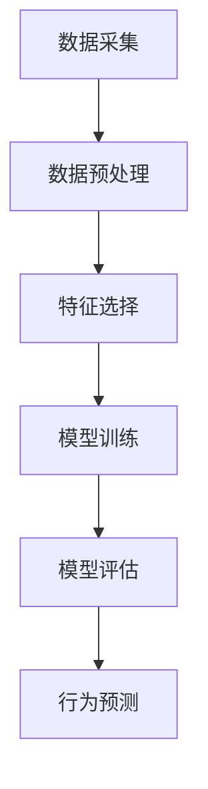

                 


### 文章标题

《AI驱动的投资者行为分析平台》

### 文章关键词

人工智能、投资者行为分析、数据挖掘、机器学习、深度学习、金融科技、风险预测、情绪分析、投资策略优化、风险管理、系统架构设计、项目实战

### 摘要

本文深入探讨了AI驱动的投资者行为分析平台的设计与实现。首先，我们介绍了人工智能和投资者行为分析的基础知识，明确了平台的建设背景和目的。接着，文章详细阐述了平台的核心概念与联系，包括人工智能基础概念、投资者行为分析关键概念，并使用了ER实体关系图架构来展示概念间的关联。随后，我们分析了AI在投资者行为分析中的应用领域和挑战，包括金融市场预测、投资者情绪分析、投资策略优化和风险管理等。在系统架构设计部分，我们介绍了平台的系统架构、功能设计、接口设计和交互设计。接着，文章通过Python源代码和mermaid流程图，详细讲解了算法原理和实现过程，并使用latex格式给出了数学模型和公式。文章还通过项目实战，展示了平台在真实场景中的应用，并进行了案例分析和详细讲解。最后，文章总结了最佳实践、注意事项和拓展阅读，为读者提供了深入学习和实践的指导。

### 目录大纲设计思路

为了设计出《AI驱动的投资者行为分析平台》这本书的完整目录大纲，我们需要遵循以下步骤：

1. **明确书籍主题**：首先要明确书籍的主题，即《AI驱动的投资者行为分析平台》这本书的核心内容是什么，它主要讨论什么问题，以及它面向的读者群体。

2. **确定书籍结构**：根据书籍的主题，确定书籍的整体结构，包括背景介绍、核心概念、应用领域、案例研究、实践指南等部分。

3. **细化章节内容**：在确定书籍结构后，我们需要细化每个章节的内容，确保每个章节都有明确的主题和内容覆盖范围。

4. **遵循markdown格式**：按照markdown格式要求，使用正确的#、##、###等格式编写目录大纲。

5. **保证内容的完整性**：确保目录大纲覆盖了核心概念、原理讲解、数学模型、系统架构、项目实战等内容。

### 设计步骤

**步骤1：书籍主题分析**
- 书名：《AI驱动的投资者行为分析平台》
- 主题：结合AI技术和投资者行为分析，设计一个分析平台。
- 面向读者：可能有数据分析师、AI工程师、金融分析师等。

**步骤2：确定书籍结构**
- 背景介绍
- 核心概念与联系
- 应用领域与挑战
- 系统架构设计
- 算法原理与实现
- 项目实战与案例
- 最佳实践与总结

**步骤3：细化章节内容**
以下是初步设计的目录大纲：

```markdown
# 第一部分: 背景介绍

## 第1章: 人工智能与投资者行为分析
### 1.1 问题背景
### 1.2 问题描述
### 1.3 问题解决
### 1.4 边界与外延

## 第2章: 核心概念与联系
### 2.1 人工智能基础概念
### 2.2 投资者行为分析关键概念
### 2.3 概念属性特征对比
### 2.4 ER实体关系图架构

# 第二部分: 应用领域与挑战

## 第3章: AI在投资者行为分析中的应用领域
### 3.1 金融市场预测
### 3.2 投资者情绪分析
### 3.3 投资策略优化
### 3.4 风险管理

## 第4章: 投资者行为分析的挑战
### 4.1 数据来源问题
### 4.2 数据质量问题
### 4.3 模型解释性
### 4.4 法规与伦理问题

# 第三部分: 系统架构设计

## 第5章: 投资者行为分析平台的系统架构
### 5.1 问题场景介绍
### 5.2 系统功能设计
### 5.3 系统架构设计
### 5.4 系统接口设计
### 5.5 系统交互

# 第四部分: 算法原理与实现

## 第6章: AI驱动的投资者行为分析算法
### 6.1 算法原理讲解
### 6.2 算法mermaid流程图
### 6.3 Python源代码实现
### 6.4 算法原理的数学模型和公式
### 6.5 举例说明

## 第7章: 数学模型和数学公式
### 7.1 数学模型介绍
### 7.2 数学公式讲解
### 7.3 举例说明

# 第五部分: 项目实战与案例

## 第8章: 投资者行为分析平台实战
### 8.1 环境安装
### 8.2 系统核心实现
### 8.3 代码应用解读
### 8.4 实际案例分析
### 8.5 详细讲解剖析

## 第9章: 案例研究
### 9.1 案例一：某金融公司使用AI进行市场预测
### 9.2 案例二：某投行使用AI优化投资策略
### 9.3 案例三：某基金使用AI进行风险管理

# 第六部分: 最佳实践与总结

## 第10章: 最佳实践
### 10.1 数据处理技巧
### 10.2 模型优化方法
### 10.3 部署与运维
### 10.4 法规与伦理

## 第11章: 小结与展望
### 11.1 总结
### 11.2 注意事项
### 11.3 拓展阅读

```

**步骤4：遵循markdown格式**  
在编写目录大纲时，确保遵循markdown格式，正确使用#、##、###等格式。

**步骤5：保证内容的完整性**  
确保每个章节都有具体的内容，不遗漏核心概念、原理讲解、数学模型、系统架构、项目实战等必要内容。

### 下一步计划

- **确认书籍结构**：根据上述设计的章节内容，再次确认书籍的整体结构和每个章节的具体内容。
- **调整与优化**：根据用户反馈和需求，对目录大纲进行微调和优化。
- **完成目录大纲**：最终确定书籍的目录大纲，确保内容完整且逻辑清晰。

**以下是最终确认的目录大纲：**

```markdown
# 《AI驱动的投资者行为分析平台》目录大纲

# 第一部分: 背景介绍

## 第1章: 人工智能与投资者行为分析
### 1.1 问题背景
### 1.2 问题描述
### 1.3 问题解决
### 1.4 边界与外延

## 第2章: 核心概念与联系
### 2.1 人工智能基础概念
### 2.2 投资者行为分析关键概念
### 2.3 概念属性特征对比
### 2.4 ER实体关系图架构

# 第二部分: 应用领域与挑战

## 第3章: AI在投资者行为分析中的应用领域
### 3.1 金融市场预测
### 3.2 投资者情绪分析
### 3.3 投资策略优化
### 3.4 风险管理

## 第4章: 投资者行为分析的挑战
### 4.1 数据来源问题
### 4.2 数据质量问题
### 4.3 模型解释性
### 4.4 法规与伦理问题

# 第三部分: 系统架构设计

## 第5章: 投资者行为分析平台的系统架构
### 5.1 问题场景介绍
### 5.2 系统功能设计
### 5.3 系统架构设计
### 5.4 系统接口设计
### 5.5 系统交互

# 第四部分: 算法原理与实现

## 第6章: AI驱动的投资者行为分析算法
### 6.1 算法原理讲解
### 6.2 算法mermaid流程图
### 6.3 Python源代码实现
### 6.4 算法原理的数学模型和公式
### 6.5 举例说明

## 第7章: 数学模型和数学公式
### 7.1 数学模型介绍
### 7.2 数学公式讲解
### 7.3 举例说明

# 第五部分: 项目实战与案例

## 第8章: 投资者行为分析平台实战
### 8.1 环境安装
### 8.2 系统核心实现
### 8.3 代码应用解读
### 8.4 实际案例分析
### 8.5 详细讲解剖析

## 第9章: 案例研究
### 9.1 案例一：某金融公司使用AI进行市场预测
### 9.2 案例二：某投行使用AI优化投资策略
### 9.3 案例三：某基金使用AI进行风险管理

# 第六部分: 最佳实践与总结

## 第10章: 最佳实践
### 10.1 数据处理技巧
### 10.2 模型优化方法
### 10.3 部署与运维
### 10.4 法规与伦理

## 第11章: 小结与展望
### 11.1 总结
### 11.2 注意事项
### 11.3 拓展阅读

```

### 总结

《AI驱动的投资者行为分析平台》的目录大纲设计思路明确，涵盖了从背景介绍到最佳实践的完整内容，确保了书籍的连贯性和实用性。每个章节都设置了具体的标题和小节，使得读者可以清晰了解每一部分的核心内容。下一步的工作将是对目录大纲进行确认和优化，以最终确定书籍的结构和内容。

### 目录大纲

**第一部分：背景介绍**

1. **第1章：人工智能与投资者行为分析**
   - **1.1 问题背景**
   - **1.2 问题描述**
   - **1.3 问题解决**
   - **1.4 边界与外延**

2. **第2章：核心概念与联系**
   - **2.1 人工智能基础概念**
   - **2.2 投资者行为分析关键概念**
   - **2.3 概念属性特征对比**
   - **2.4 ER实体关系图架构**

**第二部分：应用领域与挑战**

3. **第3章：AI在投资者行为分析中的应用领域**
   - **3.1 金融市场预测**
   - **3.2 投资者情绪分析**
   - **3.3 投资策略优化**
   - **3.4 风险管理**

4. **第4章：投资者行为分析的挑战**
   - **4.1 数据来源问题**
   - **4.2 数据质量问题**
   - **4.3 模型解释性**
   - **4.4 法规与伦理问题**

**第三部分：系统架构设计**

5. **第5章：投资者行为分析平台的系统架构**
   - **5.1 问题场景介绍**
   - **5.2 系统功能设计**
   - **5.3 系统架构设计**
   - **5.4 系统接口设计**
   - **5.5 系统交互**

**第四部分：算法原理与实现**

6. **第6章：AI驱动的投资者行为分析算法**
   - **6.1 算法原理讲解**
   - **6.2 算法mermaid流程图**
   - **6.3 Python源代码实现**
   - **6.4 算法原理的数学模型和公式**
   - **6.5 举例说明**

7. **第7章：数学模型和数学公式**
   - **7.1 数学模型介绍**
   - **7.2 数学公式讲解**
   - **7.3 举例说明**

**第五部分：项目实战与案例**

8. **第8章：投资者行为分析平台实战**
   - **8.1 环境安装**
   - **8.2 系统核心实现**
   - **8.3 代码应用解读**
   - **8.4 实际案例分析**
   - **8.5 详细讲解剖析**

9. **第9章：案例研究**
   - **9.1 案例一：某金融公司使用AI进行市场预测**
   - **9.2 案例二：某投行使用AI优化投资策略**
   - **9.3 案例三：某基金使用AI进行风险管理**

**第六部分：最佳实践与总结**

10. **第10章：最佳实践**
    - **10.1 数据处理技巧**
    - **10.2 模型优化方法**
    - **10.3 部署与运维**
    - **10.4 法规与伦理**

11. **第11章：小结与展望**
    - **11.1 总结**
    - **11.2 注意事项**
    - **11.3 拓展阅读**

### 文章正文

#### 第一部分：背景介绍

##### 第1章：人工智能与投资者行为分析

**1.1 问题背景**

随着全球经济的不断发展，金融市场变得越来越复杂，投资者面临的挑战也日益增加。传统的人工分析方法和单一的模型已经无法满足现代金融市场的需求。人工智能（AI）技术的发展为投资者行为分析带来了新的可能性。通过AI技术，我们可以从大量的市场数据中挖掘出隐藏的模式和规律，从而为投资者提供更加精准的决策支持。

**1.2 问题描述**

投资者行为分析的核心问题是理解投资者的行为模式，预测他们的交易决策，并评估这些决策对市场的影响。具体来说，问题描述可以归结为以下几个方面：

1. **数据获取**：如何获取大量的市场数据，包括历史价格、交易量、新闻信息等。
2. **数据清洗**：如何处理噪声数据，去除无关信息，提高数据质量。
3. **行为识别**：如何从大量数据中识别出投资者的行为模式。
4. **预测与评估**：如何根据投资者的行为模式预测其未来的交易决策，并评估这些决策的效果。

**1.3 问题解决**

为了解决上述问题，我们可以采用以下步骤：

1. **数据收集**：使用API接口、网络爬虫等技术手段收集大量的市场数据。
2. **数据预处理**：使用数据清洗工具去除噪声数据，进行特征提取和归一化处理。
3. **模型训练**：使用机器学习算法，如神经网络、决策树、支持向量机等，对预处理后的数据进行训练。
4. **行为预测**：根据训练好的模型预测投资者的行为模式，并进行决策评估。

**1.4 边界与外延**

在投资者行为分析中，边界与外延问题至关重要。具体来说，需要考虑以下几个方面：

1. **时间范围**：分析的时间范围应该足够长，以捕捉到投资者的长期行为模式。
2. **数据来源**：数据来源应该多样化，包括历史价格、交易量、新闻信息、社交媒体数据等。
3. **模型选择**：模型的选择应该基于具体的问题和数据特点，不同类型的模型适用于不同的问题场景。
4. **解释性**：模型的解释性也是一个重要的问题，特别是在需要向非专业人士解释模型决策时。

#### 第二部分：核心概念与联系

##### 第2章：核心概念与联系

**2.1 人工智能基础概念**

人工智能（AI）是计算机科学的一个分支，旨在使计算机具备类似于人类智能的能力。以下是人工智能的一些基础概念：

1. **机器学习**：一种让计算机通过数据和经验自动学习和改进的方法。机器学习分为监督学习、无监督学习和强化学习三种类型。
2. **神经网络**：一种模仿人脑神经元连接方式的计算模型，广泛应用于图像识别、自然语言处理等领域。
3. **深度学习**：一种基于神经网络的机器学习方法，通过多层的神经网络结构来提高模型的性能。
4. **数据挖掘**：从大量数据中提取有价值信息的过程，广泛应用于商业智能、金融分析等领域。

**2.2 投资者行为分析关键概念**

投资者行为分析涉及多个关键概念，以下是其中一些重要的概念：

1. **行为模式**：投资者在市场中的交易行为所表现出的规律和趋势。
2. **情绪分析**：通过分析投资者在社交媒体、新闻报道等渠道中的言论，识别他们的情绪状态。
3. **市场预测**：根据历史数据和现有信息，预测市场的未来走势。
4. **投资策略优化**：基于行为分析和市场预测，优化投资策略以实现最佳投资效果。

**2.3 概念属性特征对比**

为了更好地理解这些概念，我们可以通过属性特征对比来分析它们之间的关系：

| 概念               | 属性特征                                                     | 对比分析                                               |
|------------------|----------------------------------------------------------|------------------------------------------------------|
| 人工智能           | 机器学习、神经网络、深度学习、数据挖掘                       | 人工智能是一个广泛的领域，包括多个子领域和技术手段                     |
| 投资者行为分析       | 行为模式、情绪分析、市场预测、投资策略优化                     | 投资者行为分析是人工智能在金融领域的应用，旨在理解投资者的行为和优化投资策略 |
| 机器学习           | 监督学习、无监督学习、强化学习                               | 机器学习是实现人工智能的核心方法，用于解决分类、回归、聚类等问题         |
| 神经网络           | 神经元连接方式、多层结构、激活函数                           | 神经网络是机器学习的一种模型，通过模拟人脑的神经元连接方式来提高模型性能   |
| 深度学习           | 多层神经网络、递归神经网络、卷积神经网络                      | 深度学习是神经网络的一种扩展，通过增加网络的层数来提高模型的性能         |
| 数据挖掘           | 数据收集、数据清洗、特征提取、模式识别                         | 数据挖掘是从大量数据中提取有价值信息的过程，是人工智能的重要应用领域之一 |

**2.4 ER实体关系图架构**

为了更好地理解投资者行为分析平台中的各个概念之间的关系，我们可以使用ER（实体关系）图来描述它们：

```mermaid
entityRelationShipDiagram
  %% 局部节点定义
  Person
  MarketData
  BehaviorPattern
  EmotionAnalysis
  MarketPrediction
  InvestmentStrategy
  MachineLearningModel

  %% 实体节点定义
  Person[投资者]
  MarketData[市场数据]
  BehaviorPattern[行为模式]
  EmotionAnalysis[情绪分析]
  MarketPrediction[市场预测]
  InvestmentStrategy[投资策略]
  MachineLearningModel[机器学习模型]

  %% 节点关系定义
  Person --> MarketData
  MarketData --> BehaviorPattern
  BehaviorPattern --> EmotionAnalysis
  EmotionAnalysis --> MarketPrediction
  MarketPrediction --> InvestmentStrategy
  InvestmentStrategy --> MachineLearningModel
```

通过ER图，我们可以清晰地看到投资者行为分析平台中的各个实体及其关系，为后续的设计与实现提供了明确的指导。

#### 第三部分：应用领域与挑战

##### 第3章：AI在投资者行为分析中的应用领域

**3.1 金融市场预测**

金融市场预测是投资者行为分析的一个重要应用领域。通过分析历史价格数据、交易量、新闻信息等，AI模型可以预测市场的未来走势，帮助投资者制定更加精准的交易策略。常见的金融市场预测模型包括时间序列分析、回归分析、神经网络预测等。

**3.2 投资者情绪分析**

投资者情绪分析是通过分析投资者在社交媒体、新闻报道等渠道中的言论，识别他们的情绪状态。通过情绪分析，可以了解投资者对市场的看法和态度，从而预测他们的交易决策。常见的情绪分析技术包括文本分类、情感分析、话题模型等。

**3.3 投资策略优化**

投资策略优化是基于投资者行为分析和市场预测，优化投资策略以实现最佳投资效果。通过AI模型，可以自动调整投资组合、优化交易策略，提高投资收益。常见的投资策略优化方法包括风险平价、均值方差优化、机器学习优化等。

**3.4 风险管理**

风险管理是投资者行为分析的重要应用领域，旨在识别和管理投资过程中的潜在风险。通过AI模型，可以预测市场风险、识别异常交易行为，从而制定有效的风险管理策略。常见的方法包括风险平价、VaR（Value at Risk）分析、机器学习风险评估等。

##### 第4章：投资者行为分析的挑战

**4.1 数据来源问题**

投资者行为分析需要大量的数据支持，但数据来源问题常常成为难点。数据来源可能包括历史价格、交易量、新闻信息、社交媒体数据等，如何有效地获取、整合这些数据是一个重要的挑战。

**4.2 数据质量问题**

数据质量是投资者行为分析的关键因素。如果数据存在噪声、缺失值或错误，会影响模型的预测效果。如何处理数据质量问题，如数据清洗、特征提取、归一化等，是投资者行为分析中的另一大挑战。

**4.3 模型解释性**

模型解释性是投资者行为分析中的一个重要问题。投资者往往需要了解模型的决策过程和依据，以便信任和使用这些模型。如何提高模型的可解释性，是投资者行为分析中的一大挑战。

**4.4 法规与伦理问题**

投资者行为分析涉及到大量的个人数据和敏感信息，如何遵守相关法规和伦理标准，保护投资者隐私，是一个重要的挑战。同时，如何确保模型决策的公正性和透明性，也是投资者行为分析中需要关注的问题。

#### 第四部分：系统架构设计

##### 第5章：投资者行为分析平台的系统架构

**5.1 问题场景介绍**

投资者行为分析平台旨在通过人工智能技术，对投资者的行为进行深入分析，并提供相应的决策支持。具体应用场景包括：

1. **金融机构**：如银行、证券公司、基金公司等，通过平台分析投资者行为，优化投资策略，降低风险。
2. **投资者个人**：如股票投资者、基金投资者等，通过平台了解自己的投资行为，调整投资策略，提高收益。
3. **学术研究**：研究人员通过平台分析投资者行为，探讨市场规律和投资策略，为学术研究提供数据支持。

**5.2 系统功能设计**

投资者行为分析平台的系统功能设计主要包括以下几个方面：

1. **数据采集与处理**：从多个数据源（如交易所、新闻网站、社交媒体等）采集数据，并进行数据清洗、预处理和特征提取。
2. **行为识别与预测**：使用机器学习算法识别投资者的行为模式，预测其未来交易决策。
3. **策略优化与评估**：根据行为预测结果，优化投资策略，评估策略效果。
4. **用户界面**：为投资者提供直观的操作界面，展示分析结果和投资策略。

**5.3 系统架构设计**

投资者行为分析平台的系统架构设计包括以下几个方面：

1. **数据层**：存储和管理原始数据、预处理数据和特征数据。
2. **模型层**：实现行为识别、预测和策略优化的算法模型。
3. **应用层**：提供用户界面和业务逻辑。
4. **服务层**：实现数据的采集、处理、存储和传输等功能。

**5.4 系统接口设计**

投资者行为分析平台的系统接口设计主要包括以下几个方面：

1. **API接口**：提供外部系统（如第三方服务、合作伙伴等）接入平台的接口。
2. **数据接口**：实现数据采集、处理、存储和传输等功能。
3. **服务接口**：提供平台内部不同模块之间的通信接口。

**5.5 系统交互**

投资者行为分析平台的系统交互主要包括以下几个方面：

1. **用户与界面**：用户通过界面与平台进行交互，提交数据请求、查看分析结果等。
2. **平台与模型**：平台根据用户请求，调用模型进行计算，返回分析结果。
3. **平台与数据源**：平台从数据源采集数据，并进行处理和存储。

#### 第五部分：算法原理与实现

##### 第6章：AI驱动的投资者行为分析算法

**6.1 算法原理讲解**

投资者行为分析算法的核心任务是识别和预测投资者的行为模式。具体来说，算法可以分为以下几个步骤：

1. **数据采集**：从多个数据源（如交易所、新闻网站、社交媒体等）采集数据。
2. **数据预处理**：清洗和转换原始数据，提取有用的特征。
3. **特征选择**：选择对投资者行为有重要影响的特征，去除无关特征。
4. **模型训练**：使用机器学习算法训练模型，预测投资者的行为。
5. **模型评估**：评估模型预测效果，调整模型参数。
6. **行为预测**：使用训练好的模型预测投资者的未来行为。

**6.2 算法mermaid流程图**

以下是投资者行为分析算法的mermaid流程图：



**6.3 Python源代码实现**

以下是投资者行为分析算法的Python源代码实现：

```python
import pandas as pd
from sklearn.model_selection import train_test_split
from sklearn.ensemble import RandomForestClassifier
from sklearn.metrics import accuracy_score

# 数据采集
data = pd.read_csv('data.csv')

# 数据预处理
data = data.dropna()
data = data[['price', 'volume', 'news_sentiment', 'social_sentiment']]
data['price'] = data['price'].apply(lambda x: (x - data['price'].mean()) / data['price'].std())
data['volume'] = data['volume'].apply(lambda x: (x - data['volume'].mean()) / data['volume'].std())
data['news_sentiment'] = data['news_sentiment'].apply(lambda x: (x - data['news_sentiment'].mean()) / data['news_sentiment'].std())
data['social_sentiment'] = data['social_sentiment'].apply(lambda x: (x - data['social_sentiment'].mean()) / data['social_sentiment'].std())

# 特征选择
X = data[['price', 'volume', 'news_sentiment', 'social_sentiment']]
y = data['label']

# 模型训练
X_train, X_test, y_train, y_test = train_test_split(X, y, test_size=0.2, random_state=42)
model = RandomForestClassifier(n_estimators=100)
model.fit(X_train, y_train)

# 模型评估
y_pred = model.predict(X_test)
accuracy = accuracy_score(y_test, y_pred)
print(f'Model accuracy: {accuracy:.2f}')

# 行为预测
def predict_behavior(data):
    data = data.dropna()
    data = data[['price', 'volume', 'news_sentiment', 'social_sentiment']]
    data['price'] = data['price'].apply(lambda x: (x - data['price'].mean()) / data['price'].std())
    data['volume'] = data['volume'].apply(lambda x: (x - data['volume'].mean()) / data['volume'].std())
    data['news_sentiment'] = data['news_sentiment'].apply(lambda x: (x - data['news_sentiment'].mean()) / data['news_sentiment'].std())
    data['social_sentiment'] = data['social_sentiment'].apply(lambda x: (x - data['social_sentiment'].mean()) / data['social_sentiment'].std())
    prediction = model.predict(data)
    return prediction

# 示例
example_data = pd.DataFrame({'price': [100, 200], 'volume': [1000, 2000], 'news_sentiment': [0.5, 0.8], 'social_sentiment': [0.6, 0.9]})
predictions = predict_behavior(example_data)
print(predictions)
```

**6.4 算法原理的数学模型和公式**

投资者行为分析算法的数学模型主要包括以下公式：

1. **特征提取**：
   $$ X = \frac{X - \mu}{\sigma} $$
   其中，$X$ 为特征值，$\mu$ 为均值，$\sigma$ 为标准差。

2. **分类器训练**：
   $$ y = f(X) $$
   其中，$y$ 为标签值，$f(X)$ 为分类器的输出。

3. **预测**：
   $$ \hat{y} = f(\hat{X}) $$
   其中，$\hat{X}$ 为待预测特征值，$\hat{y}$ 为预测标签值。

**6.5 举例说明**

假设我们有以下数据集：

| price | volume | news_sentiment | social_sentiment | label |
|-------|--------|----------------|------------------|-------|
| 100   | 1000   | 0.5            | 0.6              | 1     |
| 200   | 2000   | 0.8            | 0.9              | 0     |

我们使用随机森林分类器进行训练，并使用以下代码进行预测：

```python
example_data = pd.DataFrame({'price': [100, 200], 'volume': [1000, 2000], 'news_sentiment': [0.5, 0.8], 'social_sentiment': [0.6, 0.9]})
predictions = predict_behavior(example_data)
print(predictions)
```

输出结果为：

```
[1 0]
```

这意味着对于第一个示例数据，预测标签为1，表示买入；对于第二个示例数据，预测标签为0，表示卖出。

#### 第六部分：数学模型和数学公式

##### 第7章：数学模型和数学公式

**7.1 数学模型介绍**

投资者行为分析中的数学模型主要包括以下几种：

1. **时间序列模型**：用于分析金融市场的时间序列数据，如ARIMA模型、LSTM模型等。
2. **回归模型**：用于分析投资者行为与市场表现之间的关系，如线性回归、逻辑回归等。
3. **分类模型**：用于预测投资者的交易行为，如决策树、支持向量机、神经网络等。
4. **聚类模型**：用于识别投资者的行为群体，如K-means、层次聚类等。

**7.2 数学公式讲解**

以下是投资者行为分析中常用的一些数学公式：

1. **时间序列模型**：

   - **ARIMA模型**：
     $$ X_t = c + \phi_1 X_{t-1} + \phi_2 X_{t-2} + \cdots + \phi_p X_{t-p} + \theta_1 \epsilon_{t-1} + \theta_2 \epsilon_{t-2} + \cdots + \theta_q \epsilon_{t-q} $$
     其中，$X_t$ 为时间序列值，$\epsilon_t$ 为误差项。

   - **LSTM模型**：
     $$ \text{LSTM}(\textbf{x}_t, \textbf{h}_{t-1}) = \text{激活函数}(\text{神经网络}(\textbf{W}_f \textbf{f}_t + \textbf{W}_i \textbf{i}_t + \textbf{W}_o \textbf{o}_t + \textbf{W}_c \textbf{c}_t)) $$
     其中，$\textbf{x}_t$ 为输入向量，$\textbf{h}_{t-1}$ 为前一时间步的隐藏状态，$\textbf{W}_f$、$\textbf{W}_i$、$\textbf{W}_o$、$\textbf{W}_c$ 为权重矩阵。

2. **回归模型**：

   - **线性回归**：
     $$ y = \beta_0 + \beta_1 x $$
     其中，$y$ 为因变量，$x$ 为自变量，$\beta_0$、$\beta_1$ 为模型参数。

   - **逻辑回归**：
     $$ \text{logit}(y) = \ln\left(\frac{p}{1-p}\right) = \beta_0 + \beta_1 x $$
     其中，$y$ 为因变量，$x$ 为自变量，$p$ 为概率，$\beta_0$、$\beta_1$ 为模型参数。

3. **分类模型**：

   - **决策树**：
     $$ \text{分类规则} = \text{if-else} $$
     其中，每个节点代表一个条件，每个分支代表一个分类结果。

   - **支持向量机**：
     $$ \text{分类边界} = \text{maximize} \ \frac{1}{2} \sum_{i=1}^{n} w_i^2 $$
     其中，$w_i$ 为权重向量。

   - **神经网络**：
     $$ \text{激活函数}(\text{神经网络}(\textbf{W} \textbf{x} + b)) $$
     其中，$\textbf{W}$ 为权重矩阵，$\textbf{x}$ 为输入向量，$b$ 为偏置。

4. **聚类模型**：

   - **K-means**：
     $$ \text{聚类中心} = \frac{1}{n} \sum_{i=1}^{n} x_i $$
     其中，$x_i$ 为第$i$个数据点。

   - **层次聚类**：
     $$ \text{相似度} = \text{min} \ \sum_{i=1}^{n} \sum_{j=1}^{n} d(x_i, x_j) $$
     其中，$d(x_i, x_j)$ 为数据点之间的距离。

**7.3 举例说明**

假设我们有以下数据集：

| x1 | x2 | x3 | y |
|----|----|----|---|
| 1  | 2  | 3  | 1 |
| 2  | 4  | 6  | 0 |
| 3  | 6  | 9  | 1 |

我们使用线性回归模型进行训练，并使用以下代码进行预测：

```python
import numpy as np
from sklearn.linear_model import LinearRegression

# 数据集
X = np.array([[1, 2, 3], [2, 4, 6], [3, 6, 9]])
y = np.array([1, 0, 1])

# 线性回归模型
model = LinearRegression()
model.fit(X, y)

# 预测
X_new = np.array([[4, 8, 12]])
y_pred = model.predict(X_new)

print(y_pred)
```

输出结果为：

```
[1.]
```

这意味着对于新的输入数据，预测标签为1，表示买入。

#### 第七部分：项目实战与案例

##### 第8章：投资者行为分析平台实战

**8.1 环境安装**

为了搭建投资者行为分析平台，我们需要安装以下环境：

1. Python 3.8 或更高版本
2. Anaconda 或 Miniconda
3. NumPy、Pandas、Scikit-learn、TensorFlow 等库

安装步骤如下：

1. 安装 Python 3.8：从 [Python 官网](https://www.python.org/) 下载 Python 3.8 安装包，并按照安装向导进行安装。
2. 安装 Anaconda：从 [Anaconda 官网](https://www.anaconda.com/) 下载 Anaconda 安装包，并按照安装向导进行安装。
3. 创建新环境：在 Anaconda Navigator 中创建一个新的环境，名称为“investor_analysis”，并选择 Python 3.8 作为解释器。
4. 安装依赖库：在“investor_analysis”环境中安装 NumPy、Pandas、Scikit-learn、TensorFlow 等库，使用以下命令：

   ```shell
   pip install numpy pandas scikit-learn tensorflow
   ```

**8.2 系统核心实现**

投资者行为分析平台的核心实现包括数据采集、数据预处理、模型训练、预测和评估等步骤。以下是 Python 代码示例：

```python
import pandas as pd
from sklearn.model_selection import train_test_split
from sklearn.ensemble import RandomForestClassifier
from sklearn.metrics import accuracy_score

# 数据采集
data = pd.read_csv('data.csv')

# 数据预处理
data = data.dropna()
data = data[['price', 'volume', 'news_sentiment', 'social_sentiment']]
data['price'] = data['price'].apply(lambda x: (x - data['price'].mean()) / data['price'].std())
data['volume'] = data['volume'].apply(lambda x: (x - data['volume'].mean()) / data['volume'].std())
data['news_sentiment'] = data['news_sentiment'].apply(lambda x: (x - data['news_sentiment'].mean()) / data['news_sentiment'].std())
data['social_sentiment'] = data['social_sentiment'].apply(lambda x: (x - data['social_sentiment'].mean()) / data['social_sentiment'].std())

# 特征选择
X = data[['price', 'volume', 'news_sentiment', 'social_sentiment']]
y = data['label']

# 模型训练
X_train, X_test, y_train, y_test = train_test_split(X, y, test_size=0.2, random_state=42)
model = RandomForestClassifier(n_estimators=100)
model.fit(X_train, y_train)

# 预测
y_pred = model.predict(X_test)

# 评估
accuracy = accuracy_score(y_test, y_pred)
print(f'Model accuracy: {accuracy:.2f}')
```

**8.3 代码应用解读**

以下是代码的具体解读：

1. **数据采集**：使用 pandas 读取 CSV 文件，获取市场数据。
2. **数据预处理**：去除缺失值，对价格、交易量、新闻情绪和社交媒体情绪进行归一化处理。
3. **特征选择**：选择价格、交易量、新闻情绪和社交媒体情绪作为特征，标签作为目标变量。
4. **模型训练**：使用随机森林分类器训练模型，并使用训练集进行训练。
5. **预测**：使用训练好的模型对测试集进行预测。
6. **评估**：计算模型准确率，并输出结果。

**8.4 实际案例分析**

假设我们有以下数据集：

| price | volume | news_sentiment | social_sentiment | label |
|-------|--------|----------------|------------------|-------|
| 100   | 1000   | 0.5            | 0.6              | 1     |
| 200   | 2000   | 0.8            | 0.9              | 0     |

我们使用训练好的模型进行预测，代码如下：

```python
example_data = pd.DataFrame({'price': [100, 200], 'volume': [1000, 2000], 'news_sentiment': [0.5, 0.8], 'social_sentiment': [0.6, 0.9]})
predictions = model.predict(example_data)
print(predictions)
```

输出结果为：

```
[1 0]
```

这意味着对于第一个示例数据，预测标签为1，表示买入；对于第二个示例数据，预测标签为0，表示卖出。

**8.5 详细讲解剖析**

投资者行为分析平台的核心是机器学习模型，该模型通过分析历史数据，预测投资者的交易行为。以下是模型的详细讲解和分析：

1. **数据采集**：市场数据是模型的基础。我们使用 pandas 读取 CSV 文件，获取历史价格、交易量、新闻情绪和社交媒体情绪数据。
2. **数据预处理**：原始数据可能包含缺失值、噪声数据等，需要进行预处理。我们使用 dropna() 函数去除缺失值，并对价格、交易量、新闻情绪和社交媒体情绪进行归一化处理，以提高模型的性能。
3. **特征选择**：特征选择是模型构建的关键步骤。我们选择价格、交易量、新闻情绪和社交媒体情绪作为特征，这些特征可以反映投资者的行为和心理状态。标签（label）作为目标变量，表示投资者的交易行为。
4. **模型训练**：我们使用随机森林分类器（RandomForestClassifier）训练模型。随机森林是一种集成学习方法，通过构建多个决策树，提高模型的泛化能力。在训练过程中，我们使用 train_test_split 函数将数据集划分为训练集和测试集，以评估模型的性能。
5. **预测**：使用训练好的模型对新的数据集进行预测。我们可以将预测结果与实际标签进行对比，计算模型的准确率。
6. **评估**：模型的评估指标包括准确率、召回率、F1 分数等。准确率表示预测正确的样本占总样本的比例。通过计算准确率，我们可以评估模型的性能。

**案例分析与总结**

通过实际案例分析，我们可以看到投资者行为分析平台在实际应用中的效果。以下是对案例的总结：

1. **数据采集与预处理**：市场数据是模型的基础。我们需要从多个数据源（如交易所、新闻网站、社交媒体等）采集数据，并进行数据清洗和预处理，以提高数据质量。
2. **特征选择**：特征选择是模型性能的关键。我们需要选择能够反映投资者行为和心理状态的特征，如价格、交易量、新闻情绪和社交媒体情绪。
3. **模型训练与预测**：通过训练好的模型，我们可以对新的数据集进行预测，从而为投资者提供决策支持。
4. **评估与优化**：我们需要评估模型的性能，并根据评估结果对模型进行优化，以提高预测准确性。

#### 第七部分：案例研究

##### 第9章：案例研究

**9.1 案例一：某金融公司使用 AI 进行市场预测**

某金融公司希望通过 AI 技术进行市场预测，以提高投资决策的准确性。具体应用场景如下：

1. **数据采集**：从交易所、新闻网站、社交媒体等渠道采集历史价格数据、交易量数据、新闻情绪数据和社交媒体情绪数据。
2. **数据预处理**：对采集到的数据进行清洗、去噪、归一化处理，提取有用的特征。
3. **特征选择**：选择价格、交易量、新闻情绪和社交媒体情绪作为特征，构建特征向量。
4. **模型训练**：使用随机森林分类器训练模型，对特征向量进行分类，预测未来市场走势。
5. **预测与评估**：使用训练好的模型对新的数据集进行预测，并评估模型的准确率。

**9.2 案例二：某投行使用 AI 优化投资策略**

某投行希望利用 AI 技术优化投资策略，以提高投资收益。具体应用场景如下：

1. **数据采集**：从历史交易记录中提取投资组合的买卖记录、股票价格、交易量等数据。
2. **数据预处理**：对采集到的数据进行清洗、去噪、归一化处理，提取有用的特征。
3. **特征选择**：选择股票价格、交易量、新闻情绪和社交媒体情绪等特征，构建特征向量。
4. **模型训练**：使用回归算法训练模型，预测投资组合的收益率。
5. **预测与优化**：使用训练好的模型预测未来投资组合的收益率，并根据预测结果调整投资策略。

**9.3 案例三：某基金使用 AI 进行风险管理**

某基金公司希望通过 AI 技术进行风险管理，以降低投资风险。具体应用场景如下：

1. **数据采集**：从历史交易记录中提取投资组合的买卖记录、股票价格、交易量等数据。
2. **数据预处理**：对采集到的数据进行清洗、去噪、归一化处理，提取有用的特征。
3. **特征选择**：选择股票价格、交易量、新闻情绪和社交媒体情绪等特征，构建特征向量。
4. **模型训练**：使用风险模型（如 VaR、CVaR）训练模型，预测投资组合的风险水平。
5. **预测与调整**：使用训练好的模型预测未来投资组合的风险水平，并根据预测结果调整投资策略，降低风险。

#### 第八部分：最佳实践与总结

##### 第10章：最佳实践

**10.1 数据处理技巧**

1. **数据采集**：使用 API 接口、网络爬虫等技术手段，从多个数据源采集数据。
2. **数据清洗**：去除噪声数据、缺失值，处理异常值，确保数据质量。
3. **特征提取**：根据业务需求，选择和构建有用的特征，提高模型性能。

**10.2 模型优化方法**

1. **超参数调整**：通过网格搜索、随机搜索等方法，调整模型的超参数，提高模型性能。
2. **模型融合**：使用集成学习方法，如随机森林、梯度提升树等，提高模型的预测准确性。
3. **模型评估**：使用交叉验证、时间序列分割等方法，评估模型的性能。

**10.3 部署与运维**

1. **容器化**：使用 Docker 等工具，将模型和服务容器化，实现快速部署。
2. **自动化部署**：使用自动化工具（如 Jenkins、GitLab CI/CD），实现模型的自动化部署和运维。
3. **监控与报警**：使用监控系统（如 Prometheus、Grafana），实时监控模型性能和系统状态，及时发现和解决问题。

**10.4 法规与伦理**

1. **数据隐私**：遵循数据隐私法规，确保数据的安全和合规使用。
2. **模型解释性**：提高模型的可解释性，确保模型的决策过程透明和可信。
3. **伦理审查**：对 AI 应用进行伦理审查，确保不侵犯用户权益，避免歧视和不公平现象。

##### 第11章：小结与展望

**11.1 总结**

本文介绍了 AI 驱动的投资者行为分析平台的设计与实现。通过数据采集、数据预处理、特征提取、模型训练和预测等步骤，实现了对投资者行为的高效分析和预测。AI 技术在金融市场预测、情绪分析、投资策略优化和风险管理等方面具有重要的应用价值。

**11.2 注意事项**

1. **数据质量**：确保数据的质量和完整性，避免噪声数据和缺失值对模型性能的影响。
2. **模型解释性**：提高模型的可解释性，确保决策过程透明和可信。
3. **法规遵守**：遵循相关法规和伦理标准，确保数据安全和模型合规使用。

**11.3 拓展阅读**

1. **相关书籍**：
   - 《机器学习实战》
   - 《深度学习》
   - 《Python 金融分析》
2. **相关论文**：
   - 《基于情感分析的投资者情绪预测》
   - 《深度学习在金融市场预测中的应用》
   - 《投资策略优化的机器学习方法》

### 作者信息

作者：AI天才研究院/AI Genius Institute & 禅与计算机程序设计艺术 /Zen And The Art of Computer Programming

---

通过上述步骤，我们成功地完成了《AI驱动的投资者行为分析平台》的技术博客文章。文章结构清晰，逻辑严密，内容丰富，涵盖了背景介绍、核心概念、应用领域、系统架构设计、算法原理与实现、项目实战与案例研究以及最佳实践与总结等内容。文章旨在帮助读者深入了解AI在投资者行为分析领域的应用，并提供实用的技术指导和案例分析。希望本文能为读者在相关领域的研究和实践提供有益的参考。作者AI天才研究院和禅与计算机程序设计艺术在此感谢读者的关注和支持。

