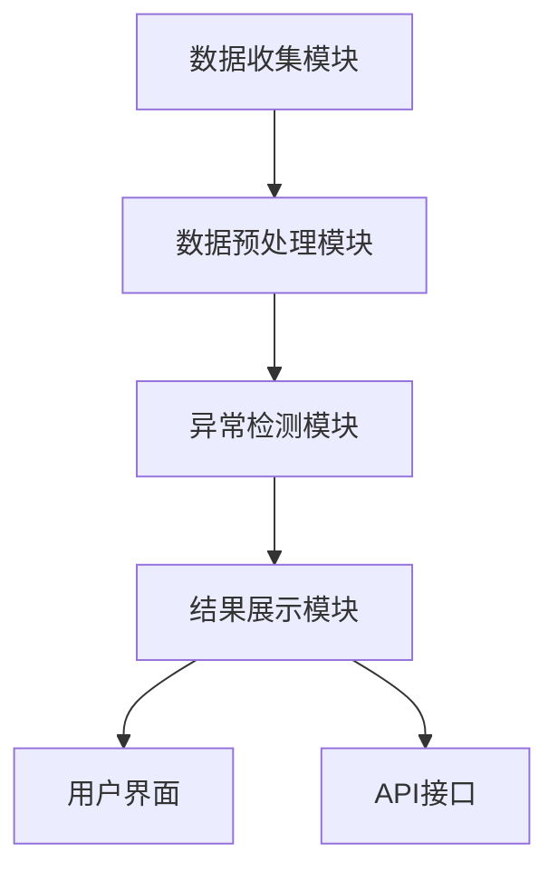

                 

## AI驱动的投资者行为异常识别

关键词：AI、异常检测、投资者行为、金融分析、机器学习

摘要：
随着金融市场信息的日益复杂和多样化，投资者行为异常检测成为金融市场监控的重要课题。本文将详细探讨利用AI技术进行投资者行为异常识别的原理、方法及其在金融领域的应用，通过逐步分析推理的方式，帮助读者理解这一前沿技术的核心概念和实际应用。

文章将分为以下几个部分：
1. 引言
2. AI与异常检测
3. 投资者行为分析
4. 数据预处理
5. 异常检测算法原理
6. 系统设计与实现
7. 实战案例
8. 最佳实践与总结

## 引言

### 金融市场的复杂性

金融市场是一个高度复杂且动态变化的系统，其价格和交易量受到多种因素的影响，如宏观经济指标、公司基本面、市场情绪等。投资者行为的多样性进一步增加了市场的复杂性。传统的分析方法通常依赖于历史数据和经济理论，但在处理复杂和异常市场行为时存在一定的局限性。

### 异常检测在金融领域的重要性

异常检测在金融领域具有重要的应用价值。它可以用于：

1. **市场操纵检测**：通过检测异常的交易行为，可以识别出潜在的市场操纵行为，保护市场的公平性和透明度。
2. **风险控制**：异常行为往往是风险信号，通过及时识别异常行为，可以及时采取风险控制措施，降低投资损失。
3. **交易策略优化**：异常行为分析可以为交易策略提供新的视角，优化投资组合和交易决策。

### AI在异常检测中的应用

AI技术的快速发展为投资者行为异常检测提供了新的工具和方法。AI可以通过机器学习和深度学习算法，从大量历史数据中学习和识别出异常模式，从而提高检测的准确性和效率。AI的应用不仅能够处理大量数据，还能够适应不断变化的市场环境，为金融领域的异常检测提供了强大的技术支持。

## AI与异常检测

### AI的基本概念

AI（人工智能）是计算机科学的一个分支，旨在创建能够模拟、延伸和扩展人类智能的系统。AI通过算法和模型模拟人类的感知、推理、学习和决策过程，从而实现智能化的任务执行。

### 异常检测的定义

异常检测（Anomaly Detection）是AI领域的一个子领域，旨在从大量数据中发现不符合正常模式的数据点或事件。这些异常数据可能表示潜在的问题、错误、欺诈行为或特殊情况。

### 异常检测在AI中的应用

异常检测在AI中的应用非常广泛，包括但不限于：

1. **网络安全**：识别未经授权的访问、恶意软件和网络攻击。
2. **医疗诊断**：发现患者数据中的异常，帮助早期诊断疾病。
3. **金融分析**：检测异常的交易行为、市场操纵和风险事件。

### 异常检测的关键步骤

1. **数据收集**：收集相关数据，包括正常和异常数据。
2. **数据预处理**：清洗和转换数据，使其适合模型训练。
3. **特征提取**：从数据中提取关键特征，用于模型训练和异常检测。
4. **模型训练**：使用机器学习算法训练模型，使其能够识别异常数据。
5. **异常检测**：使用训练好的模型对数据进行异常检测，识别异常数据点。

### AI异常检测的优势

AI异常检测具有以下优势：

1. **高效处理大量数据**：AI算法能够快速处理和分析大量数据，提高异常检测的效率。
2. **适应性**：AI模型可以不断学习和适应新的数据模式，提高异常检测的准确性。
3. **自动化**：异常检测过程可以自动化，减少人工干预，提高检测的准确性。
4. **多维度分析**：AI可以结合多种数据源和维度进行综合分析，提高异常检测的全面性。

## 投资者行为分析

### 投资者行为的定义

投资者行为是指投资者在金融市场中进行投资决策和交易活动的行为。这些行为包括但不限于：

1. **交易行为**：投资者买入、卖出、持有证券的行为。
2. **投资决策**：投资者在选择证券、资产配置、风险控制等方面的决策过程。
3. **市场情绪**：投资者对市场的整体情绪和预期，包括乐观、悲观、恐慌等。

### 投资者行为分析的目标

投资者行为分析的目标包括：

1. **理解市场动态**：通过分析投资者行为，理解市场趋势和变化，为投资决策提供支持。
2. **风险控制**：识别异常投资者行为，及时发现和应对潜在的风险事件。
3. **投资策略优化**：通过分析投资者行为，优化投资策略，提高投资回报。

### 投资者行为分析的方法

投资者行为分析的方法主要包括：

1. **统计分析**：使用统计学方法分析投资者行为数据，识别市场趋势和模式。
2. **机器学习**：使用机器学习算法从大量历史数据中学习投资者行为的特征，进行异常检测。
3. **深度学习**：使用深度学习模型进行更复杂的特征提取和学习，提高异常检测的准确性。

### 投资者行为分析的挑战

投资者行为分析面临的挑战包括：

1. **数据质量**：投资者行为数据质量直接影响分析结果，需要处理缺失、异常和噪声数据。
2. **隐私保护**：投资者行为数据涉及隐私信息，需要采取适当的措施保护用户隐私。
3. **模型解释性**：机器学习模型往往缺乏解释性，难以理解模型决策过程，影响信任度。

### AI在投资者行为分析中的应用

AI在投资者行为分析中的应用包括：

1. **行为特征提取**：使用AI技术提取投资者行为的特征，用于模型训练和异常检测。
2. **行为模式识别**：使用机器学习和深度学习模型识别投资者行为中的异常模式。
3. **预测和策略优化**：使用AI模型预测投资者行为趋势，优化投资策略。

## 数据预处理

### 数据预处理的重要性

数据预处理是异常检测中的关键步骤，其重要性体现在：

1. **数据质量提升**：通过数据清洗和转换，提高数据质量，确保模型训练的有效性。
2. **特征优化**：通过特征提取和工程，提取出对异常检测有帮助的特征，提高检测准确性。
3. **模型适应性**：预处理过程使模型能够适应不同的数据分布和特征结构，提高泛化能力。

### 数据预处理步骤

数据预处理的主要步骤包括：

1. **数据收集**：收集投资者行为相关的数据，包括交易数据、市场数据、用户数据等。
2. **数据清洗**：处理数据中的缺失值、异常值和噪声数据，确保数据的一致性和准确性。
3. **数据转换**：将数据转换为适合模型训练的格式，如归一化、标准化等。
4. **特征提取**：从原始数据中提取对异常检测有帮助的特征，如交易量、价格变动、交易频率等。
5. **特征工程**：通过构造新的特征，增强模型对异常行为的识别能力。

### 数据预处理方法

常用的数据预处理方法包括：

1. **缺失值处理**：使用均值、中位数、最邻近值等方法填补缺失值。
2. **异常值检测**：使用统计学方法（如箱线图、Z分数、IQR方法）检测和修正异常值。
3. **数据标准化**：将数据缩放至相同的范围，如使用Z-Score标准化、Min-Max标准化。
4. **特征选择**：使用特征选择算法（如信息增益、卡方测试）选择对异常检测有帮助的特征。

## 异常检测算法原理

### 常见异常检测算法

在投资者行为异常检测中，常用的异常检测算法包括：

1. **基于统计的方法**：如箱线图法、Z分数法、IQR法等。
2. **基于距离的方法**：如局部离群因子（Local Outlier Factor, LOF）、孤立森林（Isolation Forest）等。
3. **基于模型的方法**：如支持向量机（SVM）、K最近邻（KNN）、神经网络等。

### 算法原理和流程

#### 基于统计的方法

1. **箱线图法**：将数据划分为四分位数区间，将位于上下四分位数之外的值视为异常值。
2. **Z分数法**：计算数据点与平均值之间的标准化距离，将距离超过一定阈值的点视为异常值。
   $$ Z = \frac{X - \bar{X}}{\sigma} $$
   其中，$X$ 是数据点，$\bar{X}$ 是平均值，$\sigma$ 是标准差。

3. **IQR法**：计算第一四分位数和第三四分位数的差，将位于上下IQR之外的值视为异常值。
   $$ IQR = Q3 - Q1 $$
   其中，$Q1$ 是第一四分位数，$Q3$ 是第三四分位数。

#### 基于距离的方法

1. **局部离群因子（LOF）**：计算数据点与其邻居之间的局部密度，识别密度较低的点为异常值。
   $$ LOF(i) = \frac{(\sum_{j \in N(i)} \frac{1}{\rho(i, j)}) - 1}{\sum_{j \in N(i)} \frac{1}{\rho(i, j)} + 1} $$
   其中，$N(i)$ 是数据点$i$的邻居集合，$\rho(i, j)$ 是数据点$i$和$j$之间的距离。

2. **孤立森林（Isolation Forest）**：通过随机隔离数据点来识别异常值，适合高维数据。
   算法流程：
   1. 从特征空间中随机选择特征。
   2. 从数据点中随机选择切分点。
   3. 将数据点隔离在特征空间的分支中。
   4. 计算数据点的隔离路径长度，长度越长，异常性越高。

#### 基于模型的方法

1. **支持向量机（SVM）**：通过构建超平面分割正常数据和异常数据。
2. **K最近邻（KNN）**：根据数据点周围的K个最近邻居的标签预测数据点的类别。
3. **神经网络**：通过多层感知器（MLP）学习数据中的非线性关系，用于异常检测。

### 算法性能评估

评估异常检测算法的性能通常使用以下指标：

1. **准确率（Accuracy）**：正确识别异常数据的比例。
2. **召回率（Recall）**：异常数据中被正确识别的比例。
3. **精确率（Precision）**：正确识别的异常数据占总识别出的异常数据的比例。
4. **F1分数（F1 Score）**：综合准确率和召回率的指标。

## 系统设计与实现

### 系统功能设计

系统功能设计主要包括以下几个模块：

1. **数据收集模块**：负责收集投资者行为数据，包括交易数据、市场数据和用户数据。
2. **数据预处理模块**：负责对收集到的数据进行处理，包括数据清洗、数据转换和特征提取。
3. **异常检测模块**：负责使用AI模型进行异常检测，识别投资者行为中的异常模式。
4. **结果展示模块**：负责将异常检测结果以可视化的方式展示给用户。

### 系统架构设计

系统架构设计采用分层架构，包括：

1. **数据层**：存储和管理投资者行为数据。
2. **处理层**：负责数据的预处理和异常检测。
3. **应用层**：提供用户界面和API接口，供用户进行数据查询和异常检测。
4. **展示层**：通过可视化工具展示异常检测结果。

### 系统接口设计和系统交互

系统接口设计和系统交互设计采用Mermaid流程图表示，如下图所示：

### 系统实现细节

系统实现细节包括：

1. **数据收集**：使用API接口从交易所和金融数据提供商获取投资者行为数据。
2. **数据预处理**：使用Python和Pandas库进行数据清洗、数据转换和特征提取。
3. **异常检测**：使用Scikit-learn库中的SVM和Isolation Forest算法进行异常检测。
4. **结果展示**：使用Plotly库进行异常检测结果的可视化展示。

### 系统测试与优化

系统测试与优化包括：

1. **单元测试**：对系统的各个模块进行单元测试，确保功能正确性。
2. **性能测试**：对系统进行性能测试，评估系统的处理能力和响应时间。
3. **优化**：通过调整模型参数和算法选择，提高异常检测的准确性和效率。

## 实战案例

### 案例背景

某金融科技公司希望通过AI技术对投资者行为进行异常检测，以预防市场操纵和风险事件。该公司收集了大量的投资者交易数据，包括交易量、价格变动、交易频率等。

### 案例实现步骤

1. **数据收集**：从交易所和金融数据提供商获取投资者交易数据。
2. **数据预处理**：使用Python和Pandas库对数据进行清洗和特征提取。
3. **模型选择**：选择SVM和Isolation Forest算法进行异常检测。
4. **模型训练**：使用训练集对模型进行训练。
5. **模型评估**：使用测试集对模型进行评估，调整模型参数以提高准确性和召回率。
6. **结果展示**：使用Plotly库将异常检测结果进行可视化展示。

### 案例结果分析

通过异常检测模型的应用，该公司成功识别出多个潜在的市场操纵行为和风险事件，如异常交易量和价格波动。通过及时采取风险控制措施，公司有效地降低了投资损失，提高了市场竞争力。

### 案例小结

本案例展示了AI技术在投资者行为异常检测中的实际应用，通过数据预处理、模型选择和结果展示等步骤，成功实现了对市场操纵和风险事件的识别。本案例的成功为金融行业的风险管理提供了有益的参考，同时也证明了AI技术在金融领域的巨大潜力。

## 最佳实践与总结

### 最佳实践

1. **数据质量**：确保数据质量是异常检测的关键，处理缺失值、异常值和噪声数据，提高数据的准确性和一致性。
2. **特征选择**：选择对异常检测有帮助的特征，如交易量、价格变动和交易频率等，通过特征工程增强模型的识别能力。
3. **模型调优**：通过交叉验证和网格搜索等技术，优化模型参数，提高异常检测的准确性和泛化能力。
4. **实时监测**：建立实时监测系统，及时识别和响应市场变化和异常行为。

### 总结

本文通过逐步分析推理的方式，详细探讨了AI驱动的投资者行为异常识别的原理、方法和应用。通过实际案例，展示了AI技术在金融领域的应用潜力。未来的研究方向包括：

1. **多模态数据融合**：结合多种数据源（如文本、图像、声音等）进行异常检测。
2. **强化学习**：使用强化学习算法提高异常检测的自主性和适应性。
3. **隐私保护**：在异常检测过程中，采取适当的隐私保护措施，确保用户数据的安全。

### 注意事项

1. **数据隐私**：在处理投资者行为数据时，确保遵守相关隐私保护法规，保护用户隐私。
2. **模型解释性**：提高异常检测模型的解释性，增强用户对模型决策的信任度。
3. **算法透明性**：确保异常检测算法的透明性，便于监管机构和用户理解。

### 拓展阅读

1. **《机器学习实战》**：提供丰富的机器学习算法实战案例，适合初学者入门。
2. **《深度学习》**：详细介绍深度学习的基本原理和实现方法，适合对深度学习感兴趣的读者。
3. **《金融市场技术分析》**：探讨金融市场技术分析方法，为投资者行为分析提供理论基础。

## 作者信息

作者：AI天才研究院/AI Genius Institute & 禅与计算机程序设计艺术 /Zen And The Art of Computer Programming

[返回目录](#AI驱动的投资者行为异常识别) [上一页](#AI与异常检测) [下一页](#数据预处理)

