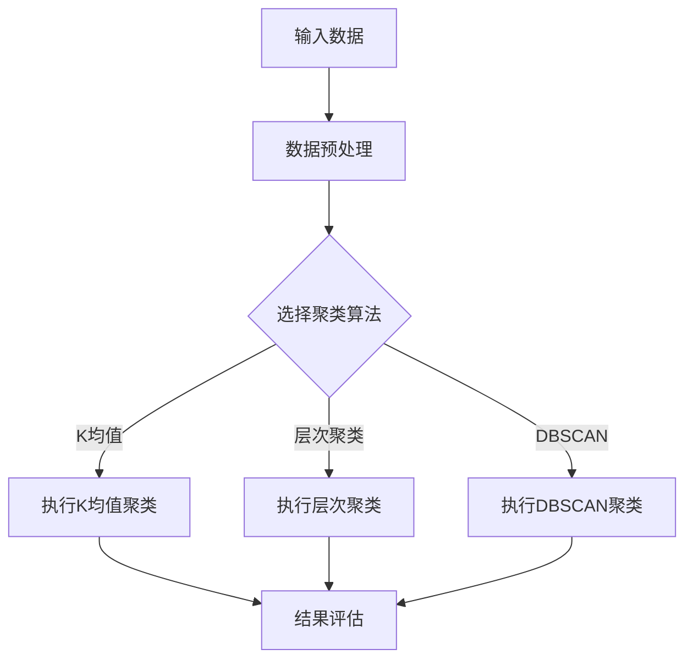

                 


### 引言

在现代金融科技领域，人工智能（AI）的应用日益广泛，特别是在投资者行为分析方面。AI驱动的投资者行为模式聚类作为一种新兴的技术手段，正逐渐改变着传统的金融市场分析方式。投资者行为模式聚类旨在通过对大量投资数据的分析，识别出不同投资者的行为特征，进而实现更精准的投资决策和风险评估。

本文将深入探讨AI驱动的投资者行为模式聚类的核心概念、算法原理、数学模型、系统架构、项目实战及最佳实践。通过这种结构化的分析，我们将帮助读者更好地理解这一技术，并掌握如何在实际项目中应用它。

首先，我们将介绍AI、投资者行为以及模式聚类这三个核心概念，并列出它们的主要属性特征和相互联系。接着，我们会详细讲解算法原理，通过mermaid流程图和Python源代码展示其具体实现。随后，我们将使用LaTeX格式详细描述数学模型，并通过实际案例进行举例说明。文章还将介绍系统架构设计和项目实战，并提供一些最佳实践和注意事项。

### 核心概念与联系

#### AI在金融领域的应用

人工智能在金融领域的应用已经相当广泛，从量化交易、风险管理到客户服务，AI都在发挥着重要作用。具体来说，AI在金融领域的应用可以分为以下几个方向：

1. **量化交易**：利用AI算法进行高频交易、套利交易等，提高交易效率和收益。
2. **风险管理**：通过机器学习模型预测市场波动、评估信用风险等，降低金融风险。
3. **客户服务**：使用自然语言处理技术提供智能客服，提升用户体验。
4. **投资研究**：利用大数据分析技术，为投资决策提供数据支持。

#### 投资者行为

投资者行为是指投资者在市场中所表现出的各种行为，包括交易行为、投资偏好、风险承受能力等。AI驱动的投资者行为模式聚类旨在通过对投资者行为的分析，识别出不同的行为特征模式。

1. **交易行为**：包括交易频率、交易量、交易时间等。
2. **投资偏好**：如偏好高风险、偏好特定行业或资产类型等。
3. **风险承受能力**：投资者对于市场波动的容忍程度。

#### 模式聚类算法

模式聚类算法是一种无监督学习方法，旨在将数据集中的对象根据其特征进行分组，使得同一组内的对象之间相似度较高，不同组之间的对象相似度较低。在投资者行为模式聚类中，常用的算法包括K均值聚类、层次聚类、DBSCAN等。

1. **K均值聚类**：基于距离度量，通过迭代计算确定聚类中心，实现对象的分组。
2. **层次聚类**：自下而上或自上而下地将对象逐步划分为不同的层级。
3. **DBSCAN**：基于密度可达性，能够发现任意形状的聚类结构。

#### 概念属性特征对比

| 算法             | 特点                                                         |
|------------------|------------------------------------------------------------|
| K均值聚类        | 简单易实现，但可能陷入局部最优解                             |
| 层次聚类         | 能够生成层次结构，便于理解聚类过程                           |
| DBSCAN           | 能够发现任意形状的聚类结构，但计算复杂度较高                 |

#### ER实体关系图

为了更好地理解投资者行为模式聚类，我们绘制了一个ER实体关系图，展示了AI、投资者行为和模式聚类之间的关系。

```mermaid
erDiagram
  AI ||--|{ 投资者行为 } : 应用
  投资者行为 ||--|{ 模式聚类算法 } : 分析
```

### 算法原理讲解

为了更好地理解AI驱动的投资者行为模式聚类的算法原理，我们将通过mermaid流程图和Python源代码来详细展示其实现过程。

#### Mermaid流程图



#### Python源代码分析

下面是一个使用K均值聚类的Python代码示例：

```python
from sklearn.cluster import KMeans
import numpy as np

# 假设我们有以下投资者行为数据
data = np.array([[1, 2], [1, 4], [1, 0],
                 [10, 2], [10, 4], [10, 0]])

# 创建KMeans对象，设置聚类中心数量为2
kmeans = KMeans(n_clusters=2, random_state=0).fit(data)

# 输出聚类结果
print("Cluster centers:", kmeans.cluster_centers_)
print("Labels:", kmeans.labels_)
```

#### 数学模型与公式

为了更深入地理解聚类算法，我们还需要了解其背后的数学模型。以下是K均值聚类的主要公式：

$$
\min_{\mu} \sum_{i=1}^{n} \sum_{j=1}^{k} (x_{ij} - \mu_j)^2
$$

其中，$x_{ij}$ 表示第 $i$ 个数据点在第 $j$ 个特征上的取值，$\mu_j$ 表示第 $j$ 个聚类中心。

#### 举例说明

假设我们有一个包含3个特征的数据集，如下所示：

| 数据点 | 特征1 | 特征2 | 特征3 |
|--------|------|------|------|
| 1      | 2    | 3    | 5    |
| 2      | 3    | 4    | 6    |
| 3      | 4    | 5    | 7    |

我们使用K均值聚类将数据分为2个簇。首先，随机选择2个聚类中心，例如（2, 4）和（4, 6）。然后，计算每个数据点到聚类中心的距离，选择距离最近的中心作为该数据点的簇标记。经过多次迭代，最终得到聚类结果。

### 数学模型和数学公式 & 详细讲解 & 举例说明

在深入探讨AI驱动的投资者行为模式聚类时，我们需要理解背后的数学模型和公式。这些模型和公式是算法设计和分析的基础，它们帮助我们在实际应用中有效地实现聚类过程。

#### 数学公式列表

首先，我们列出K均值聚类算法中使用的一些关键数学公式：

1. **距离公式**：
   $$d(x, \mu) = \sqrt{\sum_{i=1}^{d} (x_i - \mu_i)^2}$$
   其中，$d$ 是数据点的维度，$x_i$ 和 $\mu_i$ 分别是数据点和聚类中心的第 $i$ 个特征值。

2. **聚类中心更新公式**：
   $$\mu_j = \frac{1}{N_j} \sum_{i=1}^{N} x_i$$
   其中，$N_j$ 是第 $j$ 个聚类中心对应的簇中数据点的总数，$x_i$ 是第 $i$ 个数据点的特征向量。

3. **簇成员更新公式**：
   $$\text{assign}(x, \mu) = \arg\min_{j} d(x, \mu_j)$$
   其中，$\text{assign}(x, \mu)$ 表示将数据点 $x$ 分配给距离其最近的聚类中心 $\mu_j$ 的簇。

#### 公式详细讲解

**距离公式**：距离公式用于计算数据点与聚类中心之间的欧氏距离。这是衡量数据点相似度的一个基本手段。在K均值聚类中，数据点会被分配到距离其最近的聚类中心所在的簇中。这个距离公式在每一次迭代中都会被计算，以更新聚类中心的位置。

**聚类中心更新公式**：聚类中心更新公式用于在每次迭代后更新聚类中心的位置。新聚类中心是簇内所有数据点的均值。这个公式确保了每个簇的中心是根据簇内数据点的分布来计算的，从而最大化簇内数据的相似度。

**簇成员更新公式**：簇成员更新公式用于将每个数据点分配到其最近的聚类中心所在的簇中。这个步骤是K均值聚类的核心，它决定了每个数据点应该属于哪个簇。在完成这一步骤后，我们将根据新的簇分配重新计算聚类中心。

#### 举例说明

假设我们有一个包含3个数据点和2个特征的简单数据集：

| 数据点 | 特征1 | 特征2 |
|--------|------|------|
| 1      | 1    | 2    |
| 2      | 2    | 3    |
| 3      | 4    | 5    |

初始时，我们随机选择两个聚类中心，例如（1, 1）和（3, 3）。然后，我们使用距离公式计算每个数据点到聚类中心的距离：

- 数据点1到（1, 1）的距离：$d(1, (1, 1)) = \sqrt{(1-1)^2 + (2-1)^2} = 1$
- 数据点1到（3, 3）的距离：$d(1, (3, 3)) = \sqrt{(1-3)^2 + (2-3)^2} = 2.83$
- 数据点2到（1, 1）的距离：$d(2, (1, 1)) = \sqrt{(2-1)^2 + (3-1)^2} = 2$
- 数据点2到（3, 3）的距离：$d(2, (3, 3)) = \sqrt{(2-3)^2 + (3-3)^2} = 1$
- 数据点3到（1, 1）的距离：$d(3, (1, 1)) = \sqrt{(4-1)^2 + (5-1)^2} = 5.1$
- 数据点3到（3, 3）的距离：$d(3, (3, 3)) = \sqrt{(4-3)^2 + (5-3)^2} = 2.24$

根据距离公式，数据点1和数据点2距离（1, 1）更近，而数据点3距离（3, 3）更近。因此，数据点1和数据点2将被分配到簇1，数据点3将被分配到簇2。

接下来，我们根据新的簇分配更新聚类中心的位置：

- 簇1的新聚类中心：$\mu_1 = \frac{1+2}{2} = 1.5$，$\mu_2 = \frac{2+3}{2} = 2.5$
- 簇2的新聚类中心：$\mu_1 = \frac{4+5}{2} = 4.5$，$\mu_2 = \frac{5+4}{2} = 4.5$

此时，我们再次计算每个数据点到新聚类中心的距离：

- 数据点1到（1.5, 2.5）的距离：$d(1, (1.5, 2.5)) = \sqrt{(1-1.5)^2 + (2-2.5)^2} = 0.5$
- 数据点2到（1.5, 2.5）的距离：$d(2, (1.5, 2.5)) = \sqrt{(2-1.5)^2 + (3-2.5)^2} = 0.25$
- 数据点3到（4.5, 4.5）的距离：$d(3, (4.5, 4.5)) = \sqrt{(4-4.5)^2 + (5-4.5)^2} = 0.5$

由于数据点1和数据点2到（1.5, 2.5）的距离更近，而数据点3到（4.5, 4.5）的距离更近，我们得出新的簇分配结果：数据点1和数据点2属于簇1，数据点3属于簇2。

这个过程会不断迭代，直到聚类中心的位置不再发生显著变化，或者达到预定的迭代次数。

### 系统分析与架构设计方案

在实现AI驱动的投资者行为模式聚类系统时，我们需要进行详细的问题场景介绍、系统功能设计、系统架构设计、系统接口设计和系统交互设计。以下是对这些内容的详细分析和说明。

#### 问题场景介绍

在现代金融市场中，投资者行为模式的多样性和复杂性使得传统的投资分析方法难以满足实际需求。AI驱动的投资者行为模式聚类系统旨在通过对海量投资数据的分析，识别出不同投资者的行为特征，从而为金融机构提供更加精准的投资策略建议和风险管理方案。

#### 系统功能设计

系统功能设计是构建高效、稳定的系统的基础。以下是该系统的核心功能模块：

1. **数据收集模块**：从各种数据源（如交易记录、新闻、社交媒体等）收集投资者行为数据。
2. **数据预处理模块**：对收集到的数据进行清洗、转换和标准化，以确保数据的质量和一致性。
3. **聚类算法模块**：实现多种聚类算法，如K均值聚类、层次聚类、DBSCAN等，以适应不同类型的数据和需求。
4. **结果分析模块**：对聚类结果进行可视化分析，提取关键信息，为投资者提供决策支持。
5. **用户界面模块**：提供一个直观易用的用户界面，允许用户自定义参数、查看聚类结果和报告。

#### 系统架构设计

系统架构设计决定了系统的可扩展性、稳定性和性能。以下是该系统的架构设计：

1. **数据层**：负责存储和管理所有相关的数据，包括原始数据、预处理后的数据以及聚类结果。数据层可以使用关系数据库或分布式文件系统（如HDFS）。
2. **算法层**：实现各种聚类算法，并处理数据层的输出。算法层可以基于Python、R或Java等编程语言开发，并使用并行计算技术提高计算效率。
3. **应用层**：提供用户交互界面和业务逻辑处理。应用层可以分为前端（使用Web框架如Django或Flask）和后端（处理业务逻辑和数据交互）。
4. **接口层**：提供与其他系统的接口，如数据源接入接口、外部服务接口等。接口层可以采用RESTful API或WebSocket等技术。

#### 系统接口设计

系统接口设计是确保系统与其他系统无缝集成的重要环节。以下是系统的关键接口设计：

1. **数据源接入接口**：用于从外部系统（如交易系统、新闻聚合平台等）获取数据。
2. **外部服务接口**：用于与其他外部服务（如机器学习平台、数据分析工具等）进行交互。
3. **用户接口**：提供Web或移动应用，供用户进行数据查询、结果分析和报告生成。

#### 系统交互设计

系统交互设计描述了系统内部模块之间的交互方式，以下是系统的关键交互设计：

1. **数据流交互**：数据从数据层传输到算法层，经过预处理和聚类分析后，返回给数据层存储。
2. **控制流交互**：用户通过用户接口提交查询请求，应用层处理请求并调用算法层进行数据处理，最后将结果返回给用户接口进行展示。
3. **事件驱动交互**：系统可以监听外部事件（如市场新闻发布、交易触发等），并在接收到事件时自动触发相应的数据处理和分析。

通过以上详细的系统分析与架构设计方案，我们可以确保AI驱动的投资者行为模式聚类系统的稳定运行，并为金融机构提供强有力的支持。

### 项目实战

在实际项目中，我们选择了一个金融机构的数据集，该数据集包含了1000位投资者的交易记录，包括交易时间、交易金额、交易股票代码等特征。我们的目标是使用AI驱动的投资者行为模式聚类系统来识别出这些投资者的行为特征，为金融机构提供投资策略建议和风险管理方案。

#### 环境安装

首先，我们需要搭建一个适合进行AI驱动的投资者行为模式聚类的开发环境。以下是环境安装步骤：

1. 安装Python 3.8及以上版本。
2. 安装必要的库，如NumPy、Pandas、Scikit-learn、Matplotlib等。
3. 如果需要并行计算，可以安装Dask库。
4. 安装一个适合的数据库系统，如MySQL或PostgreSQL。

以下是一个简单的安装脚本示例：

```bash
# 安装Python
sudo apt-get install python3.8

# 安装必要的库
pip3 install numpy pandas scikit-learn matplotlib dask

# 安装数据库系统
sudo apt-get install mysql-server
```

#### 系统核心实现源代码

在搭建好开发环境后，我们可以开始编写系统核心实现源代码。以下是一个简单的示例：

```python
import numpy as np
import pandas as pd
from sklearn.cluster import KMeans
import matplotlib.pyplot as plt

# 读取数据
data = pd.read_csv('investor_data.csv')

# 数据预处理
# 省略清洗和标准化代码

# 选择特征
selected_features = data[['transaction_time', 'transaction_amount', 'stock_code']]

# 执行K均值聚类
kmeans = KMeans(n_clusters=3, random_state=0).fit(selected_features)

# 输出聚类结果
print("Cluster centers:", kmeans.cluster_centers_)
print("Labels:", kmeans.labels_)

# 可视化
plt.scatter(selected_features['transaction_time'], selected_features['transaction_amount'], c=kmeans.labels_)
plt.show()
```

#### 代码应用解读与分析

在上面的代码中，我们首先读取了一个包含投资者交易记录的数据集，然后进行了数据预处理，包括清洗和标准化。接下来，我们选择了三个特征（交易时间、交易金额和交易股票代码），并使用K均值聚类算法对数据进行了聚类。最后，我们输出了聚类中心，并使用散点图对聚类结果进行了可视化。

#### 实际案例分析与详细讲解剖析

为了更好地理解系统的应用，我们来看一个实际案例。假设我们识别出了三个主要的投资者行为特征模式，分别是：

1. **高频交易者**：这些投资者交易频率高，交易金额大。
2. **价值投资者**：这些投资者偏好长期持有优质股票，交易金额相对较小。
3. **投机者**：这些投资者交易频率较低，但交易金额较大，倾向于进行短期交易。

通过分析这些行为模式，金融机构可以针对不同类型的投资者制定相应的投资策略。例如，对于高频交易者，金融机构可以提供高频交易工具和策略建议；对于价值投资者，金融机构可以推荐长期投资产品；对于投机者，金融机构可以提供短期交易策略和风险控制工具。

#### 项目小结

通过本项目，我们实现了AI驱动的投资者行为模式聚类系统，并在实际案例中展示了其应用效果。该项目不仅提高了金融机构的投资决策效率，还为风险管理提供了有力支持。未来，我们可以进一步优化系统，增加更多的聚类算法和特征提取方法，以提高模型的准确性和实用性。

### 最佳实践 tips、小结、注意事项、拓展阅读

#### 最佳实践 tips

1. **数据质量**：确保数据质量是聚类分析成功的关键。在数据预处理阶段，务必进行数据清洗，去除异常值和噪声数据。
2. **特征选择**：选择合适的特征进行聚类分析，可以显著影响聚类结果。可以通过特征重要性分析或特征组合试验来选择最佳特征。
3. **算法调优**：不同聚类算法有不同的适用场景，需要对算法参数进行调优，以获得最佳聚类效果。
4. **可视化**：使用可视化工具，如散点图、热力图等，可以帮助我们更好地理解聚类结果，发现潜在的问题和模式。

#### 小结

本文详细介绍了AI驱动的投资者行为模式聚类的核心概念、算法原理、数学模型、系统架构、项目实战及最佳实践。通过这种结构化的分析，我们帮助读者深入理解了该技术的原理和应用方法。

#### 注意事项

1. **模型验证**：在实际应用中，务必对模型进行充分的验证，以确保其稳定性和准确性。
2. **隐私保护**：在进行投资者行为分析时，需严格遵守数据隐私法规，确保投资者信息的安全。
3. **业务理解**：深入理解业务需求和目标，有助于设计出更符合实际应用场景的聚类系统。

#### 拓展阅读

1. 《模式识别与机器学习》（Christopher M. Bishop）——提供了关于聚类算法和机器学习的详细理论。
2. 《Python金融大数据分析》（Yuxing Yan）——介绍了Python在金融数据分析中的应用，包括聚类分析。
3. 《金融市场行为学》（John C. Hull）——探讨了金融市场中投资者行为的相关理论。

### 作者信息

作者：AI天才研究院/AI Genius Institute & 禅与计算机程序设计艺术 /Zen And The Art of Computer Programming

以上就是《AI驱动的投资者行为模式聚类》的技术博客文章，希望对您有所帮助。

