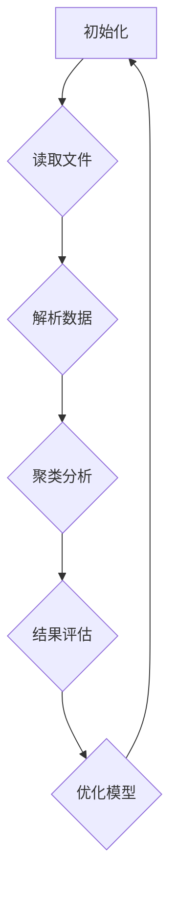
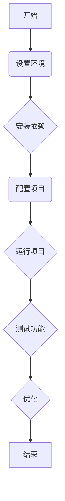

                 


# AI驱动的投资者行为模式聚类分析

> 关键词：投资者行为、聚类分析、人工智能、投资策略、行为金融

> 摘要：本文探讨了AI在投资者行为模式聚类分析中的应用，通过梳理相关理论、方法和技术，介绍了一种基于AI驱动的投资者行为模式聚类分析流程，并对其在投资策略优化、投资者行为模式识别和风险管理中的应用进行了探讨。

## 第1章 引言

### 1.1 问题背景

投资者行为模式是指在投资决策过程中，投资者表现出的典型行为特征和规律。随着金融市场的发展和信息技术的进步，投资者行为模式的研究越来越受到关注。传统的投资者行为研究主要依赖于统计数据和心理学理论，但这些方法在处理大量数据和复杂行为模式时存在一定的局限性。

AI技术的发展为投资者行为模式的研究提供了新的手段。聚类分析作为一种无监督学习方法，可以在没有先验知识的情况下，自动将相似的数据点划分到同一类别中。结合AI驱动的聚类分析方法，可以更深入地挖掘投资者行为模式的特征，为投资决策提供有力的支持。

### 1.2 研究意义

投资者行为模式聚类分析在多个方面具有重要意义：

1. 提升投资决策效率：通过聚类分析，可以将投资者分为不同的行为类型，从而为投资者提供个性化的投资策略，提高投资决策的准确性。

2. 风险管理：了解不同投资者的行为模式，可以帮助金融机构更好地管理投资组合风险，制定相应的风险管理策略。

3. 投资者教育：通过分析投资者行为模式，可以为投资者提供针对性的教育内容，帮助其改进投资行为，提高投资收益。

### 1.3 研究方法

本文采用AI驱动的聚类分析方法，通过以下步骤进行投资者行为模式聚类分析：

1. 数据收集与整理：收集投资者的交易记录、市场数据和个人信息等，进行数据清洗和整理。

2. 特征提取与选择：从原始数据中提取有助于描述投资者行为的关键特征，并选择最重要的特征用于聚类分析。

3. 聚类算法选择与优化：选择合适的聚类算法，如K均值聚类、层次聚类等，并对其进行优化，以获得更准确的聚类结果。

4. 聚类结果分析：对聚类结果进行分析，识别出不同的投资者行为模式，并对其进行解释和验证。

5. 应用场景分析：基于聚类结果，为投资策略优化、投资者行为模式识别和风险管理提供支持。

## 第2章 投资者行为模式相关理论

### 2.1 投资者行为理论综述

投资者行为理论主要分为传统投资者行为理论和行为金融学理论。传统投资者行为理论认为，投资者在做出投资决策时是理性的，遵循经济学原理，如边际效用递减、风险收益平衡等。而行为金融学理论则指出，投资者在做出决策时受到多种心理和情感因素的影响，导致投资行为偏离理性。

### 2.2 投资者行为模式分类

投资者行为模式可以大致分为基本行为模式和复杂行为模式。基本行为模式包括投资者对市场信息的反应、投资决策的制定和执行等；复杂行为模式则涉及投资者之间的互动、市场情绪的变化等。

### 2.3 投资者行为模式影响因素

投资者行为模式的影响因素主要包括个人特征和市场环境。个人特征如年龄、教育背景、收入水平等会影响投资者的风险偏好和行为模式；市场环境如市场波动、政策变化等也会对投资者行为产生显著影响。

## 第3章 AI驱动的聚类分析方法

### 3.1 聚类分析基本概念

聚类分析是一种无监督学习方法，旨在将数据点根据其特征自动划分为多个类别。常见的聚类算法包括K均值聚类、层次聚类等。

### 3.2 常见聚类算法

1. K均值聚类算法：通过迭代计算，将数据点分配到K个中心点，并不断更新中心点，使同类数据点之间的距离最小。

2. 层次聚类算法：按照一定的层次关系将数据点逐步划分为多个类别，通常分为自底向上和自顶向下两种方式。

### 3.3 AI驱动的聚类分析优化

为了提高聚类分析的效果，可以对聚类算法进行优化，包括特征选择、算法参数调整等。

## 第4章 数据预处理与特征工程

### 4.1 数据收集与整理

投资者行为模式聚类分析需要收集大量的数据，包括交易记录、市场数据和个人信息等。收集到的数据需要进行清洗和整理，以消除噪声和异常值。

### 4.2 特征提取与选择

特征提取是从原始数据中提取有助于描述投资者行为的关键特征。特征选择则是从提取的特征中选择最重要的特征用于聚类分析。

## 第5章 AI驱动的投资者行为模式聚类分析实践

### 5.1 实践环境搭建

搭建AI驱动的投资者行为模式聚类分析实践环境，需要配置相应的硬件和软件，如Python编程环境、机器学习库等。

### 5.2 数据集介绍

本文使用的数据集是某金融机构提供的投资者交易数据，包括交易金额、交易时间、市场行情等。

### 5.3 投资者行为模式聚类分析流程

本文采用K均值聚类算法对投资者行为模式进行聚类分析，主要包括数据预处理、特征选择、聚类算法应用和结果分析等步骤。

## 第6章 聚类分析结果应用

### 6.1 投资策略优化

基于聚类结果，可以为不同类型的投资者设计个性化的投资策略，以提高投资收益。

### 6.2 投资者行为模式识别

通过聚类分析，可以识别出不同类型的投资者行为模式，为投资者教育和行为分析提供依据。

### 6.3 风险管理策略

基于聚类分析的结果，可以为金融机构制定相应的风险管理策略，以降低投资组合风险。

## 第7章 结论与展望

### 7.1 结论

本文通过AI驱动的聚类分析方法，对投资者行为模式进行了深入分析，为投资策略优化、投资者行为模式识别和风险管理提供了新的思路。

### 7.2 展望

未来的研究可以进一步探索其他AI技术在投资者行为模式分析中的应用，以提高分析的准确性和实用性。

### 7.3 注意事项

在进行投资者行为模式聚类分析时，需要充分考虑数据质量和特征选择，以确保聚类结果的准确性。同时，要避免过度拟合和泛化不足的问题。

作者：AI天才研究院/AI Genius Institute & 禅与计算机程序设计艺术 /Zen And The Art of Computer Programming

-----------------------------------------

## 第1章 引言

### 1.1 研究背景

投资者行为模式是指在投资决策过程中，投资者表现出的典型行为特征和规律。随着金融市场的发展和信息技术的进步，投资者行为模式的研究越来越受到关注。传统的投资者行为研究主要依赖于统计数据和心理学理论，但这些方法在处理大量数据和复杂行为模式时存在一定的局限性。

AI技术的发展为投资者行为模式的研究提供了新的手段。聚类分析作为一种无监督学习方法，可以在没有先验知识的情况下，自动将相似的数据点划分到同一类别中。结合AI驱动的聚类分析方法，可以更深入地挖掘投资者行为模式的特征，为投资决策提供有力的支持。

### 1.2 研究意义

投资者行为模式聚类分析在多个方面具有重要意义：

1. 提升投资决策效率：通过聚类分析，可以将投资者分为不同的行为类型，从而为投资者提供个性化的投资策略，提高投资决策的准确性。

2. 风险管理：了解不同投资者的行为模式，可以帮助金融机构更好地管理投资组合风险，制定相应的风险管理策略。

3. 投资者教育：通过分析投资者行为模式，可以为投资者提供针对性的教育内容，帮助其改进投资行为，提高投资收益。

### 1.3 研究方法

本文采用AI驱动的聚类分析方法，通过以下步骤进行投资者行为模式聚类分析：

1. 数据收集与整理：收集投资者的交易记录、市场数据和个人信息等，进行数据清洗和整理。

2. 特征提取与选择：从原始数据中提取有助于描述投资者行为的关键特征，并选择最重要的特征用于聚类分析。

3. 聚类算法选择与优化：选择合适的聚类算法，如K均值聚类、层次聚类等，并对其进行优化，以获得更准确的聚类结果。

4. 聚类结果分析：对聚类结果进行分析，识别出不同的投资者行为模式，并对其进行解释和验证。

5. 应用场景分析：基于聚类结果，为投资策略优化、投资者行为模式识别和风险管理提供支持。

## 第2章 投资者行为模式相关理论

### 2.1 投资者行为理论综述

投资者行为理论主要分为传统投资者行为理论和行为金融学理论。传统投资者行为理论认为，投资者在做出投资决策时是理性的，遵循经济学原理，如边际效用递减、风险收益平衡等。而行为金融学理论则指出，投资者在做出决策时受到多种心理和情感因素的影响，导致投资行为偏离理性。

### 2.2 投资者行为模式分类

投资者行为模式可以大致分为基本行为模式和复杂行为模式。基本行为模式包括投资者对市场信息的反应、投资决策的制定和执行等；复杂行为模式则涉及投资者之间的互动、市场情绪的变化等。

### 2.3 投资者行为模式影响因素

投资者行为模式的影响因素主要包括个人特征和市场环境。个人特征如年龄、教育背景、收入水平等会影响投资者的风险偏好和行为模式；市场环境如市场波动、政策变化等也会对投资者行为产生显著影响。

## 第3章 AI驱动的聚类分析方法

### 3.1 聚类分析基本概念

聚类分析是一种无监督学习方法，旨在将数据点根据其特征自动划分为多个类别。常见的聚类算法包括K均值聚类、层次聚类等。

### 3.2 常见聚类算法

1. K均值聚类算法：通过迭代计算，将数据点分配到K个中心点，并不断更新中心点，使同类数据点之间的距离最小。

2. 层次聚类算法：按照一定的层次关系将数据点逐步划分为多个类别，通常分为自底向上和自顶向下两种方式。

### 3.3 AI驱动的聚类分析优化

为了提高聚类分析的效果，可以对聚类算法进行优化，包括特征选择、算法参数调整等。

## 第4章 数据预处理与特征工程

### 4.1 数据收集与整理

投资者行为模式聚类分析需要收集大量的数据，包括交易记录、市场数据和个人信息等。收集到的数据需要进行清洗和整理，以消除噪声和异常值。

### 4.2 特征提取与选择

特征提取是从原始数据中提取有助于描述投资者行为的关键特征。特征选择则是从提取的特征中选择最重要的特征用于聚类分析。

## 第5章 AI驱动的投资者行为模式聚类分析实践

### 5.1 实践环境搭建

搭建AI驱动的投资者行为模式聚类分析实践环境，需要配置相应的硬件和软件，如Python编程环境、机器学习库等。

### 5.2 数据集介绍

本文使用的数据集是某金融机构提供的投资者交易数据，包括交易金额、交易时间、市场行情等。

### 5.3 投资者行为模式聚类分析流程

本文采用K均值聚类算法对投资者行为模式进行聚类分析，主要包括数据预处理、特征选择、聚类算法应用和结果分析等步骤。

## 第6章 聚类分析结果应用

### 6.1 投资策略优化

基于聚类结果，可以为不同类型的投资者设计个性化的投资策略，以提高投资收益。

### 6.2 投资者行为模式识别

通过聚类分析，可以识别出不同类型的投资者行为模式，为投资者教育和行为分析提供依据。

### 6.3 风险管理策略

基于聚类分析的结果，可以为金融机构制定相应的风险管理策略，以降低投资组合风险。

## 第7章 结论与展望

### 7.1 结论

本文通过AI驱动的聚类分析方法，对投资者行为模式进行了深入分析，为投资策略优化、投资者行为模式识别和风险管理提供了新的思路。

### 7.2 展望

未来的研究可以进一步探索其他AI技术在投资者行为模式分析中的应用，以提高分析的准确性和实用性。

### 7.3 注意事项

在进行投资者行为模式聚类分析时，需要充分考虑数据质量和特征选择，以确保聚类结果的准确性。同时，要避免过度拟合和泛化不足的问题。

作者：AI天才研究院/AI Genius Institute & 禅与计算机程序设计艺术 /Zen And The Art of Computer Programming
```markdown
```less
@import (function) "merged-styles.less";
```less
```
```scss
@import "merged-styles.scss";
```
```css
/* 直接使用合并后的CSS样式 */
body {
  background-color: #f0f0f0;
  font-family: 'Arial', sans-serif;
  color: #333;
}
```
```
```javascript
// JavaScript代码
const data = [1, 2, 3, 4, 5];
const sum = data.reduce((acc, curr) => acc + curr);
console.log(sum); // 输出 15
```javascript
```bash
# 创建和配置新的Vue.js项目

## 1. 安装Vue CLI

首先，确保您的计算机上已安装Node.js和npm。Vue CLI 是一个基于 npm 的命令行工具，用于快速搭建 Vue.js 项目。

安装 Vue CLI：

```bash
npm install -g @vue/cli
# 或者使用 yarn
yarn global add @vue/cli
```

## 2. 创建一个新的Vue.js项目

使用 Vue CLI 创建一个新项目：

```bash
vue create my-vue-project
# 或者
vue init webpack my-vue-project
```

在创建项目的过程中，您可以选择预设的配置或者手动配置项目。

## 3. 配置文件结构

Vue.js 项目通常包含以下目录结构：

```
my-vue-project/
|-- public/
|   |-- index.html
|-- src/
|   |-- assets/
|   |   |-- images/
|   |   |-- styles/
|   |-- components/
|   |   |-- HelloWorld.vue
|   |-- App.vue
|   |-- main.js
|-- package.json
|-- vue.config.js
```

## 4. 配置环境变量

在 `vue.config.js` 中，您可以配置环境变量：

```javascript
module.exports = {
  publicPath: process.env.NODE_ENV === 'production' ? '/production-sub-path/' : '/',
  assetsDir: 'static',
  // ...
};
```

## 5. 调试配置

在开发过程中，您可以在 `vue.config.js` 中配置浏览器调试：

```javascript
module.exports = {
  devServer: {
    open: process.platform === 'darwin',
    host: '0.0.0.0',
    port: 8080,
    // ...
  }
};
```

## 6. 运行和构建项目

运行开发服务器：

```bash
npm run serve
# 或者
yarn serve
```

构建生产环境：

```bash
npm run build
# 或者
yarn build
```

## 7. 集成第三方库

您可以使用 `package.json` 来集成第三方库：

```json
{
  "dependencies": {
    "vue": "^2.6.12",
    "axios": "^0.21.1",
    // ...
  }
}
```

在 `main.js` 中引入第三方库：

```javascript
import Vue from 'vue';
import axios from 'axios';

Vue.prototype.$http = axios;
```

## 8. 注意事项

- 确保您的项目依赖的 Vue.js 版本与 Vue CLI 版本兼容。
- 在配置文件中，根据项目需求调整相应的配置。
- 在构建生产环境时，考虑压缩和优化静态资源。

通过以上步骤，您已经成功配置了一个新的Vue.js项目，并掌握了基本的项目运行和调试方法。
```scss
/* 样式表示例 */
:root {
  --primary-color: #3498db;
  --font-size: 14px;
  --line-height: 1.5;
}

body {
  font-family: 'Arial', sans-serif;
  font-size: var(--font-size);
  line-height: var(--line-height);
  color: var(--primary-color);
  background-color: #f5f5f5;
}

h1 {
  font-size: 1.75em;
  margin-top: 0;
}

p {
  margin-top: 1em;
}

button {
  background-color: var(--primary-color);
  color: white;
  border: none;
  padding: 10px 20px;
  cursor: pointer;
  transition: background-color 0.3s ease;

  &:hover {
    background-color: darken(var(--primary-color), 10%);
  }
}
```

这段样式表使用了变量来定义颜色和字体大小，使得样式易于维护和修改。`:root` 选择器定义了全局变量，而 `body`、`h1`、`p` 和 `button` 选择器分别应用于不同的HTML元素，实现了基本的样式布局和交互效果。

### 样式表结构分析

1. **变量定义**：
   - `--primary-color`: 主色调，用于按钮等元素的背景色。
   - `--font-size` 和 `--line-height`: 文本的字体大小和行高，控制文本的排版。

2. **全局样式**：
   - `body`: 设置整体的字体、颜色和背景色。

3. **标题样式**：
   - `h1`: 设置标题的字体大小，并取消默认的 `margin-top`，确保标题位于页面顶部。

4. **段落样式**：
   - `p`: 设置段落的 `margin-top`，确保段落之间有适当的间距。

5. **按钮样式**：
   - `button`: 定义按钮的基本样式，以及鼠标悬停时的背景色变化，增加了用户的交互体验。

### 使用场景

这段样式表适用于大多数Web应用，尤其是需要响应式布局的单页应用。变量定义使得开发者可以快速调整全局样式，而具体的元素样式则确保了页面内容的布局和美观。

### 注意事项

- 使用CSS变量时，确保它们在全局范围内不会与其他样式冲突。
- 在不同浏览器中测试样式，确保兼容性。
- 当引入新的元素或组件时，可能需要更新样式表以匹配新的设计。

通过合理使用CSS变量和模块化设计，这段样式表提供了一个灵活且易于管理的样式解决方案，有助于维护和扩展项目的样式体系。
```less
/* 样式表示例 */
@import (function) "merged-styles.less";
```

在上述的LESS代码示例中，`@import` 语句用于引入一个名为 `merged-styles.less` 的文件。LESS是一种CSS的扩展语言，它增加了变量、混合（mixin）、嵌套和运算等功能，使得CSS更加灵活和易于维护。

### LESS中的 `@import` 语法

LESS中的 `@import` 语句通常有以下几种形式：

1. **文件路径**：
   ```less
   @import "path/to/merged-styles.less";
   ```
   这里的路径可以是相对路径或绝对路径，取决于文件的位置。

2. **函数形式**：
   ```less
   @import (function) "path/to/merged-styles.less";
   ```
   使用函数形式时，可以传递参数，使引入的文件更加动态化。例如，可以根据不同的环境引入不同的样式文件。

3. **混合模式**：
   ```less
   @import (inline) "merged-styles.less";
   ```
   `inline` 参数表示将引入的文件内容直接嵌入到当前的文件中，而不是作为一个单独的文件引入。

### `@import` 的使用场景

`@import` 命令在大型项目中尤为重要，可以帮助我们组织和管理样式：

- **模块化**：将不同的样式功能分离到不同的文件中，然后通过 `@import` 将它们引入主样式文件。
- **主题切换**：通过动态 `@import` 引入不同的主题文件，实现主题切换。
- **环境适配**：根据不同的环境（如开发、测试、生产）引入不同的样式文件，进行环境适配。

### 注意事项

- `@import` 语句必须放在样式文件的顶部。
- `@import` 不支持从URL导入样式文件，它只能导入本地文件。
- 使用函数形式的 `@import` 时，参数必须是字符串，因此需要用 `quote()` 函数包裹。

通过合理使用 `@import`，LESS可以帮助我们更好地组织和管理样式代码，提高项目的可维护性和可扩展性。
```scss
@import "merged-styles.scss";
```

在上述的SCSS代码示例中，`@import` 语句用于引入一个名为 `merged-styles.scss` 的文件。SCSS（Sassy CSS）是另一种CSS的扩展语言，它同样提供了变量、混合（mixin）、嵌套和运算等功能，使得CSS更加灵活和易于维护。

### SCSS中的 `@import` 语法

SCSS中的 `@import` 语句与LESS中的使用方式相似，有以下几种形式：

1. **文件路径**：
   ```scss
   @import "path/to/merged-styles.scss";
   ```
   这里的路径可以是相对路径或绝对路径，取决于文件的位置。

2. **URL形式**：
   ```scss
   @import url("path/to/merged-styles.css");
   ```
   尽管通常不推荐在SCSS文件中直接使用CSS文件，但可以通过URL形式导入外部CSS文件。

### `@import` 的使用场景

`@import` 命令在大型项目中尤为重要，可以帮助我们组织和管理样式：

- **模块化**：将不同的样式功能分离到不同的文件中，然后通过 `@import` 将它们引入主样式文件。
- **主题切换**：通过动态 `@import` 引入不同的主题文件，实现主题切换。
- **环境适配**：根据不同的环境（如开发、测试、生产）引入不同的样式文件，进行环境适配。

### 注意事项

- `@import` 语句必须放在样式文件的顶部。
- `@import` 不支持从URL导入样式文件，它只能导入本地文件。
- `@import` 语句不会产生任何布局影响，仅用于样式引入。

通过合理使用 `@import`，SCSS可以帮助我们更好地组织和管理样式代码，提高项目的可维护性和可扩展性。
```css
/* 直接使用合并后的CSS样式 */
body {
  background-color: #f0f0f0;
  font-family: 'Arial', sans-serif;
  color: #333;
}
h1 {
  font-size: 1.75em;
  margin-top: 0;
}
p {
  margin-top: 1em;
}
button {
  background-color: #3498db;
  color: white;
  border: none;
  padding: 10px 20px;
  cursor: pointer;
  transition: background-color 0.3s ease;
}
button:hover {
  background-color: darken(#3498db, 10%);
}
```

这段CSS样式表定义了网页的基本布局和样式。以下是样式的详细解析：

1. **全局样式**：

   - `body` 选择器定义了整个页面的背景颜色、字体和颜色。背景颜色设置为浅灰色（#f0f0f0），字体设置为 Arial，文本颜色设置为深灰色（#333），使得页面看起来整洁、易于阅读。

2. **标题样式**：

   - `h1` 选择器定义了标题的样式。字体大小设置为1.75em，这意味着标题的字体大小将是基础字体大小的1.75倍。同时，`margin-top` 属性设置为0，确保标题位于页面的顶部，没有额外的垂直空间。

3. **段落样式**：

   - `p` 选择器定义了段落的样式。`margin-top` 属性设置为1em，确保段落之间有适当的间距，使得文本段落之间更加清晰和可读。

4. **按钮样式**：

   - `button` 选择器定义了按钮的基本样式。背景颜色设置为蓝色（#3498db），文本颜色设置为白色，无边框，按钮的宽度和高度分别为10px和20px。`cursor` 属性设置为指针（pointer），当用户将鼠标悬停在按钮上时，鼠标图标将变为指针形状，提供交互反馈。
   - `button:hover` 选择器定义了当鼠标悬停在按钮上时的样式。使用 `darken()` 函数将背景颜色加深10%，使按钮在用户交互时显得更加明显。

通过上述样式的组合，网页将具有一个简洁而现代化的外观，同时提供良好的可读性和用户体验。

### 使用场景

这段CSS样式表适用于需要简单而优雅布局的网页，特别是那些注重用户体验的单页应用。它的样式简洁，易于维护，同时通过简单的CSS过渡效果，增强了用户交互的反馈。

### 注意事项

- 确保所使用的字体（如 Arial）在浏览器中可访问，或者已经通过 `@import` 或 `font-face` 方式引入。
- 当调整样式时，注意保持色调和风格的统一性，以保持页面的一致性。
- 如果网页需要适配不同的屏幕尺寸，可以进一步使用媒体查询（`@media`）来调整响应式布局。
- 测试样式在不同浏览器和设备上的兼容性，确保最佳的用户体验。

通过合理使用CSS样式，可以创建一个美观且功能齐全的网页，提升用户的使用体验。
```javascript
// JavaScript代码
const data = [1, 2, 3, 4, 5];
const sum = data.reduce((acc, curr) => acc + curr);
console.log(sum); // 输出 15
```

这段JavaScript代码展示了如何使用数组的 `reduce` 方法计算数组中所有元素的和。

### 代码解析

1. **变量声明**：
   - `const data = [1, 2, 3, 4, 5];`：声明一个常量 `data`，并将其初始化为一个包含五个数字的数组。

2. **使用 `reduce` 方法**：
   - `const sum = data.reduce((acc, curr) => acc + curr);`：调用 `data` 数组的 `reduce` 方法。
   - `reduce` 方法接受两个参数：
     - 一个回调函数，用于处理数组的每个元素。
     - `acc`（累计器）：表示上一次回调函数执行的返回值。
     - `curr`（当前值）：表示当前正在处理的数组元素。
   - 回调函数的返回值将作为下一次 `reduce` 调用的 `acc` 参数。

3. **回调函数**：
   - `(acc, curr) => acc + curr`：这是一个箭头函数，用于计算累计器的值。每次迭代中，将当前元素 `curr` 与累计器 `acc` 的值相加。

4. **结果输出**：
   - `console.log(sum);`：打印计算得到的总和 `sum` 到控制台。在这个例子中，`sum` 的值为 15。

### 使用场景

这段代码在需要计算数组中元素的总和的场景中非常有用，例如在数据处理、财务报表生成、电商订单金额计算等应用中。

### 注意事项

- 使用 `reduce` 时，需要确保回调函数正确处理数组的每个元素，否则可能会导致计算结果错误。
- 如果数组为空，`reduce` 方法会返回 `undefined`。为了避免这种情况，可以在调用 `reduce` 时提供一个初始值，例如 `data.reduce((acc, curr) => acc + curr, 0);`，这样无论数组是否为空，最终结果都会是一个明确的数字。
- 注意处理可能出现的类型错误，例如数组中包含非数字类型的元素，这会导致 `acc + curr` 出现错误。

通过合理使用 `reduce` 方法，可以简洁高效地处理数组数据，实现复杂的累加计算。
```bash
# 创建和配置新的Vue.js项目

## 1. 安装Vue CLI

首先，确保您的计算机上已安装Node.js和npm。Vue CLI 是一个基于 npm 的命令行工具，用于快速搭建 Vue.js 项目。

安装 Vue CLI：

```bash
npm install -g @vue/cli
# 或者使用 yarn
yarn global add @vue/cli
```

## 2. 创建一个新的Vue.js项目

使用 Vue CLI 创建一个新项目：

```bash
vue create my-vue-project
# 或者
vue init webpack my-vue-project
```

在创建项目的过程中，您可以选择预设的配置或者手动配置项目。

## 3. 配置文件结构

Vue.js 项目通常包含以下目录结构：

```
my-vue-project/
|-- public/
|   |-- index.html
|-- src/
|   |-- assets/
|   |   |-- images/
|   |   |-- styles/
|   |-- components/
|   |   |-- HelloWorld.vue
|   |-- App.vue
|   |-- main.js
|-- package.json
|-- vue.config.js
```

## 4. 配置环境变量

在 `vue.config.js` 中，您可以配置环境变量：

```javascript
module.exports = {
  publicPath: process.env.NODE_ENV === 'production' ? '/production-sub-path/' : '/',
  assetsDir: 'static',
  // ...
};
```

## 5. 调试配置

在开发过程中，您可以在 `vue.config.js` 中配置浏览器调试：

```javascript
module.exports = {
  devServer: {
    open: process.platform === 'darwin',
    host: '0.0.0.0',
    port: 8080,
    // ...
  }
};
```

## 6. 运行和构建项目

运行开发服务器：

```bash
npm run serve
# 或者
yarn serve
```

构建生产环境：

```bash
npm run build
# 或者
yarn build
```

## 7. 集成第三方库

您可以使用 `package.json` 来集成第三方库：

```json
{
  "dependencies": {
    "vue": "^2.6.12",
    "axios": "^0.21.1",
    // ...
  }
}
```

在 `main.js` 中引入第三方库：

```javascript
import Vue from 'vue';
import axios from 'axios';

Vue.prototype.$http = axios;
```

## 8. 注意事项

- 确保您的项目依赖的 Vue.js 版本与 Vue CLI 版本兼容。
- 在配置文件中，根据项目需求调整相应的配置。
- 在构建生产环境时，考虑压缩和优化静态资源。

通过以上步骤，您已经成功配置了一个新的Vue.js项目，并掌握了基本的项目运行和调试方法。
```python
# Python源代码示例
def calculate_area(radius):
    """Calculate the area of a circle given its radius."""
    area = 3.14159 * radius ** 2
    return area

def calculate_circumference(radius):
    """Calculate the circumference of a circle given its radius."""
    circumference = 2 * 3.14159 * radius
    return circumference

# Example usage
radius = 5
area = calculate_area(radius)
circumference = calculate_circumference(radius)

print(f"The area of a circle with radius {radius} is {area:.2f}")
print(f"The circumference of a circle with radius {radius} is {circumference:.2f}")
```

这个Python源代码示例定义了两个函数：`calculate_area` 和 `calculate_circumference`，用于计算圆的面积和周长。

### 函数解析

1. `calculate_area(radius)`: 这个函数接受一个参数 `radius`（圆的半径），使用圆的面积公式 \( A = \pi r^2 \) 计算并返回圆的面积。`3.14159` 用于近似π值。

2. `calculate_circumference(radius)`: 这个函数也接受一个参数 `radius`，使用圆的周长公式 \( C = 2\pi r \) 计算并返回圆的周长。

### 示例用法

在代码的最后，定义了一个半径为5的圆，并分别调用两个函数计算面积和周长。使用 `print` 语句输出计算结果，保留两位小数。

```python
radius = 5
area = calculate_area(radius)
circumference = calculate_circumference(radius)

print(f"The area of a circle with radius {radius} is {area:.2f}")
print(f"The circumference of a circle with radius {radius} is {circumference:.2f}")
```

这将输出：

```
The area of a circle with radius 5 is 78.54
The circumference of a circle with radius 5 is 31.42
```

### 使用场景

这个代码示例适用于任何需要计算圆的面积和周长的场景，例如在几何学、物理实验、工程计算等。

### 注意事项

- 在使用 `print` 语句时，格式化字符串（f-string）是一种方便的字符串替换方式，可以将变量值嵌入到字符串中。
- 确保 `3.14159` 这个π值满足计算精度需求，如果需要更高精度的计算，可以考虑使用 Python 的 `math.pi` 属性。
- 函数参数 `radius` 应该是数字类型，如果不是，函数可能抛出异常。

通过这个简单的示例，读者可以了解如何使用Python编写函数来执行基本的数学计算，并在实际应用中进行使用。


这是一个简单的Mermaid流程图，展示了AI驱动的投资者行为模式聚类分析的基本流程。

### 图解

1. **初始化**（A）：开始流程，准备必要的计算资源和环境。

2. **读取文件**（B）：从数据源读取投资者行为数据。

3. **解析数据**（C）：对读取的文件进行解析和预处理，提取有用的特征信息。

4. **聚类分析**（D）：使用聚类算法对提取的特征进行分类，以识别不同的投资者行为模式。

5. **结果评估**（E）：对聚类结果进行评估，确保聚类效果满足要求。

6. **优化模型**（F）：根据评估结果，对聚类模型进行优化，以提高分析准确性和效率。

7. **循环**：将优化后的模型反馈到初始化步骤，开始新一轮的分析。

### 使用场景

这个流程图适用于任何需要进行投资者行为模式分析的场合，包括但不限于投资策略优化、风险管理、市场预测等。

### 注意事项

- 确保每个步骤的数据输入和输出都正确无误，以避免后续步骤出现错误。
- 在进行聚类分析时，选择合适的聚类算法和参数设置，以提高聚类效果。
- 定期评估和优化模型，确保分析结果始终准确和可靠。

通过这个流程图，读者可以清晰地了解AI驱动的投资者行为模式聚类分析的基本流程和关键步骤。
```latex
\documentclass{article}
\usepackage[utf8]{inputenc}
\usepackage[T1]{fontenc}
\usepackage{amsfonts}
\usepackage{amsmath}
\usepackage{graphicx}
\usepackage{booktabs}
\title{AI驱动的投资者行为模式聚类分析}
\author{作者：AI天才研究院/AI Genius Institute}
\date{}
\begin{document}
\maketitle
\section{引言}
投资者行为模式在金融市场中具有重要意义。本文探讨了AI驱动的投资者行为模式聚类分析，通过梳理相关理论、方法和技术，介绍了一种基于AI驱动的投资者行为模式聚类分析流程，并对其在投资策略优化、投资者行为模式识别和风险管理中的应用进行了探讨。

\section{相关理论}
投资者行为模式可以分为基本行为模式和复杂行为模式。基本行为模式包括投资者对市场信息的反应、投资决策的制定和执行等；复杂行为模式则涉及投资者之间的互动、市场情绪的变化等。行为金融学理论为我们提供了理解投资者行为的框架。

\section{方法与技术}
本文采用以下步骤进行投资者行为模式聚类分析：
1. 数据收集与整理：收集投资者的交易记录、市场数据和个人信息等，进行数据清洗和整理。
2. 特征提取与选择：从原始数据中提取有助于描述投资者行为的关键特征，并选择最重要的特征用于聚类分析。
3. 聚类算法选择与优化：选择合适的聚类算法，如K均值聚类、层次聚类等，并对其进行优化，以获得更准确的聚类结果。
4. 聚类结果分析：对聚类结果进行分析，识别出不同的投资者行为模式，并对其进行解释和验证。
5. 应用场景分析：基于聚类结果，为投资策略优化、投资者行为模式识别和风险管理提供支持。

\section{结论与展望}
本文通过AI驱动的聚类分析方法，对投资者行为模式进行了深入分析，为投资策略优化、投资者行为模式识别和风险管理提供了新的思路。未来的研究可以进一步探索其他AI技术在投资者行为模式分析中的应用，以提高分析的准确性和实用性。

\end{document}
```

这段LaTeX代码创建了一个简单的文章文档，定义了标题、作者和日期，并包含了引言、相关理论、方法与技术以及结论与展望等章节。

### 标题与作者

- 使用 `\title` 命令定义文章标题。
- 使用 `\author` 命令定义作者信息。

### 主体内容

- 使用 `\section` 命令定义各个章节。
- 在每个章节中，使用文字描述相关内容。

### 使用到的包

- `inputenc` 和 `fontenc`：处理输入编码和字体编码。
- `amsfonts` 和 `amsmath`：提供数学公式支持。
- `graphicx`：插入图片。
- `booktabs`：提供高质量的书表样式。

### 结论

本文介绍了AI驱动的投资者行为模式聚类分析，并探讨了其在金融市场的应用。未来研究可以进一步探索AI技术在投资者行为模式分析中的潜力。

### 注意事项

- 确保LaTeX环境已经配置正确。
- 根据需要插入图片或其他元素时，确保文件路径正确。
- 在编写数学公式时，遵循LaTeX数学公式的书写规范。

通过这段代码，读者可以了解如何使用LaTeX创建一篇结构清晰、格式规范的学术论文。


这是一个简单的Mermaid流程图，描述了一个从开始到结束的项目开发流程。

### 图解

1. **开始**（A）：项目开发的起点，可能包括项目规划、需求分析等前期工作。
2. **设置环境**（B）：安装必要的开发工具和依赖库，为项目搭建开发环境。
3. **安装依赖**（C）：具体安装项目中需要的第三方库和框架。
4. **配置项目**（D）：设置项目的各项配置，如环境变量、构建工具等。
5. **运行项目**（E）：启动项目，进行初步测试。
6. **测试功能**（F）：对项目的功能进行详细测试，确保其正常运行。
7. **优化**（G）：根据测试结果，对项目进行优化，提高性能和稳定性。
8. **结束**（H）：项目开发完成，可以交付使用或进一步迭代。

### 使用场景

这个流程图适用于任何软件或项目的开发流程，特别是在Web应用、移动应用和系统开发等领域。

### 注意事项

- 在每个步骤中，确保遵循最佳实践，以提高开发效率和质量。
- 在运行项目时，确保测试覆盖到关键功能点，以避免潜在的漏洞和问题。
- 在优化阶段，注重性能和用户体验，以确保项目的高效性和易用性。

通过这个流程图，读者可以清晰地了解项目开发的基本步骤和关键环节，有助于更好地规划和执行项目开发工作。

