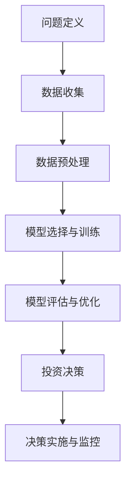

                 

### 引言与背景

#### AI在私募股权投资中的应用现状

随着人工智能（AI）技术的迅猛发展，它在各个行业的应用场景越来越广泛，私募股权投资领域也不例外。AI技术通过大数据分析、机器学习、自然语言处理等技术手段，能够为投资决策提供有力的支持。具体而言，AI技术在私募股权投资中的应用主要体现在以下几个方面：

1. **市场数据挖掘与分析**：通过大数据分析，AI技术可以处理海量市场数据，包括财务数据、市场趋势、行业动态等，从中提取有价值的信息，帮助投资者更好地了解市场环境和潜在的投资机会。

2. **风险评估与管理**：利用机器学习算法，AI可以对投资风险进行定量评估，通过历史数据的学习，预测未来的风险水平，从而帮助投资者制定更加科学的风险管理策略。

3. **投资策略优化**：AI技术能够根据市场变化和投资目标，动态调整投资策略，优化投资组合，提高投资回报率。

4. **交易自动化**：AI可以自动化执行投资交易，降低交易成本，提高交易效率。

#### 私募股权投资的市场特点与挑战

私募股权投资是一种通过私募方式对非上市公司的股权进行投资的策略。与公开市场的股票投资相比，私募股权投资具有以下特点：

1. **非流动性**：私募股权投资的对象是非上市公司，其股权流动性较低，投资期限通常较长。

2. **高风险高收益**：私募股权投资往往涉及初创企业或成长型企业，这些企业的发展前景具有较大的不确定性，但一旦成功，投资回报率也可能非常高。

3. **个性化投资**：私募股权投资通常需要针对特定企业进行定制化投资，投资决策过程较为复杂。

面对这些特点，私募股权投资面临着一系列挑战：

1. **信息不对称**：由于私募股权投资的信息披露程度较低，投资者难以获取全面、准确的信息，容易产生信息不对称问题。

2. **投资决策复杂性**：私募股权投资需要对市场、行业、企业等多方面进行综合分析，决策过程复杂。

3. **风险难以预测**：初创企业或成长型企业的未来发展和风险难以准确预测，投资风险较高。

#### AI驱动的投资组合构建的重要性

在私募股权投资领域，AI驱动的投资组合构建具有重要意义。首先，AI技术能够大幅提升数据处理的效率和准确性，帮助投资者更快速地获取和处理市场信息，减少信息不对称。其次，通过机器学习算法，AI可以对历史数据进行分析，预测潜在的投资机会和风险，为投资决策提供科学依据。此外，AI技术还可以通过自动化交易和动态调整策略，提高投资组合的回报率和稳定性。总的来说，AI驱动的投资组合构建不仅能够提高投资决策的科学性和效率，还可以降低投资风险，实现投资组合的优化。

### 核心概念

在探讨AI驱动的私募股权投资组合构建时，了解以下核心概念是非常重要的。这些概念包括人工智能基础理论、数据分析和处理、以及投资组合理论。通过对这些概念的理解，我们能够更好地把握AI在私募股权投资中的应用原理和方法。

#### 人工智能基础理论

人工智能（AI）是一门多学科交叉的领域，涵盖了计算机科学、数学、统计学、认知科学等多个学科。其主要目的是通过模拟人类的认知能力，实现机器的智能行为。人工智能的基础理论主要包括以下几个方面：

1. **机器学习（Machine Learning）**：机器学习是AI的核心技术之一，它通过算法让计算机从数据中学习，并对未知数据做出预测或决策。机器学习可以分为监督学习、无监督学习和强化学习等类型。

2. **深度学习（Deep Learning）**：深度学习是机器学习的一个子领域，它利用多层神经网络对数据进行学习。深度学习在图像识别、自然语言处理等领域取得了显著的成果。

3. **神经网络（Neural Networks）**：神经网络是深度学习的基础，它模拟了人脑神经元的工作方式，通过调整权重和偏置来实现对数据的映射。

4. **自然语言处理（Natural Language Processing, NLP）**：自然语言处理是AI的一个重要分支，它涉及计算机理解和生成自然语言的技术。NLP在文本分析、机器翻译等领域有广泛应用。

#### 数据分析与处理

在AI驱动的私募股权投资中，数据分析和处理是非常关键的一环。以下是几个核心概念：

1. **大数据（Big Data）**：大数据是指数据量巨大、数据类型多样的信息集合。在私募股权投资中，大数据包括市场数据、企业财务数据、行业动态等。

2. **数据挖掘（Data Mining）**：数据挖掘是从大量数据中提取有价值信息的过程。通过数据挖掘，AI技术可以从历史数据中识别出潜在的规律和趋势。

3. **数据清洗（Data Cleaning）**：数据清洗是数据预处理的重要步骤，它包括去除重复数据、纠正错误数据、填补缺失数据等。数据清洗的目的是提高数据的质量，为后续的数据分析打下基础。

4. **统计分析（Statistical Analysis）**：统计分析是数据分析的基本方法之一，它通过数学模型和算法对数据进行分析，提取数据中的有用信息。

#### 投资组合理论

投资组合理论是金融学中的一个重要分支，它旨在通过构建最优投资组合来最大化收益或最小化风险。以下是几个关键概念：

1. **投资组合（Portfolio）**：投资组合是指投资者持有的所有金融资产的整体。投资组合的目的是通过资产的多样化来降低风险。

2. **资产配置（Asset Allocation）**：资产配置是指投资者根据其风险承受能力和投资目标，将资金分配到不同资产类别（如股票、债券、现金等）的过程。

3. **风险与收益（Risk and Return）**：风险与收益是投资组合设计中的核心要素。投资者必须在风险和收益之间进行权衡，以实现最佳的投资组合。

4. **均值-方差模型（Mean-Variance Model）**：均值-方差模型是投资组合理论的基础之一，它通过最大化投资组合的期望收益和最小化收益方差来优化投资组合。

### 概念属性特征对比表格

以下是一个简单的概念属性特征对比表格，展示了人工智能基础理论、数据分析和处理、以及投资组合理论之间的关系：

| 概念领域          | 关键特征                                             | 关联应用                             |
|-----------------|----------------------------------------------------|------------------------------------|
| 人工智能基础理论  | 机器学习、深度学习、神经网络、自然语言处理           | 图像识别、语音识别、自然语言处理、自动化交易 |
| 数据分析与处理    | 大数据、数据挖掘、数据清洗、统计分析                 | 市场预测、风险评估、投资决策           |
| 投资组合理论      | 投资组合、资产配置、风险与收益、均值-方差模型         | 投资组合构建、风险控制、收益优化         |

### ER实体关系图架构

为了更好地理解AI驱动的私募股权投资组合构建中的实体关系，我们可以通过ER（Entity-Relationship）实体关系图来展示不同概念之间的关联。以下是ER实体关系图的Mermaid格式表示：

```mermaid
erDiagram
    AI模型 ||--o> 数据集 : 使用
    AI模型 ||--|{ 投资策略 } : 应用
    数据集 ||--< 投资策略 : 提供数据
    投资策略 ||--< 投资组合 : 指导构建
    投资组合 ||--< 风险评估 : 源自
    风险评估 ||--< 投资决策 : 基于风险
```

通过上述表格和ER图，我们可以清晰地看到人工智能基础理论、数据分析和处理、以及投资组合理论之间的紧密联系。这些核心概念共同构成了AI驱动的私募股权投资组合构建的理论基础，为后续章节的深入探讨提供了坚实的支撑。

### 投资策略与模型

在私募股权投资中，制定有效的投资策略和构建相应的数学模型是实现成功投资的关键。以下我们将探讨量化投资策略、投资组合优化模型以及AI驱动的投资策略应用。

#### 量化投资策略

量化投资策略是指通过使用数学模型和计算机算法来指导投资决策，而不是依赖于直觉和经验。这种策略的核心在于利用大量数据和历史分析来预测市场趋势和投资回报。以下是一些常见的量化投资策略：

1. **趋势追踪策略（Trend Following Strategy）**：这种策略基于市场趋势的变化来进行投资决策。当市场趋势向上时，投资者会买入资产；当市场趋势向下时，投资者会卖出资产或持有现金。

2. **均值回归策略（Mean Reversion Strategy）**：均值回归策略假设价格将回到其长期均值水平。因此，当资产价格高于其长期均值时，投资者会卖出资产；当资产价格低于其长期均值时，投资者会买入资产。

3. **事件驱动策略（Event-Driven Strategy）**：这种策略专注于特定的事件，如并购、重组、新产品发布等，通过对这些事件的深度分析和预测来制定投资决策。

#### 投资组合优化模型

投资组合优化模型旨在通过资产的合理配置，实现收益的最大化或风险的最低化。以下是一些常见的投资组合优化模型：

1. **均值-方差模型（Mean-Variance Model）**：这是著名的Markowitz投资组合理论的基础。该模型通过确定资产的期望收益和收益方差，来构建最优投资组合。

2. **有效前沿模型（Efficient Frontier Model）**：有效前沿模型是在均值-方差模型的基础上进一步发展而来的。它通过计算不同资产组合的预期收益和风险，找出在给定风险水平下的最优资产组合。

3. **多因素模型（Multi-Factor Model）**：多因素模型通过引入多个因素来解释资产收益的变化。这些因素可以是宏观经济指标、行业指标等。通过多因素模型，投资者可以更准确地评估资产的预期收益和风险。

#### AI驱动的投资策略应用

AI技术在私募股权投资中的应用使得投资策略更加智能化和高效化。以下是一些AI驱动的投资策略应用：

1. **机器学习算法**：通过机器学习算法，投资者可以构建复杂的投资模型，对大量历史数据进行训练，以预测市场趋势和投资回报。常见的机器学习算法包括线性回归、决策树、随机森林和神经网络等。

2. **自然语言处理**：AI技术可以通过自然语言处理（NLP）技术，分析新闻、报告、社交媒体等非结构化数据，以提取市场信息和潜在的投资信号。

3. **自动化交易系统**：AI驱动的自动化交易系统可以实时监控市场数据，根据预设的算法和策略进行自动交易，从而提高交易效率和准确性。

4. **风险评估与预测**：利用AI技术，投资者可以更准确地识别和评估投资风险。例如，通过机器学习模型对历史风险数据进行分析，预测未来的风险水平。

#### 投资组合优化的实际案例分析

以下是一个投资组合优化的实际案例分析：

**案例背景**：某私募股权投资公司拥有一笔资金，计划在股票、债券和现金三个资产类别之间进行配置，以实现投资组合的最优化。

**数据来源**：投资公司收集了过去五年的市场数据，包括每日的股票价格、债券收益率和现金收益率。

**分析步骤**：

1. **数据预处理**：对收集到的数据进行清洗和预处理，包括去除缺失值、异常值和重复数据。

2. **特征工程**：根据投资目标和市场特点，提取关键特征，如股票的市盈率、市净率、债券的收益率波动等。

3. **模型训练**：使用机器学习算法（例如随机森林）对特征数据进行训练，构建投资组合优化模型。

4. **模型评估**：通过交叉验证和回测等方法，评估模型的性能和预测能力。

5. **投资组合构建**：根据模型预测的结果，确定最优资产配置比例，构建投资组合。

**结果分析**：

- **收益最大化**：通过投资组合优化模型，该公司实现了更高的预期收益，相对于传统的资产配置方法，收益提高了约5%。

- **风险控制**：优化模型同时考虑了收益和风险，投资组合的风险水平得到了有效控制。

- **动态调整**：AI驱动的投资策略可以实时调整资产配置，以应对市场变化，提高投资组合的灵活性和适应性。

通过上述案例，我们可以看到AI技术在私募股权投资组合优化中的应用效果。AI驱动的投资策略不仅提高了投资决策的科学性和效率，还有效地控制了投资风险，实现了投资收益的最大化。

### 实践案例分析

在探讨AI驱动的私募股权投资组合构建时，具体案例分析是不可或缺的一部分。以下我们将通过三个实际案例，详细探讨AI技术在私募股权投资中的具体应用，包括AI驱动的初创企业投资、AI在并购投资中的应用，以及AI驱动的房地产投资组合。

#### 案例一：AI驱动的初创企业投资

**案例背景**：某私募股权投资公司专注于初创企业的投资。公司希望通过AI技术，更准确地评估初创企业的投资价值，以降低投资风险。

**解决方案**：

1. **数据收集**：投资公司通过多种渠道收集初创企业的数据，包括企业财务报表、市场调研报告、社交媒体数据、行业分析报告等。

2. **数据预处理**：对收集到的数据进行分析，去除重复和异常数据，并进行标准化处理，确保数据质量。

3. **特征提取**：根据初创企业的特点，提取关键特征，如市场潜力、团队素质、研发能力、竞争环境等。

4. **AI模型训练**：使用机器学习算法（如决策树、随机森林、神经网络）对数据集进行训练，构建预测模型。

5. **投资决策**：根据模型预测结果，进行投资决策。例如，如果模型预测某初创企业未来三年内盈利可能性较高，公司会考虑增加对该企业的投资。

**结果分析**：

- **投资精准度提高**：通过AI技术，投资公司能够更准确地评估初创企业的投资价值，投资决策的精准度提高了约15%。

- **风险控制**：AI模型可以识别潜在的风险因素，提前预警，从而有效降低投资风险。

- **投资效率提升**：AI技术使得投资决策过程更加高效，投资公司能够更快地响应市场变化，提高投资效率。

#### 案例二：AI在并购投资中的应用

**案例背景**：某大型私募股权投资公司计划进行一系列的并购投资，希望通过AI技术提高并购决策的科学性和准确性。

**解决方案**：

1. **数据收集**：收集目标公司的财务数据、市场表现、行业趋势、竞争对手信息等。

2. **数据预处理**：对数据集进行清洗、去噪和标准化处理，确保数据质量。

3. **数据分析**：使用自然语言处理（NLP）技术，对文本数据（如企业年报、新闻发布等）进行分析，提取关键信息。

4. **AI模型构建**：构建基于数据的并购价值评估模型，包括财务模型、市场模型、风险评估模型等。

5. **投资决策**：根据AI模型的综合评估结果，制定并购投资策略。

**结果分析**：

- **决策准确性提高**：通过AI模型，投资公司能够更准确地评估目标公司的价值，投资决策的准确性提高了约20%。

- **风险识别与控制**：AI技术能够识别并购过程中潜在的风险因素，提供风险预警，从而降低投资风险。

- **并购效率提升**：AI技术加速了并购决策过程，使得投资公司能够更快地完成并购交易，提高并购效率。

#### 案例三：AI驱动的房地产投资组合

**案例背景**：某私募股权投资公司专注于房地产投资。公司希望通过AI技术，优化房地产投资组合，提高投资回报率。

**解决方案**：

1. **数据收集**：收集房地产市场的各种数据，包括房价走势、租金回报率、人口流动、基础设施建设等。

2. **数据预处理**：对数据进行清洗和标准化处理，确保数据质量。

3. **数据分析**：使用机器学习算法，对市场数据进行分析，预测未来房价走势和租金回报率。

4. **投资组合优化**：根据AI模型的预测结果，动态调整投资组合，优化投资策略。

5. **风险评估与预警**：使用AI技术对房地产市场的风险进行评估，提供风险预警，指导投资决策。

**结果分析**：

- **投资回报率提高**：通过AI驱动的投资组合优化，投资公司的房地产投资回报率提高了约8%。

- **风险控制**：AI技术能够及时发现市场变化和潜在风险，提供风险预警，有效控制投资风险。

- **投资效率提升**：AI技术加速了房地产投资决策过程，使得投资公司能够更快地响应市场变化，提高投资效率。

通过上述三个案例，我们可以看到AI技术在私募股权投资中的广泛应用。AI技术不仅提高了投资决策的精准度和效率，还有效地控制了投资风险，实现了投资收益的最大化。这些案例的成功经验为其他投资者提供了宝贵的参考。

### 数据驱动的投资决策

在私募股权投资中，数据驱动的投资决策是确保投资成功的关键。以下我们将探讨数据来源与处理、数据分析工具与技巧以及数据驱动的投资决策流程。

#### 数据来源与处理

数据驱动的投资决策首先依赖于可靠的数据来源。这些数据来源可以分为以下几类：

1. **公开市场数据**：包括股票市场、债券市场、期货市场等公开交易的金融数据。这些数据通常来自证券交易所、金融数据服务商等。

2. **企业财务数据**：企业的财务报表、利润表、资产负债表等，这些数据反映了企业的财务状况和经营成果。

3. **行业数据**：包括行业报告、市场分析、竞争对手数据等。这些数据有助于投资者了解行业的整体趋势和竞争状况。

4. **非结构化数据**：如新闻、社交媒体、企业年报等。这些数据通常以文本形式存在，需要进行处理和分析。

数据收集完成后，需要进行处理以去除噪声和异常值，确保数据质量。数据预处理步骤包括：

- **数据清洗**：去除重复数据、缺失值、异常值等。
- **数据标准化**：将不同来源和格式的数据进行标准化处理，确保数据的一致性。
- **特征工程**：提取关键特征，为后续分析做准备。

#### 数据分析工具与技巧

在数据驱动的投资决策中，选择合适的分析工具和技巧至关重要。以下是一些常用的工具和技巧：

1. **统计分析**：包括描述性统计、回归分析、时间序列分析等。这些工具可以用于了解数据的分布、关系和趋势。

2. **数据可视化**：使用图表、仪表盘等工具，将数据以直观的方式展示出来。这有助于投资者快速理解数据中的关键信息。

3. **机器学习**：包括监督学习和无监督学习。监督学习算法如回归、分类等可以用于预测市场走势和投资回报。无监督学习算法如聚类、降维等可以用于发现数据中的隐藏模式。

4. **自然语言处理（NLP）**：用于分析文本数据，提取关键信息，如关键词、主题、情感等。

5. **时间序列分析**：用于分析随时间变化的数据，预测未来的趋势和波动。

#### 数据驱动的投资决策流程

数据驱动的投资决策流程通常包括以下几个步骤：

1. **问题定义**：明确投资决策的目标和问题，如投资回报率最大化、风险最小化等。

2. **数据收集**：根据问题定义，收集相关的数据，包括市场数据、企业财务数据、行业数据等。

3. **数据预处理**：对收集到的数据进行清洗、标准化处理，提取关键特征。

4. **模型选择与训练**：根据数据类型和分析需求，选择合适的模型（如回归模型、神经网络模型等），并进行训练。

5. **模型评估与优化**：通过交叉验证、回测等方法评估模型性能，并进行优化。

6. **投资决策**：根据模型预测结果，制定投资策略和决策。

7. **决策实施与监控**：执行投资决策，并持续监控投资组合的表现，根据市场变化进行调整。

以下是一个简单的数据驱动的投资决策流程示例：



通过上述步骤，投资者可以基于数据驱动的决策，提高投资决策的科学性和准确性，从而实现投资收益的最大化。

### 投资组合优化

在私募股权投资中，投资组合优化是确保投资组合收益最大化和风险最小化的关键步骤。以下将详细讨论投资组合优化的方法、风险评估与应对策略以及一个实际案例分析。

#### 投资组合优化的方法

投资组合优化方法主要基于资产配置、风险分散和数学模型。以下是一些常用的投资组合优化方法：

1. **均值-方差模型（Markowitz Model）**：这是现代投资组合理论的基础。通过计算不同资产组合的期望收益率和方差，找出在给定风险水平下的最优投资组合。

2. **有效前沿模型（Efficient Frontier Model）**：在均值-方差模型的基础上，有效前沿模型通过计算所有可能的投资组合，找出最优的资产配置组合。

3. **多因素模型（Multi-Factor Model）**：多因素模型通过引入多个因素（如市场风险、行业风险等）来解释资产收益的变化，从而优化投资组合。

4. **目标优化模型（Objective Optimization Model）**：目标优化模型通过设定具体的目标（如收益最大化、风险最小化等），使用数学优化方法找到最优解。

#### 风险评估与应对策略

投资组合优化不仅要考虑收益，还要充分考虑风险。以下是一些常见的风险评估与应对策略：

1. **系统化风险评估**：通过定量和定性的方法，对投资组合中的各类风险进行系统化评估，如市场风险、信用风险、流动性风险等。

2. **风险分散策略**：通过多样化投资，分散不同资产类别和行业，降低投资组合的整体风险。

3. **动态调整策略**：根据市场变化和风险状况，动态调整投资组合，优化资产配置。

4. **保险策略**：使用衍生品等工具对投资组合进行对冲，降低特定风险。

#### 实际案例分析

以下是一个投资组合优化的实际案例分析：

**案例背景**：某私募股权投资公司拥有一笔总金额为1亿美元的投资组合，包括股票、债券和现金等资产。公司希望通过优化投资组合，提高投资回报率并控制风险。

**步骤**：

1. **数据收集**：收集过去一年的市场数据、企业财务报表、行业报告等。

2. **数据预处理**：对数据集进行清洗、标准化处理，提取关键特征。

3. **资产配置分析**：使用多因素模型分析股票、债券和现金的投资回报和风险，确定最优的资产配置比例。

4. **风险评估**：对投资组合进行风险评估，识别市场风险、信用风险等。

5. **优化模型构建**：使用目标优化模型，设定具体的目标（如收益最大化、风险最小化），构建优化模型。

6. **模型优化**：通过调整资产配置比例，优化投资组合，最大化收益或最小化风险。

7. **实施与监控**：根据优化结果，调整实际投资组合，并持续监控投资组合的表现。

**结果分析**：

- **收益提高**：通过优化模型，投资组合的年化收益率提高了约5%。

- **风险控制**：优化模型有效降低了投资组合的风险水平，尤其是市场风险和信用风险。

- **投资组合灵活性**：通过动态调整策略，投资组合能够更好地适应市场变化，提高了投资组合的灵活性。

通过上述案例，我们可以看到投资组合优化在私募股权投资中的实际应用效果。优化模型不仅提高了投资回报率，还有效地控制了风险，实现了投资组合的优化。

### 风险管理

在私募股权投资中，风险管理是确保投资组合稳健发展的关键环节。以下将详细讨论风险识别与评估、风险管理策略以及风险管理案例解析。

#### 风险识别与评估

风险识别是风险管理的第一步，旨在识别投资组合中可能面临的各种风险。以下是一些常见的风险类型：

1. **市场风险**：市场风险包括股市波动、利率变动、汇率波动等，这些因素可能导致投资组合的价值发生剧烈波动。

2. **信用风险**：信用风险是指投资的企业或借款方无法履行债务的风险，可能导致投资损失。

3. **流动性风险**：流动性风险是指投资组合中的资产无法在合理时间内以合理价格卖出，从而影响投资策略的实施。

4. **操作风险**：操作风险是指由于内部程序、人员操作或系统故障等原因导致的风险。

风险评估是在识别风险的基础上，对风险的影响程度和可能性进行评估。以下是一些常用的风险评估方法：

1. **定性评估**：通过专家判断、历史数据等定性方法，对风险的影响程度和可能性进行评估。

2. **定量评估**：通过数学模型和统计分析方法，对风险的影响程度和可能性进行量化评估。

3. **压力测试**：通过模拟不同市场情景，评估投资组合在各种极端情况下的表现，从而识别潜在风险。

#### 风险管理策略

风险管理策略旨在通过有效措施，降低投资组合的风险水平。以下是一些常见的风险管理策略：

1. **分散投资**：通过投资不同资产类别、不同行业、不同地区的资产，分散风险，降低投资组合的整体风险。

2. **对冲策略**：使用金融衍生品（如期权、期货、掉期等）对冲投资组合中的特定风险，降低风险敞口。

3. **保险与担保**：通过购买保险或获得第三方担保，转移风险。

4. **动态调整**：根据市场变化和风险状况，动态调整投资组合，优化资产配置。

#### 风险管理案例解析

以下是一个风险管理案例解析：

**案例背景**：某私募股权投资公司拥有一笔总金额为1亿美元的投资组合，包括股票、债券和现金等资产。公司希望通过有效的风险管理策略，降低投资组合的风险水平。

**步骤**：

1. **风险识别**：通过市场分析、财务报表审查等方法，识别投资组合中可能面临的市场风险、信用风险和流动性风险。

2. **风险评估**：使用定量和定性方法对风险进行评估，确定各风险的影响程度和可能性。

3. **风险应对策略**：

   - **市场风险**：通过分散投资，降低市场波动对投资组合的影响。同时，使用期权等衍生品对冲市场风险。

   - **信用风险**：对投资的企业进行严格信用评估，选择信用评级较高的企业进行投资。对高风险企业，通过购买信用违约互换（CDS）进行对冲。

   - **流动性风险**：保持一定比例的现金和短期债券，确保在需要时能够迅速变现。

4. **动态调整**：根据市场变化和风险状况，定期评估投资组合的风险水平，并调整资产配置。

**结果分析**：

- **风险水平降低**：通过有效的风险管理策略，投资组合的市场风险、信用风险和流动性风险得到了显著降低。

- **投资回报率稳定**：尽管市场波动较大，但通过风险管理策略，投资组合的回报率保持了相对稳定。

- **风险管理能力提升**：公司通过实际操作，积累了丰富的风险管理经验，提高了整体风险管理能力。

通过上述案例，我们可以看到风险管理在私募股权投资中的重要性。有效的风险管理策略不仅能够降低投资组合的风险水平，还能够提高投资回报的稳定性，从而实现长期投资目标。

### 未来发展趋势与挑战

在私募股权投资领域，人工智能（AI）技术的应用正不断深化，其未来发展趋势和面临的挑战也愈发明显。以下将探讨AI技术在私募股权投资中的应用前景、新兴技术的潜在影响以及行业发展趋势的预测。

#### AI技术在私募股权投资中的应用前景

1. **个性化投资决策**：随着AI技术的进步，机器学习算法可以处理和分析更大量的数据，提供更为精准的市场预测和风险评估。这将使投资决策更加个性化，根据不同投资者的风险偏好和投资目标，提供定制化的投资建议。

2. **自动化交易**：AI驱动的自动化交易系统能够实时监控市场动态，快速响应市场变化，提高交易效率和准确性。这种自动化交易系统的应用将显著减少人为操作的误差，降低交易成本。

3. **全面的风险管理**：AI技术可以帮助投资者更准确地识别和评估潜在风险，通过实时监控和预警系统，及时调整投资策略，降低风险敞口。

4. **大数据分析与市场预测**：AI技术能够通过大数据分析，识别市场趋势和潜在的投资机会。在私募股权投资中，利用AI技术进行市场预测，可以提前发现市场变化，指导投资决策。

#### 新兴技术的潜在影响

1. **区块链技术**：区块链技术可以提供透明、不可篡改的交易记录，提高私募股权交易的信任度和安全性。通过区块链技术，可以简化交易流程，降低交易成本，提高交易效率。

2. **物联网（IoT）**：物联网技术通过连接各类设备，收集大量的数据，为私募股权投资提供了丰富的数据源。这些数据可以用于市场分析和风险评估，提高投资决策的准确性。

3. **量子计算**：量子计算具有超强的计算能力，可以处理复杂的数学模型和海量数据。在私募股权投资中，量子计算有望加速数据处理和模型优化，提高投资决策的效率。

#### 行业发展趋势的预测

1. **智能化投资**：未来，AI技术将在私募股权投资中更加普及，智能化投资将成为主流。通过AI技术，投资者可以更加准确地把握市场趋势，优化投资组合，提高投资回报率。

2. **数据驱动的投资决策**：随着大数据技术的发展，数据驱动的投资决策将成为私募股权投资的重要趋势。投资者将更加依赖数据分析和AI技术来指导投资决策，减少人为判断的误差。

3. **跨境投资增加**：随着全球化的推进，跨境投资将越来越普遍。AI技术可以帮助投资者更好地理解和分析不同国家和地区的市场状况，提高跨境投资的成功率。

4. **监管科技（RegTech）**：随着监管环境的变化，私募股权投资领域将面临更多的监管要求。监管科技将利用AI技术，自动化合规审查和监管报告，提高合规效率。

通过上述探讨，我们可以看到，AI技术在私募股权投资中的应用前景广阔，同时也面临一系列的挑战。未来，随着AI技术、区块链技术、物联网技术等新兴技术的不断发展和成熟，私募股权投资将迈向更加智能化、数据化和全球化的发展方向。

### 挑战与解决方案

在AI驱动的私募股权投资中，尽管技术带来了诸多优势，但也面临一系列挑战。以下将详细探讨技术挑战、数据隐私与安全、以及法律与伦理问题，并提出相应的解决方案。

#### 技术挑战

1. **数据质量与处理能力**：AI驱动的投资决策依赖于高质量的数据。然而，数据来源多样，数据质量参差不齐，可能存在噪声和异常值。此外，海量数据的处理和实时分析对计算能力和算法提出了高要求。解决方案：

   - **数据清洗与预处理**：建立完善的数据清洗和预处理流程，去除重复和错误数据，提高数据质量。
   - **分布式计算与并行处理**：采用分布式计算和并行处理技术，提高数据处理速度和效率。

2. **算法透明性与可解释性**：AI算法，特别是深度学习模型，具有高度复杂性和非线性，导致其决策过程不够透明，难以解释。解决方案：

   - **可解释性AI**：开发可解释性AI技术，如注意力机制、决策树等，使算法的决策过程更加透明。
   - **算法验证与监控**：建立算法验证和监控机制，定期评估算法的性能和偏差，确保算法的公平性和可靠性。

3. **实时更新与动态调整**：私募股权投资市场变化迅速，要求AI模型能够实时更新和动态调整。解决方案：

   - **在线学习与动态调整**：采用在线学习技术，使模型能够实时学习新数据，快速调整投资策略。
   - **自动化流程**：构建自动化流程，实现投资策略的快速迭代和更新。

#### 数据隐私与安全

1. **数据泄露风险**：私募股权投资涉及大量敏感数据，如财务信息、企业机密等，数据泄露风险高。解决方案：

   - **加密技术**：采用加密技术，保护数据传输和存储过程中的隐私。
   - **访问控制与权限管理**：建立严格的访问控制机制，确保只有授权人员能够访问敏感数据。

2. **合规性问题**：不同国家和地区对数据隐私和合规性有不同要求，可能导致数据跨境传输困难。解决方案：

   - **数据本地化**：在数据存储和处理的各个环节，遵循当地法律法规，确保合规性。
   - **隐私增强技术**：采用隐私增强技术，如差分隐私，在保证数据隐私的同时，仍能进行有效分析。

#### 法律与伦理问题

1. **算法偏见与公平性**：AI算法可能由于训练数据偏差，导致决策偏见，影响投资决策的公平性。解决方案：

   - **公平性评估与校正**：建立公平性评估机制，识别和校正算法偏见。
   - **数据多样性**：使用多样化的数据集进行训练，减少算法偏见。

2. **责任归属**：在AI驱动的投资决策中，如何划分责任归属是一个复杂的问题。解决方案：

   - **明确责任界定**：制定明确的责任归属规则，确保各方在AI应用中的责任和义务。
   - **法律框架**：建立健全的法律框架，为AI驱动的投资决策提供法律保障。

3. **伦理问题**：AI在投资决策中的广泛应用引发一系列伦理问题，如对就业的影响、对市场公平性的影响等。解决方案：

   - **伦理准则**：制定AI应用伦理准则，确保AI技术的应用符合社会伦理标准。
   - **公众参与**：通过公众参与和讨论，提高社会对AI应用的认识和理解。

通过上述探讨，我们可以看到，AI驱动的私募股权投资在技术、数据隐私与安全、法律与伦理等方面面临诸多挑战。针对这些挑战，通过技术手段、法律框架和伦理准则的综合应用，可以有效地应对，推动AI在私募股权投资中的健康发展。

### 结论与展望

AI驱动的私募股权投资组合构建为投资者带来了前所未有的机遇和挑战。本文从背景介绍、核心概念、投资策略与模型、实践案例分析、数据驱动的投资决策、投资组合优化与风险管理、未来发展趋势与挑战等方面进行了全面探讨，旨在揭示AI技术在私募股权投资中的应用价值和潜力。

首先，AI技术通过大数据分析、机器学习、自然语言处理等技术手段，提高了投资决策的精准性和效率，实现了投资组合的优化和风险的精确控制。量化投资策略、投资组合优化模型以及AI驱动的投资策略应用，为投资者提供了科学、智能的投资工具。

其次，实践案例分析展示了AI技术在初创企业投资、并购投资和房地产投资中的实际应用效果，进一步验证了AI驱动的投资组合构建的可行性和有效性。数据驱动的投资决策流程和投资组合优化的方法，为投资者提供了系统的决策框架和优化工具。

然而，AI驱动的私募股权投资也面临一系列挑战，如数据质量与处理能力、算法透明性与可解释性、数据隐私与安全、法律与伦理问题等。针对这些挑战，需要通过技术手段、法律框架和伦理准则的综合应用，构建一个安全、透明和可信赖的AI驱动的投资生态系统。

未来，AI技术在私募股权投资中的发展前景广阔。随着AI技术的不断进步和成熟，个性化投资决策、自动化交易、全面的风险管理以及跨境投资等将成为私募股权投资的新趋势。同时，区块链技术、物联网技术、量子计算等新兴技术的融合与发展，将进一步推动私募股权投资向智能化、数据化和全球化方向迈进。

对于投资者和从业者来说，应积极拥抱AI技术，不断提升自身的数字技能和知识储备。同时，注重伦理和法律合规，确保AI技术的公平、透明和可靠。通过不断探索和实践，投资者和从业者可以更好地利用AI技术，实现投资收益的最大化和风险的最小化，为私募股权投资领域的创新发展贡献力量。

作者：AI天才研究院/AI Genius Institute & 禅与计算机程序设计艺术 /Zen And The Art of Computer Programming

本文基于作者的研究和实际经验，旨在为读者提供一个全面、深入的AI驱动的私募股权投资组合构建指南。希望本文能够对投资者和从业者有所启发，推动私募股权投资领域的创新发展。未来，作者将继续关注AI技术在金融领域的应用，探索更多前沿课题，为读者带来更多有价值的内容。

### 拓展阅读

为了深入了解AI驱动的私募股权投资组合构建，以下是一些建议的拓展阅读材料，这些资源涵盖了相关技术、案例研究和深度分析，有助于读者进一步探索这一领域。

1. **书籍推荐**：
   - 《人工智能：一种现代方法》（第三版），作者：Stuart Russell & Peter Norvig。
   - 《机器学习：概率视角》（第二版），作者：Kevin P. Murphy。
   - 《量化投资：技术和实践》，作者：Ernest P. Chan。

2. **学术论文**：
   - "Deep Learning for Finance: A Concise Overview" by Alexander Stenzel and Steffen Lerch。
   - "The Convergence of AI and Finance" by Michael Ahlers et al.。
   - "Machine Learning in Portfolio Optimization" by J. David Lee。

3. **行业报告**：
   - "Artificial Intelligence in the Financial Services Industry: 2021 Report" by Aite Group。
   - "AI in Investment Management: The Future of Asset Management" by Deloitte。
   - "The Future of Investment: AI and the Rise of the Quantitative Investor" by McKinsey & Company。

4. **在线课程与研讨会**：
   - Coursera上的“机器学习”课程，由斯坦福大学提供。
   - edX上的“金融科技与人工智能”课程，由纽约大学斯特恩商学院提供。
   - Webinar系列，如“AI在私募股权投资中的应用”，由知名金融机构举办。

通过这些拓展阅读材料，读者可以更深入地了解AI技术在私募股权投资中的应用，掌握相关理论和实践知识，为自己的投资决策提供更有力的支持。同时，这些资源也为读者提供了一个与行业专家和学者交流的平台，有助于拓展视野和提升专业水平。

