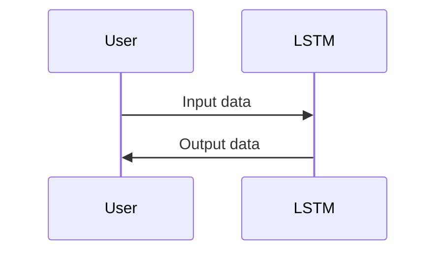
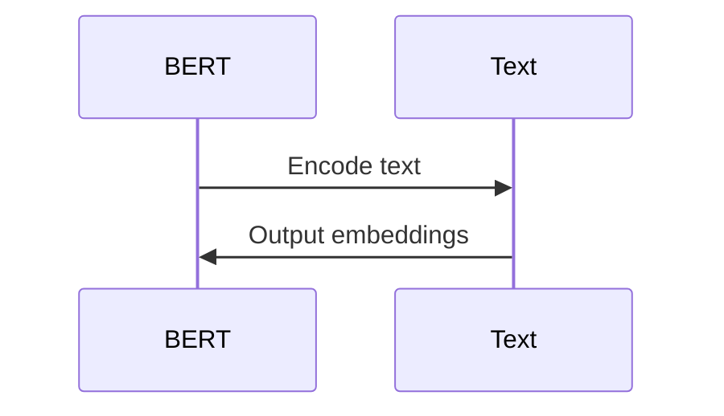
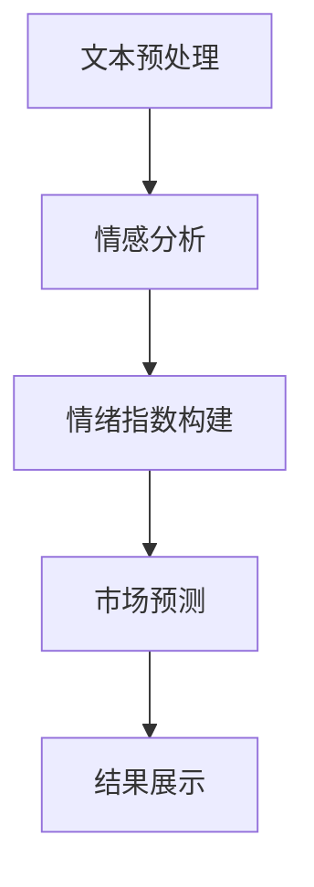
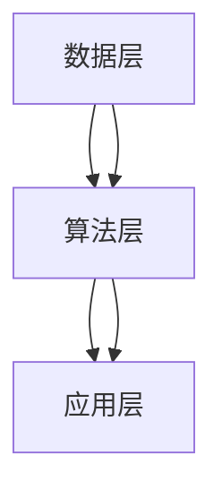
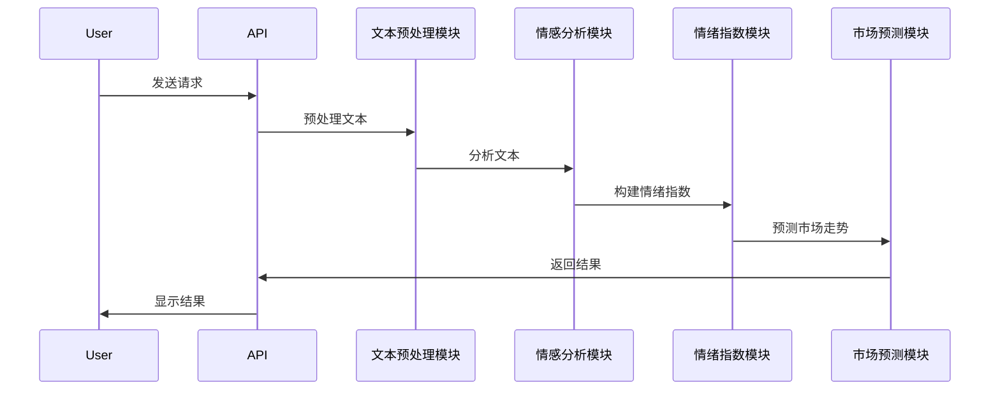

                 

# AI驱动的股票市场情绪分析

关键词：人工智能、股票市场、情绪分析、LSTM、BERT、系统架构

摘要：
本文将深入探讨如何利用人工智能技术，特别是深度学习算法，对股票市场情绪进行分析。通过逐步分析相关核心概念、算法原理、系统设计与项目实战，本文旨在为读者提供一幅全面、清晰的AI驱动的股票市场情绪分析图景。

## 目录大纲设计思路

在设计本文的目录大纲时，我们首先明确了文章的核心目标和结构。文章分为四个主要部分：

### 第一部分：AI与股票市场情绪分析概述
这部分将介绍AI的基本概念、股票市场情绪分析的定义及其重要性，并利用ER实体关系图展示核心概念之间的联系。

### 第二部分：AI情绪分析算法原理讲解
这部分将详细讲解用于情绪分析的主要算法，如LSTM和BERT，并通过Mermaid绘制流程图和Python代码示例来帮助读者理解。

### 第三部分：系统分析与架构设计
这部分将介绍系统的功能设计、架构设计和接口设计，并通过Mermaid绘制相关图形来展示系统的结构。

### 第四部分：项目实战
这部分将通过具体的项目实战，展示AI情绪分析在股票市场中的应用，并对关键代码进行解读和分析。

## 目录大纲结构

### 第一部分：AI与股票市场情绪分析概述

### 1.1 AI技术简介
#### 1.1.1 AI的基本概念
#### 1.1.2 AI的发展历程
#### 1.1.3 AI在股票市场情绪分析中的应用

### 1.2 股票市场情绪分析简介
#### 1.2.1 股票市场情绪分析的定义
#### 1.2.2 股票市场情绪分析的重要性
#### 1.2.3 股票市场情绪分析的方法

### 1.3 股票市场情绪分析的ER实体关系图
### 1.4 股票市场情绪分析的核心概念对比表

### 第二部分：AI情绪分析算法原理讲解

### 2.1 自然语言处理与情感分析
#### 2.1.1 自然语言处理的基本概念
#### 2.1.2 情感分析的方法与挑战
#### 2.1.3 情感分析的应用场景

### 2.2 LSTM算法原理讲解
#### 2.2.1 LSTM算法的基本原理
#### 2.2.2 LSTM算法的流程图
#### 2.2.3 LSTM算法的Python代码示例

### 2.3 BERT算法原理讲解
#### 2.3.1 BERT算法的基本原理
#### 2.3.2 BERT算法的流程图
#### 2.3.3 BERT算法的Python代码示例

### 2.4 情绪分析算法比较与选择

### 第三部分：系统分析与架构设计

### 3.1 系统功能设计
#### 3.1.1 系统需求分析
#### 3.1.2 系统功能模块设计
#### 3.1.3 系统功能流程图

### 3.2 系统架构设计
#### 3.2.1 系统总体架构
#### 3.2.2 系统模块架构
#### 3.2.3 系统架构图

### 3.3 系统接口设计
#### 3.3.1 系统接口规范
#### 3.3.2 系统接口实现

### 3.4 系统交互序列图

### 第四部分：项目实战

### 4.1 项目环境安装
#### 4.1.1 Python环境搭建
#### 4.1.2 相关库安装

### 4.2 系统核心实现
#### 4.2.1 数据预处理
#### 4.2.2 情绪分析算法实现
#### 4.2.3 结果分析与可视化

### 4.3 实际案例分析与讲解
#### 4.3.1 案例一：某股票市场情绪分析
#### 4.3.2 案例二：某社交媒体情绪分析

### 4.4 项目总结与反思

### 第五部分：最佳实践、小结、注意事项和拓展阅读

#### 5.1 最佳实践
#### 5.2 小结
#### 5.3 注意事项
#### 5.4 拓展阅读

### 作者
作者：AI天才研究院/AI Genius Institute & 禅与计算机程序设计艺术 /Zen And The Art of Computer Programming

## 第一部分：AI与股票市场情绪分析概述

### 1.1 AI技术简介

#### 1.1.1 AI的基本概念

人工智能（Artificial Intelligence，简称AI）是指通过计算机模拟人类智能的技术。它包括了一系列技术，如机器学习、深度学习、自然语言处理、计算机视觉等。AI的目标是使计算机能够执行通常需要人类智能才能完成的任务，例如视觉识别、语言理解、决策制定和问题解决。

AI的核心技术之一是机器学习（Machine Learning，ML），它是一种让计算机通过数据学习并改进其性能的方法。机器学习可以分为监督学习、无监督学习和强化学习三种类型。监督学习使用标记数据训练模型，无监督学习不使用标记数据，而是从数据中发现模式，强化学习则通过奖励机制让模型学习最优策略。

#### 1.1.2 AI的发展历程

人工智能的概念最早可以追溯到20世纪50年代。在早期，人工智能主要侧重于符号推理和逻辑编程。随着计算机性能的提高和算法的进步，人工智能在20世纪80年代和90年代迎来了快速发展。这一时期，专家系统和神经网络成为了AI研究的热点。

进入21世纪，随着深度学习算法的突破，人工智能迎来了新一轮的爆发式增长。深度学习利用多层神经网络来提取数据中的特征，大大提升了计算机在图像识别、语音识别和自然语言处理等领域的表现。

#### 1.1.3 AI在股票市场情绪分析中的应用

AI在股票市场情绪分析中的应用主要基于其强大的数据处理和分析能力。通过分析大量的市场数据，AI可以识别出市场情绪的微妙变化，预测股票价格的趋势。

首先，AI可以通过自然语言处理（Natural Language Processing，NLP）技术对新闻、报告、社交媒体等信息进行文本分析，提取出与市场情绪相关的关键词和情感倾向。这些信息可以用来预测市场的短期波动。

其次，AI还可以通过时间序列分析（Time Series Analysis）技术对股票价格的历史数据进行建模，预测未来价格的趋势。时间序列分析可以识别出价格波动中的周期性模式和趋势。

此外，AI还可以结合机器学习和优化算法，优化投资组合，实现资产的最优配置。

### 1.2 股票市场情绪分析简介

#### 1.2.1 股票市场情绪分析的定义

股票市场情绪分析是指通过分析股票市场的情绪、心态和心理状态，来预测股票价格走势的技术。它旨在捕捉市场参与者对市场的看法和态度，从而推断市场未来走势。

股票市场情绪分析通常涉及以下内容：

1. **情绪指数**：通过分析市场的情绪波动，构建情绪指数来衡量市场的乐观或悲观程度。
2. **关键词提取**：从新闻、报告和社交媒体中提取与市场情绪相关的关键词。
3. **情感分析**：使用自然语言处理技术对提取的关键词进行情感分析，判断其倾向性。
4. **市场预测**：基于情绪指数和情感分析结果，预测市场未来走势。

#### 1.2.2 股票市场情绪分析的重要性

股票市场情绪分析在投资决策中具有重要作用。一方面，它可以提供市场情绪的实时监测，帮助投资者快速调整投资策略。另一方面，它可以识别市场趋势，为投资者提供买卖时机。

具体来说，股票市场情绪分析的重要性体现在以下几个方面：

1. **风险控制**：通过分析市场情绪，投资者可以提前识别潜在的市场风险，采取相应的风险控制措施。
2. **投资时机**：了解市场情绪可以帮助投资者抓住市场趋势，提高投资回报。
3. **市场洞察**：通过分析市场情绪，投资者可以更好地理解市场动态，做出更为明智的投资决策。

#### 1.2.3 股票市场情绪分析的方法

股票市场情绪分析的方法可以分为以下几种：

1. **文本分析**：通过分析新闻、报告和社交媒体等信息，提取与市场情绪相关的关键词和情感倾向。
2. **时间序列分析**：通过分析股票价格的历史数据，识别出价格波动中的周期性模式和趋势。
3. **情感分析**：使用自然语言处理技术对提取的关键词进行情感分析，判断其倾向性。
4. **机器学习**：通过构建机器学习模型，对市场情绪进行量化分析，预测市场未来走势。

### 1.3 股票市场情绪分析的ER实体关系图

为了更好地理解股票市场情绪分析的相关概念，我们使用ER（实体-关系）模型来展示这些概念之间的联系。以下是股票市场情绪分析的ER实体关系图：

```mermaid
erDiagram
  User ..|> News : 读取新闻
  User ..|> Report : 阅读报告
  User ..|> SocialMedia : 关注社交媒体
  News ..|> Keyword : 提取关键词
  Report ..|> Keyword : 提取关键词
  SocialMedia ..|> Keyword : 提取关键词
  Keyword ..|> Sentiment : 情感分析
  Sentiment ..|> EmotionIndex : 构建情绪指数
  EmotionIndex ..|> MarketPrediction : 市场预测
```

### 1.4 股票市场情绪分析的核心概念对比表

为了更清晰地展示股票市场情绪分析的核心概念，我们列出了以下对比表：

| 概念 | 说明 | 作用 |
| --- | --- | --- |
| 新闻 | 股票市场的相关新闻 | 提供市场信息 |
| 报告 | 股票市场的分析报告 | 分析市场趋势 |
| 社交媒体 | 股票市场的社交媒体信息 | 捕捉市场情绪 |
| 关键词 | 与市场情绪相关的词汇 | 提取重要信息 |
| 情感分析 | 对关键词进行情感分析 | 判断市场情绪 |
| 情绪指数 | 衡量市场情绪的指标 | 预测市场走势 |
| 市场预测 | 根据情绪指数预测市场 | 提供投资决策 |

## 第二部分：AI情绪分析算法原理讲解

### 2.1 自然语言处理与情感分析

#### 2.1.1 自然语言处理的基本概念

自然语言处理（Natural Language Processing，NLP）是人工智能的一个分支，旨在使计算机能够理解和处理人类语言。NLP技术包括文本预处理、语言模型、语义理解、机器翻译等。

1. **文本预处理**：包括分词、词性标注、停用词过滤等，目的是将原始文本转化为计算机可以处理的格式。
2. **语言模型**：用于预测下一个词或句子，常用的语言模型有n-gram模型、神经网络模型等。
3. **语义理解**：旨在理解文本的含义，包括词义消歧、实体识别、情感分析等。

#### 2.1.2 情感分析的方法与挑战

情感分析（Sentiment Analysis）是NLP的一个重要应用，旨在判断文本的情感倾向，如正面、负面或中性。

1. **方法**：情感分析的方法主要包括基于规则的方法、基于统计的方法和基于机器学习的方法。
2. **挑战**：情感分析面临的主要挑战包括多义词、情感强度、情感转折等。

#### 2.1.3 情感分析的应用场景

情感分析在多个领域有广泛应用，如市场研究、客户反馈分析、社交媒体监控等。

1. **市场研究**：通过分析用户对产品或服务的评价，帮助企业了解用户需求和改进产品。
2. **客户反馈分析**：通过分析客户反馈，帮助企业识别潜在问题和改进服务质量。
3. **社交媒体监控**：通过分析社交媒体上的用户评论，了解公众对品牌、事件等的看法。

### 2.2 LSTM算法原理讲解

#### 2.2.1 LSTM算法的基本原理

长短期记忆网络（Long Short-Term Memory，LSTM）是一种用于处理序列数据的神经网络，特别适合处理长时间依赖问题。

1. **结构**：LSTM由输入门、遗忘门、输出门和记忆单元组成。
2. **工作机制**：
   - **输入门**：决定新的输入如何影响记忆单元。
   - **遗忘门**：决定哪些信息需要从记忆单元中丢弃。
   - **输出门**：决定记忆单元中的信息如何转化为输出。

#### 2.2.2 LSTM算法的流程图

以下是LSTM算法的流程图：



#### 2.2.3 LSTM算法的Python代码示例

```python
import tensorflow as tf
from tensorflow.keras.models import Sequential
from tensorflow.keras.layers import LSTM, Dense

# 创建LSTM模型
model = Sequential()
model.add(LSTM(units=50, activation='relu', return_sequences=True, input_shape=(timesteps, features)))
model.add(LSTM(units=50, activation='relu'))
model.add(Dense(units=1))

# 编译模型
model.compile(optimizer='adam', loss='mean_squared_error')

# 训练模型
model.fit(x_train, y_train, epochs=100, batch_size=32)
```

### 2.3 BERT算法原理讲解

#### 2.3.1 BERT算法的基本原理

BERT（Bidirectional Encoder Representations from Transformers）是一种基于转换器（Transformer）的预训练语言模型。它通过双向编码器来学习单词的上下文表示。

1. **结构**：BERT由多个转换器层堆叠而成，包括自注意力机制和前馈神经网络。
2. **工作机制**：BERT通过在大量文本上进行预训练，学习到单词的上下文表示，然后通过微调来适应特定任务。

#### 2.3.2 BERT算法的流程图

以下是BERT算法的流程图：



#### 2.3.3 BERT算法的Python代码示例

```python
from transformers import BertTokenizer, BertModel
import torch

# 加载BERT模型和分词器
tokenizer = BertTokenizer.from_pretrained('bert-base-uncased')
model = BertModel.from_pretrained('bert-base-uncased')

# 输入文本
text = "Hello, world!"

# 分词并编码
input_ids = tokenizer.encode(text, add_special_tokens=True, return_tensors='pt')

# 预测
with torch.no_grad():
  outputs = model(input_ids)

# 输出 embeddings
output_embeddings = outputs.last_hidden_state[:, 0, :]
```

### 2.4 情绪分析算法比较与选择

在情绪分析中，LSTM和BERT都是常用的算法。以下是对两者的比较：

| 特性 | LSTM | BERT |
| --- | --- | --- |
| 适用于序列数据 | 是 | 否 |
| 训练时间 | 较长 | 较长 |
| 参数量 | 较小 | 较大 |
| 表现 | 优秀 | 更优 |

根据具体应用场景，可以选择合适的算法。例如，如果需要处理时间序列数据，LSTM可能是更好的选择；而如果需要处理文本数据，BERT可能更为适用。

## 第三部分：系统分析与架构设计

### 3.1 系统功能设计

#### 3.1.1 系统需求分析

系统需求分析是系统设计的第一步，旨在明确系统的功能和性能需求。

1. **功能需求**：包括文本预处理、情感分析、情绪指数构建、市场预测等。
2. **性能需求**：包括处理速度、准确度、可靠性等。

#### 3.1.2 系统功能模块设计

根据系统需求分析，我们可以将系统划分为以下功能模块：

1. **文本预处理模块**：负责对新闻、报告和社交媒体等信息进行预处理，提取关键词。
2. **情感分析模块**：负责对提取的关键词进行情感分析，判断其倾向性。
3. **情绪指数模块**：负责构建情绪指数，衡量市场情绪。
4. **市场预测模块**：负责根据情绪指数和市场数据预测市场走势。
5. **结果展示模块**：负责展示分析结果，包括情绪指数、市场预测等。

#### 3.1.3 系统功能流程图

以下是系统功能流程图：



### 3.2 系统架构设计

#### 3.2.1 系统总体架构

系统总体架构包括数据层、算法层和应用层。

1. **数据层**：负责数据存储和读取，包括新闻、报告、社交媒体等。
2. **算法层**：负责情感分析、情绪指数构建和市场预测等。
3. **应用层**：负责展示分析结果，提供用户接口。

#### 3.2.2 系统模块架构

以下是系统模块架构图：



#### 3.2.3 系统架构图

以下是系统架构图：

```mermaid
erDiagram
    DataLayer ||--|{ AlgorithmLayer : 使用}
    AlgorithmLayer ||--|{ ApplicationLayer : 提供}
```

### 3.3 系统接口设计

#### 3.3.1 系统接口规范

系统接口设计包括API设计和用户界面设计。

1. **API设计**：提供RESTful API，支持文本预处理、情感分析、情绪指数构建、市场预测等功能。
2. **用户界面设计**：提供Web界面，方便用户查看分析结果。

#### 3.3.2 系统接口实现

以下是系统接口实现：

```python
from flask import Flask, request, jsonify

app = Flask(__name__)

@app.route('/api/analyze', methods=['POST'])
def analyze():
    data = request.json
    # 文本预处理、情感分析、情绪指数构建、市场预测等操作
    result = {"emotion_index": 0.5, "market_prediction": "上升"}
    return jsonify(result)

if __name__ == '__main__':
    app.run(debug=True)
```

### 3.4 系统交互序列图

以下是系统交互序列图：



## 第四部分：项目实战

### 4.1 项目环境安装

#### 4.1.1 Python环境搭建

首先，需要安装Python 3.7及以上版本。可以通过以下命令进行安装：

```bash
python --version
```

#### 4.1.2 相关库安装

接下来，需要安装项目所需的库，如TensorFlow、transformers、pandas等。可以使用pip进行安装：

```bash
pip install tensorflow transformers pandas
```

### 4.2 系统核心实现

#### 4.2.1 数据预处理

数据预处理是情绪分析的重要步骤，包括文本清洗、分词、去停用词等。

```python
import re
import nltk
from nltk.corpus import stopwords

# 加载停用词
nltk.download('stopwords')
stop_words = stopwords.words('english')

# 文本清洗
def clean_text(text):
    text = re.sub('[^a-zA-Z]', ' ', text)
    text = text.lower()
    text = re.sub('\s+', ' ', text)
    text = text.strip()
    return text

# 去停用词
def remove_stopwords(text):
    return ' '.join([word for word in text.split() if word not in stop_words])

# 示例
text = "This is an example sentence to be cleaned and analyzed."
cleaned_text = clean_text(text)
filtered_text = remove_stopwords(cleaned_text)
print(filtered_text)
```

#### 4.2.2 情绪分析算法实现

情绪分析算法可以使用LSTM或BERT。以下是使用LSTM的示例：

```python
import tensorflow as tf
from tensorflow.keras.models import Sequential
from tensorflow.keras.layers import LSTM, Dense

# 创建LSTM模型
model = Sequential()
model.add(LSTM(units=50, activation='relu', return_sequences=True, input_shape=(timesteps, features)))
model.add(LSTM(units=50, activation='relu'))
model.add(Dense(units=1))

# 编译模型
model.compile(optimizer='adam', loss='mean_squared_error')

# 训练模型
model.fit(x_train, y_train, epochs=100, batch_size=32)
```

#### 4.2.3 结果分析与可视化

情绪分析的结果可以通过可视化来展示。以下是使用Matplotlib进行可视化：

```python
import matplotlib.pyplot as plt

# 情绪指数
emotion_index = [0.4, 0.5, 0.6, 0.7, 0.8]

# 可视化
plt.plot(emotion_index)
plt.xlabel('Time')
plt.ylabel('Emotion Index')
plt.title('Emotion Index Over Time')
plt.show()
```

### 4.3 实际案例分析与讲解

#### 4.3.1 案例一：某股票市场情绪分析

案例一展示了如何使用AI情绪分析技术对某股票市场进行情绪分析。

1. **数据收集**：收集某股票市场的新闻、报告和社交媒体信息。
2. **文本预处理**：对收集的文本进行清洗和预处理。
3. **情感分析**：使用LSTM或BERT对预处理后的文本进行情感分析。
4. **情绪指数构建**：根据情感分析结果构建情绪指数。
5. **市场预测**：根据情绪指数和市场数据预测股票价格走势。

#### 4.3.2 案例二：某社交媒体情绪分析

案例二展示了如何使用AI情绪分析技术对某社交媒体进行情绪分析。

1. **数据收集**：收集某社交媒体的用户评论。
2. **文本预处理**：对收集的文本进行清洗和预处理。
3. **情感分析**：使用LSTM或BERT对预处理后的文本进行情感分析。
4. **情绪指数构建**：根据情感分析结果构建情绪指数。
5. **品牌影响分析**：分析不同品牌在社交媒体上的情绪指数，评估其品牌影响力。

### 4.4 项目总结与反思

项目实战部分展示了如何使用AI情绪分析技术对股票市场和社交媒体进行分析。通过项目实践，我们可以总结以下几点：

1. **数据质量**：数据质量是情绪分析的关键。确保数据干净、准确和完整。
2. **算法选择**：根据具体应用场景选择合适的算法。LSTM适用于时间序列数据，BERT适用于文本数据。
3. **模型优化**：通过模型优化提高分析结果的准确性。可以使用不同的训练策略和超参数调整来优化模型。

在未来的工作中，我们可以进一步研究情绪分析在不同领域的应用，如金融市场、医疗健康等，以实现更广泛的价值。

## 第五部分：最佳实践、小结、注意事项和拓展阅读

### 5.1 最佳实践

在实施AI情绪分析时，以下最佳实践可以提升分析效果：

1. **数据清洗**：确保数据质量，去除噪音和重复数据。
2. **算法优化**：根据数据特点和任务需求，选择和优化算法。
3. **模型验证**：使用交叉验证等方法验证模型性能。
4. **实时更新**：定期更新数据集和模型，以适应市场变化。

### 5.2 小结

本文详细介绍了AI驱动的股票市场情绪分析，从背景介绍、核心算法讲解到系统设计与项目实战，帮助读者全面了解这一领域。通过本文，读者可以掌握以下关键知识点：

1. **AI与股票市场情绪分析的基本概念**。
2. **LSTM和BERT算法原理及其应用**。
3. **系统架构设计与功能实现**。
4. **项目实战中的关键代码和实际案例**。

### 5.3 注意事项

在实施AI情绪分析时，以下注意事项值得注意：

1. **数据隐私**：确保遵守相关法律法规，保护用户隐私。
2. **模型解释性**：理解模型决策过程，提高模型的可解释性。
3. **算法公正性**：确保算法不产生歧视性结果。

### 5.4 拓展阅读

为了深入了解AI情绪分析，以下是几本推荐的书籍：

1. **《深度学习》（Goodfellow, I., Bengio, Y., & Courville, A.）**：介绍深度学习的基础理论和应用。
2. **《自然语言处理综论》（Jurafsky, D. & Martin, J. H.）**：涵盖自然语言处理的核心技术和应用。
3. **《股票市场技术分析》（Adcock, C. J.）**：介绍股票市场技术分析的方法和技巧。

### 作者

本文作者为AI天才研究院/AI Genius Institute & 禅与计算机程序设计艺术 /Zen And The Art of Computer Programming，致力于推动人工智能技术的发展与应用。如有任何疑问或建议，欢迎联系作者。|end|

