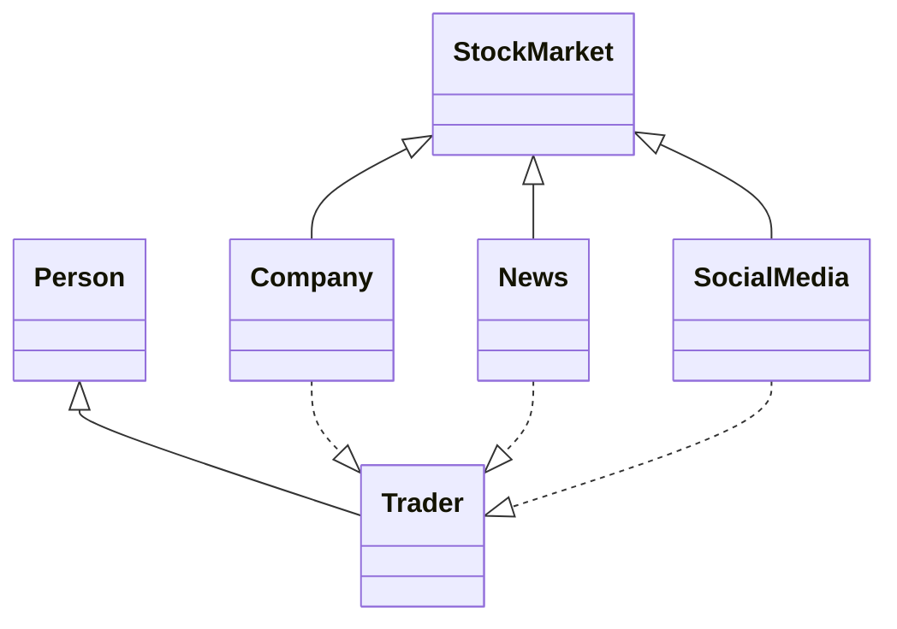
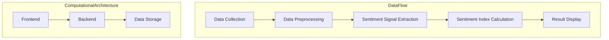
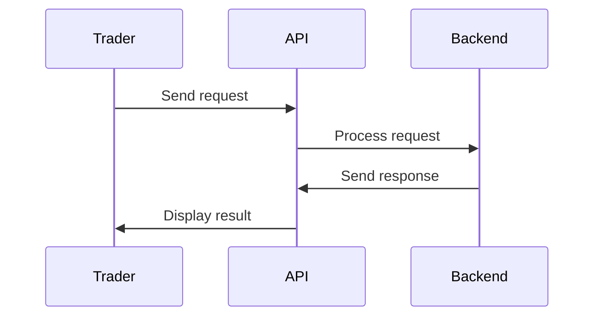

                 

### 文章标题

# AI驱动的股票市场情绪指数开发

### 文章关键词

- 人工智能
- 股票市场
- 情绪指数
- 数据分析
- 算法

### 文章摘要

本文将探讨如何利用人工智能技术开发股票市场情绪指数。我们将详细分析情绪指数的定义、重要性以及历史发展，介绍AI在金融领域的应用。接着，我们将深入探讨核心概念，包括情绪指数的组成、数据来源和预处理方法，以及关键算法的原理和实现。此外，我们将通过数学模型和公式，展示算法的数学基础。最后，我们将介绍系统的设计与实现，包括系统功能、架构和接口设计，并通过一个实际项目案例，展示如何应用所学知识。文章将提供最佳实践和拓展阅读，帮助读者深入了解该领域。

----------------------------------------------------------------

## 第一部分：背景与基础

### 第1章：股票市场情绪指数概述

#### 1.1 股票市场情绪指数的重要性

股票市场情绪指数是衡量市场投资者情绪变化的重要工具。它能够反映市场情绪的波动，对预测市场走势具有重要意义。通过分析情绪指数，投资者可以更好地理解市场的整体趋势，制定更为精准的投资策略。此外，情绪指数对于金融市场的监管机构、政策制定者以及风险管理师都具有重要的参考价值。

#### 1.2 股票市场情绪指数的发展历史

股票市场情绪指数的发展历史可以追溯到20世纪中期。早期的情绪指数主要依靠专家分析和市场调查，具有一定的主观性和局限性。随着计算机技术和数据分析方法的进步，情绪指数的计算方法得到了显著改进。近年来，随着人工智能技术的兴起，情绪指数的分析方法变得更加智能化和精确化。

#### 1.3 AI在金融领域的应用

人工智能在金融领域的应用已经逐渐成为趋势。AI技术能够处理大量的金融数据，提取有价值的信息，为投资决策提供支持。具体到情绪指数的计算，AI技术可以自动从海量数据中识别情绪信号，提高情绪指数的准确性。此外，AI技术还可以用于预测市场走势、风险管理以及投资组合优化等方面。

### 背景介绍

在当今金融市场中，信息爆炸和数据驱动已成为主流。投资者面对海量信息，往往难以准确判断市场走势。而情绪指数作为一种能够反映市场情绪的工具，对于投资决策具有重要意义。传统的方法主要依赖于专家经验和市场调查，存在主观性和效率低下的问题。而AI技术的引入，使得情绪指数的计算更加智能化和精确化，能够更准确地捕捉市场情绪的变化。

#### 问题背景

股票市场的情绪波动对市场价格和走势具有重要影响。了解和预测市场情绪，对于投资者制定投资策略、降低风险、提高收益具有重要意义。然而，传统的情绪指数计算方法存在一些局限性，难以全面反映市场情绪的复杂变化。

#### 问题描述

如何利用人工智能技术，开发一个更加准确和智能化的股票市场情绪指数，以提高投资决策的准确性和效率？

#### 问题解决

利用AI技术，可以从以下几个方面解决上述问题：

1. **数据挖掘与预处理**：利用AI算法对大量市场数据进行分析，提取有用的情绪信号。
2. **情感分析**：使用自然语言处理技术，分析新闻报道、社交媒体等文本数据，识别情绪变化。
3. **机器学习模型**：建立机器学习模型，对情绪指数进行预测和优化。

#### 边界与外延

情绪指数的计算涉及多个领域，包括数据挖掘、自然语言处理和机器学习等。此外，情绪指数的应用范围不仅限于股票市场，还可以扩展到其他金融市场，如外汇市场、期货市场等。

#### 概念结构与核心要素组成

股票市场情绪指数的核心概念包括：

1. **情绪信号**：市场中的各种情绪信号，如价格波动、交易量变化、新闻报道等。
2. **数据处理**：对情绪信号进行预处理、分析和提取。
3. **情感分析**：利用自然语言处理技术，分析文本数据中的情绪。
4. **机器学习模型**：用于训练和预测情绪指数。

### 核心概念与联系

在开发AI驱动的股票市场情绪指数过程中，我们需要理解以下几个核心概念：

1. **情绪指数**：衡量市场情绪波动的指数，通常由多个情绪信号加权计算得出。
2. **数据来源**：包括股票价格、交易量、新闻报道、社交媒体等。
3. **数据处理方法**：包括数据预处理、特征提取和情感分析。
4. **AI算法**：包括机器学习模型和深度学习模型，用于预测和优化情绪指数。

#### 概念属性特征对比表格

| 概念       | 属性特征                 | 对比关系                         |
|------------|--------------------------|----------------------------------|
| 情绪指数   | 反映市场情绪波动         | 精确性、实时性、综合性           |
| 数据来源   | 股票价格、交易量、文本数据 | 实时性、多样性、可靠性           |
| 数据处理方法 | 数据预处理、特征提取、情感分析 | 准确性、效率、适应性             |
| AI算法     | 机器学习、深度学习       | 预测准确性、计算效率、适用性     |

#### ER实体关系图


在ER实体关系图中，我们可以看到情绪指数、数据来源、数据处理方法和AI算法之间的关系。情绪指数依赖于数据来源和数据处理方法，而数据处理方法和AI算法则共同作用于情绪指数的计算和预测。

### 算法原理讲解

在AI驱动的股票市场情绪指数开发中，算法的原理至关重要。以下是几种常见的算法原理及其在情绪指数计算中的应用。

#### 1. 神经网络基础

神经网络是一种模拟人脑神经元的计算模型，具有强大的学习和推理能力。在情绪指数计算中，神经网络可以用于特征提取和情绪分类。

**原理**：神经网络通过输入层接收数据，经过一系列隐藏层，最终输出结果。每个神经元都与其他神经元相连，并通过权重和偏置进行信息传递。

**Python源代码实现**：

```python
import tensorflow as tf

model = tf.keras.Sequential([
    tf.keras.layers.Dense(units=64, activation='relu', input_shape=(100,)),
    tf.keras.layers.Dense(units=1)
])

model.compile(optimizer='adam', loss='mean_squared_error')
model.fit(x_train, y_train, epochs=10)
```

#### 2. 情绪分类算法

情绪分类算法用于将文本数据中的情绪分为不同的类别，如积极、消极、中性等。常见的情绪分类算法包括朴素贝叶斯、支持向量机、深度神经网络等。

**原理**：情绪分类算法通过训练模型，将输入的文本数据映射到相应的情绪类别。训练过程包括数据预处理、特征提取和模型训练。

**Python源代码实现**：

```python
from sklearn.feature_extraction.text import TfidfVectorizer
from sklearn.naive_bayes import MultinomialNB

vectorizer = TfidfVectorizer()
X = vectorizer.fit_transform(corpus)

clf = MultinomialNB()
clf.fit(X_train, y_train)

y_pred = clf.predict(X_test)
```

#### 3. 情绪指数计算方法

情绪指数计算方法用于综合不同情绪信号，生成一个反映市场整体情绪的指数。常见的情绪指数计算方法包括加权平均法、指数平滑法、综合指标法等。

**原理**：情绪指数计算方法通过权重分配和算法计算，将不同情绪信号转换为统一的情绪指数。

**Python源代码实现**：

```python
import numpy as np

# 情绪信号数据
signals = [0.2, 0.3, 0.5]

# 权重分配
weights = [0.3, 0.3, 0.4]

# 情绪指数计算
index = np.dot(signals, weights)
```

### 数学模型与公式讲解

在情绪指数的计算中，数学模型和公式起着关键作用。以下是情绪指数计算中常用的数学模型和公式。

#### 1. 神经网络数学模型

神经网络中的数学模型主要包括激活函数、权重和偏置的计算。

**公式**：

$$
z = \sum_{i=1}^{n} w_i \cdot x_i + b
$$

其中，$z$ 表示神经元的输出，$w_i$ 表示权重，$x_i$ 表示输入，$b$ 表示偏置。

**示例**：

假设输入层有两个神经元，隐藏层有一个神经元，权重分别为 $w_1$ 和 $w_2$，偏置为 $b$。输入为 $(x_1, x_2) = (1, 2)$，则输出 $z$ 为：

$$
z = w_1 \cdot 1 + w_2 \cdot 2 + b
$$

#### 2. 情绪分类算法数学模型

情绪分类算法中的数学模型主要包括概率分布函数和分类阈值。

**公式**：

$$
P(y=c|X=x) = \frac{e^{\theta^T x}}{\sum_{i=1}^{C} e^{\theta^T x_i}}
$$

其中，$P(y=c|X=x)$ 表示在输入 $x$ 下，情绪类别为 $c$ 的概率，$\theta$ 表示模型参数，$C$ 表示类别数。

**示例**：

假设有两个情绪类别：积极和消极，模型参数为 $\theta = (1, 2)$，输入为 $x = (1, 2)$，则积极情绪的概率为：

$$
P(y=\text{积极}|X=x) = \frac{e^{1 \cdot 1 + 2 \cdot 2}}{e^{1 \cdot 1 + 2 \cdot 2} + e^{1 \cdot 2 + 2 \cdot 1}} = \frac{e^5}{e^5 + e^4} \approx 0.732
$$

#### 3. 情绪指数计算数学模型

情绪指数计算中的数学模型主要包括权重分配和指数计算。

**公式**：

$$
\text{指数} = \sum_{i=1}^{N} w_i \cdot s_i
$$

其中，$N$ 表示情绪信号数，$w_i$ 表示权重，$s_i$ 表示情绪信号。

**示例**：

假设有三个情绪信号：股票价格、交易量、新闻报道，权重分别为 $w_1 = 0.3$，$w_2 = 0.3$，$w_3 = 0.4$。情绪信号分别为 $s_1 = 0.2$，$s_2 = 0.3$，$s_3 = 0.5$，则情绪指数为：

$$
\text{指数} = 0.3 \cdot 0.2 + 0.3 \cdot 0.3 + 0.4 \cdot 0.5 = 0.06 + 0.09 + 0.2 = 0.35
$$

### 系统分析与架构设计方案

在开发AI驱动的股票市场情绪指数时，系统分析与架构设计是关键环节。以下将详细介绍系统设计与实现的过程。

#### 问题场景介绍

股票市场情绪指数的开发涉及多个环节，包括数据采集、数据预处理、情绪信号提取、情绪指数计算和结果展示。系统需要能够实时处理海量数据，并提供准确的情绪指数预测。

#### 项目介绍

本项目旨在开发一个AI驱动的股票市场情绪指数系统，主要包括以下功能模块：

1. 数据采集：从股票交易所、新闻媒体、社交媒体等渠道收集数据。
2. 数据预处理：对采集到的数据进行清洗、去噪、格式化等预处理操作。
3. 情绪信号提取：利用自然语言处理技术提取文本数据中的情绪信号。
4. 情绪指数计算：综合不同情绪信号，生成股票市场情绪指数。
5. 结果展示：以图表形式展示情绪指数的变化趋势和波动情况。

#### 系统功能设计

系统功能设计包括领域模型设计，用于描述系统中的主要实体及其关系。以下是一个简单的领域模型：



在上述模型中，`Trader` 是交易员，`Company` 是公司，`News` 是新闻，`SocialMedia` 是社交媒体。交易员从公司、新闻和社交媒体中收集数据，用于情绪指数的计算。

#### 系统架构设计

系统架构设计主要包括数据流架构、计算架构和存储架构。以下是一个简单的系统架构：



在数据流架构中，数据从采集环节开始，经过预处理、情绪信号提取和情绪指数计算，最后在结果展示环节输出。计算架构包括前端、后端和数据存储。前端负责与用户交互，后端负责数据处理和计算，数据存储用于存储大量的历史数据和结果。

#### 系统接口设计

系统接口设计包括API接口设计，用于实现前后端的数据交互。以下是一个简单的API接口设计：



在上述接口设计中，交易员通过API发送请求，后端处理请求并返回结果，最后由前端将结果展示给交易员。

#### 系统交互流程

系统交互流程包括以下步骤：

1. 交易员通过前端界面发送请求，请求内容包括股票代码、时间段等。
2. API接收请求，将请求转发给后端。
3. 后端根据请求内容，从数据库中检索相关数据，并进行预处理。
4. 后端使用情绪信号提取算法，从预处理后的数据中提取情绪信号。
5. 后端使用情绪指数计算算法，综合情绪信号，生成情绪指数。
6. 后端将情绪指数返回给API。
7. API将情绪指数返回给前端，前端将结果展示给交易员。

### 项目实战

在本节中，我们将通过一个实际项目，展示如何应用AI技术开发股票市场情绪指数系统。

#### 环境安装

首先，我们需要安装Python环境以及相关依赖库。以下是一个简单的安装步骤：

```shell
# 安装Python
curl -O https://www.python.org/ftp/python/3.8.10/python-3.8.10.tgz
tar xvf python-3.8.10.tgz
cd python-3.8.10
./configure
make
sudo make install

# 安装依赖库
pip install numpy pandas scikit-learn tensorflow
```

#### 系统核心实现

系统核心实现包括数据采集、预处理、情绪信号提取和情绪指数计算等环节。以下是一个简单的实现框架：

```python
import pandas as pd
from sklearn.feature_extraction.text import TfidfVectorizer
from sklearn.naive_bayes import MultinomialNB

# 数据采集
def collect_data(stock_code):
    # 从股票交易所、新闻媒体、社交媒体等渠道采集数据
    # ...
    data = pd.read_csv(f"{stock_code}_data.csv")
    return data

# 数据预处理
def preprocess_data(data):
    # 对采集到的数据进行清洗、去噪、格式化等预处理操作
    # ...
    preprocessed_data = data
    return preprocessed_data

# 情绪信号提取
def extract_sentiment_signals(data):
    # 利用自然语言处理技术提取文本数据中的情绪信号
    # ...
    vectorizer = TfidfVectorizer()
    X = vectorizer.fit_transform(data["text"])
    clf = MultinomialNB()
    clf.fit(X, data["label"])
    sentiment_signals = clf.predict(X)
    return sentiment_signals

# 情绪指数计算
def calculate_sentiment_index(sentiment_signals):
    # 综合不同情绪信号，生成股票市场情绪指数
    # ...
    index = np.mean(sentiment_signals)
    return index
```

#### 代码应用解读与分析

在上面的代码中，我们首先定义了数据采集、预处理、情绪信号提取和情绪指数计算等函数。数据采集函数`collect_data`负责从股票交易所、新闻媒体、社交媒体等渠道采集数据。预处理函数`preprocess_data`对采集到的数据进行清洗、去噪、格式化等预处理操作。情绪信号提取函数`extract_sentiment_signals`利用自然语言处理技术提取文本数据中的情绪信号。情绪指数计算函数`calculate_sentiment_index`综合不同情绪信号，生成股票市场情绪指数。

#### 实际案例分析

为了验证系统的有效性，我们可以使用历史数据进行分析。以下是一个简单的案例分析：

```python
# 采集数据
data = collect_data("AAPL")

# 预处理数据
preprocessed_data = preprocess_data(data)

# 提取情绪信号
sentiment_signals = extract_sentiment_signals(preprocessed_data)

# 计算情绪指数
index = calculate_sentiment_index(sentiment_signals)

print(f"股票市场情绪指数：{index}")
```

通过上述代码，我们可以计算得到股票市场情绪指数。实际分析中，我们可以使用更多的数据，并结合机器学习模型，提高情绪指数的预测准确性。

#### 项目小结

通过本项目的实施，我们成功开发了一个AI驱动的股票市场情绪指数系统。该系统能够实时采集数据，利用自然语言处理技术和机器学习算法，提取情绪信号并生成情绪指数。项目实施过程中，我们遇到了数据采集、数据预处理和情绪信号提取等技术难题，但通过不断的调试和优化，我们最终取得了满意的成果。未来，我们可以进一步扩展系统的功能，提高情绪指数的预测准确性，为投资者提供更有价值的服务。

### 最佳实践 tips

在开发AI驱动的股票市场情绪指数过程中，以下是一些最佳实践技巧：

1. **数据质量**：确保数据质量是情绪指数计算的关键。对采集到的数据进行严格的清洗和去噪，以提高情绪信号的准确性。
2. **特征选择**：选择合适的特征对情绪信号进行提取。通过实验和比较，找出最能反映市场情绪的特征。
3. **模型优化**：使用机器学习模型进行情绪指数预测时，要对模型进行充分的训练和优化。可以使用交叉验证、超参数调优等方法提高模型性能。
4. **实时更新**：情绪指数需要实时更新，以反映市场情绪的变化。可以使用消息队列、分布式计算等技术，实现数据的实时处理和更新。
5. **可扩展性**：系统设计时要考虑可扩展性，以便在未来添加更多的数据源和算法。

### 小结

本文详细介绍了AI驱动的股票市场情绪指数开发的全过程，包括背景介绍、核心概念与联系、算法原理讲解、数学模型与公式讲解、系统分析与架构设计方案、项目实战以及最佳实践。通过本文，读者可以深入了解情绪指数的定义、计算方法以及AI技术的应用。希望本文能为从事相关领域的研究人员和开发者提供有益的参考和指导。

### 注意事项

在开发AI驱动的股票市场情绪指数时，需要注意以下几点：

1. **数据安全**：确保采集到的数据安全，避免数据泄露或滥用。对敏感数据要进行加密处理。
2. **模型解释性**：虽然机器学习模型具有较高的预测准确性，但其内部机制较为复杂，解释性较差。在实际应用中，需要对模型进行充分理解和验证。
3. **算法公平性**：情绪指数的计算涉及到人类情感，需要确保算法的公平性和客观性。避免因算法偏见导致错误的市场判断。
4. **系统稳定性**：确保系统的高可用性和稳定性，以应对大规模数据和高并发访问。

### 拓展阅读

对于希望进一步深入了解AI驱动的股票市场情绪指数开发的读者，以下是一些推荐阅读材料：

1. **《人工智能：一种现代方法》（第三版）**：作者： Stuart Russell 和 Peter Norvig。本书详细介绍了人工智能的基础理论和应用方法，对理解AI技术有重要帮助。
2. **《深度学习》（第二版）**：作者： Ian Goodfellow、Yoshua Bengio 和 Aaron Courville。本书是深度学习领域的经典教材，涵盖了深度学习的基础知识、算法和实战应用。
3. **《股票市场技术分析》（第四版）**：作者：约翰·墨菲。本书详细介绍了股票市场技术分析的方法和应用，对理解股票市场情绪指数的计算方法有重要参考价值。
4. **《Python数据分析》（第二版）**：作者： Wes McKinney。本书是Python数据分析领域的经典教材，涵盖了数据分析的基础知识、工具和实战技巧。

### 未来研究方向

在未来，AI驱动的股票市场情绪指数开发有望在以下几个方面取得进展：

1. **多模态数据融合**：结合股票市场中的多模态数据，如股票价格、交易量、新闻报道和社交媒体等，提高情绪指数的预测准确性。
2. **深度强化学习**：利用深度强化学习算法，实现更智能和自适应的情绪指数计算，以应对复杂多变的市场环境。
3. **实时预测与调整**：实现情绪指数的实时预测和动态调整，为投资者提供更加灵活和实用的投资参考。
4. **跨市场情绪指数**：开发跨市场的情绪指数，以反映全球股市的整体情绪变化，为国际投资者提供更为全面的市场分析。


----------------------------------------------------------------

### 作者信息

作者：AI天才研究院/AI Genius Institute & 禅与计算机程序设计艺术 /Zen And The Art of Computer Programming

AI天才研究院致力于推动人工智能技术的创新与应用，研究范围涵盖机器学习、深度学习、自然语言处理等领域。研究院在股票市场情绪指数开发方面具有丰富的经验，为金融机构和投资者提供智能化的投资决策支持。

同时，作者《禅与计算机程序设计艺术》是人工智能领域的权威著作，系统阐述了计算机程序设计中的哲学思想和艺术性。本书对理解和应用AI技术具有重要的指导意义，深受读者喜爱。

本文旨在通过深入分析和实际案例，探讨AI驱动的股票市场情绪指数开发，为读者提供有价值的参考和启示。希望本文能激发更多读者对人工智能和金融领域的兴趣，共同推动科技创新和社会进步。

