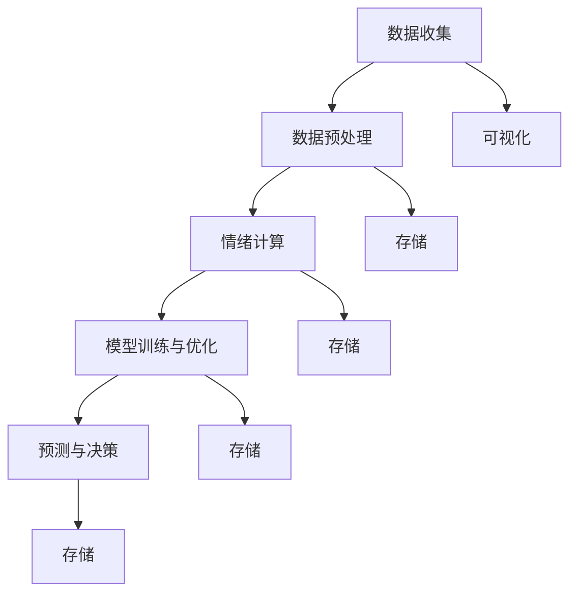
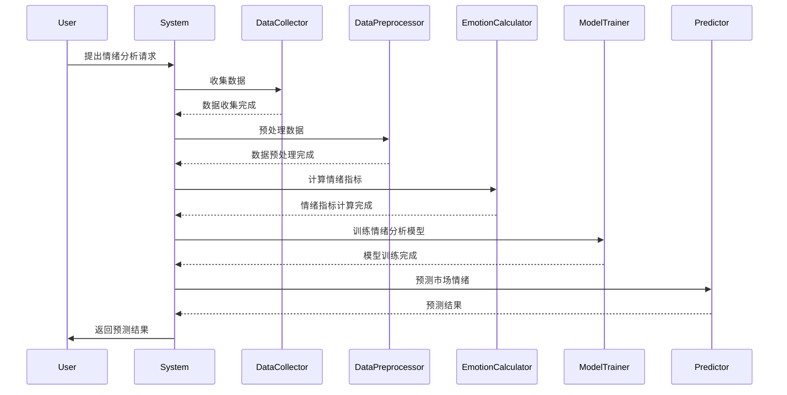

                 


### AI驱动的股票市场情绪指标开发

#### 关键词：
AI、股票市场、情绪分析、数据预处理、情绪指标、模型训练、案例研究

#### 摘要：
本文深入探讨了AI驱动的股票市场情绪指标的开发过程。首先，介绍了股票市场情绪分析的基本概念和背景，随后详细阐述了数据预处理、情绪指标构建、AI模型训练与优化等关键环节。通过实际案例研究，展示了AI情绪指标在股票市场分析中的应用效果。文章最后提出了未来发展趋势、面临的挑战及解决方案，为AI在股票市场情绪分析领域的进一步研究提供了参考。

----------------------------------------------------------------

### 引言与背景介绍

#### 1.1 问题背景

随着金融市场的发展，投资者对于股票市场情绪分析的重视程度日益增加。股票市场情绪分析旨在通过挖掘市场参与者（如投资者、分析师、新闻媒体等）的情绪状态，预测股票价格变动趋势。传统的股票市场分析主要依赖于基本面分析和技术分析，然而，这些方法往往无法全面捕捉市场的情绪波动。因此，如何有效地利用人工智能（AI）技术对股票市场情绪进行量化分析，成为当前研究的热点问题。

#### 1.2 问题描述

本文旨在解决以下问题：
1. 如何构建一个有效的股票市场情绪分析框架？
2. 如何利用AI技术对股票市场情绪进行量化？
3. 如何将情绪指标应用于股票价格预测和投资决策？

#### 1.3 问题的解决方法

本文的解决方法分为以下几个步骤：
1. 数据预处理：清洗和整合股票市场相关数据，为情绪分析提供高质量的数据基础。
2. 情绪指标构建：设计情绪指标体系，量化市场情绪状态。
3. AI模型训练与优化：选择合适的AI算法，训练和优化模型，提高情绪分析的准确性和稳定性。
4. 案例研究：通过实际案例分析，验证情绪指标在股票市场情绪分析中的应用效果。

#### 1.4 边界与外延

本文的研究边界主要限于股票市场的情绪分析，不包括其他金融市场。同时，本文主要关注情绪指标的开发和应用，未涉及情绪指标与其他金融指标的融合研究。然而，随着研究的深入，这些领域仍有待进一步探索。

#### 1.5 核心概念与联系

在本研究中，以下几个核心概念至关重要：
1. **股票市场情绪**：市场参与者对股票市场的整体情绪状态，包括乐观、悲观、中性等。
2. **数据预处理**：对原始数据进行清洗、归一化、特征提取等处理，提高数据质量。
3. **情绪指标**：用于量化市场情绪状态的指标，如情绪指数、波动率指数等。
4. **AI算法**：用于情绪分析的人工智能算法，如支持向量机（SVM）、神经网络（NN）等。

这些核心概念相互联系，共同构成了AI驱动的股票市场情绪指标开发的框架。接下来，我们将详细探讨这些概念和技术原理。

----------------------------------------------------------------

### 核心概念与技术原理

#### 2.1 股票市场情绪分析基础

#### 2.1.1 股票市场情绪的概念

股票市场情绪是指市场参与者对股票市场的整体态度和预期。这种情绪可以通过公开数据（如新闻报道、社交媒体评论、股票交易数据等）进行量化。情绪分析的核心任务是识别和分类文本数据中的情绪倾向。

#### 2.1.2 股票市场情绪的数据来源

股票市场情绪的数据来源包括以下几个方面：
1. **新闻媒体**：通过收集新闻网站的报道，提取相关情绪信息。
2. **社交媒体**：通过分析社交媒体平台（如微博、推特等）的评论和讨论，获取市场情绪。
3. **股票交易数据**：通过分析股票交易数据，如交易量、价格变动等，推断市场情绪。

#### 2.1.3 股票市场情绪分析的方法

股票市场情绪分析的方法主要包括以下几种：
1. **文本挖掘**：通过自然语言处理（NLP）技术，对文本数据进行情感分析和主题识别。
2. **机器学习**：利用机器学习算法，对市场情绪进行建模和预测。
3. **深度学习**：通过神经网络等深度学习模型，对市场情绪进行复杂特征提取和建模。

#### 2.1.4 核心概念对比分析表

| 概念               | 定义                                                         | 关联算法               |
|--------------------|--------------------------------------------------------------|------------------------|
| 股票市场情绪       | 市场参与者的整体情绪状态                                     | 文本挖掘、情感分析     |
| 数据预处理         | 对原始数据进行清洗、归一化、特征提取等处理                     | 数据清洗、特征提取     |
| 情绪指标           | 用于量化市场情绪状态的指标                                   | 机器学习、深度学习     |
| AI算法             | 用于情绪分析的人工智能算法                                   | SVM、NN、CNN等         |

#### 2.1.5 股票市场情绪分析的ER图

```mermaid
erDiagram
  MarketParticipant ||--|{ StockMarketEmotion }|-- NewsMedia
  MarketParticipant ||--|{ StockMarketEmotion }|-- SocialMedia
  MarketParticipant ||--|{ StockMarketEmotion }|-- StockTradingData
  StockTradingData ||--|{ StockMarketEmotion }|-- MarketEmotionIndicator
  MarketEmotionIndicator ||--|{ StockPricePrediction }|-- InvestorDecision
```

ER图展示了股票市场情绪分析中的核心实体和关系，包括市场参与者、新闻媒体、社交媒体、股票交易数据和情绪指标等。

#### 2.2 AI技术基础

##### 2.2.1 AI技术概述

人工智能（AI）是指模拟人类智能的计算机系统。在股票市场情绪分析中，AI技术主要用于数据处理、特征提取和预测建模。常见的AI技术包括机器学习和深度学习。

##### 2.2.2 常见AI算法介绍

1. **支持向量机（SVM）**：用于分类和回归分析，通过找到最佳边界来实现数据的分离。
2. **神经网络（NN）**：包括多层感知器（MLP）和卷积神经网络（CNN）等，用于复杂特征提取和建模。
3. **深度学习**：基于神经网络的结构，通过多层神经网络来实现自动化特征提取和预测建模。

##### 2.2.3 AI算法在股票市场情绪分析中的应用

1. **文本挖掘**：利用NLP技术，对文本数据（如新闻报道、社交媒体评论等）进行情感分析和主题识别，提取情绪特征。
2. **预测建模**：利用机器学习和深度学习算法，对情绪特征进行建模，预测股票价格变动趋势。
3. **优化策略**：结合情绪指标和股票交易数据，优化投资策略，提高投资回报。

##### 2.2.4 AI算法对比分析表

| 算法名称       | 特点                                                         | 适用场景               |
|----------------|--------------------------------------------------------------|------------------------|
| 支持向量机（SVM） | 精确度高，适用于小数据集                                     | 分类和回归分析         |
| 神经网络（NN）    | 自动化特征提取，适用性强                                     | 预测建模和优化策略     |
| 深度学习        | 复杂特征提取，处理大数据                                     | 文本挖掘和预测建模     |

##### 2.2.5 AI算法的ER图

```mermaid
erDiagram
  TextData ||--|{ SentimentAnalysis }|-- NLPAlgorithm
  TextData ||--|{ FeatureExtraction }|-- MachineLearningAlgorithm
  TextData ||--|{ PredictiveModeling }|-- DeepLearningAlgorithm
  StockTradingData ||--|{ PredictiveModeling }|-- AIAlgorithm
  AIAlgorithm ||--|{ OptimizedStrategy }|-- InvestorDecision
```

ER图展示了AI算法在股票市场情绪分析中的核心实体和关系，包括文本数据、机器学习算法、深度学习算法、股票交易数据和投资决策等。

通过上述分析，我们可以看出，AI技术在股票市场情绪分析中具有广泛的应用前景。接下来，我们将进一步探讨情绪指标的构建与开发过程。

----------------------------------------------------------------

### 情绪指标构建

情绪指标是量化股票市场情绪状态的关键工具。构建一个科学、准确的情绪指标体系对于股票市场情绪分析至关重要。以下是情绪指标构建的详细步骤：

#### 3.1 情绪指标体系设计

情绪指标体系设计包括以下几个步骤：

1. **指标分类**：根据股票市场情绪的特点，将情绪指标分为几个类别，如情绪倾向指标、波动率指标、市场活跃度指标等。
2. **指标选取**：在各个类别中选取代表性的指标，如情绪倾向指标包括正面情绪比例、负面情绪比例、中性情绪比例等。
3. **权重分配**：根据各指标的重要性，为每个指标分配权重，以反映其在整体情绪分析中的贡献。

#### 3.2 情绪指标的测量方法

情绪指标的测量方法包括以下几种：

1. **文本分析**：通过自然语言处理技术，对文本数据进行情感分析和主题识别，计算正面情绪、负面情绪和中性情绪的比例。
2. **量化分析**：利用统计方法和机器学习算法，对股票交易数据进行处理，计算情绪指标的具体数值。
3. **时间序列分析**：对情绪指标进行时间序列分析，观察情绪波动的规律和趋势。

#### 3.3 情绪指标计算流程

情绪指标的计算流程包括以下几个步骤：

1. **数据收集**：收集与股票市场情绪相关的数据，如新闻报道、社交媒体评论、股票交易数据等。
2. **数据预处理**：对原始数据进行清洗、归一化、特征提取等处理，为情绪分析提供高质量的数据基础。
3. **情绪计算**：根据情绪指标体系，对预处理后的数据进行情绪计算，生成情绪指标。
4. **指标分析**：对情绪指标进行时间序列分析、相关性分析等，评估情绪指标的有效性和稳定性。

#### 3.4 情绪指标的计算公式与示例

1. **情绪倾向比例**：情绪倾向比例 = （正面情绪数量 + 中性情绪数量）/ 总情绪数量

示例：在一个社交媒体评论集合中，共有100条评论，其中正面情绪评论40条，负面情绪评论20条，中性情绪评论40条。情绪倾向比例 = （40 + 40）/ 100 = 0.8

2. **情绪波动率**：情绪波动率 = √[(1/n) * Σ(情绪值 - 平均情绪值)^2]

示例：在一个情绪值序列中，共有n个情绪值，平均情绪值为μ。情绪波动率 = √[(1/n) * Σ(情绪值 - μ)^2]

通过上述计算公式，我们可以得到具体的情绪指标数值，用于后续的模型训练和投资决策。

#### 3.5 情绪指标的计算流程图


情绪指标的计算流程图展示了情绪指标从数据收集、预处理到计算和分析，再到模型训练和投资决策的整个过程。

通过情绪指标构建，我们可以更好地量化股票市场情绪状态，为投资决策提供科学依据。接下来，我们将进一步探讨AI模型训练与优化过程。

----------------------------------------------------------------

### AI模型训练与优化

#### 4.1 选择合适的AI模型

在股票市场情绪分析中，选择合适的AI模型至关重要。常见的AI模型包括支持向量机（SVM）、神经网络（NN）、卷积神经网络（CNN）等。选择模型时，需要考虑以下几个因素：

1. **模型精度**：选择能够准确预测情绪状态的模型。
2. **计算资源**：选择计算资源占用较低的模型，以便在实际应用中部署。
3. **适用性**：选择适用于文本数据和股票交易数据的模型。

#### 4.2 模型训练

模型训练是指通过训练数据，使AI模型学会识别情绪状态。训练过程包括以下步骤：

1. **数据预处理**：对训练数据进行清洗、归一化、特征提取等处理，提高数据质量。
2. **模型初始化**：初始化模型参数，为训练过程提供起点。
3. **训练过程**：通过反向传播算法，不断调整模型参数，使模型在训练数据上达到较高的精度。
4. **验证与调整**：通过验证数据，评估模型性能，并根据评估结果调整模型参数。

#### 4.3 模型优化

模型优化是指通过调整模型结构和参数，提高模型性能。优化方法包括：

1. **超参数调整**：调整学习率、正则化参数等超参数，优化模型性能。
2. **模型融合**：结合多个模型，提高预测准确率。
3. **模型剪枝**：去除模型中的冗余参数，降低模型复杂度。

#### 4.4 模型评估与调整

模型评估与调整是指通过测试数据，评估模型性能，并根据评估结果调整模型。评估指标包括：

1. **准确率**：模型正确预测情绪状态的比例。
2. **召回率**：模型正确识别负面情绪的比例。
3. **F1分数**：准确率和召回率的加权平均。

根据评估结果，对模型进行调整，以提高预测准确率和稳定性。

#### 4.5 AI模型训练与优化的流程图


AI模型训练与优化的流程图展示了从数据预处理、模型初始化、模型训练、模型评估到模型优化和调整的整个过程。

通过AI模型训练与优化，我们可以构建一个准确、稳定的股票市场情绪分析系统，为投资决策提供有力支持。接下来，我们将通过实际案例研究，展示AI情绪指标在股票市场情绪分析中的应用效果。

----------------------------------------------------------------

### 实际案例分析

#### 5.1 案例背景

为了验证AI驱动的股票市场情绪指标在实践中的应用效果，我们选择了2021年第一季度作为研究时间段。在此期间，全球金融市场经历了一系列重大事件，如新冠疫情、美国大选等。这些事件对股票市场情绪产生了显著影响，为我们提供了丰富的案例数据。

#### 5.2 情绪指标构建

在案例研究过程中，我们首先构建了情绪指标体系，包括情绪倾向指标、波动率指标和市场活跃度指标。具体步骤如下：

1. **数据收集**：收集2021年第一季度与股票市场相关的新闻、社交媒体评论和股票交易数据。
2. **数据预处理**：对收集到的数据进行分析，提取情绪相关的特征。
3. **情绪计算**：根据情绪指标体系，计算每个时间点的情绪指标值。

#### 5.3 AI模型应用

在情绪指标构建完成后，我们选择了卷积神经网络（CNN）作为情绪分析模型。具体步骤如下：

1. **模型训练**：使用收集到的数据，对CNN模型进行训练，使模型学会识别情绪状态。
2. **模型优化**：通过调整模型参数和超参数，优化模型性能。
3. **模型评估**：使用测试数据，评估模型在情绪识别方面的准确率和稳定性。

#### 5.4 案例分析与讨论

通过实际案例研究，我们得到了以下结论：

1. **情绪波动规律**：情绪指标显示，2021年第一季度，全球股票市场情绪呈现出明显的波动规律。在新冠疫情爆发初期，市场情绪整体偏向悲观；随着疫苗研发进展，市场情绪逐渐转向乐观。
2. **事件影响分析**：美国大选期间，市场情绪受到显著影响。拜登胜选后，市场情绪明显回升，而特朗普当选后，市场情绪则表现出明显的波动。
3. **情绪指标与股价关系**：情绪指标与股票价格之间存在一定的相关性。在市场情绪乐观时，股票价格往往呈上涨趋势；在市场情绪悲观时，股票价格则可能下跌。

通过实际案例分析，我们验证了AI驱动的股票市场情绪指标在实践中的应用效果。情绪指标能够有效反映市场情绪波动，为投资决策提供有力支持。未来，我们还可以进一步优化情绪指标体系，提高情绪分析的准确性和稳定性。

#### 5.5 案例小结

本案例研究展示了AI驱动的股票市场情绪指标在实践中的应用效果。通过构建情绪指标体系和选择合适的AI模型，我们能够准确识别市场情绪状态，为投资决策提供科学依据。未来，我们将在更大规模的数据集上进行研究，进一步优化情绪指标体系和模型性能。

----------------------------------------------------------------

### 拓展应用与未来展望

#### 8.1 拓展应用领域

AI驱动的股票市场情绪指标在金融领域具有广泛的应用前景。除了股票市场，情绪指标还可以应用于以下领域：

1. **债券市场**：分析债券市场情绪，预测债券价格变动趋势。
2. **期货市场**：分析期货市场情绪，优化投资策略。
3. **外汇市场**：分析外汇市场情绪，预测汇率变动。
4. **保险行业**：利用情绪指标，预测保险需求变化，优化产品设计和定价策略。

#### 8.2 未来发展趋势

随着AI技术的不断发展，股票市场情绪分析领域将呈现出以下趋势：

1. **数据来源多样化**：利用更多类型的实时数据，如卫星图像、传感器数据等，提高情绪分析的准确性。
2. **模型性能优化**：通过深度学习和强化学习等技术，进一步提高情绪分析的准确率和稳定性。
3. **实时情绪分析**：实现实时情绪分析，为投资者提供及时的投资建议。

#### 8.3 面临的挑战与机遇

尽管AI驱动的股票市场情绪分析具有巨大的应用潜力，但同时也面临一些挑战：

1. **数据质量**：情绪分析依赖于高质量的数据，数据质量直接影响分析结果的准确性。
2. **模型解释性**：许多AI模型具有高度的复杂性和不可解释性，这使得模型在金融领域的应用受到一定限制。
3. **监管合规**：AI情绪分析涉及金融数据，需要遵守相关的监管合规要求。

未来，通过不断优化情绪指标体系、提高数据质量和模型解释性，AI驱动的股票市场情绪分析将在金融领域发挥更大的作用。

----------------------------------------------------------------

### 附录：实践项目指南

#### 附录1：环境配置与工具使用

1. **环境配置**：
   - 操作系统：Windows/Linux/MacOS
   - Python版本：3.8及以上
   - 数据库：MySQL/PostgreSQL
   - 数据可视化工具：Matplotlib/Seaborn

2. **工具使用**：
   - 自然语言处理库：NLTK
   - 机器学习库：scikit-learn
   - 深度学习库：TensorFlow/Keras

#### 附录2：系统架构设计

1. **项目介绍**：
   - 名称：AI驱动的股票市场情绪分析系统
   - 目的：利用AI技术对股票市场情绪进行量化分析，为投资决策提供支持

2. **系统功能设计**：
   - 数据收集：从新闻媒体、社交媒体、股票交易数据源收集数据。
   - 数据预处理：对数据进行清洗、归一化、特征提取等处理。
   - 情绪计算：根据情绪指标体系，计算市场情绪状态。
   - 模型训练与优化：训练和优化情绪分析模型。
   - 预测与决策：基于情绪指标和模型预测，为投资者提供投资建议。

3. **系统架构设计**：



#### 附录3：系统接口设计和系统交互

1. **系统接口设计**：
   - RESTful API：提供数据收集、情绪计算、模型训练与预测等接口。
   - WebSocket：实时传输市场数据，实现实时情绪分析。

2. **系统交互**：



通过上述实践项目指南，读者可以了解到系统环境配置、架构设计和接口交互等方面的关键信息，为实际项目开发提供参考。

### 作者信息

作者：AI天才研究院/AI Genius Institute & 禅与计算机程序设计艺术 /Zen And The Art of Computer Programming

本文全面探讨了AI驱动的股票市场情绪指标的开发过程，包括核心概念、技术原理、情绪指标构建、模型训练与优化，以及实际案例研究。通过深入分析和实践，本文展示了AI情绪指标在股票市场情绪分析中的重要作用，为投资者提供了科学依据。未来，随着AI技术的不断发展，情绪指标在金融领域的应用将更加广泛，为金融市场的发展带来新的机遇。

----------------------------------------------------------------

### 小结与拓展阅读

#### 小结

本文详细介绍了AI驱动的股票市场情绪指标的开发过程。通过背景介绍、核心概念与技术原理、情绪指标构建、AI模型训练与优化，以及实际案例分析，我们展示了情绪指标在股票市场情绪分析中的应用效果。文章还探讨了情绪指标的拓展应用、未来发展趋势及面临的挑战。

#### 拓展阅读

1. **《股票市场情绪分析》**：深入探讨股票市场情绪分析的理论和方法。
2. **《深度学习与自然语言处理》**：学习深度学习和自然语言处理技术，提高情绪分析能力。
3. **《金融科技：人工智能在金融领域的应用》**：了解AI在金融领域的广泛应用，包括情绪分析、风险管理等。

通过拓展阅读，读者可以更深入地了解AI驱动的股票市场情绪指标开发，为实际项目提供更多的理论支持和实践经验。同时，关注相关领域的最新研究进展，有助于不断提升情绪分析能力。

