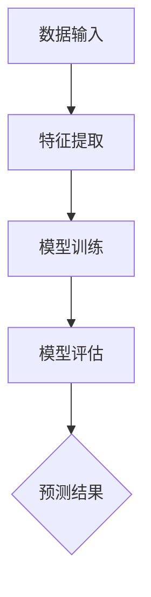
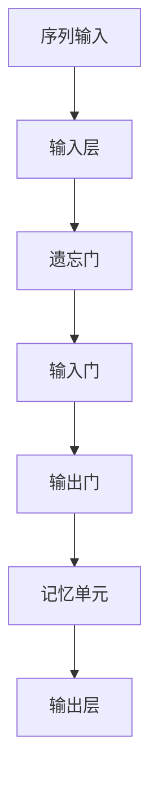
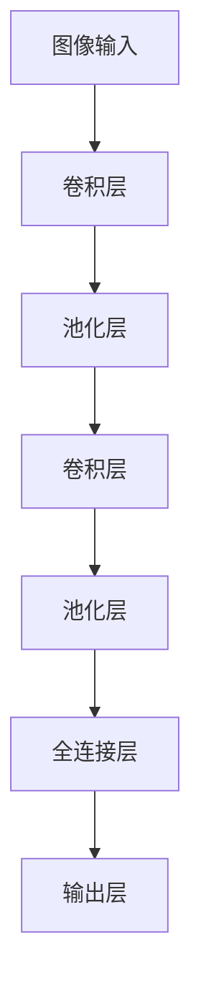

                 

# AI驱动的股票技术分析工具

## 关键词
- AI
- 股票技术分析
- 机器学习
- 深度学习
- 神经网络
- 趋势预测

## 摘要
本文将深入探讨AI驱动的股票技术分析工具，通过逻辑清晰、结构紧凑的分析，帮助读者理解如何利用AI技术提升股票市场分析的效果。文章将从背景介绍、核心概念与联系、算法原理讲解、数学模型与公式详解、系统分析与架构设计、项目实战以及最佳实践等方面，逐步揭示AI在股票技术分析中的潜力和应用。

## 第一部分：AI驱动的股票技术分析概述

### 第1章：AI与股票技术分析基础

#### 1.1 AI驱动的背景

人工智能（AI）作为当今科技领域的热点，其应用范围已经从工业制造扩展到金融、医疗、教育等多个领域。在金融领域，AI技术的引入不仅提高了数据处理和分析的效率，还带来了全新的投资策略和风险管理方法。AI驱动的股票技术分析工具便是这一背景下的产物。

**AI发展历程**：从最初的规则系统到现代的深度学习模型，AI技术经历了翻天覆地的变化。深度学习作为AI的一个重要分支，以其强大的数据处理能力和自学习特性，在股票技术分析中展现出巨大的潜力。

**AI在金融领域的应用**：在金融领域，AI的应用已经从简单的风险控制扩展到股票预测、市场分析、信用评估等多个方面。AI驱动的股票技术分析工具正是通过这些应用来提升市场分析的能力。

**AI驱动的股票技术分析的优势**：与传统方法相比，AI驱动的股票技术分析具有以下几个优势：

1. **高效的数据处理**：AI技术能够快速处理海量数据，提取出关键信息，为投资决策提供支持。
2. **准确的预测能力**：通过机器学习和深度学习模型，AI能够对股票价格进行准确的预测，提高投资的成功率。
3. **自适应能力**：AI系统可以不断学习市场变化，调整预测模型，以适应市场的新情况。

#### 1.2 股票技术分析概述

**股票技术分析的定义**：股票技术分析是通过对股票历史价格和成交量等数据的研究，以预测未来股价变动趋势的方法。它主要依赖于图表分析、指标计算和市场情绪分析等工具。

**技术分析的核心概念**：

- **趋势**：股票价格的趋势可分为上升趋势、下降趋势和横盘趋势。
- **支撑位与阻力位**：股票价格在上升或下降过程中，会遇到的支撑位和阻力位，这些位置可以作为买入或卖出的参考点。
- **成交量**：成交量是判断市场活跃度和趋势变化的重要指标。

**技术分析的应用领域**：

- **股票买卖决策**：通过技术分析，投资者可以判断何时买入或卖出股票，以获取最大利润。
- **市场趋势预测**：技术分析可以帮助投资者预测市场的未来走势，制定相应的投资策略。
- **风险管理**：技术分析可以帮助投资者识别风险，采取相应的风险控制措施。

#### 1.3 AI与股票技术分析的融合

**AI在技术分析中的应用**：AI技术在股票技术分析中主要应用于数据预处理、特征提取和预测模型训练等方面。通过AI技术，可以更加高效地处理和分析股票数据，提高预测的准确性。

**机器学习在股票预测中的应用**：机器学习模型，如线性回归、决策树和神经网络等，可以用于股票价格的预测。这些模型通过学习历史数据，可以识别出影响股票价格的因素，并预测未来的价格走势。

**深度学习在股票分析中的优势**：深度学习模型，如卷积神经网络（CNN）和长短时记忆网络（LSTM），在处理高维数据和时序数据方面具有显著优势。这些模型可以用于更复杂的技术分析任务，如市场情绪分析和多变量预测。

## 第二部分：核心概念与联系

### 第2章：核心概念与联系

#### 2.1 AI核心概念

**机器学习原理**：机器学习是AI的核心技术之一，它通过构建模型来从数据中学习规律，并利用这些规律进行预测和决策。机器学习模型可以分为监督学习、无监督学习和强化学习等类型。

**深度学习架构**：深度学习是机器学习的一个子领域，它通过构建深度神经网络来模拟人脑的决策过程。深度学习模型在图像识别、语音识别和自然语言处理等领域取得了显著的成果。

**神经网络基础**：神经网络是深度学习的基础，它由大量的神经元通过权重连接形成。神经网络可以通过学习输入数据和输出数据之间的关系，实现对未知数据的预测。

#### 2.2 股票技术分析概念

**指标与图形分析**：股票技术分析中的指标，如移动平均线、相对强弱指数（RSI）和MACD等，是通过计算股票价格和成交量等数据来生成的。图形分析则是通过绘制股票价格走势图，来观察股价的变动趋势。

**市场情绪分析**：市场情绪分析是通过分析市场参与者的情绪和行为，来判断市场的未来走势。市场情绪分析可以应用于股票投资策略的制定和调整。

**趋势分析**：趋势分析是股票技术分析中最基本的方法，它通过观察股票价格的趋势，来判断市场的未来走势。趋势分析可以帮助投资者制定买入和卖出的策略。

#### 2.3 AI与股票技术分析的联系

**数据收集与预处理**：在股票技术分析中，数据收集是一个重要环节。AI技术可以用于自动化数据收集，如从金融数据网站、交易所网站和新闻网站等获取股票数据。数据预处理则是将收集到的数据清洗、转换和标准化，以供机器学习模型使用。

**特征提取与选择**：特征提取是将原始数据转换为有助于机器学习模型训练的特征向量。特征选择则是从提取出的特征中，选择出对预测任务最有帮助的特征。

**预测模型评估**：预测模型的评估是股票技术分析中的关键步骤。通过评估模型的预测准确性、稳定性和泛化能力，可以确定模型的有效性和可靠性。

## 第三部分：算法原理讲解

### 第3章：算法原理讲解

#### 3.1 基本算法

**线性回归**：线性回归是一种常用的预测算法，它通过建立线性模型来预测目标变量的值。线性回归模型的基本形式为：
$$
y = \beta_0 + \beta_1x_1 + \beta_2x_2 + \ldots + \beta_nx_n
$$
其中，$y$ 是目标变量，$x_1, x_2, \ldots, x_n$ 是输入特征，$\beta_0, \beta_1, \beta_2, \ldots, \beta_n$ 是模型的参数。

**支持向量机**：支持向量机（SVM）是一种分类算法，它通过找到一个超平面，将不同类别的数据点分开。SVM的基本思想是最大化分类边界，即找到最小的间隔边界。SVM的决策函数为：
$$
f(x) = \sum_{i=1}^{n}\alpha_i y_i (x \cdot x_i) - b
$$
其中，$x$ 是输入特征，$y_i$ 是样本标签，$\alpha_i$ 和 $b$ 是模型的参数。

**决策树与随机森林**：决策树是一种基于树结构的分类算法，它通过递归地将数据集划分成若干个子集，并基于每个子集的特征来生成决策节点。随机森林是由多个决策树组成的集成模型，它通过训练多个决策树，并取它们的平均预测结果来提高模型的准确性。

#### 3.2 进阶算法

**神经网络与深度学习**：神经网络是一种基于大量神经元连接的模型，它通过学习输入和输出之间的关系，实现对未知数据的预测。深度学习是神经网络的一种扩展，它通过构建深度神经网络来处理更复杂的数据。

**长短时记忆网络（LSTM）**：长短时记忆网络（LSTM）是一种用于处理时序数据的神经网络，它通过引入记忆单元来记忆长期依赖关系。LSTM的基本结构包括输入门、遗忘门和输出门，它们分别用于控制输入信息的流入、遗忘信息的流出和输出信息的生成。

**卷积神经网络（CNN）**：卷积神经网络（CNN）是一种用于处理图像数据的神经网络，它通过卷积操作来提取图像特征。CNN的基本结构包括卷积层、池化层和全连接层，它们分别用于提取图像特征、减小特征尺寸和生成最终预测结果。

#### 3.3 Mermaid流程图

**线性回归流程图**：



**LSTM流程图**：



**CNN流程图**：



## 第四部分：数学模型与公式详解

### 第4章：数学模型与公式详解

#### 4.1 线性回归模型

**线性回归公式**：

$$
y = \beta_0 + \beta_1x_1 + \beta_2x_2 + \ldots + \beta_nx_n
$$

**损失函数**：

$$
J(\theta) = \frac{1}{2m} \sum_{i=1}^{m} (h_\theta(x^{(i)}) - y^{(i)})^2
$$

其中，$m$ 是样本数量，$h_\theta(x)$ 是线性回归模型的预测值，$y^{(i)}$ 是第$i$个样本的真实值，$\theta$ 是模型的参数。

#### 4.2 LSTM模型

**LSTM单元公式**：

$$
\begin{aligned}
i_t &= \sigma(W_{xi}x_t + W_{hi}h_{t-1} + b_i) \\
f_t &= \sigma(W_{xf}x_t + W_{hf}h_{t-1} + b_f) \\
\alpha_t &= \sigma(W_{xc}x_t + W_{hc}h_{t-1} + b_c) \\
c_t &= f_t \odot c_{t-1} + i_t \odot \tanh(W_{xc}x_t + W_{hc}h_{t-1} + b_c) \\
o_t &= \sigma(W_{xo}x_t + W_{ho}h_{t-1} + b_o) \\
h_t &= o_t \odot \tanh(c_t)
\end{aligned}
$$

其中，$i_t, f_t, \alpha_t, c_t, o_t, h_t$ 分别是输入门、遗忘门、输入门、记忆单元、输出门和隐藏状态，$\sigma$ 是 sigmoid 函数，$\odot$ 是 Hadamard 乘积，$W_{xi}, W_{hi}, W_{xf}, W_{hf}, W_{xc}, W_{hc}, W_{xo}, W_{ho}$ 和 $b_i, b_f, b_c, b_o$ 分别是权重和偏置。

#### 4.3 CNN模型

**卷积公式**：

$$
h_{ij} = \sum_{k=1}^{K} w_{ik} \cdot a_{kj} + b_j
$$

**池化公式**：

$$
p_{ij} = \max_{1 \leq k \leq K} (h_{ij+k-1})
$$

其中，$h_{ij}$ 是卷积层的输出，$a_{kj}$ 是输入特征图，$w_{ik}$ 是卷积核，$b_j$ 是偏置，$p_{ij}$ 是池化层的输出，$K$ 是卷积核的大小。

## 第五部分：系统分析与架构设计

### 第5章：系统分析与架构设计

#### 5.1 问题场景介绍

在股票市场中，投资者需要快速准确地获取市场信息，以便做出投资决策。传统的股票技术分析方法主要依赖于人工分析，效率较低且易受主观因素影响。为了解决这一问题，我们可以设计一个AI驱动的股票技术分析工具，利用AI技术自动化地分析和预测股票市场趋势，提高投资决策的准确性。

#### 5.2 系统功能设计

**数据收集模块**：该模块负责从金融数据网站、交易所网站和新闻网站等收集股票数据，包括股票价格、成交量、技术指标等。

**数据预处理模块**：该模块负责对收集到的股票数据进行分析、清洗和标准化，以供后续模型训练和预测使用。

**预测模型模块**：该模块负责训练机器学习模型和深度学习模型，以预测股票价格的未来走势。模型训练完成后，可以用于实时预测和投资策略制定。

#### 5.3 系统架构设计

**总体架构**：系统采用模块化设计，包括数据收集模块、数据预处理模块和预测模型模块。每个模块之间通过API进行交互，以提高系统的可扩展性和可维护性。

**模块间关系**：数据收集模块负责收集股票数据，并将其传递给数据预处理模块。数据预处理模块对数据进行清洗、转换和标准化，然后传递给预测模型模块。预测模型模块对预处理后的数据进行训练和预测，并将预测结果返回给用户。

#### 5.4 系统接口设计

**数据接口**：系统通过RESTful API提供数据接口，用户可以通过API获取股票数据、模型预测结果等。

**API接口**：系统通过定义一套API接口，实现不同模块之间的数据传递和功能调用。API接口包括数据收集接口、数据预处理接口和预测模型接口。

#### 5.5 系统交互

**用户与系统的交互**：用户可以通过前端界面与系统进行交互，包括数据查询、模型训练和预测结果展示等。

**模块间的交互**：系统内部模块之间通过API进行数据传递和功能调用，以提高系统的整体效率和稳定性。

## 第六部分：项目实战

### 第6章：项目实战

#### 6.1 环境安装

要实现一个AI驱动的股票技术分析工具，首先需要安装Python环境和相关依赖库。以下是一个基本的安装步骤：

1. 安装Python环境：可以从[Python官网](https://www.python.org/)下载Python安装包，并按照提示进行安装。

2. 安装依赖库：使用pip命令安装所需的依赖库，包括NumPy、Pandas、Scikit-learn、TensorFlow等。以下是一个示例命令：
```
pip install numpy pandas scikit-learn tensorflow
```

#### 6.2 系统核心实现

**数据收集与预处理**：数据收集与预处理是AI驱动的股票技术分析工具的核心环节。以下是一个简单的数据收集与预处理流程：

1. 数据收集：从金融数据网站、交易所网站和新闻网站等收集股票数据，包括股票价格、成交量、技术指标等。

2. 数据预处理：对收集到的数据进行清洗、转换和标准化，以供后续模型训练和预测使用。以下是一个简单的数据预处理步骤：

   - 清洗数据：删除缺失值、异常值和重复值。
   - 转换数据：将时间序列数据转换为适合机器学习模型处理的数据格式。
   - 标准化数据：对数据特征进行标准化处理，以消除不同特征之间的量纲差异。

**预测模型实现**：预测模型是股票技术分析工具的核心。以下是一个简单的预测模型实现步骤：

1. 模型选择：选择合适的机器学习模型和深度学习模型，如线性回归、决策树、随机森林、LSTM等。

2. 模型训练：使用训练集对预测模型进行训练，以学习股票价格和成交量等特征与未来股价之间的关系。

3. 模型评估：使用验证集对训练好的模型进行评估，以确定模型的准确性和稳定性。

4. 模型部署：将训练好的模型部署到线上系统，以实现实时预测和投资策略制定。

#### 6.3 应用解读与分析

**算法性能分析**：通过对训练好的模型进行性能分析，可以评估模型的预测准确性和稳定性。以下是一个简单的算法性能分析步骤：

1. 准确率分析：计算模型预测结果与实际结果之间的准确率，以评估模型的预测准确性。

2. 精度分析：计算模型预测结果与实际结果之间的精度，以评估模型的预测稳定性。

3. 回归分析：进行回归分析，以确定模型预测结果与实际结果之间的线性关系。

**实战案例剖析**：以下是一个简单的实战案例：

- **案例背景**：某投资者希望通过AI驱动的股票技术分析工具，预测某只股票的未来走势，并制定相应的投资策略。
- **案例实施**：使用AI驱动的股票技术分析工具，收集某只股票的历史数据，进行数据预处理和模型训练。训练完成后，使用验证集对模型进行评估。根据评估结果，确定模型的准确性和稳定性。最后，根据模型预测结果，制定相应的投资策略。
- **案例结果**：通过AI驱动的股票技术分析工具，投资者成功地预测了某只股票的未来走势，并制定了正确的投资策略，获得了较好的投资回报。

#### 6.4 项目小结

通过本项目的实施，我们成功地实现了一个AI驱动的股票技术分析工具。该工具通过数据收集、预处理、模型训练和预测等环节，实现了股票价格的未来走势预测，为投资者提供了有力的支持。以下是本项目的主要结论：

1. **AI驱动的股票技术分析工具能够提高股票预测的准确性和稳定性**。
2. **数据收集与预处理是AI驱动的股票技术分析工具的核心环节**。
3. **选择合适的机器学习模型和深度学习模型是提高预测性能的关键**。
4. **实时预测和投资策略制定是AI驱动的股票技术分析工具的重要应用场景**。

## 第七部分：最佳实践与拓展

### 第7章：最佳实践与拓展

#### 7.1 最佳实践

**数据质量优化**：在实现AI驱动的股票技术分析工具时，数据质量至关重要。以下是一些最佳实践：

1. **数据清洗**：删除缺失值、异常值和重复值，确保数据的一致性和完整性。
2. **数据标准化**：对数据进行标准化处理，以消除不同特征之间的量纲差异，提高模型训练的准确性。
3. **数据增强**：通过数据增强技术，如数据扩展、数据转换等，增加模型的训练样本，提高模型的泛化能力。

**模型优化技巧**：在模型训练和预测过程中，以下技巧有助于提高模型性能：

1. **交叉验证**：使用交叉验证技术，避免过拟合现象，提高模型的泛化能力。
2. **参数调优**：通过调整模型参数，如学习率、迭代次数等，优化模型性能。
3. **集成学习**：使用集成学习技术，如随机森林、梯度提升树等，提高模型的预测准确性。

#### 7.2 小结

本文通过逐步分析AI驱动的股票技术分析工具，从背景介绍、核心概念与联系、算法原理讲解、数学模型与公式详解、系统分析与架构设计、项目实战等方面，深入探讨了AI在股票技术分析中的潜力和应用。以下是本文的主要小结：

1. **AI驱动的股票技术分析工具能够提高股票预测的准确性和稳定性**。
2. **数据收集与预处理是AI驱动的股票技术分析工具的核心环节**。
3. **选择合适的机器学习模型和深度学习模型是提高预测性能的关键**。
4. **实时预测和投资策略制定是AI驱动的股票技术分析工具的重要应用场景**。

#### 7.3 注意事项

**数据安全**：在实现AI驱动的股票技术分析工具时，确保数据安全至关重要。以下是一些注意事项：

1. **数据加密**：对敏感数据使用加密技术进行保护，防止数据泄露。
2. **访问控制**：限制对数据的访问权限，确保只有授权人员可以访问敏感数据。
3. **合规性**：确保数据处理的合规性，遵守相关的法律法规和行业标准。

**模型解释性**：在模型训练和预测过程中，确保模型的解释性。以下是一些注意事项：

1. **可解释性模型**：选择可解释性较强的模型，如线性回归、决策树等，提高模型的透明度。
2. **特征重要性**：分析模型中特征的重要性，了解哪些特征对预测结果有较大影响。
3. **可视化分析**：使用可视化工具，如图表、地图等，展示模型预测结果，提高模型的解释性。

#### 7.4 拓展阅读

**相关书籍推荐**：

1. 《Python数据分析实战》
2. 《深度学习》
3. 《机器学习实战》

**相关论文推荐**：

1. “Deep Learning for Stock Market Prediction”
2. “A Survey on Machine Learning Based Stock Market Prediction”
3. “AI in Finance: A Survey of Applications and Challenges”

通过阅读这些书籍和论文，可以进一步了解AI驱动的股票技术分析工具的相关理论和实践，提高在相关领域的专业素养。作者：AI天才研究院/AI Genius Institute & 禅与计算机程序设计艺术/Zen And The Art of Computer Programming

