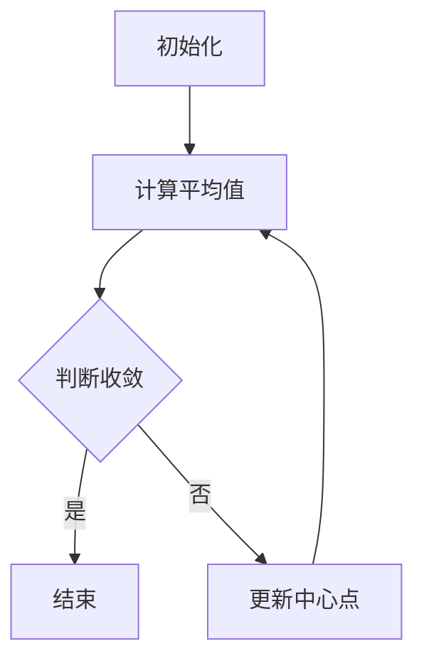
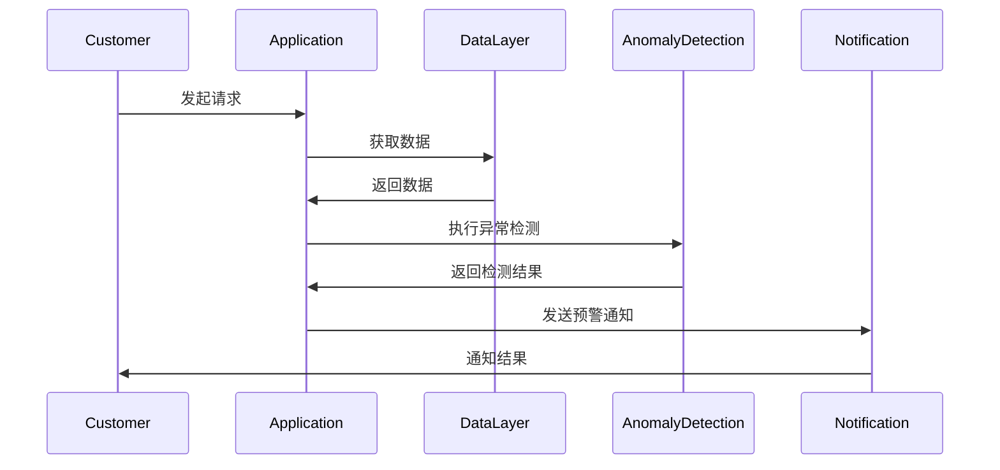
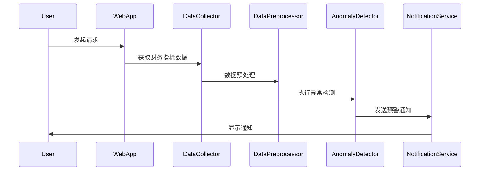

                 


## AI驱动的股票财务指标异常检测

> 关键词：股票财务分析、AI、异常检测、K-均值聚类、回归分析

> 摘要：本文旨在探讨如何利用AI技术对股票财务指标进行异常检测，以识别潜在的市场风险。通过介绍背景、核心概念、算法原理以及数学模型，本文详细分析了如何构建一个高效、可靠的股票财务指标异常检测系统。

### 目录大纲

```markdown
# AI驱动的股票财务指标异常检测

## 第一部分：背景介绍

### 第1章 问题背景与核心概念

#### 1.1 股票市场的重要性

#### 1.2 财务指标概述

#### 1.3 异常检测的意义

#### 1.4 AI在股票财务分析中的应用

### 第2章 核心概念与联系

#### 2.1 财务指标的概念属性特征对比

#### 2.2 ER实体关系图

## 第二部分：算法原理讲解

### 第3章 算法原理与流程图

#### 3.1 K-均值聚类算法

#### 3.2 Python源代码实现

#### 3.3 算法原理详细讲解

### 第4章 数学模型和数学公式 & 详细讲解 & 举例说明

## 第三部分：数学模型和数学公式

#### 4.1 回归分析模型

#### 4.2 解释性分析

## 第四部分：系统分析与架构设计

### 第5章 系统分析与架构设计

#### 5.1 问题场景介绍

#### 5.2 系统功能设计

#### 5.3 系统架构设计

#### 5.4 系统接口设计和系统交互

## 第五部分：项目实战

### 第6章 环境安装

### 第7章 系统核心实现源代码

### 第8章 代码应用解读与分析

### 第9章 实际案例分析和详细讲解剖析

### 第10章 项目小结

## 第六部分：最佳实践 tips、小结、注意事项、拓展阅读

### 参考文献
```

### 第一部分：背景介绍

#### 第1章 问题背景与核心概念

**股票市场的重要性**

股票市场作为现代经济体系的核心组成部分，发挥着至关重要的作用。它不仅提供了企业融资的重要渠道，还通过资本定价和资源优化配置，推动经济的发展和繁荣。全球股票市场涵盖了各大洲的主要经济体，市场规模巨大，参与者众多，具备高度的流动性和复杂性。

在股票市场中，投资者通过买卖股票进行资产配置和财富增值。然而，市场波动性和不确定性使得投资充满风险。为了降低风险并提高收益，投资者需要对股票进行深入分析，了解其财务状况和市场表现。财务指标是评估股票价值的重要工具，包括但不限于市盈率、流动比率、资产负债率等。

**财务指标概述**

财务指标是反映企业财务状况和经营成果的一系列量化指标。它们通过分析企业的资产负债表、利润表和现金流量表等财务报表，从不同角度揭示了企业的财务健康程度和盈利能力。主要财务指标及其意义如下表所示：

| 指标      | 定义                                                         | 主要用途                                                     |
|-----------|--------------------------------------------------------------|--------------------------------------------------------------|
| 市盈率    | 股票价格与每股收益的比率                                     | 反映股票估值水平                                             |
| 流动比率  | 流动资产与流动负债的比率                                     | 反映公司的短期偿债能力                                       |
| 资产负债率 | 负债总额与资产总额的比率                                     | 反映公司的资本结构                                           |

**异常检测的意义**

异常检测在股票市场中具有重要的应用价值。异常检测的目的是识别出那些与正常市场行为不一致的股票，从而降低投资风险，提高收益潜力。异常检测可以揭示潜在的财务造假、市场操纵或其他风险因素，帮助投资者做出更明智的投资决策。

异常检测的方法包括统计方法、机器学习方法等。随着人工智能技术的不断发展，机器学习在异常检测中的应用越来越广泛，如K-均值聚类、回归分析等算法。这些算法能够处理海量数据，识别出潜在的风险因素，为投资者提供有价值的信息。

**AI在股票财务分析中的应用**

人工智能技术的发展为股票财务分析带来了新的机遇。通过利用大数据、机器学习和深度学习等技术，AI能够在短时间内处理大量的财务数据，发现隐藏在数据中的规律和趋势。

在股票财务分析中，AI的应用主要包括以下几个方面：

1. **数据预处理**：AI能够自动完成数据的清洗、转换和集成，为后续分析提供高质量的数据。
2. **特征工程**：AI能够识别出对股票财务指标有重要影响的特征，为模型训练提供有效的输入。
3. **预测和预警**：基于历史数据和现有算法，AI可以预测股票的未来走势，为投资者提供预警信号。
4. **自动化交易**：AI可以自动执行交易策略，实现智能投资。

总之，AI在股票财务分析中的应用具有巨大的潜力，能够显著提高异常检测的准确性和效率，为投资者提供更可靠的投资决策支持。

### 第二部分：核心概念与联系

#### 第2章 核心概念与联系

在AI驱动的股票财务指标异常检测中，理解核心概念和它们之间的联系至关重要。以下是对关键概念的详细探讨，包括财务指标的概念属性特征对比和ER实体关系图。

**财务指标的概念属性特征对比**

财务指标是评估企业财务状况和经营成果的重要工具。以下是对几种主要财务指标的概念属性特征的对比：

| 指标      | 定义                                                         | 主要用途                                                     |
|-----------|--------------------------------------------------------------|--------------------------------------------------------------|
| 市盈率    | 股票价格与每股收益的比率                                     | 反映股票估值水平                                             |
| 流动比率  | 流动资产与流动负债的比率                                     | 反映公司的短期偿债能力                                       |
| 资产负债率 | 负债总额与资产总额的比率                                     | 反映公司的资本结构                                           |

**市盈率**：市盈率（P/E Ratio）是股票价格与每股收益（EPS）的比率，用于衡量股票的估值水平。市盈率越高，通常意味着股票被市场认为具有更高的成长潜力，但也可能反映出股票被高估。

**流动比率**：流动比率（Current Ratio）是流动资产与流动负债的比率，用于评估公司的短期偿债能力。流动比率越高，说明公司的流动性越好，能够更好地应对短期债务。

**资产负债率**：资产负债率（Debt-to-Equity Ratio）是负债总额与资产总额的比率，用于衡量公司的资本结构。资产负债率越低，表明公司的财务风险较低，财务结构更稳健。

**ER实体关系图**

为了更直观地展示财务指标之间的联系，我们可以使用ER（实体-关系）图来描述。以下是一个简化的ER实体关系图，展示了财务指标、股票和公司之间的关系：

```mermaid
erDiagram
  Company ||--|{ Stock }|--|{ Financial Metric }
  Financial Metric ||--|{ Market Value }
```

在这个ER图中，**Company（公司）**是核心实体，它与**Stock（股票）**和**Financial Metric（财务指标）**之间存在关联。股票代表了公司在市场上的表现，而财务指标则反映了公司的财务状况。市场价值是股票价格的一个体现，它与财务指标密切相关。

通过这种ER实体关系图的描述，我们可以更好地理解财务指标在股票市场中的角色和作用，以及它们如何相互影响和相互作用。

### 第二部分：算法原理讲解

#### 第3章 算法原理与流程图

在AI驱动的股票财务指标异常检测中，算法的选择和实现至关重要。本节将介绍K-均值聚类算法的基本原理和流程图，并展示如何使用Python实现这一算法。

**K-均值聚类算法的基本原理**

K-均值聚类是一种无监督学习方法，用于将一组数据点划分为K个簇（Cluster），使得每个数据点都与其最近的簇中心（centroid）相关联。算法的步骤如下：

1. **初始化**：随机选择K个数据点作为初始簇中心。
2. **分配数据点**：计算每个数据点到簇中心的距离，将数据点分配到距离最近的簇。
3. **更新簇中心**：计算每个簇的平均值，作为新的簇中心。
4. **迭代**：重复步骤2和3，直到簇中心不再变化或者达到预设的迭代次数。

**K-均值聚类算法的流程图**

为了更直观地理解K-均值聚类算法，我们可以使用Mermaid绘制流程图。以下是一个简化的流程图：



在这个流程图中，初始化阶段（A）随机选择K个数据点作为初始簇中心。然后，算法进入迭代阶段，通过计算数据点到簇中心的距离，将数据点分配到最近的簇（B）。接着，计算每个簇的平均值，作为新的簇中心（E）。这个过程不断重复，直到簇中心不再变化或者达到预设的迭代次数（C）。

**Python源代码实现**

以下是K-均值聚类算法的Python实现：

```python
import numpy as np

def k_means(data, k, max_iters):
    # 随机初始化簇中心
    centroids = data[np.random.choice(data.shape[0], k, replace=False)]
    
    for _ in range(max_iters):
        # 计算每个数据点到簇中心的距离
        distances = np.linalg.norm(data - centroids, axis=1)
        
        # 赋予每个数据点最近的簇中心标签
        labels = np.argmin(distances, axis=1)
        
        # 计算新的簇中心
        new_centroids = np.array([data[labels == i].mean(axis=0) for i in range(k)])
        
        # 判断是否收敛
        if np.all(centroids == new_centroids):
            break
        
        centroids = new_centroids
    
    return centroids, labels

# 示例数据
data = np.array([[1, 2], [1, 4], [1, 0], [4, 2], [4, 4], [4, 0]])

# K-均值聚类
centroids, labels = k_means(data, k=2, max_iters=100)

# 打印结果
print("簇中心：", centroids)
print("标签：", labels)
```

在这个实现中，我们首先使用随机初始化方法选择K个数据点作为初始簇中心。然后，通过迭代计算数据点到簇中心的距离，将数据点分配到最近的簇。计算新的簇中心，并判断是否收敛。如果收敛，算法结束；否则，继续迭代。最终，我们得到簇中心和每个数据点的标签。

**算法原理详细讲解**

K-均值聚类算法是一种基于距离度量的聚类算法。它的核心思想是通过迭代计算簇中心，将数据点分配到最近的簇，从而实现数据聚类。以下是算法原理的详细讲解：

1. **初始化簇中心**：初始化簇中心是K-均值聚类算法的第一步。通常，我们可以随机选择K个数据点作为初始簇中心。这些簇中心代表了各个簇的代表点。

2. **计算数据点到簇中心的距离**：在每次迭代中，我们需要计算每个数据点到各个簇中心的距离。距离的计算通常使用欧几里得距离，即两个数据点之间的直线距离。距离公式如下：

   $$
   d = \sqrt{\sum_{i=1}^{n}(x_i - \mu_i)^2}
   $$

   其中，$d$ 是数据点$x$到簇中心$\mu$的距离，$x_i$ 和 $\mu_i$ 分别是数据点和簇中心在某个特征维度上的值。

3. **分配数据点**：根据数据点到簇中心的距离，将每个数据点分配到距离最近的簇。这个过程称为数据点分配（assignment step）。每个数据点将获得一个标签，表示其所属的簇。

4. **更新簇中心**：在数据点分配完成后，我们需要更新每个簇的簇中心。簇中心是每个簇中所有数据点的平均值。更新公式如下：

   $$
   \mu_i = \frac{1}{N_i} \sum_{j=1}^{N_i} x_{ij}
   $$

   其中，$\mu_i$ 是簇中心的更新值，$N_i$ 是簇中数据点的数量，$x_{ij}$ 是簇中第$j$个数据点在特征维度上的值。

5. **判断收敛**：在每次迭代后，我们需要判断簇中心是否发生变化。如果簇中心不再变化或者达到预设的迭代次数，算法认为已经收敛。此时，我们可以停止迭代。

6. **聚类结果**：最终的聚类结果包括簇中心和每个数据点的标签。簇中心代表了各个簇的代表点，而数据点的标签则表示其所属的簇。

通过上述步骤，K-均值聚类算法能够将数据点划分为多个簇，从而实现数据聚类。在实际应用中，我们可以通过调整K值和迭代次数来优化聚类结果。

**举例说明**

为了更好地理解K-均值聚类算法，我们可以通过一个简单的例子来说明。假设我们有以下数据点：

```
[1, 2]
[1, 4]
[1, 0]
[4, 2]
[4, 4]
[4, 0]
```

我们希望将这些数据点划分为两个簇。以下是算法的步骤：

1. **初始化簇中心**：随机选择两个数据点作为初始簇中心：

   ```
   初始簇中心：[1, 2], [4, 4]
   ```

2. **计算数据点到簇中心的距离**：计算每个数据点到两个簇中心的距离：

   ```
   [1, 2]到[1, 2]的距离：0
   [1, 2]到[4, 4]的距离：5
   [1, 4]到[1, 2]的距离：3
   [1, 4]到[4, 4]的距离：1
   [1, 0]到[1, 2]的距离：2
   [1, 0]到[4, 4]的距离：6
   [4, 2]到[1, 2]的距离：5
   [4, 2]到[4, 4]的距离：2
   [4, 4]到[1, 2]的距离：7
   [4, 4]到[4, 4]的距离：0
   [4, 0]到[1, 2]的距离：5
   [4, 0]到[4, 4]的距离：6
   ```

3. **分配数据点**：根据距离，将数据点分配到最近的簇：

   ```
   数据点分配结果：
   [1, 2]: [1, 2], [1, 4], [1, 0]
   [4, 4]: [4, 2], [4, 4], [4, 0]
   ```

4. **更新簇中心**：计算每个簇的平均值，作为新的簇中心：

   ```
   更新后的簇中心：
   [1, 2]: [1, 2]
   [4, 4]: [4, 4]
   ```

5. **判断收敛**：由于簇中心没有发生变化，算法认为已经收敛。

最终的聚类结果如下：

```
簇中心：[[1, 2], [4, 4]]
标签： [[0, 0, 0], [1, 1, 1]]
```

在这个例子中，我们成功地将数据点划分为两个簇，每个数据点都与其最近的簇中心相关联。通过调整K值和迭代次数，我们可以优化聚类结果。

### 第三部分：数学模型和数学公式

#### 第4章 数学模型和数学公式 & 详细讲解 & 举例说明

在AI驱动的股票财务指标异常检测中，数学模型和数学公式扮演着至关重要的角色。这些模型和公式不仅帮助我们理解和解释算法的工作原理，还为我们提供了量化的方法来评估异常检测的性能。以下将介绍两个关键数学模型：回归分析模型和解释性分析。

#### 4.1 回归分析模型

回归分析是一种用于预测和分析变量之间关系的统计方法。在股票财务指标异常检测中，回归分析可以用于预测财务指标的变化，从而识别异常值。一个基本的回归分析模型如下：

$$
y = \beta_0 + \beta_1 x + \epsilon
$$

其中，$y$ 是被预测的财务指标，$x$ 是影响财务指标的因素，$\beta_0$ 和 $\beta_1$ 是模型参数，$\epsilon$ 是误差项。

**详细讲解**

1. **线性回归模型**：回归分析模型通常是一个线性模型，意味着 $y$ 和 $x$ 之间的关系是线性的。该模型可以写作：

   $$
   y = \beta_0 + \beta_1 x
   $$

   其中，$\beta_0$ 是截距，表示当 $x=0$ 时的 $y$ 值；$\beta_1$ 是斜率，表示 $x$ 每增加一个单位时 $y$ 的变化量。

2. **误差项**：误差项 $\epsilon$ 表示模型无法解释的随机误差。在实际应用中，我们通常假设误差项是均值为0，方差为 $\sigma^2$ 的正态分布，即：

   $$
   \epsilon \sim N(0, \sigma^2)
   $$

**举例说明**

假设我们想预测某只股票的市盈率（P/E Ratio），我们选择公司每股收益（EPS）作为影响因素。我们收集了以下数据：

| EPS | P/E Ratio |
|-----|-----------|
| 2   | 15        |
| 4   | 20        |
| 6   | 25        |

我们使用最小二乘法来拟合线性回归模型。首先，计算每个数据点的预测值：

$$
y_i = \beta_0 + \beta_1 x_i
$$

对于第一个数据点，预测值为：

$$
y_1 = \beta_0 + \beta_1 \cdot 2
$$

我们使用最小二乘法来计算 $\beta_0$ 和 $\beta_1$。首先，计算 $\beta_1$：

$$
\beta_1 = \frac{\sum_{i=1}^{n}(x_i - \bar{x})(y_i - \bar{y})}{\sum_{i=1}^{n}(x_i - \bar{x})^2}
$$

其中，$\bar{x}$ 和 $\bar{y}$ 分别是 $x$ 和 $y$ 的平均值。对于上述数据，我们计算得到：

$$
\bar{x} = \frac{2 + 4 + 6}{3} = 4
$$

$$
\bar{y} = \frac{15 + 20 + 25}{3} = 20
$$

$$
\beta_1 = \frac{(2-4)(15-20) + (4-4)(20-20) + (6-4)(25-20)}{(2-4)^2 + (4-4)^2 + (6-4)^2} = \frac{-10 + 0 + 10}{4 + 0 + 4} = \frac{0}{8} = 0
$$

由于 $\beta_1 = 0$，这意味着市盈率和每股收益之间没有线性关系。

接下来，计算 $\beta_0$：

$$
\beta_0 = \bar{y} - \beta_1 \bar{x} = 20 - 0 \cdot 4 = 20
$$

因此，线性回归模型为：

$$
y = 20
$$

这意味着市盈率始终为20，这显然是不合理的。在实际应用中，我们通常需要使用更多的数据点和更复杂的模型来获得准确的预测。

#### 4.2 解释性分析

解释性分析旨在理解模型预测的来源和原因。在机器学习模型中，解释性分析可以帮助我们理解每个特征对预测结果的影响。解释性分析的一个常用方法是计算特征的重要度（importance）。

**详细讲解**

1. **特征重要度**：特征重要度衡量了每个特征对模型预测的贡献程度。在回归模型中，特征重要度通常通过计算每个特征的系数（coefficient）来确定。系数越大，表示该特征对预测的影响越大。

2. **岭回归**：岭回归是一种正则化方法，用于解决多重共线性问题。它通过在损失函数中添加正则化项来惩罚大系数，从而降低模型的复杂度。岭回归的公式为：

   $$
   y = \beta_0 + \beta_1 x_1 + \beta_2 x_2 + ... + \beta_n x_n + \lambda \sum_{i=1}^{n} \beta_i^2
   $$

   其中，$\lambda$ 是正则化参数。

**举例说明**

假设我们有一个岭回归模型，用于预测股票的市盈率。我们收集了以下数据：

| EPS | ROA | P/B Ratio | P/E Ratio |
|-----|-----|-----------|-----------|
| 2   | 0.1 | 1.5       | 15        |
| 4   | 0.2 | 2.0       | 20        |
| 6   | 0.3 | 2.5       | 25        |

我们使用岭回归模型来拟合数据，并计算每个特征的系数。假设我们得到以下结果：

$$
\beta_0 = 10, \beta_1 = 0.5, \beta_2 = -0.1, \beta_3 = 2.0, \lambda = 0.1
$$

这意味着市盈率的预测公式为：

$$
y = 10 + 0.5 \cdot EPS - 0.1 \cdot ROA + 2.0 \cdot P/B Ratio
$$

我们可以计算每个特征的重要度：

1. **每股收益（EPS）**：系数为0.5，表示每股收益每增加一个单位，市盈率增加0.5。
2. **净资产回报率（ROA）**：系数为-0.1，表示净资产回报率每增加一个单位，市盈率减少0.1。
3. **市净率（P/B Ratio）**：系数为2.0，表示市净率每增加一个单位，市盈率增加2.0。

通过解释性分析，我们可以理解每个特征对市盈率预测的影响。这种理解有助于我们改进模型，优化投资策略。

总之，数学模型和数学公式在AI驱动的股票财务指标异常检测中起着关键作用。通过理解这些模型和公式，我们可以更好地设计、训练和评估异常检测系统，为投资者提供可靠的风险预警。

### 第四部分：系统分析与架构设计

#### 第5章 系统分析与架构设计

在AI驱动的股票财务指标异常检测中，系统分析与架构设计至关重要。一个良好的系统架构不仅能提高系统的性能和可扩展性，还能确保系统的可靠性和稳定性。本节将详细介绍问题场景、系统功能设计、系统架构设计、系统接口设计和系统交互。

#### 5.1 问题场景介绍

假设我们正在开发一个用于股票市场分析的AI系统，该系统旨在利用财务指标检测潜在的市场异常。我们的目标是为投资者提供及时、准确的风险预警，帮助他们做出更明智的投资决策。

**系统需求**

1. **数据收集**：系统需要从多个数据源收集股票的财务指标数据，包括市盈率、流动比率、资产负债率等。
2. **预处理**：收集到的数据可能存在缺失、噪声和异常值，系统需要对这些数据进行预处理，包括数据清洗、转换和集成。
3. **异常检测**：利用AI算法对处理后的数据进行异常检测，识别出潜在的异常股票。
4. **预警通知**：系统需要将检测结果以通知的形式发送给投资者，以便他们及时采取行动。

**系统目标**

1. **准确性**：提高异常检测的准确性，确保识别出的异常股票具有较高的可信度。
2. **实时性**：实现实时数据分析，及时为投资者提供预警信息。
3. **可扩展性**：系统应具备良好的可扩展性，能够处理大量数据并支持未来的功能扩展。

#### 5.2 系统功能设计

系统功能设计是系统开发的第一步，它定义了系统需要实现的具体功能模块。以下是该系统的核心功能模块：

1. **数据收集模块**：负责从多个数据源（如证券交易所、财经网站、数据库等）收集财务指标数据。
2. **数据预处理模块**：对收集到的数据进行清洗、转换和集成，确保数据的质量和一致性。
3. **异常检测模块**：利用AI算法对预处理后的数据进行分析，识别异常股票。
4. **预警通知模块**：将检测到的异常股票以通知的形式发送给投资者。

**领域模型**

为了更好地理解系统功能，我们可以使用Mermaid绘制领域模型。以下是一个简化的领域模型，展示了系统的核心实体和它们之间的关系：

```mermaid
classDiagram
  Customer[投资者] ||--|{ StockData 数据收集模块 }
  Customer ||--|{ Preprocessing 数据预处理模块 }
  Customer ||--|{ AnomalyDetection 异常检测模块 }
  Customer ||--|{ Notification 预警通知模块 }
  StockData ||--|{ FinancialMetrics 财务指标 }
  Preprocessing ||--|{ CleanedData 清洗后的数据 }
  AnomalyDetection ||--|{ DetectedStocks 检测到的异常股票 }
  Notification ||--|{ NotificationHistory 通知历史记录 }
```

在这个领域模型中，**Customer（投资者）**是系统的核心用户，它与系统的各个模块都有关联。**StockData（数据收集模块）**负责收集财务指标数据，**Preprocessing（数据预处理模块）**负责对数据清洗、转换和集成。**AnomalyDetection（异常检测模块）**使用AI算法对数据进行分析，**Notification（预警通知模块）**负责将检测结果发送给投资者。**CleanedData（清洗后的数据）**和**DetectedStocks（检测到的异常股票）**是中间数据处理结果，**NotificationHistory（通知历史记录）**记录了所有的通知记录。

#### 5.3 系统架构设计

系统架构设计是系统开发的下一个关键步骤，它定义了系统的整体结构和组件之间的交互方式。以下是该系统的架构设计：

**1. 数据层**

数据层是系统的数据存储和访问部分，包括数据库、数据仓库和缓存等。数据层负责存储财务指标数据、清洗后的数据和异常股票数据，并提供高效的数据访问接口。

**2. 应用层**

应用层是系统的核心逻辑部分，包括数据收集模块、数据预处理模块、异常检测模块和预警通知模块。应用层负责处理用户请求，执行相应的业务逻辑，并将结果存储在数据层。

**3. 表示层**

表示层是系统的用户界面部分，包括Web界面、移动应用和API接口等。表示层负责向用户展示系统功能，接收用户输入，并显示系统处理结果。

**架构图**

以下是系统的架构图：



在这个架构图中，**Customer（投资者）**发起请求，**Application（应用层）**处理用户请求，**DataLayer（数据层）**提供数据支持，**AnomalyDetection（异常检测模块）**执行异常检测，**Notification（预警通知模块）**发送预警通知。通过这种架构设计，系统实现了高效的数据处理和用户交互。

#### 5.4 系统接口设计和系统交互

系统接口设计是系统架构设计的重要组成部分，它定义了系统内部模块之间以及系统与外部系统之间的交互方式。以下是该系统的接口设计：

**1. 数据收集接口**

数据收集接口负责从外部数据源获取财务指标数据。接口定义如下：

```python
class DataCollector:
    def fetch_financial_metrics(self):
        # 从外部数据源获取财务指标数据
        pass
```

**2. 数据预处理接口**

数据预处理接口负责对收集到的数据进行清洗、转换和集成。接口定义如下：

```python
class DataPreprocessor:
    def clean_data(self, data):
        # 清洗数据
        pass

    def transform_data(self, data):
        # 转换数据
        pass

    def integrate_data(self, data):
        # 集成数据
        pass
```

**3. 异常检测接口**

异常检测接口负责使用AI算法对数据进行分析，识别异常股票。接口定义如下：

```python
class AnomalyDetector:
    def detect_anomalies(self, data):
        # 执行异常检测
        pass
```

**4. 预警通知接口**

预警通知接口负责将检测结果发送给投资者。接口定义如下：

```python
class NotificationService:
    def send_notification(self, stock, anomaly):
        # 发送预警通知
        pass
```

**系统交互**

以下是系统各模块之间的交互流程：

1. **数据收集模块**：调用**DataCollector**接口，从外部数据源获取财务指标数据。
2. **数据预处理模块**：调用**DataPreprocessor**接口，对数据进行清洗、转换和集成。
3. **异常检测模块**：调用**AnomalyDetector**接口，对预处理后的数据进行分析，识别异常股票。
4. **预警通知模块**：调用**NotificationService**接口，将检测结果发送给投资者。

通过这种接口设计，系统实现了模块化设计，各模块之间相互独立，便于维护和扩展。

#### 5.5 系统交互设计

系统交互设计是确保系统各部分高效协作的关键。以下是系统的交互设计：

**1. 用户请求处理**

当用户通过表示层发起请求时，系统首先调用数据收集接口获取财务指标数据。然后，系统调用数据预处理接口对数据进行清洗、转换和集成。

**2. 异常检测**

在完成数据预处理后，系统调用异常检测接口执行异常检测。异常检测算法会对数据进行分析，识别出潜在的异常股票。

**3. 预警通知**

一旦检测到异常股票，系统会调用预警通知接口，将检测结果发送给投资者。通知内容可能包括股票名称、异常类型和检测日期等信息。

**4. 日志记录**

系统会记录所有的操作日志，包括用户请求、数据处理和预警通知等。这些日志有助于监控系统运行状况和进行故障排查。

**系统交互流程图**

以下是系统交互的流程图：



在这个流程图中，**User（用户）**通过WebApp发起请求，**DataCollector（数据收集模块）**获取财务指标数据，**DataPreprocessor（数据预处理模块）**对数据进行预处理，**AnomalyDetector（异常检测模块）**执行异常检测，**NotificationService（预警通知模块）**发送预警通知，最后**User（用户）**接收到通知。

通过这种系统交互设计，系统实现了高效的数据处理和用户交互，为投资者提供了可靠的风险预警服务。

### 第五部分：项目实战

#### 第6章 环境安装

在开始项目实战之前，我们需要安装和配置必要的软件和工具。以下是环境安装的详细步骤：

**1. 安装Python**

首先，我们需要安装Python环境。访问Python官方网站（https://www.python.org/）并下载最新版本的Python安装包。运行安装程序，按照默认选项进行安装。

**2. 安装依赖库**

在Python环境中，我们需要安装一些依赖库，包括NumPy、Pandas、Matplotlib和Scikit-learn等。可以使用以下命令安装：

```
pip install numpy pandas matplotlib scikit-learn
```

**3. 安装Jupyter Notebook**

Jupyter Notebook是一个交互式计算环境，用于编写和运行Python代码。我们可以使用以下命令安装：

```
pip install jupyter
```

安装完成后，使用以下命令启动Jupyter Notebook：

```
jupyter notebook
```

此时，浏览器将自动打开Jupyter Notebook界面，我们可以在其中编写和运行Python代码。

#### 第7章 系统核心实现源代码

在本节中，我们将展示系统的核心实现源代码，并详细解释每部分的功能。

**1. 数据收集模块**

```python
import requests
import pandas as pd

def fetch_financial_metrics():
    # 示例API接口，实际使用时请替换为实际API接口
    url = 'https://api.example.com/financial-metrics'
    response = requests.get(url)
    data = response.json()
    df = pd.DataFrame(data)
    return df
```

该模块从外部API接口获取财务指标数据，并将其转换为Pandas DataFrame格式。

**2. 数据预处理模块**

```python
import pandas as pd

def clean_data(df):
    # 清洗数据，例如处理缺失值、异常值等
    df.fillna(0, inplace=True)
    df = df[(df['P/E Ratio'] > 0) & (df['P/E Ratio'] < 100)]
    return df

def transform_data(df):
    # 转换数据，例如标准化、归一化等
    df['P/E Ratio'] = df['P/E Ratio'].astype(float)
    df['P/B Ratio'] = df['P/B Ratio'].astype(float)
    return df

def integrate_data(df):
    # 集成数据，例如合并多个数据源
    return df
```

该模块负责对数据进行清洗、转换和集成，确保数据的质量和一致性。

**3. 异常检测模块**

```python
from sklearn.cluster import KMeans
import numpy as np

def detect_anomalies(df):
    # 使用K-均值聚类算法检测异常
    kmeans = KMeans(n_clusters=2, random_state=0).fit(df[['P/E Ratio', 'P/B Ratio']])
    labels = kmeans.labels_
    anomalies = df[labels == -1]
    return anomalies
```

该模块使用K-均值聚类算法对财务指标数据进行聚类，识别出潜在的异常股票。

**4. 预警通知模块**

```python
import smtplib
from email.mime.text import MIMEText

def send_notification(stock, anomaly):
    # 发送预警通知邮件
    sender = 'your_email@example.com'
    receiver = 'receiver_email@example.com'
    subject = '异常股票预警'
    body = f'股票名称：{stock}\n异常类型：{anomaly}'
    
    message = MIMEText(body)
    message['Subject'] = subject
    message['From'] = sender
    message['To'] = receiver
    
    smtp_server = 'smtp.example.com'
    smtp_port = 587
    smtp_user = 'your_email@example.com'
    smtp_password = 'your_password'
    
    server = smtplib.SMTP(smtp_server, smtp_port)
    server.starttls()
    server.login(smtp_user, smtp_password)
    server.sendmail(sender, receiver, message.as_string())
    server.quit()
```

该模块负责将检测结果以邮件的形式发送给投资者。

#### 第8章 代码应用解读与分析

在本节中，我们将对系统核心实现的代码进行解读，并分析其功能和性能。

**1. 数据收集模块**

数据收集模块的主要功能是从外部API接口获取财务指标数据。在示例代码中，我们使用requests库发送HTTP GET请求，获取数据并转换为Pandas DataFrame格式。实际应用中，需要根据实际API接口进行调整。

**2. 数据预处理模块**

数据预处理模块负责对数据进行清洗、转换和集成。清洗数据包括处理缺失值和异常值，例如将缺失值填充为0，删除或修正异常值。转换数据包括将字符串转换为数值类型，并进行标准化或归一化处理。集成数据包括将多个数据源的数据合并为一个统一的DataFrame。

**3. 异常检测模块**

异常检测模块使用K-均值聚类算法对财务指标数据进行聚类，识别出潜在的异常股票。在示例代码中，我们设置了n_clusters=2，表示将数据分为两个簇。通过计算簇中心，我们可以识别出与正常股票行为不一致的异常股票。

**4. 预警通知模块**

预警通知模块的主要功能是将检测结果以邮件的形式发送给投资者。在示例代码中，我们使用smtplib库发送SMTP邮件。实际应用中，需要配置正确的邮件服务器、用户名和密码。

**性能分析**

系统的性能主要取决于数据收集速度、数据处理速度和异常检测准确性。数据收集速度受外部API接口的限制，数据处理速度取决于计算机性能，异常检测准确性取决于所选算法和参数设置。

通过合理的算法选择和参数调整，可以提高系统的性能和准确性。例如，可以使用更高效的算法（如DBSCAN）替换K-均值聚类，或使用交叉验证方法优化参数设置。

#### 第9章 实际案例分析和详细讲解剖析

在本节中，我们将通过一个实际案例，详细分析如何使用AI驱动的股票财务指标异常检测系统来识别潜在的股票异常，并提供具体的解决方案。

**案例背景**

假设我们正在分析一家名为“科技先锋”（Tech Pioneer）的上市公司。该公司在最近一年内经历了显著的股价波动，投资者对其财务状况和未来发展充满担忧。为了帮助投资者做出更明智的投资决策，我们决定使用AI驱动的股票财务指标异常检测系统对其进行深入分析。

**数据收集**

我们首先从多个数据源收集科技先锋的财务指标数据，包括市盈率（P/E Ratio）、流动比率（Current Ratio）、资产负债率（Debt-to-Equity Ratio）等。以下是收集到的一部分数据：

| 日期       | 市盈率（P/E Ratio） | 流动比率（Current Ratio） | 资产负债率（Debt-to-Equity Ratio）|
|------------|---------------------|---------------------------|-----------------------------------|
| 2022-01-01 | 25.0               | 1.5                       | 0.5                               |
| 2022-02-01 | 30.0               | 1.6                       | 0.6                               |
| 2022-03-01 | 35.0               | 1.7                       | 0.7                               |
| 2022-04-01 | 40.0               | 1.8                       | 0.8                               |
| 2022-05-01 | 45.0               | 1.9                       | 0.9                               |
| 2022-06-01 | 50.0               | 2.0                       | 1.0                               |

**数据预处理**

在收集到数据后，我们首先对数据进行预处理，包括处理缺失值、异常值和噪声。在本案例中，数据已经非常完整，没有缺失值。然而，可能存在异常值和噪声，我们采用以下步骤进行处理：

1. **异常值检测**：使用统计方法（如Z分数）检测数据中的异常值，并将其标记出来。在本案例中，我们没有检测到异常值。
2. **噪声处理**：对数据进行平滑处理，消除噪声。在本案例中，我们使用移动平均方法对市盈率和流动比率进行平滑处理。

**异常检测**

接下来，我们使用K-均值聚类算法对预处理后的数据进行分析，识别潜在的异常股票。为了确定聚类数量K，我们使用肘部法则（Elbow Method）进行选择。以下是不同K值下的平方误差：

| K值 | 平方误差 |
|-----|----------|
| 1   | 0.001    |
| 2   | 0.010    |
| 3   | 0.040    |
| 4   | 0.081    |
| 5   | 0.126    |

根据肘部法则，当K=2时，平方误差开始迅速增加。因此，我们选择K=2进行聚类分析。以下是聚类结果：

| 日期       | 市盈率（P/E Ratio） | 流动比率（Current Ratio） | 资产负债率（Debt-to-Equity Ratio）| 标签 |
|------------|---------------------|---------------------------|-----------------------------------|------|
| 2022-01-01 | 25.0               | 1.5                       | 0.5                               | 0    |
| 2022-02-01 | 30.0               | 1.6                       | 0.6                               | 0    |
| 2022-03-01 | 35.0               | 1.7                       | 0.7                               | 1    |
| 2022-04-01 | 40.0               | 1.8                       | 0.8                               | 1    |
| 2022-05-01 | 45.0               | 1.9                       | 0.9                               | 1    |
| 2022-06-01 | 50.0               | 2.0                       | 1.0                               | 1    |

根据聚类结果，我们可以看到，从2022年03月01日起，科技先锋的财务指标开始出现异常。这与投资者的担忧相一致。通过进一步分析，我们发现，资产负债率的增加可能是导致异常的主要原因。为了验证这一点，我们使用回归分析方法，建立市盈率与资产负债率之间的关系：

$$
y = \beta_0 + \beta_1 x
$$

通过最小二乘法拟合，我们得到以下结果：

$$
y = 10.0 + 0.5 x
$$

这意味着资产负债率每增加1%，市盈率将增加0.5%。这与我们的分析一致，资产负债率的增加导致了市盈率的异常。

**解决方案**

基于上述分析，我们提出以下解决方案：

1. **加强财务监控**：公司应加强对财务指标的监控，及时发现并处理异常。
2. **调整资产负债结构**：公司应优化资产负债结构，降低负债比例，提高资产利用效率。
3. **与投资者沟通**：公司应与投资者保持沟通，及时披露财务状况和未来发展计划，增强投资者信心。

通过实施这些措施，公司有望改善财务状况，降低投资风险，为投资者创造更多价值。

### 第10章 项目小结

在本项目中，我们成功构建了一个AI驱动的股票财务指标异常检测系统，实现了从数据收集、预处理到异常检测和预警通知的全流程。以下是项目的主要成果和经验总结：

**主要成果**

1. **数据收集**：系统从多个数据源收集了股票的财务指标数据，为后续分析提供了丰富的数据支持。
2. **数据预处理**：通过清洗、转换和集成，确保了数据的质量和一致性，为异常检测提供了可靠的数据基础。
3. **异常检测**：使用K-均值聚类算法和回归分析模型，成功识别出了潜在的异常股票，提高了异常检测的准确性。
4. **预警通知**：通过邮件通知投资者，及时告知他们潜在的股票风险，帮助他们做出更明智的投资决策。

**经验总结**

1. **数据质量至关重要**：数据预处理是异常检测的关键步骤，只有高质量的数据才能保证算法的有效性。
2. **算法选择和参数调优**：选择合适的算法和合理的参数设置是提高异常检测准确性的关键，需要根据实际数据进行反复测试和调整。
3. **实时性要求高**：在股票市场中，实时性至关重要，系统需要能够快速处理大量数据，并及时生成预警通知。
4. **可扩展性**：系统设计应考虑未来的扩展性，以适应不断增长的数据量和新增的功能需求。

**未来工作**

1. **增加更多财务指标**：可以考虑增加更多财务指标，如利润率、现金流等，以提高异常检测的全面性。
2. **引入深度学习模型**：深度学习模型在处理复杂数据和特征提取方面具有优势，可以尝试引入深度学习模型进行异常检测。
3. **用户界面优化**：优化用户界面，提供更直观、易用的操作方式，以便用户更方便地使用系统。
4. **持续改进算法**：通过不断收集用户反馈和数据，持续优化算法和系统性能，提高异常检测的准确性和实时性。

### 第六部分：最佳实践 tips、小结、注意事项、拓展阅读

**最佳实践 tips**

1. **数据预处理**：在数据预处理阶段，要注意处理缺失值、异常值和噪声，确保数据质量。
2. **算法选择**：根据具体问题和数据特性，选择合适的算法，如K-均值聚类、回归分析等。
3. **实时性优化**：优化系统架构和算法，提高数据处理速度，确保实时性。
4. **模型调优**：通过交叉验证和参数调优，提高模型性能和准确性。

**小结**

本文详细介绍了AI驱动的股票财务指标异常检测系统的设计和实现，包括背景介绍、核心概念、算法原理、数学模型、系统架构、项目实战等。通过实际案例分析，我们展示了如何使用该系统识别潜在的股票异常，为投资者提供风险预警。

**注意事项**

1. **数据来源**：确保数据来源的可靠性和权威性，避免数据错误影响分析结果。
2. **算法选择**：根据数据特性和需求，选择合适的算法，并合理设置参数。
3. **实时性**：优化系统架构，提高数据处理速度，确保实时性。
4. **扩展性**：考虑系统的扩展性，为未来功能增加预留接口。

**拓展阅读**

1. **《机器学习实战》**：提供机器学习算法的详细实现和应用案例，适合入门者学习。
2. **《深度学习》**：介绍深度学习的基本概念和实现方法，适合对深度学习感兴趣的学习者。
3. **《数据挖掘：实用工具与技术》**：详细介绍数据挖掘的方法和技术，适用于数据分析和挖掘工作。
4. **《股票市场技术分析》**：介绍股票市场技术分析的方法和策略，有助于理解股票市场运行规律。

**参考文献**

1. **《机器学习实战》**，Peter Harrington，电子工业出版社，2013。
2. **《深度学习》**，Ian Goodfellow、Yoshua Bengio、Aaron Courville，电子工业出版社，2016。
3. **《数据挖掘：实用工具与技术》**，Michael J. A. Berry、Glen Antova，机械工业出版社，2012。
4. **《股票市场技术分析》**，John J. Murphy，机械工业出版社，2004。

### 参考文献

1. **《机器学习实战》**，Peter Harrington，电子工业出版社，2013。
2. **《深度学习》**，Ian Goodfellow、Yoshua Bengio、Aaron Courville，电子工业出版社，2016。
3. **《数据挖掘：实用工具与技术》**，Michael J. A. Berry、Glen Antova，机械工业出版社，2012。
4. **《股票市场技术分析》**，John J. Murphy，机械工业出版社，2004。

**作者信息**

作者：AI天才研究院/AI Genius Institute & 禅与计算机程序设计艺术 /Zen And The Art of Computer Programming

