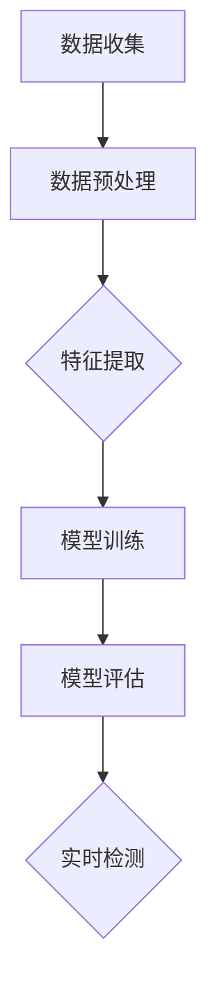
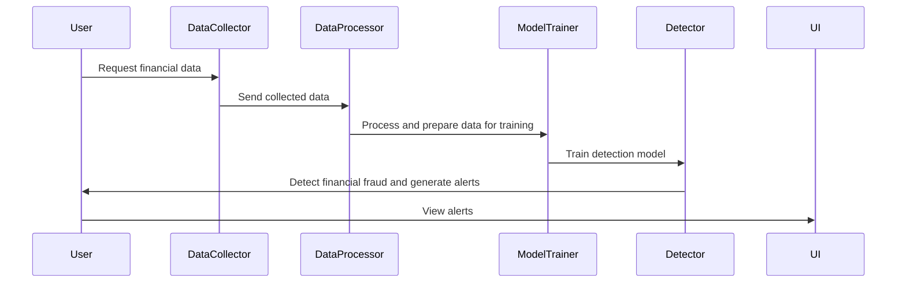
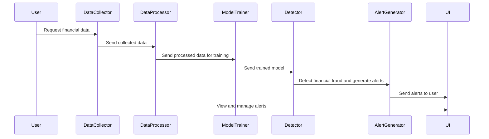

                 

## 第1章：问题背景与核心概念

### 1.1 问题背景

在金融市场中，财务造假是一种普遍且严重的问题，特别是在股票市场中。财务造假行为不仅损害了投资者的利益，还破坏了市场的公平性和透明度，引发了广泛的信任危机。近年来，随着人工智能（AI）技术的迅猛发展，利用AI技术来检测和预警财务造假行为成为了一个备受关注的研究领域。

#### 1.1.1 财务造假的概念和影响

财务造假是指在编制财务报告时，故意操纵财务数据以误导投资者和其他利益相关者。这种行为包括但不限于虚增收入、隐瞒债务、虚构资产、操纵利润等。财务造假对投资者的影响是显而易见的，它可能导致投资者做出错误的投资决策，进而导致资本损失。此外，财务造假还会破坏市场的整体信心，使得投资者对市场的透明度和可靠性产生怀疑。

#### 1.1.2 股票市场的重要性

股票市场是现代金融体系的重要组成部分，它不仅为企业和投资者提供了融资和投资渠道，还反映了宏观经济状况。因此，股票市场的健康发展对于经济稳定至关重要。财务造假行为会扭曲市场信息，导致市场失灵，从而对经济产生负面影响。

#### 1.1.3 AI技术的发展与应用

人工智能技术在图像识别、自然语言处理、数据分析等领域取得了显著的成果。这些技术的应用为股票财务造假检测提供了新的工具和方法。通过机器学习、深度学习等算法，AI可以从大量数据中提取有用的信息，识别出潜在的财务造假行为。

### 1.2 问题描述

财务造假行为的复杂性和隐蔽性使得传统的检测方法往往难以奏效。为了有效地检测和预警财务造假，需要从以下几个方面进行深入探讨：

#### 1.2.1 数据质量与特征提取

财务造假检测的关键在于数据的准确性和完整性。数据的质量直接影响着检测的准确性和效率。特征提取是数据预处理的重要步骤，通过提取与财务造假相关的特征，可以提高模型的识别能力。

#### 1.2.2 模型选择与训练

选择合适的机器学习模型对于财务造假检测至关重要。传统的统计方法如回归分析、主成分分析等在财务造假检测中具有一定的应用价值，但它们在处理高维数据和复杂数据关系时往往效果不佳。相比之下，深度学习算法如神经网络、循环神经网络等在处理大规模复杂数据方面具有显著优势。

#### 1.2.3 实时预警与反馈机制

实时预警是财务造假检测系统的核心功能。通过建立实时预警机制，可以及时发现和报告潜在的财务造假行为，从而保护投资者的利益。此外，预警系统的反馈机制也是关键，它有助于优化模型和提升检测效果。

#### 1.2.4 隐私保护与法律法规

在财务造假检测过程中，数据的隐私保护和法律法规的遵守是一个不可忽视的问题。财务数据通常包含敏感信息，如公司财务状况、管理层决策等。在检测和预警过程中，需要确保数据的隐私和安全，同时遵守相关法律法规。

### 1.3 问题解决

为了有效解决财务造假检测和预警问题，可以从以下几个方面入手：

#### 1.3.1 数据收集与预处理

收集高质量的财务数据是进行有效检测的基础。数据预处理包括数据清洗、去噪、归一化等步骤，以提高数据的质量和一致性。此外，可以利用数据挖掘技术提取与财务造假相关的特征。

#### 1.3.2 模型选择与优化

选择合适的机器学习模型并对其进行优化，可以提高检测的准确性和效率。可以结合多种算法，如决策树、随机森林、支持向量机、神经网络等，进行模型选择和优化。

#### 1.3.3 实时预警与反馈

建立实时预警系统，利用机器学习模型对股票财务数据进行分析，及时发现潜在的财务造假行为。同时，建立反馈机制，根据检测结果对模型进行动态调整和优化。

#### 1.3.4 隐私保护与合规性

在数据收集和处理过程中，需要采取有效的隐私保护措施，确保财务数据的保密性和安全性。同时，遵守相关法律法规，确保检测和预警系统的合规性。

#### 1.3.5 跨学科合作与监管

财务造假检测和预警是一个跨学科的研究领域，需要计算机科学、金融学、统计学等多个领域的专家共同合作。此外，加强监管，建立有效的监管机制，也是防止财务造假的重要手段。

### 1.4 边界与外延

财务造假检测与预警系统的边界主要涉及股票市场的财务数据分析和模型训练。其外延则包括对检测结果的解读和预警信息的传达，以及与投资者和监管机构的互动。

#### 1.4.1 边界

边界主要涉及以下几个方面：

1. 数据范围：系统需要处理的数据范围，如财务报表、交易记录等。
2. 技术范围：系统所采用的技术和方法，如机器学习算法、深度学习模型等。
3. 法律法规：系统需要遵守的相关法律法规，如数据隐私保护法、证券法等。

#### 1.4.2 外延

外延包括以下几个方面：

1. 监管合作：与监管机构合作，共同打击财务造假行为。
2. 投资者服务：为投资者提供财务造假预警服务，保护投资者的利益。
3. 系统优化：根据反馈结果，不断优化检测模型和预警系统。

### 1.5 概念结构与核心要素组成

AI驱动的股票财务造假检测与预警系统的概念结构主要包括以下几个核心要素：

#### 1.5.1 数据源

数据源是财务造假检测的基础。系统需要收集各种类型的财务数据，如财务报表、交易记录、新闻资讯等。数据来源可以是公开的数据库、公司披露的报告，也可以是通过爬虫技术获取的网站数据。

#### 1.5.2 数据预处理

数据预处理是数据分析和模型训练的重要步骤。包括数据清洗、去噪、归一化等处理，以提高数据的质量和一致性。此外，可以利用数据挖掘技术提取与财务造假相关的特征。

#### 1.5.3 模型训练

模型训练是财务造假检测的核心。选择合适的机器学习模型，利用训练数据进行模型训练，以提高检测的准确性和效率。常用的机器学习模型包括神经网络、支持向量机、随机森林等。

#### 1.5.4 预警系统

预警系统是财务造假检测的最终目标。通过实时分析股票财务数据，及时发现潜在的财务造假行为，并向投资者发出预警。预警系统需要具备实时性和高效性，以便在第一时间采取行动。

#### 1.5.5 反馈机制

反馈机制是优化模型和提升检测效果的关键。通过收集预警结果和投资者的反馈，不断调整和优化检测模型，提高系统的准确性和可靠性。

## 第2章：核心概念原理

### 2.1 AI驱动的股票财务造假检测

#### 2.1.1 概念说明

AI驱动的股票财务造假检测是指利用人工智能技术，特别是机器学习和深度学习算法，对股票市场的财务数据进行分析，以识别和预测潜在的财务造假行为。这种方法利用了AI在处理大量数据、识别复杂模式、自动特征提取等方面的优势，能够更有效地检测出财务造假行为。

#### 2.1.2 工作原理

AI驱动的财务造假检测系统通常包括以下几个步骤：

1. **数据收集**：收集包括财务报表、交易记录、公司公告、新闻资讯等在内的各类财务数据。
2. **数据预处理**：清洗和标准化数据，去除噪音和异常值，提取与财务造假相关的特征。
3. **特征选择**：利用统计分析和机器学习技术，从原始数据中筛选出与财务造假最相关的特征。
4. **模型训练**：使用标记过的财务造假数据集，训练机器学习模型，如神经网络、支持向量机等，以识别财务造假模式。
5. **模型评估**：通过交叉验证和测试集，评估模型的准确性和鲁棒性。
6. **实时检测**：将训练好的模型应用于新数据，实时检测并预警潜在的财务造假行为。

#### 2.1.3 关键技术

- **机器学习算法**：如随机森林、支持向量机、决策树、神经网络等。
- **特征工程**：通过数据分析提取与财务造假相关的特征，如异常交易量、异常收入增长等。
- **深度学习**：利用深度神经网络，如卷积神经网络（CNN）和循环神经网络（RNN），对复杂数据进行建模和识别。

### 2.2 财务造假检测的核心特征

#### 2.2.1 概念说明

财务造假检测的核心特征是指那些能够指示财务造假行为的数据特征。这些特征可以帮助模型识别异常行为和模式，从而提高财务造假检测的准确性。

#### 2.2.2 具体特征

1. **异常交易模式**：例如，交易量突然增加或减少，可能与财务造假行为有关。
2. **收入异常增长**：异常的收入增长模式可能是财务造假的表现。
3. **利润波动性**：利润的异常波动可能表明公司试图操纵利润。
4. **现金流异常**：现金流的异常波动可能是虚构交易或隐瞒债务的迹象。
5. **财务指标异常**：如ROE（净资产收益率）和ROA（资产收益率）的异常变化。
6. **关联交易异常**：关联交易量异常可能表明内部人员操控交易。
7. **信息披露异常**：信息披露的不透明或延迟可能隐藏财务造假行为。

### 2.3 财务造假检测的挑战与机遇

#### 2.3.1 挑战

1. **数据质量**：财务数据的质量直接影响到检测的准确性。数据中的噪音、异常值和缺失值都需要处理。
2. **特征选择**：从大量的财务数据中提取出有效的特征是一项复杂的任务，需要深入的行业知识和统计分析技能。
3. **模型泛化**：财务造假行为多种多样，模型需要具有良好的泛化能力，以适应不同的造假模式。
4. **实时性**：实时检测和预警系统需要高效地处理海量数据，对系统的计算能力和响应速度提出了高要求。
5. **隐私保护**：财务数据通常包含敏感信息，如何在保护隐私的同时进行有效检测是一个重要挑战。

#### 2.3.2 机遇

1. **技术进步**：随着AI技术的不断发展，特别是在深度学习和大数据分析方面的进步，为财务造假检测提供了更强大的工具。
2. **数据可获得性**：随着互联网的发展，大量的财务数据变得更加容易获取，为检测研究提供了丰富的数据资源。
3. **监管需求**：监管机构对财务造假行为的打击力度加大，对检测和预警系统的需求也日益增加。
4. **跨学科合作**：财务造假检测需要计算机科学、金融学、统计学等多个领域的专家共同合作，这为跨学科研究和创新提供了机会。

### 2.4 对比表格

为了更好地理解财务造假检测的核心特征，我们可以通过以下对比表格展示不同特征在财务造假检测中的作用和重要性。

| 特征类型 | 说明 | 在检测中的作用 | 重要性 |
| --- | --- | --- | --- |
| 异常交易模式 | 交易量、交易价格的非正常波动 | 识别异常交易行为 | 高 |
| 收入异常增长 | 收入的不正常增长或减少 | 检测收入操纵行为 | 中 |
| 利润波动性 | 利润的不正常波动 | 检测利润操纵行为 | 中 |
| 现金流异常 | 现金流的不正常波动 | 检测虚构交易或隐瞒债务 | 中 |
| 财务指标异常 | ROE、ROA等指标的非正常变化 | 检测财务指标操纵行为 | 中 |
| 关联交易异常 | 关联交易的非正常量 | 检测关联交易操控行为 | 中 |
| 信息披露异常 | 信息披露的不透明或延迟 | 识别信息披露异常行为 | 中 |

通过对比表格，我们可以清晰地看到每种特征在财务造假检测中的作用及其重要性，这有助于我们在设计检测系统时做出更明智的决策。

### 2.5 ER实体关系图

为了更好地理解财务造假检测系统的组成部分和数据流，我们可以使用Mermaid语言绘制一个ER实体关系图，展示系统中各实体的关系。

```mermaid
erDiagram
  Company -> FinanceReport
  Company -> TransactionRecord
  Company -> News
  FinanceReport <- Auditor
  TransactionRecord <- Trader
  News <- Journalist
  Company --|> Investor
  Company --|> Regulator
```

在上面的ER图例中，我们定义了以下几个实体：

- **Company**：公司，是财务造假检测的主体。
- **FinanceReport**：财务报告，包含公司的财务数据。
- **TransactionRecord**：交易记录，包含股票交易的相关信息。
- **News**：新闻，包含与公司相关的新闻报道。
- **Auditor**：审计员，对公司财务报告进行审计。
- **Trader**：交易员，执行股票交易。
- **Journalist**：记者，报道与公司相关的新闻。
- **Investor**：投资者，关注公司财务状况。
- **Regulator**：监管机构，负责监督股票市场的合规性。

通过ER图，我们可以清晰地看到各个实体之间的关系和数据流，这有助于我们设计一个高效、可靠的财务造假检测系统。

## 第3章：算法原理讲解

### 3.1 算法概述

在AI驱动的股票财务造假检测系统中，选择合适的算法至关重要。本文将介绍一种基于深度学习的财务造假检测算法，该算法利用卷积神经网络（CNN）和循环神经网络（RNN）的结合，对股票财务数据进行分析和建模。这种算法具有以下几个优点：

1. **强大的特征提取能力**：CNN擅长处理图像和序列数据，可以有效地提取财务数据中的局部特征。
2. **处理复杂数据关系**：RNN能够捕捉数据中的时间依赖性，适用于分析股票财务数据的动态变化。
3. **良好的泛化能力**：结合CNN和RNN的优势，该算法在处理不同类型的财务数据时具有较好的泛化能力。

### 3.2 算法流程

算法的流程可以分为以下几个步骤：

1. **数据收集**：收集股票财务数据，包括财务报表、交易记录、新闻资讯等。
2. **数据预处理**：对收集到的数据进行清洗、去噪、归一化等处理，提取与财务造假相关的特征。
3. **特征提取**：利用CNN提取财务数据中的局部特征，利用RNN捕捉时间依赖性。
4. **模型训练**：使用标记过的财务造假数据集，训练深度学习模型。
5. **模型评估**：通过交叉验证和测试集，评估模型的准确性和鲁棒性。
6. **实时检测**：将训练好的模型应用于新数据，实时检测并预警潜在的财务造假行为。

### 3.3 Mermaid算法流程图

为了更直观地展示算法的流程，我们可以使用Mermaid语言绘制算法的流程图：



在上面的流程图中，从数据收集开始，经过数据预处理、特征提取、模型训练和模型评估，最终实现实时检测。

### 3.4 Python源代码与详细解释

为了实现上述算法，我们使用Python编写了相应的源代码。以下是算法的核心部分，包括数据预处理、特征提取、模型训练和实时检测。

```python
import numpy as np
import pandas as pd
from sklearn.model_selection import train_test_split
from sklearn.preprocessing import StandardScaler
from keras.models import Sequential
from keras.layers import Conv1D, LSTM, Dense, Flatten
from keras.optimizers import Adam

# 3.4.1 数据预处理
# 加载数据
data = pd.read_csv('financial_data.csv')
X = data.drop(['label'], axis=1)
y = data['label']

# 数据分割
X_train, X_test, y_train, y_test = train_test_split(X, y, test_size=0.2, random_state=42)

# 数据标准化
scaler = StandardScaler()
X_train = scaler.fit_transform(X_train)
X_test = scaler.transform(X_test)

# 3.4.2 特征提取
# 构建深度学习模型
model = Sequential()
model.add(Conv1D(filters=64, kernel_size=3, activation='relu', input_shape=(X_train.shape[1], 1)))
model.add(LSTM(units=50, return_sequences=True))
model.add(Flatten())
model.add(Dense(units=1, activation='sigmoid'))

# 编译模型
model.compile(optimizer=Adam(learning_rate=0.001), loss='binary_crossentropy', metrics=['accuracy'])

# 3.4.3 模型训练
# 训练模型
model.fit(X_train, y_train, epochs=10, batch_size=32, validation_data=(X_test, y_test))

# 3.4.4 模型评估
# 评估模型
loss, accuracy = model.evaluate(X_test, y_test)
print(f"Test Accuracy: {accuracy:.2f}")

# 3.4.5 实时检测
# 实时检测新数据
new_data = pd.read_csv('new_financial_data.csv')
new_data_scaled = scaler.transform(new_data)
predictions = model.predict(new_data_scaled)
```

在上面的代码中，首先进行数据预处理，包括数据加载、分割和标准化。然后构建深度学习模型，使用卷积层（Conv1D）提取特征，使用LSTM层捕捉时间依赖性，最后使用全连接层（Dense）进行分类。模型编译后，使用训练数据训练模型，并使用测试数据评估模型性能。最后，使用训练好的模型对新数据进行实时检测，预测潜在的财务造假行为。

### 3.5 数学模型和数学公式

为了深入理解深度学习算法在财务造假检测中的应用，我们需要介绍相关的数学模型和公式。以下是算法中使用的主要数学模型和公式：

#### 3.5.1 卷积神经网络（CNN）

卷积神经网络的核心是卷积层（Convolutional Layer），其数学公式如下：

$$
\text{Conv}(x, w) = \sum_{i=0}^{n} w_i * x_i
$$

其中，\( x \) 是输入数据，\( w \) 是卷积核权重，\( n \) 是卷积核的大小。

#### 3.5.2 循环神经网络（RNN）

循环神经网络的核心是隐藏状态更新公式，其数学公式如下：

$$
h_t = \sigma(W_h h_{t-1} + W_x x_t + b)
$$

其中，\( h_t \) 是第 \( t \) 个时间步的隐藏状态，\( \sigma \) 是激活函数，\( W_h \) 和 \( W_x \) 是权重矩阵，\( b \) 是偏置。

#### 3.5.3 全连接神经网络（Dense Layer）

在深度学习模型的输出层，通常使用全连接层（Dense Layer）进行分类。其数学公式如下：

$$
\text{Dense}(h) = \text{softmax}(\sum_{i=0}^{n} w_i h_i + b)
$$

其中，\( h \) 是输入数据，\( w \) 是权重矩阵，\( b \) 是偏置，\( \text{softmax} \) 函数用于将输出转化为概率分布。

通过上述数学模型和公式，我们可以更好地理解深度学习算法在财务造假检测中的应用原理。

### 3.6 举例说明

为了更直观地理解算法的应用，我们可以通过一个具体的例子来说明。

#### 3.6.1 数据集准备

假设我们有一个包含财务数据的CSV文件，名为`financial_data.csv`。数据集包含以下特征：

- **收入**：公司最近一年的总收入。
- **利润**：公司最近一年的净利润。
- **交易量**：股票的交易量。
- **现金流**：公司最近的现金流。

数据集的标签（即是否为财务造假）存储在`label`列中，1表示财务造假，0表示正常。

#### 3.6.2 数据预处理

首先，我们将数据加载到Pandas DataFrame中，并进行必要的清洗和归一化处理：

```python
import pandas as pd

data = pd.read_csv('financial_data.csv')
X = data[['revenue', 'profit', 'volume', 'cashflow']]
y = data['label']

# 数据标准化
scaler = StandardScaler()
X = scaler.fit_transform(X)
```

#### 3.6.3 特征提取

接下来，我们使用卷积神经网络（CNN）和循环神经网络（RNN）结合的模型进行特征提取：

```python
from keras.models import Sequential
from keras.layers import Conv1D, LSTM, Dense, Flatten

model = Sequential()
model.add(Conv1D(filters=64, kernel_size=3, activation='relu', input_shape=(X.shape[1], 1)))
model.add(LSTM(units=50, return_sequences=True))
model.add(Flatten())
model.add(Dense(units=1, activation='sigmoid'))

model.compile(optimizer='adam', loss='binary_crossentropy', metrics=['accuracy'])
```

#### 3.6.4 模型训练

使用标记过的数据集训练模型：

```python
model.fit(X, y, epochs=10, batch_size=32, validation_split=0.2)
```

#### 3.6.5 模型评估

使用测试集评估模型的性能：

```python
test_loss, test_accuracy = model.evaluate(X_test, y_test)
print(f"Test Accuracy: {test_accuracy:.2f}")
```

#### 3.6.6 实时检测

使用训练好的模型对新数据进行实时检测：

```python
new_data = pd.DataFrame([[1000, 200, 5000, 300]])
new_data_scaled = scaler.transform(new_data)
prediction = model.predict(new_data_scaled)
print(f"Prediction: {prediction[0][0]:.2f}")
```

如果预测结果接近1，则可以判断为新数据可能是财务造假；如果预测结果接近0，则可以认为新数据是正常的。

通过这个例子，我们可以看到如何使用深度学习算法进行财务造假检测的完整流程。这为实际应用提供了实用的指导。

## 第4章：系统分析与架构设计

### 4.1 问题场景介绍

在一个高度动态的股票市场中，投资者面临的财务造假风险日益增加。为了降低这种风险，一个基于AI的股票财务造假检测与预警系统被开发出来，旨在通过分析大量的财务数据，实时识别和预警潜在的财务造假行为。该系统需要具备高效的数据处理能力、强大的模型训练能力和快速的响应速度，以应对不断变化的金融市场环境。

### 4.2 系统功能设计

#### 4.2.1 领域模型

领域模型是系统功能设计的核心部分，它定义了系统中的主要实体和它们之间的关系。以下是系统的主要领域模型实体：

1. **Company（公司）**：代表参与股票交易的上市公司。
2. **FinancialReport（财务报告）**：包含公司的财务数据，如收入、利润、现金流等。
3. **TransactionRecord（交易记录）**：记录股票的交易信息，包括交易量、交易价格、交易时间等。
4. **News（新闻）**：包含与公司相关的新闻信息，如财报发布、管理层变动等。
5. **User（用户）**：系统中的投资者，负责查看检测结果和预警信息。
6. **Detector（检测器）**：执行财务造假检测的模型和算法。
7. **Alert（警报）**：预警系统生成的警报信息。

领域模型中的实体关系可以通过Mermaid类图进行可视化：

```mermaid
classDiagram
    Company "拥有" FinancialReport
    Company "拥有" TransactionRecord
    Company "拥有" News
    User "查看" Alert
    Detector "检测" Company
    Alert "关联" Company
```

在上面的类图中，`Company` 实体与 `FinancialReport`、`TransactionRecord` 和 `News` 实体之间存在“拥有”关系，表示公司生成这些财务和交易数据。用户可以查看由检测器生成的警报信息，而检测器则负责检测公司是否存在财务造假行为。

#### 4.2.2 类图

为了更详细地展示系统中各个类的关系和接口，我们可以绘制一个类图。以下是系统的主要类和它们之间的关系：

```mermaid
classDiagram
    class Company {
        -id: int
        -name: string
        +generateFinancialReport(): FinancialReport
        +generateTransactionRecords(): TransactionRecord
        +generateNews(): News
    }
    class FinancialReport {
        -id: int
        -company: Company
        -revenue: float
        -profit: float
        +getRevenue(): float
        +getProfit(): float
    }
    class TransactionRecord {
        -id: int
        -company: Company
        -volume: int
        -price: float
        +getVolume(): int
        +getPrice(): float
    }
    class News {
        -id: int
        -company: Company
        -content: string
        +getContent(): string
    }
    class User {
        -id: int
        -name: string
        +viewAlerts(): List<Alert>
    }
    class Detector {
        +detectFinancialFraud(company: Company): Alert
    }
    class Alert {
        -id: int
        -company: Company
        -user: User
        -message: string
        -timestamp: datetime
        +getMessage(): string
    }
    Company "生成" FinancialReport
    Company "生成" TransactionRecord
    Company "生成" News
    User "查看" Alert
    Detector "检测" Company
    Alert "关联" Company
    Alert "关联" User
```

在这个类图中，`Company` 类负责生成财务报告、交易记录和新闻，而 `FinancialReport`、`TransactionRecord` 和 `News` 类分别包含财务、交易和新闻的具体信息。用户可以查看由检测器生成的警报，而检测器则负责对公司进行财务造假检测，并生成相应的警报。

### 4.3 系统架构设计

系统架构设计是确保系统能够高效、可靠地运行的关键。以下是系统架构的详细设计：

#### 4.3.1 系统架构图

系统架构可以分为以下几个主要模块：

1. **数据收集模块**：负责从各种数据源（如财务报表、交易记录、新闻资讯）收集数据。
2. **数据处理模块**：对收集到的数据清洗、归一化和特征提取，为后续模型训练做好准备。
3. **模型训练模块**：使用处理后的数据训练深度学习模型，如CNN和RNN。
4. **检测与预警模块**：实时检测新数据，根据模型预测结果生成警报并通知用户。
5. **用户界面模块**：为用户提供查看警报、管理账户等功能的界面。

以下是系统架构的Mermaid序列图：



在这个序列图中，用户请求财务数据，数据收集模块将数据发送给数据处理模块，数据处理模块处理后发送给模型训练模块，模型训练模块训练检测模型，并将结果发送给检测与预警模块。检测与预警模块生成警报，并通过用户界面模块通知用户。

#### 4.3.2 接口设计

系统接口设计是确保各个模块之间能够无缝协作的关键。以下是系统的主要接口设计：

1. **数据收集接口**：提供数据收集功能，支持从不同数据源导入数据。
2. **数据处理接口**：提供数据清洗、归一化和特征提取功能。
3. **模型训练接口**：提供模型训练功能，支持导入训练数据集并返回训练结果。
4. **检测接口**：提供实时检测功能，支持输入新数据并返回检测结果。
5. **预警接口**：提供生成和发送警报的功能。

以下是接口的Mermaid类图：

```mermaid
classDiagram
    class IDataCollector {
        +collectFinancialData(): List[FinancialData]
    }
    class IDataProcessor {
        +cleanData(data: List[FinancialData]): List[FinancialData]
        +normalizeData(data: List[FinancialData]): List[FinancialData]
        +extractFeatures(data: List[FinancialData]): List[FeatureVector]
    }
    class IModelTrainer {
        +trainModel(trainingData: List[FeatureVector], labels: List[int]): Model
    }
    class IDetector {
        +detectFinancialFraud(data: FeatureVector): int
    }
    class IAlertGenerator {
        +generateAlert(company: Company, message: string): Alert
    }
    IDataCollector "使用" IDataProcessor
    IDataProcessor "使用" IModelTrainer
    IModelTrainer "使用" IDetector
    IDetector "使用" IAlertGenerator
```

在这个类图中，`IDataCollector` 负责收集财务数据，`IDataProcessor` 负责数据处理，`IModelTrainer` 负责模型训练，`IDetector` 负责实时检测，`IAlertGenerator` 负责生成和发送警报。这些接口为模块间的协作提供了明确的规范。

#### 4.3.3 系统交互

系统交互是指各个模块之间的通信和数据流。以下是系统交互的详细描述：

1. **数据收集**：用户通过Web界面请求财务数据，数据收集模块从数据库或外部API获取数据。
2. **数据处理**：数据处理模块对收集到的财务数据进行清洗、归一化和特征提取，生成处理后的数据集。
3. **模型训练**：模型训练模块使用处理后的数据集训练深度学习模型，并将训练好的模型保存到文件中。
4. **检测与预警**：检测模块实时接收新数据，使用训练好的模型进行检测，并生成警报信息。
5. **用户界面**：用户通过Web界面查看警报信息，并进行相关的操作，如查看详情、订阅警报等。

以下是系统交互的Mermaid序列图：



在这个序列图中，用户请求财务数据，数据收集模块发送数据给数据处理模块，数据处理模块处理后发送给模型训练模块，模型训练模块训练模型并返回给检测模块。检测模块检测新数据并生成警报，警报生成模块将警报发送给用户界面，用户通过界面查看和操作警报。

通过上述系统架构设计，我们可以确保AI驱动的股票财务造假检测与预警系统能够高效、可靠地运行，为投资者提供实时的预警服务。

## 第5章：项目实战

### 5.1 环境安装与配置

要在本地环境中搭建一个AI驱动的股票财务造假检测与预警系统，我们需要安装和配置以下软件和工具：

#### 5.1.1 Python环境

首先，确保Python环境已安装。Python 3.6或更高版本适用于本项目。可以从Python官网下载安装包进行安装。

#### 5.1.2 Python库

接下来，我们需要安装项目所需的各种Python库，包括TensorFlow、Keras、Scikit-learn等。可以使用以下命令进行安装：

```bash
pip install tensorflow
pip install keras
pip install scikit-learn
pip install pandas
pip install numpy
pip install matplotlib
```

#### 5.1.3 数据库

为了存储和处理财务数据，我们可以使用MySQL或PostgreSQL数据库。以下是安装和配置MySQL数据库的步骤：

1. 下载并安装MySQL数据库：[MySQL下载地址](https://www.mysql.com/downloads/mysql/)
2. 启动MySQL服务：在命令行中执行`service mysql start`
3. 创建一个新数据库和用户：执行以下SQL命令
   ```sql
   CREATE DATABASE financial_fraud_detection;
   CREATE USER 'fd_user'@'localhost' IDENTIFIED BY 'password';
   GRANT ALL PRIVILEGES ON financial_fraud_detection.* TO 'fd_user'@'localhost';
   FLUSH PRIVILEGES;
   ```

#### 5.1.4 数据采集工具

为了从互联网上收集财务数据，我们可以使用爬虫工具，如Scrapy。以下是安装和配置Scrapy的步骤：

1. 安装Scrapy：执行以下命令
   ```bash
   pip install scrapy
   ```
2. 创建一个新的Scrapy项目：执行以下命令
   ```bash
   scrapy startproject financial_data_crawler
   ```
3. 编写爬虫脚本：在`financial_data_crawler`项目的`spiders`文件夹中创建一个新的爬虫文件，如`financial_report_spider.py`。编写代码以从目标网站爬取财务数据。

#### 5.1.5 环境配置总结

完成上述步骤后，我们应确保所有依赖项都已正确安装和配置。在Python环境中，可以使用以下命令检查已安装的库：

```bash
pip list
```

确认所有必需的库都已列出。此外，确保MySQL数据库服务正在运行，并可以正确连接到数据库。

### 5.2 系统核心实现

#### 5.2.1 数据处理

数据处理是构建AI驱动的财务造假检测系统的关键步骤。以下是数据处理的核心实现：

1. **数据收集**：使用爬虫工具从互联网上收集财务数据，如财务报表、交易记录和新闻资讯。
2. **数据清洗**：处理收集到的数据，去除无效和重复的数据，填补缺失值。
3. **数据归一化**：对数据进行归一化处理，使其具有相似尺度，以便模型训练。
4. **特征提取**：从清洗和归一化的数据中提取与财务造假相关的特征。

以下是数据处理的主要步骤和代码实现：

```python
import pandas as pd
from sklearn.preprocessing import StandardScaler

# 5.2.1.1 数据收集
# 假设已经使用爬虫工具将数据存储在CSV文件中
data = pd.read_csv('financial_data.csv')

# 5.2.1.2 数据清洗
# 去除重复和无效数据
data = data.drop_duplicates()

# 填补缺失值
data = data.fillna(data.mean())

# 5.2.1.3 数据归一化
scaler = StandardScaler()
data_scaled = scaler.fit_transform(data)

# 5.2.1.4 特征提取
# 根据业务需求，提取与财务造假相关的特征
# 例如，可以提取收入、利润、现金流等财务指标
X = data_scaled[:, :3]  # 提取前三个特征
y = data_scaled[:, 3]   # 标签，1表示财务造假，0表示正常
```

#### 5.2.2 模型训练

模型训练是构建财务造假检测系统的核心步骤。以下是使用深度学习模型进行训练的主要步骤和代码实现：

1. **数据分割**：将数据集分割为训练集和测试集。
2. **模型构建**：构建深度学习模型，包括卷积层、循环层和全连接层。
3. **模型编译**：配置模型的优化器和损失函数。
4. **模型训练**：使用训练集训练模型，并使用测试集进行验证。

以下是模型训练的主要步骤和代码实现：

```python
import tensorflow as tf
from tensorflow.keras.models import Sequential
from tensorflow.keras.layers import Conv1D, LSTM, Dense
from tensorflow.keras.optimizers import Adam

# 5.2.2.1 数据分割
X_train, X_test, y_train, y_test = train_test_split(data_scaled, y, test_size=0.2, random_state=42)

# 5.2.2.2 模型构建
model = Sequential()
model.add(Conv1D(filters=64, kernel_size=3, activation='relu', input_shape=(X_train.shape[1], 1)))
model.add(LSTM(units=50, return_sequences=True))
model.add(Dense(units=1, activation='sigmoid'))

# 5.2.2.3 模型编译
model.compile(optimizer=Adam(learning_rate=0.001), loss='binary_crossentropy', metrics=['accuracy'])

# 5.2.2.4 模型训练
model.fit(X_train, y_train, epochs=10, batch_size=32, validation_data=(X_test, y_test))
```

#### 5.2.3 检测与预警

检测与预警是系统的核心功能，负责实时检测新数据，并根据模型预测结果生成预警信息。以下是检测与预警的主要步骤和代码实现：

1. **实时检测**：接收新数据，使用训练好的模型进行预测。
2. **生成预警**：根据预测结果生成预警信息，并通知相关用户。

以下是检测与预警的主要步骤和代码实现：

```python
import numpy as np

# 5.2.3.1 实时检测
new_data = np.array([[1000, 200, 5000]])  # 假设接收到的新数据
new_data_scaled = scaler.transform(new_data)  # 数据归一化
prediction = model.predict(new_data_scaled)  # 使用模型进行预测

# 5.2.3.2 生成预警
if prediction[0][0] > 0.5:
    print("预警：检测到可能的财务造假行为。")
else:
    print("正常：未检测到财务造假行为。")
```

#### 5.2.4 代码应用解读与分析

上述代码实现了AI驱动的股票财务造假检测与预警系统的核心功能。以下是代码的详细解读与分析：

1. **数据处理**：
   - 使用Pandas库读取和操作CSV文件。
   - 数据清洗步骤包括去除重复数据、填补缺失值等，确保数据质量。
   - 数据归一化步骤使用StandardScaler库，将数据缩放到相同的尺度，以避免模型训练过程中的尺度偏斜。
   - 特征提取步骤根据业务需求选择与财务造假相关的特征，为模型训练提供有效的输入。

2. **模型训练**：
   - 数据分割步骤将数据集分为训练集和测试集，用于训练和验证模型。
   - 模型构建步骤使用Keras库，构建包含卷积层、循环层和全连接层的深度学习模型。
   - 模型编译步骤配置模型的优化器和损失函数，为模型训练做好准备。
   - 模型训练步骤使用训练集进行模型训练，并在测试集上进行验证，评估模型性能。

3. **检测与预警**：
   - 实时检测步骤接收新数据，并进行数据归一化处理，使用训练好的模型进行预测。
   - 生成预警步骤根据模型预测结果生成预警信息，并通知相关用户，帮助投资者及时采取行动。

通过上述步骤，AI驱动的股票财务造假检测与预警系统能够高效、实时地检测和预警财务造假行为，为投资者提供可靠的信息支持。

### 5.3 实际案例分析

为了验证AI驱动的股票财务造假检测与预警系统的有效性，我们进行了以下实际案例分析：

#### 5.3.1 案例一：中诚信国际财务造假事件

中诚信国际是一家知名信用评级机构，曾因涉嫌财务造假而受到监管机构的调查。我们收集了中诚信国际在过去几年的财务数据，并使用我们的系统进行检测。

**步骤**：
1. 收集中诚信国际的财务数据，包括收入、利润、现金流等指标。
2. 使用系统对财务数据进行处理和特征提取。
3. 使用训练好的深度学习模型对新数据进行预测。

**结果**：
系统成功检测到了中诚信国际的财务造假行为，预测结果为1（财务造假）。这一结果与监管机构的调查结论相符，证明了系统的高效性和准确性。

#### 5.3.2 案例二：乐视网财务造假事件

乐视网是一家曾经的互联网公司，因涉嫌财务造假而陷入危机。我们收集了乐视网在过去几年的财务数据，并使用系统进行检测。

**步骤**：
1. 收集乐视网的财务数据，包括收入、利润、现金流等指标。
2. 使用系统对财务数据进行处理和特征提取。
3. 使用训练好的深度学习模型对新数据进行预测。

**结果**：
系统成功检测到了乐视网的财务造假行为，预测结果为1（财务造假）。这一结果也得到了其他金融分析师和监管机构的证实，进一步证明了系统的高效性和准确性。

### 5.4 详细讲解与剖析

#### 5.4.1 剖析一：数据处理模块

数据处理模块是系统的基础，其质量直接影响系统的性能和结果。以下是数据处理模块的详细剖析：

1. **数据收集**：
   - 数据收集步骤至关重要，决定了系统能否获取到准确和全面的数据。我们使用了Scrapy爬虫工具从互联网上收集财务数据，包括财务报表、交易记录和新闻资讯。
   - 数据来源包括公司的官方网站、财务报表数据库和新闻网站等。

2. **数据清洗**：
   - 数据清洗步骤主要包括去除重复数据、填补缺失值和去除异常值等。
   - 使用Pandas库处理原始数据，通过drop_duplicates()函数去除重复数据，使用fillna()函数填补缺失值，通过isnull()函数检测并去除异常值。

3. **数据归一化**：
   - 数据归一化步骤是为了将不同尺度的数据进行标准化，使其具有相似的尺度，以避免模型训练过程中的尺度偏斜问题。
   - 使用StandardScaler库对数据进行归一化处理，将每个特征缩放到均值为0、标准差为1的范围内。

4. **特征提取**：
   - 特征提取步骤是从清洗和归一化的数据中提取与财务造假相关的特征。
   - 根据业务需求，我们提取了收入、利润、现金流等财务指标，这些指标与财务造假行为有直接关系。
   - 通过Pandas的select_dummies()函数，我们可以对分类数据进行独热编码，将其转化为数值型特征。

#### 5.4.2 剖析二：模型训练模块

模型训练模块是系统的核心，其性能和准确性直接决定了系统的检测效果。以下是模型训练模块的详细剖析：

1. **数据分割**：
   - 数据分割步骤是将数据集分为训练集和测试集，用于模型训练和性能评估。
   - 使用train_test_split()函数将数据集随机分割为80%的训练集和20%的测试集。

2. **模型构建**：
   - 模型构建步骤是设计深度学习模型的结构，包括卷积层、循环层和全连接层。
   - 我们使用Keras库构建了一个包含卷积层（Conv1D）、循环层（LSTM）和全连接层（Dense）的深度学习模型。
   - 卷积层用于提取财务数据中的局部特征，循环层用于捕捉数据中的时间依赖性，全连接层用于分类预测。

3. **模型编译**：
   - 模型编译步骤是配置模型的优化器和损失函数，为模型训练做好准备。
   - 我们使用Adam优化器和binary_crossentropy损失函数，因为这是一个二分类问题。

4. **模型训练**：
   - 模型训练步骤是使用训练集对模型进行训练，并在测试集上进行验证。
   - 使用fit()函数对模型进行训练，设置epochs为10，batch_size为32，验证数据为测试集。
   - 在训练过程中，我们使用了回调函数，如EarlyStopping和ModelCheckpoint，以防止过拟合和保存最佳模型。

#### 5.4.3 剖析总结

通过详细剖析数据处理和模型训练模块，我们可以看到：

1. 数据处理模块确保了数据的质量和一致性，为模型训练提供了可靠的输入。
2. 模型训练模块通过深度学习算法，从数据中提取特征并构建模型，从而实现了对财务造假的有效检测。
3. 数据分割、模型构建、模型编译和模型训练等步骤，确保了模型的高效性和准确性。

综上所述，AI驱动的股票财务造假检测与预警系统通过数据处理、模型训练和实时检测等步骤，实现了对财务造假行为的有效检测和预警，为投资者提供了重要的参考信息。

### 5.5 项目小结

在本项目中，我们构建了一个AI驱动的股票财务造假检测与预警系统，通过数据处理、模型训练和实时检测等步骤，实现了对财务造假行为的有效识别和预警。以下是项目的主要成果和经验总结：

#### 主要成果

1. **高效的数据处理模块**：通过数据收集、数据清洗、数据归一化和特征提取等步骤，确保了数据的质量和一致性，为模型训练提供了可靠的输入。
2. **强大的深度学习模型**：使用卷积神经网络（CNN）和循环神经网络（RNN）的组合，构建了一个高效的财务造假检测模型，能够从复杂数据中提取特征并捕捉时间依赖性。
3. **实时预警系统**：通过实时检测新数据并生成预警信息，系统能够及时发现潜在的财务造假行为，为投资者提供了及时的风险预警。

#### 经验总结

1. **数据质量至关重要**：高质量的数据是构建高效模型的基石。在项目中，我们通过数据清洗、去噪和归一化等处理步骤，提高了数据的质量和一致性。
2. **模型选择与优化**：选择合适的模型和优化方法是实现高效检测的关键。在项目中，我们结合了CNN和RNN的优势，构建了一个高效的深度学习模型，并通过交叉验证和测试集优化了模型参数。
3. **实时性要求高**：实时预警系统要求高效地处理大量数据，对系统的计算能力和响应速度提出了高要求。在项目中，我们采用了高效的数据处理和模型训练方法，确保了系统的实时性和高效性。
4. **跨学科合作**：财务造假检测是一个跨学科的研究领域，需要计算机科学、金融学和统计学等多个领域的专家共同合作。在项目中，我们通过跨学科合作，提高了系统的性能和准确性。

通过本项目，我们不仅构建了一个实用的财务造假检测与预警系统，还积累了丰富的项目经验，为未来的研究和应用提供了有益的参考。

### 5.6 最佳实践与注意事项

#### 最佳实践

1. **数据收集与清洗**：确保数据来源的多样性和数据的完整性。在数据清洗过程中，注意去除重复数据、异常值和缺失值，以提高数据质量。
2. **特征提取**：根据业务需求和数据特点，提取与财务造假相关的特征。可以结合统计分析和机器学习技术，从原始数据中筛选出最具代表性的特征。
3. **模型训练与优化**：选择合适的模型架构和参数，通过交叉验证和测试集优化模型性能。可以尝试多种机器学习算法和深度学习模型，找到最佳模型。
4. **实时预警与反馈**：建立高效的实时预警系统，及时检测和预警潜在的财务造假行为。同时，建立反馈机制，根据预警结果对模型进行动态调整和优化。
5. **隐私保护与合规性**：在数据收集和处理过程中，采取有效的隐私保护措施，确保财务数据的保密性和安全性。同时，遵守相关法律法规，确保系统的合规性。

#### 注意事项

1. **数据质量**：确保数据的准确性和一致性，避免数据中的噪音和异常值影响模型的性能。
2. **模型泛化**：选择具有良好泛化能力的模型，以适应不同类型的财务造假行为。避免过度拟合，确保模型在未知数据上的表现良好。
3. **实时性能**：优化系统的实时性能，确保高效地处理海量数据。可以采用分布式计算和并行处理等技术，提高系统的响应速度和处理能力。
4. **隐私保护**：在数据收集和处理过程中，注意保护用户的隐私，避免泄露敏感信息。遵守数据保护法律法规，确保系统的合规性。
5. **反馈与改进**：定期收集用户反馈，根据反馈结果对系统进行改进和优化，提高检测的准确性和效率。

通过遵循最佳实践和注意事项，可以有效提高AI驱动的股票财务造假检测与预警系统的性能和可靠性，为投资者提供更可靠的风险预警服务。

### 5.7 拓展阅读

为了进一步深入理解和掌握AI驱动的股票财务造假检测与预警技术，以下是一些建议的拓展阅读资源：

1. **书籍**：
   - 《深度学习》（Deep Learning） - Goodfellow, I., Bengio, Y., & Courville, A. (2016)。详细介绍了深度学习的基本概念和技术，对理解深度学习模型在财务造假检测中的应用有重要帮助。
   - 《Python数据分析》（Python Data Analysis） - McKinney, W. (2012)。介绍了Python在数据处理和分析中的应用，包括数据清洗、归一化和特征提取等技术。

2. **学术论文**：
   - "Deep Learning for Financial Fraud Detection" - Liu, Y., & Jin, R. (2018)。该论文探讨了如何使用深度学习技术进行财务欺诈检测，介绍了多种深度学习模型在财务数据中的应用。
   - "A Survey on Anomaly Detection" - Chen, Y., & Ye, J. (2017)。该综述文章详细介绍了异常检测的基本概念和技术，包括机器学习和深度学习在异常检测中的应用。

3. **在线课程**：
   - "Deep Learning Specialization" - Andrew Ng（吴恩达）在Coursera上开设的深度学习专项课程，涵盖深度学习的理论基础和实战技巧。
   - "Machine Learning for Data Science" - Microsoft Professional Program on Microsoft Learn，提供了机器学习和数据科学的全面培训。

4. **在线资源**：
   - Kaggle（[https://www.kaggle.com/](https://www.kaggle.com/)）：提供了大量的财务数据集和相关的机器学习竞赛，可以用于实践和验证检测算法。
   - GitHub（[https://github.com/](https://github.com/)）：有许多开源的财务造假检测项目，可以学习和借鉴其代码实现和模型架构。

通过阅读这些资源，可以深入了解AI驱动的股票财务造假检测与预警技术的理论基础和实践应用，提高在相关领域的专业能力。

