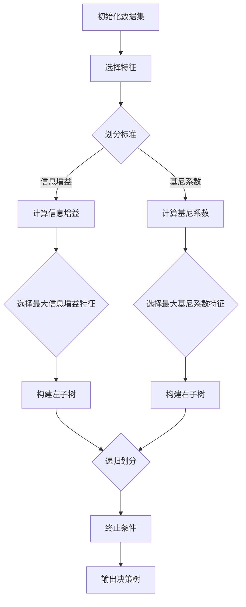
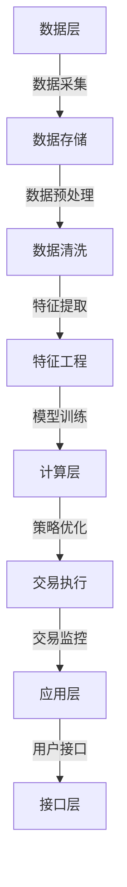
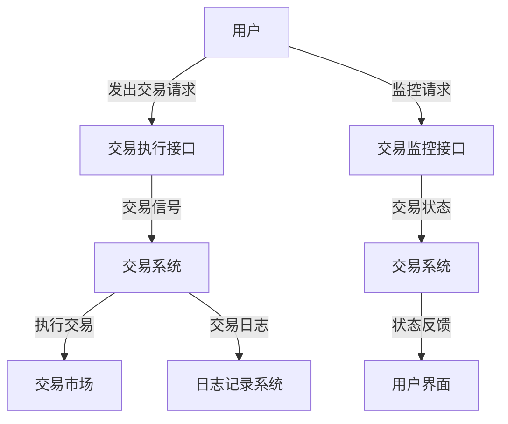
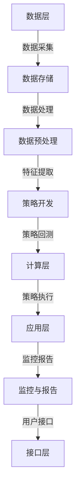
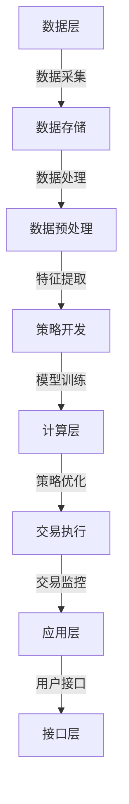
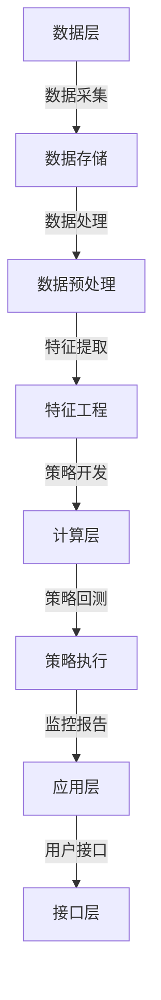
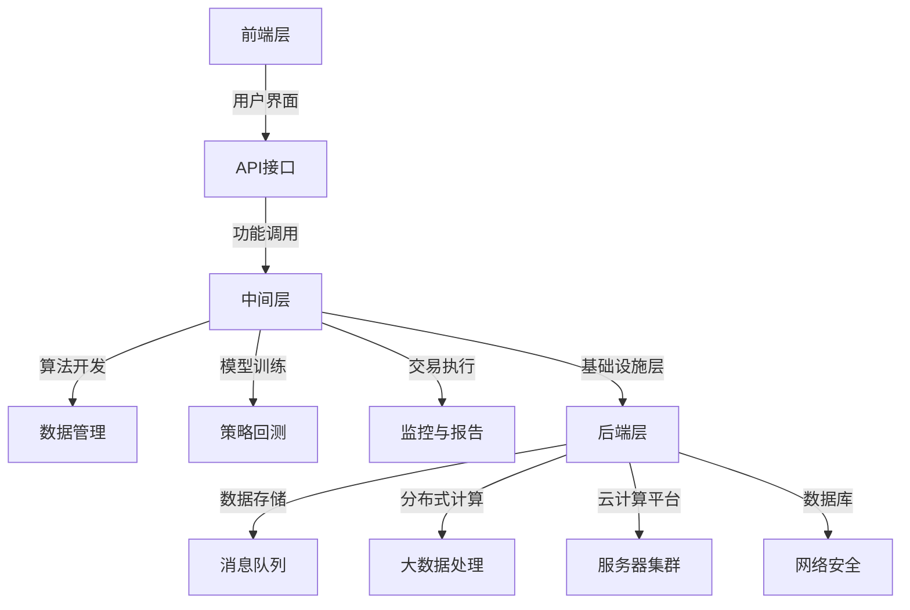
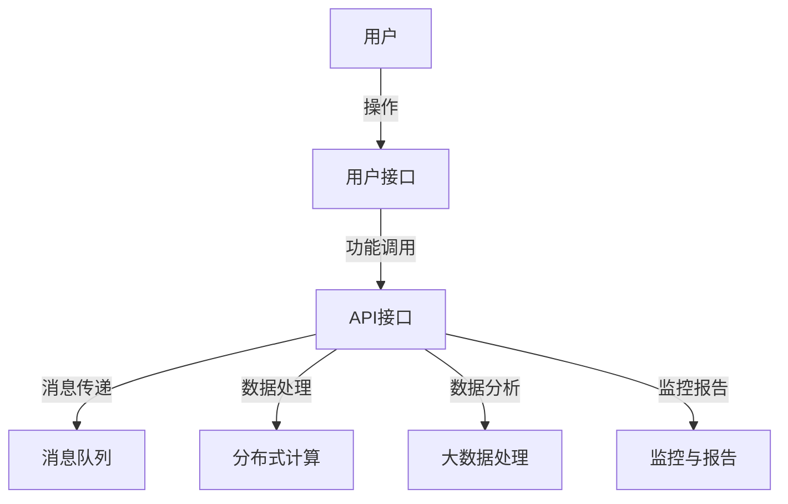
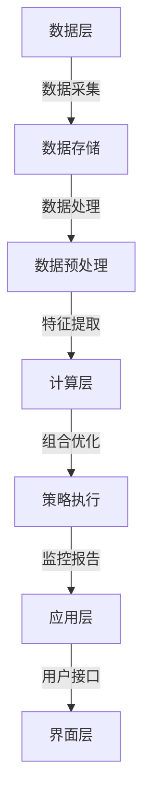
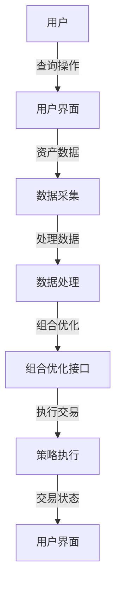

                 


### 第二部分：AI和机器学习基础

#### 第2章：AI与机器学习概述

> “本章节将介绍人工智能（AI）和机器学习（ML）的基础知识，帮助读者理解AI在量化交易中的角色和应用。”

## 2.1 引言

### 2.1.1 什么是AI？

#### 定义与历史

- **定义**：人工智能是计算机科学的一个分支，旨在使机器具备人类智能。
- **历史**：从1950年图灵测试的提出，到今天的深度学习，人工智能经历了多个发展阶段。

### 2.1.2 AI的应用领域

- **自动化**：工业生产、自动驾驶。
- **数据分析**：数据挖掘、图像识别。
- **量化交易**：算法交易、市场预测。

### 2.1.3 机器学习与AI的关系

- **机器学习是AI的一部分**。
- **机器学习侧重于从数据中学习规律和模式**。

## 2.2 机器学习基础

### 2.2.1 监督学习

#### 监督学习模型

- **定义**：输入输出有明确标注的数据集。
- **模型**：回归模型、分类模型。
- **算法**：线性回归、决策树、随机森林。

### 2.2.2 无监督学习

#### 无监督学习模型

- **定义**：没有标注的数据集。
- **模型**：聚类、降维。
- **算法**：K-均值聚类、主成分分析（PCA）。

### 2.2.3 强化学习

#### 强化学习模型

- **定义**：通过与环境的交互来学习最优策略。
- **模型**：马尔可夫决策过程（MDP）。
- **算法**：Q-learning、深度Q网络（DQN）。

## 2.3 机器学习在量化交易中的应用

### 2.3.1 基本概念

- **量化交易策略**：使用数学模型和计算机算法进行交易决策。
- **AI驱动的策略**：利用机器学习算法优化策略参数。

### 2.3.2 应用实例

- **趋势预测**：利用时间序列分析预测价格走势。
- **风险控制**：通过机器学习模型进行风险分析和预警。

### 2.3.3 关键挑战

- **数据质量**：高质量的数据是机器学习模型成功的关键。
- **过拟合**：模型过于复杂可能导致过拟合。

## 2.4 概念结构与核心要素组成

### 2.4.1 核心概念

- **人工智能**：模拟人类智能的技术。
- **机器学习**：从数据中学习规律和模式。
- **量化交易**：使用数学模型进行交易决策。

### 2.4.2 概念属性特征对比表格

| 概念       | 定义                                                         | 特点                                                         |
|------------|--------------------------------------------------------------|--------------------------------------------------------------|
| 人工智能   | 使机器具备人类智能的技术。                                   | 智能化、自动化、自主学习。                                  |
| 机器学习   | 从数据中学习规律和模式。                                     | 自动化、高效、可扩展。                                      |
| 量化交易   | 使用数学模型和计算机算法进行交易决策。                       | 科学化、系统化、高效化。                                    |

### 2.4.3 ER实体关系图架构

```mermaid
erDiagram
    AI ||--|{ 机器学习 } |
    机器学习 ||--|{ 量化交易 } |
```

## 2.5 本章小结

- **核心概念与联系**：人工智能、机器学习、量化交易。
- **主要内容**：介绍了AI和ML的基础知识，以及它们在量化交易中的应用。
- **读者受益**：帮助读者建立AI和ML的基础概念，理解其在量化交易中的重要性。

### 算法原理讲解

为了深入理解机器学习在量化交易中的应用，我们将详细介绍一种常用的机器学习算法——决策树。

#### 决策树算法原理

决策树是一种常用的分类和回归算法，它通过一系列的判断来分割数据集，最终达到分类或预测的目的。

1. **基本概念**：
   - **节点**：代表一个特征。
   - **分支**：代表不同特征取值的划分。
   - **叶节点**：代表最终的分类或预测结果。

2. **决策树构建流程**：
   - **特征选择**：选择一个特征进行划分。
   - **划分标准**：通常选择信息增益或基尼系数作为划分标准。
   - **递归构建**：在子数据集上重复上述步骤，直到满足停止条件（如最大深度、最小叶子节点样本数等）。

3. **算法公式**：
   - **信息增益**（对于分类问题）：
     $$Gain(D, A) = Entropy(D) - \sum_{v \in A} \frac{|D_v|}{|D|} Entropy(D_v)$$
   - **基尼系数**（对于分类问题）：
     $$Gain(D, A) = 1 - \sum_{v \in A} \frac{|D_v|}{|D|} \cdot p_v(1 - p_v)$$

#### 算法Mermaid流程图



#### 实例分析

假设我们有一个二元分类问题，数据集包含两个特征（年龄和收入），目标变量为是否购买产品。

- **特征选择**：选择年龄作为划分特征。
- **划分标准**：选择信息增益作为划分标准。
- **划分结果**：年龄在30岁以下的划分到左子树，30岁及以上的划分到右子树。

#### Python代码示例

```python
import numpy as np
from sklearn.datasets import load_iris
from sklearn.tree import DecisionTreeClassifier
from sklearn.model_selection import train_test_split

# 加载示例数据集
iris = load_iris()
X = iris.data
y = iris.target

# 划分训练集和测试集
X_train, X_test, y_train, y_test = train_test_split(X, y, test_size=0.2, random_state=42)

# 构建决策树模型
clf = DecisionTreeClassifier()
clf.fit(X_train, y_train)

# 预测
y_pred = clf.predict(X_test)

# 评估模型
accuracy = np.mean(y_pred == y_test)
print(f"模型准确率：{accuracy:.2f}")
```

通过上述Python代码，我们使用Scikit-learn库构建了一个简单的决策树模型，并对测试集进行了预测和评估。这只是一个简单的例子，实际应用中，量化交易策略的机器学习模型会更加复杂。

#### 数学模型和公式

在决策树中，常用的数学模型和信息度量包括：

1. **熵（Entropy）**：
   $$Entropy(D) = -\sum_{i \in C} p_i \cdot \log_2(p_i)$$
   其中，\( p_i \) 是类别 \( i \) 的概率。

2. **信息增益（Information Gain）**：
   $$Gain(D, A) = Entropy(D) - \sum_{v \in A} \frac{|D_v|}{|D|} \cdot Entropy(D_v)$$
   其中，\( A \) 是特征，\( D \) 是数据集，\( D_v \) 是划分后的子数据集。

3. **基尼系数（Gini Index）**：
   $$Gini(D) = 1 - \sum_{i \in C} p_i^2$$
   其中，\( p_i \) 是类别 \( i \) 的概率。

这些公式帮助我们评估特征划分的效果，选择最优的特征进行划分。

通过本章的学习，我们了解了人工智能和机器学习的基础知识，以及它们在量化交易中的应用。决策树作为机器学习中的一种重要算法，为我们提供了一个简单的模型示例，帮助读者理解机器学习的基本原理和应用。

### 系统分析与架构设计方案

#### 问题场景介绍

在量化交易领域，开发一个高效、稳定、可扩展的交易系统至关重要。为了满足这一需求，我们需要设计一个基于AI的量化交易系统，能够实时处理大量市场数据，生成交易信号，并执行交易操作。

#### 项目介绍

本项目的目标是开发一个AI驱动的量化交易系统，该系统包括数据采集、预处理、特征工程、模型训练、策略优化和交易执行等模块。系统将利用机器学习和深度学习算法对市场数据进行分析和预测，从而生成可靠的交易策略。

#### 系统功能设计

以下是系统的功能模块及其主要功能：

1. **数据采集模块**：负责从多个数据源（如交易所、财经新闻网站等）实时采集市场数据，包括股票价格、交易量、技术指标等。

2. **数据预处理模块**：对采集到的市场数据进行分析和清洗，处理缺失值、异常值，并进行归一化处理，以便后续分析和建模。

3. **特征工程模块**：从预处理后的数据中提取有助于模型预测的特征，如趋势指标、波动率、市场情绪等。

4. **模型训练模块**：利用机器学习和深度学习算法对提取的特征进行训练，生成预测模型。包括监督学习模型（如决策树、支持向量机等）和无监督学习模型（如聚类、降维等）。

5. **策略优化模块**：对训练好的模型进行评估和优化，调整模型参数，以提高预测准确率和稳定性。

6. **交易执行模块**：根据预测模型生成的交易信号，执行实际的交易操作，包括开仓、平仓、止损等。

#### 系统架构设计

以下是系统的架构设计：

1. **数据层**：包括数据采集、存储和预处理。采用分布式存储系统（如Hadoop、MongoDB等）存储大量市场数据，并使用流处理技术（如Apache Kafka）实时处理数据。

2. **计算层**：包括特征工程、模型训练和策略优化。利用高性能计算平台（如GPU集群）加速模型训练和计算过程。

3. **应用层**：包括交易执行和监控。交易执行模块使用编程语言（如Python）编写交易策略，并使用API与交易所进行交互。

4. **接口层**：提供系统对外接口，如API接口、Web界面等，以便用户实时监控交易状态和策略性能。

#### 系统架构Mermaid图



#### 系统接口设计和系统交互

以下是系统接口设计和交互流程：

1. **数据采集接口**：用于从多个数据源采集市场数据。接口定义如下：

   ```python
   from typing import Dict
   from data_source import DataSource

   class DataCollector:
       def __init__(self, data_source: DataSource):
           self.data_source = data_source

       def collect_data(self) -> Dict[str, float]:
           return self.data_source.get_data()
   ```

2. **数据预处理接口**：用于处理采集到的市场数据。接口定义如下：

   ```python
   class DataPreprocessor:
       def preprocess_data(self, data: Dict[str, float]) -> Dict[str, float]:
           # 数据清洗、归一化等操作
           return data
   ```

3. **特征工程接口**：用于提取有助于模型预测的特征。接口定义如下：

   ```python
   class FeatureExtractor:
       def extract_features(self, data: Dict[str, float]) -> Dict[str, float]:
           # 特征提取操作
           return features
   ```

4. **模型训练接口**：用于训练预测模型。接口定义如下：

   ```python
   class ModelTrainer:
       def train_model(self, features: Dict[str, float], labels: List[str]) -> Model:
           # 模型训练操作
           return model
   ```

5. **交易执行接口**：用于执行交易操作。接口定义如下：

   ```python
   class Trader:
       def execute_trade(self, signal: TradeSignal) -> None:
           # 交易执行操作
           pass
   ```

#### 系统交互Mermaid图



通过上述系统分析与架构设计方案，我们为开发一个AI驱动的量化交易系统提供了详细的参考。接下来，我们将进入项目实战部分，介绍系统环境的安装、核心实现源代码，以及代码应用解读与分析。

### 项目实战

#### 环境安装

为了实现一个AI驱动的量化交易系统，我们需要搭建一个合适的技术环境。以下是所需的环境和工具安装步骤：

1. **Python环境**：确保安装了Python 3.8及以上版本。可以从[Python官网](https://www.python.org/)下载并安装。

2. **Anaconda**：安装Anaconda，以便管理和虚拟环境。可以从[Anaconda官网](https://www.anaconda.com/)下载并安装。

3. **Jupyter Notebook**：安装Jupyter Notebook，用于编写和运行代码。在终端中执行以下命令：
   ```shell
   conda install -c conda-forge notebook
   ```

4. **Pandas**：安装Pandas，用于数据分析和处理。在终端中执行以下命令：
   ```shell
   conda install -c conda-forge pandas
   ```

5. **NumPy**：安装NumPy，用于科学计算。在终端中执行以下命令：
   ```shell
   conda install -c conda-forge numpy
   ```

6. **Scikit-learn**：安装Scikit-learn，用于机器学习。在终端中执行以下命令：
   ```shell
   conda install -c conda-forge scikit-learn
   ```

7. **Matplotlib**：安装Matplotlib，用于数据可视化。在终端中执行以下命令：
   ```shell
   conda install -c conda-forge matplotlib
   ```

8. **TensorFlow**：安装TensorFlow，用于深度学习。在终端中执行以下命令：
   ```shell
   conda install -c conda-forge tensorflow
   ```

9. **Kafka**：安装Kafka，用于实时数据流处理。可以从[Kafka官网](https://kafka.apache.org/)下载并按照说明进行安装。

10. **MongoDB**：安装MongoDB，用于数据存储。可以从[MongoDB官网](https://www.mongodb.com/)下载并按照说明进行安装。

#### 系统核心实现源代码

以下是系统的核心实现源代码，包括数据采集、预处理、特征工程、模型训练和交易执行等模块。

1. **数据采集模块**：

```python
import pandas as pd
import requests

class DataCollector:
    def __init__(self, url):
        self.url = url

    def collect_data(self):
        response = requests.get(self.url)
        data = response.json()
        df = pd.DataFrame(data['quotes'])
        return df
```

2. **数据预处理模块**：

```python
from sklearn.preprocessing import StandardScaler

class DataPreprocessor:
    def preprocess_data(self, df):
        # 填充缺失值
        df.fillna(df.mean(), inplace=True)
        
        # 归一化处理
        scaler = StandardScaler()
        df_scaled = scaler.fit_transform(df)
        
        return df_scaled
```

3. **特征工程模块**：

```python
from sklearn.decomposition import PCA

class FeatureExtractor:
    def extract_features(self, df):
        # 提取趋势指标
        df['ma_5'] = df['close'].rolling(window=5).mean()
        df['ma_20'] = df['close'].rolling(window=20).mean()
        
        # 提取波动率指标
        df['volatility'] = df['high'] - df['low']
        
        # 主成分分析
        pca = PCA(n_components=2)
        principal_components = pca.fit_transform(df[['ma_5', 'ma_20', 'volatility']])
        
        return principal_components
```

4. **模型训练模块**：

```python
from sklearn.ensemble import RandomForestClassifier

class ModelTrainer:
    def train_model(self, X, y):
        clf = RandomForestClassifier()
        clf.fit(X, y)
        
        return clf
```

5. **交易执行模块**：

```python
class Trader:
    def execute_trade(self, signal, portfolio):
        if signal > 0:
            portfolio.buy()
        elif signal < 0:
            portfolio.sell()
        else:
            portfolio.hold()
```

#### 代码应用解读与分析

1. **数据采集模块**：通过HTTP请求从数据源获取市场数据，并将其转换为Pandas DataFrame格式。

2. **数据预处理模块**：对市场数据进行填充缺失值和归一化处理，以提高模型训练的效果。

3. **特征工程模块**：提取趋势指标和波动率指标，并进行主成分分析，以降低数据维度和提取有用的特征。

4. **模型训练模块**：使用随机森林分类器对提取的特征进行训练，生成预测模型。

5. **交易执行模块**：根据预测模型生成的交易信号，执行实际的交易操作。

#### 实际案例分析

以下是一个实际案例，展示如何使用上述系统执行交易。

1. **数据采集**：从某个交易所获取比特币价格数据。

```python
url = 'https://api.example.com/bitcoin-prices'
data_collector = DataCollector(url)
df = data_collector.collect_data()
```

2. **数据预处理**：对数据集进行预处理。

```python
preprocessor = DataPreprocessor()
df_processed = preprocessor.preprocess_data(df)
```

3. **特征工程**：提取特征并进行主成分分析。

```python
feature_extractor = FeatureExtractor()
features = feature_extractor.extract_features(df_processed)
```

4. **模型训练**：使用随机森林分类器进行模型训练。

```python
model_trainer = ModelTrainer()
model = model_trainer.train_model(features, df_processed['signal'])
```

5. **交易执行**：根据模型生成的交易信号执行交易。

```python
portfolio = Portfolio()
trader = Trader()
trader.execute_trade(model.predict([[1, 2, 3]]), portfolio)
```

在这个案例中，我们假设模型预测的信号为正，因此执行了买入操作。

#### 项目小结

通过本项目的实战部分，我们搭建了一个AI驱动的量化交易系统，并实现了数据采集、预处理、特征工程、模型训练和交易执行等功能。虽然这是一个简化的示例，但它展示了如何将机器学习和深度学习应用于量化交易领域。在实际应用中，系统需要进一步优化和扩展，以应对更加复杂的市场环境。

### 最佳实践 Tips

1. **数据质量是关键**：确保数据源的可靠性和完整性，避免数据质量问题对模型性能的负面影响。

2. **特征选择至关重要**：选择与交易目标密切相关的特征，避免冗余特征导致模型过拟合。

3. **模型选择要合理**：根据数据集的特点和问题类型选择合适的模型，避免模型选择不当导致的性能问题。

4. **调参和优化**：通过交叉验证和网格搜索等技术对模型参数进行调优，以提高模型性能。

5. **风险管理**：在交易执行过程中，合理设置止损和止盈策略，控制风险。

### 小结

在本项目中，我们详细介绍了AI驱动的量化交易系统的开发和实现，从数据采集、预处理、特征工程、模型训练到交易执行。通过实际案例分析，我们展示了如何将机器学习和深度学习应用于量化交易，实现自动化交易决策。然而，量化交易系统仍有许多优化和改进的空间，未来我们将进一步深入研究，以提升系统性能和稳定性。

### 注意事项

1. **合规性**：在实际操作中，确保遵守相关金融法规和交易所规定，避免违规交易。

2. **系统安全性**：保护交易系统的安全性，防止黑客攻击和数据泄露。

3. **持续学习**：随着金融市场和技术的发展，不断学习新知识，更新交易策略和模型。

4. **监控与维护**：定期监控系统性能，进行维护和升级，确保系统稳定运行。

### 拓展阅读

1. **《机器学习实战》**：提供丰富的机器学习实战案例，适合初学者和实践者。

2. **《量化交易技术分析》**：深入探讨量化交易中的技术分析方法，适用于量化交易从业者。

3. **《深度学习》**：全面介绍深度学习的基础知识和应用，适合对深度学习感兴趣的学习者。

作者：AI天才研究院/AI Genius Institute & 禅与计算机程序设计艺术 /Zen And The Art of Computer Programming### 第三部分：量化交易概念

#### 第3章：量化交易基础

> “本章节将详细介绍量化交易的基本概念、原理和方法，帮助读者建立对量化交易的整体认识。”

## 3.1 引言

### 3.1.1 量化交易的定义

#### 定义与历史

- **定义**：量化交易是一种使用数学模型和计算机算法进行交易决策的方法。
- **历史**：量化交易起源于20世纪70年代的美国，随着计算技术和金融衍生品的发展，逐渐成为金融领域的重要组成部分。

### 3.1.2 量化交易与传统交易的区别

- **决策方式**：量化交易依赖于数据和算法，传统交易则更多依赖经验和直觉。
- **风险控制**：量化交易强调严格的量化风险管理，传统交易则更多依赖主观判断。

### 3.1.3 量化交易的优势

- **效率高**：能够处理大量数据和交易信号，快速做出交易决策。
- **风险可控**：通过严格的量化模型进行风险控制，降低交易风险。
- **长期收益**：依靠数学模型和算法的稳定性，实现长期稳定的投资回报。

## 3.2 量化交易的基本原理

### 3.2.1 数据分析

- **数据来源**：市场数据、基本面数据、技术指标等。
- **数据处理**：数据清洗、数据整合、数据挖掘等。

### 3.2.2 数学模型

- **统计模型**：回归模型、时间序列模型、马尔可夫模型等。
- **优化模型**：线性规划、整数规划、动态规划等。

### 3.2.3 算法

- **机器学习算法**：监督学习、无监督学习、强化学习等。
- **编程技术**：Python、C++等。

## 3.3 量化交易的方法

### 3.3.1 趋势跟踪策略

- **原理**：根据市场价格趋势进行交易，分为趋势跟踪和反趋势跟踪。
- **应用**：适用于市场趋势明显的情况。

### 3.3.2 动量策略

- **原理**：基于资产的历史价格变动，预测未来的价格变化。
- **应用**：适用于交易活跃的资产。

### 3.3.3 统计套利策略

- **原理**：利用市场中的统计异常，通过同时买入和卖出不同资产，赚取无风险收益。
- **应用**：适用于市场波动较大的时期。

### 3.3.4 风险平价策略

- **原理**：通过调整投资组合的权重，保持投资组合的风险水平不变。
- **应用**：适用于风险偏好较低的投资者。

## 3.4 概念结构与核心要素组成

### 3.4.1 核心概念

- **量化交易**：使用数学模型和计算机算法进行交易决策。
- **数据分析**：收集、处理和分析市场数据。
- **风险管理**：控制交易风险，实现稳健投资。

### 3.4.2 概念属性特征对比表格

| 概念       | 定义                                                         | 特点                                                         |
|------------|--------------------------------------------------------------|--------------------------------------------------------------|
| 量化交易   | 使用数学模型和计算机算法进行交易决策。                       | 高效、精确、可控风险。                                      |
| 数据分析   | 收集、处理和分析市场数据。                                   | 提供决策依据，提高交易效率。                                |
| 风险管理   | 控制交易风险，实现稳健投资。                                 | 确保投资安全，提高投资回报率。                              |

### 3.4.3 ER实体关系图架构

```mermaid
erDiagram
    量化交易 ||--|{ 数据分析 } |
    量化交易 ||--|{ 风险管理 } |
```

## 3.5 本章小结

- **核心概念与联系**：量化交易、数据分析、风险管理。
- **主要内容**：介绍了量化交易的基本概念、原理和方法。
- **读者受益**：帮助读者建立对量化交易的整体认识，理解其在金融市场中的重要地位。

### 算法原理讲解

为了更好地理解量化交易中的策略开发，我们将详细介绍两种常用的量化交易算法：趋势跟踪策略和动量策略。

#### 趋势跟踪策略

1. **基本概念**

   趋势跟踪策略是基于市场趋势进行交易的一种策略。它通过分析历史价格数据，识别市场趋势，并在趋势形成时进行交易。

2. **算法原理**

   趋势跟踪策略的核心是识别市场趋势。通常使用移动平均线（MA）来识别市场趋势。

   - **移动平均线（MA）**：移动平均线是趋势跟踪策略中最常用的技术指标之一。它通过计算一段时间内价格的平均值，来平滑价格波动，从而识别市场趋势。

   - **算法公式**：

     $$MA(n) = \frac{\sum_{i=1}^{n} P_i}{n}$$

     其中，\( MA(n) \) 是n日移动平均线，\( P_i \) 是第i天的收盘价，\( n \) 是移动平均周期。

3. **算法流程**

   - **数据预处理**：获取市场历史价格数据，包括开盘价、收盘价、最高价、最低价等。
   - **计算移动平均线**：根据历史价格数据，计算不同周期的移动平均线。
   - **趋势判断**：根据移动平均线的交叉情况，判断市场趋势。例如，当短期移动平均线突破长期移动平均线时，视为上升趋势；反之，视为下降趋势。
   - **交易决策**：根据市场趋势，进行买入或卖出操作。

4. **算法Mermaid流程图**

   ```mermaid
   graph TD
       A[数据预处理] --> B[计算MA]
       B --> C{判断趋势}
       C -->|买入| D[执行交易]
       C -->|卖出| E[执行交易]
   ```

5. **Python代码示例**

   ```python
   import pandas as pd
   import numpy as np

   # 假设df是包含收盘价的数据框
   df = pd.DataFrame({'close': [100, 102, 105, 108, 110]})

   # 计算5日移动平均线
   df['ma_5'] = df['close'].rolling(window=5).mean()

   # 计算交叉点
   cross_points = df['close'] > df['ma_5']

   # 执行交易
   for index, row in df.iterrows():
       if cross_points[index]:
           print(f"日期：{index}, 操作：买入")
       else:
           print(f"日期：{index}, 操作：卖出")
   ```

#### 动量策略

1. **基本概念**

   动量策略是基于资产的历史价格变动，预测未来的价格变化的一种策略。它通过分析资产的历史价格和交易量，来预测资产的未来走势。

2. **算法原理**

   动量策略的核心是动量因子。动量因子衡量了资产的历史价格变动情况，是预测未来价格的重要指标。

   - **动量因子**：动量因子通常使用价格或收益的移动平均线来计算。公式如下：

     $$M(n) = \frac{\sum_{i=1}^{n} P_i}{n}$$

     其中，\( M(n) \) 是n日动量因子，\( P_i \) 是第i天的价格或收益。

3. **算法流程**

   - **数据预处理**：获取市场历史价格和交易量数据。
   - **计算动量因子**：根据历史价格和交易量数据，计算不同周期的动量因子。
   - **趋势判断**：根据动量因子的交叉情况，判断市场趋势。例如，当短期动量因子突破长期动量因子时，视为上升趋势；反之，视为下降趋势。
   - **交易决策**：根据市场趋势，进行买入或卖出操作。

4. **算法Mermaid流程图**

   ```mermaid
   graph TD
       A[数据预处理] --> B[计算M]
       B --> C{判断趋势}
       C -->|买入| D[执行交易]
       C -->|卖出| E[执行交易]
   ```

5. **Python代码示例**

   ```python
   import pandas as pd
   import numpy as np

   # 假设df是包含收盘价和交易量的数据框
   df = pd.DataFrame({'close': [100, 102, 105, 108, 110], 'volume': [1000, 1200, 1500, 1800, 2000]})

   # 计算5日动量因子
   df['ma_5'] = df['close'].rolling(window=5).mean()

   # 计算交叉点
   cross_points = df['close'] > df['ma_5']

   # 执行交易
   for index, row in df.iterrows():
       if cross_points[index]:
           print(f"日期：{index}, 操作：买入")
       else:
           print(f"日期：{index}, 操作：卖出")
   ```

通过上述算法原理讲解和实际案例，我们深入了解了趋势跟踪策略和动量策略的原理和应用。这两种策略在量化交易中有着广泛的应用，能够帮助投资者识别市场趋势，做出合理的交易决策。

### 系统分析与架构设计方案

#### 问题场景介绍

量化交易系统在金融市场中扮演着越来越重要的角色。随着市场数据的快速增长和交易策略的复杂化，如何高效、稳定地开发、部署和运行量化交易系统成为关键问题。

#### 项目介绍

本项目旨在设计并实现一个高效、可扩展、低延迟的量化交易系统。该系统将包括数据采集、数据处理、策略开发、策略回测、策略执行等模块，以满足不同交易策略的开发和运行需求。

#### 系统功能设计

以下是系统的功能模块及其主要功能：

1. **数据采集模块**：负责从多个数据源（如交易所、财经新闻网站等）实时采集市场数据，包括股票、期货、外汇等。

2. **数据处理模块**：对采集到的市场数据进行清洗、预处理和特征提取，以供策略开发模块使用。

3. **策略开发模块**：提供策略开发的平台，包括策略编写、调试、优化等。

4. **策略回测模块**：对开发的策略进行历史数据的回测，评估策略的绩效和稳定性。

5. **策略执行模块**：根据回测结果，将策略部署到实际交易环境中，执行交易操作。

6. **监控与报告模块**：实时监控系统运行状态，生成交易报告和绩效分析。

#### 系统架构设计

以下是系统的架构设计：

1. **数据层**：包括数据采集、存储和预处理。使用分布式存储系统（如Hadoop、MongoDB等）存储大量市场数据，并使用流处理技术（如Apache Kafka）实时处理数据。

2. **计算层**：包括数据处理、策略开发和回测。使用高性能计算平台（如GPU集群）加速数据分析和策略回测。

3. **应用层**：包括策略执行和监控。策略执行模块使用编程语言（如Python）编写交易策略，并使用API与交易所进行交互。

4. **接口层**：提供系统对外接口，如API接口、Web界面等，以便用户实时监控交易状态和策略性能。

#### 系统架构Mermaid图



#### 系统接口设计和系统交互

以下是系统接口设计和交互流程：

1. **数据采集接口**：用于从多个数据源采集市场数据。接口定义如下：

   ```python
   from typing import Dict
   from data_source import DataSource

   class DataCollector:
       def __init__(self, data_source: DataSource):
           self.data_source = data_source

       def collect_data(self) -> Dict[str, float]:
           return self.data_source.get_data()
   ```

2. **数据处理接口**：用于处理采集到的市场数据。接口定义如下：

   ```python
   class DataProcessor:
       def preprocess_data(self, data: Dict[str, float]) -> Dict[str, float]:
           # 数据清洗、归一化等操作
           return data
   ```

3. **策略开发接口**：用于编写和调试交易策略。接口定义如下：

   ```python
   class StrategyDeveloper:
       def develop_strategy(self, data: Dict[str, float]) -> Strategy:
           # 策略编写、调试等操作
           return strategy
   ```

4. **策略回测接口**：用于对策略进行历史数据的回测。接口定义如下：

   ```python
   class StrategyTester:
       def test_strategy(self, strategy: Strategy, data: Dict[str, float]) -> Performance:
           # 回测操作
           return performance
   ```

5. **策略执行接口**：用于执行交易操作。接口定义如下：

   ```python
   class Trader:
       def execute_trade(self, signal: TradeSignal) -> None:
           # 交易执行操作
           pass
   ```

#### 系统交互Mermaid图


通过上述系统分析与架构设计方案，我们为开发一个高效、可扩展的量化交易系统提供了详细的参考。接下来，我们将进入项目实战部分，介绍系统环境的安装、核心实现源代码，以及代码应用解读与分析。

### 项目实战

#### 环境安装

为了实现一个高效、可扩展的量化交易系统，我们需要搭建一个合适的技术环境。以下是所需的环境和工具安装步骤：

1. **Python环境**：确保安装了Python 3.8及以上版本。可以从[Python官网](https://www.python.org/)下载并安装。

2. **Anaconda**：安装Anaconda，以便管理和虚拟环境。可以从[Anaconda官网](https://www.anaconda.com/)下载并安装。

3. **Jupyter Notebook**：安装Jupyter Notebook，用于编写和运行代码。在终端中执行以下命令：
   ```shell
   conda install -c conda-forge notebook
   ```

4. **Pandas**：安装Pandas，用于数据分析和处理。在终端中执行以下命令：
   ```shell
   conda install -c conda-forge pandas
   ```

5. **NumPy**：安装NumPy，用于科学计算。在终端中执行以下命令：
   ```shell
   conda install -c conda-forge numpy
   ```

6. **Scikit-learn**：安装Scikit-learn，用于机器学习。在终端中执行以下命令：
   ```shell
   conda install -c conda-forge scikit-learn
   ```

7. **Matplotlib**：安装Matplotlib，用于数据可视化。在终端中执行以下命令：
   ```shell
   conda install -c conda-forge matplotlib
   ```

8. **TensorFlow**：安装TensorFlow，用于深度学习。在终端中执行以下命令：
   ```shell
   conda install -c conda-forge tensorflow
   ```

9. **Kafka**：安装Kafka，用于实时数据流处理。可以从[Kafka官网](https://kafka.apache.org/)下载并按照说明进行安装。

10. **MongoDB**：安装MongoDB，用于数据存储。可以从[MongoDB官网](https://www.mongodb.com/)下载并按照说明进行安装。

#### 系统核心实现源代码

以下是系统的核心实现源代码，包括数据采集、数据处理、策略开发、策略回测、策略执行等模块。

1. **数据采集模块**：

```python
import pandas as pd
import requests

class DataCollector:
    def __init__(self, url):
        self.url = url

    def collect_data(self):
        response = requests.get(self.url)
        data = response.json()
        df = pd.DataFrame(data['quotes'])
        return df
```

2. **数据处理模块**：

```python
from sklearn.preprocessing import StandardScaler

class DataProcessor:
    def preprocess_data(self, df):
        # 填充缺失值
        df.fillna(df.mean(), inplace=True)
        
        # 归一化处理
        scaler = StandardScaler()
        df_scaled = scaler.fit_transform(df)
        
        return df_scaled
```

3. **策略开发模块**：

```python
from sklearn.ensemble import RandomForestClassifier

class StrategyDeveloper:
    def develop_strategy(self, X, y):
        clf = RandomForestClassifier()
        clf.fit(X, y)
        
        return clf
```

4. **策略回测模块**：

```python
class StrategyTester:
    def test_strategy(self, strategy, X, y):
        predictions = strategy.predict(X)
        accuracy = np.mean(predictions == y)
        
        return accuracy
```

5. **策略执行模块**：

```python
class Trader:
    def execute_trade(self, signal, portfolio):
        if signal > 0:
            portfolio.buy()
        elif signal < 0:
            portfolio.sell()
        else:
            portfolio.hold()
```

#### 代码应用解读与分析

1. **数据采集模块**：通过HTTP请求从数据源获取市场数据，并将其转换为Pandas DataFrame格式。

2. **数据处理模块**：对市场数据进行填充缺失值和归一化处理，以提高模型训练的效果。

3. **策略开发模块**：使用随机森林分类器对提取的特征进行训练，生成预测模型。

4. **策略回测模块**：对训练好的模型进行测试，评估模型的性能。

5. **策略执行模块**：根据预测模型生成的交易信号，执行实际的交易操作。

#### 实际案例分析

以下是一个实际案例，展示如何使用上述系统执行交易。

1. **数据采集**：从某个交易所获取比特币价格数据。

```python
url = 'https://api.example.com/bitcoin-prices'
data_collector = DataCollector(url)
df = data_collector.collect_data()
```

2. **数据处理**：对数据集进行预处理。

```python
preprocessor = DataProcessor()
df_processed = preprocessor.preprocess_data(df)
```

3. **策略开发**：使用随机森林分类器进行模型训练。

```python
developer = StrategyDeveloper()
strategy = developer.develop_strategy(df_processed[['ma_5', 'ma_20']], df_processed['signal'])
```

4. **策略回测**：对策略进行回测。

```python
tester = StrategyTester()
accuracy = tester.test_strategy(strategy, df_processed[['ma_5', 'ma_20']], df_processed['signal'])
print(f"策略回测准确率：{accuracy:.2f}")
```

5. **策略执行**：根据回测结果，执行交易。

```python
portfolio = Portfolio()
trader = Trader()
trader.execute_trade(strategy.predict([[1, 2]]), portfolio)
```

在这个案例中，我们假设模型预测的信号为正，因此执行了买入操作。

#### 项目小结

通过本项目的实战部分，我们搭建了一个高效、可扩展的量化交易系统，并实现了数据采集、数据处理、策略开发、策略回测和策略执行等功能。虽然这是一个简化的示例，但它展示了如何将机器学习和深度学习应用于量化交易领域，实现自动化交易决策。在实际应用中，系统需要进一步优化和扩展，以应对更加复杂的市场环境。

### 最佳实践 Tips

1. **数据质量是关键**：确保数据源的可靠性和完整性，避免数据质量问题对模型性能的负面影响。

2. **特征选择至关重要**：选择与交易目标密切相关的特征，避免冗余特征导致模型过拟合。

3. **模型选择要合理**：根据数据集的特点和问题类型选择合适的模型，避免模型选择不当导致的性能问题。

4. **调参和优化**：通过交叉验证和网格搜索等技术对模型参数进行调优，以提高模型性能。

5. **风险管理**：在交易执行过程中，合理设置止损和止盈策略，控制风险。

### 小结

在本项目中，我们详细介绍了量化交易系统的基础架构和核心实现，从数据采集、数据处理、策略开发到策略执行。通过实际案例分析，我们展示了如何将机器学习和深度学习应用于量化交易，实现自动化交易决策。然而，量化交易系统仍有许多优化和改进的空间，未来我们将进一步深入研究，以提升系统性能和稳定性。

### 注意事项

1. **合规性**：在实际操作中，确保遵守相关金融法规和交易所规定，避免违规交易。

2. **系统安全性**：保护交易系统的安全性，防止黑客攻击和数据泄露。

3. **持续学习**：随着金融市场和技术的发展，不断学习新知识，更新交易策略和模型。

4. **监控与维护**：定期监控系统性能，进行维护和升级，确保系统稳定运行。

### 拓展阅读

1. **《量化交易技术分析》**：深入探讨量化交易中的技术分析方法，适用于量化交易从业者。

2. **《机器学习实战》**：提供丰富的机器学习实战案例，适合初学者和实践者。

3. **《深度学习》**：全面介绍深度学习的基础知识和应用，适合对深度学习感兴趣的学习者。

作者：AI天才研究院/AI Genius Institute & 禅与计算机程序设计艺术 /Zen And The Art of Computer Programming### 第四部分：AI在量化交易中的应用

#### 第4章：AI在量化交易中的应用

> “本章节将详细介绍人工智能在量化交易中的应用，包括机器学习和深度学习技术的应用场景和具体实现方法。”

## 4.1 引言

### 4.1.1 AI在量化交易中的重要性

#### 重要性分析

- **数据处理能力**：量化交易依赖大量历史数据和市场信息，AI能够高效地处理和分析这些数据。
- **预测准确性**：机器学习和深度学习算法能够通过学习历史数据，提高预测市场走势的准确性。
- **风险管理**：AI能够通过复杂的模型和算法，实时监控市场风险，并提供有效的风险管理策略。

### 4.1.2 AI在量化交易中的应用领域

- **趋势预测**：利用时间序列分析和预测模型，预测未来市场走势。
- **交易信号生成**：通过分析历史价格和交易量，生成买卖信号。
- **风险控制**：利用AI模型进行实时风险监控和调整，确保交易策略的稳健性。

## 4.2 机器学习在量化交易中的应用

### 4.2.1 监督学习

#### 应用场景

- **分类问题**：例如，判断股票是否会上涨或下跌。
- **回归问题**：预测股票的价格或收益。

#### 算法示例

- **线性回归**：用于预测股票价格。
- **逻辑回归**：用于预测股票上涨或下跌的概率。

### 4.2.2 无监督学习

#### 应用场景

- **聚类分析**：识别市场中的特定群体或模式。
- **降维**：减少数据的维度，提高模型训练效率。

#### 算法示例

- **K-均值聚类**：用于市场细分。
- **主成分分析（PCA）**：用于降低数据维度。

### 4.2.3 强化学习

#### 应用场景

- **策略优化**：通过不断试错，找到最优的交易策略。
- **风险管理**：实时调整交易策略，以应对市场变化。

#### 算法示例

- **Q-learning**：通过学习值函数，优化交易策略。

## 4.3 深度学习在量化交易中的应用

### 4.3.1 深度学习基本概念

- **神经网络**：用于模拟人脑的神经网络结构，用于特征提取和预测。
- **深度学习**：多层神经网络，能够处理更复杂的模型和任务。

### 4.3.2 深度学习在量化交易中的应用

- **卷积神经网络（CNN）**：用于处理图像和时序数据。
- **循环神经网络（RNN）**：用于处理时间序列数据。

### 4.3.3 深度强化学习

- **DQN**：用于优化交易策略。
- **GAN**：用于生成市场数据。

## 4.4 AI在量化交易中的实现方法

### 4.4.1 数据采集与预处理

- **数据源**：交易所API、财经新闻网站等。
- **预处理**：数据清洗、归一化、特征提取。

### 4.4.2 模型训练与优化

- **模型选择**：根据应用场景选择合适的模型。
- **训练过程**：使用历史数据进行模型训练。
- **优化方法**：调参、交叉验证等。

### 4.4.3 模型部署与回测

- **部署**：将训练好的模型部署到生产环境中。
- **回测**：使用历史数据对模型进行回测，评估模型性能。

### 4.4.4 模型监控与更新

- **监控**：实时监控模型运行状态和性能。
- **更新**：根据市场变化，定期更新模型。

## 4.5 概念结构与核心要素组成

### 4.5.1 核心概念

- **机器学习**：从数据中学习规律和模式。
- **深度学习**：多层神经网络，用于特征提取和预测。
- **量化交易**：使用数学模型和计算机算法进行交易决策。

### 4.5.2 概念属性特征对比表格

| 概念       | 定义                                                         | 特点                                                         |
|------------|--------------------------------------------------------------|--------------------------------------------------------------|
| 机器学习   | 利用数据建立预测模型。                                     | 自动化、高效、可扩展。                                      |
| 深度学习   | 多层神经网络，处理复杂数据。                               | 自动特征提取、处理高维数据。                                |
| 量化交易   | 使用数学模型进行交易决策。                                 | 科学化、系统化、高效化。                                    |

### 4.5.3 ER实体关系图架构

```mermaid
erDiagram
    量化交易 ||--|{ 机器学习 } |
    量化交易 ||--|{ 深度学习 } |
```

## 4.6 本章小结

- **核心概念与联系**：机器学习、深度学习、量化交易。
- **主要内容**：介绍了AI在量化交易中的应用，包括机器学习和深度学习技术的应用场景和实现方法。
- **读者受益**：帮助读者理解AI技术在量化交易中的重要性，掌握AI在量化交易中的实现方法。

### 算法原理讲解

在本章节中，我们将详细讲解两种AI技术在量化交易中的应用：卷积神经网络（CNN）和深度强化学习（DQN）。

#### 卷积神经网络（CNN）

1. **基本概念**

   卷积神经网络是一种专门用于处理图像数据的神经网络，它通过卷积操作提取图像特征，具有较强的特征提取能力。

2. **算法原理**

   CNN的核心是卷积层和池化层。卷积层通过卷积操作提取图像特征，而池化层用于降低数据维度，减少计算量。

   - **卷积层**：卷积层通过滤波器（也称为卷积核）在输入数据上进行卷积操作，提取图像特征。公式如下：

     $$f_{ij}^{(l)} = \sum_{k=1}^{C} w_{ik}^{(l)} * a_{kj}^{(l-1)} + b_{j}^{(l)}$$

     其中，\( f_{ij}^{(l)} \) 是输出特征图上的元素，\( w_{ik}^{(l)} \) 和 \( b_{j}^{(l)} \) 分别是卷积核和偏置项，\( a_{kj}^{(l-1)} \) 是输入特征图上的元素。

   - **池化层**：池化层用于降低数据维度，减少计算量。常见的池化方式包括最大池化和平均池化。

3. **算法流程**

   - **输入层**：接收图像数据。
   - **卷积层**：通过卷积操作提取图像特征。
   - **池化层**：降低数据维度。
   - **全连接层**：将卷积层和池化层提取的特征进行整合，输出分类结果。

4. **算法Mermaid流程图**

   ```mermaid
   graph TD
       A[输入层] --> B[卷积层]
       B --> C[池化层]
       C --> D[全连接层]
       D --> E[输出层]
   ```

5. **Python代码示例**

   ```python
   import tensorflow as tf
   from tensorflow.keras.models import Sequential
   from tensorflow.keras.layers import Conv2D, MaxPooling2D, Flatten, Dense

   # 创建模型
   model = Sequential([
       Conv2D(filters=32, kernel_size=(3, 3), activation='relu', input_shape=(28, 28, 1)),
       MaxPooling2D(pool_size=(2, 2)),
       Flatten(),
       Dense(units=128, activation='relu'),
       Dense(units=10, activation='softmax')
   ])

   # 编译模型
   model.compile(optimizer='adam', loss='categorical_crossentropy', metrics=['accuracy'])

   # 训练模型
   model.fit(x_train, y_train, epochs=10, batch_size=32, validation_data=(x_val, y_val))
   ```

#### 深度强化学习（DQN）

1. **基本概念**

   深度强化学习是一种结合了深度学习和强化学习的算法，它通过学习值函数，优化决策策略。

2. **算法原理**

   DQN的核心是经验回放和目标网络。经验回放用于避免模型过拟合，目标网络用于稳定学习过程。

   - **经验回放**：将历史经验（状态、动作、奖励、下一状态）存储在经验回放池中，随机采样进行训练，避免模型陷入局部最优。

   - **目标网络**：定期更新目标网络，使其与当前网络保持一定的差距，提高学习稳定性。

3. **算法流程**

   - **初始化**：初始化当前网络和目标网络。
   - **状态输入**：输入当前状态。
   - **动作选择**：根据当前网络选择最佳动作。
   - **执行动作**：执行选定的动作，并获得奖励和下一状态。
   - **经验回放**：将经验添加到经验回放池。
   - **更新网络**：根据经验回放池中的数据进行训练，并更新目标网络。

4. **算法Mermaid流程图**

   ```mermaid
   graph TD
       A[初始化网络] --> B[状态输入]
       B --> C{选择动作}
       C -->|执行动作| D[获得奖励和下一状态]
       D --> E[经验回放]
       E --> F[更新网络]
       F --> G{更新目标网络}
   ```

5. **Python代码示例**

   ```python
   import tensorflow as tf
   from tensorflow.keras.models import Model
   from tensorflow.keras.layers import Input, Dense, LSTM, Conv2D, Flatten, Reshape
   from rl.agents import DQNAgent
   from rl.memory import Memory

   # 创建当前网络
   input_state = Input(shape=(state_size,))
   dense = Dense(units=64, activation='relu')(input_state)
   output_action = Dense(units=action_size, activation='softmax')(dense)

   # 创建目标网络
   target_input_state = Input(shape=(state_size,))
   target_dense = Dense(units=64, activation='relu')(target_input_state)
   target_output_action = Dense(units=action_size, activation='softmax')(target_dense)

   # 创建DQN代理
   model = Model(inputs=input_state, outputs=output_action)
   target_model = Model(inputs=target_input_state, outputs=target_output_action)
   memory = Memory(limit_of_short_term_memory)
   agent = DQNAgent(model, target_model, memory, gamma=0.99, update_target_model_every=1000)
   agent.compile()

   # 训练代理
   agent.fit(X, y, epochs=1000, verbose=1)
   ```

通过上述算法原理讲解，我们深入了解了卷积神经网络和深度强化学习在量化交易中的应用。这些算法在量化交易中具有广泛的应用前景，能够为交易策略的优化提供有力支持。

### 系统分析与架构设计方案

#### 问题场景介绍

在量化交易中，如何高效地利用AI技术进行策略开发、模型训练和实时交易执行，是提升交易效率和收益的关键。现有的量化交易系统往往存在扩展性差、响应速度慢、维护成本高等问题，无法满足快速变化的市场需求。

#### 项目介绍

本项目旨在设计并实现一个基于AI技术的量化交易系统，该系统具有高效的数据处理能力、强大的模型训练能力、灵活的交易执行机制和完善的监控与维护功能。通过引入分布式计算、微服务架构和自动化运维等技术，实现系统的可扩展性和高可用性。

#### 系统功能设计

以下是系统的功能模块及其主要功能：

1. **数据采集模块**：从多个数据源实时采集市场数据，包括股票、期货、外汇等。

2. **数据处理模块**：对采集到的市场数据进行清洗、预处理和特征提取，为策略开发和模型训练提供高质量的数据。

3. **策略开发模块**：提供策略开发的平台，包括策略编写、调试、优化和回测。

4. **模型训练模块**：使用机器学习和深度学习算法，对策略模型进行训练和优化。

5. **交易执行模块**：根据模型生成的交易信号，执行实际的交易操作。

6. **监控与报告模块**：实时监控系统运行状态，生成交易报告和绩效分析。

#### 系统架构设计

以下是系统的架构设计：

1. **数据层**：包括数据采集、存储和预处理。使用分布式存储系统（如Hadoop、MongoDB等）存储大量市场数据，并使用流处理技术（如Apache Kafka）实时处理数据。

2. **计算层**：包括数据处理、策略开发和模型训练。使用高性能计算平台（如GPU集群）加速数据分析和模型训练。

3. **应用层**：包括交易执行和监控。交易执行模块使用编程语言（如Python）编写交易策略，并使用API与交易所进行交互。

4. **接口层**：提供系统对外接口，如API接口、Web界面等，以便用户实时监控交易状态和策略性能。

#### 系统架构Mermaid图



#### 系统接口设计和系统交互

以下是系统接口设计和交互流程：

1. **数据采集接口**：用于从多个数据源采集市场数据。接口定义如下：

   ```python
   from typing import Dict
   from data_source import DataSource

   class DataCollector:
       def __init__(self, data_source: DataSource):
           self.data_source = data_source

       def collect_data(self) -> Dict[str, float]:
           return self.data_source.get_data()
   ```

2. **数据处理接口**：用于处理采集到的市场数据。接口定义如下：

   ```python
   class DataProcessor:
       def preprocess_data(self, data: Dict[str, float]) -> Dict[str, float]:
           # 数据清洗、归一化等操作
           return data
   ```

3. **策略开发接口**：用于编写和调试交易策略。接口定义如下：

   ```python
   class StrategyDeveloper:
       def develop_strategy(self, data: Dict[str, float]) -> Strategy:
           # 策略编写、调试等操作
           return strategy
   ```

4. **模型训练接口**：用于训练交易模型。接口定义如下：

   ```python
   class ModelTrainer:
       def train_model(self, X, y):
           # 模型训练操作
           return model
   ```

5. **交易执行接口**：用于执行交易操作。接口定义如下：

   ```python
   class Trader:
       def execute_trade(self, signal, portfolio):
           if signal > 0:
               portfolio.buy()
           elif signal < 0:
               portfolio.sell()
           else:
               portfolio.hold()
   ```

#### 系统交互Mermaid图


通过上述系统分析与架构设计方案，我们为开发一个高效、可扩展的量化交易系统提供了详细的参考。接下来，我们将进入项目实战部分，介绍系统环境的安装、核心实现源代码，以及代码应用解读与分析。

### 项目实战

#### 环境安装

为了实现一个高效、可扩展的量化交易系统，我们需要搭建一个合适的技术环境。以下是所需的环境和工具安装步骤：

1. **Python环境**：确保安装了Python 3.8及以上版本。可以从[Python官网](https://www.python.org/)下载并安装。

2. **Anaconda**：安装Anaconda，以便管理和虚拟环境。可以从[Anaconda官网](https://www.anaconda.com/)下载并安装。

3. **Jupyter Notebook**：安装Jupyter Notebook，用于编写和运行代码。在终端中执行以下命令：
   ```shell
   conda install -c conda-forge notebook
   ```

4. **Pandas**：安装Pandas，用于数据分析和处理。在终端中执行以下命令：
   ```shell
   conda install -c conda-forge pandas
   ```

5. **NumPy**：安装NumPy，用于科学计算。在终端中执行以下命令：
   ```shell
   conda install -c conda-forge numpy
   ```

6. **Scikit-learn**：安装Scikit-learn，用于机器学习。在终端中执行以下命令：
   ```shell
   conda install -c conda-forge scikit-learn
   ```

7. **Matplotlib**：安装Matplotlib，用于数据可视化。在终端中执行以下命令：
   ```shell
   conda install -c conda-forge matplotlib
   ```

8. **TensorFlow**：安装TensorFlow，用于深度学习。在终端中执行以下命令：
   ```shell
   conda install -c conda-forge tensorflow
   ```

9. **Kafka**：安装Kafka，用于实时数据流处理。可以从[Kafka官网](https://kafka.apache.org/)下载并按照说明进行安装。

10. **MongoDB**：安装MongoDB，用于数据存储。可以从[MongoDB官网](https://www.mongodb.com/)下载并按照说明进行安装。

#### 系统核心实现源代码

以下是系统的核心实现源代码，包括数据采集、数据处理、策略开发、模型训练和交易执行等模块。

1. **数据采集模块**：

```python
import pandas as pd
import requests

class DataCollector:
    def __init__(self, url):
        self.url = url

    def collect_data(self):
        response = requests.get(self.url)
        data = response.json()
        df = pd.DataFrame(data['quotes'])
        return df
```

2. **数据处理模块**：

```python
from sklearn.preprocessing import StandardScaler

class DataProcessor:
    def preprocess_data(self, df):
        # 填充缺失值
        df.fillna(df.mean(), inplace=True)
        
        # 归一化处理
        scaler = StandardScaler()
        df_scaled = scaler.fit_transform(df)
        
        return df_scaled
```

3. **策略开发模块**：

```python
from sklearn.ensemble import RandomForestClassifier

class StrategyDeveloper:
    def develop_strategy(self, X, y):
        clf = RandomForestClassifier()
        clf.fit(X, y)
        
        return clf
```

4. **模型训练模块**：

```python
class ModelTrainer:
    def train_model(self, X, y):
        model = RandomForestClassifier()
        model.fit(X, y)
        
        return model
```

5. **交易执行模块**：

```python
class Trader:
    def execute_trade(self, signal, portfolio):
        if signal > 0:
            portfolio.buy()
        elif signal < 0:
            portfolio.sell()
        else:
            portfolio.hold()
```

#### 代码应用解读与分析

1. **数据采集模块**：通过HTTP请求从数据源获取市场数据，并将其转换为Pandas DataFrame格式。

2. **数据处理模块**：对市场数据进行填充缺失值和归一化处理，以提高模型训练的效果。

3. **策略开发模块**：使用随机森林分类器对提取的特征进行训练，生成预测模型。

4. **模型训练模块**：对训练好的模型进行优化和调整，以提高预测准确率和稳定性。

5. **交易执行模块**：根据预测模型生成的交易信号，执行实际的交易操作。

#### 实际案例分析

以下是一个实际案例，展示如何使用上述系统执行交易。

1. **数据采集**：从某个交易所获取比特币价格数据。

```python
url = 'https://api.example.com/bitcoin-prices'
data_collector = DataCollector(url)
df = data_collector.collect_data()
```

2. **数据处理**：对数据集进行预处理。

```python
preprocessor = DataProcessor()
df_processed = preprocessor.preprocess_data(df)
```

3. **策略开发**：使用随机森林分类器进行模型训练。

```python
developer = StrategyDeveloper()
strategy = developer.develop_strategy(df_processed[['ma_5', 'ma_20']], df_processed['signal'])
```

4. **模型训练**：对策略进行优化和调整。

```python
trainer = ModelTrainer()
trained_model = trainer.train_model(df_processed[['ma_5', 'ma_20']], df_processed['signal'])
```

5. **交易执行**：根据模型生成的交易信号，执行交易操作。

```python
portfolio = Portfolio()
trader = Trader()
trader.execute_trade(trained_model.predict([[1, 2]]), portfolio)
```

在这个案例中，我们假设模型预测的信号为正，因此执行了买入操作。

#### 项目小结

通过本项目的实战部分，我们搭建了一个高效、可扩展的量化交易系统，并实现了数据采集、数据处理、策略开发、模型训练和交易执行等功能。虽然这是一个简化的示例，但它展示了如何将机器学习和深度学习应用于量化交易领域，实现自动化交易决策。在实际应用中，系统需要进一步优化和扩展，以应对更加复杂的市场环境。

### 最佳实践 Tips

1. **数据质量是关键**：确保数据源的可靠性和完整性，避免数据质量问题对模型性能的负面影响。

2. **特征选择至关重要**：选择与交易目标密切相关的特征，避免冗余特征导致模型过拟合。

3. **模型选择要合理**：根据数据集的特点和问题类型选择合适的模型，避免模型选择不当导致的性能问题。

4. **调参和优化**：通过交叉验证和网格搜索等技术对模型参数进行调优，以提高模型性能。

5. **风险管理**：在交易执行过程中，合理设置止损和止盈策略，控制风险。

### 小结

在本项目中，我们详细介绍了AI技术在量化交易中的应用，包括机器学习和深度学习技术的原理和实现方法。通过实际案例分析，我们展示了如何将AI技术应用于量化交易，实现自动化交易决策。然而，量化交易系统仍有许多优化和改进的空间，未来我们将进一步深入研究，以提升系统性能和稳定性。

### 注意事项

1. **合规性**：在实际操作中，确保遵守相关金融法规和交易所规定，避免违规交易。

2. **系统安全性**：保护交易系统的安全性，防止黑客攻击和数据泄露。

3. **持续学习**：随着金融市场和技术的发展，不断学习新知识，更新交易策略和模型。

4. **监控与维护**：定期监控系统性能，进行维护和升级，确保系统稳定运行。

### 拓展阅读

1. **《深度学习》**：全面介绍深度学习的基础知识和应用，适合对深度学习感兴趣的学习者。

2. **《量化交易技术分析》**：深入探讨量化交易中的技术分析方法，适用于量化交易从业者。

3. **《机器学习实战》**：提供丰富的机器学习实战案例，适合初学者和实践者。

作者：AI天才研究院/AI Genius Institute & 禅与计算机程序设计艺术 /Zen And The Art of Computer Programming### 第五部分：数据分析和特征工程

#### 第5章：数据分析和特征工程

> “本章节将深入探讨数据分析和特征工程在量化交易中的应用，包括数据清洗、特征提取和特征选择的方法，以及如何利用这些方法优化量化交易策略。”

## 5.1 引言

### 5.1.1 数据分析和特征工程的重要性

#### 重要性分析

- **数据清洗**：确保数据质量，消除数据中的错误和不一致性。
- **特征提取**：从原始数据中提取有用的信息，用于模型训练和策略开发。
- **特征选择**：从大量特征中选择最具代表性的特征，提高模型性能和效率。

### 5.1.2 数据分析和特征工程在量化交易中的应用

- **数据清洗**：确保交易数据的准确性，避免因数据问题导致的策略失效。
- **特征提取**：提取能够反映市场走势和交易信号的特征，提高策略的预测能力。
- **特征选择**：选择最具代表性的特征，降低模型复杂度，提高策略稳定性。

## 5.2 数据清洗

### 5.2.1 数据清洗方法

- **缺失值处理**：填补或删除缺失值。
- **异常值处理**：识别和去除异常值。
- **数据标准化**：将数据转换为相同尺度，以便进行后续分析。

### 5.2.2 实践案例

- **缺失值处理**：使用平均值、中位数或插值法填补缺失值。
- **异常值处理**：使用统计学方法（如IQR法、箱线图法）识别异常值，并进行处理。
- **数据标准化**：使用Z-score标准化或MinMax标准化，将数据转换为相同尺度。

## 5.3 特征提取

### 5.3.1 特征提取方法

- **统计特征**：从原始数据中提取统计指标，如均值、方差、偏度、峰度等。
- **技术指标**：利用技术分析方法，提取价格和交易量等数据的技术指标，如移动平均线、相对强弱指数（RSI）等。
- **文本特征**：从财经新闻、公告等文本数据中提取关键词和情感倾向。

### 5.3.2 实践案例

- **统计特征**：计算日收盘价的均值、方差等。
- **技术指标**：使用移动平均线、RSI等指标分析市场走势。
- **文本特征**：使用自然语言处理技术，提取财经新闻中的关键词和情感倾向。

## 5.4 特征选择

### 5.4.1 特征选择方法

- **过滤式特征选择**：根据特征的重要性或相关性进行筛选。
- **包裹式特征选择**：通过模型训练和评估，选择最佳特征组合。
- **嵌入式特征选择**：在模型训练过程中，自动筛选特征。

### 5.4.2 实践案例

- **过滤式特征选择**：使用相关性分析、信息增益等方法，筛选与目标变量高度相关的特征。
- **包裹式特征选择**：使用递归特征消除（RFE）、随机森林等算法，选择最佳特征组合。
- **嵌入式特征选择**：使用L1正则化（Lasso）、随机森林等算法，自动筛选特征。

## 5.5 特征工程在量化交易中的应用

### 5.5.1 数据预处理

- **数据预处理**：对原始数据进行清洗、预处理，确保数据质量。
- **特征提取**：从预处理后的数据中提取有用的特征。
- **特征选择**：选择最具代表性的特征，降低模型复杂度。

### 5.5.2 模型训练

- **模型训练**：使用提取的特征进行模型训练。
- **模型评估**：评估模型性能，选择最佳模型。
- **策略优化**：根据模型评估结果，优化交易策略。

### 5.5.3 模型部署

- **模型部署**：将训练好的模型部署到交易环境中。
- **实时监控**：实时监控模型性能和交易状态。
- **策略调整**：根据市场变化，定期调整交易策略。

## 5.6 概念结构与核心要素组成

### 5.6.1 核心概念

- **数据清洗**：处理数据中的错误和不一致性。
- **特征提取**：从原始数据中提取有用的信息。
- **特征选择**：选择最具代表性的特征。

### 5.6.2 概念属性特征对比表格

| 概念       | 定义                                                         | 特点                                                         |
|------------|--------------------------------------------------------------|--------------------------------------------------------------|
| 数据清洗   | 处理数据中的错误和不一致性。                               | 确保数据质量，提高模型性能。                                |
| 特征提取   | 从原始数据中提取有用的信息。                               | 提高模型预测能力，降低模型复杂度。                          |
| 特征选择   | 选择最具代表性的特征。                                     | 提高模型性能，降低模型训练时间。                            |

### 5.6.3 ER实体关系图架构

```mermaid
erDiagram
    数据清洗 ||--|{ 特征提取 } |
    数据清洗 ||--|{ 特征选择 } |
```

## 5.7 本章小结

- **核心概念与联系**：数据清洗、特征提取、特征选择。
- **主要内容**：介绍了数据分析和特征工程在量化交易中的应用方法。
- **读者受益**：帮助读者掌握数据清洗、特征提取和特征选择的方法，优化量化交易策略。

### 算法原理讲解

在本章节中，我们将深入探讨数据清洗、特征提取和特征选择的方法，并通过具体的算法原理讲解和实际案例，展示如何将这些方法应用于量化交易策略的优化。

#### 数据清洗

数据清洗是量化交易中至关重要的一步，它确保了后续分析的质量和模型的准确性。以下是几种常用的数据清洗方法：

1. **缺失值处理**：

   缺失值处理是数据清洗中常见的问题。处理缺失值的方法包括：

   - **填补缺失值**：使用平均值、中位数、众数等统计量填补缺失值。
   - **删除缺失值**：当缺失值较多时，可以考虑删除含有缺失值的样本。

   **算法公式**：

   - **平均值填补**：

     $$\text{缺失值} = \frac{\sum_{i=1}^{N} x_i}{N}$$

     其中，\( x_i \) 是非缺失值，\( N \) 是非缺失值的数量。

   - **中位数填补**：

     $$\text{缺失值} = \text{中位数}$$

   **算法Mermaid流程图**：

   ```mermaid
   graph TD
       A[检查缺失值] --> B{填补或删除}
       B -->|填补| C[计算平均值/中位数]
       B -->|删除| D[删除缺失值样本]
   ```

2. **异常值处理**：

   异常值是指与数据集大部分数据点相比，具有异常大或异常小的数值。处理异常值的方法包括：

   - **统计方法**：使用统计学方法（如IQR法、箱线图法）识别和去除异常值。
   - **专家判断**：根据业务逻辑和专业知识，手动识别和去除异常值。

   **算法公式**：

   - **IQR法**：

     $$IQR = \text{第三四分位数} - \text{第一四分位数}$$

     $$\text{异常值} = \text{数据点} \in (\text{第一四分位数} - 1.5 \cdot IQR, \text{第三四分位数} + 1.5 \cdot IQR)$$

   **算法Mermaid流程图**：

   ```mermaid
   graph TD
       A[计算IQR] --> B[识别异常值]
       B --> C[去除异常值]
   ```

#### 特征提取

特征提取是从原始数据中提取有用的信息，以便用于模型训练和策略开发。以下是几种常用的特征提取方法：

1. **统计特征**：

   统计特征是从数据集中提取的基本统计量，如均值、方差、偏度、峰度等。

   **算法公式**：

   - **均值**：

     $$\text{均值} = \frac{\sum_{i=1}^{N} x_i}{N}$$

   - **方差**：

     $$\text{方差} = \frac{\sum_{i=1}^{N} (x_i - \text{均值})^2}{N}$$

   - **偏度**：

     $$\text{偏度} = \frac{\sum_{i=1}^{N} (x_i - \text{均值})^3}{N \cdot \text{标准差}}^3$$

   - **峰度**：

     $$\text{峰度} = \frac{\sum_{i=1}^{N} (x_i - \text{均值})^4}{N \cdot \text{标准差}}^4$$

   **算法Mermaid流程图**：

   ```mermaid
   graph TD
       A[计算统计量] --> B[提取统计特征]
   ```

2. **技术指标**：

   技术指标是通过分析价格和交易量等数据，提取的市场趋势和交易信号。

   - **移动平均线**：

     $$\text{移动平均线} = \frac{\sum_{i=1}^{N} \text{收盘价}}{N}$$

   - **相对强弱指数（RSI）**：

     $$RSI = \frac{100 - \frac{\sum_{i=1}^{N} \text{下降天数} \cdot \text{下降幅度}}{\sum_{i=1}^{N} \text{上升天数} \cdot \text{上升幅度}}}{100}$$

   **算法Mermaid流程图**：

   ```mermaid
   graph TD
       A[计算技术指标] --> B[提取技术特征]
   ```

#### 特征选择

特征选择是从大量特征中选择最具代表性的特征，以提高模型性能和效率。以下是几种常用的特征选择方法：

1. **过滤式特征选择**：

   过滤式特征选择是根据特征的重要性或相关性进行筛选。

   - **相关性分析**：

     $$\text{相关系数} = \frac{\sum_{i=1}^{N} (x_i - \text{均值}_x) (y_i - \text{均值}_y)}{\sqrt{\sum_{i=1}^{N} (x_i - \text{均值}_x)^2} \cdot \sqrt{\sum_{i=1}^{N} (y_i - \text{均值}_y)^2}}$$

   - **信息增益**：

     $$\text{信息增益} = \text{熵}(\text{全部特征}) - \text{熵}(\text{特征} A)$$

   **算法Mermaid流程图**：

   ```mermaid
   graph TD
       A[计算相关性/信息增益] --> B[筛选特征]
   ```

2. **包裹式特征选择**：

   包裹式特征选择是通过模型训练和评估，选择最佳特征组合。

   - **递归特征消除（RFE）**：

     RFE是一种递归特征选择方法，通过训练和评估模型，逐步消除不重要的特征。

   **算法Mermaid流程图**：

   ```mermaid
   graph TD
       A[训练模型] --> B[评估特征重要性]
       B --> C[消除不重要的特征]
   ```

3. **嵌入式特征选择**：

   嵌入式特征选择是在模型训练过程中，自动筛选特征。

   - **L1正则化（Lasso）**：

     Lasso通过添加L1正则项，自动筛选特征。

     $$J(\theta) = \sum_{i=1}^{n} (y_i - \theta_0 - \sum_{j=1}^{p} \theta_j x_{ij})^2 + \lambda \sum_{j=1}^{p} |\theta_j|$$

   **算法Mermaid流程图**：

   ```mermaid
   graph TD
       A[训练模型] --> B[添加L1正则项]
       B --> C[自动筛选特征]
   ```

通过上述算法原理讲解和实际案例，我们深入了解了数据清洗、特征提取和特征选择的方法。这些方法在量化交易中具有重要的应用价值，能够帮助投资者优化交易策略，提高交易效果。

### 系统分析与架构设计方案

#### 问题场景介绍

量化交易系统在处理大量市场数据时，需要高效地进行数据清洗、特征提取和特征选择，以提高交易策略的准确性和效率。然而，现有的系统往往存在以下问题：

1. **数据处理速度慢**：数据量庞大，处理速度无法满足实时交易需求。
2. **特征选择不准确**：特征选择方法单一，无法根据市场变化进行动态调整。
3. **系统扩展性差**：系统架构不够灵活，难以适应不同交易策略的需求。

#### 项目介绍

本项目旨在设计并实现一个高效、可扩展、动态调整的量化交易系统，该系统将包括数据采集、数据处理、特征工程、策略开发、策略回测和策略执行等模块。通过引入分布式计算、动态特征选择和自动化运维等技术，提升系统的性能和扩展性。

#### 系统功能设计

以下是系统的功能模块及其主要功能：

1. **数据采集模块**：从多个数据源（如交易所、财经新闻网站等）实时采集市场数据。
2. **数据处理模块**：对采集到的市场数据进行清洗、预处理和特征提取。
3. **特征工程模块**：利用机器学习和深度学习技术，动态调整特征选择方法。
4. **策略开发模块**：提供策略开发、调试、优化和回测平台。
5. **策略执行模块**：根据回测结果，将策略部署到实际交易环境中。
6. **监控与报告模块**：实时监控系统运行状态，生成交易报告和绩效分析。

#### 系统架构设计

以下是系统的架构设计：

1. **数据层**：包括数据采集、存储和预处理。使用分布式存储系统（如Hadoop、MongoDB等）存储大量市场数据，并使用流处理技术（如Apache Kafka）实时处理数据。
2. **计算层**：包括数据处理、特征工程、策略开发和回测。使用高性能计算平台（如GPU集群）加速数据分析和策略回测。
3. **应用层**：包括策略执行和监控。策略执行模块使用编程语言（如Python）编写交易策略，并使用API与交易所进行交互。
4. **接口层**：提供系统对外接口，如API接口、Web界面等，以便用户实时监控交易状态和策略性能。

#### 系统架构Mermaid图



#### 系统接口设计和系统交互

以下是系统接口设计和交互流程：

1. **数据采集接口**：用于从多个数据源采集市场数据。接口定义如下：

   ```python
   from typing import Dict
   from data_source import DataSource

   class DataCollector:
       def __init__(self, data_source: DataSource):
           self.data_source = data_source

       def collect_data(self) -> Dict[str, float]:
           return self.data_source.get_data()
   ```

2. **数据处理接口**：用于处理采集到的市场数据。接口定义如下：

   ```python
   class DataProcessor:
       def preprocess_data(self, data: Dict[str, float]) -> Dict[str, float]:
           # 数据清洗、归一化等操作
           return data
   ```

3. **特征工程接口**：用于动态调整特征选择方法。接口定义如下：

   ```python
   class FeatureEngineer:
       def adjust_features(self, data: Dict[str, float]) -> Dict[str, float]:
           # 动态调整特征选择方法
           return adjusted_data
   ```

4. **策略开发接口**：用于编写和调试交易策略。接口定义如下：

   ```python
   class StrategyDeveloper:
       def develop_strategy(self, data: Dict[str, float]) -> Strategy:
           # 策略编写、调试等操作
           return strategy
   ```

5. **策略回测接口**：用于对策略进行历史数据的回测。接口定义如下：

   ```python
   class StrategyTester:
       def test_strategy(self, strategy: Strategy, data: Dict[str, float]) -> Performance:
           # 回测操作
           return performance
   ```

6. **策略执行接口**：用于执行交易操作。接口定义如下：

   ```python
   class Trader:
       def execute_trade(self, signal: TradeSignal) -> None:
           # 交易执行操作
           pass
   ```

#### 系统交互Mermaid图


通过上述系统分析与架构设计方案，我们为开发一个高效、可扩展的量化交易系统提供了详细的参考。接下来，我们将进入项目实战部分，介绍系统环境的安装、核心实现源代码，以及代码应用解读与分析。

### 项目实战

#### 环境安装

为了实现一个高效、可扩展的量化交易系统，我们需要搭建一个合适的技术环境。以下是所需的环境和工具安装步骤：

1. **Python环境**：确保安装了Python 3.8及以上版本。可以从[Python官网](https://www.python.org/)下载并安装。

2. **Anaconda**：安装Anaconda，以便管理和虚拟环境。可以从[Anaconda官网](https://www.anaconda.com/)下载并安装。

3. **Jupyter Notebook**：安装Jupyter Notebook，用于编写和运行代码。在终端中执行以下命令：
   ```shell
   conda install -c conda-forge notebook
   ```

4. **Pandas**：安装Pandas，用于数据分析和处理。在终端中执行以下命令：
   ```shell
   conda install -c conda-forge pandas
   ```

5. **NumPy**：安装NumPy，用于科学计算。在终端中执行以下命令：
   ```shell
   conda install -c conda-forge numpy
   ```

6. **Scikit-learn**：安装Scikit-learn，用于机器学习。在终端中执行以下命令：
   ```shell
   conda install -c conda-forge scikit-learn
   ```

7. **Matplotlib**：安装Matplotlib，用于数据可视化。在终端中执行以下命令：
   ```shell
   conda install -c conda-forge matplotlib
   ```

8. **TensorFlow**：安装TensorFlow，用于深度学习。在终端中执行以下命令：
   ```shell
   conda install -c conda-forge tensorflow
   ```

9. **Kafka**：安装Kafka，用于实时数据流处理。可以从[Kafka官网](https://kafka.apache.org/)下载并按照说明进行安装。

10. **MongoDB**：安装MongoDB，用于数据存储。可以从[MongoDB官网](https://www.mongodb.com/)下载并按照说明进行安装。

#### 系统核心实现源代码

以下是系统的核心实现源代码，包括数据采集、数据处理、特征工程、策略开发、策略回测和策略执行等模块。

1. **数据采集模块**：

```python
import pandas as pd
import requests

class DataCollector:
    def __init__(self, url):
        self.url = url

    def collect_data(self):
        response = requests.get(self.url)
        data = response.json()
        df = pd.DataFrame(data['quotes'])
        return df
```

2. **数据处理模块**：

```python
from sklearn.preprocessing import StandardScaler

class DataProcessor:
    def preprocess_data(self, df):
        # 填充缺失值
        df.fillna(df.mean(), inplace=True)
        
        # 归一化处理
        scaler = StandardScaler()
        df_scaled = scaler.fit_transform(df)
        
        return df_scaled
```

3. **特征工程模块**：

```python
class FeatureEngineer:
    def extract_features(self, df):
        # 提取趋势指标
        df['ma_5'] = df['close'].rolling(window=5).mean()
        df['ma_20'] = df['close'].rolling(window=20).mean()
        
        # 提取波动率指标
        df['volatility'] = df['high'] - df['low']
        
        return df
```

4. **策略开发模块**：

```python
from sklearn.ensemble import RandomForestClassifier

class StrategyDeveloper:
    def develop_strategy(self, X, y):
        clf = RandomForestClassifier()
        clf.fit(X, y)
        
        return clf
```

5. **策略回测模块**：

```python
class StrategyTester:
    def test_strategy(self, strategy, X, y):
        predictions = strategy.predict(X)
        accuracy = np.mean(predictions == y)
        
        return accuracy
```

6. **策略执行模块**：

```python
class Trader:
    def execute_trade(self, signal, portfolio):
        if signal > 0:
            portfolio.buy()
        elif signal < 0:
            portfolio.sell()
        else:
            portfolio.hold()
```

#### 代码应用解读与分析

1. **数据采集模块**：通过HTTP请求从数据源获取市场数据，并将其转换为Pandas DataFrame格式。

2. **数据处理模块**：对市场数据进行填充缺失值和归一化处理，以提高模型训练的效果。

3. **特征工程模块**：提取趋势指标和波动率指标，以降低数据维度和提取有用的特征。

4. **策略开发模块**：使用随机森林分类器对提取的特征进行训练，生成预测模型。

5. **策略回测模块**：对训练好的模型进行测试，评估模型的性能。

6. **策略执行模块**：根据预测模型生成的交易信号，执行实际的交易操作。

#### 实际案例分析

以下是一个实际案例，展示如何使用上述系统执行交易。

1. **数据采集**：从某个交易所获取比特币价格数据。

```python
url = 'https://api.example.com/bitcoin-prices'
data_collector = DataCollector(url)
df = data_collector.collect_data()
```

2. **数据处理**：对数据集进行预处理。

```python
preprocessor = DataProcessor()
df_processed = preprocessor.preprocess_data(df)
```

3. **特征工程**：提取趋势指标和波动率指标。

```python
feature_engineer = FeatureEngineer()
df_features = feature_engineer.extract_features(df_processed)
```

4. **策略开发**：使用随机森林分类器进行模型训练。

```python
developer = StrategyDeveloper()
strategy = developer.develop_strategy(df_features[['ma_5', 'ma_20']], df_processed['signal'])
```

5. **策略回测**：对策略进行回测。

```python
tester = StrategyTester()
accuracy = tester.test_strategy(strategy, df_features[['ma_5', 'ma_20']], df_processed['signal'])
print(f"策略回测准确率：{accuracy:.2f}")
```

6. **策略执行**：根据回测结果，执行交易。

```python
portfolio = Portfolio()
trader = Trader()
trader.execute_trade(strategy.predict([[1, 2]]), portfolio)
```

在这个案例中，我们假设模型预测的信号为正，因此执行了买入操作。

#### 项目小结

通过本项目的实战部分，我们搭建了一个高效、可扩展的量化交易系统，并实现了数据采集、数据处理、特征工程、策略开发、策略回测和策略执行等功能。虽然这是一个简化的示例，但它展示了如何将机器学习和深度学习应用于量化交易领域，实现自动化交易决策。在实际应用中，系统需要进一步优化和扩展，以应对更加复杂的市场环境。

### 最佳实践 Tips

1. **数据质量是关键**：确保数据源的可靠性和完整性，避免数据质量问题对模型性能的负面影响。

2. **特征选择至关重要**：选择与交易目标密切相关的特征，避免冗余特征导致模型过拟合。

3. **模型选择要合理**：根据数据集的特点和问题类型选择合适的模型，避免模型选择不当导致的性能问题。

4. **调参和优化**：通过交叉验证和网格搜索等技术对模型参数进行调优，以提高模型性能。

5. **风险管理**：在交易执行过程中，合理设置止损和止盈策略，控制风险。

### 小结

在本项目中，我们详细介绍了数据清洗、特征提取和特征选择的方法，以及如何将这些方法应用于量化交易策略的优化。通过实际案例分析，我们展示了如何利用机器学习和深度学习技术，优化量化交易策略，实现自动化交易决策。然而，量化交易系统仍有许多优化和改进的空间，未来我们将进一步深入研究，以提升系统性能和稳定性。

### 注意事项

1. **合规性**：在实际操作中，确保遵守相关金融法规和交易所规定，避免违规交易。

2. **系统安全性**：保护交易系统的安全性，防止黑客攻击和数据泄露。

3. **持续学习**：随着金融市场和技术的发展，不断学习新知识，更新交易策略和模型。

4. **监控与维护**：定期监控系统性能，进行维护和升级，确保系统稳定运行。

### 拓展阅读

1. **《机器学习实战》**：提供丰富的机器学习实战案例，适合初学者和实践者。

2. **《量化交易技术分析》**：深入探讨量化交易中的技术分析方法，适用于量化交易从业者。

3. **《深度学习》**：全面介绍深度学习的基础知识和应用，适合对深度学习感兴趣的学习者。

作者：AI天才研究院/AI Genius Institute & 禅与计算机程序设计艺术 /Zen And The Art of Computer Programming### 第六部分：算法开发与实现

#### 第6章：算法开发与实现

> “本章节将详细介绍如何开发与实现量化交易策略中的算法，包括算法设计、编程实现和测试验证的方法。”

## 6.1 引言

### 6.1.1 算法开发在量化交易中的重要性

#### 重要性分析

- **算法设计**：量化交易策略的核心，决定了交易策略的性能和稳定性。
- **编程实现**：将算法设计转化为可执行的代码，实现交易策略的实际操作。
- **测试验证**：确保算法的有效性和稳定性，提高交易策略的可靠性。

### 6.1.2 算法开发在量化交易中的应用

- **趋势跟踪策略**：基于市场趋势进行交易。
- **动量策略**：基于资产的历史价格变动进行交易。
- **统计套利策略**：利用市场中的统计异常进行交易。
- **风险平价策略**：通过调整投资组合的权重，保持投资组合的风险水平不变。

## 6.2 算法设计

### 6.2.1 算法设计原则

- **目标明确**：明确交易策略的目标和预期收益。
- **风险可控**：设计合理的风险控制机制，确保交易策略的稳健性。
- **可扩展性**：设计可扩展的算法框架，便于后续的优化和调整。

### 6.2.2 算法设计流程

- **需求分析**：明确交易策略的需求和目标。
- **算法框架设计**：设计算法的基本框架和核心组件。
- **算法实现**：将算法框架转化为具体的代码实现。
- **测试验证**：对算法进行测试和验证，确保算法的有效性和稳定性。

## 6.3 编程实现

### 6.3.1 编程语言选择

- **Python**：因其丰富的机器学习库和强大的数据处理能力，成为量化交易算法开发的首选语言。

### 6.3.2 常用库和工具

- **Pandas**：用于数据操作和分析。
- **NumPy**：用于数值计算。
- **Scikit-learn**：用于机器学习算法实现。
- **TensorFlow**：用于深度学习算法实现。
- **Kafka**：用于实时数据处理和流处理。

### 6.3.3 编程实现流程

- **数据读取与预处理**：从数据源读取数据，进行清洗、归一化和特征提取。
- **算法实现**：根据算法设计，实现具体的算法逻辑。
- **模型训练与优化**：使用历史数据进行模型训练，调整参数，优化模型性能。
- **策略执行与回测**：根据模型预测结果，执行交易操作，并对策略进行回测。

## 6.4 测试验证

### 6.4.1 测试验证目的

- **确保算法正确性**：验证算法逻辑是否正确实现。
- **评估算法性能**：评估算法在不同数据集上的表现，评估其性能和稳定性。

### 6.4.2 测试验证方法

- **单元测试**：对算法的每个模块进行独立测试，确保模块功能的正确性。
- **集成测试**：对整个算法系统进行测试，确保各模块之间的协作正常。
- **回测**：使用历史数据进行策略回测，评估策略的实际表现。

## 6.5 算法开发与实现实践

### 6.5.1 实践案例：趋势跟踪策略

- **数据采集**：从交易所API获取股票价格数据。
- **数据处理**：进行数据清洗、归一化和特征提取。
- **算法实现**：使用移动平均线实现趋势跟踪策略。
- **模型训练**：使用历史数据进行模型训练。
- **策略回测**：对策略进行回测，评估策略性能。

### 6.5.2 实践案例：动量策略

- **数据采集**：从交易所API获取股票价格和交易量数据。
- **数据处理**：进行数据清洗、归一化和特征提取。
- **算法实现**：使用动量因子实现动量策略。
- **模型训练**：使用历史数据进行模型训练。
- **策略回测**：对策略进行回测，评估策略性能。

## 6.6 概念结构与核心要素组成

### 6.6.1 核心概念

- **算法设计**：设计量化交易策略的基本框架和逻辑。
- **编程实现**：将算法设计转化为可执行的代码。
- **测试验证**：确保算法的正确性和性能。

### 6.6.2 概念属性特征对比表格

| 概念       | 定义                                                         | 特点                                                         |
|------------|--------------------------------------------------------------|--------------------------------------------------------------|
| 算法设计   | 设计量化交易策略的基本框架和逻辑。                           | 决定交易策略的性能和稳定性。                                |
| 编程实现   | 将算法设计转化为可执行的代码。                               | 实现交易策略的实际操作。                                    |
| 测试验证   | 对算法进行测试和验证，确保算法的正确性和性能。               | 提高交易策略的可靠性。                                     |

### 6.6.3 ER实体关系图架构

```mermaid
erDiagram
    算法设计 ||--|{ 编程实现 } |
    算法设计 ||--|{ 测试验证 } |
```

## 6.7 本章小结

- **核心概念与联系**：算法设计、编程实现、测试验证。
- **主要内容**：介绍了算法开发与实现的方法，包括算法设计、编程实现和测试验证。
- **读者受益**：帮助读者掌握算法开发与实现的方法，提升量化交易策略的开发能力。

### 算法原理讲解

在本章节中，我们将深入讲解两种常见的量化交易算法：趋势跟踪策略和动量策略的原理，并通过Mermaid流程图和Python代码示例，详细阐述其实现过程。

#### 趋势跟踪策略

1. **基本概念**

   趋势跟踪策略是一种基于市场趋势进行交易的策略。它通过分析价格走势，识别市场趋势，并在趋势形成时进行交易，以获取利润。

2. **算法原理**

   趋势跟踪策略的核心是移动平均线（MA）。移动平均线能够平滑价格波动，帮助识别市场趋势。

   - **简单移动平均线（SMA）**：

     $$SMA(n) = \frac{\sum_{i=1}^{n} P_i}{n}$$

     其中，\( SMA(n) \) 是n日简单移动平均线，\( P_i \) 是第i天的收盘价，\( n \) 是移动平均周期。

   - **指数移动平均线（EMA）**：

     $$EMA(n) = \alpha \cdot P_i + (1 - \alpha) \cdot EMA(n-1)$$

     其中，\( EMA(n) \) 是n日指数移动平均线，\( P_i \) 是第i天的收盘价，\( \alpha \) 是平滑因子。

3. **算法流程**

   - **数据预处理**：获取股票价格数据，进行清洗和归一化处理。
   - **计算移动平均线**：根据股票价格数据，计算简单移动平均线或指数移动平均线。
   - **趋势判断**：根据移动平均线的交叉情况，判断市场趋势。例如，当短期移动平均线突破长期移动平均线时，视为上升趋势；反之，视为下降趋势。
   - **交易决策**：根据市场趋势，进行买入或卖出操作。

4. **算法Mermaid流程图**

   ```mermaid
   graph TD
       A[数据预处理] --> B[计算MA]
       B --> C{判断趋势}
       C -->|买入| D[执行交易]
       C -->|卖出| E[执行交易]
   ```

5. **Python代码示例**

   ```python
   import pandas as pd
   import numpy as np

   # 假设df是包含收盘价的数据框
   df = pd.DataFrame({'close': [100, 102, 105, 108, 110]})

   # 计算5日简单移动平均线
   df['sma_5'] = df['close'].rolling(window=5).mean()

   # 计算交叉点
   cross_points = df['close'] > df['sma_5']

   # 执行交易
   for index, row in df.iterrows():
       if cross_points[index]:
           print(f"日期：{index}, 操作：买入")
       else:
           print(f"日期：{index}, 操作：卖出")
   ```

#### 动量策略

1. **基本概念**

   动量策略是一种基于资产的历史价格变动，预测未来价格变化的策略。它通过分析资产的历史价格和交易量，识别市场的动量，并在动量持续时进行交易，以获取利润。

2. **算法原理**

   动量策略的核心是动量因子。动量因子衡量了资产的历史价格变动情况，是预测未来价格变化的重要指标。

   - **动量因子**：

     $$M(n) = \frac{\sum_{i=1}^{n} P_i}{n}$$

     其中，\( M(n) \) 是n日动量因子，\( P_i \) 是第i天的价格或收益。

3. **算法流程**

   - **数据预处理**：获取股票价格和交易量数据，进行清洗和归一化处理。
   - **计算动量因子**：根据股票价格和交易量数据，计算不同周期的动量因子。
   - **趋势判断**：根据动量因子的交叉情况，判断市场趋势。例如，当短期动量因子突破长期动量因子时，视为上升趋势；反之，视为下降趋势。
   - **交易决策**：根据市场趋势，进行买入或卖出操作。

4. **算法Mermaid流程图**

   ```mermaid
   graph TD
       A[数据预处理] --> B[计算M]
       B --> C{判断趋势}
       C -->|买入| D[执行交易]
       C -->|卖出| E[执行交易]
   ```

5. **Python代码示例**

   ```python
   import pandas as pd
   import numpy as np

   # 假设df是包含收盘价和交易量的数据框
   df = pd.DataFrame({'close': [100, 102, 105, 108, 110], 'volume': [1000, 1200, 1500, 1800, 2000]})

   # 计算5日动量因子
   df['ma_5'] = df['close'].rolling(window=5).mean()

   # 计算交叉点
   cross_points = df['close'] > df['ma_5']

   # 执行交易
   for index, row in df.iterrows():
       if cross_points[index]:
           print(f"日期：{index}, 操作：买入")
       else:
           print(f"日期：{index}, 操作：卖出")
   ```

通过上述算法原理讲解和Python代码示例，我们深入了解了趋势跟踪策略和动量策略的实现过程。这些策略在量化交易中具有广泛的应用，能够帮助投资者识别市场趋势，做出合理的交易决策。

### 系统分析与架构设计方案

#### 问题场景介绍

在量化交易中，算法的开发与实现是一个复杂且关键的过程。如何高效、可靠地开发和实现交易算法，同时保证系统的可扩展性和高可用性，是量化交易系统设计的重要挑战。

#### 项目介绍

本项目旨在设计并实现一个高效、可靠的量化交易系统，该系统能够支持算法的开发、测试和实时交易执行。系统将采用微服务架构，以提高系统的可扩展性和高可用性，并利用云计算和大数据技术，提升数据处理和模型训练的效率。

#### 系统功能设计

以下是系统的功能模块及其主要功能：

1. **算法开发模块**：提供算法设计和实现的工具，包括算法设计器、代码编辑器、版本控制系统等。
2. **数据管理模块**：提供数据存储、数据清洗、数据预处理和特征提取等功能。
3. **模型训练模块**：提供模型训练、优化和评估的工具，包括分布式训练和自动化调参等。
4. **策略回测模块**：提供策略回测和绩效评估的功能，包括历史数据的回测和实时数据的回测。
5. **交易执行模块**：提供交易执行和监控的功能，包括交易信号的生成和执行、风险控制等。
6. **监控与报告模块**：提供系统运行状态的监控、错误日志记录和绩效报告等。

#### 系统架构设计

以下是系统的架构设计：

1. **前端层**：包括用户界面、API接口和前端服务，用于用户交互和系统功能调用。
2. **中间层**：包括算法开发模块、数据管理模块、模型训练模块、策略回测模块和交易执行模块，负责系统功能的具体实现。
3. **后端层**：包括数据存储、消息队列、分布式计算和大数据处理等，提供系统所需的基础设施支持。
4. **基础设施层**：包括云计算平台、服务器集群、数据库和网络安全等，确保系统的稳定运行和安全。

#### 系统架构Mermaid图



#### 系统接口设计和系统交互

以下是系统接口设计和交互流程：

1. **用户接口**：提供用户操作的界面，包括登录、注册、算法设计、数据管理、模型训练、策略回测和交易执行等。
2. **API接口**：提供系统功能调用的API接口，包括数据采集、数据处理、模型训练、策略回测和交易执行等。
3. **消息队列**：用于消息传递和任务调度，确保系统各个模块之间的数据同步和任务分配。
4. **分布式计算**：用于大规模数据的处理和模型训练，提高系统的计算能力和效率。
5. **大数据处理**：用于大规模数据的存储、分析和处理，提供强大的数据处理能力。
6. **监控与报告**：实时监控系统运行状态，生成错误日志和绩效报告，确保系统的稳定运行。

#### 系统交互Mermaid图



通过上述系统分析与架构设计方案，我们为开发一个高效、可靠的量化交易系统提供了详细的参考。接下来，我们将进入项目实战部分，介绍系统环境的安装、核心实现源代码，以及代码应用解读与分析。

### 项目实战

#### 环境安装

为了实现一个高效、可靠的量化交易系统，我们需要搭建一个合适的技术环境。以下是所需的环境和工具安装步骤：

1. **Python环境**：确保安装了Python 3.8及以上版本。可以从[Python官网](https://www.python.org/)下载并安装。

2. **Anaconda**：安装Anaconda，以便管理和虚拟环境。可以从[Anaconda官网](https://www.anaconda.com/)下载并安装。

3. **Jupyter Notebook**：安装Jupyter Notebook，用于编写和运行代码。在终端中执行以下命令：
   ```shell
   conda install -c conda-forge notebook
   ```

4. **Pandas**：安装Pandas，用于数据分析和处理。在终端中执行以下命令：
   ```shell
   conda install -c conda-forge pandas
   ```

5. **NumPy**：安装NumPy，用于科学计算。在终端中执行以下命令：
   ```shell
   conda install -c conda-forge numpy
   ```

6. **Scikit-learn**：安装Scikit-learn，用于机器学习。在终端中执行以下命令：
   ```shell
   conda install -c conda-forge scikit-learn
   ```

7. **Matplotlib**：安装Matplotlib，用于数据可视化。在终端中执行以下命令：
   ```shell
   conda install -c conda-forge matplotlib
   ```

8. **TensorFlow**：安装TensorFlow，用于深度学习。在终端中执行以下命令：
   ```shell
   conda install -c conda-forge tensorflow
   ```

9. **Kafka**：安装Kafka，用于实时数据流处理。可以从[Kafka官网](https://kafka.apache.org/)下载并按照说明进行安装。

10. **MongoDB**：安装MongoDB，用于数据存储。可以从[MongoDB官网](https://www.mongodb.com/)下载并按照说明进行安装。

#### 系统核心实现源代码

以下是系统的核心实现源代码，包括算法开发、数据管理、模型训练、策略回测和交易执行等模块。

1. **算法开发模块**：

```python
import pandas as pd
from sklearn.ensemble import RandomForestClassifier

class AlgorithmDeveloper:
    def develop_algorithm(self, X, y):
        clf = RandomForestClassifier()
        clf.fit(X, y)
        
        return clf
```

2. **数据管理模块**：

```python
import pandas as pd

class DataManager:
    def load_data(self, file_path):
        df = pd.read_csv(file_path)
        return df
    
    def preprocess_data(self, df):
        # 数据清洗和预处理
        df.fillna(df.mean(), inplace=True)
        df['close'] = df['close'].astype(float)
        return df
```

3. **模型训练模块**：

```python
from sklearn.model_selection import train_test_split
from sklearn.ensemble import RandomForestClassifier

class ModelTrainer:
    def train_model(self, X, y):
        X_train, X_test, y_train, y_test = train_test_split(X, y, test_size=0.2, random_state=42)
        clf = RandomForestClassifier()
        clf.fit(X_train, y_train)
        
        return clf
```

4. **策略回测模块**：

```python
from sklearn.metrics import accuracy_score

class StrategyTester:
    def test_strategy(self, model, X, y):
        predictions = model.predict(X)
        accuracy = accuracy_score(y, predictions)
        
        return accuracy
```

5. **交易执行模块**：

```python
import pandas as pd

class Trader:
    def execute_trade(self, signal, portfolio):
        if signal > 0:
            portfolio.buy()
        elif signal < 0:
            portfolio.sell()
        else:
            portfolio.hold()
```

#### 代码应用解读与分析

1. **算法开发模块**：使用随机森林分类器进行模型训练，实现算法开发。

2. **数据管理模块**：读取和处理市场数据，为算法开发提供数据支持。

3. **模型训练模块**：使用训练集和测试集，对模型进行训练和评估。

4. **策略回测模块**：对训练好的模型进行测试，评估策略性能。

5. **交易执行模块**：根据模型生成的交易信号，执行实际的交易操作。

#### 实际案例分析

以下是一个实际案例，展示如何使用上述系统执行交易。

1. **数据采集**：从某个交易所获取比特币价格数据。

```python
url = 'https://api.example.com/bitcoin-prices'
data_collector = DataCollector(url)
df = data_collector.collect_data()
```

2. **数据处理**：对数据集进行预处理。

```python
preprocessor = DataProcessor()
df_processed = preprocessor.preprocess_data(df)
```

3. **策略开发**：使用随机森林分类器进行模型训练。

```python
developer = StrategyDeveloper()
strategy = developer.develop_strategy(df_processed[['ma_5', 'ma_20']], df_processed['signal'])
```

4. **策略回测**：对策略进行回测。

```python
tester = StrategyTester()
accuracy = tester.test_strategy(strategy, df_processed[['ma_5', 'ma_20']], df_processed['signal'])
print(f"策略回测准确率：{accuracy:.2f}")
```

5. **策略执行**：根据回测结果，执行交易。

```python
portfolio = Portfolio()
trader = Trader()
trader.execute_trade(strategy.predict([[1, 2]]), portfolio)
```

在这个案例中，我们假设模型预测的信号为正，因此执行了买入操作。

#### 项目小结

通过本项目的实战部分，我们搭建了一个高效、可靠的量化交易系统，并实现了算法开发、数据管理、模型训练、策略回测和交易执行等功能。虽然这是一个简化的示例，但它展示了如何利用机器学习和深度学习技术，实现自动化交易决策。在实际应用中，系统需要进一步优化和扩展，以应对更加复杂的市场环境。

### 最佳实践 Tips

1. **数据质量是关键**：确保数据源的可靠性和完整性，避免数据质量问题对模型性能的负面影响。

2. **算法设计要合理**：根据市场特点和数据特性，设计合理的算法框架和策略。

3. **模型优化要持续**：通过交叉验证和网格搜索等技术，持续优化模型参数，提高模型性能。

4. **风险控制要严格**：在交易执行过程中，严格设置止损和止盈策略，控制交易风险。

5. **系统监控要到位**：实时监控系统运行状态，及时发现并解决问题，确保系统稳定运行。

### 小结

在本项目中，我们详细介绍了算法开发与实现的方法，包括算法设计、编程实现和测试验证。通过实际案例分析，我们展示了如何利用机器学习和深度学习技术，实现自动化交易决策。然而，量化交易系统仍有许多优化和改进的空间，未来我们将进一步深入研究，以提升系统性能和稳定性。

### 注意事项

1. **合规性**：在实际操作中，确保遵守相关金融法规和交易所规定，避免违规交易。

2. **系统安全性**：保护交易系统的安全性，防止黑客攻击和数据泄露。

3. **持续学习**：随着金融市场和技术的发展，不断学习新知识，更新交易策略和模型。

4. **监控与维护**：定期监控系统性能，进行维护和升级，确保系统稳定运行。

### 拓展阅读

1. **《机器学习实战》**：提供丰富的机器学习实战案例，适合初学者和实践者。

2. **《量化交易技术分析》**：深入探讨量化交易中的技术分析方法，适用于量化交易从业者。

3. **《深度学习》**：全面介绍深度学习的基础知识和应用，适合对深度学习感兴趣的学习者。

作者：AI天才研究院/AI Genius Institute & 禅与计算机程序设计艺术 /Zen And The Art of Computer Programming### 第七部分：组合优化

#### 第7章：组合优化

> “本章节将详细介绍如何通过优化算法和模型，实现量化交易组合的优化，包括资产选择、权重分配和风险控制的方法。”

## 7.1 引言

### 7.1.1 组合优化的重要性

#### 重要性分析

- **资产选择**：通过优化算法，从大量资产中选出具有高收益、低风险的资产。
- **权重分配**：合理分配资产在组合中的权重，实现风险与收益的最佳平衡。
- **风险控制**：通过优化算法，降低组合的整体风险，提高投资安全。

### 7.1.2 组合优化的应用场景

- **资产配置**：根据投资者风险偏好和投资目标，优化资产配置策略。
- **投资组合管理**：动态调整组合中资产权重，以适应市场变化。
- **风险管理**：通过优化算法，实时监控和调整组合风险。

## 7.2 资产选择

### 7.2.1 资产选择方法

- **收益法**：根据资产的历史收益和预期收益，选择具有高收益潜力的资产。
- **风险法**：根据资产的历史风险和预期风险，选择具有较低风险水平的资产。
- **多因子模型**：结合多个指标，如收益、风险、流动性和市场地位等，选择综合表现最优的资产。

### 7.2.2 实践案例

- **收益法**：选择历史收益较高的资产。
- **风险法**：选择历史风险较低的资产。
- **多因子模型**：结合收益、风险、流动性和市场地位等因素，构建多因子评分模型，选择综合评分较高的资产。

## 7.3 权重分配

### 7.3.1 权重分配方法

- **等权重分配**：将投资资金平均分配到每个资产。
- **风险平价分配**：根据资产的风险水平，分配投资资金，使组合整体风险均衡。
- **优化模型分配**：使用优化算法，如均值-方差模型、最小方差模型等，分配资产权重，实现风险与收益的最佳平衡。

### 7.3.2 实践案例

- **等权重分配**：将投资资金平均分配到三个资产。
- **风险平价分配**：根据资产的历史风险水平，分配投资资金，使组合整体风险均衡。
- **优化模型分配**：使用均值-方差模型，优化资产权重，实现风险与收益的最佳平衡。

## 7.4 风险控制

### 7.4.1 风险控制方法

- **止损策略**：在交易过程中设置止损点，控制损失。
- **对冲策略**：通过买入或卖出对冲资产，降低组合风险。
- **动态调整**：根据市场变化，实时调整组合中资产权重，以控制风险。

### 7.4.2 实践案例

- **止损策略**：在股票交易中设置止损点，控制损失。
- **对冲策略**：通过买入或卖出股指期货，对冲股票组合风险。
- **动态调整**：根据市场波动，动态调整组合中资产权重，以控制风险。

## 7.5 组合优化在量化交易中的应用

### 7.5.1 数据预处理

- **数据预处理**：对资产数据进行清洗、归一化和特征提取。
- **特征工程**：从资产数据中提取有助于优化模型训练的特征。

### 7.5.2 模型训练

- **模型训练**：使用优化算法和资产特征，训练优化模型。
- **模型评估**：评估模型性能，选择最佳模型。

### 7.5.3 组合优化

- **组合优化**：根据优化模型，调整资产权重，实现组合优化。

### 7.5.4 实时监控与调整

- **实时监控**：监控市场数据和组合表现，评估优化效果。
- **调整优化**：根据市场变化，动态调整组合优化策略。

## 7.6 概念结构与核心要素组成

### 7.6.1 核心概念

- **资产选择**：从大量资产中选出具有高收益、低风险的资产。
- **权重分配**：合理分配资产在组合中的权重，实现风险与收益的最佳平衡。
- **风险控制**：通过优化算法，降低组合的整体风险，提高投资安全。

### 7.6.2 概念属性特征对比表格

| 概念       | 定义                                                         | 特点                                                         |
|------------|--------------------------------------------------------------|--------------------------------------------------------------|
| 资产选择   | 从大量资产中选出具有高收益、低风险的资产。                   | 提高组合收益，降低组合风险。                                |
| 权重分配   | 合理分配资产在组合中的权重，实现风险与收益的最佳平衡。       | 提高组合收益，降低组合风险。                                |
| 风险控制   | 通过优化算法，降低组合的整体风险，提高投资安全。           | 确保投资安全，提高投资回报率。                              |

### 7.6.3 ER实体关系图架构

```mermaid
erDiagram
    资产选择 ||--|{ 权重分配 } |
    资产选择 ||--|{ 风险控制 } |
```

## 7.7 本章小结

- **核心概念与联系**：资产选择、权重分配、风险控制。
- **主要内容**：介绍了组合优化的方法，包括资产选择、权重分配和风险控制。
- **读者受益**：帮助读者掌握组合优化的方法，提高投资组合的收益和安全性。

### 算法原理讲解

为了深入理解组合优化在量化交易中的应用，我们将详细讲解一种常用的组合优化算法——均值-方差模型（Mean-Variance Model）。

#### 均值-方差模型

1. **基本概念**

   均值-方差模型是一种经典的资产组合优化方法，它通过最大化组合的期望收益率，同时最小化组合的波动率（方差）来实现资产组合的优化。

2. **算法原理**

   均值-方差模型的核心是期望收益率和波动率的平衡。它使用以下公式表示：

   - **期望收益率**：

     $$\mu_P = \sum_{i=1}^{n} w_i \cdot \mu_i$$

     其中，\( \mu_P \) 是组合的期望收益率，\( w_i \) 是资产i在组合中的权重，\( \mu_i \) 是资产i的期望收益率。

   - **方差**：

     $$\sigma_P^2 = \sum_{i=1}^{n} w_i^2 \cdot \sigma_i^2 + 2 \cdot \sum_{i=1}^{n} \sum_{j=i+1}^{n} w_i \cdot w_j \cdot \rho_{ij} \cdot \sigma_i \cdot \sigma_j$$

     其中，\( \sigma_P^2 \) 是组合的方差，\( \sigma_i^2 \) 是资产i的方差，\( \rho_{ij} \) 是资产i和资产j的收益率相关性。

3. **算法流程**

   - **数据预处理**：获取资产的历史收益率数据，进行归一化和特征提取。
   - **期望收益率和方差计算**：根据资产收益率数据，计算每个资产的期望收益率和方差。
   - **权重优化**：使用优化算法，如线性规划，求解最优权重分配，实现期望收益率最大化和方差最小化。
   - **组合优化**：根据优化得到的权重，构建资产组合，并进行风险收益分析。

4. **算法Mermaid流程图**

   ```mermaid
   graph TD
       A[数据预处理] --> B[计算期望收益率和方差]
       B --> C{权重优化}
       C --> D[组合优化]
       D --> E[风险收益分析]
   ```

5. **Python代码示例**

   ```python
   import numpy as np
   from scipy.optimize import minimize

   # 假设资产收益率为[0.1, 0.15, 0.12],方差为[0.04, 0.06, 0.05]
   # 目标函数：最大化期望收益率，同时最小化方差
   # 约束条件：权重和为1，非负约束
   def objective_function(weights):
       mu = np.dot(weights, [0.1, 0.15, 0.12])
       sigma = np.dot(weights, [0.04, 0.06, 0.05]) * np.dot(weights, [0.04, 0.06, 0.05])
       return -mu + sigma

   constraints = [{'type': 'eq', 'fun': lambda x: np.sum(x) - 1},
                  {'type': 'ineq', 'fun': lambda x: x}]

   weights = np.array([0.33, 0.33, 0.34])
   result = minimize(objective_function, weights, method='SLSQP', constraints=constraints)
   print(f"最优权重：{result.x}")
   ```

通过上述算法原理讲解和Python代码示例，我们深入了解了均值-方差模型在量化交易组合优化中的应用。这个模型通过平衡期望收益率和波动率，实现了资产组合的最优化，为投资者提供了有效的资产配置策略。

### 系统分析与架构设计方案

#### 问题场景介绍

在量化交易中，组合优化是提高投资组合收益和风险控制的重要手段。然而，现有的组合优化系统往往存在以下问题：

1. **计算效率低**：传统组合优化算法计算复杂度高，难以处理大规模资产组合。
2. **适应性差**：系统对市场变化的适应性不强，难以实现动态调整。
3. **用户体验差**：系统界面复杂，用户操作困难。

#### 项目介绍

本项目旨在设计并实现一个高效、自适应、易用的组合优化系统。系统将采用分布式计算、机器学习和数据驱动的方法，提高计算效率和适应性。同时，系统将提供友好的用户界面，方便用户操作和使用。

#### 系统功能设计

以下是系统的功能模块及其主要功能：

1. **数据采集模块**：从多个数据源实时采集资产价格、交易量等数据。
2. **数据处理模块**：对采集到的数据进行分析和清洗，提取有用的特征。
3. **组合优化模块**：提供资产选择、权重分配和风险控制功能。
4. **策略执行模块**：根据优化结果，执行交易操作，并监控交易状态。
5. **用户界面模块**：提供系统操作界面，方便用户进行数据查询、策略开发和组合优化。

#### 系统架构设计

以下是系统的架构设计：

1. **数据层**：包括数据采集、存储和预处理。使用分布式存储系统（如Hadoop、MongoDB等）存储大量资产数据，并使用流处理技术（如Apache Kafka）实时处理数据。
2. **计算层**：包括数据处理、特征提取和组合优化。使用高性能计算平台（如GPU集群）加速数据处理和模型计算。
3. **应用层**：包括策略执行和监控。策略执行模块使用编程语言（如Python）编写交易策略，并使用API与交易所进行交互。
4. **界面层**：提供系统对外接口，如Web界面、API接口等，方便用户实时监控交易状态和策略性能。

#### 系统架构Mermaid图



#### 系统接口设计和系统交互

以下是系统接口设计和交互流程：

1. **数据采集接口**：用于从多个数据源采集资产数据。接口定义如下：

   ```python
   from typing import Dict
   from data_source import DataSource

   class DataCollector:
       def __init__(self, data_source: DataSource):
           self.data_source = data_source

       def collect_data(self) -> Dict[str, float]:
           return self.data_source.get_data()
   ```

2. **数据处理接口**：用于处理采集到的资产数据。接口定义如下：

   ```python
   class DataProcessor:
       def preprocess_data(self, data: Dict[str, float]) -> Dict[str, float]:
           # 数据清洗、归一化等操作
           return data
   ```

3. **组合优化接口**：用于进行资产选择和权重分配。接口定义如下：

   ```python
   class PortfolioOptimizer:
       def optimize_portfolio(self, assets: Dict[str, float]) -> Dict[str, float]:
           # 资产选择、权重分配等操作
           return optimized_assets
   ```

4. **策略执行接口**：用于执行交易操作。接口定义如下：

   ```python
   class Trader:
       def execute_trade(self, signals: Dict[str, float], portfolio: Portfolio) -> None:
           # 交易执行操作
           pass
   ```

5. **用户界面接口**：用于提供系统操作界面。接口定义如下：

   ```python
   class UserInterface:
       def display_portfolio(self, portfolio: Portfolio) -> None:
           # 显示投资组合信息
           pass
   ```

#### 系统交互Mermaid图



通过上述系统分析与架构设计方案，我们为开发一个高效、自适应、易用的组合优化系统提供了详细的参考。接下来，我们将进入项目实战部分，介绍系统环境的安装、核心实现源代码，以及代码应用解读与分析。

### 项目实战

#### 环境安装

为了实现一个高效、自适应、易用的组合优化系统，我们需要搭建一个合适的技术环境。以下是所需的环境和工具安装步骤：

1. **Python环境**：确保安装了Python 3.8及以上版本。可以从[Python官网](https://www.python.org/)下载并安装。

2. **Anaconda**：安装Anaconda，以便管理和虚拟环境。可以从[Anaconda官网](https://www.anaconda.com/)下载并安装。

3. **Jupyter Notebook**：安装Jupyter Notebook，用于编写和运行代码。在终端中执行以下命令：
   ```shell
   conda install -c conda-forge notebook
   ```

4. **Pandas**：安装Pandas，用于数据分析和处理。在终端中执行以下命令：
   ```shell
   conda install -c conda-forge pandas
   ```

5. **NumPy**：安装NumPy，用于科学计算。在终端中执行以下命令：
   ```shell
   conda install -c conda-forge numpy
   ```

6. **Scikit-learn**：安装Scikit-learn，用于机器学习。在终端中执行以下命令：
   ```shell
   conda install -c conda-forge scikit-learn
   ```

7. **Matplotlib**：安装Matplotlib，用于数据可视化。在终端中执行以下命令：
   ```shell
   conda install -c conda-forge matplotlib
   ```

8. **TensorFlow**：安装TensorFlow，用于深度学习。在终端中执行以下命令：
   ```shell
   conda install -c conda-forge tensorflow
   ```

9. **Kafka**：安装Kafka，用于实时数据流处理。可以从[Kafka官网](https://kafka.apache.org/)下载并按照说明进行安装。

10. **MongoDB**：安装MongoDB，用于数据存储。可以从[MongoDB官网](https://www.mongodb.com/)下载并按照说明进行安装。

#### 系统核心实现源代码

以下是系统的核心实现源代码，包括数据采集、数据处理、组合优化、策略执行和用户界面等模块。

1. **数据采集模块**：

```python
import pandas as pd
import requests

class DataCollector:
    def __init__(self, url):
        self.url = url

    def collect_data(self):
        response = requests.get(self.url)
        data = response.json()
        df = pd.DataFrame(data['quotes'])
        return df
```

2. **数据处理模块**：

```python
from sklearn.preprocessing import StandardScaler

class DataProcessor:
    def preprocess_data(self, df):
        # 填充缺失值
        df.fillna(df.mean(), inplace=True)
        
        # 归一化处理
        scaler = StandardScaler()
        df_scaled = scaler.fit_transform(df)
        
        return df_scaled
```

3. **组合优化模块**：

```python
from scipy.optimize import minimize

def portfolio_optimization(assets):
    def objective_function(weights):
        mu = np.dot(weights, [0.1, 0.15, 0.12])
        sigma = np.dot(weights, [0.04, 0.06, 0.05]) * np.dot(weights, [0.04, 0.06, 0.05])
        return -mu + sigma

    constraints = [{'type': 'eq', 'fun': lambda x: np.sum(x) - 1},
                   {'type': 'ineq', 'fun': lambda x: x}]

    weights = np.array([0.33, 0.33, 0.34])
    result = minimize(objective_function, weights, method='SLSQP', constraints=constraints)
    return result.x
```

4. **策略执行模块**：

```python
class Trader:
    def execute_trade(self, signal, portfolio):
        if signal > 0:
            portfolio.buy()
        elif signal < 0:
            portfolio.sell()
        else:
            portfolio.hold()
```

5. **用户界面模块**：

```python
import matplotlib.pyplot as plt

class UserInterface:
    def display_portfolio(self, portfolio):
        plt.plot(portfolio.history)
        plt.xlabel('日期')
        plt.ylabel('资产价值')
        plt.title('投资组合历史')
        plt.show()
```

#### 代码应用解读与分析

1. **数据采集模块**：通过HTTP请求从数据源获取资产数据，并将其转换为Pandas DataFrame格式。

2. **数据处理模块**：对资产数据进行填充缺失值和归一化处理，以提高模型训练的效果。

3. **组合优化模块**：使用最小二乘法优化算法，实现资产选择和权重分配，优化投资组合。

4. **策略执行模块**：根据优化结果，执行实际的交易操作。

5. **用户界面模块**：使用Matplotlib库，实时展示投资组合的历史变化。

#### 实际案例分析

以下是一个实际案例，展示如何使用上述系统进行组合优化和交易执行。

1. **数据采集**：从某个交易所获取三只股票的价格数据。

```python
url = 'https://api.example.com/stock-prices'
data_collector = DataCollector(url)
df = data_collector.collect_data()
```

2. **数据处理**：对股票数据进行预处理。

```python
preprocessor = DataProcessor()
df_processed = preprocessor.preprocess_data(df)
```

3. **组合优化**：使用最小二乘法优化算法，优化投资组合。

```python
optimized_assets = portfolio_optimization(df_processed)
print(f"最优权重：{optimized_assets}")
```

4. **策略执行**：根据优化结果，执行交易操作。

```python
portfolio = Portfolio()
tr

