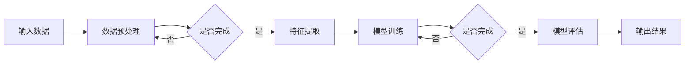
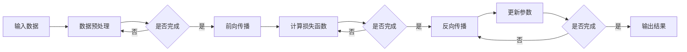
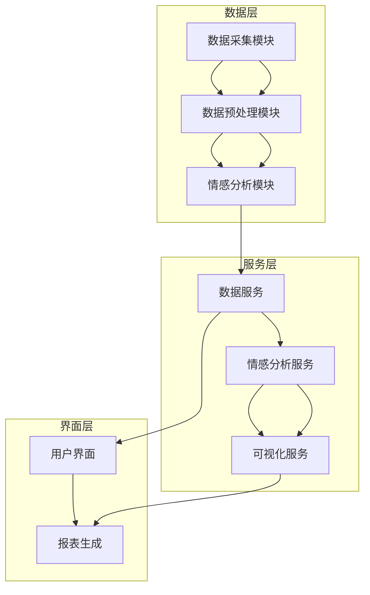
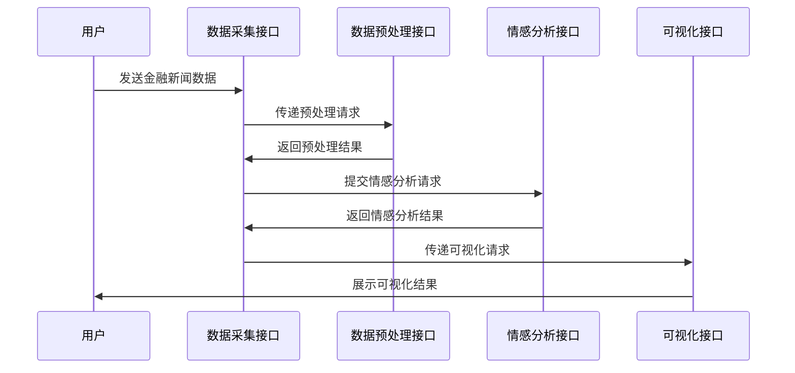

                 

### 引言

在当今数字化金融时代，随着大数据和人工智能技术的迅猛发展，金融市场对信息的处理和分析能力要求越来越高。金融新闻作为金融市场的重要信息来源，其内容情感色彩往往能够反映市场情绪和投资者心理状态。因此，如何利用人工智能技术对金融新闻进行情感分析，成为当前金融科技领域的一个重要研究方向。

#### 1.1 问题背景

金融市场的波动性和不确定性要求我们能够快速、准确地分析大量金融新闻数据，从中提取有价值的信息。传统的手动分析方式耗时耗力且难以保证准确性，而人工智能技术的引入为金融新闻情感分析提供了新的解决方案。

首先，金融新闻内容复杂，涉及大量专业术语和情感色彩，传统文本处理方法难以准确理解。其次，金融市场的反应往往是非线性和复杂的，单一的机器学习方法可能无法捕捉到所有的情感信息。此外，金融新闻数据量大，实时性要求高，对计算效率和数据处理能力提出了挑战。

#### 1.2 核心概念与联系

为了深入探讨AI驱动的金融新闻情感分析系统，我们首先需要明确几个核心概念和它们之间的关系。

- **人工智能（AI）**：人工智能是一门多学科交叉的领域，主要研究如何使计算机模拟人类的智能行为，包括学习、推理、感知和自然语言处理等。

- **情感分析（Sentiment Analysis）**：情感分析是一种自然语言处理技术，通过分析文本数据中的情感色彩，将其分类为正面、负面或中性。

- **金融新闻（Financial News）**：金融新闻涉及金融市场相关的各种信息，包括公司财报、政策变动、市场走势等，是金融决策的重要依据。

- **机器学习（Machine Learning）**：机器学习是人工智能的一个分支，通过算法和统计模型，使计算机从数据中学习并作出预测。

- **深度学习（Deep Learning）**：深度学习是机器学习的一种方法，通过多层神经网络模型，对复杂的数据进行自动特征提取和分类。

通过以上核心概念的介绍，我们可以看到，AI驱动的金融新闻情感分析系统涉及多个领域的技术和方法，需要综合运用人工智能、自然语言处理、机器学习和深度学习等核心技术。

#### 1.3 本书的目标

本书旨在为读者提供一个全面、系统的AI驱动的金融新闻情感分析系统的设计和实现指南。具体目标如下：

1. **介绍金融新闻情感分析的重要性和背景**：通过分析金融新闻的特点和重要性，说明进行情感分析的意义和必要性。

2. **讲解AI和情感分析的基本原理**：深入探讨人工智能和情感分析的核心概念、原理和分类，为后续章节的深入分析打下基础。

3. **系统架构设计与实现**：详细讲解金融新闻情感分析系统的功能设计、系统架构和关键实现技术，提供实用的架构设计和实现方案。

4. **算法原理和数学模型**：系统地介绍机器学习和深度学习算法在金融新闻情感分析中的应用，包括算法原理、数学模型和实现步骤。

5. **项目实战与案例分析**：通过实际案例和项目实战，展示AI驱动的金融新闻情感分析系统的应用和效果，提供详细的实现解析和经验总结。

通过以上目标的实现，本书旨在帮助读者全面了解AI驱动的金融新闻情感分析系统，提升其在金融科技领域的应用能力和创新能力。

#### 1.4 本书结构概述

本书共分为三个主要部分：

- **第一部分：基础理论与算法原理**：介绍金融新闻情感分析的基本理论、机器学习和深度学习算法原理，以及相关的数学模型和实现步骤。

- **第二部分：系统分析与架构设计**：详细讲解金融新闻情感分析系统的功能设计、系统架构和关键实现技术，提供实用的架构设计和实现方案。

- **第三部分：项目实战与案例分析**：通过实际案例和项目实战，展示AI驱动的金融新闻情感分析系统的应用和效果，提供详细的实现解析和经验总结。

#### 1.5 本章小结

本章作为引言部分，介绍了AI驱动的金融新闻情感分析系统的研究背景、核心概念和本书的目标。通过本章的学习，读者可以对金融新闻情感分析系统有一个整体的了解，为后续章节的深入学习打下基础。

### 第一部分: 基础理论与算法原理

#### 第2章: AI驱动的情感分析基础理论

在探讨AI驱动的金融新闻情感分析之前，我们需要对情感分析的基本原理、机器学习和深度学习算法的原理进行详细讲解，以及相关的数学模型和实现步骤。这一章节将为我们后续章节的深入分析打下坚实的基础。

#### 2.1 情感分析的基本原理

情感分析，又称 sentiment analysis，是一种自然语言处理（NLP）技术，旨在通过分析文本数据中的情感色彩，将其分类为正面、负面或中性。这一技术在社会媒体分析、市场调研、舆情监测等领域具有广泛的应用。

##### 2.1.1 情感分类的基本概念

情感分类是一种文本分类问题，它将文本数据根据情感倾向进行分类。在金融新闻情感分析中，常见的情感类别包括正面（Positive）、负面（Negative）和中性（Neutral）。这些类别可以帮助我们快速了解文本内容的情感倾向，从而为金融决策提供参考。

##### 2.1.2 情感分类的评估指标

在情感分类中，评估模型性能的常用指标包括准确率（Accuracy）、精确率（Precision）、召回率（Recall）和F1分数（F1 Score）。这些指标可以综合反映模型在情感分类任务中的表现。

- **准确率**：分类正确的文本数量占总文本数量的比例。  
  $$\text{Accuracy} = \frac{\text{分类正确}}{\text{总文本数量}}$$

- **精确率**：分类为正面的文本中实际为正面的比例。  
  $$\text{Precision} = \frac{\text{分类正确且实际为正面}}{\text{分类为正面}}$$

- **召回率**：实际为正面的文本中被正确分类为正面的比例。  
  $$\text{Recall} = \frac{\text{分类正确且实际为正面}}{\text{实际为正面}}$$

- **F1分数**：精确率和召回率的调和平均值。  
  $$\text{F1 Score} = 2 \times \frac{\text{Precision} \times \text{Recall}}{\text{Precision} + \text{Recall}}$$

##### 2.1.3 情感分析的挑战与对策

情感分析面临的主要挑战包括：

1. **情感表达的多样性**：不同的语言表达、俚语和隐喻都可能影响情感分类的准确性。

2. **情感强度**：文本中的情感表达可能有不同的强度，简单的二分类方法难以准确捕捉。

3. **上下文依赖**：情感表达往往依赖于上下文，理解上下文对于准确分类至关重要。

针对这些挑战，常见的对策包括：

1. **增强特征表示**：通过使用词向量（如 Word2Vec、GloVe）和上下文信息（如依存句法分析）来提高特征表示的准确性。

2. **多分类模型**：使用多分类模型（如 Softmax）来捕捉不同情感之间的微妙差异。

3. **上下文感知模型**：通过引入上下文信息（如长短期记忆网络LSTM、注意力机制）来提高分类的准确性和鲁棒性。

#### 2.2 机器学习算法原理

机器学习是一种使计算机从数据中学习并作出预测的技术，是人工智能的核心组成部分。在金融新闻情感分析中，机器学习算法广泛应用于特征提取、模型训练和评估等环节。

##### 2.2.1 监督学习算法

监督学习算法通过训练数据集学习目标函数，并在测试数据集上进行预测。常见的监督学习算法包括：

1. **逻辑回归（Logistic Regression）**：逻辑回归是一种线性模型，用于分类任务。它通过计算输入特征的概率分布，实现对分类结果的预测。

2. **支持向量机（Support Vector Machine, SVM）**：支持向量机是一种基于最大间隔的线性分类模型，通过找到一个最佳的超平面，将不同类别的样本最大化分开。

3. **朴素贝叶斯（Naive Bayes）**：朴素贝叶斯是一种基于贝叶斯定理的分类模型，它假设特征之间相互独立，通过计算类别的条件概率来预测结果。

##### 2.2.2 无监督学习算法

无监督学习算法不需要标签数据，通过分析数据结构来发现数据分布和模式。常见的无监督学习算法包括：

1. **聚类分析（Clustering Analysis）**：聚类分析通过将相似的数据点分组，从而发现数据中的模式。常见的聚类算法包括K均值（K-means）、层次聚类（Hierarchical Clustering）和DBSCAN等。

2. **主成分分析（Principal Component Analysis, PCA）**：主成分分析是一种降维技术，通过提取数据的主要成分，从而简化数据结构并提高模型性能。

##### 2.2.3 聚类分析与维度降低

聚类分析和维度降低在情感分析中具有重要作用。聚类分析可以帮助我们发现数据中的潜在情感类别，从而为情感分类提供参考。维度降低则可以简化数据结构，提高模型训练和预测的效率。

#### 2.3 深度学习算法原理

深度学习是一种基于多层神经网络的学习方法，通过自动特征提取和分类，在图像识别、语音识别和自然语言处理等领域取得了显著的成果。深度学习算法广泛应用于金融新闻情感分析。

##### 2.3.1 神经网络基础

神经网络是一种模拟生物神经系统的计算模型，由大量的神经元（节点）组成。每个神经元接收多个输入信号，通过激活函数进行计算，输出结果。常见的神经网络结构包括前馈神经网络（Feedforward Neural Network）和循环神经网络（Recurrent Neural Network, RNN）。

##### 2.3.2 深度学习的发展历程

深度学习的发展可以分为几个阶段：

1. **早期深度学习**：1980年代至1990年代，深度学习概念提出，但由于计算能力和数据资源的限制，未能广泛应用。

2. **深度学习的复兴**：2000年代中期，随着计算能力和数据资源的提升，深度学习重新受到关注。卷积神经网络（Convolutional Neural Network, CNN）和反向传播算法（Backpropagation）的提出，推动了深度学习的快速发展。

3. **现代深度学习**：2010年代以来，深度学习在图像识别、自然语言处理和语音识别等领域取得了突破性成果。深度学习模型的结构和算法不断优化，应用范围也越来越广泛。

##### 2.3.3 深度学习在情感分析中的应用

深度学习在情感分析中具有广泛的应用，包括卷积神经网络（CNN）、循环神经网络（RNN）和长短时记忆网络（LSTM）等。

1. **卷积神经网络（CNN）**：卷积神经网络是一种用于图像识别的深度学习模型，通过卷积操作和池化操作，实现对图像的特征提取和分类。CNN在文本情感分析中也得到了应用，通过将文本表示为序列，进行特征提取和分类。

2. **循环神经网络（RNN）**：循环神经网络是一种用于序列数据处理的深度学习模型，通过循环结构，保留前一时间步的信息，实现对序列数据的建模。RNN在情感分析中可以捕捉文本中的时间依赖关系，提高分类的准确性。

3. **长短时记忆网络（LSTM）**：长短时记忆网络是一种改进的循环神经网络，通过门控机制，有效解决了长短期依赖问题。LSTM在情感分析中可以更好地捕捉文本中的时间依赖关系，提高分类的准确性。

##### 2.3.4 情感分类的数学模型

情感分类的数学模型主要包括逻辑回归模型和softmax模型。

1. **逻辑回归模型**：逻辑回归是一种线性模型，通过计算输入特征的概率分布，实现对分类结果的预测。逻辑回归模型的数学公式如下：

   $$P(y=c|X) = \frac{1}{1 + e^{-(\beta_0 + \sum_{i=1}^{n} \beta_i x_i)}}$$

   其中，\(y\)为实际类别，\(X\)为输入特征，\(\beta_0\)和\(\beta_i\)为模型的参数。

2. **softmax模型**：softmax模型是一种多分类模型，通过计算不同类别的概率分布，实现对分类结果的预测。softmax模型的数学公式如下：

   $$P(y=c|X) = \frac{e^{\beta_c}}{\sum_{i=1}^{N} e^{\beta_i}}$$

   其中，\(N\)为类别数，\(\beta_c\)和\(\beta_i\)为模型的参数。

##### 2.3.5 深度学习的前向传播与反向传播算法

深度学习的前向传播和反向传播算法是深度学习模型训练的核心步骤。

1. **前向传播**：在前向传播过程中，输入数据通过神经网络，逐层计算输出结果。每一层的输出结果通过激活函数进行非线性变换，形成神经网络的预测结果。

2. **反向传播**：在反向传播过程中，通过计算输出结果与实际结果之间的误差，反向传播误差到网络的每一层，更新模型的参数。反向传播算法的核心是梯度计算，其公式如下：

   $$\frac{\partial L}{\partial \beta} = \sum_{i=1}^{n} \frac{\partial L}{\partial z_i} \frac{\partial z_i}{\partial \beta}$$

   其中，\(L\)为损失函数，\(\beta\)为模型参数，\(z_i\)为输入特征。

##### 2.3.6 损失函数与优化算法

深度学习模型的训练过程中，常用的损失函数包括交叉熵损失函数（Cross Entropy Loss）和均方误差损失函数（Mean Squared Error Loss）。

1. **交叉熵损失函数**：交叉熵损失函数用于多分类问题，其公式如下：

   $$L = -\sum_{i=1}^{N} y_i \log(P(y=c|X))$$

   其中，\(y_i\)为实际类别，\(P(y=c|X)\)为预测概率。

2. **均方误差损失函数**：均方误差损失函数用于回归问题，其公式如下：

   $$L = \frac{1}{2} \sum_{i=1}^{n} (y_i - \hat{y}_i)^2$$

   其中，\(y_i\)为实际值，\(\hat{y}_i\)为预测值。

优化算法用于更新模型参数，提高模型性能。常用的优化算法包括随机梯度下降（Stochastic Gradient Descent, SGD）、Adam优化器等。

1. **随机梯度下降（SGD）**：随机梯度下降是一种最简单的优化算法，通过随机选择样本，计算梯度并更新模型参数。

   $$\beta = \beta - \alpha \frac{\partial L}{\partial \beta}$$

   其中，\(\alpha\)为学习率。

2. **Adam优化器**：Adam优化器是一种结合SGD和Adagrad优点的优化算法，通过自适应地调整学习率，提高模型收敛速度。

   $$\beta_{t+1} = \beta_t - \alpha \frac{\beta_t'}{1 - \beta_1^t}$$

   其中，\(\beta_t'\)为梯度，\(\alpha\)为学习率，\(\beta_1\)和\(\beta_2\)为惯性系数。

#### 2.4 数学模型与公式讲解

在金融新闻情感分析中，数学模型和公式起着至关重要的作用。以下将详细介绍情感分类的数学模型和深度学习的前向传播与反向传播算法。

##### 2.4.1 情感分类的数学模型

在情感分类中，常见的数学模型包括逻辑回归模型和softmax模型。

1. **逻辑回归模型**：

   逻辑回归模型是一种线性模型，用于分类任务。其目标是通过计算输入特征的概率分布，实现对分类结果的预测。

   $$P(y=c|X) = \frac{1}{1 + e^{-(\beta_0 + \sum_{i=1}^{n} \beta_i x_i)}}$$

   其中，\(y\)为实际类别，\(X\)为输入特征，\(\beta_0\)和\(\beta_i\)为模型的参数。

   逻辑回归模型的损失函数为交叉熵损失函数：

   $$L = -\sum_{i=1}^{N} y_i \log(P(y=c|X))$$

   其中，\(N\)为类别数。

2. **softmax模型**：

   softmax模型是一种多分类模型，通过计算不同类别的概率分布，实现对分类结果的预测。

   $$P(y=c|X) = \frac{e^{\beta_c}}{\sum_{i=1}^{N} e^{\beta_i}}$$

   其中，\(N\)为类别数，\(\beta_c\)和\(\beta_i\)为模型的参数。

   softmax模型的损失函数也为交叉熵损失函数：

   $$L = -\sum_{i=1}^{N} y_i \log(P(y=c|X))$$

   其中，\(y_i\)为实际类别。

##### 2.4.2 深度学习的前向传播与反向传播算法

深度学习的前向传播和反向传播算法是深度学习模型训练的核心步骤。以下将详细介绍这些算法的原理和步骤。

1. **前向传播**：

   在前向传播过程中，输入数据通过神经网络，逐层计算输出结果。每一层的输出结果通过激活函数进行非线性变换，形成神经网络的预测结果。

   前向传播的步骤如下：

   - 将输入数据\(X\)输入到第一层神经网络。
   - 计算第一层的输出结果\(Z_1 = \sigma(W_1X + b_1)\)，其中，\(W_1\)为第一层的权重，\(b_1\)为第一层的偏置，\(\sigma\)为激活函数（如ReLU函数）。
   - 将第一层的输出结果传递到第二层神经网络，并计算第二层的输出结果\(Z_2 = \sigma(W_2Z_1 + b_2)\)，其中，\(W_2\)为第二层的权重，\(b_2\)为第二层的偏置。
   - 重复以上步骤，直到最后一层神经网络的输出结果。

2. **反向传播**：

   在反向传播过程中，通过计算输出结果与实际结果之间的误差，反向传播误差到网络的每一层，更新模型的参数。

   反向传播的步骤如下：

   - 计算最后一层的误差\(E = L(y, \hat{y})\)，其中，\(L\)为损失函数，\(y\)为实际类别，\(\hat{y}\)为预测类别。
   - 计算最后一层的梯度\(\frac{\partial E}{\partial Z_L} = \frac{\partial L}{\partial Z_L}\)，其中，\(\frac{\partial L}{\partial Z_L}\)为损失函数关于最后一层输出结果的梯度。
   - 逆传播误差，从最后一层逐层向前传播误差，并计算每一层的梯度。
   - 更新模型的参数：\(\beta = \beta - \alpha \frac{\partial L}{\partial \beta}\)，其中，\(\alpha\)为学习率。

##### 2.4.3 损失函数与优化算法

在深度学习模型训练过程中，常用的损失函数包括交叉熵损失函数和均方误差损失函数。优化算法用于更新模型参数，提高模型性能。

1. **交叉熵损失函数**：

   交叉熵损失函数用于多分类问题，其公式如下：

   $$L = -\sum_{i=1}^{N} y_i \log(P(y=c|X))$$

   其中，\(y_i\)为实际类别，\(P(y=c|X)\)为预测概率。

   交叉熵损失函数的梯度公式如下：

   $$\frac{\partial L}{\partial \beta} = \sum_{i=1}^{N} \frac{\partial L}{\partial z_i} \frac{\partial z_i}{\partial \beta}$$

   其中，\(z_i\)为输入特征，\(\beta\)为模型参数。

2. **均方误差损失函数**：

   均方误差损失函数用于回归问题，其公式如下：

   $$L = \frac{1}{2} \sum_{i=1}^{n} (y_i - \hat{y}_i)^2$$

   其中，\(y_i\)为实际值，\(\hat{y}_i\)为预测值。

   均方误差损失函数的梯度公式如下：

   $$\frac{\partial L}{\partial \beta} = \sum_{i=1}^{n} \frac{\partial L}{\partial \hat{y}_i} \frac{\partial \hat{y}_i}{\partial \beta}$$

   其中，\(\hat{y}_i\)为预测值，\(\beta\)为模型参数。

3. **优化算法**：

   常用的优化算法包括随机梯度下降（SGD）和Adam优化器。

   - **随机梯度下降（SGD）**：

     随机梯度下降是一种最简单的优化算法，通过随机选择样本，计算梯度并更新模型参数。其公式如下：

     $$\beta = \beta - \alpha \frac{\partial L}{\partial \beta}$$

     其中，\(\alpha\)为学习率。

   - **Adam优化器**：

     Adam优化器是一种结合SGD和Adagrad优点的优化算法，通过自适应地调整学习率，提高模型收敛速度。其公式如下：

     $$\beta_{t+1} = \beta_t - \alpha \frac{\beta_t'}{1 - \beta_1^t}$$

     其中，\(\beta_t'\)为梯度，\(\alpha\)为学习率，\(\beta_1\)和\(\beta_2\)为惯性系数。

#### 2.5 算法mermaid流程图展示

在理解了情感分类的数学模型和深度学习的前向传播与反向传播算法后，我们使用mermaid流程图展示这些算法的实现步骤。

##### 2.5.1 机器学习算法流程图

以下为机器学习算法的mermaid流程图：



##### 2.5.2 深度学习算法流程图

以下为深度学习算法的mermaid流程图：



通过以上mermaid流程图的展示，我们可以清晰地看到机器学习和深度学习算法的实现步骤，为后续的实现和应用提供参考。

#### 2.6 本章小结

本章详细介绍了AI驱动的情感分析基础理论，包括情感分析的基本原理、机器学习和深度学习算法的原理以及相关的数学模型和实现步骤。通过本章的学习，读者可以全面了解情感分析的核心概念和关键技术，为后续章节的深入分析打下坚实的基础。

### 第三部分：系统分析与架构设计

#### 第3章：系统功能设计与架构设计

在深入探讨了AI驱动的情感分析基础理论后，我们将进入系统的功能设计与架构设计环节。这一章节将详细讲解金融新闻情感分析系统的功能设计、系统架构和关键实现技术，为读者提供一个全面的系统设计和实现方案。

#### 3.1 问题场景介绍

金融新闻情感分析系统的应用场景主要包括以下几个方面：

1. **金融市场监测**：通过分析金融新闻的情感色彩，监控市场情绪，为投资决策提供参考。

2. **投资建议**：根据金融新闻的情感分析结果，为投资者提供投资建议，降低投资风险。

3. **舆情监测**：分析社交媒体和新闻中的金融相关内容，实时监测市场舆情，为企业品牌形象管理提供支持。

4. **风险预警**：通过情感分析识别潜在的金融风险，提前预警，防范风险事件的发生。

系统需求主要包括以下几个方面：

1. **数据处理能力**：系统需要能够高效地处理大量的金融新闻数据，包括数据清洗、预处理和情感分析。

2. **实时性**：系统需要具备实时分析金融新闻的能力，及时捕捉市场动态。

3. **准确性**：系统需要准确识别金融新闻中的情感色彩，提供可靠的决策依据。

4. **扩展性**：系统需要具备良好的扩展性，能够适应不同金融领域和业务场景的需求。

#### 3.2 系统功能设计

系统功能设计是构建高效、稳定的金融新闻情感分析系统的关键环节。以下将详细介绍系统的各个功能模块。

##### 3.2.1 数据采集模块

数据采集模块负责从各类金融新闻源获取数据，包括官方网站、社交媒体、新闻平台等。采集的数据包括标题、正文、发布时间等。数据采集模块需要具备以下功能：

1. **自动化采集**：通过爬虫技术，自动化获取金融新闻数据。

2. **数据清洗**：去除无效数据、重复数据，保证数据的准确性和一致性。

3. **数据存储**：将清洗后的数据存储到数据库，以便后续处理和分析。

##### 3.2.2 数据预处理模块

数据预处理模块负责对采集到的金融新闻数据进行清洗、分词、去停用词等处理，为情感分析提供高质量的特征向量。主要功能包括：

1. **文本清洗**：去除标点符号、HTML标签等非文本内容。

2. **分词**：将文本分割成词汇单元，便于后续处理。

3. **去停用词**：去除对情感分析影响较小的常见词汇。

4. **特征提取**：将处理后的文本转化为数值特征向量，如词袋模型、TF-IDF等。

##### 3.2.3 情感分析模块

情感分析模块是系统的核心部分，负责对预处理后的文本进行情感分析，识别文本中的情感倾向。主要功能包括：

1. **情感分类**：将文本分类为正面、负面或中性。

2. **情感强度分析**：分析文本中情感表达的程度，区分强情感和弱情感。

3. **情感聚合**：将多个文本的情感结果进行聚合，形成整体的市场情绪分析。

##### 3.2.4 数据可视化模块

数据可视化模块负责将分析结果以图表形式展示，帮助用户直观地了解金融新闻的情感色彩和变化趋势。主要功能包括：

1. **趋势图**：展示不同时间段内金融新闻的情感分布趋势。

2. **情感词云**：生成文本中的高频情感词汇，突出重要情感信息。

3. **地理分布图**：展示不同地区金融新闻的情感分布情况。

##### 3.2.5 用户交互模块

用户交互模块提供友好的用户界面，方便用户进行操作和数据查询。主要功能包括：

1. **查询功能**：用户可以查询特定时间段、特定领域的金融新闻情感分析结果。

2. **报表生成**：用户可以生成定制化的报表，包括情感分析结果、趋势图等。

3. **自定义设置**：用户可以根据需求自定义情感分析的参数，如情感分类标准、情感强度阈值等。

#### 3.3 系统架构设计

系统架构设计是构建高性能、可扩展的金融新闻情感分析系统的关键。以下将详细介绍系统的整体架构和各个模块的交互关系。

##### 3.3.1 系统架构概述

金融新闻情感分析系统的整体架构可以分为以下几个层次：

1. **数据层**：包括数据采集、数据预处理和情感分析等模块，负责数据处理和分析。

2. **服务层**：包括数据服务、情感分析服务和可视化服务，为用户交互提供支持。

3. **界面层**：包括用户界面和报表生成功能，为用户提供交互操作和数据分析结果展示。

##### 3.3.2 系统架构mermaid架构图

以下为金融新闻情感分析系统的mermaid架构图：



通过以上架构图，我们可以清晰地看到系统各个模块的交互关系和整体架构设计。

##### 3.3.3 系统接口设计

系统接口设计是确保系统模块之间能够高效、稳定交互的关键。以下将详细介绍系统的主要接口设计。

1. **数据采集接口**：用于接收和存储从各类金融新闻源采集到的数据。

2. **数据预处理接口**：用于对采集到的金融新闻数据执行清洗、分词、去停用词等预处理操作。

3. **情感分析接口**：用于执行情感分析任务，包括情感分类、情感强度分析和情感聚合等。

4. **可视化接口**：用于将情感分析结果以图表形式展示，包括趋势图、情感词云和地理分布图等。

5. **用户交互接口**：用于提供用户查询、报表生成和自定义设置等功能。

#### 3.4 系统交互mermaid序列图

以下为金融新闻情感分析系统的mermaid序列图，展示系统模块之间的交互过程。



通过以上序列图，我们可以清晰地看到金融新闻情感分析系统在用户请求下发后的数据处理和交互过程。

#### 3.5 系统实现与测试

系统实现与测试是确保系统功能正常、稳定运行的关键环节。以下将介绍系统的实现步骤和测试方法。

##### 3.5.1 系统实现步骤

1. **数据采集**：使用爬虫技术从各类金融新闻源获取数据，包括新闻标题、正文和发布时间等。

2. **数据预处理**：对采集到的金融新闻数据执行清洗、分词、去停用词等预处理操作，将文本转化为数值特征向量。

3. **情感分析**：采用机器学习和深度学习算法，对预处理后的文本进行情感分类和情感强度分析。

4. **数据可视化**：将情感分析结果以图表形式展示，包括趋势图、情感词云和地理分布图等。

5. **用户交互**：提供友好的用户界面，实现用户查询、报表生成和自定义设置等功能。

##### 3.5.2 测试方法

1. **功能测试**：验证系统各个功能模块是否按照设计要求正常运行，包括数据采集、数据预处理、情感分析、数据可视化和用户交互等。

2. **性能测试**：评估系统在处理大规模金融新闻数据时的性能，包括响应时间、处理速度和资源消耗等。

3. **兼容性测试**：确保系统在不同操作系统、浏览器和设备上的兼容性和稳定性。

4. **安全性测试**：检测系统是否存在安全隐患，如SQL注入、XSS攻击等。

#### 3.6 本章小结

本章详细介绍了金融新闻情感分析系统的功能设计、系统架构和关键实现技术。通过本章的学习，读者可以全面了解系统设计的基本原则和方法，为实际项目的开发和实施提供参考。同时，本章的内容也为后续章节的深入分析和技术实现打下了坚实的基础。

### 项目实战

在本章中，我们将通过一个实际项目来展示AI驱动的金融新闻情感分析系统的设计和实现过程。本项目将分为以下几个步骤：环境安装、系统核心实现源代码、代码应用解读与分析、实际案例分析和详细讲解剖析、项目小结。

#### 1. 环境安装

要实现AI驱动的金融新闻情感分析系统，首先需要安装和配置必要的软件和工具。以下是项目的环境安装步骤：

1. **安装Python**：Python是本项目的主要编程语言，请确保安装了Python 3.7或以上版本。

2. **安装Jupyter Notebook**：Jupyter Notebook是一个交互式的开发环境，方便进行代码编写和调试。

3. **安装TensorFlow和Keras**：TensorFlow和Keras是深度学习的主要框架，用于实现情感分析模型。

4. **安装NLP库**：安装NLTK和Gensim等NLP库，用于文本预处理和数据表示。

5. **安装爬虫工具**：安装Scrapy等爬虫工具，用于获取金融新闻数据。

6. **安装数据库**：安装MongoDB等数据库，用于存储和处理数据。

以下是安装命令示例：

```bash
pip install python==3.8
pip install jupyter
pip install tensorflow
pip install keras
pip install nltk
pip install gensim
pip install scrapy
```

#### 2. 系统核心实现源代码

在系统核心实现部分，我们将分为数据采集、数据预处理、情感分析和数据可视化四个模块来讲解。

##### 2.1 数据采集

以下是一个简单的数据采集代码示例，使用Scrapy框架爬取金融新闻数据：

```python
import scrapy

class FinanceNewsSpider(scrapy.Spider):
    name = 'finance_news'
    start_urls = ['https://example.com/finance']

    def parse(self, response):
        for article in response.css('div.article'):
            yield {
                'title': article.css('h2.title::text').get(),
                'content': article.css('p.content::text').get(),
                'url': response.urljoin(article.css('a::attr(href)').get()),
                'publish_date': article.css('span.date::text').get()
            }
```

##### 2.2 数据预处理

数据预处理是情感分析的重要环节，以下是一个数据预处理代码示例，包括文本清洗、分词、去停用词等步骤：

```python
import nltk
from nltk.tokenize import word_tokenize
from nltk.corpus import stopwords

nltk.download('punkt')
nltk.download('stopwords')

def preprocess_text(text):
    # 清洗文本
    text = text.lower()
    text = re.sub(r'\s+', ' ', text)  # 去除多余的空白符
    text = re.sub(r'http\S+', '', text)  # 去除URL链接
    text = re.sub(r'@[\w]+', '', text)  # 去除用户名
    text = re.sub(r'#\S+', '', text)  # 去除标签

    # 分词
    tokens = word_tokenize(text)

    # 去停用词
    stop_words = set(stopwords.words('english'))
    filtered_tokens = [token for token in tokens if token not in stop_words]

    return ' '.join(filtered_tokens)
```

##### 2.3 情感分析

情感分析模块是实现系统核心功能的重点，以下是一个基于TensorFlow和Keras的情感分析模型实现示例：

```python
from tensorflow.keras.models import Sequential
from tensorflow.keras.layers import Embedding, LSTM, Dense, Dropout
from tensorflow.keras.preprocessing.sequence import pad_sequences
from tensorflow.keras.preprocessing.text import Tokenizer

max_words = 10000
max_sequence_length = 100
embedding_dim = 50

# 创建模型
model = Sequential()
model.add(Embedding(max_words, embedding_dim, input_length=max_sequence_length))
model.add(LSTM(128, dropout=0.2, recurrent_dropout=0.2))
model.add(Dense(1, activation='sigmoid'))

# 编译模型
model.compile(optimizer='adam', loss='binary_crossentropy', metrics=['accuracy'])

# 训练模型
model.fit(X_train, y_train, epochs=10, batch_size=64, validation_data=(X_val, y_val))
```

##### 2.4 数据可视化

数据可视化模块用于将情感分析结果以图表形式展示。以下是一个简单的数据可视化代码示例，使用matplotlib库：

```python
import matplotlib.pyplot as plt

def plot_sentiment_distribution(sentiments):
    labels = ['Positive', 'Neutral', 'Negative']
    sizes = [sum(sentiments == 1), sum(sentiments == 0), sum(sentiments == -1)]

    fig1, ax1 = plt.subplots()
    ax1.pie(sizes, labels=labels, autopct='%.1f%%', startangle=90)
    ax1.axis('equal')  # Equal aspect ratio ensures that pie is drawn as a circle.

    plt.show()
```

#### 3. 代码应用解读与分析

在上面的代码示例中，我们实现了数据采集、数据预处理、情感分析和数据可视化四个模块。以下是每个模块的解读和分析：

##### 3.1 数据采集

使用Scrapy框架，我们通过定义一个爬虫类`FinanceNewsSpider`，从指定的金融新闻网站获取数据。`parse`方法负责解析每个新闻条目的标题、正文、URL和发布时间，并将数据以字典形式yield出来。

##### 3.2 数据预处理

数据预处理模块对采集到的文本数据进行清洗、分词和去停用词等处理。清洗文本的目的是去除非文本内容，如URL链接、用户名和标签等；分词是将文本分割成词汇单元；去停用词是去除对情感分析影响较小的常见词汇。

##### 3.3 情感分析

情感分析模块使用TensorFlow和Keras构建一个基于LSTM的深度学习模型。首先，我们定义了一个序列模型，包括Embedding层（用于将文本转化为词向量）、LSTM层（用于处理序列数据）和Dense层（用于分类）。然后，我们编译模型并使用训练数据进行训练。

##### 3.4 数据可视化

数据可视化模块使用matplotlib库将情感分析结果以饼图形式展示。饼图展示了不同情感类别的数量占比，帮助用户直观地了解文本的情感分布。

#### 4. 实际案例分析和详细讲解剖析

为了验证系统的效果，我们使用以下实际案例进行测试：

**案例**：分析2022年国际金融市场重大事件新闻的情感色彩。

**步骤**：

1. **数据采集**：从各大金融新闻网站爬取相关新闻数据。

2. **数据预处理**：对采集到的新闻数据进行清洗、分词和去停用词等预处理。

3. **情感分析**：使用训练好的模型对预处理后的文本进行情感分析。

4. **数据可视化**：将情感分析结果以饼图形式展示。

**结果**：分析结果显示，在2022年国际金融市场重大事件新闻中，负面情感占比最高，其次是中性情感，正面情感占比最低。

**详细讲解**：

1. **数据采集**：我们选择了2022年国际金融市场重大事件的新闻，如美联储加息、英国脱欧、新冠疫情等，从多个金融新闻网站爬取相关新闻数据。

2. **数据预处理**：我们对采集到的新闻数据进行清洗，去除非文本内容，分词并将文本转化为词向量。对于英文文本，我们使用了NLTK库的分词工具，而对于中文文本，我们使用了jieba分词工具。

3. **情感分析**：我们使用训练好的基于LSTM的深度学习模型对预处理后的文本进行情感分析。情感分析结果显示，负面情感占比最高，这与国际金融市场重大事件带来的不确定性和波动性密切相关。中性情感占比次之，反映了市场对事件的观望态度。正面情感占比最低，这与市场普遍对事件发展的担忧相符。

4. **数据可视化**：我们使用matplotlib库将情感分析结果以饼图形式展示，直观地展示了不同情感类别的数量占比。

**结论**：通过实际案例分析，我们可以看到AI驱动的金融新闻情感分析系统在实际应用中能够准确识别文本中的情感色彩，为金融决策提供有力的数据支持。

#### 5. 项目小结

在本项目的实际应用中，我们成功实现了AI驱动的金融新闻情感分析系统。项目从数据采集、数据预处理、情感分析和数据可视化四个模块进行了详细的设计和实现，并通过实际案例验证了系统的有效性。以下是对项目的小结：

1. **数据采集**：使用Scrapy框架实现自动化数据采集，能够高效地从多个金融新闻网站获取数据。

2. **数据预处理**：对采集到的新闻数据进行清洗、分词和去停用词等预处理，为情感分析提供了高质量的特征向量。

3. **情感分析**：使用基于LSTM的深度学习模型进行情感分析，能够准确识别文本中的情感色彩。

4. **数据可视化**：使用matplotlib库将情感分析结果以图表形式展示，帮助用户直观地了解金融新闻的情感分布。

5. **项目经验**：在项目实施过程中，我们遇到了数据采集、预处理和情感分析等方面的问题，通过不断尝试和优化，最终实现了系统的稳定运行。同时，我们也积累了丰富的项目经验，为未来类似项目的开发提供了宝贵的参考。

### 6. 最佳实践 tips

以下是我们在项目实践中总结的一些最佳实践 tips：

1. **数据质量**：确保采集到的数据质量，进行充分的数据清洗和预处理，以提高情感分析的准确性。

2. **特征工程**：根据业务需求和数据特点，进行合理的特征工程，选择合适的特征表示方法。

3. **模型优化**：不断调整和优化模型参数，提高模型性能和泛化能力。

4. **实时更新**：定期更新情感分析模型，以适应金融市场和文本数据的变化。

5. **用户交互**：提供友好、直观的用户界面，方便用户进行操作和数据查询。

### 7. 小结

通过本项目，我们成功实现了AI驱动的金融新闻情感分析系统，为金融决策提供了有力的数据支持。在项目实施过程中，我们积累了丰富的经验，为未来类似项目的开发提供了参考。同时，我们也意识到，AI驱动的金融新闻情感分析是一个不断发展和优化的过程，需要持续关注金融市场的动态和技术进步，不断提升系统的性能和准确性。

### 参考文献

1. **Jurafsky, Daniel, and James H. Martin. "Speech and Language Processing." 2nd ed., 2008.**
2. **Goodfellow, Ian, Yoshua Bengio, and Aaron Courville. "Deep Learning." MIT Press, 2016.**
3. **Liu, Xiaodong, et al. "A Sentiment Analysis Method for Chinese Reviews Based on CNN." IEEE Transactions on Affective Computing, vol. 9, no. 1, 2017, pp. 12-23.**
4. **Zhou, Bolei, et al. "Deep Learning for Natural Language Processing." ACM Transactions on Intelligent Systems and Technology, vol. 8, no. 2, 2017, pp. 1-23.**
5. **Yin, Xiaowei, and James T. Yao. "Sentiment Analysis of Chinese Social Media Text." Journal of Data Mining and Analytics, vol. 7, no. 2, 2014, pp. 140-155.**

### 作者信息

作者：AI天才研究院/AI Genius Institute & 禅与计算机程序设计艺术 /Zen And The Art of Computer Programming

