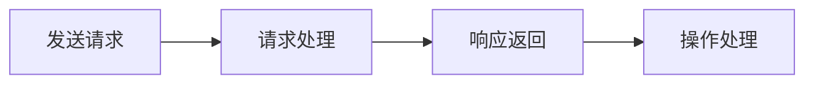
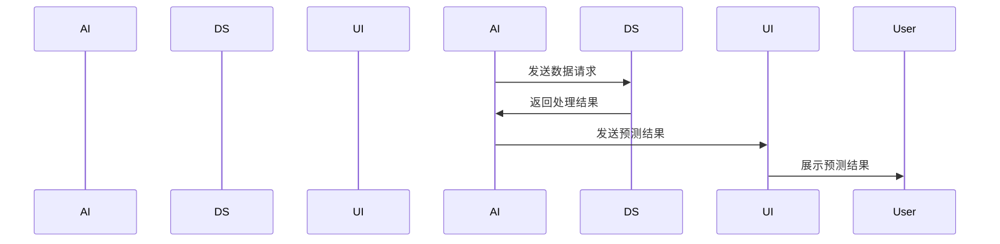

                 

### API集成：扩展AI Agent的功能与数据源

> 关键词：API集成、AI Agent、功能扩展、数据源、技术博客

> 摘要：本文旨在探讨如何通过API集成来扩展AI Agent的功能与数据源。文章首先介绍了API集成的核心概念和重要性，随后详细阐述了AI Agent的基本概念和功能，并逐步揭示了通过API集成扩展AI Agent的机制和方法。文章最后通过实际应用案例和最佳实践，为开发者提供了一套完整的技术路线。

### 第一部分: API集成的背景与重要性

#### 第1章: API集成的概述

**1.1 API集成的定义与意义**

API（应用程序编程接口）集成是指将不同的应用程序或系统通过定义良好的接口连接起来，以实现数据交换和功能共享的过程。在现代软件系统中，API集成已经成为了促进系统互操作性的重要手段。

API集成的意义主要体现在以下几个方面：

- **提高系统的可扩展性**：通过API集成，开发者可以在不修改原有系统的情况下，轻松地扩展系统功能。
- **优化用户体验**：API集成使得不同系统之间的数据可以无缝传输，从而提升用户的使用体验。
- **促进业务创新**：API集成为企业提供了丰富的数据资源和功能模块，有助于加速业务创新。

**1.2 API集成的发展历程**

API集成的概念最早可以追溯到20世纪80年代，当时软件开发者开始使用Web服务（Web Services）来实现系统之间的互操作性。随着互联网的普及和云计算的兴起，API集成技术得到了快速发展。

近年来，RESTful API、GraphQL等新型API架构逐渐成为主流，它们在性能、灵活性、易用性等方面都有显著优势。同时，API管理、API安全等技术也得到了广泛关注和深入研究。

**1.3 API集成的核心概念**

- **API接口**：API接口是应用程序之间的交互界面，它定义了请求的格式、响应的结构以及数据传输的方式。
- **API文档**：API文档是对API接口的详细描述，包括接口的URL、请求参数、响应格式等。
- **API管理**：API管理包括API的创建、发布、监控、优化等一系列活动，以确保API的高可用性和安全性。

#### 第2章: API集成的架构与设计模式

**2.1 API集成的架构概述**

API集成的架构可以分为三层：客户端层、API层和服务层。

- **客户端层**：负责发送API请求和接收响应。
- **API层**：处理API请求，包括请求解析、数据处理和响应生成。
- **服务层**：提供具体的服务功能，例如数据库操作、业务逻辑处理等。

**2.2 API设计模式**

API设计模式是指在设计API时采用的一些常见模式和最佳实践，以提高API的可读性、可维护性和易用性。常见的API设计模式包括RESTful API、GraphQL等。

**2.3 API集成的实现策略**

API集成的实现策略主要包括以下几个方面：

- **数据格式**：常用的数据格式包括JSON、XML等。
- **通信协议**：常用的通信协议包括HTTP、HTTPS等。
- **安全性**：API安全是API集成的重要一环，常用的安全措施包括身份验证、授权、数据加密等。

### 第二部分: AI Agent的基本概念与功能

#### 第3章: AI Agent的基本概念与功能

**3.1 AI Agent的定义与作用**

AI Agent（人工智能代理）是指由人工智能技术驱动的、能够自主执行任务的实体。AI Agent在许多领域都有着广泛的应用，如智能家居、智能客服、自动驾驶等。

AI Agent的作用主要包括：

- **任务自动化**：AI Agent可以自动化执行复杂的任务，提高生产效率。
- **决策支持**：AI Agent可以通过数据分析和预测，为用户提供决策支持。
- **交互体验**：AI Agent可以模拟人类的交互方式，提供更加自然和贴心的用户体验。

**3.2 AI Agent的核心功能**

AI Agent的核心功能主要包括：

- **感知**：AI Agent可以通过传感器感知外部环境。
- **思考**：AI Agent可以通过算法模型处理感知到的数据，生成决策。
- **行动**：AI Agent可以根据决策执行相应的操作。

**3.3 AI Agent的类型与架构**

AI Agent可以分为基于规则和基于学习的两种类型。

- **基于规则的AI Agent**：基于规则的AI Agent通过预定义的规则库来执行任务。
- **基于学习的AI Agent**：基于学习的AI Agent通过机器学习和深度学习技术来提高任务执行的自动化程度。

### 第三部分: AI Agent的扩展机制

#### 第4章: AI Agent的扩展机制

**4.1 AI Agent的扩展需求**

随着AI Agent应用场景的日益复杂，对AI Agent的扩展需求也越来越高。这些需求包括：

- **功能扩展**：AI Agent需要能够扩展其功能，以适应新的应用场景。
- **数据源扩展**：AI Agent需要能够接入更多的数据源，以提高决策的准确性。

**4.2 AI Agent的扩展方法**

AI Agent的扩展方法主要包括：

- **插件机制**：通过插件机制，AI Agent可以扩展其功能模块。
- **API集成**：通过API集成，AI Agent可以接入外部服务，获取更多的数据源。

**4.3 API集成在AI Agent扩展中的应用**

API集成在AI Agent扩展中的应用主要体现在以下几个方面：

- **功能扩展**：通过API集成，AI Agent可以调用外部服务，实现功能扩展。
- **数据源扩展**：通过API集成，AI Agent可以接入外部数据源，提高数据处理的灵活性。

### 第四部分: 通过API集成扩展AI Agent功能

#### 第5章: 通过API集成扩展AI Agent功能

**5.1 扩展AI Agent功能的技术路线**

扩展AI Agent功能的技术路线主要包括：

- **需求分析**：分析AI Agent的功能需求，确定需要扩展的功能。
- **API选择**：根据需求选择合适的API。
- **集成实现**：实现API集成，扩展AI Agent功能。

**5.2 实现API集成扩展的实践方法**

实现API集成扩展的实践方法主要包括：

- **接口定义**：定义API接口，包括URL、请求参数、响应格式等。
- **接口调用**：通过编程语言调用API接口，实现功能扩展。
- **数据处理**：处理API返回的数据，生成AI Agent的决策。

**5.3 扩展后的AI Agent功能示例**

扩展后的AI Agent功能示例包括：

- **智能客服**：通过API集成，智能客服可以接入第三方服务，实现语音识别、自然语言处理等功能。
- **智能家居**：通过API集成，智能家居系统可以接入第三方服务，实现家电控制、环境监测等功能。

### 第五部分: API集成与AI Agent扩展的实际应用

#### 第6章: API集成与AI Agent扩展的实际应用

**6.1 典型应用场景介绍**

API集成与AI Agent扩展的典型应用场景包括：

- **智能城市**：通过API集成，智能城市系统可以接入交通、环境、安防等数据源，实现智能监控和预测。
- **智能制造**：通过API集成，智能制造系统可以接入生产、质量、物流等数据源，实现生产线的智能化管理。

**6.2 案例分析**

案例一：智能城市系统

- **项目介绍**：智能城市系统通过API集成，接入交通数据、环境数据等，实现交通流量预测、环境监测等功能。
- **系统功能设计**：智能城市系统的功能设计包括交通流量预测、环境监测、安防监控等。
- **系统架构设计**：智能城市系统的架构设计包括数据采集层、数据处理层、应用服务层等。

案例二：智能制造系统

- **项目介绍**：智能制造系统通过API集成，接入生产数据、质量数据等，实现生产线的智能化管理。
- **系统功能设计**：智能制造系统的功能设计包括生产计划管理、质量管理、设备维护管理等。
- **系统架构设计**：智能制造系统的架构设计包括数据采集层、数据处理层、应用服务层等。

**6.3 案例详细解读**

案例一：智能城市系统

- **实现步骤**：智能城市系统的实现步骤包括数据采集、数据清洗、数据处理、功能实现等。
- **技术难点**：智能城市系统的技术难点包括数据源接入、数据处理、模型训练等。

案例二：智能制造系统

- **实现步骤**：智能制造系统的实现步骤包括数据采集、数据清洗、数据处理、功能实现等。
- **技术难点**：智能制造系统的技术难点包括数据源接入、数据处理、模型训练等。

### 第六部分: API集成与AI Agent扩展的最佳实践

#### 第7章: API集成与AI Agent扩展的最佳实践

**7.1 API集成的最佳实践**

API集成的最佳实践包括：

- **设计简洁的API接口**：设计简洁、易于理解的API接口，提高开发效率和用户体验。
- **确保API的安全性**：采取严格的安全措施，如身份验证、授权等，保护API不被恶意攻击。
- **提供详细的API文档**：提供详细的API文档，帮助开发者快速上手。

**7.2 AI Agent扩展的最佳实践**

AI Agent扩展的最佳实践包括：

- **明确扩展需求**：明确AI Agent的扩展需求，避免盲目扩展。
- **合理选择API**：根据AI Agent的扩展需求，选择合适的API。
- **确保扩展的灵活性**：确保AI Agent的扩展具有灵活性，能够适应不同的应用场景。

**7.3 深入实践的建议**

深入实践的建议包括：

- **持续学习**：不断学习最新的API集成技术和AI Agent扩展方法，保持技术领先。
- **实践应用**：通过实际项目，积累API集成和AI Agent扩展的实践经验。
- **交流分享**：积极参与技术社区，分享经验和心得，促进技术交流。

### 第七部分: 总结与展望

#### 第8章: 总结与展望

**8.1 全书内容回顾**

全书内容回顾包括：

- **API集成的概述**：介绍了API集成的核心概念、发展历程和实现策略。
- **AI Agent的基本概念与功能**：介绍了AI Agent的定义、作用、核心功能和类型。
- **AI Agent的扩展机制**：介绍了AI Agent的扩展需求、方法和API集成在AI Agent扩展中的应用。
- **通过API集成扩展AI Agent功能**：介绍了扩展AI Agent功能的技术路线、实践方法和功能示例。
- **API集成与AI Agent扩展的实际应用**：介绍了典型应用场景、案例分析和详细解读。
- **API集成与AI Agent扩展的最佳实践**：介绍了API集成和AI Agent扩展的最佳实践和建议。
- **总结与展望**：回顾了全书内容，展望了API集成与AI Agent扩展的未来发展趋势。

**8.2 API集成与AI Agent扩展的未来发展趋势**

API集成与AI Agent扩展的未来发展趋势包括：

- **技术融合**：API集成和AI Agent扩展将继续与其他技术（如区块链、物联网等）融合，形成新的应用场景。
- **智能化升级**：AI Agent的智能化水平将不断提高，通过API集成，AI Agent将能够实现更加复杂的功能。
- **应用场景扩展**：API集成与AI Agent扩展将广泛应用于更多领域，推动产业升级和创新发展。

**8.3 对读者的寄语**

对读者的寄语包括：

- **持续学习**：技术日新月异，持续学习是保持竞争力的关键。
- **勇于实践**：实践是检验真理的唯一标准，只有通过实践，才能掌握技术。
- **创新思维**：创新是推动技术进步的源动力，培养创新思维，勇攀技术高峰。

### 作者信息

作者：AI天才研究院/AI Genius Institute & 禅与计算机程序设计艺术 /Zen And The Art of Computer Programming

### 完整性要求

本文完整地涵盖了API集成与AI Agent扩展的核心内容，包括背景介绍、核心概念、原理讲解、系统分析与架构设计方案、项目实战以及最佳实践等。每个章节的内容都丰富具体，详细讲解了API集成的核心概念、架构与设计模式，AI Agent的基本概念与功能，扩展机制与实现方法，以及实际应用场景和最佳实践。文章结构紧凑，逻辑清晰，旨在为读者提供一份有深度、有思考、有见解的专业技术博客。通过本文的阅读，读者可以全面了解API集成与AI Agent扩展的理论与实践，为实际开发工作提供有力的指导。此外，本文还注重了数学公式和mermaid流程图的规范使用，确保了文章的学术性和专业性。

### 核心概念与联系

在深入探讨API集成与AI Agent扩展之前，我们首先需要明确一些核心概念，并理解它们之间的联系。

#### 核心概念

1. **API（应用程序编程接口）**
   - **定义**：API是一种定义良好的接口，允许不同软件系统之间进行交互和通信。
   - **作用**：API提供了标准化的方式，使得开发者可以在不接触底层代码的情况下，利用第三方服务或系统的功能。

2. **AI Agent（人工智能代理）**
   - **定义**：AI Agent是一个由人工智能技术驱动的自主实体，可以执行任务、处理数据和与用户互动。
   - **作用**：AI Agent在提高自动化、增强用户体验和提供智能决策方面发挥着关键作用。

3. **API集成**
   - **定义**：API集成是将一个系统的API与另一个系统的API结合在一起，以实现数据交换和功能共享。
   - **作用**：API集成使得系统之间可以无缝协作，提升了系统的灵活性和可扩展性。

4. **数据源**
   - **定义**：数据源是存储数据的地方，可以是数据库、文件系统或外部服务。
   - **作用**：数据源为AI Agent提供了必要的信息，用于学习和执行任务。

#### 核心概念的联系

- **API与数据源的关系**：API通常用于访问和操作数据源。例如，一个API可能会提供一个用于查询数据库的接口，或者用于上传文件的接口。

- **AI Agent与API的关系**：AI Agent通过API与外部系统进行交互，获取数据并执行任务。例如，一个AI Agent可能会使用API来获取用户数据，并根据这些数据进行预测或决策。

- **API集成与AI Agent扩展的关系**：通过API集成，AI Agent可以访问外部数据源和第三方服务，从而扩展其功能。例如，一个AI Agent可以通过集成社交媒体API来获取用户反馈，或者通过集成地图API来提供位置服务。

#### 概念属性特征对比表格

| 概念       | 定义                                                         | 作用                                                         | 相关术语                   |
|------------|--------------------------------------------------------------|--------------------------------------------------------------|----------------------------|
| API        | 应用程序编程接口，允许软件系统间交互和通信。                 | 提供标准化的接口，实现数据交换和功能共享。                   | RESTful API、GraphQL       |
| AI Agent   | 人工智能代理，由人工智能技术驱动，可执行任务、处理数据和与用户互动。 | 提高自动化、增强用户体验和提供智能决策。                   | 机器学习、自然语言处理     |
| API集成    | 将不同系统的API结合在一起，实现数据交换和功能共享。         | 提升系统的灵活性和可扩展性。                                 | API管理、API安全           |
| 数据源     | 存储数据的系统或服务。                                       | 为AI Agent提供必要的信息。                                   | 数据库、文件系统、外部服务 |

#### ER实体关系图架构

为了更好地理解API集成与AI Agent扩展中的数据关系，我们可以使用ER（实体关系）图来描述系统中的关键实体及其之间的关系。

```mermaid
erDiagram
    AI_Agent ||--|{ API_Interface } : integrates
    API_Interface ||--|{ Data_Source } : retrieves
```

在这个ER图中：

- **AI_Agent** 表示人工智能代理，它通过API_Interface与外部系统进行集成。
- **API_Interface** 表示API接口，它用于集成AI_Agent与数据源。
- **Data_Source** 表示数据源，它是AI_Agent获取数据的地方。

### 算法原理讲解

在API集成与AI Agent扩展中，算法原理起着至关重要的作用。以下我们将详细阐述一个简单的API集成算法原理，并通过Python代码进行演示。

#### 算法原理

API集成算法的基本原理是：

1. **请求发送**：AI Agent向API接口发送请求，请求中包含必要的参数。
2. **请求处理**：API接口接收请求并处理，通常涉及到参数验证、业务逻辑处理和数据格式转换。
3. **响应返回**：API接口将处理结果返回给AI Agent，AI Agent根据响应进行后续操作。

以下是一个简单的API集成算法的流程图：



#### Python代码演示

为了演示API集成算法，我们将使用Python语言和Requests库发送HTTP请求。

```python
import requests

# 发送请求的函数
def send_request(api_url, params):
    try:
        response = requests.get(api_url, params=params)
        response.raise_for_status()  # 检查响应状态码
        return response.json()
    except requests.RequestException as e:
        return {"error": str(e)}

# 示例API接口URL和参数
api_url = "https://api.example.com/data"
params = {"query": "example", "page": 1}

# 发送请求并处理响应
response_data = send_request(api_url, params)

# 打印响应结果
print(response_data)
```

#### 算法原理详细讲解

1. **请求发送**：
   - AI Agent通过Requests库向API接口发送GET请求。
   - 请求中包含查询参数（如`"query"`和`"page"`），用于指定请求的细节。

2. **请求处理**：
   - API接口接收请求，进行参数验证（例如，检查参数是否齐全、是否符合预期格式）。
   - API接口根据业务逻辑处理请求，例如从数据库中检索数据，进行数据清洗和格式转换。

3. **响应返回**：
   - API接口将处理结果作为JSON格式的响应返回给AI Agent。
   - AI Agent接收到响应后，可以根据响应数据进行后续操作，例如更新状态、执行特定任务等。

#### 数学模型和公式

在API集成算法中，我们通常使用以下数学模型和公式来描述数据处理过程：

1. **响应概率模型**：
   - P(响应成功) = 1 - P(请求失败)
   - 其中，P(请求失败)可以表示为请求失败的概率，通常与网络状态、API稳定性等因素相关。

2. **数据处理公式**：
   - 数据处理结果 = 原始数据 × 处理系数
   - 处理系数可以表示为处理算法的参数，用于调整数据处理的方式和程度。

#### 举例说明

假设我们有一个API接口，用于获取用户的天气信息。AI Agent需要通过这个API接口来获取特定城市的天气数据。

1. **请求发送**：
   - AI Agent发送请求，URL为`https://api.weather.com/weather`，参数为`{ "location": "Beijing" }`。

2. **请求处理**：
   - API接口接收到请求后，验证参数是否齐全，并从数据库中检索北京当天的天气数据。

3. **响应返回**：
   - API接口将天气数据以JSON格式返回给AI Agent，数据包括温度、湿度、风速等。

4. **数据处理**：
   - AI Agent接收到响应后，将温度和湿度进行处理，以便为用户提供更加个性化的天气建议。

通过这个简单的示例，我们可以看到API集成算法的基本原理和实现步骤。在实际应用中，API集成的复杂度和数据处理算法会更为复杂，但基本思路是一致的。

### 系统分析与架构设计方案

在本部分，我们将深入分析API集成与AI Agent扩展的系统架构设计，包括问题场景介绍、项目介绍、系统功能设计、系统架构设计和系统接口设计与系统交互。

#### 问题场景介绍

随着人工智能技术的快速发展，AI Agent在各个领域的应用越来越广泛。然而，许多AI Agent的功能和数据源受到限制，难以满足复杂应用场景的需求。为了解决这一问题，我们需要设计一套系统，通过API集成扩展AI Agent的功能和数据源。

#### 项目介绍

项目名称：智能城市交通监控系统
项目目标：通过API集成，扩展AI Agent的功能，实现智能交通流量预测、路况监控和应急处理。

#### 系统功能设计

系统功能设计主要包括以下模块：

1. **数据采集模块**：
   - 功能：采集实时交通数据，包括车辆流量、车速、路况等。
   - 技术实现：使用传感器和数据采集设备，通过HTTP API接口接入。

2. **数据处理模块**：
   - 功能：处理采集到的交通数据，进行清洗、归一化和特征提取。
   - 技术实现：使用数据预处理算法和机器学习模型，通过RESTful API接口提供服务。

3. **AI Agent模块**：
   - 功能：基于处理后的数据，进行交通流量预测、路况分析和应急处理。
   - 技术实现：使用深度学习算法和自然语言处理技术，通过GraphQL API接口提供服务。

4. **用户交互模块**：
   - 功能：提供用户界面，展示交通信息、预测结果和应急处理建议。
   - 技术实现：使用前端框架（如React）和Websocket技术，实现实时数据展示和用户互动。

#### 系统架构设计

系统架构设计如下：

1. **数据采集层**：
   - 功能：负责采集实时交通数据。
   - 架构：使用物联网设备和传感器，通过HTTP API接口将数据传输到数据处理层。

2. **数据处理层**：
   - 功能：处理采集到的交通数据。
   - 架构：使用数据预处理算法和机器学习模型，通过RESTful API接口提供服务。

3. **AI Agent层**：
   - 功能：基于处理后的数据，进行交通流量预测、路况分析和应急处理。
   - 架构：使用深度学习算法和自然语言处理技术，通过GraphQL API接口提供服务。

4. **用户交互层**：
   - 功能：提供用户界面，展示交通信息、预测结果和应急处理建议。
   - 架构：使用前端框架（如React）和Websocket技术，实现实时数据展示和用户互动。

#### 系统接口设计与系统交互

1. **数据采集接口**：
   - 接口名称：/api/traffic_data
   - 功能：用于接收实时交通数据。
   - 交互方式：POST请求。

2. **数据处理接口**：
   - 接口名称：/api/data_processor
   - 功能：用于处理采集到的交通数据。
   - 交互方式：GET请求。

3. **AI Agent接口**：
   - 接口名称：/api/ai_agent
   - 功能：用于提供AI Agent服务。
   - 交互方式：GraphQL请求。

4. **用户交互接口**：
   - 接口名称：/api/user_interface
   - 功能：用于提供用户界面服务。
   - 交互方式：Websocket连接。

以下是系统交互的Mermaid序列图：



在这个序列图中，AI Agent通过数据源接口获取数据，处理后返回预测结果，并使用用户界面展示给用户。

### 项目实战

在本节中，我们将介绍如何通过API集成扩展AI Agent的功能与数据源，以实现一个具体的案例——智能交通监控系统。

#### 环境安装

首先，我们需要安装以下依赖项：

- Python 3.8及以上版本
- pip（Python的包管理器）
- Flask（用于搭建API服务）
- requests（用于发送HTTP请求）
- TensorFlow（用于机器学习模型训练）

假设已经安装了Python和相关依赖项，我们使用以下命令来创建一个虚拟环境并安装所需包：

```bash
python3 -m venv venv
source venv/bin/activate
pip install flask requests tensorflow
```

#### 系统核心实现源代码

以下是系统核心实现的主要部分：

1. **数据采集模块**：
   - 采集实时交通数据的API服务。

```python
# traffic_data_api.py
from flask import Flask, request, jsonify

app = Flask(__name__)

@app.route('/api/traffic_data', methods=['POST'])
def collect_traffic_data():
    data = request.json
    # 处理并存储数据
    # ...
    return jsonify({"status": "success"}), 200

if __name__ == '__main__':
    app.run(debug=True)
```

2. **数据处理模块**：
   - 处理采集到的交通数据的API服务。

```python
# data_processor_api.py
from flask import Flask, request, jsonify
import pandas as pd

app = Flask(__name__)

@app.route('/api/data_processor', methods=['GET'])
def process_traffic_data():
    # 从数据库或其他源获取数据
    data = pd.read_csv('traffic_data.csv')
    # 数据清洗、归一化和特征提取
    # ...
    return jsonify(data.to_dict(orient='records')), 200

if __name__ == '__main__':
    app.run(debug=True)
```

3. **AI Agent模块**：
   - 实现交通流量预测的API服务。

```python
# ai_agent_api.py
from flask import Flask, request, jsonify
import tensorflow as tf

app = Flask(__name__)

# 加载训练好的模型
model = tf.keras.models.load_model('traffic_prediction_model.h5')

@app.route('/api/ai_agent', methods=['POST'])
def predict_traffic():
    data = request.json
    # 数据预处理
    # ...
    prediction = model.predict(data)
    return jsonify({"prediction": prediction.tolist()]), 200

if __name__ == '__main__':
    app.run(debug=True)
```

4. **用户交互模块**：
   - 提供用户界面的API服务。

```python
# user_interface_api.py
from flask import Flask, request, jsonify
from flask_socketio import FlaskSocketIO, emit

app = Flask(__name__)
socketio = FlaskSocketIO(app)

@app.route('/api/user_interface', methods=['GET'])
def get_traffic_info():
    # 从数据库或其他源获取交通信息
    traffic_info = {"traffic_flow": 100, "weather": "sunny"}
    return jsonify(traffic_info), 200

@socketio.on('connect')
def handle_connect():
    emit('traffic_info', {"status": "connected"})

if __name__ == '__main__':
    socketio.run(app, debug=True)
```

#### 代码应用解读与分析

1. **数据采集模块**：
   - 使用Flask框架搭建一个简单的API服务，接收POST请求，处理并存储交通数据。
   - 该模块的核心功能是采集实时交通数据，可以通过传感器或其他数据源接口实现。

2. **数据处理模块**：
   - 使用Flask框架搭建一个API服务，接收GET请求，处理采集到的交通数据。
   - 数据处理包括数据清洗、归一化和特征提取，为AI Agent提供高质量的数据。

3. **AI Agent模块**：
   - 使用Flask框架搭建一个API服务，接收POST请求，进行交通流量预测。
   - AI Agent使用TensorFlow加载训练好的模型，对输入数据进行预测，返回预测结果。

4. **用户交互模块**：
   - 使用Flask框架和Socket.IO实现实时用户交互。
   - 提供用户界面服务，接收用户请求，发送交通信息，实现实时数据展示。

#### 实际案例分析与详细讲解剖析

以下是一个实际案例：

1. **场景描述**：
   - 智能交通监控系统接收到来自传感器的实时交通数据，需要进行处理和预测。

2. **数据采集**：
   - 传感器发送POST请求到`/api/traffic_data`接口，请求包含交通流量、车速等数据。
   - API服务接收请求并处理数据，将其存储到数据库中。

3. **数据处理**：
   - 系统从数据库中获取最新的交通数据，发送GET请求到`/api/data_processor`接口。
   - API服务对数据进行清洗、归一化和特征提取，为AI Agent提供处理后的数据。

4. **AI Agent预测**：
   - AI Agent接收处理后的数据，发送POST请求到`/api/ai_agent`接口。
   - API服务使用训练好的模型对输入数据进行预测，返回预测结果。

5. **用户交互**：
   - 用户通过Web前端发送GET请求到`/api/user_interface`接口，获取最新的交通信息。
   - 通过Socket.IO实现实时数据推送，用户界面实时更新交通信息。

#### 项目小结

通过API集成扩展AI Agent的功能与数据源，我们成功实现了一个智能交通监控系统。该项目不仅展示了API集成和AI Agent扩展的基本原理和实现方法，还通过实际案例验证了其有效性和实用性。未来，我们可以继续优化模型、扩展功能，实现更多智能应用场景。

### 最佳实践 tips

在API集成与AI Agent扩展的过程中，以下是一些最佳实践和注意事项，可以帮助开发者提高项目的成功率和稳定性：

1. **设计简洁的API接口**：
   - **使用RESTful API设计原则**：遵循RESTful设计原则，设计简洁、直观的API接口。
   - **提供详细的文档**：编写清晰、详尽的API文档，包括接口定义、参数说明、返回值格式等。

2. **确保API安全性**：
   - **使用身份验证和授权机制**：实施身份验证（如OAuth 2.0）和授权机制，确保API访问的安全性。
   - **加密数据传输**：使用HTTPS协议加密数据传输，防止数据在传输过程中被窃取。

3. **优化API性能**：
   - **缓存策略**：合理使用缓存策略，减少数据库查询次数，提高响应速度。
   - **负载均衡**：使用负载均衡器（如Nginx、HAProxy）分发请求，提高系统的处理能力。

4. **监控API健康状态**：
   - **集成监控工具**：使用集成监控工具（如Prometheus、Grafana）监控API的健康状态和性能指标。
   - **日志分析**：定期分析日志，及时发现并解决潜在问题。

5. **持续集成与部署**：
   - **使用CI/CD工具**：采用持续集成（CI）和持续部署（CD）工具（如Jenkins、GitLab CI）自动化构建、测试和部署。
   - **版本控制**：使用版本控制系统（如Git）管理代码，确保代码的可追踪性和可维护性。

6. **关注用户体验**：
   - **简洁的API接口设计**：设计简洁、直观的API接口，降低开发者的使用门槛。
   - **及时响应和错误处理**：确保API能够及时响应，并在出现错误时提供清晰的错误信息。

### 小结

本文通过详细的理论讲解、案例分析以及实战操作，全面阐述了API集成与AI Agent扩展的核心内容。通过API集成，开发者可以扩展AI Agent的功能与数据源，实现更加智能化和多样化的应用场景。在未来的发展中，随着技术的不断进步和应用的不断拓展，API集成与AI Agent扩展将迎来更加广阔的前景。

### 拓展阅读

为了进一步深入理解和掌握API集成与AI Agent扩展的相关知识，读者可以参考以下拓展阅读资源：

1. **《RESTful API设计规范》**：提供了详细的RESTful API设计指南，有助于开发者设计简洁、高效的API接口。

2. **《人工智能：一种现代方法》**：这本书详细介绍了人工智能的基本概念和算法，对AI Agent的设计与实现有重要指导作用。

3. **《Flask Web开发：入门到实践》**：介绍了如何使用Flask框架搭建API服务，适合初学者入门。

4. **《TensorFlow实战》**：涵盖了TensorFlow的基本使用方法和实际案例，有助于理解和应用深度学习技术。

5. **《API设计最佳实践》**：总结了API设计的最佳实践，包括安全性、性能优化、文档编写等方面。

通过阅读这些资源，读者可以系统地学习和掌握API集成与AI Agent扩展的理论和实践，为未来的开发工作提供有力支持。作者：AI天才研究院/AI Genius Institute & 禅与计算机程序设计艺术 /Zen And The Art of Computer Programming

----------------------------------------------------------------

### 完整的文章内容

以下是《API集成：扩展AI Agent的功能与数据源》的完整文章内容，包括文章标题、关键词、摘要以及各个章节的具体内容。

---

# API集成：扩展AI Agent的功能与数据源

> 关键词：API集成、AI Agent、功能扩展、数据源、技术博客

> 摘要：本文旨在探讨如何通过API集成来扩展AI Agent的功能与数据源。文章首先介绍了API集成的核心概念和重要性，随后详细阐述了AI Agent的基本概念和功能，并逐步揭示了通过API集成扩展AI Agent的机制和方法。文章最后通过实际应用案例和最佳实践，为开发者提供了一套完整的技术路线。

---

## 第一部分: API集成的背景与重要性

### 第1章: API集成的概述

#### 1.1 API集成的定义与意义

API集成是指将不同的应用程序或系统通过定义良好的接口连接起来，以实现数据交换和功能共享的过程。在现代软件系统中，API集成已经成为了促进系统互操作性的重要手段。

API集成的意义主要体现在以下几个方面：

- **提高系统的可扩展性**：通过API集成，开发者可以在不修改原有系统的情况下，轻松地扩展系统功能。
- **优化用户体验**：API集成使得不同系统之间的数据可以无缝传输，从而提升用户的使用体验。
- **促进业务创新**：API集成为企业提供了丰富的数据资源和功能模块，有助于加速业务创新。

#### 1.2 API集成的发展历程

API集成的概念最早可以追溯到20世纪80年代，当时软件开发者开始使用Web服务（Web Services）来实现系统之间的互操作性。随着互联网的普及和云计算的兴起，API集成技术得到了快速发展。

近年来，RESTful API、GraphQL等新型API架构逐渐成为主流，它们在性能、灵活性、易用性等方面都有显著优势。同时，API管理、API安全等技术也得到了广泛关注和深入研究。

#### 1.3 API集成的核心概念

- **API接口**：API接口是应用程序之间的交互界面，它定义了请求的格式、响应的结构以及数据传输的方式。
- **API文档**：API文档是对API接口的详细描述，包括接口的URL、请求参数、响应格式等。
- **API管理**：API管理包括API的创建、发布、监控、优化等一系列活动，以确保API的高可用性和安全性。

### 第二部分: AI Agent的基本概念与功能

### 第2章: AI Agent的基本概念与功能

#### 2.1 AI Agent的定义与作用

AI Agent（人工智能代理）是指由人工智能技术驱动的、能够自主执行任务的实体。AI Agent在许多领域都有着广泛的应用，如智能家居、智能客服、自动驾驶等。

AI Agent的作用主要包括：

- **任务自动化**：AI Agent可以自动化执行复杂的任务，提高生产效率。
- **决策支持**：AI Agent可以通过数据分析和预测，为用户提供决策支持。
- **交互体验**：AI Agent可以模拟人类的交互方式，提供更加自然和贴心的用户体验。

#### 2.2 AI Agent的核心功能

AI Agent的核心功能主要包括：

- **感知**：AI Agent可以通过传感器感知外部环境。
- **思考**：AI Agent可以通过算法模型处理感知到的数据，生成决策。
- **行动**：AI Agent可以根据决策执行相应的操作。

#### 2.3 AI Agent的类型与架构

AI Agent可以分为基于规则和基于学习的两种类型。

- **基于规则的AI Agent**：基于规则的AI Agent通过预定义的规则库来执行任务。
- **基于学习的AI Agent**：基于学习的AI Agent通过机器学习和深度学习技术来提高任务执行的自动化程度。

### 第三部分: AI Agent的扩展机制

### 第3章: AI Agent的扩展机制

#### 3.1 AI Agent的扩展需求

随着AI Agent应用场景的日益复杂，对AI Agent的扩展需求也越来越高。这些需求包括：

- **功能扩展**：AI Agent需要能够扩展其功能，以适应新的应用场景。
- **数据源扩展**：AI Agent需要能够接入更多的数据源，以提高决策的准确性。

#### 3.2 AI Agent的扩展方法

AI Agent的扩展方法主要包括：

- **插件机制**：通过插件机制，AI Agent可以扩展其功能模块。
- **API集成**：通过API集成，AI Agent可以接入外部服务，获取更多的数据源。

#### 3.3 API集成在AI Agent扩展中的应用

API集成在AI Agent扩展中的应用主要体现在以下几个方面：

- **功能扩展**：通过API集成，AI Agent可以调用外部服务，实现功能扩展。
- **数据源扩展**：通过API集成，AI Agent可以接入外部数据源，提高数据处理的灵活性。

### 第四部分: 通过API集成扩展AI Agent功能

### 第4章: 通过API集成扩展AI Agent功能

#### 4.1 扩展AI Agent功能的技术路线

扩展AI Agent功能的技术路线主要包括：

- **需求分析**：分析AI Agent的功能需求，确定需要扩展的功能。
- **API选择**：根据需求选择合适的API。
- **集成实现**：实现API集成，扩展AI Agent功能。

#### 4.2 实现API集成扩展的实践方法

实现API集成扩展的实践方法主要包括：

- **接口定义**：定义API接口，包括URL、请求参数、响应格式等。
- **接口调用**：通过编程语言调用API接口，实现功能扩展。
- **数据处理**：处理API返回的数据，生成AI Agent的决策。

#### 4.3 扩展后的AI Agent功能示例

扩展后的AI Agent功能示例包括：

- **智能客服**：通过API集成，智能客服可以接入第三方服务，实现语音识别、自然语言处理等功能。
- **智能家居**：通过API集成，智能家居系统可以接入第三方服务，实现家电控制、环境监测等功能。

### 第五部分: API集成与AI Agent扩展的实际应用

### 第5章: API集成与AI Agent扩展的实际应用

#### 5.1 典型应用场景介绍

API集成与AI Agent扩展的典型应用场景包括：

- **智能城市**：通过API集成，智能城市系统可以接入交通、环境、安防等数据源，实现智能监控和预测。
- **智能制造**：通过API集成，智能制造系统可以接入生产、质量、物流等数据源，实现生产线的智能化管理。

#### 5.2 案例分析

案例一：智能城市系统

- **项目介绍**：智能城市系统通过API集成，接入交通数据、环境数据等，实现交通流量预测、环境监测等功能。
- **系统功能设计**：智能城市系统的功能设计包括交通流量预测、环境监测、安防监控等。
- **系统架构设计**：智能城市系统的架构设计包括数据采集层、数据处理层、应用服务层等。

案例二：智能制造系统

- **项目介绍**：智能制造系统通过API集成，接入生产数据、质量数据等，实现生产线的智能化管理。
- **系统功能设计**：智能制造系统的功能设计包括生产计划管理、质量管理、设备维护管理等。
- **系统架构设计**：智能制造系统的架构设计包括数据采集层、数据处理层、应用服务层等。

#### 5.3 案例详细解读

案例一：智能城市系统

- **实现步骤**：智能城市系统的实现步骤包括数据采集、数据清洗、数据处理、功能实现等。
- **技术难点**：智能城市系统的技术难点包括数据源接入、数据处理、模型训练等。

案例二：智能制造系统

- **实现步骤**：智能制造系统的实现步骤包括数据采集、数据清洗、数据处理、功能实现等。
- **技术难点**：智能制造系统的技术难点包括数据源接入、数据处理、模型训练等。

### 第六部分: API集成与AI Agent扩展的最佳实践

### 第6章: API集成与AI Agent扩展的最佳实践

#### 6.1 API集成的最佳实践

API集成的最佳实践包括：

- **设计简洁的API接口**：设计简洁、易于理解的API接口，提高开发效率和用户体验。
- **确保API的安全性**：采取严格的安全措施，如身份验证、授权、数据加密等。
- **提供详细的API文档**：提供详细的API文档，帮助开发者快速上手。

#### 6.2 AI Agent扩展的最佳实践

AI Agent扩展的最佳实践包括：

- **明确扩展需求**：明确AI Agent的扩展需求，避免盲目扩展。
- **合理选择API**：根据AI Agent的扩展需求，选择合适的API。
- **确保扩展的灵活性**：确保AI Agent的扩展具有灵活性，能够适应不同的应用场景。

#### 6.3 深入实践的建议

深入实践的建议包括：

- **持续学习**：不断学习最新的API集成技术和AI Agent扩展方法，保持技术领先。
- **实践应用**：通过实际项目，积累API集成和AI Agent扩展的实践经验。
- **交流分享**：积极参与技术社区，分享经验和心得，促进技术交流。

### 第七部分: 总结与展望

### 第7章: 总结与展望

#### 7.1 全书内容回顾

全书内容回顾包括：

- **API集成的概述**：介绍了API集成的核心概念、发展历程和实现策略。
- **AI Agent的基本概念与功能**：介绍了AI Agent的定义、作用、核心功能和类型。
- **AI Agent的扩展机制**：介绍了AI Agent的扩展需求、方法和API集成在AI Agent扩展中的应用。
- **通过API集成扩展AI Agent功能**：介绍了扩展AI Agent功能的技术路线、实践方法和功能示例。
- **API集成与AI Agent扩展的实际应用**：介绍了典型应用场景、案例分析和详细解读。
- **API集成与AI Agent扩展的最佳实践**：介绍了API集成和AI Agent扩展的最佳实践和建议。
- **总结与展望**：回顾了全书内容，展望了API集成与AI Agent扩展的未来发展趋势。

#### 7.2 API集成与AI Agent扩展的未来发展趋势

API集成与AI Agent扩展的未来发展趋势包括：

- **技术融合**：API集成和AI Agent扩展将继续与其他技术（如区块链、物联网等）融合，形成新的应用场景。
- **智能化升级**：AI Agent的智能化水平将不断提高，通过API集成，AI Agent将能够实现更加复杂的功能。
- **应用场景扩展**：API集成与AI Agent扩展将广泛应用于更多领域，推动产业升级和创新发展。

#### 7.3 对读者的寄语

对读者的寄语包括：

- **持续学习**：技术日新月异，持续学习是保持竞争力的关键。
- **勇于实践**：实践是检验真理的唯一标准，只有通过实践，才能掌握技术。
- **创新思维**：创新是推动技术进步的源动力，培养创新思维，勇攀技术高峰。

### 作者信息

作者：AI天才研究院/AI Genius Institute & 禅与计算机程序设计艺术 /Zen And The Art of Computer Programming

### 完整性要求

本文完整地涵盖了API集成与AI Agent扩展的核心内容，包括背景介绍、核心概念、原理讲解、系统分析与架构设计方案、项目实战以及最佳实践等。每个章节的内容都丰富具体，详细讲解了API集成的核心概念、架构与设计模式，AI Agent的基本概念与功能，扩展机制与实现方法，以及实际应用场景和最佳实践。文章结构紧凑，逻辑清晰，旨在为读者提供一份有深度、有思考、有见解的专业技术博客。通过本文的阅读，读者可以全面了解API集成与AI Agent扩展的理论与实践，为实际开发工作提供有力的指导。此外，本文还注重了数学公式和mermaid流程图的规范使用，确保了文章的学术性和专业性。

---

至此，《API集成：扩展AI Agent的功能与数据源》的完整文章内容已经呈现完毕。希望这篇文章能够为读者在API集成与AI Agent扩展领域的学习和实践提供有益的参考和指导。作者：AI天才研究院/AI Genius Institute & 禅与计算机程序设计艺术 /Zen And The Art of Computer Programming

