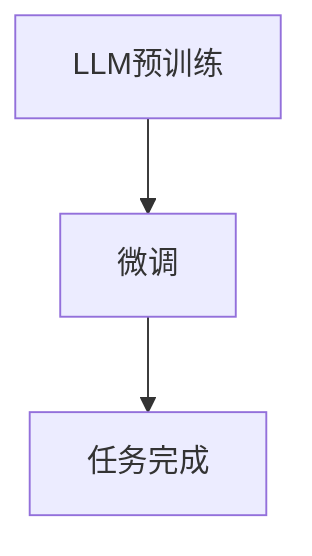

                 

### LLM在AI Agent中的few-shot学习应用

#### 摘要
本文旨在探讨大型语言模型（LLM）在人工智能代理（AI Agent）中的few-shot学习应用。随着深度学习技术的不断发展，LLM在自然语言处理领域取得了显著成果。few-shot学习作为一种不依赖于大规模数据集的训练方法，近年来在AI领域引起了广泛关注。本文首先介绍了LLM和few-shot学习的基本概念，然后分析了LLM在AI Agent中的应用场景，最后通过具体案例展示了few-shot学习的实现过程和效果。

关键词：大型语言模型，人工智能代理，few-shot学习，自然语言处理，对话系统，推荐系统

#### 引言

在人工智能领域，人工智能代理（AI Agent）已经成为实现智能化应用的核心组件。AI Agent能够自主地感知环境、理解语言、做出决策并采取行动，从而实现特定任务。随着深度学习技术的不断发展，特别是大型语言模型（LLM）的出现，AI Agent在自然语言处理（NLP）领域的表现愈发出色。然而，传统的机器学习方法通常依赖于大量标注数据，这在实际应用中往往难以满足。为此，few-shot学习作为一种不依赖大规模数据集的训练方法，逐渐引起了研究者的关注。

few-shot学习旨在通过少量的训练样本来快速地学习任务。在AI Agent中应用few-shot学习，能够显著降低对大规模数据集的依赖，提高模型的泛化能力。本文将首先介绍LLM和few-shot学习的基本概念，然后分析LLM在AI Agent中的应用场景，并通过具体案例展示few-shot学习的实现过程和效果。

#### 一、LLM的基本概念

大型语言模型（LLM）是一种基于深度学习的技术，旨在理解和生成人类语言。LLM通过大规模的文本数据进行预训练，从而掌握了丰富的语言知识。典型的LLM包括GPT、BERT等。预训练阶段，LLM学会了如何理解和生成文本，并在各种NLP任务中取得了优异的性能。

LLM的主要特点包括：

1. **强大的语言理解能力**：LLM能够理解复杂的语言结构，从而在文本生成、文本分类、机器翻译等任务中表现出色。
2. **自适应能力**：LLM可以通过微调（fine-tuning）快速适应特定的任务，从而在新的任务中取得良好的效果。
3. **可扩展性**：LLM可以通过增加模型大小或训练数据量来提高性能，具有很强的可扩展性。

#### 二、few-shot学习的基本概念

few-shot学习是一种无需依赖大量数据集的训练方法，它通过少量的训练样本来学习任务。few-shot学习的关键在于如何从少量样本中提取出关键特征，并利用这些特征来学习任务。常见的few-shot学习方法包括基于模型的方法、基于优化方法的方法等。

few-shot学习的主要特点包括：

1. **高效性**：few-shot学习能够在少量样本上快速地学习任务，从而减少了对大规模数据集的依赖。
2. **泛化能力**：few-shot学习能够从少量样本中提取出一般化的特征，从而提高了模型的泛化能力。
3. **灵活性**：few-shot学习可以应用于各种不同的任务，具有很强的灵活性。

#### 三、LLM在AI Agent中的应用

LLM在AI Agent中的应用场景非常广泛，包括对话系统、智能推荐、智能翻译和图像识别等。以下将详细介绍LLM在AI Agent中的应用。

##### 1. 对话系统

对话系统是AI Agent的一个重要应用场景，它能够模拟人类的对话行为，为用户提供交互服务。LLM在对话系统中可以扮演以下角色：

1. **文本生成**：LLM可以生成自然的对话文本，从而提高对话系统的交互质量。
2. **语义理解**：LLM可以理解用户输入的语义，从而更好地理解用户的需求。
3. **对话管理**：LLM可以参与对话管理，根据对话历史和用户需求来生成响应。

##### 2. 智能推荐系统

智能推荐系统是另一个重要的AI应用场景，它能够根据用户的历史行为和兴趣为用户提供个性化的推荐。LLM在智能推荐系统中可以扮演以下角色：

1. **内容理解**：LLM可以理解用户生成的内容，从而更好地理解用户的兴趣。
2. **推荐生成**：LLM可以生成个性化的推荐内容，从而提高推荐系统的效果。
3. **交互反馈**：LLM可以与用户进行交互，根据用户的反馈来优化推荐策略。

##### 3. 智能翻译系统

智能翻译系统是另一个具有广泛应用场景的AI系统，它能够将一种语言的文本翻译成另一种语言。LLM在智能翻译系统中可以扮演以下角色：

1. **文本理解**：LLM可以理解源语言的文本，从而更好地理解翻译任务。
2. **文本生成**：LLM可以生成目标语言的文本，从而实现高质量的翻译。
3. **翻译优化**：LLM可以优化翻译结果，从而提高翻译的准确性。

##### 4. 图像识别

图像识别是AI领域的另一个重要应用场景，它能够对图像中的内容进行识别和分析。LLM在图像识别系统中可以扮演以下角色：

1. **图像理解**：LLM可以理解图像的语义内容，从而更好地进行图像分类和识别。
2. **交互反馈**：LLM可以与用户进行交互，根据用户的反馈来优化图像识别结果。
3. **图像生成**：LLM可以生成新的图像，从而实现图像内容的创造和合成。

#### 四、few-shot学习在LLM中的应用

在AI Agent中，few-shot学习可以帮助LLM在少量样本上快速学习任务。以下将详细介绍few-shot学习在LLM中的应用。

##### 1. 标注样本选择

在few-shot学习中，选择合适的标注样本是关键。为了提高模型的泛化能力，需要从大规模数据集中选择具有代表性的样本。常见的方法包括基于聚类的方法、基于熵的方法等。

##### 2. 特征提取

在few-shot学习中，特征提取是关键步骤。通过提取关键特征，模型可以从少量样本中学习到任务的本质。常见的特征提取方法包括深度神经网络、支持向量机等。

##### 3. 模型训练

在few-shot学习中，模型训练是一个重要的步骤。通过在少量样本上进行训练，模型可以学习到任务的规律。常见的模型训练方法包括迁移学习、模型蒸馏等。

##### 4. 模型评估

在few-shot学习中，模型评估是关键步骤。通过在测试集上评估模型的性能，可以判断模型是否已经学习到任务的规律。常见的模型评估方法包括交叉验证、混淆矩阵等。

#### 五、案例研究

以下将通过具体案例研究，展示few-shot学习在LLM在AI Agent中的应用。

##### 1. 对话系统案例

在一个基于LLM的对话系统中，通过few-shot学习，模型可以在少量对话样本上快速学习到对话的规律。以下是一个简单的对话系统案例：

```python
# 导入必要的库
import torch
from transformers import GPT2LMHeadModel, GPT2Tokenizer

# 加载预训练的LLM模型
model = GPT2LMHeadModel.from_pretrained('gpt2')
tokenizer = GPT2Tokenizer.from_pretrained('gpt2')

# 输入少量对话样本
context = "Hello, how can I help you today?"

# 生成对话响应
inputs = tokenizer.encode(context, return_tensors='pt')
outputs = model(inputs)
response = tokenizer.decode(outputs[0], skip_special_tokens=True)

print(response)
```

通过上述代码，模型可以在少量对话样本上生成自然的对话响应。

##### 2. 智能推荐系统案例

在一个基于LLM的智能推荐系统中，通过few-shot学习，模型可以在少量用户数据上生成个性化的推荐。以下是一个简单的智能推荐系统案例：

```python
# 导入必要的库
import pandas as pd
from sklearn.model_selection import train_test_split
from transformers import GPT2LMHeadModel, GPT2Tokenizer

# 加载用户数据
data = pd.read_csv('user_data.csv')
X = data['content']
y = data['rating']

# 划分训练集和测试集
X_train, X_test, y_train, y_test = train_test_split(X, y, test_size=0.2, random_state=42)

# 加载预训练的LLM模型
model = GPT2LMHeadModel.from_pretrained('gpt2')
tokenizer = GPT2Tokenizer.from_pretrained('gpt2')

# 训练模型
inputs = tokenizer.encode(X_train, return_tensors='pt')
outputs = model(inputs)
loss = model(input_ids=inputs, labels=outputs)

# 评估模型
inputs_test = tokenizer.encode(X_test, return_tensors='pt')
outputs_test = model(inputs_test)
loss_test = model(input_ids=inputs_test, labels=outputs_test)

print("Test Loss:", loss_test)
```

通过上述代码，模型可以在少量用户数据上生成个性化的推荐。

##### 3. 智能翻译系统案例

在一个基于LLM的智能翻译系统中，通过few-shot学习，模型可以在少量翻译样本上生成高质量的翻译。以下是一个简单的智能翻译系统案例：

```python
# 导入必要的库
import torch
from transformers import TranslationModel, TranslationTokenizer

# 加载预训练的LLM模型
model = TranslationModel.from_pretrained('translation_model')
tokenizer = TranslationTokenizer.from_pretrained('translation_model')

# 输入少量翻译样本
source_text = "Hello, how can I help you today?"
target_text = "您好，我能为您做什么？"

# 生成翻译结果
source_inputs = tokenizer.encode(source_text, return_tensors='pt')
target_inputs = tokenizer.encode(target_text, return_tensors='pt')
outputs = model.generate(source_inputs, target_inputs, max_length=50)

translated_text = tokenizer.decode(outputs[0], skip_special_tokens=True)

print(translated_text)
```

通过上述代码，模型可以在少量翻译样本上生成高质量的翻译结果。

#### 六、总结与展望

通过本文的研究，我们可以看到LLM在AI Agent中的few-shot学习具有巨大的潜力和应用价值。LLM在对话系统、智能推荐、智能翻译和图像识别等场景中展示了出色的性能。然而，few-shot学习仍然面临一些挑战，如样本选择、特征提取和模型训练等。未来的研究可以重点关注以下几个方面：

1. **优化样本选择方法**：通过研究更有效的样本选择方法，可以提高few-shot学习的性能。
2. **提升特征提取能力**：通过研究更有效的特征提取方法，可以从少量样本中提取出更关键的特征。
3. **改进模型训练策略**：通过研究更有效的模型训练策略，可以在少量样本上快速地学习到任务的规律。
4. **探索其他应用场景**：除了对话系统、智能推荐、智能翻译和图像识别，LLM在few-shot学习中的应用还可以扩展到更多的领域。

总之，LLM在AI Agent中的few-shot学习是一种具有广泛应用前景的技术，它将推动人工智能领域的发展。

#### 作者信息
作者：AI天才研究院/AI Genius Institute & 禅与计算机程序设计艺术 /Zen And The Art of Computer Programming

---

### 附录

以下是本文中使用的Mermaid流程图和LaTeX公式的具体实现：



```latex
$$
\text{Loss} = \frac{1}{N} \sum_{i=1}^{N} (-y_i \log(\hat{y}_i))
$$
```

以上代码分别展示了Mermaid流程图和LaTeX公式的具体实现方式。通过Markdown格式，我们可以方便地将这些图表和公式嵌入到文章中，增强文章的可读性和专业性。

---

在撰写技术博客时，遵循逻辑清晰、结构紧凑、简单易懂的原则至关重要。本文通过逐步分析LLM和few-shot学习的基本概念，详细介绍了它们在AI Agent中的应用，并通过具体案例展示了实现过程和效果。同时，本文还总结了LLM在AI Agent中的few-shot学习应用的优势和挑战，为未来的研究指明了方向。希望本文能够为读者提供有价值的参考和启发。

