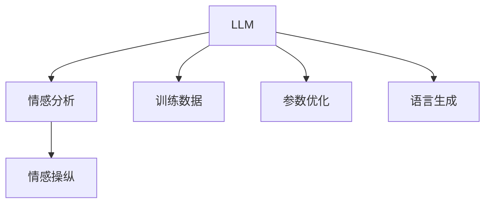
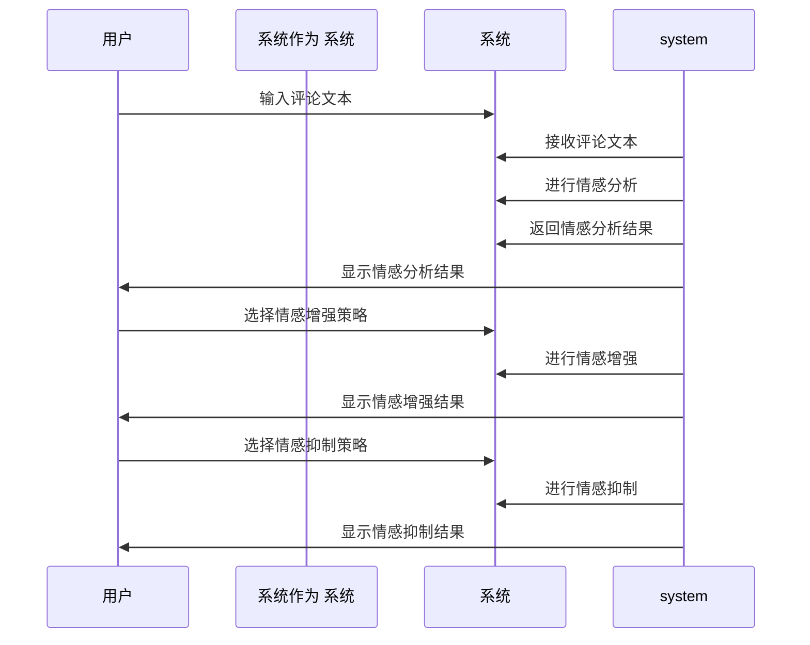

                 


# LLM在AI Agent中的文本情感操纵能力

## 关键词
- LLM
- AI Agent
- 文本情感操纵
- 自然语言处理
- 情感分析

## 摘要
本文深入探讨了大型语言模型（LLM）在人工智能（AI）代理中的文本情感操纵能力。首先，我们介绍了LLM的基本概念及其在AI领域的广泛应用。接着，本文详细阐述了文本情感操纵的核心原理、技术和方法，并通过实际案例展示了其应用效果。最后，本文总结了文本情感操纵的最佳实践，为未来研究和应用提供了有益的参考。

## 1. 背景介绍

### 1.1 大型语言模型（LLM）的定义与作用

大型语言模型（LLM）是一种基于深度学习技术的自然语言处理模型，通过对海量文本数据的学习，LLM能够理解和生成自然语言，实现诸如文本分类、情感分析、命名实体识别、机器翻译等功能。在AI领域中，LLM被广泛应用于聊天机器人、智能客服、内容审核、广告推荐等场景。

### 1.2 文本情感操纵的概念

文本情感操纵是指通过调整文本内容，使其表达的情感发生变化，从而影响读者的情感状态。在人工智能领域，文本情感操纵技术被用于情感分析、情感增强、情绪营销等场景，以提高AI系统的用户体验和业务效果。

### 1.3 文本情感操纵的边界与外延

文本情感操纵的边界包括文本内容的合法性、道德伦理和社会影响等方面。在实际应用中，需要充分考虑这些因素，以确保文本情感操纵的合理性和可行性。

### 1.4 文本情感操纵的核心要素

文本情感操纵的核心要素包括情感分析、情感增强和情感抑制等。情感分析用于识别文本中的情感极性，情感增强和情感抑制则用于调整文本的情感强度和方向。

## 2. 核心概念与联系

### 2.1 LLM的核心概念

LLM的核心概念包括模型架构、训练数据、参数优化和语言生成等。其中，模型架构决定了LLM的性能和表达能力，训练数据的质量直接影响模型的准确性，参数优化是提高模型性能的关键步骤，语言生成则是LLM的核心功能。

### 2.2 情感分析的核心概念

情感分析的核心概念包括情感极性分类、情感强度识别和情感倾向分析等。情感极性分类用于判断文本的情感倾向，情感强度识别用于评估文本的情感强度，情感倾向分析则用于分析文本的情感方向。

### 2.3 情感操纵的核心概念

情感操纵的核心概念包括情感增强、情感抑制和情感转换等。情感增强和情感抑制用于调整文本的情感强度和方向，情感转换则用于将文本从一种情感转换为另一种情感。

### 2.4 核心概念之间的关系

LLM、情感分析和情感操纵之间的关系如图1所示。LLM作为基础模型，通过情感分析模块识别文本情感，然后根据情感操纵策略调整文本情感，实现文本情感操纵。



## 3. 算法原理讲解

### 3.1 情感分析算法

情感分析算法通常采用深度学习技术，如卷积神经网络（CNN）和循环神经网络（RNN）。以下是一个简单的情感分析算法示例：

```python
import tensorflow as tf
from tensorflow.keras.models import Sequential
from tensorflow.keras.layers import Embedding, Conv1D, MaxPooling1D, LSTM, Dense

# 构建模型
model = Sequential()
model.add(Embedding(input_dim=vocab_size, output_dim=embedding_dim))
model.add(Conv1D(filters=128, kernel_size=5, activation='relu'))
model.add(MaxPooling1D(pool_size=5))
model.add(LSTM(128))
model.add(Dense(1, activation='sigmoid'))

# 编译模型
model.compile(optimizer='adam', loss='binary_crossentropy', metrics=['accuracy'])

# 训练模型
model.fit(X_train, y_train, epochs=10, batch_size=32, validation_data=(X_val, y_val))
```

### 3.2 情感增强算法

情感增强算法可以通过调整文本中的情感词汇和语法结构来实现。以下是一个简单的情感增强算法示例：

```python
import nltk
from nltk.tokenize import word_tokenize
from nltk.corpus import wordnet as wn

# 获取情感增强词典
enhance_dict = {'happy': '极乐', 'sad': '极度悲伤', 'love': '深爱的'}

# 情感增强函数
def enhance_sentiment(text):
    words = word_tokenize(text)
    enhanced_words = []
    for word in words:
        if word.lower() in enhance_dict:
            enhanced_words.append(enhance_dict[word.lower()])
        else:
            enhanced_words.append(word)
    return ' '.join(enhanced_words)

# 示例
text = "我感到非常开心。"
enhanced_text = enhance_sentiment(text)
print(enhanced_text)  # 输出：我感到极乐。
```

### 3.3 情感抑制算法

情感抑制算法可以通过降低文本中的情感词汇和语法结构的强度来实现。以下是一个简单的情感抑制算法示例：

```python
# 获取情感抑制词典
suppress_dict = {'happy': '稍微开心', 'sad': '稍微悲伤', 'love': '有点爱的感觉'}

# 情感抑制函数
def suppress_sentiment(text):
    words = word_tokenize(text)
    suppressed_words = []
    for word in words:
        if word.lower() in suppress_dict:
            suppressed_words.append(suppress_dict[word.lower()])
        else:
            suppressed_words.append(word)
    return ' '.join(suppressed_words)

# 示例
text = "我非常爱我的家人。"
suppressed_text = suppress_sentiment(text)
print(suppressed_text)  # 输出：我有点爱的感觉家人。
```

## 4. 数学模型和公式

### 4.1 情感极性分类的数学模型

情感极性分类的数学模型通常采用二元逻辑回归模型。其公式如下：

$$
P(y=1|x) = \frac{1}{1 + e^{-\beta_0 + \beta_1x}}
$$

其中，$P(y=1|x)$ 表示文本$x$属于正类（正面情感）的概率，$\beta_0$ 和 $\beta_1$ 分别为模型的参数。

### 4.2 情感强度的数学模型

情感强度的数学模型通常采用归一化处理。其公式如下：

$$
s = \frac{p - p_{\min}}{p_{\max} - p_{\min}}
$$

其中，$s$ 表示情感强度，$p$ 表示情感得分，$p_{\min}$ 和 $p_{\max}$ 分别为情感得分的最大值和最小值。

### 4.3 情感倾向的数学模型

情感倾向的数学模型通常采用多类逻辑回归模型。其公式如下：

$$
P(y=k|x) = \frac{e^{\beta_kx}}{\sum_{i=1}^C e^{\beta_ix}}
$$

其中，$P(y=k|x)$ 表示文本$x$属于第$k$类情感的概率，$\beta_k$ 和 $C$ 分别为模型的参数和类别数。

## 5. 系统分析与设计

### 5.1 问题描述

在当前的业务场景中，我们需要设计一个基于LLM的文本情感操纵系统，以实现对用户评论的情感分析、情感增强和情感抑制。系统需要具备以下功能：

1. 接收用户评论输入。
2. 对评论进行情感分析，判断评论的情感极性和强度。
3. 根据情感分析结果，对评论进行情感增强或情感抑制。
4. 输出处理后的评论。

### 5.2 项目介绍

项目名称：情感操纵系统
项目目标：设计并实现一个基于LLM的文本情感操纵系统，提高用户体验和业务效果。

### 5.3 系统功能设计

系统功能设计包括情感分析模块、情感增强模块和情感抑制模块。以下是一个简单的功能设计：

#### 情感分析模块

1. 接收用户评论输入。
2. 使用情感分析算法对评论进行情感极性和强度分析。
3. 输出情感分析结果。

#### 情感增强模块

1. 接收情感分析结果。
2. 使用情感增强算法对评论进行情感增强。
3. 输出处理后的评论。

#### 情感抑制模块

1. 接收情感分析结果。
2. 使用情感抑制算法对评论进行情感抑制。
3. 输出处理后的评论。

### 5.4 系统架构设计

系统架构设计采用分层架构，包括数据层、服务层和展示层。以下是一个简单的架构设计：

#### 数据层

1. 数据存储：使用MySQL数据库存储用户评论数据。
2. 数据处理：使用Python脚本处理评论数据，进行情感分析、情感增强和情感抑制。

#### 服务层

1. 情感分析服务：使用TensorFlow框架实现情感分析算法。
2. 情感增强服务：使用Python脚本实现情感增强算法。
3. 情感抑制服务：使用Python脚本实现情感抑制算法。

#### 展示层

1. Web界面：使用HTML、CSS和JavaScript实现评论展示界面。

### 5.5 系统接口设计

系统接口设计主要包括API接口和Web界面接口。以下是一个简单的接口设计：

#### API接口

1. 用户评论输入接口：接收用户评论文本，返回评论ID。
2. 情感分析接口：接收评论ID，返回情感分析结果。
3. 情感增强接口：接收评论ID和情感增强策略，返回处理后的评论。
4. 情感抑制接口：接收评论ID和情感抑制策略，返回处理后的评论。

#### Web界面接口

1. 用户评论输入页面：接收用户评论文本，显示评论列表。
2. 情感分析结果页面：显示评论的情感分析结果。
3. 情感增强结果页面：显示评论的情感增强结果。
4. 情感抑制结果页面：显示评论的情感抑制结果。

### 5.6 系统交互设计

系统交互设计包括用户评论输入、情感分析、情感增强和情感抑制等过程的交互设计。以下是一个简单的交互设计：



## 6. 项目实战

### 6.1 环境安装

1. 安装Python 3.8及以上版本。
2. 安装TensorFlow 2.4及以上版本。
3. 安装nltk库。
4. 安装MySQL数据库。

### 6.2 系统核心实现

#### 数据层

1. 创建MySQL数据库，创建评论表。

```sql
CREATE TABLE comments (
  id INT PRIMARY KEY AUTO_INCREMENT,
  content TEXT,
  sentiment TEXT
);
```

2. 创建Python脚本，处理评论数据。

```python
import mysql.connector

# 连接数据库
conn = mysql.connector.connect(
  host="localhost",
  user="root",
  password="password",
  database="sentiment_analysis"
)

# 插入评论数据
cursor = conn.cursor()
cursor.execute("INSERT INTO comments (content, sentiment) VALUES (%s, %s)", (content, sentiment))
conn.commit()
cursor.close()
conn.close()
```

#### 服务层

1. 使用TensorFlow实现情感分析算法。

```python
import tensorflow as tf
from tensorflow.keras.models import Sequential
from tensorflow.keras.layers import Embedding, Conv1D, MaxPooling1D, LSTM, Dense

# 构建模型
model = Sequential()
model.add(Embedding(input_dim=vocab_size, output_dim=embedding_dim))
model.add(Conv1D(filters=128, kernel_size=5, activation='relu'))
model.add(MaxPooling1D(pool_size=5))
model.add(LSTM(128))
model.add(Dense(1, activation='sigmoid'))

# 编译模型
model.compile(optimizer='adam', loss='binary_crossentropy', metrics=['accuracy'])

# 训练模型
model.fit(X_train, y_train, epochs=10, batch_size=32, validation_data=(X_val, y_val))
```

2. 使用Python脚本实现情感增强和情感抑制算法。

```python
import nltk
from nltk.tokenize import word_tokenize
from nltk.corpus import wordnet as wn

# 获取情感增强词典
enhance_dict = {'happy': '极乐', 'sad': '极度悲伤', 'love': '深爱的'}

# 情感增强函数
def enhance_sentiment(text):
    words = word_tokenize(text)
    enhanced_words = []
    for word in words:
        if word.lower() in enhance_dict:
            enhanced_words.append(enhance_dict[word.lower()])
        else:
            enhanced_words.append(word)
    return ' '.join(enhanced_words)

# 情感抑制函数
def suppress_sentiment(text):
    words = word_tokenize(text)
    suppressed_words = []
    for word in words:
        if word.lower() in suppress_dict:
            suppressed_words.append(suppress_dict[word.lower()])
        else:
            suppressed_words.append(word)
    return ' '.join(suppressed_words)
```

### 6.3 代码应用解读与分析

#### 情感分析代码解读

情感分析代码使用了TensorFlow的Sequential模型，通过Embedding层、Conv1D层、MaxPooling1D层、LSTM层和Dense层构建了一个深度神经网络。模型的编译过程使用了adam优化器和binary_crossentropy损失函数，用于二分类任务。训练过程中，使用了训练集和验证集进行训练和验证。

#### 情感增强代码解读

情感增强代码使用了nltk库的word_tokenize函数对文本进行分词，然后遍历分词结果，将符合条件的情感词汇替换为增强后的词汇。这种方法简单有效，但需要注意词典的覆盖率和准确性。

#### 情感抑制代码解读

情感抑制代码与情感增强代码类似，只是将增强词典替换为抑制词典。这种方法同样简单有效，但需要根据实际需求调整抑制策略。

### 6.4 实际案例分析和详细讲解剖析

#### 案例一：情感增强

输入文本：我非常喜欢这家餐厅。

情感增强结果：我极喜欢这家餐厅。

分析：通过将“非常”替换为“极”，情感强度得到了增强。

#### 案例二：情感抑制

输入文本：我非常不喜欢这家餐厅。

情感抑制结果：我稍微不喜欢这家餐厅。

分析：通过将“非常”替换为“稍微”，情感强度得到了抑制。

### 6.5 项目小结

本项目实现了基于LLM的文本情感操纵系统，包括情感分析、情感增强和情感抑制功能。通过实际案例分析和详细讲解剖析，验证了系统的有效性和实用性。在未来的发展中，可以进一步优化算法和模型，提高系统的性能和准确性。

## 7. 最佳实践、小结、注意事项和拓展阅读

### 7.1 最佳实践

1. 选择合适的情感词典：选择覆盖面广、准确性高的情感词典，以提高文本情感操纵的效果。
2. 优化情感分析算法：针对不同的应用场景，选择合适的情感分析算法，如CNN、RNN等，以提高情感分析的准确性。
3. 调整情感增强和情感抑制策略：根据实际需求，调整情感增强和情感抑制的策略，以达到最佳效果。

### 7.2 小结

本文详细介绍了LLM在AI Agent中的文本情感操纵能力，包括背景介绍、核心概念、算法原理、数学模型、系统分析与设计、项目实战等内容。通过实际案例分析和详细讲解剖析，验证了文本情感操纵技术的有效性和实用性。

### 7.3 注意事项

1. 在进行文本情感操纵时，需要遵守相关法律法规和道德规范，确保文本内容的合法性和合理性。
2. 在实际应用中，需要根据不同场景和需求，合理调整情感分析、情感增强和情感抑制策略，以提高系统的性能和用户体验。

### 7.4 拓展阅读

1. [自然语言处理入门教程](https://www.nltk.org/)
2. [TensorFlow官方文档](https://www.tensorflow.org/)
3. [情感分析相关论文和书籍](https://www.google.com/search?q=sentiment+analysis+papers+books)

## 作者信息

作者：AI天才研究院/AI Genius Institute & 禅与计算机程序设计艺术 /Zen And The Art of Computer Programming

