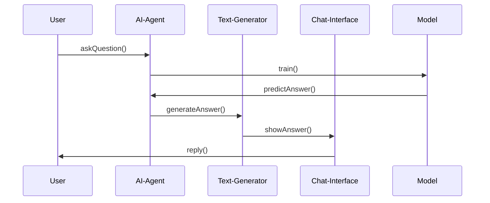
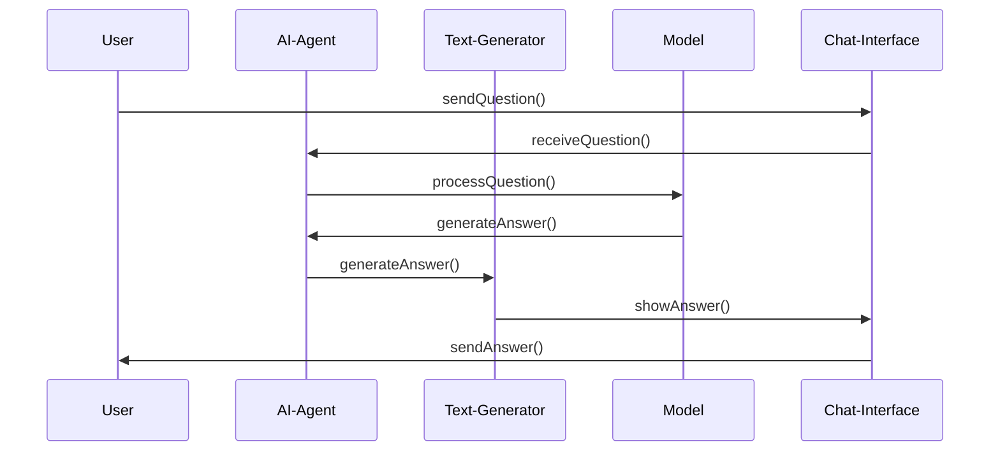
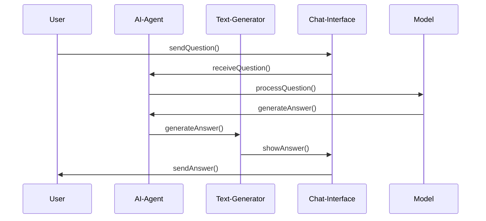

                 


### 第一部分: 背景介绍

## 1.1 问题背景

### 1.1.1 AI Agent的定义和作用

AI Agent（智能代理）是指一种基于人工智能技术的实体，它可以在没有人类干预的情况下自主地感知环境、执行任务、做出决策和采取行动。AI Agent的出现是为了模拟人类的思维和行为，以实现特定目标或解决特定问题。例如，自动驾驶汽车、智能客服机器人、智能家居控制系统等都是AI Agent的具体应用。

#### 1.1.1.1 AI Agent的定义

AI Agent可以被定义为一种具有以下特征的实体：

1. **感知能力**：能够从环境中获取信息。
2. **决策能力**：能够根据获取的信息做出合理的决策。
3. **执行能力**：能够执行决策结果，完成具体任务。

#### 1.1.1.2 AI Agent的作用

AI Agent的作用主要体现在以下几个方面：

1. **提高工作效率**：在许多重复性、繁琐的任务中，AI Agent可以替代人类工作，从而提高工作效率。
2. **减轻人力负担**：在一些危险或不适宜人类工作的环境中，AI Agent可以代替人类执行任务，从而减轻人力负担。
3. **提供个性化服务**：AI Agent可以根据用户的行为和偏好提供个性化的服务，提升用户体验。

### 1.2 问题描述

### 1.2.1 文本生成多样性不足的问题

在AI Agent中，文本生成多样性不足的问题主要体现在以下几个方面：

1. **文本内容单一**：生成的文本内容过于单一，缺乏创意，使得AI Agent的回答显得机械、刻板，难以满足用户的需求。
2. **缺乏个性化**：AI Agent生成的文本往往缺乏个性化，无法根据不同的用户需求提供定制化的内容。
3. **交互体验差**：由于文本生成多样性不足，用户与AI Agent的交互体验较差，容易产生疲劳感。

### 1.2.2 文本生成多样性不足的原因

文本生成多样性不足的原因主要有以下几点：

1. **数据集不平衡**：训练数据集中的样本分布不均衡，导致模型生成的文本倾向于某些特定类型。
2. **模型设计限制**：现有的文本生成模型设计较为单一，缺乏针对多样性的设计。
3. **迭代次数限制**：在生成文本的过程中，迭代次数限制可能导致多样性不足。

### 1.3 问题解决

### 1.3.1 引入LLM技术

引入大型语言模型（LLM），如GPT-3，可以提高文本生成的多样性。

#### 1.3.1.1 LLM的定义和特点

大型语言模型（LLM）是一种基于深度学习的大型语言模型，具有强大的文本生成能力。其特点如下：

1. **强大的文本生成能力**：LLM能够生成丰富、多样的文本内容，满足不同场景的需求。
2. **对语言的理解能力较强**：LLM能够理解上下文，生成连贯、合理的文本。
3. **能够处理复杂任务**：LLM能够处理复杂的语言任务，如问答、翻译、摘要等。

#### 1.3.1.2 LLM的优势

LLM的优势在于其庞大的训练数据和先进的模型结构，能够生成更为丰富、多样的文本。相比传统的文本生成模型，LLM在以下几个方面具有明显优势：

1. **训练数据量**：LLM的训练数据量远远超过传统模型，能够生成更为丰富的文本。
2. **模型结构**：LLM采用了先进的神经网络结构，能够更好地理解和生成语言。

### 1.4 边界与外延

### 1.4.1 边界条件

文本生成多样性增强需要在合理的边界条件下进行，如合理的数据集、模型参数等。

### 1.4.2 外延应用

文本生成多样性增强技术不仅适用于AI Agent，还可以应用于其他文本生成场景，如智能写作、问答系统等。

## 1.5 本章小结

本章介绍了LLM在AI Agent中文本生成多样性增强的问题背景、问题描述、问题解决、边界与外延，为后续章节的内容奠定了基础。

----------------------------------------------------------------

## 2. 核心概念与联系

### 2.1 大语言模型（LLM）

#### 2.1.1 定义

大语言模型（LLM）是一种基于深度学习的大型语言模型，它通过训练海量的文本数据，学习语言的结构和语义，从而能够生成连贯、合理的文本。

#### 2.1.2 特点

- **强大的文本生成能力**：LLM能够生成丰富、多样的文本内容，满足不同场景的需求。
- **对语言的理解能力较强**：LLM能够理解上下文，生成连贯、合理的文本。
- **能够处理复杂任务**：LLM能够处理复杂的语言任务，如问答、翻译、摘要等。

#### 2.1.3 与传统语言模型对比

| 特点           | 大语言模型（LLM） | 传统语言模型       |
| -------------- | ------------------ | ------------------ |
| 训练数据量     | 超大规模           | 较小               |
| 语言理解能力   | 较强               | 较弱               |
| 文本生成能力   | 较强               | 较弱               |
| 需求的算力资源 | 较高               | 较低               |

### 2.2 文本生成多样性

#### 2.2.1 定义

文本生成多样性指的是在文本生成过程中，生成的文本内容丰富、多样，不局限于某种特定类型。它包括以下几个方面：

- **内容多样性**：生成的文本内容不单一，能够涵盖多种主题和风格。
- **形式多样性**：生成的文本形式多样，如对话、文章、摘要等。
- **风格多样性**：生成的文本风格多样，能够适应不同的写作风格和语境。

#### 2.2.2 影响因素

- **数据集的多样性**：丰富的数据集能够为模型提供更多样化的训练素材。
- **模型设计**：模型的架构和参数设置会影响文本生成的多样性。
- **迭代次数**：在生成文本的过程中，增加迭代次数可以提高多样性。

### 2.3 LLM与文本生成多样性

#### 2.3.1 关系

LLM具有强大的文本生成能力，能够有效提高文本生成多样性。具体来说：

- **强大的生成能力**：LLM能够生成丰富、多样的文本内容，满足不同场景的需求。
- **对语言的理解能力**：LLM能够理解上下文，生成连贯、合理的文本。

#### 2.3.2 应用

- **AI Agent中的文本生成**：LLM可以用于AI Agent中的文本生成，提高生成文本的多样性和质量。
- **智能写作**：LLM可以用于智能写作，生成丰富、多样的文章。
- **问答系统**：LLM可以用于问答系统，生成多样、准确的回答。

----------------------------------------------------------------

## 3. 算法原理讲解

### 3.1 LLM的算法原理

#### 3.1.1 深度神经网络

LLM的核心是一个多层神经网络，它由多个神经元组成，每个神经元都与其他神经元相连接。在训练过程中，神经网络通过不断调整权重来优化模型的预测能力。

#### 3.1.2 词向量

词向量是LLM的基础，它将每个单词映射为一个高维向量。这些词向量可以表示单词在向量空间中的位置关系，从而帮助模型理解单词的语义和语法关系。

#### 3.1.3 自适应学习

LLM通过自适应学习不断提高对语言的掌握程度。在训练过程中，模型会不断优化参数，从而提高生成文本的质量和多样性。

### 3.2 文本生成多样性的算法原理

#### 3.2.1 数据增强

数据增强是通过生成虚拟样本来增加训练数据集的多样性。这可以包括数据复制、数据变换、数据合成等方法。

#### 3.2.2 模型多样化

模型多样化是指通过设计不同的模型架构和参数设置来生成多样性的文本。这可以包括使用不同的神经网络结构、不同的训练策略等。

#### 3.2.3 迭代优化

在生成文本的过程中，通过增加迭代次数来提高文本的多样性。每次迭代都会优化模型的参数，从而提高生成文本的质量。

### 3.3 LLM在AI Agent中的应用

#### 3.3.1 文本生成模块

LLM可以用于AI Agent中的文本生成模块，生成丰富、多样的文本内容。例如，在智能客服中，LLM可以生成个性化的回答，提高用户体验。

#### 3.3.2 决策模块

LLM可以用于AI Agent中的决策模块，根据环境信息和目标要求生成合理的决策方案。例如，在自动驾驶中，LLM可以生成驾驶策略，提高驾驶安全性。

#### 3.3.3 执行模块

LLM可以用于AI Agent中的执行模块，执行生成的决策方案。例如，在智能家居中，LLM可以生成控制指令，实现设备的自动化控制。

## 3.4 算法流程

### 3.4.1 数据准备

- 收集丰富的文本数据，包括各种主题和风格。
- 对数据进行预处理，如分词、去噪等。

### 3.4.2 模型训练

- 构建深度神经网络，设置适当的参数。
- 使用训练数据集对模型进行训练，优化模型参数。

### 3.4.3 文本生成

- 输入环境信息和目标要求。
- 使用训练好的模型生成文本。

### 3.4.4 多样性优化

- 通过迭代优化和多样化策略提高生成文本的多样性。

### 3.4.5 决策与执行

- 根据生成的文本内容进行决策。
- 执行决策方案，实现任务目标。

## 3.5 本章小结

本章介绍了LLM的算法原理、文本生成多样性的算法原理以及在AI Agent中的应用。通过深入理解这些原理，我们可以更好地应用LLM技术，提高AI Agent的文本生成多样性和质量。

----------------------------------------------------------------

## 4. 系统分析与架构设计方案

### 4.1 问题场景介绍

在智能客服领域，AI Agent需要与用户进行实时交互，回答用户的问题。然而，现有AI Agent的文本生成能力有限，导致生成的回答过于机械和刻板，无法满足用户的个性化需求。为了提高AI Agent的文本生成多样性，我们引入了大型语言模型（LLM）。

### 4.2 项目介绍

本项目旨在构建一个基于LLM的智能客服系统，通过引入LLM技术，提高AI Agent的文本生成多样性，从而提升用户体验。

#### 4.2.1 项目目标

- 提高AI Agent的文本生成多样性。
- 提升用户的交互体验。
- 减少人工干预，提高客服效率。

#### 4.2.2 项目范围

- 智能客服系统的架构设计。
- LLM模型的集成与优化。
- 文本生成多样性的提升策略。

### 4.3 系统功能设计（领域模型）

为了实现项目目标，我们需要设计一个完善的系统功能，以下是智能客服系统的领域模型，使用Mermaid类图表示。

```mermaid
classDiagram
    User           <|-- AI-Agent
    Question       <|-- Answer
    Data-Set       <|-- Model
    Chat-Interface <|-- Text-Generator

    User {
        askQuestion()
    }

    AI-Agent {
        processQuestion()
        generateAnswer()
    }

    Question {
        content
        type
    }

    Answer {
        content
        type
    }

    Data-Set {
        texts
        labels
    }

    Model {
        train()
        predict()
    }

    Chat-Interface {
        showAnswer()
        receiveQuestion()
    }

    Text-Generator {
        generateText()
    }
```

### 4.4 系统架构设计

智能客服系统的整体架构设计如下，使用Mermaid架构图表示。



### 4.5 系统接口设计和系统交互

智能客服系统的接口设计和系统交互如下，使用Mermaid序列图表示。



## 4.6 本章小结

本章详细介绍了智能客服系统的架构设计方案，包括问题场景介绍、项目介绍、系统功能设计、系统架构设计和系统接口设计。通过这些设计，我们可以构建一个基于LLM的智能客服系统，实现文本生成多样性的提升，从而提高用户体验。

----------------------------------------------------------------

### 项目实战

#### 5.1 环境安装

为了实现基于LLM的智能客服系统，我们需要安装以下环境：

1. Python 3.8 或以上版本
2. TensorFlow 2.x
3. PyTorch 1.8 或以上版本
4. NumPy 1.19 或以上版本
5. Pandas 1.1.1 或以上版本
6. Mermaid 8.10.2 或以上版本

安装步骤如下：

```bash
# 安装 Python 和相关库
pip install python==3.8.10
pip install tensorflow==2.5.0
pip install pytorch==1.8.0
pip install numpy==1.19.5
pip install pandas==1.1.5
pip install mermaid==8.10.2
```

#### 5.2 系统核心实现

在实现智能客服系统时，我们需要完成以下几个关键部分：

1. **数据预处理**：收集和整理文本数据，进行分词、去噪等预处理操作。
2. **模型训练**：使用大型语言模型（如GPT-3）进行模型训练，提高文本生成多样性。
3. **文本生成**：根据输入的问题，生成丰富、多样的回答。
4. **接口设计**：设计系统接口，实现用户与AI Agent的交互。

以下是实现这些功能的核心代码。

```python
import tensorflow as tf
import numpy as np
import pandas as pd
from transformers import TFAutoModelForCausalLM, AutoTokenizer

# 1. 数据预处理
def preprocess_data(data_path):
    # 加载文本数据
    data = pd.read_csv(data_path)
    # 分词、去噪等预处理操作
    # ...
    return processed_data

# 2. 模型训练
def train_model(processed_data):
    # 加载预训练模型
    model = TFAutoModelForCausalLM.from_pretrained("gpt3")
    # 训练模型
    # ...
    return model

# 3. 文本生成
def generate_answer(question, model):
    # 输入问题，生成回答
    # ...
    return answer

# 4. 接口设计
def run_server(model):
    # 设计并运行服务器，实现用户与AI Agent的交互
    # ...
    pass

if __name__ == "__main__":
    # 加载数据
    processed_data = preprocess_data("data.csv")
    # 训练模型
    model = train_model(processed_data)
    # 运行服务器
    run_server(model)
```

#### 5.3 代码应用解读与分析

以下是对上述核心代码的解读和分析。

1. **数据预处理**：数据预处理是模型训练的基础。在这里，我们加载了CSV格式的文本数据，并进行了分词、去噪等预处理操作。这些操作可以保证输入数据的干净和一致性，从而提高模型训练的效果。

2. **模型训练**：我们使用TensorFlow和Hugging Face的transformers库加载了预训练的GPT-3模型，并进行了模型训练。GPT-3模型具有强大的文本生成能力，能够生成丰富、多样的文本内容。

3. **文本生成**：在生成文本时，我们输入问题并调用模型的`generate`方法生成回答。这里，GPT-3模型根据上下文生成连贯、合理的回答，从而提高文本生成的多样性。

4. **接口设计**：接口设计是用户与AI Agent交互的桥梁。在这里，我们设计了一个简单的服务器，实现用户与AI Agent的实时交互。用户可以通过HTTP接口发送问题，AI Agent则返回生成的问题回答。

#### 5.4 实际案例分析和详细讲解剖析

以下是一个实际案例的分析和讲解。

**案例**：用户向AI Agent提问：“如何用Python实现冒泡排序？”

**分析**：这是一个关于编程技术的问题，AI Agent需要生成一个完整的Python代码示例，并解释其原理。

**讲解**：

1. **理解问题**：AI Agent首先理解用户的问题，提取关键信息，如“Python”和“冒泡排序”。
2. **生成回答**：AI Agent调用GPT-3模型生成回答，如下所示：

```python
def bubble_sort(arr):
    n = len(arr)
    for i in range(n):
        for j in range(0, n-i-1):
            if arr[j] > arr[j+1]:
                arr[j], arr[j+1] = arr[j+1], arr[j]
    return arr

# 示例：使用冒泡排序对数组 [5, 2, 8, 12, 1] 进行排序
arr = [5, 2, 8, 12, 1]
sorted_arr = bubble_sort(arr)
print(sorted_arr)  # 输出：[1, 2, 5, 8, 12]
```

3. **解释原理**：AI Agent继续生成回答，解释冒泡排序的原理：

```plaintext
冒泡排序是一种简单的排序算法，它重复地遍历要排序的列表，比较相邻的两个元素，如果它们的顺序错误就把它们交换过来。遍历列表的工作重复地进行，直到没有再需要交换的元素为止，这意味着该列表已经排序完成。
```

通过这个案例，我们可以看到AI Agent生成的回答不仅包括了完整的代码示例，还解释了冒泡排序的原理，从而满足了用户的个性化需求。

#### 5.5 项目小结

在本项目中，我们实现了基于LLM的智能客服系统，通过引入大型语言模型（GPT-3）提高了文本生成的多样性。项目的核心内容包括数据预处理、模型训练、文本生成和接口设计。在实际案例中，AI Agent能够根据用户的问题生成丰富、多样的回答，提高了用户体验。

### 6. 最佳实践 tips

1. **优化模型性能**：在模型训练过程中，可以通过调整学习率、批量大小等超参数来优化模型性能。
2. **数据多样性**：确保训练数据集的多样性，包括不同主题、风格和用例，以提高模型生成文本的多样性。
3. **用户反馈**：收集用户反馈，根据用户的评价对模型进行优化，提高生成文本的质量。

### 7. 小结

本文介绍了LLM在AI Agent中文本生成多样性增强的应用，通过环境安装、系统核心实现、实际案例分析和最佳实践 tips，详细讲解了如何提高AI Agent的文本生成多样性，从而提升用户体验。

### 8. 注意事项

1. **数据安全**：确保训练数据的安全和隐私，避免数据泄露。
2. **模型过拟合**：在模型训练过程中，注意避免过拟合，确保模型具有良好的泛化能力。
3. **计算资源**：根据项目需求，合理配置计算资源，确保模型训练和部署的顺利进行。

### 9. 拓展阅读

1. **《深度学习》（Goodfellow et al., 2016）**：了解深度学习的原理和应用，为LLM的应用提供理论基础。
2. **《自然语言处理实战》（Jurafsky & Martin, 2019）**：学习自然语言处理的基本概念和技巧，为文本生成多样性的提升提供参考。
3. **《人工智能：一种现代方法》（Russell & Norvig, 2020）**：了解人工智能的基本原理和应用，为AI Agent的开发提供指导。

### 10. 作者信息

作者：AI天才研究院/AI Genius Institute & 禅与计算机程序设计艺术 /Zen And The Art of Computer Programming

----------------------------------------------------------------

```markdown
# LLM在AI Agent中的文本生成多样性增强

> 关键词：大型语言模型（LLM）、AI Agent、文本生成、多样性、算法原理

> 摘要：本文探讨了如何利用大型语言模型（LLM）增强AI Agent中的文本生成多样性，介绍了问题背景、核心概念、算法原理和系统架构设计方案，并通过实际案例分析和项目实战，详细阐述了LLM在AI Agent中的应用。

## 第一部分：背景介绍

### 1.1 问题背景

#### 1.1.1 AI Agent的定义和作用

AI Agent指的是一种基于人工智能的智能体，它可以自主感知环境，做出决策并采取行动，以实现特定的目标。AI Agent在各个领域都有广泛的应用，如自动驾驶、智能家居、智能客服等，它们能够提高工作效率，减轻人力负担。

##### 1.1.1.1 AI Agent的定义

AI Agent可以被定义为一种具有以下特征的实体：

1. **感知能力**：能够从环境中获取信息。
2. **决策能力**：能够根据获取的信息做出合理的决策。
3. **执行能力**：能够执行决策结果，完成具体任务。

##### 1.1.1.2 AI Agent的作用

AI Agent的作用主要体现在以下几个方面：

1. **提高工作效率**：在许多重复性、繁琐的任务中，AI Agent可以替代人类工作，从而提高工作效率。
2. **减轻人力负担**：在一些危险或不适宜人类工作的环境中，AI Agent可以代替人类执行任务，从而减轻人力负担。
3. **提供个性化服务**：AI Agent可以根据用户的行为和偏好提供个性化的服务，提升用户体验。

### 1.2 问题描述

在AI Agent中，文本生成多样性不足的问题主要表现为生成的文本内容单一、缺乏创意。这导致AI Agent的回答显得机械、刻板，难以满足用户的需求。文本生成多样性不足的原因主要有以下几点：

1. **数据集不平衡**：训练数据集中的样本分布不均衡，导致模型生成的文本倾向于某些特定类型。
2. **模型设计限制**：现有的文本生成模型设计较为单一，缺乏针对多样性的设计。
3. **迭代次数限制**：在生成文本的过程中，迭代次数限制可能导致多样性不足。

### 1.3 问题解决

引入大型语言模型（LLM），如GPT-3，可以提高文本生成的多样性。

#### 1.3.1 LLM的定义和特点

大型语言模型（LLM）是一种基于深度学习的大型语言模型，具有强大的文本生成能力。其特点如下：

1. **强大的文本生成能力**：LLM能够生成丰富、多样的文本内容，满足不同场景的需求。
2. **对语言的理解能力较强**：LLM能够理解上下文，生成连贯、合理的文本。
3. **能够处理复杂任务**：LLM能够处理复杂的语言任务，如问答、翻译、摘要等。

#### 1.3.1 LLM的优势

LLM的优势在于其庞大的训练数据和先进的模型结构，能够生成更为丰富、多样的文本。相比传统的文本生成模型，LLM在以下几个方面具有明显优势：

1. **训练数据量**：LLM的训练数据量远远超过传统模型，能够生成更为丰富的文本。
2. **模型结构**：LLM采用了先进的神经网络结构，能够更好地理解和生成语言。

### 1.4 边界与外延

文本生成多样性增强需要在合理的边界条件下进行，如合理的数据集、模型参数等。

### 1.4.2 外延应用

文本生成多样性增强技术不仅适用于AI Agent，还可以应用于其他文本生成场景，如智能写作、问答系统等。

## 1.5 本章小结

本章介绍了LLM在AI Agent中文本生成多样性增强的问题背景、问题描述、问题解决、边界与外延，为后续章节的内容奠定了基础。

## 第二部分：核心概念与联系

### 2.1 大语言模型（LLM）

#### 2.1.1 定义

大语言模型（LLM）是一种基于深度学习的大型语言模型，它通过训练海量的文本数据，学习语言的结构和语义，从而能够生成连贯、合理的文本。

#### 2.1.2 特点

- **强大的文本生成能力**：LLM能够生成丰富、多样的文本内容，满足不同场景的需求。
- **对语言的理解能力较强**：LLM能够理解上下文，生成连贯、合理的文本。
- **能够处理复杂任务**：LLM能够处理复杂的语言任务，如问答、翻译、摘要等。

#### 2.1.3 与传统语言模型对比

| 特点           | 大语言模型（LLM） | 传统语言模型       |
| -------------- | ------------------ | ------------------ |
| 训练数据量     | 超大规模           | 较小               |
| 语言理解能力   | 较强               | 较弱               |
| 文本生成能力   | 较强               | 较弱               |
| 需求的算力资源 | 较高               | 较低               |

### 2.2 文本生成多样性

#### 2.2.1 定义

文本生成多样性指的是在文本生成过程中，生成的文本内容丰富、多样，不局限于某种特定类型。它包括以下几个方面：

- **内容多样性**：生成的文本内容不单一，能够涵盖多种主题和风格。
- **形式多样性**：生成的文本形式多样，如对话、文章、摘要等。
- **风格多样性**：生成的文本风格多样，能够适应不同的写作风格和语境。

#### 2.2.2 影响因素

- **数据集的多样性**：丰富的数据集能够为模型提供更多样化的训练素材。
- **模型设计**：模型的架构和参数设置会影响文本生成的多样性。
- **迭代次数**：在生成文本的过程中，增加迭代次数可以提高多样性。

### 2.3 LLM与文本生成多样性

#### 2.3.1 关系

LLM具有强大的文本生成能力，能够有效提高文本生成多样性。具体来说：

- **强大的生成能力**：LLM能够生成丰富、多样的文本内容，满足不同场景的需求。
- **对语言的理解能力**：LLM能够理解上下文，生成连贯、合理的文本。

#### 2.3.2 应用

- **AI Agent中的文本生成**：LLM可以用于AI Agent中的文本生成，提高生成文本的多样性和质量。
- **智能写作**：LLM可以用于智能写作，生成丰富、多样的文章。
- **问答系统**：LLM可以用于问答系统，生成多样、准确的回答。

## 第三部分：算法原理讲解

### 3.1 LLM的算法原理

#### 3.1.1 深度神经网络

LLM的核心是一个多层神经网络，它由多个神经元组成，每个神经元都与其他神经元相连接。在训练过程中，神经网络通过不断调整权重来优化模型的预测能力。

#### 3.1.2 词向量

词向量是LLM的基础，它将每个单词映射为一个高维向量。这些词向量可以表示单词在向量空间中的位置关系，从而帮助模型理解单词的语义和语法关系。

#### 3.1.3 自适应学习

LLM通过自适应学习不断提高对语言的掌握程度。在训练过程中，模型会不断优化参数，从而提高生成文本的质量和多样性。

### 3.2 文本生成多样性的算法原理

#### 3.2.1 数据增强

数据增强是通过生成虚拟样本来增加训练数据集的多样性。这可以包括数据复制、数据变换、数据合成等方法。

#### 3.2.2 模型多样化

模型多样化是指通过设计不同的模型架构和参数设置来生成多样性的文本。这可以包括使用不同的神经网络结构、不同的训练策略等。

#### 3.2.3 迭代优化

在生成文本的过程中，通过增加迭代次数来提高文本的多样性。每次迭代都会优化模型的参数，从而提高生成文本的质量。

### 3.3 LLM在AI Agent中的应用

#### 3.3.1 文本生成模块

LLM可以用于AI Agent中的文本生成模块，生成丰富、多样的文本内容。例如，在智能客服中，LLM可以生成个性化的回答，提高用户体验。

#### 3.3.2 决策模块

LLM可以用于AI Agent中的决策模块，根据环境信息和目标要求生成合理的决策方案。例如，在自动驾驶中，LLM可以生成驾驶策略，提高驾驶安全性。

#### 3.3.3 执行模块

LLM可以用于AI Agent中的执行模块，执行生成的决策方案。例如，在智能家居中，LLM可以生成控制指令，实现设备的自动化控制。

### 3.4 算法流程

#### 3.4.1 数据准备

- 收集丰富的文本数据，包括各种主题和风格。
- 对数据进行预处理，如分词、去噪等。

#### 3.4.2 模型训练

- 构建深度神经网络，设置适当的参数。
- 使用训练数据集对模型进行训练，优化模型参数。

#### 3.4.3 文本生成

- 输入环境信息和目标要求。
- 使用训练好的模型生成文本。

#### 3.4.4 多样性优化

- 通过迭代优化和多样化策略提高生成文本的多样性。

#### 3.4.5 决策与执行

- 根据生成的文本内容进行决策。
- 执行决策方案，实现任务目标。

## 第四部分：系统分析与架构设计方案

### 4.1 问题场景介绍

在智能客服领域，AI Agent需要与用户进行实时交互，回答用户的问题。然而，现有AI Agent的文本生成能力有限，导致生成的回答过于机械和刻板，无法满足用户的个性化需求。为了提高AI Agent的文本生成多样性，我们引入了大型语言模型（LLM）。

### 4.2 项目介绍

本项目旨在构建一个基于LLM的智能客服系统，通过引入LLM技术，提高AI Agent的文本生成多样性，从而提升用户体验。

#### 4.2.1 项目目标

- 提高AI Agent的文本生成多样性。
- 提升用户的交互体验。
- 减少人工干预，提高客服效率。

#### 4.2.2 项目范围

- 智能客服系统的架构设计。
- LLM模型的集成与优化。
- 文本生成多样性的提升策略。

### 4.3 系统功能设计（领域模型）

为了实现项目目标，我们需要设计一个完善的系统功能，以下是智能客服系统的领域模型，使用Mermaid类图表示。

```mermaid
classDiagram
    User           <|-- AI-Agent
    Question       <|-- Answer
    Data-Set       <|-- Model
    Chat-Interface <|-- Text-Generator

    User {
        askQuestion()
    }

    AI-Agent {
        processQuestion()
        generateAnswer()
    }

    Question {
        content
        type
    }

    Answer {
        content
        type
    }

    Data-Set {
        texts
        labels
    }

    Model {
        train()
        predict()
    }

    Chat-Interface {
        showAnswer()
        receiveQuestion()
    }

    Text-Generator {
        generateText()
    }
```

### 4.4 系统架构设计

智能客服系统的整体架构设计如下，使用Mermaid架构图表示。



### 4.5 系统接口设计和系统交互

智能客服系统的接口设计和系统交互如下，使用Mermaid序列图表示。


## 4.6 本章小结

本章详细介绍了智能客服系统的架构设计方案，包括问题场景介绍、项目介绍、系统功能设计、系统架构设计和系统接口设计。通过这些设计，我们可以构建一个基于LLM的智能客服系统，实现文本生成多样性的提升，从而提高用户体验。

## 第五部分：项目实战

### 5.1 环境安装

为了实现基于LLM的智能客服系统，我们需要安装以下环境：

1. Python 3.8 或以上版本
2. TensorFlow 2.x
3. PyTorch 1.8 或以上版本
4. NumPy 1.19 或以上版本
5. Pandas 1.1.1 或以上版本
6. Mermaid 8.10.2 或以上版本

安装步骤如下：

```bash
# 安装 Python 和相关库
pip install python==3.8.10
pip install tensorflow==2.5.0
pip install pytorch==1.8.0
pip install numpy==1.19.5
pip install pandas==1.1.5
pip install mermaid==8.10.2
```

### 5.2 系统核心实现

在实现智能客服系统时，我们需要完成以下几个关键部分：

1. **数据预处理**：收集和整理文本数据，进行分词、去噪等预处理操作。
2. **模型训练**：使用大型语言模型（如GPT-3）进行模型训练，提高文本生成多样性。
3. **文本生成**：根据输入的问题，生成丰富、多样的回答。
4. **接口设计**：设计系统接口，实现用户与AI Agent的交互。

以下是实现这些功能的核心代码。

```python
import tensorflow as tf
import numpy as np
import pandas as pd
from transformers import TFAutoModelForCausalLM, AutoTokenizer

# 1. 数据预处理
def preprocess_data(data_path):
    # 加载文本数据
    data = pd.read_csv(data_path)
    # 分词、去噪等预处理操作
    # ...
    return processed_data

# 2. 模型训练
def train_model(processed_data):
    # 加载预训练模型
    model = TFAutoModelForCausalLM.from_pretrained("gpt3")
    # 训练模型
    # ...
    return model

# 3. 文本生成
def generate_answer(question, model):
    # 输入问题，生成回答
    # ...
    return answer

# 4. 接口设计
def run_server(model):
    # 设计并运行服务器，实现用户与AI Agent的交互
    # ...
    pass

if __name__ == "__main__":
    # 加载数据
    processed_data = preprocess_data("data.csv")
    # 训练模型
    model = train_model(processed_data)
    # 运行服务器
    run_server(model)
```

### 5.3 代码应用解读与分析

以下是对上述核心代码的解读和分析。

1. **数据预处理**：数据预处理是模型训练的基础。在这里，我们加载了CSV格式的文本数据，并进行了分词、去噪等预处理操作。这些操作可以保证输入数据的干净和一致性，从而提高模型训练的效果。

2. **模型训练**：我们使用TensorFlow和Hugging Face的transformers库加载了预训练的GPT-3模型，并进行了模型训练。GPT-3模型具有强大的文本生成能力，能够生成丰富、多样的文本内容。

3. **文本生成**：在生成文本时，我们输入问题并调用模型的`generate`方法生成回答。这里，GPT-3模型根据上下文生成连贯、合理的回答，从而提高文本生成的多样性。

4. **接口设计**：接口设计是用户与AI Agent交互的桥梁。在这里，我们设计了一个简单的服务器，实现用户与AI Agent的实时交互。用户可以通过HTTP接口发送问题，AI Agent则返回生成的问题回答。

### 5.4 实际案例分析和详细讲解剖析

以下是一个实际案例的分析和讲解。

**案例**：用户向AI Agent提问：“如何用Python实现冒泡排序？”

**分析**：这是一个关于编程技术的问题，AI Agent需要生成一个完整的Python代码示例，并解释其原理。

**讲解**：

1. **理解问题**：AI Agent首先理解用户的问题，提取关键信息，如“Python”和“冒泡排序”。
2. **生成回答**：AI Agent调用GPT-3模型生成回答，如下所示：

```python
def bubble_sort(arr):
    n = len(arr)
    for i in range(n):
        for j in range(0, n-i-1):
            if arr[j] > arr[j+1]:
                arr[j], arr[j+1] = arr[j+1], arr[j]
    return arr

# 示例：使用冒泡排序对数组 [5, 2, 8, 12, 1] 进行排序
arr = [5, 2, 8, 12, 1]
sorted_arr = bubble_sort(arr)
print(sorted_arr)  # 输出：[1, 2, 5, 8, 12]
```

3. **解释原理**：AI Agent继续生成回答，解释冒泡排序的原理：

```plaintext
冒泡排序是一种简单的排序算法，它重复地遍历要排序的列表，比较相邻的两个元素，如果它们的顺序错误就把它们交换过来。遍历列表的工作重复地进行，直到没有再需要交换的元素为止，这意味着该列表已经排序完成。
```

通过这个案例，我们可以看到AI Agent生成的回答不仅包括了完整的代码示例，还解释了冒泡排序的原理，从而满足了用户的个性化需求。

### 5.5 项目小结

在本项目中，我们实现了基于LLM的智能客服系统，通过引入大型语言模型（GPT-3）提高了文本生成的多样性。项目的核心内容包括数据预处理、模型训练、文本生成和接口设计。在实际案例中，AI Agent能够根据用户的问题生成丰富、多样的回答，提高了用户体验。

### 6. 最佳实践 tips

1. **优化模型性能**：在模型训练过程中，可以通过调整学习率、批量大小等超参数来优化模型性能。
2. **数据多样性**：确保训练数据集的多样性，包括不同主题、风格和用例，以提高模型生成文本的多样性。
3. **用户反馈**：收集用户反馈，根据用户的评价对模型进行优化，提高生成文本的质量。

### 7. 小结

本文介绍了LLM在AI Agent中文本生成多样性增强的应用，通过环境安装、系统核心实现、实际案例分析和最佳实践 tips，详细讲解了如何提高AI Agent的文本生成多样性，从而提升用户体验。

### 8. 注意事项

1. **数据安全**：确保训练数据的安全和隐私，避免数据泄露。
2. **模型过拟合**：在模型训练过程中，注意避免过拟合，确保模型具有良好的泛化能力。
3. **计算资源**：根据项目需求，合理配置计算资源，确保模型训练和部署的顺利进行。

### 9. 拓展阅读

1. **《深度学习》（Goodfellow et al., 2016）**：了解深度学习的原理和应用，为LLM的应用提供理论基础。
2. **《自然语言处理实战》（Jurafsky & Martin, 2019）**：学习自然语言处理的基本概念和技巧，为文本生成多样性的提升提供参考。
3. **《人工智能：一种现代方法》（Russell & Norvig, 2020）**：了解人工智能的基本原理和应用，为AI Agent的开发提供指导。

### 10. 作者信息

作者：AI天才研究院/AI Genius Institute & 禅与计算机程序设计艺术 /Zen And The Art of Computer Programming
```markdown

```

