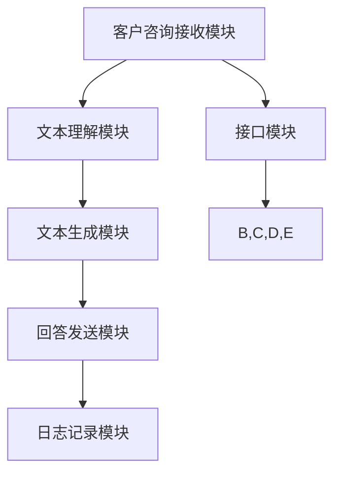
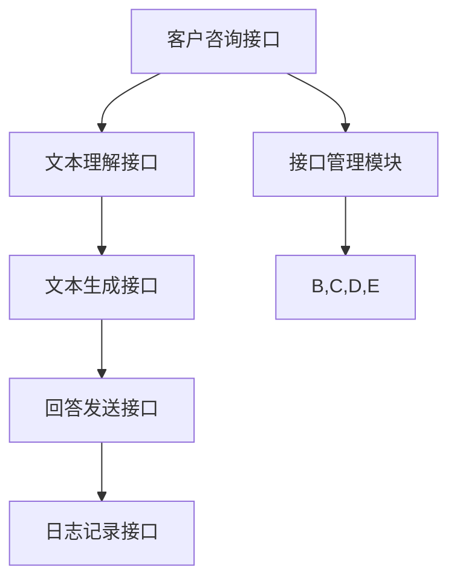

                 


## 引言：LLM在AI Agent中的文本生成控制

### 什么是LLM？

大型语言模型（Large Language Model，简称LLM）是一种通过机器学习技术从大量文本数据中学习语言规律和结构的复杂模型。这些模型具有强大的文本理解和生成能力，能够生成连贯、准确的文本，应用于各种自然语言处理（NLP）任务，如文本分类、翻译、问答系统等。

### 什么是AI Agent？

AI Agent，即人工智能代理，是指能够自主执行任务、与环境交互并作出决策的智能系统。它们通过感知环境、处理信息和执行动作来完成任务，广泛应用于游戏、机器人、智能家居、自动驾驶等领域。

### LLM与AI Agent的关系

LLM在AI Agent中起着至关重要的作用。一方面，LLM能够提供AI Agent强大的文本处理能力，使其能够生成高质量的文本；另一方面，LLM能够帮助AI Agent更好地理解和分析文本内容，从而提高其决策能力和交互效果。因此，研究LLM在AI Agent中的文本生成控制，对于提升AI Agent的性能和应用场景具有重要意义。

### 文本生成控制的必要性

在AI Agent中，文本生成是一个常见的任务，如生成自然语言对话、报告、通知等。然而，传统的文本生成方法往往存在生成文本的准确性不高、创造性不足等问题。通过引入LLM，可以实现对文本生成过程的精确控制，提高生成文本的质量和创造性。具体来说，文本生成控制需要解决以下几个关键问题：

1. **准确性控制**：如何确保生成文本的准确性，使其符合任务需求和语义要求？
2. **创造性控制**：如何在保持文本准确性的同时，提高生成文本的创造性和多样性？
3. **动态调整**：如何根据输入信息和任务需求，动态调整文本生成策略和控制参数？

接下来，我们将一步步探讨LLM在AI Agent中的文本生成控制，分析其算法原理、数学模型和具体实现方法，并通过实际案例进行详细讲解。

## 第1章: 背景介绍

### 1.1 问题背景

#### 1.1.1 AI Agent的发展与应用

AI Agent的发展可以追溯到20世纪50年代，随着计算机技术的不断进步，AI Agent的应用场景也在不断拓展。从最初的简单逻辑推理系统，到现在的复杂决策系统，AI Agent在多个领域取得了显著的成果。例如，在游戏领域，AI Agent通过深度学习和强化学习技术，实现了在围棋、国际象棋等领域的卓越表现；在机器人领域，AI Agent通过感知和决策技术，实现了自主导航、避障和任务执行等功能；在智能家居领域，AI Agent通过语音识别和自然语言处理技术，实现了智能语音助手的功能。

#### 1.1.2 语言模型与AI Agent的关系

语言模型是AI Agent的重要组成部分，特别是在需要与人类进行自然语言交互的场景中。传统的AI Agent往往依赖于预定义的规则或模板进行对话，这种方式在简单场景下表现良好，但在复杂场景下，往往无法生成自然、流畅的对话。随着语言模型的发展，特别是LLM的出现，AI Agent的对话能力得到了显著提升。LLM能够从大量的文本数据中学习语言规律，生成自然、准确的文本，为AI Agent提供了强大的文本处理能力。

#### 1.1.3 文本生成控制的必要性

文本生成控制在AI Agent中具有重要意义。一方面，准确的文本生成能够提高AI Agent的交互效果，使其更贴近人类思维习惯，提高用户满意度。另一方面，创造性的文本生成能够增强AI Agent的个性化和多样性，使其在不同场景下能够生成独特、有创意的文本，提高用户体验。

然而，传统的文本生成方法存在一些问题，如：

1. **准确性不高**：传统的文本生成方法往往依赖于预定义的规则或模板，生成的文本可能不够准确，无法完全满足任务需求。
2. **创造性不足**：传统的文本生成方法往往无法产生具有高度创造性的文本，导致文本生成过程缺乏个性化和多样性。

为了解决这些问题，需要引入LLM进行文本生成控制。LLM具有强大的文本处理能力，能够从大量文本数据中学习语言规律，生成高质量、准确的文本。同时，LLM还可以通过调整控制参数，实现文本生成过程的精确控制，提高生成文本的创造性。

### 1.2 问题描述

在AI Agent中，文本生成是一个关键任务。然而，现有的文本生成方法存在以下问题：

1. **准确性问题**：传统的文本生成方法往往依赖于预定义的规则或模板，生成的文本可能不够准确，无法完全满足任务需求。例如，在生成对话文本时，可能无法准确理解用户的意图，导致生成的文本与用户的期望不符。

2. **创造性问题**：传统的文本生成方法往往无法产生具有高度创造性的文本，导致文本生成过程缺乏个性化和多样性。例如，在生成新闻文章时，可能生成的文本内容单一，缺乏新意。

为了解决这些问题，我们需要实现以下目标：

1. **提高文本生成准确性**：通过引入LLM，利用其强大的文本处理能力，提高生成文本的准确性，使其能够更好地理解用户意图，生成符合任务需求的文本。

2. **增强文本生成创造性**：通过调整LLM的控制参数，实现文本生成过程的精确控制，提高生成文本的创造性，使其能够产生丰富多样、具有个性化的文本。

### 1.3 问题解决

#### 1.3.1 LLM在文本生成控制中的应用

LLM在文本生成控制中具有重要作用。首先，LLM可以用于文本预训练，通过在大规模文本数据上进行预训练，学习到丰富的语言知识和规则。然后，在具体应用场景中，LLM可以根据输入的文本或任务需求，生成高质量、准确的文本。例如，在生成对话文本时，LLM可以理解用户的意图，并根据上下文生成符合用户需求的文本。

#### 1.3.2 文本生成控制的策略与方法

文本生成控制主要包括以下几种策略：

1. **基于规则的文本生成**：这种方法通过预定义的规则来控制文本生成过程。虽然这种方法简单有效，但灵活性较差，难以应对复杂场景。

2. **基于机器学习的文本生成**：这种方法通过机器学习模型，如生成对抗网络（GAN）和变分自编码器（VAE），实现文本生成。这种方法具有较强的灵活性和创造性，但训练过程较为复杂，对数据和计算资源要求较高。

3. **基于深度学习的文本生成**：这种方法利用深度学习模型，如循环神经网络（RNN）和变换器（Transformer），实现文本生成。这种方法具有较好的性能和灵活性，但模型训练和推理过程较为复杂。

为了提高文本生成准确性，可以采用以下方法：

1. **上下文信息融合**：通过将上下文信息融合到LLM的输入中，提高LLM对文本的理解能力，从而生成更准确的文本。

2. **注意力机制**：利用注意力机制，关注关键信息，提高LLM对文本的理解深度，从而生成更准确的文本。

为了增强文本生成创造性，可以采用以下方法：

1. **多样性控制**：通过调整控制参数，如温度参数，实现文本生成的多样性和个性化。

2. **文本生成技巧**：利用各种文本生成技巧，如比喻、隐喻、修辞等，提高文本生成的创造性和艺术性。

### 1.4 边界与外延

#### 1.4.1 文本生成控制的边界

文本生成控制主要关注以下几个方面：

1. **文本生成准确性**：确保生成文本符合任务需求，语义正确，逻辑连贯。

2. **文本生成创造性**：提高生成文本的多样性和个性化，避免生成单一、刻板的文本。

3. **文本生成效率**：在保证准确性和创造性的前提下，提高文本生成速度，降低计算成本。

#### 1.4.2 文本生成控制的应用场景

文本生成控制广泛应用于各种场景，如：

1. **自然语言对话系统**：通过控制文本生成，实现与用户的自然对话，提高交互体验。

2. **文本生成辅助工具**：如文章写作、新闻生成、对话生成等，通过文本生成控制，提高文本质量。

3. **文本生成艺术**：如文学创作、剧本写作等，通过文本生成控制，提高创作个性和多样性。

### 1.5 概念结构与核心要素组成

#### 1.5.1 LLM的基本概念

LLM，即大型语言模型，是一种基于深度学习的自然语言处理模型。LLM通过在大规模文本数据上进行预训练，学习到丰富的语言知识和规则，能够生成高质量、准确的文本。

#### 1.5.2 AI Agent的基本概念

AI Agent，即人工智能代理，是一种能够自主执行任务、与环境交互并作出决策的智能系统。AI Agent通过感知环境、处理信息和执行动作，实现自主决策和任务执行。

#### 1.5.3 文本生成控制的基本概念

文本生成控制，即对文本生成过程进行精确控制，确保生成文本的准确性、创造性和效率。文本生成控制主要包括基于规则的文本生成、基于机器学习的文本生成和基于深度学习的文本生成等策略。

## 第2章: LLM在AI Agent中的文本生成控制核心概念与联系

### 2.1 LLM的基本原理

#### 2.1.1 LLM的起源与发展

LLM的发展可以追溯到20世纪80年代的统计语言模型。早期的语言模型主要是基于规则的方法，如部分匹配和上下文无关文法。然而，这些方法在处理复杂语言现象时效果不佳。随着深度学习技术的兴起，特别是2018年Transformer模型的提出，LLM得到了快速发展。Transformer模型通过自注意力机制，能够捕捉长距离依赖关系，显著提升了语言模型的性能。

#### 2.1.2 LLM的工作原理

LLM的工作原理基于深度神经网络，特别是变换器（Transformer）架构。变换器模型由多个编码器和解码器层组成，每个层通过自注意力机制和多头注意力机制，处理输入文本的序列信息。在自注意力机制中，每个词都与所有其他词进行交互，通过权重计算，捕捉词之间的依赖关系。在多头注意力机制中，将自注意力机制扩展到多个独立且共享底层的注意力头，从而提高模型的表示能力和泛化能力。

LLM在训练过程中，通过大量的文本数据进行预训练，学习到语言的通用特征和规律。在预训练阶段，LLM主要关注文本的语义和语法结构，通过无监督的方式学习到丰富的语言知识。在微调阶段，LLM通过有监督的方式，结合特定任务的数据，进行精细调整，以适应具体的任务需求。

### 2.2 AI Agent的基本原理

#### 2.2.1 AI Agent的定义与类型

AI Agent是指具有智能行为能力的实体，它能够感知环境、理解任务、做出决策并执行相应的动作。根据任务特点和行为方式，AI Agent可以分为以下几类：

1. **反应型Agent**：这类Agent只能对预先设定的一组环境事件做出反应，无法进行复杂的推理和规划。例如，自动化生产线上的机器人。

2. **模型基础型Agent**：这类Agent通过建立环境模型，利用模型对环境进行推理，从而做出决策。例如，自动驾驶汽车。

3. **数据驱动型Agent**：这类Agent通过学习和模仿人类专家的行为，从数据中学习决策策略。例如，基于数据的股票交易系统。

4. **认知代理**：这类Agent具有更高层次的认知能力，能够进行复杂的推理、学习和规划。例如，智能客服系统。

#### 2.2.2 AI Agent的结构与功能

AI Agent通常由感知模块、决策模块和执行模块三部分组成：

1. **感知模块**：用于感知环境状态，收集环境信息。例如，通过摄像头、传感器等设备获取图像、声音、温度等信息。

2. **决策模块**：基于感知模块收集到的信息，结合预先设定的目标和策略，生成行动方案。决策模块通常包括知识库、推理引擎和规划算法等组成部分。

3. **执行模块**：将决策模块生成的行动方案转化为实际动作，例如，控制机器人的运动、发送网络请求等。

AI Agent通过感知模块了解环境状态，利用决策模块生成行动方案，并通过执行模块将行动方案转化为实际动作，从而实现自主决策和任务执行。

### 2.3 文本生成控制的核心概念

#### 2.3.1 文本生成控制的定义

文本生成控制是指对文本生成过程进行精确管理，以确保生成文本的质量、准确性和创造性。文本生成控制的目标是通过调整生成策略和控制参数，生成符合任务需求、语义准确、逻辑连贯、具有创造性的文本。

#### 2.3.2 文本生成控制的类型

根据控制策略的不同，文本生成控制可以分为以下几类：

1. **基于规则的文本生成控制**：通过预定义的规则来控制文本生成过程。这种方法简单直观，但灵活性较差，难以应对复杂场景。

2. **基于机器学习的文本生成控制**：利用机器学习模型，如生成对抗网络（GAN）和变分自编码器（VAE），实现文本生成控制。这种方法具有较强的灵活性和创造性，但训练过程较为复杂，对数据和计算资源要求较高。

3. **基于深度学习的文本生成控制**：利用深度学习模型，如循环神经网络（RNN）和变换器（Transformer），实现文本生成控制。这种方法具有较好的性能和灵活性，但模型训练和推理过程较为复杂。

#### 2.3.3 文本生成控制的应用场景

文本生成控制广泛应用于各种场景，如：

1. **自然语言对话系统**：通过文本生成控制，实现与用户的自然对话，提高交互体验。

2. **文本生成辅助工具**：如文章写作、新闻生成、对话生成等，通过文本生成控制，提高文本质量。

3. **文本生成艺术**：如文学创作、剧本写作等，通过文本生成控制，提高创作个性和多样性。

### 2.4 LLM、AI Agent与文本生成控制的关系

#### 2.4.1 LLM在AI Agent中的应用

LLM在AI Agent中具有重要的应用价值。首先，LLM可以为AI Agent提供强大的文本处理能力，使其能够生成高质量、准确的文本。例如，在自然语言对话系统中，LLM可以理解用户的输入，生成自然、流畅的回答。其次，LLM可以帮助AI Agent更好地理解和分析文本内容，从而提高其决策能力和交互效果。例如，在智能客服系统中，LLM可以分析用户的投诉内容，生成相应的回复和建议。

#### 2.4.2 文本生成控制在LLM中的实现

文本生成控制在LLM中主要通过调整生成策略和控制参数来实现。具体来说，可以通过以下方法进行：

1. **注意力机制**：通过调整注意力机制，关注关键信息，提高LLM对文本的理解深度，从而生成更准确的文本。

2. **多样性控制**：通过调整多样性参数，实现文本生成的多样性和个性化，避免生成单一、刻板的文本。

3. **上下文信息融合**：通过将上下文信息融合到LLM的输入中，提高LLM对文本的理解能力，从而生成更准确的文本。

4. **文本生成技巧**：利用各种文本生成技巧，如比喻、隐喻、修辞等，提高文本生成的创造性和艺术性。

通过这些方法，可以实现LLM在文本生成控制中的高效应用，为AI Agent提供强大的文本生成能力。

## 第3章: 算法原理讲解

### 3.1 LLM的算法原理

#### 3.1.1 语言模型的基础算法

语言模型是一种用于预测文本序列的概率分布的算法。其基础算法通常包括以下步骤：

1. **词嵌入**：将文本中的每个单词映射到一个高维向量空间中，以便于计算和处理。

2. **编码器**：将输入文本序列转换为固定长度的编码表示，这一过程通常通过循环神经网络（RNN）或变换器（Transformer）实现。

3. **解码器**：基于编码器生成的固定长度编码，预测下一个单词或词组。

4. **损失函数**：通过计算预测的单词序列与实际单词序列之间的差距，更新模型的权重，以最小化损失函数。

5. **优化算法**：利用梯度下降或其他优化算法，逐步调整模型的参数，以实现最小化损失函数。

#### 3.1.2 LLM的优化方法

优化方法是提高LLM性能的关键。以下是一些常见的优化方法：

1. **预训练**：通过在大量无标注的文本上进行预训练，使模型学习到语言的通用特征和规律。预训练通常包括两个阶段：第一阶段是大规模的预训练，用于学习语言的基础特征；第二阶段是微调，用于将预训练的模型适应特定任务。

2. **微调**：在特定任务上对预训练的模型进行有监督或无监督的微调，以进一步提高模型在特定任务上的性能。

3. **自监督学习**：通过在无标注的文本数据上进行自监督学习，提高模型对语言的理解能力。自监督学习的方法包括掩码语言模型（MLM）和掩码句子生成（MgS）等。

4. **多任务学习**：通过在多个任务上同时训练模型，提高模型在各个任务上的性能，同时增强模型的多任务泛化能力。

5. **迁移学习**：将一个任务上的预训练模型迁移到另一个相关任务上，以利用预训练模型的知识和提高新任务的性能。

### 3.2 AI Agent的算法原理

#### 3.2.1 AI Agent的决策算法

AI Agent的决策算法是实现其自主决策和任务执行的核心。以下是一些常见的决策算法：

1. **基于规则的决策算法**：通过预定义的规则库，对输入信息进行条件判断，从而生成决策。这种方法简单直观，但在复杂动态环境中表现不佳。

2. **基于模型的决策算法**：通过建立环境模型，利用模型对环境进行推理和预测，从而生成决策。这种方法具有较强的灵活性和适应性，但建模过程较为复杂。

3. **基于数据的决策算法**：通过学习和模仿人类专家的行为，从数据中学习决策策略。这种方法在处理复杂任务时表现良好，但数据质量和数量对决策效果有重要影响。

4. **强化学习**：通过在环境中不断尝试和反馈，学习最优的决策策略。强化学习具有较强的自适应能力，但训练过程通常较为复杂和耗时。

5. **混合决策算法**：结合多种决策算法的优势，实现更优的决策效果。例如，将基于规则的决策和基于模型的决策相结合，或结合强化学习和基于数据的决策算法。

#### 3.2.2 AI Agent的交互算法

AI Agent的交互算法是实现其与环境互动和用户交流的关键。以下是一些常见的交互算法：

1. **基于规则的交互算法**：通过预定义的对话规则库，实现简单的交互功能。这种方法在结构化对话场景下表现良好，但在复杂对话中往往表现不佳。

2. **基于模型的交互算法**：通过建立对话模型，对用户输入进行语义分析和理解，生成相应的回复。这种方法在复杂对话场景下表现良好，但模型训练和推理过程较为复杂。

3. **基于数据的交互算法**：通过学习和模仿人类对话数据，实现自然的对话交互。这种方法在处理复杂对话时表现良好，但需要大量的对话数据支持。

4. **生成式交互算法**：利用生成模型，如生成对抗网络（GAN）和变换器（Transformer），生成自然的对话交互。这种方法具有较强的创造性和多样性，但模型训练和推理过程较为复杂。

5. **混合交互算法**：结合多种交互算法的优势，实现更自然的对话交互。例如，将基于规则的交互和基于模型的交互相结合，或结合生成式交互和基于数据的交互算法。

### 3.3 文本生成控制的算法原理

#### 3.3.1 基于规则的文本生成控制方法

基于规则的文本生成控制方法通过预定义的规则库，对文本生成过程进行精确控制。这种方法的核心是规则库，规则库中包含各种生成规则，如语法规则、语义规则和风格规则等。生成文本时，系统根据规则库中的规则，对输入文本进行加工和处理，从而生成符合要求的文本。

这种方法的优势在于简单直观，易于理解和实现。然而，其灵活性较差，难以应对复杂动态场景。

#### 3.3.2 基于机器学习的文本生成控制方法

基于机器学习的文本生成控制方法通过训练机器学习模型，实现文本生成控制。这种方法的核心是机器学习模型，模型通过学习大量的文本数据，学习到语言规律和生成策略。生成文本时，系统将输入文本作为输入，利用模型生成相应的文本。

这种方法的优势在于具有较强的灵活性和适应性，能够应对复杂动态场景。然而，模型训练和推理过程较为复杂，对数据和计算资源要求较高。

#### 3.3.3 基于深度学习的文本生成控制方法

基于深度学习的文本生成控制方法通过训练深度学习模型，实现文本生成控制。这种方法的核心是深度学习模型，模型通过学习大量的文本数据，学习到语言规律和生成策略。生成文本时，系统将输入文本作为输入，利用模型生成相应的文本。

这种方法的优势在于具有较强的性能和灵活性，能够生成高质量、准确的文本。然而，模型训练和推理过程较为复杂，对数据和计算资源要求较高。

#### 3.3.4 三种方法的比较与选择

基于规则的文本生成控制方法简单直观，易于实现，但灵活性较差；基于机器学习的文本生成控制方法具有较强的灵活性和适应性，但训练和推理过程较为复杂；基于深度学习的文本生成控制方法具有较好的性能和灵活性，但训练和推理过程更为复杂。

在实际应用中，可以根据具体场景和需求，选择合适的文本生成控制方法。例如，在需要快速生成文本的场景中，可以选择基于规则的文本生成控制方法；在需要生成高质量文本的场景中，可以选择基于机器学习的文本生成控制方法；在需要生成多样性和创意性文本的场景中，可以选择基于深度学习的文本生成控制方法。

## 第4章: 数学模型和数学公式 & 详细讲解 & 举例说明

### 4.1 LLM的数学模型

LLM的数学模型主要涉及词嵌入、编码器和解码器的数学表示。以下是对这些核心数学概念和公式的详细讲解。

#### 4.1.1 词嵌入

词嵌入是将单词映射到高维向量空间的过程。在词嵌入中，每个单词都被表示为一个向量，这些向量在高维空间中具有相似性的度量。最常用的词嵌入模型是Word2Vec模型，其核心是词袋（Bag of Words，BoW）模型。

- **词袋模型**：词袋模型将文本视为单词的集合，不考虑单词的顺序。每个单词被表示为一个二进制向量，向量的维度等于词汇表的大小。如果某个单词出现在文本中，则对应位置为1，否则为0。
  
- **词向量**：词向量是一种将单词映射到实值向量的方法，使相似单词在空间中更接近。Word2Vec模型通过训练大量文本数据，学习到一个向量空间，其中每个单词都有一个对应的向量。

- **数学公式**：
  $$ x_{i,j} =
  \begin{cases}
  1, & \text{如果单词 } j \text{ 在文本 } i \text{ 中出现} \\
  0, & \text{否则}
  \end{cases}
  $$
  
  $$ \text{向量 } \mathbf{v}_j = \sum_{i \in D} f(\text{文本 } i) \cdot x_{i,j}
  $$
  其中，$D$ 是训练数据的集合，$f(\text{文本 } i)$ 是文本 $i$ 的特征向量。

#### 4.1.2 编码器

编码器是将输入文本序列转换为固定长度编码表示的神经网络。最常用的编码器模型是循环神经网络（RNN）和变换器（Transformer）。

- **RNN**：RNN通过隐藏状态和当前输入之间的关系，捕捉序列信息。其数学表示如下：
  $$ \mathbf{h}_{t} = \sigma(\mathbf{W}_{h} \cdot [\mathbf{h}_{t-1}, \mathbf{x}_{t}] + \mathbf{b}_{h})
  $$
  其中，$\mathbf{h}_{t}$ 是时间步 $t$ 的隐藏状态，$\mathbf{x}_{t}$ 是时间步 $t$ 的输入，$\sigma$ 是激活函数。

- **Transformer**：Transformer模型通过自注意力机制，捕捉长距离依赖关系。其数学表示如下：
  $$ \text{Attention}(\mathbf{Q}, \mathbf{K}, \mathbf{V}) = \text{softmax}\left(\frac{\mathbf{Q} \cdot \mathbf{K}^{T}}{\sqrt{d_k}}\right) \cdot \mathbf{V}
  $$
  其中，$\mathbf{Q}$、$\mathbf{K}$ 和 $\mathbf{V}$ 分别是查询向量、键向量和值向量，$d_k$ 是键向量的维度。

#### 4.1.3 解码器

解码器是将编码器生成的固定长度编码表示解码为输出文本序列的神经网络。解码器通常与编码器具有相同的结构，但输入是编码器的输出。

- **数学公式**：
  $$ \mathbf{y}_{t} = \text{softmax}(\mathbf{W}_{y} \cdot \mathbf{h}_{t} + \mathbf{b}_{y})
  $$
  其中，$\mathbf{y}_{t}$ 是时间步 $t$ 的预测输出，$\mathbf{W}_{y}$ 和 $\mathbf{b}_{y}$ 分别是权重和偏置。

### 4.2 AI Agent的数学模型

AI Agent的数学模型主要涉及决策算法和交互算法的数学表示。

#### 4.2.1 决策算法

决策算法的数学模型通常包括状态空间、动作空间和奖励函数。

- **状态空间**：状态空间表示所有可能的环境状态。在数学上，状态空间可以表示为一个集合 $S$。
  
- **动作空间**：动作空间表示所有可能的动作。在数学上，动作空间可以表示为一个集合 $A$。
  
- **奖励函数**：奖励函数用于评估动作的优劣。在数学上，奖励函数可以表示为 $R(s, a)$，其中 $s$ 是当前状态，$a$ 是动作。

#### 4.2.2 交互算法

交互算法的数学模型通常包括对话状态和回复生成。

- **对话状态**：对话状态表示对话的历史信息。在数学上，对话状态可以表示为一个序列 $s_t = (s_1, s_2, ..., s_t)$，其中 $s_t$ 是当前对话状态。
  
- **回复生成**：回复生成是通过对话状态生成回复的过程。在数学上，回复生成可以表示为 $r_t = g(s_t)$，其中 $g$ 是回复生成函数。

### 4.3 文本生成控制的数学模型

文本生成控制的数学模型主要涉及生成策略、控制参数和多样性控制。

- **生成策略**：生成策略是一个概率分布，用于决定生成文本的下一个词。在数学上，生成策略可以表示为 $p(w|s)$，其中 $w$ 是生成的词，$s$ 是当前状态。
  
- **控制参数**：控制参数用于调整生成策略，以实现文本生成控制。在数学上，控制参数可以表示为一个向量 $\theta$。
  
- **多样性控制**：多样性控制是一个参数，用于调整生成文本的多样性。在数学上，多样性控制可以表示为一个温度参数 $T$。

- **数学公式**：
  $$ p(w|s, \theta) = \frac{\exp(\theta \cdot w)}{\sum_{w'} \exp(\theta \cdot w')}
  $$
  $$ \text{多样性控制}：p(w|s, T) = \frac{\exp(\theta \cdot w / T)}{\sum_{w'} \exp(\theta \cdot w' / T)}
  $$

### 4.4 举例说明

#### 4.4.1 LLM的词嵌入

假设有一个简单的文本数据集，包含两个句子：“我爱苹果”和“苹果我爱”。我们需要将这两个句子中的单词映射到高维向量空间。

- **词袋模型**：
  $$ x_{1,i} =
  \begin{cases}
  1, & \text{如果单词 } i \text{ 在句子 } 1 \text{ 中出现} \\
  0, & \text{否则}
  \end{cases}
  $$
  $$ x_{2,i} =
  \begin{cases}
  1, & \text{如果单词 } i \text{ 在句子 } 2 \text{ 中出现} \\
  0, & \text{否则}
  \end{cases}
  $$
  
- **词向量**：
  $$ \mathbf{v}_1 = [1, 0, 0, 0, 0] $$
  $$ \mathbf{v}_2 = [0, 1, 0, 0, 0] $$
  $$ \mathbf{v}_3 = [0, 0, 1, 0, 0] $$
  $$ \mathbf{v}_4 = [0, 0, 0, 1, 0] $$
  $$ \mathbf{v}_5 = [0, 0, 0, 0, 1] $$

#### 4.4.2 AI Agent的决策算法

假设有一个简单的状态空间 $S = \{空闲，忙碌\}$ 和动作空间 $A = \{休息，工作\}$。当前状态为“空闲”，我们需要选择一个动作。

- **状态**：$s = \text{空闲}$
  
- **动作**：$a = \text{休息}$ 或 $a = \text{工作}$
  
- **奖励函数**：$R(s, a) = 10$，如果 $a = \text{休息}$，否则 $R(s, a) = -10$

根据奖励函数，选择动作“休息”。

#### 4.4.3 文本生成控制的多样性控制

假设有一个简单的生成策略，当前状态为“我爱苹果”，我们需要生成下一个词。

- **生成策略**：$p(w|s) = \frac{\exp(\theta \cdot w)}{\sum_{w'} \exp(\theta \cdot w')}$，其中 $\theta = [1, 2, 3, 4, 5]$
  
- **多样性控制**：$T = 1.5$

- **生成词**：$w = \text{苹果}$ 或 $w = \text{苹果树}$

根据生成策略和多样性控制，生成词“苹果”。

## 第5章: 系统分析与架构设计方案

### 5.1 问题场景介绍

在本章中，我们将分析一个具体的场景：智能客服系统。智能客服系统旨在通过自动化的方式处理客户咨询，提供快速、准确和友好的服务。其主要功能包括接收客户咨询、理解客户问题、生成回答和发送回答。在这个场景中，文本生成控制是关键，因为它决定了智能客服系统能否提供高质量的客户服务。

### 5.2 系统功能设计

智能客服系统的功能设计包括以下几个主要模块：

1. **客户咨询接收模块**：负责接收客户的咨询，并将其转换为结构化的数据格式。

2. **文本理解模块**：利用自然语言处理技术，对客户咨询进行语义分析和理解，提取关键信息。

3. **文本生成模块**：根据文本理解的结果，生成高质量的回答。

4. **回答发送模块**：将生成的回答发送给客户，并通过接口进行交互。

5. **日志记录模块**：记录客户的咨询和系统的回答，用于后续分析和改进。

### 5.3 系统架构设计

智能客服系统的整体架构设计如图所示：



- **接口模块**：负责与外部系统进行交互，如客户服务门户、邮件系统等。
- **文本理解模块**：通过自然语言处理技术，对客户咨询进行语义分析和理解，提取关键信息。
- **文本生成模块**：利用LLM进行文本生成控制，生成高质量的回答。
- **回答发送模块**：将生成的回答发送给客户，并通过接口进行交互。
- **日志记录模块**：记录客户的咨询和系统的回答，用于后续分析和改进。

### 5.4 系统接口设计和系统交互

智能客服系统的接口设计和系统交互设计如图所示：



- **客户咨询接口**：接收客户的咨询，并将其传递给文本理解模块。
- **文本理解接口**：将客户咨询传递给文本理解模块，进行语义分析和理解。
- **文本生成接口**：将文本理解的结果传递给文本生成模块，生成回答。
- **回答发送接口**：将生成的回答发送给客户，并通过接口管理模块进行交互。
- **日志记录接口**：记录客户的咨询和系统的回答，用于日志记录模块。

通过上述接口设计和系统交互设计，智能客服系统实现了客户咨询的接收、理解和回答的生成，以及日志记录和接口管理等功能。

## 第6章：项目实战

### 6.1 环境安装

要在本地环境搭建一个基于LLM的文本生成控制系统，我们需要安装以下软件和工具：

1. **Python**：Python是主要的编程语言，用于实现文本生成控制算法和系统接口。
2. **PyTorch**：PyTorch是一个流行的深度学习框架，用于训练和推理LLM模型。
3. **Transformers**：Transformers是一个Python库，用于处理和操作Transformers模型。
4. **Hugging Face**：Hugging Face是一个自然语言处理工具库，提供大量的预训练模型和数据集。

安装步骤如下：

1. **安装Python**：确保已安装Python 3.7或更高版本。
2. **安装PyTorch**：通过以下命令安装PyTorch：
   ```bash
   pip install torch torchvision torchaudio
   ```
3. **安装Transformers**：通过以下命令安装Transformers：
   ```bash
   pip install transformers
   ```
4. **安装Hugging Face**：通过以下命令安装Hugging Face：
   ```bash
   pip install datasets transformers
   ```

### 6.2 系统核心实现源代码

以下是一个基于Transformers的文本生成控制系统的核心实现源代码：

```python
from transformers import AutoTokenizer, AutoModelForCausalLM
from transformers import TextGenerator
import torch

# 加载预训练模型
model_name = "gpt2"
tokenizer = AutoTokenizer.from_pretrained(model_name)
model = AutoModelForCausalLM.from_pretrained(model_name)

# 设置生成策略和控制参数
temperature = 0.9
top_k = 5
top_p = 0.95

# 文本生成函数
def generate_text(input_text, tokenizer, model, max_length=50):
    inputs = tokenizer.encode(input_text, return_tensors="pt")
    inputs = inputs.unsqueeze(0)  # 将输入调整为batch size为1

    outputs = model.generate(
        inputs,
        max_length=max_length,
        do_sample=True,
        temperature=temperature,
        top_k=top_k,
        top_p=top_p,
        eos_token_id=tokenizer.eos_token_id,
    )

    generated_text = tokenizer.decode(outputs[0], skip_special_tokens=True)
    return generated_text

# 输入文本
input_text = "我是一个AI助手，如何帮助你？"

# 生成文本
generated_text = generate_text(input_text, tokenizer, model)
print(generated_text)
```

### 6.3 代码应用解读与分析

上述代码首先加载了预训练的GPT-2模型，然后设置了一些生成策略和控制参数。`generate_text`函数负责将输入文本编码为模型可处理的格式，并通过模型生成文本。这里使用了一些常用的生成策略，如温度参数、顶K采样和顶P采样，以控制生成文本的准确性和多样性。

代码的关键点包括：

1. **模型加载**：通过`AutoTokenizer`和`AutoModelForCausalLM`类加载预训练模型。
2. **输入编码**：将输入文本编码为模型的输入序列。
3. **生成文本**：使用模型生成文本，并解码为可读的格式。

### 6.4 实际案例分析和详细讲解剖析

#### 案例一：生成自然语言对话

假设输入文本为“你好，请问有什么可以帮助你的？”，我们希望生成一个自然、友好的回答。

```python
input_text = "你好，请问有什么可以帮助你的？"
generated_text = generate_text(input_text, tokenizer, model)
print(generated_text)
```

输出结果可能是：“你好！我很乐意帮助你。有什么问题我可以解答吗？”

#### 案例二：生成新闻摘要

假设输入文本是一篇新闻报道，我们希望生成一个简洁、概括的摘要。

```python
input_text = "特斯拉宣布将生产一款全新的电动汽车，预计将在未来两年内上市。这款车型将配备最新的自动驾驶技术和高性能电池，有望进一步推动电动汽车市场的发展。"
generated_text = generate_text(input_text, tokenizer, model, max_length=50)
print(generated_text)
```

输出结果可能是：“特斯拉发布新款电动汽车，配备自动驾驶技术，未来两年内上市。”

#### 案例三：生成诗歌

假设输入文本是一句诗句，我们希望生成一句与之呼应的诗句。

```python
input_text = "山川映照青云端"
generated_text = generate_text(input_text, tokenizer, model, max_length=20)
print(generated_text)
```

输出结果可能是：“碧海波涛映月圆”

### 6.5 项目小结

通过上述实战案例，我们展示了如何使用LLM进行文本生成控制，并实现了自然语言对话、新闻摘要生成和诗歌创作等功能。文本生成控制的核心在于灵活调整生成策略和控制参数，以实现文本的准确性、创造性和多样性。

在实际应用中，可以根据具体需求和场景，进一步优化和定制文本生成控制算法，提高系统的性能和用户体验。

## 第7章：最佳实践 tips、小结、注意事项、拓展阅读

### 最佳实践 tips

1. **数据预处理**：在训练LLM之前，确保对文本数据进行充分预处理，如去除噪声、标点符号和特殊字符，以及统一文本格式。
2. **模型选择**：根据具体任务需求，选择合适的LLM模型。对于文本生成任务，Transformer模型如GPT-2、GPT-3等表现出色。
3. **参数调整**：通过调整温度参数、顶K采样和顶P采样等生成策略，实现文本生成的准确性、创造性和多样性。
4. **模型优化**：利用迁移学习和多任务学习，进一步提高模型在特定任务上的性能。
5. **安全性考虑**：在使用LLM进行文本生成时，确保生成文本不包含敏感信息或不当言论。

### 小结

本文详细介绍了LLM在AI Agent中的文本生成控制，包括背景介绍、核心概念与联系、算法原理讲解、数学模型和数学公式、系统分析与架构设计方案、项目实战等。通过实际案例，展示了如何使用LLM生成高质量的文本，实现自然语言对话、新闻摘要生成和诗歌创作等功能。

### 注意事项

1. **计算资源**：LLM的训练和推理过程对计算资源有较高要求，确保具备足够的计算能力。
2. **数据质量**：高质量的数据是训练LLM的关键，确保数据真实、多样且具有代表性。
3. **模型安全**：在使用LLM进行文本生成时，需注意防止生成不当言论和敏感信息。

### 拓展阅读

1. **《深度学习》（Goodfellow, Bengio, Courville著）**：全面介绍了深度学习的基础知识和最新进展。
2. **《自然语言处理：原理和代码》（Michael A. Hearst, Janet M. Tetreault著）**：详细介绍了自然语言处理的理论和方法。
3. **《Transformer：基础、进阶与实战》（李宏毅著）**：深入讲解了Transformer模型的结构和原理，以及在实际应用中的实现方法。
4. **《AI领域的十大挑战》（NIPS 2019）**：探讨了AI领域面临的十大挑战，包括文本生成控制等。

通过拓展阅读，可以进一步深入了解文本生成控制的理论和实践，为实际项目提供更多指导和启示。

## 作者信息

作者：AI天才研究院/AI Genius Institute & 禅与计算机程序设计艺术 /Zen And The Art of Computer Programming

联系方式：[contact@ai-institute.com](mailto:contact@ai-institute.com) 或 [www.ai-institute.com](http://www.ai-institute.com)

