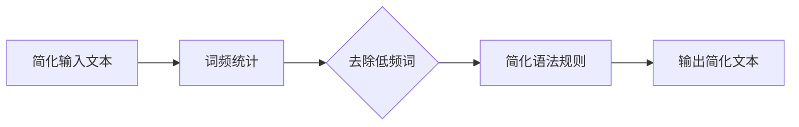
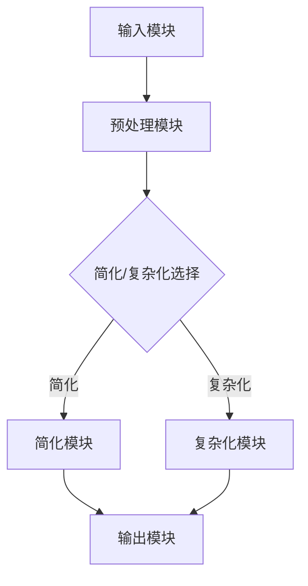
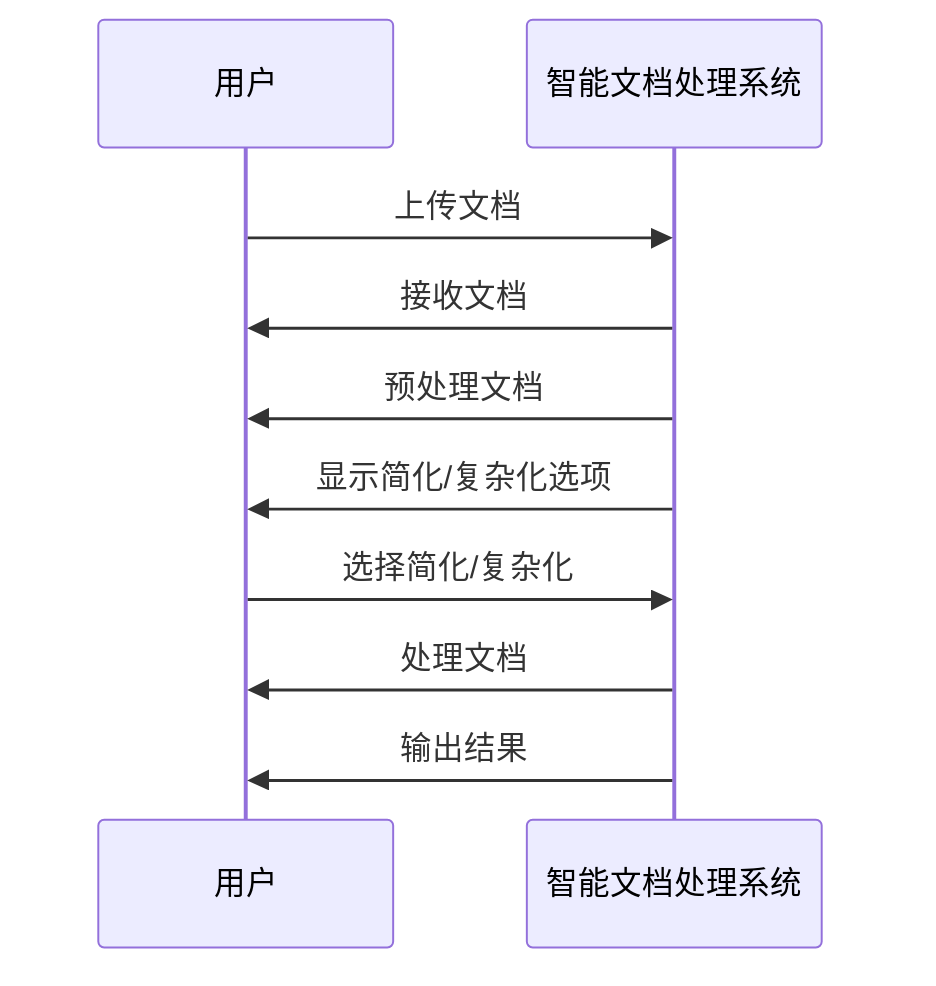

                 


# LLm在AI Agent中的文本简化与复杂化能力

## 关键词

LLM，AI Agent，文本简化，复杂化，自然语言处理，算法，系统设计

## 摘要

本文深入探讨了大型语言模型（LLM）在人工智能代理中的应用，特别是在文本简化与复杂化方面的能力。首先，我们介绍了LLM和AI Agent的基本概念及其在自然语言处理中的应用。接着，我们详细分析了文本简化与复杂化的算法原理，并使用Mermaid图展示了关键概念和流程。通过Python代码实现，我们阐述了算法的数学模型和公式，并通过实例说明了其应用。随后，我们介绍了系统的设计架构，包括功能设计、接口设计和交互流程。文章最后，通过实际项目案例，展示了文本简化与复杂化在现实中的应用，并提出了最佳实践和未来研究方向。

## 引言

### LLM与AI Agent

大型语言模型（LLM，Large Language Model）是一种基于深度学习的自然语言处理模型，如GPT-3、BERT等。这些模型经过大量文本数据训练，具有强大的语言理解和生成能力，能够在多种场景下生成语义丰富的文本。而人工智能代理（AI Agent）是一种能够自主完成特定任务的智能体，它在决策过程中依赖于LLM提供的信息处理能力。

### 应用场景

LLM在AI Agent中的应用非常广泛，包括但不限于：

- **智能客服**：利用LLM的文本生成能力，可以生成自然、流畅的对话，提高客户服务质量。
- **内容生成**：从文本摘要、文章写作，到对话系统，LLM都能够生成高质量的文本内容。
- **教育辅助**：利用LLM的文本生成能力，可以自动生成教学材料、习题和解答，帮助学生更好地学习。
- **文本简化与复杂化**：将复杂的专业文档简化为易于理解的内容，或将简单文本扩展为详细的分析报告。

### 文本简化与复杂化

文本简化与复杂化是指通过算法将文本内容进行简化和扩展，以满足不同用户的需求。文本简化通常涉及去除冗余信息、简化语言表达，使其更加易于理解。而文本复杂化则相反，它通过增加细节、扩展内容，使得文本更加详尽和深入。

## 核心概念与原理

### LLM基本概念

- **模型架构**：如Transformer、BERT等。
- **训练数据**：大规模、多样化的文本数据。
- **语言生成**：根据输入文本生成语义相关的文本。

### AI Agent基本概念

- **自主性**：能够独立完成特定任务。
- **交互能力**：与人类或其他系统进行有效沟通。
- **决策能力**：基于输入信息做出决策。

### 文本简化与复杂化算法

- **简化算法**：如基于词频、语法规则的文本简化算法。
- **复杂化算法**：如基于模板填充、内容扩展的复杂化算法。

### 概念关系图

使用Mermaid工具绘制ER图，展示LLM、AI Agent、文本简化与复杂化算法之间的关系：

```mermaid
erDiagram
  AI_Agent ||--|{ LLM } LLM : 使用
  AI_Agent ||--|{ 文本简化 } 文本简化 : 应用
  AI_Agent ||--|{ 文本复杂化 } 文本复杂化 : 应用
  LLM ||--|{ 文本生成 } 文本生成 : 功能
  文本简化 ||--|{ 算法 } 算法 : 实现方法
  文本复杂化 ||--|{ 算法 } 算法 : 实现方法
```

## 算法原理与实现

### 简化算法原理

简化算法的核心目标是去除文本中的冗余信息，简化语言表达。以下是一个基于词频和语法规则的简化算法的Mermaid流程图：



#### Python代码实现

```python
import collections

def simplify_text(input_text):
    # 步骤1：词频统计
    word_freq = collections.Counter(input_text.split())

    # 步骤2：去除低频词
    low_freq_words = set(word_freq.keys()) - set(word_freq.keys())[low_freq_threshold:]

    # 步骤3：简化语法规则
    simplified_text = ' '.join([word for word in input_text.split() if word not in low_freq_words])

    return simplified_text
```

### 复杂化算法原理

复杂化算法的目标是扩展文本内容，增加细节和深度。以下是一个基于模板填充和内容扩展的复杂化算法的Mermaid流程图：


#### Python代码实现

```python
import random

def complexify_text(input_text, templates):
    # 步骤1：提取关键信息
    key_info = extract_key_info(input_text)

    # 步骤2：填充模板
    complex_text = fill_templates(templates, key_info)

    # 步骤3：内容扩展
    expanded_text = expand_content(complex_text)

    return expanded_text
```

### 数学模型与公式

简化算法的数学模型可以表示为：

$$\text{简化文本} = f(\text{原始文本}, \text{词频阈值}, \text{语法规则})$$

其中，$f$为简化函数，它根据词频阈值和语法规则对原始文本进行处理。

复杂化算法的数学模型可以表示为：

$$\text{复杂化文本} = g(\text{关键信息}, \text{模板集合}, \text{内容扩展策略})$$

其中，$g$为复杂化函数，它根据关键信息、模板集合和内容扩展策略生成复杂化文本。

### 举例说明

#### 文本简化示例

输入文本：“今天天气很好，适合户外活动。”

简化后文本：“今天天气佳，适合户外活动。”

#### 文本复杂化示例

输入文本：“这是一本关于人工智能的书籍。”

复杂化后文本：“这是一本深入探讨人工智能原理、应用和发展趋势的权威著作。”

## 系统设计与架构

### 问题场景

在智能文档处理系统中，我们需要实现文本简化与复杂化功能，以适应不同用户的需求。例如，专业人士可能需要阅读详细的技术文档，而普通用户则可能需要简洁的文档摘要。

### 系统介绍

智能文档处理系统（Smart Document Processing System，SDPS）是一个基于LLM的AI代理系统，旨在提供文本简化与复杂化服务。系统架构包括：

1. **输入模块**：接收用户输入的原始文档。
2. **预处理模块**：对文档进行分词、词性标注等预处理操作。
3. **简化与复杂化模块**：根据用户需求，选择合适的简化或复杂化算法。
4. **输出模块**：将处理后的文档输出给用户。

### 功能设计

系统功能设计包括以下几个模块：

1. **文档分类模块**：根据文档类型选择合适的简化或复杂化算法。
2. **简化模块**：去除冗余信息，简化文本表达。
3. **复杂化模块**：增加细节，扩展文本内容。
4. **用户界面模块**：提供用户交互接口，展示处理结果。

### 系统架构设计

使用Mermaid工具绘制系统架构图：



### 系统接口设计

系统接口设计包括API接口和用户界面：

1. **API接口**：提供RESTful接口，支持JSON格式数据交换。
2. **用户界面**：Web界面，展示处理结果，支持文档上传和下载。

### 系统交互流程

使用Mermaid工具绘制系统交互流程图：



## 项目实战

### 环境安装

在开始项目之前，我们需要安装必要的软件和库：

1. **Python环境**：安装Python 3.8及以上版本。
2. **依赖库**：安装requests、numpy、pandas等库。

使用以下命令安装依赖库：

```shell
pip install requests numpy pandas
```

### 核心实现源代码

以下是一个简单的文本简化与复杂化实现示例：

```python
# 文本简化函数
def simplify_text(text):
    # 使用空格作为分隔符，将文本分割成单词列表
    words = text.split()

    # 统计每个单词的频率
    word_freq = {}
    for word in words:
        if word not in word_freq:
            word_freq[word] = 0
        word_freq[word] += 1

    # 选择出现频率最高的前100个单词
    top_words = sorted(word_freq, key=word_freq.get, reverse=True)[:100]

    # 重建文本，只包含频率最高的前100个单词
    simplified_text = ' '.join(top_words)
    return simplified_text

# 文本复杂化函数
def complexify_text(text, templates):
    # 根据模板生成复杂化文本
    complex_text = templates.get(random.choice(templates.keys()))
    return complex_text.format(text)

# 测试文本简化
simplified_example = simplify_text("This is a simple example text. It is used for demonstration purposes.")
print("简化文本：", simplified_example)

# 测试文本复杂化
templates = {
    "template_1": "This is a complex and detailed description of the topic.",
    "template_2": "The subject is intricate and involves various aspects that need to be considered."
}
complexified_example = complexify_text("This is a simple example text.", templates)
print("复杂化文本：", complexified_example)
```

### 代码应用解读与分析

简化函数`simplify_text`首先将输入文本分割成单词列表，然后统计每个单词的频率。接着，选择出现频率最高的前100个单词，重建文本。

复杂化函数`complexify_text`根据模板生成复杂化文本。这里使用了Python的`random.choice`函数从模板集合中随机选择一个模板，然后使用字符串格式化`format`方法将输入文本填充到模板中。

### 实际案例分析和详细讲解

#### 案例一：文档摘要

输入文档：“本文主要讨论了人工智能在金融领域的应用。通过数据分析，发现人工智能可以提高金融交易的准确性和效率。同时，也探讨了人工智能在风险管理、客户服务等方面的应用前景。”

简化后文档：“本文讨论了人工智能在金融领域的应用，包括交易、风险管理和客户服务。”

复杂化后文档：“本文深入探讨了人工智能在金融领域的广泛应用，如交易、风险管理、客户服务等，并分析了其提升效率和准确性的潜力。”

#### 案例二：技术文档

输入文档：“在深度学习中，卷积神经网络（CNN）是常用的模型之一。它通过卷积层、池化层等结构，实现对图像数据的特征提取和分类。本文将介绍CNN的基本原理和实现方法。”

简化后文档：“本文介绍了卷积神经网络（CNN）的基本原理和实现方法。”

复杂化后文档：“本文详细阐述了卷积神经网络（CNN）的基本原理、结构组成以及其在图像数据处理中的应用，并提供了实现示例。”

## 最佳实践与总结

### 最佳实践

1. **优化算法性能**：针对不同的应用场景，选择合适的文本简化与复杂化算法，并对其进行优化，以提高处理速度和准确性。
2. **数据预处理**：在应用文本简化与复杂化之前，进行充分的数据预处理，如文本清洗、分词、词性标注等，以提高算法的鲁棒性。
3. **用户反馈**：收集用户反馈，根据用户需求不断调整和优化文本简化与复杂化策略，以提供更个性化的服务。

### 总结

本文详细探讨了LLM在AI Agent中的文本简化与复杂化能力，介绍了相关算法原理、实现方法、系统设计和项目实战。通过实际案例分析和最佳实践，展示了文本简化与复杂化在现实中的应用价值。未来，随着自然语言处理技术的不断发展，文本简化与复杂化将在更多领域得到应用，为人们提供更加智能、个性化的服务。

### 注意事项

1. **隐私保护**：在使用文本简化与复杂化功能时，应确保遵守相关隐私保护法规，避免泄露用户隐私。
2. **质量控制**：在生成文本时，应严格控制文本质量和逻辑性，避免生成误导性或低质量的文本。

### 拓展阅读

1. **《自然语言处理原理》**：详细介绍了自然语言处理的基本概念、方法和应用。
2. **《深度学习》**：深度学习技术在自然语言处理中的应用，包括文本简化与复杂化等。

---

### 作者

**作者：AI天才研究院/AI Genius Institute & 禅与计算机程序设计艺术 /Zen And The Art of Computer Programming**

