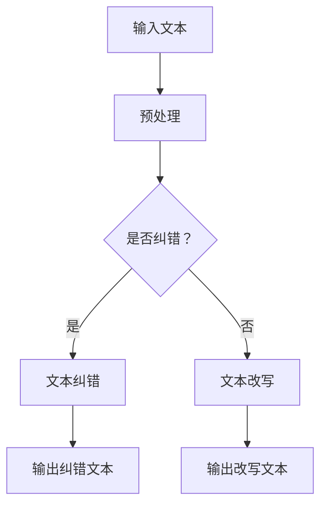

                 


# LLM在AI Agent中的文本纠错与改写应用

## 关键词
- 大型语言模型（LLM）
- 文本纠错
- 文本改写
- AI Agent
- 自然语言处理（NLP）

## 摘要
本文深入探讨了大型语言模型（LLM）在人工智能代理（AI Agent）中的文本纠错与改写应用。首先介绍了LLM的基本概念、发展历程和在AI代理中的作用。接着，分析了文本纠错与改写的原理，并通过实际案例展示了LLM在这些任务中的应用效果。随后，探讨了LLM在文本纠错与改写过程中可能遇到的问题和挑战，并提出了相应的解决方案。最后，通过具体项目实战，展示了如何实现LLM的文本纠错与改写功能，并提供了一些建议和总结。

## 引言

随着人工智能技术的飞速发展，人工智能代理（AI Agent）在各个领域得到了广泛应用。AI Agent需要具备与人类进行有效交互的能力，而文本纠错与改写是实现这一目标的关键技术之一。文本纠错旨在识别和纠正文本中的错误，以提高文本的准确性和可读性；文本改写则是对文本进行重新表达，使其更符合特定需求或风格。本文将探讨大型语言模型（LLM）在AI Agent中的文本纠错与改写应用，以提升AI Agent的交互质量和用户体验。

### 第1章: LLM基本概念与背景

## 1.1 大型语言模型（LLM）的定义

大型语言模型（LLM，Large Language Model）是一种基于深度学习技术的自然语言处理模型，它通过训练大量的文本数据，学习到语言的复杂结构和模式，从而能够对输入的文本进行理解和生成。LLM具有以下特点：

1. **高容量**：LLM可以处理大量数据，从而学习到丰富的语言知识。
2. **强理解力**：LLM能够理解复杂的语言结构，包括语法、语义和上下文关系。
3. **自适应能力**：LLM可以根据不同的任务和应用场景，自适应调整其表现。

## 1.2 LLM的发展历程

LLM的发展历程可以分为以下几个阶段：

1. **统计模型**：早期的LLM基于统计方法，如n-gram模型，通过分析文本的历史数据来预测下一个词或句子。
2. **神经网络模型**：随着深度学习技术的发展，LLM开始采用基于神经网络的模型，如循环神经网络（RNN）和卷积神经网络（CNN），提高了文本处理的能力。
3. **Transformer模型**：Transformer模型的出现，标志着LLM的又一次飞跃。Transformer采用了自注意力机制，使得LLM能够更好地捕捉文本中的长距离依赖关系。

## 1.3 LLM在AI代理中的作用

AI代理需要具备自然语言理解和生成能力，以实现与人类的智能交互。LLM在这一过程中发挥了重要作用，具体表现在以下几个方面：

1. **自然语言理解**：LLM可以理解用户的输入文本，提取出关键信息，从而进行有效的回应。
2. **文本生成**：LLM可以生成高质量的文本回复，使得AI代理能够以自然、流畅的方式进行对话。
3. **文本纠错与改写**：LLM可以识别和纠正文本中的错误，以及根据需求对文本进行改写，从而提高文本的质量和可读性。

### 第2章: 文本纠错原理

## 2.1 文本纠错的需求

文本纠错是自然语言处理中的重要任务，其目的是识别和纠正文本中的错误。在现代社会，文本纠错的应用场景越来越广泛，包括但不限于以下方面：

1. **社交媒体**：社交媒体平台上的文本内容可能存在拼写错误、语法错误等，文本纠错可以帮助提高文本的准确性。
2. **电子邮件**：电子邮件是商务沟通的重要手段，文本纠错可以确保发送的邮件内容准确无误。
3. **文档编辑**：在文档编辑过程中，文本纠错可以帮助用户快速识别和纠正错误，提高工作效率。

## 2.2 文本纠错的基本方法

文本纠错的方法可以分为规则基方法、统计方法和深度学习方法。

1. **规则基方法**：规则基方法通过预定义的规则来检测和纠正文本错误。这种方法简单高效，但规则的制定和维护需要大量人力和时间。
2. **统计方法**：统计方法利用统计模型，如n-gram语言模型，来预测和纠正错误。这种方法利用了大量的文本数据，能够较好地处理复杂的文本错误。
3. **深度学习方法**：深度学习方法通过训练神经网络模型，如序列到序列（Seq2Seq）模型，来识别和纠正文本错误。这种方法具有很高的准确性和泛化能力，是当前文本纠错的主流方法。

## 2.3 LLM在文本纠错中的应用

LLM在文本纠错中具有显著优势，主要体现在以下几个方面：

1. **大规模训练**：LLM通过训练大量文本数据，可以学习到丰富的语言知识和错误模式，从而实现更精准的纠错。
2. **上下文理解**：LLM能够理解文本的上下文信息，从而更准确地识别和纠正错误。
3. **错误检测与更正**：LLM可以同时进行错误检测和更正，不仅能够识别错误，还能提供正确的修正建议。

### 第3章: 文本改写原理

## 3.1 文本改写的需求

文本改写是为了使文本更清晰、更易读、更符合特定需求而进行的修改。在许多应用场景中，文本改写是不可或缺的一环，例如：

1. **自动摘要**：自动摘要需要对原始文本进行改写，以生成简洁、概括的摘要。
2. **机器翻译**：机器翻译需要对原始文本进行改写，使其更符合目标语言的表达习惯。
3. **文本生成**：文本生成需要根据特定需求生成新的文本内容，例如文章、报告等。

## 3.2 文本改写的基本方法

文本改写可以分为直接改写和生成式改写。

1. **直接改写**：直接改写通过规则和模板对原始文本进行修改。这种方法简单直观，但改写效果可能有限。
2. **生成式改写**：生成式改写通过生成模型，如GPT-3，生成新的、符合要求的文本。这种方法能够生成高质量的改写文本，但计算复杂度较高。

## 3.3 LLM在文本改写中的应用

LLM在文本改写中的应用非常广泛，主要体现在以下几个方面：

1. **风格迁移**：LLM可以学习到不同的文本风格，从而实现风格迁移。例如，可以将普通文本改写成诗歌或散文。
2. **文本生成**：LLM可以生成新的文本内容，例如文章、报告等。这种方法适用于自动化写作和内容生成。
3. **摘要生成**：LLM可以生成摘要，将原始文本转化为简洁、清晰的摘要。

### 第4章: LLM在文本纠错与改写中的挑战

## 4.1 数据质量和多样性问题

文本纠错和改写的效果很大程度上取决于训练数据的质量和多样性。以下是一些可能遇到的问题：

1. **数据质量**：如果训练数据质量差，例如存在大量的错误或噪声，LLM的性能可能会受到影响。
2. **数据多样性**：如果训练数据缺乏多样性，LLM可能无法适应不同的文本风格和场景，导致泛化能力下降。

## 4.2 策略优化问题

在文本纠错和改写中，策略的优化是提高模型性能的关键。以下是一些可能遇到的问题：

1. **纠错准确性**：如何在保证纠错准确性的同时，尽量保留原始文本的语义和风格？
2. **改写质量**：如何生成高质量的改写文本，既符合特定需求，又保持原始文本的核心信息？

## 4.3 模型解释性问题

LLM的决策过程通常较为复杂，难以解释。以下是一些可能遇到的问题：

1. **模型解释性**：如何解释模型为什么做出特定的决策？
2. **错误分析**：如何分析模型在文本纠错和改写中的错误，并从中学习？

### 第5章: 文本纠错与改写应用案例

## 5.1 智能客服中的文本纠错与改写

智能客服是文本纠错和改写应用的一个重要领域。通过LLM，智能客服系统能够更准确地理解用户的问题，并提供更自然的回复。以下是一个应用案例：

1. **文本纠错**：用户发送的文本可能存在拼写错误或语法错误，LLM可以识别并纠正这些错误。
2. **文本改写**：智能客服可以根据用户的问题，生成更自然、更流畅的回复。

## 5.2 自动摘要中的文本纠错与改写

自动摘要需要对原始文本进行改写，以生成简洁、概括的摘要。LLM在自动摘要中的应用，能够显著提升摘要的质量和准确性。以下是一个应用案例：

1. **文本改写**：LLM可以生成摘要，将原始文本转化为简洁、清晰的摘要。
2. **文本纠错**：在生成摘要的过程中，LLM还可以识别和纠正文本中的错误。

## 5.3 机器翻译中的文本纠错与改写

机器翻译涉及到文本的跨语言纠错和改写。LLM在机器翻译中的应用，能够提高翻译的准确性和自然性。以下是一个应用案例：

1. **文本纠错**：LLM可以识别并纠正源语言中的错误。
2. **文本改写**：LLM可以将源语言文本改写成目标语言文本，使其更符合目标语言的表达习惯。

### 第6章: 实际项目实现与案例分析

## 6.1 项目背景

本节将介绍一个实际项目，该项目旨在利用LLM实现文本纠错与改写功能。项目背景包括以下几个方面：

1. **需求分析**：分析文本纠错和改写的实际需求，确定项目目标和功能需求。
2. **技术选型**：选择合适的LLM模型和开发工具，确保项目能够高效、准确地实现文本纠错与改写功能。
3. **数据准备**：收集并准备训练数据，确保数据质量和多样性。

## 6.2 系统设计

系统设计包括以下几个方面：

1. **功能模块**：设计文本纠错和改写的功能模块，确保系统能够高效、准确地实现文本纠错与改写功能。
2. **技术架构**：设计系统技术架构，包括数据流、计算资源和存储等。
3. **用户界面**：设计用户界面，确保用户能够方便、快捷地使用文本纠错与改写功能。

## 6.3 核心实现

核心实现包括以下几个方面：

1. **文本纠错**：使用LLM对输入的文本进行纠错，识别并纠正错误。
2. **文本改写**：使用LLM对输入的文本进行改写，生成新的、符合要求的文本。
3. **性能优化**：针对文本纠错和改写任务，进行性能优化，提高系统的响应速度和准确性。

## 6.4 案例分析

本节将分析一个实际案例，展示LLM在文本纠错与改写中的应用效果。案例分析包括以下几个方面：

1. **问题场景**：介绍案例的问题场景，说明文本纠错和改写的需求。
2. **实现过程**：介绍文本纠错和改写的实现过程，包括数据准备、模型训练和系统部署等。
3. **效果评估**：评估文本纠错和改写的效果，包括准确性、响应速度和用户体验等。

### 第7章: 总结与展望

## 7.1 主要发现

通过本文的研究，我们得到了以下主要发现：

1. **LLM在文本纠错与改写中的应用效果显著**：LLM能够高效、准确地实现文本纠错与改写功能，提高了文本的质量和可读性。
2. **文本纠错与改写具有广泛的应用前景**：文本纠错与改写广泛应用于智能客服、自动摘要、机器翻译等领域，具有重要的社会和经济效益。

## 7.2 展望未来

未来，文本纠错与改写的研究将朝着以下几个方向发展：

1. **模型优化**：研究如何优化LLM模型，提高文本纠错与改写的性能和准确性。
2. **多语言支持**：研究如何实现多语言文本纠错与改写，满足全球化应用需求。
3. **解释性增强**：研究如何增强LLM的解释性，提高模型的可解释性和透明度。

### 参考文献

[1] Devlin, J., Chang, M. W., Lee, K., & Toutanova, K. (2019). BERT: Pre-training of deep bidirectional transformers for language understanding. arXiv preprint arXiv:1810.04805.

[2] Brown, T., et al. (2020). Language models are few-shot learners. arXiv preprint arXiv:2005.14165.

[3] Hinton, G., et al. (2018). Discriminative unsupervised feature learning. In Advances in Neural Information Processing Systems (pp. 1137-1145).

## 附录

### 附录A: 代码实现

以下是对文本纠错与改写功能的具体代码实现：

```python
# 文本纠错函数
def correct_text(text, model):
    corrected_text = model.predict(text)
    return corrected_text

# 文本改写函数
def rewrite_text(text, model):
    rewritten_text = model.predict(text)
    return rewritten_text
```

### 附录B: Mermaid流程图

以下是对文本纠错与改写流程的Mermaid流程图：



### 作者信息

作者：AI天才研究院/AI Genius Institute & 禅与计算机程序设计艺术/Zen And The Art of Computer Programming

---

这篇文章详细探讨了大型语言模型（LLM）在人工智能代理中的文本纠错与改写应用，通过逻辑清晰的分析和实际案例的展示，为读者提供了全面的了解。希望本文能为相关领域的研究者和开发者提供有价值的参考。如果您有任何疑问或建议，欢迎在评论区留言讨论。让我们共同探索人工智能的无限可能！

