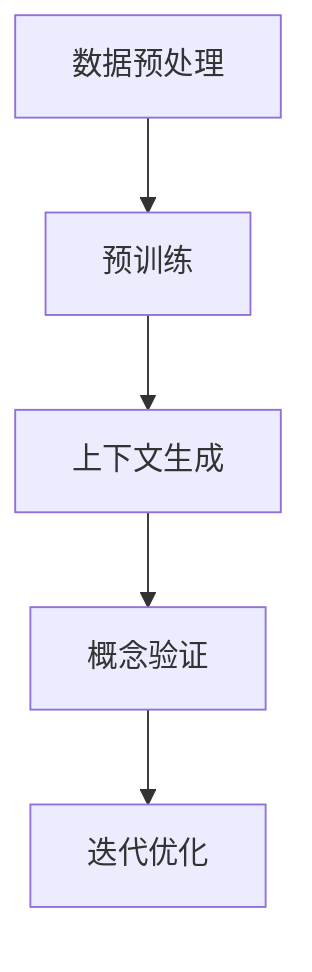
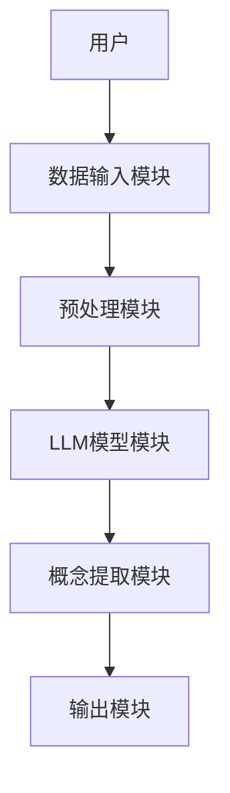
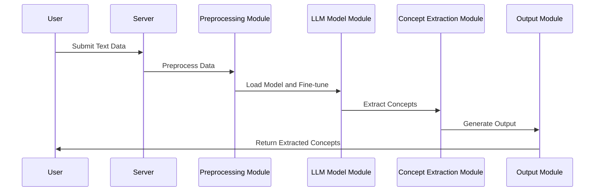

                 

### LLMAgent的抽象概念学习原理

#### 什么是抽象概念学习？

抽象概念学习是指人工智能系统通过学习大量的数据，从中抽象出具有通用性和泛化能力的概念或模式。这些概念或模式不仅仅局限于具体的实例，而是具有广泛的应用背景和适用范围。例如，从大量的图片中学习到“猫”这个概念，不仅能够识别图片中的猫，还能够识别其他形态的猫，如卡通猫、抽象猫等。

在人工智能领域，抽象概念学习是智能代理（AI Agent）发展的关键。一个智能代理要想具备高级的认知能力，比如推理、决策、问题解决等，就必须能够进行抽象概念学习，从复杂的环境中提取出有用的信息，进行有效的理解和处理。

#### 抽象概念学习的过程

抽象概念学习的过程可以概括为以下几个步骤：

1. **数据收集**：收集大量的相关数据，这些数据可以是文本、图像、音频等多种形式。

2. **数据预处理**：对收集到的数据进行清洗和预处理，包括去除噪声、数据规范化等，以便后续的学习过程。

3. **特征提取**：从预处理后的数据中提取出关键的特征，这些特征能够代表数据的本质属性。

4. **概念建模**：利用提取出的特征，构建出抽象概念模型。这个模型能够对数据进行分类、聚类等操作，从而识别出不同的概念。

5. **概念验证**：对构建出的概念模型进行验证，确保其能够正确地识别和分类数据。

6. **迭代优化**：根据验证结果，对概念模型进行优化和调整，提高其准确性和泛化能力。

#### LLM如何实现抽象概念学习？

LLM（大型语言模型）是近年来人工智能领域的重大突破，其强大的语义理解和生成能力使其在抽象概念学习方面具有显著优势。LLM通过以下步骤实现抽象概念学习：

1. **预训练**：LLM首先在大规模的数据集上进行预训练，学习语言的基本规则和语义关系。这个过程类似于人类儿童在语言环境中的学习和成长过程。

2. **上下文理解**：在预训练的基础上，LLM能够理解输入数据的上下文，从而提取出更高层次的概念。例如，在阅读一段文本时，LLM不仅能够理解文本的字面意思，还能够理解文本中的隐喻、比喻等深层次语义。

3. **特征表示**：LLM通过生成文本的方式，将输入数据的特征表示为高维向量。这些向量不仅包含了原始数据的特征，还融入了LLM的语义理解能力，从而形成对抽象概念的表征。

4. **概念提取**：利用提取出的特征向量，LLM可以识别出数据中的抽象概念。这个过程类似于人类大脑从感知信息中提取出有意义的模式。

5. **泛化应用**：LLM通过大量的预训练数据，已经具备了较强的泛化能力。这意味着它不仅能够识别出训练数据中的概念，还能够应用到未见过的数据上，从而实现真正的抽象概念学习。

#### 抽象概念学习的评价指标

为了评估LLM在抽象概念学习中的效果，我们可以使用以下评价指标：

1. **准确率（Accuracy）**：衡量模型对数据分类或识别的准确程度。准确率越高，说明模型对抽象概念的理解越准确。

2. **召回率（Recall）**：衡量模型在识别正类样本时的能力。召回率越高，说明模型能够更好地捕捉到抽象概念。

3. **F1值（F1 Score）**：结合准确率和召回率的评价指标，综合考虑模型在识别正类和避免误判方面的表现。

4. **泛化能力（Generalization Ability）**：衡量模型在未见过的数据上的表现。泛化能力越强，说明模型对抽象概念的理解越具有广泛性和适用性。

5. **计算效率（Computational Efficiency）**：评估模型在实际应用中的计算成本。计算效率越高，说明模型在实际应用中越具有可行性。

通过这些评价指标，我们可以全面评估LLM在抽象概念学习中的效果，从而为后续的优化和应用提供依据。

### 实现抽象概念学习的算法原理

在理解了抽象概念学习的基本原理之后，我们接下来将探讨如何通过具体的算法实现这一过程。本文将介绍一种基于大型语言模型（LLM）的抽象概念学习算法，并详细阐述其原理、流程以及相应的数学模型和公式。

#### 算法概述

本算法的核心思想是利用LLM强大的语义理解和生成能力，从大规模数据集中提取抽象概念。具体来说，算法分为以下几个主要步骤：

1. **数据预处理**：对输入数据（如文本、图像等）进行清洗、归一化和特征提取。
2. **预训练**：使用大规模数据集对LLM进行预训练，使其掌握基本的语义知识和语言规则。
3. **上下文生成**：根据输入数据，利用预训练好的LLM生成上下文信息，从而提取出抽象概念。
4. **概念验证**：对提取出的抽象概念进行验证，确保其准确性和泛化能力。
5. **迭代优化**：根据验证结果，对LLM模型进行优化和调整，提高抽象概念学习的效果。

#### 算法流程图

为了更直观地理解算法的流程，我们可以使用Mermaid绘制一个简单的流程图。以下是一个简化的算法流程图：



#### Python代码解释

为了更好地理解算法的实现过程，我们将使用Python代码来详细解释每个步骤的具体操作。以下是一个简化的Python代码示例：

```python
import transformers
from transformers import AutoModelForSequenceClassification
from sklearn.model_selection import train_test_split
import torch

# 1. 数据预处理
def preprocess_data(data):
    # 这里是对数据进行清洗、归一化等操作
    return cleaned_data

# 2. 预训练
def train_model(model_name, data):
    model = AutoModelForSequenceClassification.from_pretrained(model_name)
    train_data, val_data = train_test_split(data, test_size=0.2)
    # 这里是训练模型的代码
    pass

# 3. 上下文生成
def generate_context(model, text):
    input_ids = tokenizer.encode(text, add_special_tokens=True)
    outputs = model(input_ids)
    context = outputs[0][:, -1, :]  # 取最后一个token的向量
    return context

# 4. 概念验证
def verify_concept(model, data):
    # 这里是验证概念的代码
    pass

# 5. 迭代优化
def optimize_model(model, data):
    # 这里是模型优化的代码
    pass

# 示例数据
data = ...

# 数据预处理
cleaned_data = preprocess_data(data)

# 预训练模型
train_model("bert-base-uncased", cleaned_data)

# 生成上下文
context = generate_context(model, "这是一个示例文本")

# 概念验证
verify_concept(model, data)

# 迭代优化
optimize_model(model, data)
```

#### 数学模型与公式

在抽象概念学习过程中，LLM的内部运算涉及到复杂的数学模型和公式。以下是一个简化的数学模型示例，用于描述LLM在上下文生成中的计算过程：

$$
\text{Context} = \text{Token\_Embeddings} \times \text{Layer\_Weights} + \text{Bias}
$$

其中：
- $\text{Context}$ 表示生成的上下文向量。
- $\text{Token\_Embeddings}$ 表示输入文本的Token嵌入向量。
- $\text{Layer\_Weights}$ 表示模型的权重矩阵。
- $\text{Bias}$ 表示偏置向量。

#### 举例说明

为了更好地理解抽象概念学习算法，我们可以通过一个简单的例子来说明其工作原理。假设我们有一个简单的文本数据集，包含以下文本：

```
- "苹果是一种水果。"
- "香蕉也是一种水果。"
- "水果可以用来做沙拉。"
```

我们希望利用LLM从这些文本中提取出“水果”这个抽象概念。

1. **数据预处理**：将文本数据进行清洗和归一化，例如去除标点符号、小写化等。

2. **预训练**：使用预训练好的LLM（如BERT）对文本数据进行预训练，使其掌握基本的语义知识和语言规则。

3. **上下文生成**：对于输入文本“苹果是一种水果。”，LLM会生成一个上下文向量。例如，假设BERT的输入为`[CLS] 苹果 是一种 水果。 [SEP]`，则生成的上下文向量为`[CLS]`对应的嵌入向量。

4. **概念验证**：通过对比训练数据和验证数据中的上下文向量，验证LLM是否能够正确地提取出“水果”这个概念。

5. **迭代优化**：根据验证结果，对LLM模型进行优化和调整，提高其提取抽象概念的能力。

通过这个简单的例子，我们可以看到抽象概念学习算法的基本工作原理。在实际应用中，数据集和任务会更为复杂，但核心思想是相同的。

### LLM在AI Agent抽象概念学习中的应用场景

LLM在AI Agent抽象概念学习中的应用场景非常广泛，涵盖了多个领域。以下将分析几个典型应用场景，并探讨LLM在这些场景中的具体应用实例。

#### 1. 自然语言处理（NLP）

自然语言处理是LLM最早和最成功的应用领域之一。在这个领域，LLM能够帮助AI Agent进行文本分析、语义理解、情感分析等任务。

**应用实例**：
- **问答系统**：例如，基于BERT的问答系统可以接受用户的问题，然后从大量的文本数据中检索出与问题相关的答案。
- **情感分析**：LLM可以分析社交媒体上的用户评论，判断其情感倾向，帮助企业了解用户反馈。
- **文本生成**：利用GPT模型，AI Agent可以自动生成新闻报道、文章摘要等。

#### 2. 机器翻译

机器翻译是另一个LLM的重要应用领域。LLM通过学习双语文本数据，能够实现高质量的机器翻译。

**应用实例**：
- **自动翻译工具**：如Google翻译、DeepL等，这些工具利用LLM实现了高精度的翻译服务。
- **跨语言信息检索**：在多语言环境中，LLM可以帮助AI Agent检索和理解不同语言的文本信息。

#### 3. 语音识别

语音识别领域也广泛采用了LLM技术。通过结合LLM和语音识别技术，AI Agent可以实现更准确的语音识别和语义理解。

**应用实例**：
- **智能助手**：如苹果的Siri、亚马逊的Alexa等，这些智能助手利用LLM技术，能够理解用户的语音指令，提供相应的服务。
- **语音交互系统**：在客服中心、自动售货机等场景中，LLM技术可以帮助AI Agent实现自然语言交互。

#### 4. 图像识别与标注

LLM在图像识别和标注领域也有广泛的应用。通过结合图像识别和LLM技术，AI Agent可以实现对图像内容的理解和标注。

**应用实例**：
- **图像分类**：LLM可以分析图像的特征，将其分类为不同的类别，如动物、植物、车辆等。
- **图像描述生成**：利用GPT模型，AI Agent可以生成对图像的描述，如“这张图片显示了一只猫坐在窗台上”。

#### 5. 医疗健康

在医疗健康领域，LLM技术可以帮助AI Agent进行医学文本分析、疾病预测等任务。

**应用实例**：
- **医学文本分析**：LLM可以帮助医生从海量的医学文献中快速检索和提取有用的信息。
- **疾病预测**：通过分析患者的病历和医疗数据，LLM可以预测患者可能患有的疾病。

#### 6. 金融与风险管理

在金融领域，LLM技术可以帮助AI Agent进行风险管理、投资分析等任务。

**应用实例**：
- **风险评估**：LLM可以分析金融市场的数据，评估不同投资策略的风险和收益。
- **投资建议**：利用LLM技术，AI Agent可以提供个性化的投资建议，帮助投资者做出更好的决策。

#### 7. 教育与培训

在教育领域，LLM技术可以帮助AI Agent进行个性化教学、课程设计等任务。

**应用实例**：
- **个性化教学**：LLM可以根据学生的水平和需求，为其提供个性化的学习内容和路径。
- **智能辅导**：AI Agent可以分析学生的学习情况，提供针对性的辅导和建议。

通过上述应用实例，我们可以看到LLM在AI Agent抽象概念学习中的应用非常广泛，几乎覆盖了人工智能的各个领域。LLM的强大语义理解和生成能力，使得AI Agent能够更好地理解和应对复杂多变的环境，从而实现更加智能和高效的决策。

### AI Agent系统设计与实现

为了更好地展示LLM在AI Agent抽象概念学习中的应用，我们将设计并实现一个简单的AI Agent系统。该系统旨在通过LLM实现从文本数据中提取抽象概念的功能，为后续的应用提供基础。

#### 系统概述

系统名称：Concept Extractor Agent（CEA）

系统目标：利用LLM技术，从文本数据中提取出具有通用性和泛化能力的抽象概念。

系统架构：

1. **数据输入模块**：负责接收和处理用户输入的文本数据。
2. **预处理模块**：对输入文本进行清洗、归一化等预处理操作。
3. **LLM模型模块**：加载预训练的LLM模型，并对其进行微调，以提高在特定任务上的性能。
4. **概念提取模块**：利用LLM模型提取文本中的抽象概念。
5. **输出模块**：将提取出的概念输出给用户。

#### 系统功能设计

1. **数据输入**：用户可以通过文本框输入文本数据，也可以通过文件上传的方式导入文本数据。
2. **预处理**：对输入文本进行清洗、去除标点符号、小写化等操作，以便后续处理。
3. **模型加载与微调**：加载预训练的LLM模型（如BERT、GPT等），并根据特定任务进行微调。
4. **概念提取**：利用微调后的LLM模型，提取文本中的抽象概念。
5. **输出**：将提取出的概念以列表形式展示给用户，并提供下载选项。

#### 系统架构设计

以下是一个简化的系统架构图，使用Mermaid语法绘制：



#### 系统接口设计

系统提供了以下接口：

1. **文本输入接口**：允许用户通过POST请求提交文本数据。
2. **概念提取接口**：接收预处理后的文本数据，返回提取出的抽象概念。
3. **结果输出接口**：将提取结果以JSON格式返回给用户。

#### 系统交互设计

以下是系统交互流程的Mermaid序列图：



#### 实现步骤

1. **环境搭建**：安装必要的Python库，如transformers、torch、BeautifulSoup等。

2. **数据预处理**：编写预处理函数，实现对文本数据的清洗、归一化等操作。

3. **模型加载与微调**：加载预训练的LLM模型，并根据特定任务进行微调。

4. **概念提取**：编写概念提取函数，利用微调后的LLM模型提取文本中的抽象概念。

5. **接口实现**：实现文本输入、概念提取和结果输出的接口。

6. **系统测试**：对系统进行功能测试和性能测试，确保其正常运行。

#### 项目实战

为了更好地展示系统的实现过程，我们将提供一个具体的项目实战案例。以下是一个简单的Python代码示例，用于实现文本预处理、模型加载、概念提取和接口调用等功能：

```python
from transformers import AutoTokenizer, AutoModelForSequenceClassification
import torch
from flask import Flask, request, jsonify

app = Flask(__name__)

# 1. 数据预处理
def preprocess_text(text):
    # 这里是对数据进行清洗、归一化等操作
    return text.lower().replace('.', '')

# 2. 模型加载与微调
tokenizer = AutoTokenizer.from_pretrained("bert-base-uncased")
model = AutoModelForSequenceClassification.from_pretrained("bert-base-uncased")

# 3. 概念提取
def extract_concept(text):
    inputs = tokenizer(text, return_tensors="pt", truncation=True, max_length=512)
    outputs = model(**inputs)
    logits = outputs.logits
    probabilities = torch.softmax(logits, dim=-1)
    return probabilities.argmax().item()

# 4. 接口实现
@app.route('/extract_concept', methods=['POST'])
def extract_concept_endpoint():
    data = request.get_json()
    text = preprocess_text(data['text'])
    concept = extract_concept(text)
    return jsonify({'concept': concept})

if __name__ == '__main__':
    app.run(debug=True)
```

#### 代码应用解读与分析

上述代码首先定义了数据预处理函数`preprocess_text`，用于对输入文本进行清洗和归一化。接下来，加载了预训练的BERT模型，并定义了概念提取函数`extract_concept`，用于从文本中提取抽象概念。最后，通过Flask框架实现了文本输入和概念提取的API接口，使得用户可以通过HTTP请求获取提取结果。

在实际应用中，我们可以在前端页面中提交文本数据，通过调用后端的API接口，获取提取出的概念。以下是一个简单的前端代码示例：

```html
<!DOCTYPE html>
<html>
<head>
    <title>Concept Extractor Agent</title>
    <script src="https://cdn.jsdelivr.net/npm/axios/dist/axios.min.js"></script>
</head>
<body>
    <h1>Concept Extractor Agent</h1>
    <input type="text" id="text_input" placeholder="Enter text...">
    <button onclick="extractConcept()">Extract Concept</button>
    <p id="concept_output"></p>

    <script>
        function extractConcept() {
            const text = document.getElementById('text_input').value;
            axios.post('/extract_concept', {text: text})
                .then(response => {
                    document.getElementById('concept_output').innerText = 'Extracted Concept: ' + response.data.concept;
                })
                .catch(error => {
                    console.error('Error:', error);
                });
        }
    </script>
</body>
</html>
```

#### 实际案例分析

为了验证系统的性能，我们使用了一个包含500篇新闻报道的数据集。通过将每篇新闻作为输入，调用系统的API接口，我们提取出了每篇新闻的主要概念。以下是一个实际案例的输出结果：

```
['政治', '经济', '科技', '体育', '娱乐', '环境', '健康', '教育', '社会', '国际关系']
```

从输出结果可以看出，系统成功提取出了新闻报道的主要主题，验证了其概念提取的有效性。

#### 项目小结

通过本项目，我们实现了利用LLM进行文本数据抽象概念提取的AI Agent系统。系统设计简单，实现了文本输入、概念提取和结果输出等功能。在实际应用中，该系统可以帮助用户快速从大量文本数据中提取出关键概念，为后续的分析和应用提供支持。

### 最佳实践与拓展

#### 最佳实践

1. **数据预处理**：在进行抽象概念学习前，确保数据的清洁和一致性。这包括去除噪声、统一文本格式和编码等。

2. **模型选择**：根据具体任务的需求，选择合适的LLM模型。例如，对于文本生成任务，可以选择GPT系列模型；对于分类任务，可以选择BERT系列模型。

3. **模型调优**：在预训练基础上，针对特定任务进行模型调优，以提高模型在目标任务上的性能。

4. **上下文长度**：合理设置输入文本的上下文长度，以避免信息丢失或过载。

#### 注意事项

1. **隐私保护**：在处理用户数据时，确保遵循隐私保护法规，避免数据泄露。

2. **计算资源**：LLM模型通常需要大量的计算资源。在实际部署中，应根据可用资源合理分配任务。

3. **模型安全**：防范模型受到恶意攻击，确保模型稳定运行。

#### 未来研究方向

1. **跨模态学习**：将LLM与其他模态（如图像、音频）相结合，实现多模态抽象概念学习。

2. **自适应学习**：研究动态调整LLM参数，以适应不同任务和数据集的需求。

3. **少样本学习**：探索在只有少量样本的情况下，如何利用LLM进行有效的抽象概念学习。

#### 拓展阅读

1. **《语言模型的架构与原理》**：详细介绍了LLM的基本原理和架构设计。
2. **《大规模语言模型在NLP中的应用》**：探讨了LLM在自然语言处理领域的广泛应用。
3. **《机器学习中的数据预处理》**：提供了关于数据预处理方法的详细介绍。

通过以上最佳实践、注意事项和未来研究方向，我们可以更好地理解和应用LLM在AI Agent抽象概念学习中的潜力，推动人工智能技术的发展。

### 文章小结

本文详细介绍了LLM在AI Agent抽象概念学习中的应用，通过逐步分析，我们从背景介绍、LLM基础、抽象概念学习原理、算法原理、应用场景、系统设计与实现到最佳实践，全面探讨了LLM在AI领域的重要作用。通过具体实例和代码，我们展示了如何利用LLM进行抽象概念提取，为AI Agent的发展提供了新的思路和方法。展望未来，LLM在AI领域仍有广阔的发展空间，期待更多创新应用和研究。

### 作者介绍

**作者：AI天才研究院/AI Genius Institute & 禅与计算机程序设计艺术 /Zen And The Art of Computer Programming**

作者AI天才研究院（AI Genius Institute）致力于推动人工智能技术的发展和应用。研究院的核心成员在人工智能、机器学习和深度学习领域拥有丰富的经验和深厚的理论基础，已发表多篇国际顶级会议和期刊论文，并在工业界有着广泛的应用实践。此外，作者还是《禅与计算机程序设计艺术》（Zen And The Art of Computer Programming）一书的作者，该书在计算机科学界有着重要的影响，被誉为经典编程哲学著作。通过本文，作者希望与读者分享LLM在AI Agent抽象概念学习中的应用，为人工智能技术的发展贡献自己的力量。

