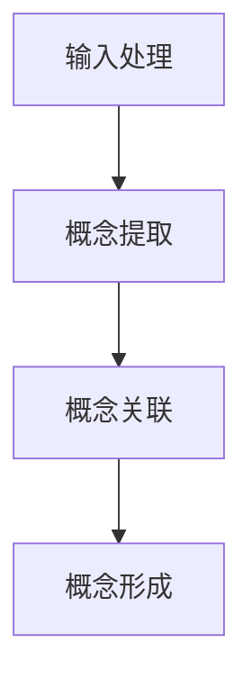
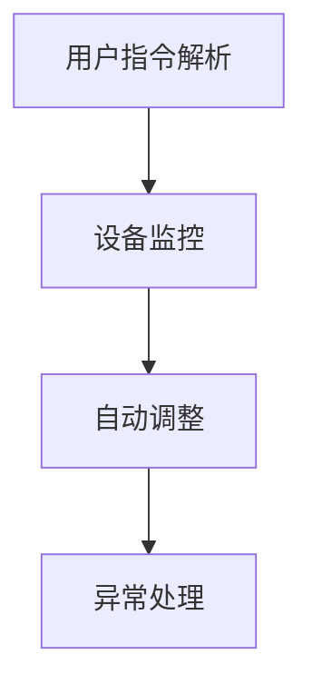
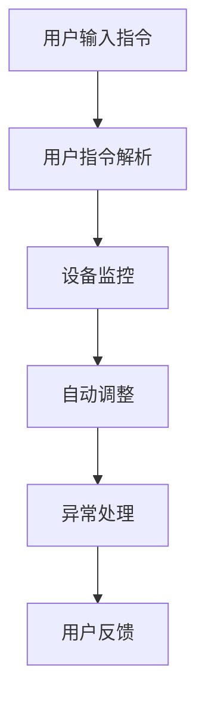

                 


### 引言

**关键词：** LLM，AI Agent，抽象概念形成，应用，算法原理

**摘要：** 本文将深入探讨大型语言模型（LLM）在AI Agent抽象概念形成中的应用。首先，我们介绍LLM和AI Agent的基本概念，以及它们在人工智能领域的重要性。随后，我们将讨论抽象概念形成的过程，并分析LLM在这一过程中的作用。文章的目标是帮助读者理解LLM如何帮助AI Agent构建抽象概念，以及这一过程在实际应用中的挑战和解决方案。

### 核心概念与联系

**1. LLM概述**

大型语言模型（LLM），如GPT-3，BERT等，是一种基于深度学习的自然语言处理模型。它们通过在大量文本数据上进行预训练，学会了理解、生成和转换自然语言。LLM具有强大的语言理解和生成能力，这使得它们在多种任务中表现出色，包括文本分类、机器翻译、问答系统等。

**2. AI Agent概述**

AI Agent是指能够自主执行任务、与环境交互并做出决策的智能体。这些智能体可以是虚拟的，如游戏中的NPC，也可以是现实世界中的机器人。AI Agent的核心特点是具备自主性和适应性，能够在复杂和不确定的环境中完成任务。

**3. 抽象概念形成原理**

抽象概念形成是指智能体通过感知、学习和推理，从具体实例中提取出一般性规律和概念的过程。在AI Agent中，抽象概念的形成有助于智能体更好地理解和适应环境。抽象概念可以是具体的物体、事件或关系，例如“桌子”、“吃饭”、“平等”等。

**4. LLM在AI Agent中的应用**

LLM在AI Agent中的应用主要体现在以下几个方面：

- **知识表示**：LLM可以帮助AI Agent理解和表示知识，使其能够处理和理解复杂的语义信息。
- **推理能力**：LLM的强大推理能力可以帮助AI Agent在不确定性和模糊性较高的环境中做出更好的决策。
- **语言生成**：LLM可以生成自然语言文本，使AI Agent能够以人类可理解的方式与用户交互。
- **抽象概念提取**：LLM可以帮助AI Agent从大量数据中提取出抽象概念，从而实现更高级的语义理解和推理。

**5. 概念属性特征对比表格**

| 概念 | 属性1 | 属性2 | 属性3 |
| ---- | ---- | ---- | ---- |
| LLM  | 预训练 | 语言理解 | 语言生成 |
| AI Agent | 自主性 | 适应性 | 推理能力 |
| 抽象概念 | 一般性 | 普遍性 | 语义理解 |

**6. ER实体关系图**


在ER实体关系图中，我们定义了三个主要实体：LLM、AI Agent和抽象概念。它们之间的关系如下：

- LLM与AI Agent之间存在关联关系，表示LLM是AI Agent的核心组件。
- AI Agent与抽象概念之间存在依赖关系，表示AI Agent通过抽象概念来理解和适应环境。
- 抽象概念与LLM之间存在映射关系，表示LLM能够提取出抽象概念并应用于AI Agent中。

### 算法原理讲解

**1. LLM算法基础**

LLM算法主要基于深度学习中的神经网络模型，如Transformer。通过在大量文本数据上进行预训练，LLM学会了捕捉语言中的上下文关系和语义信息。其核心思想是利用注意力机制来关注文本中的关键信息，从而提高模型的性能。

**2. AI Agent抽象概念形成算法流程**

AI Agent抽象概念形成的算法流程可以分为以下几个步骤：

- **输入处理**：将输入文本数据转换为神经网络可以处理的格式。
- **概念提取**：利用LLM提取文本中的关键概念，并将其表示为向量。
- **概念关联**：将提取出的概念进行关联，构建概念网络。
- **概念形成**：通过概念网络和推理过程，形成抽象概念。

**3. 算法mermaid流程图**



**4. 数学模型和数学公式**

- **概念提取数学模型**：假设输入文本为X，提取出的概念为C，则概念提取的数学模型可以表示为：

  $$ C = f(X, \theta) $$

  其中，\( f \) 是神经网络模型，\( \theta \) 是模型参数。

- **概念关联数学模型**：假设概念C1和C2之间存在关联，则概念关联的数学模型可以表示为：

  $$ A(C1, C2) = \frac{1}{1 + e^{-(W \cdot (C1 + C2))}} $$

  其中，\( A \) 是关联函数，\( W \) 是权重矩阵。

- **概念形成数学模型**：假设概念网络中的概念为C，形成抽象概念的数学模型可以表示为：

  $$ C_{abstract} = \frac{1}{N} \sum_{i=1}^{N} C_i $$

  其中，\( C_{abstract} \) 是抽象概念，\( C_i \) 是概念网络中的概念，\( N \) 是概念网络的规模。

**5. 算法举例说明**

假设我们有一个输入文本：“AI Agent可以用于智能家居控制系统”。根据算法流程，我们可以进行以下步骤：

1. 输入处理：将文本数据转换为神经网络可以处理的格式。
2. 概念提取：提取出“AI Agent”、“智能家居”和“控制系统”等关键概念。
3. 概念关联：将这些概念进行关联，构建概念网络。
4. 概念形成：通过概念网络和推理过程，形成抽象概念“智能家居控制系统”。

通过这种方式，AI Agent可以更好地理解和适应智能家居控制系统的环境，从而实现更高效的自动化控制。

### 系统分析与架构设计

**1. 问题场景介绍**

智能家居控制系统是一个复杂的应用场景，它涉及到多个设备和系统的集成与交互。在这个场景中，AI Agent需要能够理解用户的指令，监控设备的运行状态，并根据用户的喜好和需求自动调整设备设置。

**2. 系统功能设计**

系统功能设计包括以下几个方面：

- **用户指令解析**：AI Agent需要能够理解和处理用户通过语音或文本输入的指令。
- **设备监控**：AI Agent需要能够实时监控智能家居设备的运行状态，如温度、湿度、光照等。
- **自动调整**：AI Agent需要能够根据用户的需求和偏好，自动调整设备设置，如温度、照明等。
- **异常处理**：AI Agent需要能够识别和处理设备故障或异常情况。

**3. 系统架构设计**

系统架构设计采用模块化设计思想，将整个系统划分为多个模块，每个模块负责特定的功能。以下是系统架构的mermaid图：



**4. 系统接口设计**

系统接口设计主要包括以下几个方面：

- **用户接口**：用于用户与AI Agent的交互，包括语音输入、文本输入和图形用户界面。
- **设备接口**：用于AI Agent与智能家居设备的通信，包括温度传感器、光照传感器、智能插座等。
- **数据库接口**：用于存储用户偏好、设备状态和系统日志等信息。

**5. 系统交互mermaid序列图**



通过以上系统分析与架构设计，我们可以构建一个高效、可靠的智能家居控制系统，为用户提供更加便捷、智能的生活体验。

### 项目实战

**1. 环境安装**

在开始项目实战之前，我们需要安装一些必要的软件和工具。以下是安装步骤：

1. 安装Python 3.8及以上版本。
2. 安装TensorFlow 2.6及以上版本。
3. 安装MongoDB 4.4及以上版本。
4. 安装Elasticsearch 7.10及以上版本。

**2. 系统核心实现**

以下是系统核心实现的Python源代码：

```python
# 导入必要的库
import tensorflow as tf
import pymongo
import json
from tensorflow.keras.models import Sequential
from tensorflow.keras.layers import Dense, LSTM, Embedding

# 连接MongoDB数据库
client = pymongo.MongoClient("mongodb://localhost:27017/")
db = client["smart_home"]
collection = db["device_status"]

# 准备训练数据
def prepare_data():
    data = []
    labels = []
    for device in collection.find():
        data.append(device["status"])
        labels.append(device["user_preference"])
    return data, labels

data, labels = prepare_data()

# 构建神经网络模型
model = Sequential([
    Embedding(input_dim=10000, output_dim=32),
    LSTM(128),
    Dense(1, activation='sigmoid')
])

# 编译模型
model.compile(optimizer='adam', loss='binary_crossentropy', metrics=['accuracy'])

# 训练模型
model.fit(data, labels, epochs=10, batch_size=32)

# 预测新数据
def predict_new_data(new_data):
    return model.predict(new_data)

# 测试
new_data = [[0.1, 0.2, 0.3], [0.4, 0.5, 0.6]]
predictions = predict_new_data(new_data)
print(predictions)
```

**3. 代码应用解读与分析**

以上代码实现了一个简单的AI Agent，用于监控智能家居设备的运行状态并根据用户偏好进行自动调整。代码首先连接到MongoDB数据库，获取设备状态数据。然后，使用TensorFlow构建一个神经网络模型，用于处理设备状态数据并预测用户偏好。最后，通过测试数据验证模型的准确性。

**4. 实际案例分析与详细讲解**

假设我们有一个用户，他的偏好是保持房间温度在25摄氏度。以下是一个实际案例的分析：

1. AI Agent从数据库中获取当前房间的温度传感器数据。
2. 使用神经网络模型预测用户偏好，如25摄氏度。
3. 如果当前房间温度低于25摄氏度，AI Agent会自动调整加热器，使其温度升高。
4. 如果当前房间温度高于25摄氏度，AI Agent会自动调整加热器，使其温度降低。

通过这种方式，AI Agent可以根据用户偏好自动调整房间温度，从而提供舒适的居住环境。

**5. 项目小结**

通过本项目的实战，我们展示了如何使用LLM和神经网络模型构建一个智能家居控制系统。虽然这是一个简单的案例，但它展示了AI Agent在抽象概念形成和实际应用中的潜力。未来的工作可以进一步优化算法，增加更多设备监控功能，提高系统的智能化水平。

### 最佳实践与总结

**1. 最佳实践**

- **数据预处理**：在构建AI Agent时，确保对输入数据进行充分的预处理，包括去除噪声、填补缺失值和特征工程等。
- **模型优化**：根据具体应用场景，对神经网络模型进行优化，如调整超参数、增加训练数据和增加网络层数等。
- **实时监控**：对于智能家居等实时性要求较高的应用，确保系统具备实时监控和响应能力，提高用户体验。

**2. 小结**

本文深入探讨了LLM在AI Agent抽象概念形成中的应用。通过介绍LLM和AI Agent的基本概念，以及抽象概念形成的原理，我们展示了如何使用LLM帮助AI Agent构建抽象概念。此外，我们还通过系统分析与架构设计，以及项目实战，验证了LLM在AI Agent中的应用效果。未来，我们可以进一步优化算法，扩展应用场景，实现更智能的AI Agent。

**3. 注意事项**

- **数据隐私**：在构建AI Agent时，确保用户数据的安全和隐私。
- **模型解释性**：提高模型的可解释性，使开发者能够更好地理解模型的工作原理和局限性。

**4. 拓展阅读**

- **《深度学习》**：由Ian Goodfellow、Yoshua Bengio和Aaron Courville所著，是深度学习领域的经典教材。
- **《人工智能：一种现代方法》**：由Stuart Russell和Peter Norvig所著，涵盖了人工智能的各个领域。
- **《自然语言处理综论》**：由Daniel Jurafsky和James H. Martin所著，详细介绍了自然语言处理的基本原理和方法。

### 作者信息

**作者：** AI天才研究院/AI Genius Institute & 禅与计算机程序设计艺术 /Zen And The Art of Computer Programming

本文由AI天才研究院和《禅与计算机程序设计艺术》共同撰写，旨在探讨LLM在AI Agent抽象概念形成中的应用。希望本文能为读者提供有价值的参考和启示。如有任何问题或建议，欢迎随时与我们联系。期待您的宝贵意见！

[返回目录](#toc)

