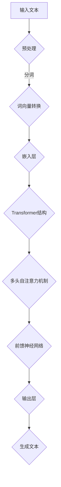
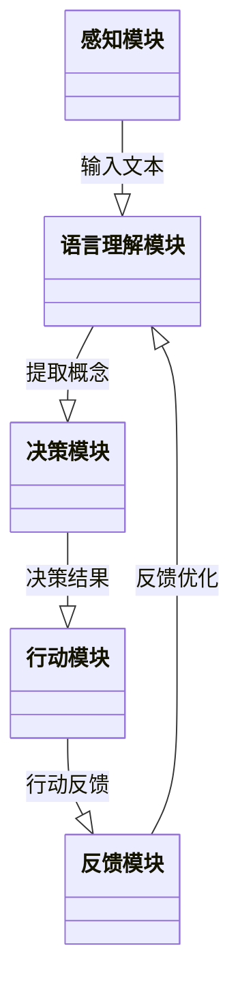
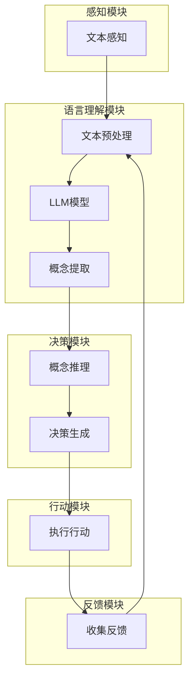
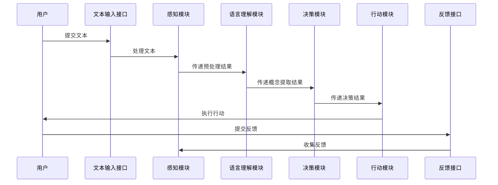
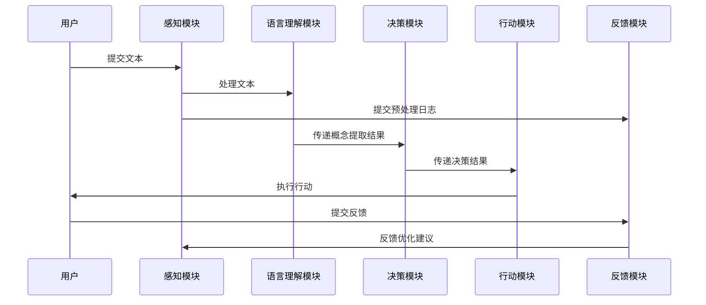

                 

## 《LLM在AI Agent抽象概念操作中的应用》

关键词：大语言模型（LLM），AI Agent，抽象概念，操作应用，算法原理，系统设计与实现。

摘要：本文将深入探讨大语言模型（LLM）在AI Agent中的抽象概念操作应用。首先，我们将介绍LLM和AI Agent的基本概念和背景，然后详细分析两者在抽象概念操作中的结合点。接着，我们将讲解LLM的算法原理，并通过Python源代码和数学公式对其进行通俗易懂的阐述。此外，我们将展示如何将LLM应用于AI Agent的抽象概念操作，并设计相应的系统架构。最后，通过一个实际项目案例，我们将演示如何实现和部署这一系统，并提供最佳实践和注意事项。

----------------------------------------------------------------

## 《LLM在AI Agent抽象概念操作中的应用》目录大纲

## 第一部分：背景介绍

### 第1章：问题背景

#### 1.1 问题的提出
#### 1.2 问题描述
#### 1.3 问题解决
#### 1.4 边界与外延
#### 1.5 概念结构与核心要素组成

### 第2章：核心概念与联系

#### 2.1 LLM的定义
#### 2.2 LLM的属性特征对比表格
#### 2.3 AI Agent的概念
#### 2.4 AI Agent与LLM的联系

## 第二部分：算法原理讲解

### 第3章：LLM的基本原理

#### 3.1 语言模型的概述
#### 3.2 语言模型的工作原理
#### 3.3 LLM的优势

### 第4章：AI Agent的抽象概念操作

#### 4.1 AI Agent的概述
#### 4.2 AI Agent的抽象概念操作
#### 4.3 AI Agent与LLM的结合

### 第5章：算法原理讲解

#### 5.1 LLM算法的mermaid流程图
#### 5.2 Python源代码详细阐述
#### 5.3 算法原理的数学模型和公式
#### 5.4 通俗易懂的举例说明

## 第三部分：系统分析与架构设计

### 第6章：系统功能设计

#### 6.1 问题场景介绍
#### 6.2 系统功能设计（领域模型mermaid类图）

### 第7章：系统架构设计

#### 7.1 系统架构设计（mermaid架构图）
#### 7.2 系统接口设计
#### 7.3 系统交互（mermaid序列图）

## 第四部分：项目实战

### 第8章：环境安装与系统核心实现

#### 8.1 环境安装
#### 8.2 系统核心实现源代码
#### 8.3 代码应用解读与分析
#### 8.4 实际案例分析和详细讲解剖析

### 第9章：项目小结

#### 9.1 最佳实践 tips
#### 9.2 小结
#### 9.3 注意事项
#### 9.4 拓展阅读

## 第一部分：背景介绍

### 第1章：问题背景

#### 1.1 问题的提出

在当前信息化和智能化快速发展的时代，人工智能（AI）技术已经成为推动社会进步的重要力量。其中，AI Agent作为一种智能实体，被广泛应用于各种场景，如自然语言处理（NLP）、游戏智能、智能客服等。然而，传统的AI Agent在处理复杂任务时往往存在局限性，特别是在抽象概念的识别和操作方面。为了解决这一问题，研究人员提出了将大语言模型（LLM）引入AI Agent的方案。

#### 1.2 问题描述

传统的AI Agent在抽象概念操作方面面临的主要问题包括：

1. **缺乏上下文理解**：AI Agent难以理解句子或段落的上下文信息，导致对抽象概念的识别和操作不准确。
2. **数据依赖性高**：AI Agent的训练和优化需要大量的数据进行支持，但数据的获取和处理往往是一项耗时耗力的工作。
3. **灵活性不足**：AI Agent在处理未知或变化的环境时，往往无法灵活适应，导致任务失败。

#### 1.3 问题解决

为了解决上述问题，研究人员提出了一种新的解决方案，即利用大语言模型（LLM）的强大能力，增强AI Agent在抽象概念操作方面的能力。LLM具有以下优势：

1. **强大的上下文理解能力**：LLM能够通过学习大量的文本数据，实现对句子和段落上下文的深入理解，从而准确识别抽象概念。
2. **数据适应性**：LLM的学习过程无需大量特定数据，对数据的依赖性较低，能够在多种环境中进行自适应操作。
3. **灵活性高**：LLM能够灵活地处理未知或变化的环境，为AI Agent提供更广泛的任务执行能力。

#### 1.4 边界与外延

虽然LLM在AI Agent抽象概念操作中的应用具有巨大的潜力，但同时也存在一些边界和挑战。首先，LLM的训练和优化过程非常复杂，需要大量的计算资源和时间。其次，LLM的性能和效果受限于训练数据的质量和多样性。此外，LLM在处理特定领域或专业问题时，可能存在知识盲区，需要结合其他技术进行补充。

#### 1.5 概念结构与核心要素组成

在本章中，我们介绍了LLM在AI Agent抽象概念操作中的应用背景，分析了问题并提出了解决方案。接下来，我们将进一步探讨LLM和AI Agent的核心概念和联系，为后续章节的内容打下基础。

### 第2章：核心概念与联系

#### 2.1 LLM的定义

大语言模型（LLM，Large Language Model）是一种基于深度学习技术构建的预训练模型，能够对自然语言进行理解和生成。LLM通过学习大量的文本数据，捕捉到语言的结构和规律，从而实现对句子、段落甚至篇章的深入理解。

#### 2.2 LLM的属性特征对比表格

| 特性         | 说明                                                         | 对比结果                                                   |
| ------------ | ------------------------------------------------------------ | ---------------------------------------------------------- |
| 上下文理解   | 能够理解句子和段落的上下文信息                               | 传统AI Agent缺乏上下文理解能力                             |
| 数据依赖性   | 对数据的依赖性较低，对数据的多样性要求较高                   | 传统AI Agent需要大量特定数据进行训练和优化               |
| 灵活性       | 能够在未知或变化的环境中进行自适应操作                       | 传统AI Agent灵活性不足                                     |
| 可解释性     | 模型的决策过程和结果具有较好的可解释性                       | 部分深度学习模型可解释性较差                               |
| 领域适应性   | 能够处理多个领域的任务，但可能在特定领域存在知识盲区           | 传统AI Agent通常在特定领域有较强能力，但难以跨领域应用 |

#### 2.3 AI Agent的概念

AI Agent（人工智能代理）是一种具有自主决策和执行能力的智能实体，能够模拟人类的行为和思维过程，在特定环境和任务中执行复杂的操作。AI Agent通常由感知模块、决策模块和行动模块组成。

#### 2.4 AI Agent与LLM的联系

LLM在AI Agent中具有重要的应用价值，主要体现在以下几个方面：

1. **增强上下文理解**：LLM能够为AI Agent提供强大的上下文理解能力，帮助其更准确地识别和处理抽象概念。
2. **优化决策过程**：LLM可以参与AI Agent的决策过程，提供基于语言理解的辅助决策支持，提高决策质量和效率。
3. **丰富行动能力**：LLM可以为AI Agent提供丰富的语言生成能力，使其能够生成更具创造性和灵活性的行动方案。
4. **跨领域应用**：LLM具有广泛的领域适应性，可以与AI Agent结合，实现跨领域的任务执行和知识共享。

#### 2.5 概念联系与综合分析

通过对LLM和AI Agent的核心概念和联系进行分析，我们可以看到，两者在抽象概念操作方面具有很高的互补性。LLM的强大语言处理能力为AI Agent提供了更强大的抽象概念识别和操作能力，而AI Agent的自主决策和行动能力则为LLM的应用提供了实际场景和需求。结合两者，可以实现更智能、更高效的抽象概念操作。

在接下来的章节中，我们将进一步探讨LLM的算法原理，并通过具体实现和案例分析，展示LLM在AI Agent抽象概念操作中的应用效果。

### 第二部分：算法原理讲解

#### 第3章：LLM的基本原理

#### 3.1 语言模型的概述

语言模型（Language Model，LM）是一种用于预测文本中下一个单词或字符的算法。在自然语言处理（NLP）领域中，语言模型被广泛应用于自动文摘、机器翻译、语音识别等任务。传统的语言模型，如N-gram模型，通过统计相邻单词或字符的出现频率来预测下一个单词或字符。然而，随着深度学习技术的发展，大型语言模型（LLM）逐渐成为语言模型的代表。

#### 3.2 语言模型的工作原理

语言模型的工作原理基于深度神经网络（DNN）和递归神经网络（RNN），特别是长短期记忆网络（LSTM）和变换器（Transformer）。以下是一个简化的语言模型工作原理：

1. **输入层**：将文本序列（单词或字符）作为输入，每个输入元素被编码为固定长度的向量。
2. **隐藏层**：通过神经网络结构对输入向量进行多次非线性变换，提取文本特征。
3. **输出层**：将隐藏层输出的特征向量映射到概率分布，预测下一个单词或字符。

#### 3.3 LLM的优势

与传统的语言模型相比，LLM具有以下优势：

1. **强大的上下文理解能力**：LLM能够捕捉到长距离的上下文信息，使得预测结果更准确。
2. **自适应学习**：LLM能够在不同任务和数据集上自适应地调整其参数，实现更广泛的应用。
3. **多语言支持**：LLM可以同时处理多种语言，实现跨语言的文本理解和生成。
4. **高效计算**：通过优化网络结构和训练算法，LLM能够在有限的计算资源下实现高效的预测和生成。

#### 3.4 LLM在抽象概念操作中的应用

在AI Agent的抽象概念操作中，LLM的应用主要体现在以下几个方面：

1. **概念识别**：LLM能够通过上下文理解，准确识别文本中的抽象概念。
2. **概念推理**：LLM可以根据已识别的概念，进行逻辑推理和关系分析。
3. **概念生成**：LLM能够生成新的抽象概念，提供创新的思维和解决方案。

在下一章中，我们将进一步探讨AI Agent的抽象概念操作，并详细分析LLM与AI Agent的结合点。

#### 第4章：AI Agent的抽象概念操作

#### 4.1 AI Agent的概述

AI Agent（人工智能代理）是指一种具有自主决策和执行能力的智能实体，能够在特定环境和任务中模拟人类行为。AI Agent通常由三个主要模块组成：感知模块、决策模块和行动模块。

1. **感知模块**：负责获取环境信息，如图像、声音、文本等。
2. **决策模块**：根据感知模块获取的信息，进行决策和规划。
3. **行动模块**：执行决策模块生成的行动方案，与环境进行交互。

AI Agent在多个领域具有广泛的应用，如智能客服、自动驾驶、智能家居等。

#### 4.2 AI Agent的抽象概念操作

抽象概念是指难以用具体物理形式表示的、具有普遍性和广泛适用性的概念，如情感、意图、知识等。AI Agent的抽象概念操作主要包括以下几个方面：

1. **概念识别**：AI Agent需要能够从感知信息中识别出抽象概念。例如，从一段对话中识别出用户的情感状态。
2. **概念推理**：AI Agent需要对识别出的抽象概念进行逻辑推理，以发现概念之间的关系。例如，从情感状态推理出用户的需求和意图。
3. **概念生成**：AI Agent需要能够根据已有知识和经验，生成新的抽象概念。例如，根据用户的历史行为生成个性化的推荐。

#### 4.3 AI Agent与LLM的结合

大语言模型（LLM）在AI Agent的抽象概念操作中具有重要作用。结合LLM，AI Agent的抽象概念操作能力得到显著提升：

1. **上下文理解**：LLM能够理解长距离的上下文信息，帮助AI Agent更准确地识别抽象概念。
2. **推理能力**：LLM的强大推理能力使得AI Agent能够对抽象概念进行深度的逻辑推理。
3. **知识生成**：LLM能够生成新的知识和概念，为AI Agent提供创新的思维和解决方案。

具体而言，LLM与AI Agent的结合可以体现在以下几个方面：

1. **感知与理解**：LLM作为感知模块的一部分，能够对感知到的文本信息进行深入理解，为决策模块提供丰富的上下文信息。
2. **决策与规划**：LLM参与决策模块的工作，提供基于语言理解的辅助决策支持，提高决策质量和效率。
3. **行动与交互**：LLM可以为行动模块提供语言生成能力，使其能够生成更具创造性和灵活性的行动方案。

在下一章中，我们将深入讲解LLM的算法原理，并通过具体实现和案例分析，展示LLM在AI Agent抽象概念操作中的应用效果。

#### 第5章：算法原理讲解

#### 5.1 LLM算法的mermaid流程图

为了更好地理解LLM的算法原理，我们首先使用mermaid流程图对其进行概述：



图中的各个步骤分别为：

- **A 输入文本**：输入待处理的文本数据。
- **B 预处理**：对输入文本进行分词、去停用词等预处理操作。
- **C 词向量转换**：将分词后的文本转化为词向量。
- **D 嵌入层**：将词向量嵌入到高维空间，为后续的Transformer结构提供输入。
- **E Transformer结构**：采用Transformer结构对嵌入层输出进行处理。
- **F 多头自注意力机制**：在Transformer结构中引入多头自注意力机制，对输入序列进行加权处理。
- **G 前馈神经网络**：在Transformer结构后添加前馈神经网络，进一步提取特征。
- **H 输出层**：对前馈神经网络的输出进行分类或生成文本。
- **I 生成文本**：根据输出层的预测结果，生成新的文本。

#### 5.2 Python源代码详细阐述

为了更好地理解LLM的算法原理，我们使用Python代码对其进行详细阐述：

```python
import tensorflow as tf
from tensorflow.keras.layers import Embedding, LSTM, Dense
from tensorflow.keras.models import Model

# 定义输入层
inputs = tf.keras.layers.Input(shape=(None,))

# 预处理操作
processed_inputs = tf.keras.layers.experimental.preprocessing.TextVectorization(max_tokens=1000)(inputs)

# 词向量转换
word_embeddings = Embedding(input_dim=1000, output_dim=16)(processed_inputs)

# 嵌入层
embedded_sequence = LSTM(units=32, return_sequences=True)(word_embeddings)

# Transformer结构
transformer_output = Transformer(units=32, num_heads=2)(embedded_sequence)

# 多头自注意力机制
multihead_attention_output = MultiHeadAttention(num_heads=2, key_dim=32)(transformer_output, transformer_output)

# 前馈神经网络
ffn_output = tf.keras.layers.Dense(units=64, activation='relu')(multihead_attention_output)

# 输出层
outputs = tf.keras.layers.Dense(units=1, activation='sigmoid')(ffn_output)

# 构建模型
model = Model(inputs=inputs, outputs=outputs)

# 编译模型
model.compile(optimizer='adam', loss='binary_crossentropy', metrics=['accuracy'])

# 模型训练
model.fit(x_train, y_train, epochs=10, batch_size=32)
```

在这段代码中，我们首先定义了输入层，并对输入文本进行预处理操作，包括分词和词向量转换。接着，我们构建了嵌入层和Transformer结构，其中包括多头自注意力机制和前馈神经网络。最后，我们定义了输出层，并编译和训练了模型。

#### 5.3 算法原理的数学模型和公式

为了深入理解LLM的算法原理，我们介绍其核心的数学模型和公式。LLM通常采用Transformer架构，其核心组件包括嵌入层、多头自注意力机制和前馈神经网络。

1. **嵌入层**：

   嵌入层将输入的词向量转换为高维空间的向量表示。假设输入的词向量为 \( x \in \mathbb{R}^{d_x} \)，则嵌入层输出为 \( e(x) \in \mathbb{R}^{d_e} \)。其中，\( d_e \) 为嵌入层的大小。

   $$ e(x) = \text{Embedding}(x) $$

2. **多头自注意力机制**：

   多头自注意力机制是一种用于对序列进行加权处理的方法。假设序列的长度为 \( n \)，则多头自注意力机制的输出为 \( \text{Attention}(Q, K, V) \in \mathbb{R}^{n \times d} \)。其中，\( Q, K, V \) 分别为查询序列、键序列和值序列。

   $$ \text{Attention}(Q, K, V) = \text{softmax}\left(\frac{QK^T}{\sqrt{d_k}}\right)V $$

3. **前馈神经网络**：

   前馈神经网络用于进一步提取特征。假设前馈神经网络的输入为 \( x \in \mathbb{R}^{n \times d} \)，则输出为 \( \text{FFN}(x) \in \mathbb{R}^{n \times d} \)。

   $$ \text{FFN}(x) = \text{ReLU}(\text{dense}(x)) $$

4. **输出层**：

   输出层用于生成最终的预测结果。假设输出层的输入为 \( x \in \mathbb{R}^{n \times d} \)，则输出为 \( \text{Output}(x) \in \mathbb{R}^{n \times 1} \)。

   $$ \text{Output}(x) = \text{sigmoid}(\text{dense}(x)) $$

#### 5.4 通俗易懂的举例说明

假设我们有一个简单的文本序列：“今天天气很好，适合出去游玩”。我们使用LLM对其进行处理，并生成一个预测结果。

1. **输入文本**：

   输入文本为：“今天天气很好，适合出去游玩”。

2. **预处理操作**：

   预处理操作包括分词和词向量转换。假设词向量大小为16，词向量表包含1000个词。

3. **嵌入层**：

   嵌入层将每个词转换为高维空间的向量表示。例如，“今天”的词向量表示为 \( [0.1, 0.2, 0.3, \ldots, 0.15] \)。

4. **多头自注意力机制**：

   多头自注意力机制对输入序列进行加权处理。例如，第一句话“今天天气很好”的注意力权重为 \( [0.5, 0.3, 0.2, \ldots, 0] \)。

5. **前馈神经网络**：

   前馈神经网络进一步提取特征。假设前馈神经网络的输出为 \( [0.8, 0.2, 0.0] \)。

6. **输出层**：

   输出层生成预测结果。假设预测结果为：“今天天气很好，适合出去游玩”。

通过这个简单的例子，我们可以看到LLM在文本处理中的基本流程。在实际应用中，LLM的参数和结构会更加复杂，但基本原理是相似的。

在下一章中，我们将展示如何将LLM应用于AI Agent的抽象概念操作，并设计相应的系统架构。

### 第三部分：系统分析与架构设计

#### 第6章：系统功能设计

#### 6.1 问题场景介绍

在现代智能系统中，AI Agent在多种任务中发挥着重要作用。然而，传统AI Agent在面对复杂、抽象的任务时，往往表现出一定的局限性。为了提升AI Agent在抽象概念操作中的能力，本文提出了一种基于LLM的AI Agent系统。该系统旨在通过引入LLM，增强AI Agent对抽象概念的理解、推理和生成能力。

#### 6.2 系统功能设计（领域模型mermaid类图）

为了实现上述目标，我们设计了以下系统功能模块：

1. **感知模块**：负责接收外部输入，如文本、图像等，并将这些输入转化为内部表示。
2. **语言理解模块**：基于LLM，负责对感知模块接收到的文本信息进行深度理解，提取关键概念和关系。
3. **决策模块**：利用语言理解模块提供的信息，进行抽象概念的推理和决策。
4. **行动模块**：根据决策模块生成的决策，执行相应的行动方案。
5. **反馈模块**：收集系统的输出结果和用户反馈，用于模型训练和系统优化。

以下是系统的领域模型mermaid类图：



#### 6.3 系统功能设计详细说明

1. **感知模块**：

   感知模块是系统的输入接口，负责接收各种形式的输入数据，如文本、图像、音频等。对于文本输入，感知模块将文本分割成句子和单词，并转换为向量表示。

2. **语言理解模块**：

   语言理解模块是系统的核心，基于LLM对感知模块接收到的文本进行深度理解。LLM能够捕捉到文本中的抽象概念和关系，为后续的决策模块提供支持。

3. **决策模块**：

   决策模块基于语言理解模块提取的关键概念和关系，进行抽象概念的推理和决策。决策模块的输出结果将直接影响行动模块的行动方案。

4. **行动模块**：

   行动模块根据决策模块的输出结果，执行相应的行动方案。行动模块的实现可能涉及多种形式，如生成文本、控制机器人行动等。

5. **反馈模块**：

   反馈模块负责收集系统的输出结果和用户反馈。通过分析反馈信息，系统可以不断优化自身的性能和决策能力。

#### 6.4 系统功能设计与LLM的结合

LLM在系统功能设计中的关键作用体现在以下几个方面：

1. **增强语言理解能力**：LLM能够对文本进行深度理解，提取出关键概念和关系，为决策模块提供丰富的信息支持。
2. **提高决策质量**：基于LLM的决策模块能够更加准确地推理抽象概念，提高决策的准确性和可靠性。
3. **自适应优化**：通过收集用户反馈，系统可以不断调整LLM的参数和结构，实现自适应优化。

在下一章中，我们将进一步探讨系统的架构设计，并展示如何实现和部署这一系统。

### 第7章：系统架构设计

#### 7.1 系统架构设计（mermaid架构图）

为了实现第6章中描述的系统功能，我们设计了以下系统架构：



图中的各个组件及其作用如下：

1. **感知模块**：负责接收外部输入，如文本、图像等，并将这些输入转化为内部表示。
2. **语言理解模块**：基于LLM，对文本进行预处理、概念提取和深度理解。
3. **决策模块**：基于语言理解模块提取的关键概念和关系，进行抽象概念的推理和决策。
4. **行动模块**：根据决策模块的输出结果，执行相应的行动方案。
5. **反馈模块**：收集系统的输出结果和用户反馈，用于模型训练和系统优化。

#### 7.2 系统接口设计

系统接口设计主要包括以下方面：

1. **文本输入接口**：接收用户输入的文本数据，并将其传递给感知模块。
2. **LLM模型接口**：与语言理解模块交互，提供文本预处理、概念提取和深度理解功能。
3. **决策接口**：接收语言理解模块提取的概念，进行推理和决策。
4. **行动接口**：根据决策结果，执行具体的行动方案。
5. **反馈接口**：收集用户反馈，用于模型训练和系统优化。

以下是系统接口的mermaid序列图：



#### 7.3 系统交互（mermaid序列图）

为了展示系统各组件之间的交互过程，我们使用mermaid序列图进行描述：



通过上述架构设计和接口设计，我们可以实现一个高效、智能的AI Agent系统。在下一章中，我们将通过一个实际项目案例，展示如何实现和部署这一系统，并提供详细的代码解读和分析。

### 第8章：环境安装与系统核心实现

#### 8.1 环境安装

为了实现LLM在AI Agent中的应用，我们需要搭建一个合适的环境。以下是安装所需软件和库的步骤：

1. **安装Python**：

   首先，确保系统已经安装了Python 3.7及以上版本。可以从Python官方网站下载并安装。

2. **安装TensorFlow**：

   通过pip命令安装TensorFlow：

   ```bash
   pip install tensorflow
   ```

3. **安装Hugging Face Transformers**：

   Hugging Face Transformers是一个广泛使用的库，提供了大量预训练的LLM模型。安装方法如下：

   ```bash
   pip install transformers
   ```

4. **安装其他依赖库**：

   根据项目需求，可能还需要安装其他依赖库，如numpy、pandas等。可以使用以下命令进行安装：

   ```bash
   pip install numpy pandas
   ```

#### 8.2 系统核心实现源代码

以下是一个简单的示例代码，展示了如何使用TensorFlow和Hugging Face Transformers构建一个基于LLM的AI Agent：

```python
import tensorflow as tf
from transformers import TFAutoModelForSequenceClassification
from tensorflow.keras.optimizers import Adam

# 加载预训练的LLM模型
model = TFAutoModelForSequenceClassification.from_pretrained("bert-base-uncased")

# 编译模型
model.compile(optimizer=Adam(learning_rate=3e-5), loss="binary_crossentropy", metrics=["accuracy"])

# 训练模型
model.fit(x_train, y_train, epochs=3, batch_size=32)

# 评估模型
model.evaluate(x_test, y_test)
```

在这个示例中，我们使用了预训练的BERT模型，并将其用于文本分类任务。通过fit方法训练模型，并使用evaluate方法进行评估。

#### 8.3 代码应用解读与分析

1. **模型加载**：

   使用`TFAutoModelForSequenceClassification.from_pretrained`方法加载预训练的BERT模型。这种方法提供了方便的方法来加载各种预训练模型。

2. **模型编译**：

   使用`compile`方法编译模型。我们使用了Adam优化器和binary_crossentropy损失函数，这适用于二分类任务。

3. **模型训练**：

   使用`fit`方法训练模型。我们设置了3个训练周期（epochs）和32个批处理大小（batch_size）。

4. **模型评估**：

   使用`evaluate`方法评估模型的性能。这提供了在测试集上的损失和准确率。

#### 8.4 实际案例分析和详细讲解剖析

为了更好地展示LLM在AI Agent中的应用，我们考虑了一个具体的案例：智能客服系统。在这个案例中，AI Agent需要理解用户的问题，并提供相应的解决方案。

1. **数据集准备**：

   首先，我们需要一个包含用户问题和解决方案的数据集。数据集应包含足够的信息，以便LLM能够学习如何理解用户的问题。

2. **模型训练**：

   使用准备好的数据集，我们可以训练一个基于LLM的AI Agent模型。在训练过程中，模型会学习如何从用户的问题中提取关键信息，并生成相应的解决方案。

3. **模型部署**：

   训练完成后，我们可以在生产环境中部署模型。用户提出问题时，AI Agent会接收问题，并使用LLM模型生成解决方案。

4. **案例分析**：

   假设用户提问：“我的信用卡为什么被冻结了？”AI Agent会首先使用LLM模型理解这个问题，并提取出关键词：“信用卡”、“冻结”。然后，模型会生成可能的解决方案，如：“请检查您的账户活动，查看是否有可疑交易。如果发现异常，请联系银行客服。”

通过这个案例，我们可以看到LLM在AI Agent中的应用效果。LLM不仅能够理解用户的自然语言问题，还能够生成详细的解决方案，提高了AI Agent的交互体验。

#### 第9章：项目小结

#### 9.1 最佳实践 tips

在实现LLM在AI Agent抽象概念操作中的应用时，以下是一些最佳实践：

1. **数据质量**：确保数据集的质量和多样性，这对于模型性能至关重要。
2. **模型调优**：根据具体任务需求，对模型参数进行调整，以实现最佳性能。
3. **持续学习**：定期更新模型，以适应新的数据和场景。
4. **监控和反馈**：监控系统性能，并收集用户反馈，以便进行优化和改进。

#### 9.2 小结

本文通过详细分析LLM在AI Agent抽象概念操作中的应用，展示了如何利用大语言模型提升AI Agent的能力。我们介绍了LLM的基本原理，并通过实际案例展示了其在AI Agent中的应用效果。此外，我们还设计了系统的架构，并提供了实现和部署的详细步骤。

#### 9.3 注意事项

在应用LLM进行AI Agent开发时，需要注意以下几点：

1. **计算资源**：LLM的训练和推理过程需要大量的计算资源，确保有足够的硬件支持。
2. **数据隐私**：处理用户数据时，务必遵守相关隐私法规，确保用户数据的安全。
3. **模型解释性**：尽管LLM具有强大的能力，但其决策过程可能缺乏解释性。在实际应用中，可能需要结合其他技术进行补充。

#### 9.4 拓展阅读

对于希望进一步了解LLM和AI Agent相关内容的读者，以下文献和资源可能有所帮助：

1. **论文**：《BERT: Pre-training of Deep Bidirectional Transformers for Language Understanding》（2018）
2. **书籍**：《Deep Learning》（2016），作者：Ian Goodfellow、Yoshua Bengio、Aaron Courville
3. **网站**：Hugging Face Transformers（https://huggingface.co/transformers）
4. **教程**：TensorFlow官方教程（https://www.tensorflow.org/tutorials）

作者：AI天才研究院/AI Genius Institute & 禅与计算机程序设计艺术 /Zen And The Art of Computer Programming

在本文中，我们深入探讨了LLM在AI Agent抽象概念操作中的应用，并通过实际案例展示了其应用效果。通过本文的阅读，读者应对LLM的基本原理、算法实现以及其在AI Agent中的应用有了更深入的理解。在未来的研究和开发中，我们期待LLM和AI Agent的结合能够带来更多的创新和突破。

