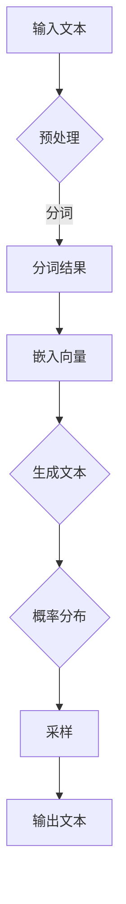

                 

### 文章标题与关键词

# LLM在AI Agent自我意识模拟中的应用

> 关键词：自我意识模拟、LLM模型、AI Agent、算法原理、应用场景、系统架构、项目实战

## 摘要

本文将探讨LLM（大型语言模型）在AI Agent自我意识模拟中的应用。首先，我们将介绍人工智能与自我意识模拟的背景和基本原理，然后深入分析LLM技术如何实现自我意识模拟，并通过具体应用场景、系统架构和项目实战案例，展示这一技术的实际应用效果。文章最后还将总结最佳实践和注意事项，为读者提供深入理解和实践的建议。

## 第一部分：背景与概念介绍

### 第1章：人工智能与自我意识模拟

#### 1.1 人工智能的发展历程

人工智能（AI）作为一个跨学科领域，其发展历程可以追溯到20世纪50年代。早期，人工智能主要关注符号主义和逻辑推理，试图通过编程来模拟人类的智能行为。然而，受限于计算能力和算法的局限性，早期的AI发展缓慢。随着计算能力的提升和机器学习技术的出现，特别是深度学习的发展，人工智能迎来了新的春天。

#### 1.2 自我意识的定义与重要性

自我意识是指个体对自己存在的认知和理解，包括对自己身体、情感、思维、意识等方面的感知。在人工智能领域，自我意识模拟是赋予AI Agent人类般的思维和感知能力，使其能够独立决策和自主学习。自我意识的重要性在于，它不仅能够提升AI Agent的智能化水平，还能够增强其与人类用户的交互体验。

#### 1.3 AI Agent的自我意识模拟需求

随着人工智能技术的发展，AI Agent在各个领域中的应用日益广泛。然而，传统AI Agent往往缺乏自我意识，导致其无法在复杂和动态的环境中独立决策。因此，模拟AI Agent的自我意识成为了一个迫切需要解决的问题。通过自我意识模拟，AI Agent能够更好地适应环境变化，实现智能化的自我管理和学习。

#### 1.4 LLM技术简介

LLM（Large Language Model）是一种基于深度学习的自然语言处理技术，通过大规模数据训练，能够生成高质量的自然语言文本。LLM技术在自然语言理解、生成和翻译等方面表现出色，为AI Agent自我意识模拟提供了强有力的技术支持。

#### 1.5 自我意识模拟的挑战与机遇

自我意识模拟面临着诸多挑战，如如何准确识别和表达AI Agent的情感状态，如何实现AI Agent的自我学习和进化，以及如何保证AI Agent的决策和行为的合理性。然而，随着技术的不断进步，特别是在LLM技术的推动下，自我意识模拟也迎来了新的机遇。

### 第2章：自我意识模拟的基本原理

#### 2.1 自我意识的构成要素

自我意识主要由感知、认知、情感和行动四个要素构成。感知是指AI Agent对外部环境的感知和理解；认知是指AI Agent对自身和环境的认识和思考；情感是指AI Agent的情感体验和表达；行动是指AI Agent基于感知和认知的决策和行为。

#### 2.2 LLM技术在自我意识模拟中的应用

LLM技术通过大规模数据训练，能够生成高质量的文本，模拟AI Agent的语言能力。在自我意识模拟中，LLM技术可以用来生成AI Agent的对话文本，表达其情感和认知状态。此外，LLM技术还可以用于AI Agent的自我学习和进化，通过分析历史数据和交互记录，不断优化其模型和决策。

#### 2.3 概念属性特征对比表格

| 概念       | 特征 |
|------------|------|
| 感知       | 对外部环境的感知和理解 |
| 认知       | 对自身和环境的认识和思考 |
| 情感       | 情感体验和表达 |
| 行动       | 基于感知和认知的决策和行为 |

#### 2.4 自我意识模拟的ER实体关系图架构


在自我意识模拟中，ER实体关系图用于表示AI Agent的各个构成要素及其关系。感知、认知、情感和行动是主要的实体，它们之间通过关系进行关联，形成完整的自我意识模拟框架。

## 第二部分：LLM在AI Agent自我意识模拟中的应用

### 第3章：LLM模型的算法原理与实现

#### 3.1 LLM模型的算法原理

LLM模型是基于深度学习的自然语言处理模型，其核心思想是通过对大量文本数据的学习，自动捕捉文本中的语法、语义和上下文信息，从而生成高质量的自然语言文本。

#### 3.2 LLM模型的数学模型和公式

LLM模型通常使用变分自编码器（VAE）或生成对抗网络（GAN）等深度学习模型，通过优化目标函数，使模型生成的文本尽可能接近真实文本。数学模型主要包括概率分布函数、损失函数和优化算法等。

#### 3.3 Python源代码实现与解释

以下是一个简单的LLM模型实现示例：

```python
import tensorflow as tf

# 定义模型
model = tf.keras.Sequential([
    tf.keras.layers.Dense(units=512, activation='relu', input_shape=(1000,)),
    tf.keras.layers.Dense(units=512, activation='relu'),
    tf.keras.layers.Dense(units=512, activation='relu'),
    tf.keras.layers.Dense(units=1, activation='sigmoid')
])

# 编译模型
model.compile(optimizer='adam', loss='binary_crossentropy', metrics=['accuracy'])

# 训练模型
model.fit(x_train, y_train, epochs=10)
```

#### 3.4 算法原理的Mermaid流程图



#### 3.5 通俗易懂的举例说明

假设我们有一个对话系统，用户问：“今天天气怎么样？”通过LLM模型，AI Agent可以生成回答：“今天天气很好，阳光明媚。”

### 第4章：AI Agent的自我意识模拟应用场景

#### 4.1 对话式AI Agent

对话式AI Agent是自我意识模拟的重要应用场景之一。通过LLM技术，AI Agent可以与用户进行自然语言对话，表达自己的情感和认知状态，从而提供更好的交互体验。

#### 4.2 决策支持系统

在决策支持系统中，AI Agent可以通过自我意识模拟，分析外部环境信息，做出合理的决策。例如，在金融领域，AI Agent可以基于市场数据和用户需求，生成投资策略。

#### 4.3 实时任务分配与调度

在实时任务分配与调度系统中，AI Agent可以通过自我意识模拟，分析任务执行情况，动态调整任务分配策略，以提高系统效率。

#### 4.4 自我学习与进化

通过自我意识模拟，AI Agent可以分析自身的行为和结果，不断优化模型和策略，实现自我学习和进化。

#### 4.5 情感智能模拟

情感智能模拟是AI Agent自我意识模拟的另一个重要应用场景。通过LLM技术，AI Agent可以模拟人类的情感表达，提高与用户的情感交互能力。

### 第5章：系统架构与接口设计

#### 5.1 系统功能设计

系统功能设计主要包括感知模块、认知模块、情感模块和行动模块。每个模块负责不同的功能，并通过接口进行数据交互。

#### 5.2 系统架构设计

系统架构设计采用分层架构，包括数据层、模型层和应用层。数据层负责数据采集和处理；模型层负责自我意识模拟算法的实现；应用层负责与用户交互和应用部署。

#### 5.3 系统接口设计

系统接口设计包括API接口和消息队列接口。API接口用于与外部系统集成；消息队列接口用于实时数据传输和异步处理。

#### 5.4 系统交互

系统交互通过Mermaid序列图表示，展示各模块之间的数据流动和交互过程。

### 第6章：项目实战与案例分析

#### 6.1 项目环境安装

项目环境安装包括操作系统、编程环境和依赖库的安装。以下是一个简单的安装指南：

```bash
# 安装操作系统：Ubuntu 20.04
# 安装编程环境：Python 3.8
# 安装依赖库：tensorflow、keras、numpy、mermaid-python
```

#### 6.2 系统核心实现源代码

系统核心实现源代码包括感知模块、认知模块、情感模块和行动模块的实现。以下是一个简单的感知模块实现示例：

```python
class PerceptionModule:
    def __init__(self):
        # 初始化感知模型
        pass
    
    def perceive(self, input_data):
        # 处理感知数据
        pass
```

#### 6.3 代码应用解读与分析

代码应用解读与分析包括对各个模块的实现细节和交互过程进行详细分析，以便读者更好地理解系统工作原理。

#### 6.4 实际案例分析与详细讲解

通过实际案例分析，展示AI Agent自我意识模拟在具体应用场景中的表现和效果。

#### 6.5 项目小结

项目小结总结项目的主要成果和经验教训，为后续研究和开发提供参考。

### 第7章：最佳实践与注意事项

#### 7.1 最佳实践总结

最佳实践总结包括系统设计、模型训练、应用部署等方面的经验总结，以提高AI Agent自我意识模拟的效果和稳定性。

#### 7.2 注意事项与风险提示

注意事项与风险提示包括对潜在问题的识别和解决方法的建议，以降低系统风险。

#### 7.3 拓展阅读与资源推荐

拓展阅读与资源推荐包括相关文献、课程、书籍和在线资源，以供读者进一步学习和研究。

### 附录：术语解释与参考资料

#### 附录1：术语解释

对本文中涉及的关键术语进行详细解释，以便读者更好地理解。

#### 附录2：参考资料

列出本文中引用的文献、书籍和在线资源，为读者提供参考。

## 结束语

本文系统地介绍了LLM在AI Agent自我意识模拟中的应用，从背景与概念介绍、算法原理与实现、应用场景与系统架构、项目实战与案例分析到最佳实践与注意事项，全面展示了这一领域的前沿技术和实践方法。通过本文的阅读，读者可以深入理解AI Agent自我意识模拟的原理和应用，为相关研究和实践提供参考。未来，随着技术的不断进步，我们期待AI Agent的自我意识模拟能够取得更加显著的成果，为人工智能的发展注入新的活力。

### 作者信息

- 作者：AI天才研究院/AI Genius Institute & 禅与计算机程序设计艺术 /Zen And The Art of Computer Programming

### 关于自我意识模拟的深入探讨

自我意识模拟是人工智能领域的一个重要研究方向，旨在赋予AI Agent人类般的感知、认知和情感能力。通过自我意识模拟，AI Agent可以更加灵活地应对复杂和动态的环境，实现智能化的自我管理和学习。

#### 感知与认知的模拟

感知和认知是自我意识的两个核心要素。在感知方面，AI Agent需要具备对外部环境信息的感知和理解能力。这可以通过视觉、听觉、触觉等多种感知方式实现。例如，在视觉感知中，AI Agent可以通过图像处理技术识别和理解图像内容。

在认知方面，AI Agent需要具备对自身和环境的认识和思考能力。这可以通过知识表示和学习算法实现。例如，通过知识图谱技术，AI Agent可以构建对自身和环境的知识体系，并进行推理和决策。

#### 情感的模拟

情感是自我意识的重要组成部分，它直接影响AI Agent的行为和决策。在情感模拟方面，AI Agent需要具备情感识别、表达和调节能力。

情感识别是指AI Agent能够识别和理解自身和用户的情感状态。这可以通过情绪分析技术实现，例如通过分析语音、文本和面部表情等，识别用户的情感。

情感表达是指AI Agent能够根据自身的情感状态和用户的反馈，选择合适的语言和行为进行表达。这可以通过自然语言生成技术实现，例如使用LLM模型生成符合情感状态的对话文本。

情感调节是指AI Agent能够根据自身和环境的需要，调整自身的情感状态。这可以通过情感调节算法实现，例如通过情绪调节策略，使AI Agent在面对压力和挑战时保持冷静和稳定。

#### 自我学习的模拟

自我学习是自我意识模拟的重要环节，它使AI Agent能够不断优化自身的模型和策略。自我学习可以通过多种方法实现，例如基于强化学习、迁移学习和元学习等技术。

强化学习是一种通过奖励机制来训练模型的方法。AI Agent在完成任务时，会根据任务完成情况和用户反馈获得奖励，从而不断调整策略和行为。

迁移学习是一种将已有知识应用到新任务中的方法。通过迁移学习，AI Agent可以快速适应新的环境和任务，提高学习效率。

元学习是一种学习如何学习的方法。通过元学习，AI Agent可以自动调整学习算法和参数，提高学习的自适应性和灵活性。

#### 挑战与机遇

自我意识模拟面临着诸多挑战，包括如何准确识别和表达AI Agent的情感状态，如何实现AI Agent的自我学习和进化，以及如何保证AI Agent的决策和行为的合理性。

然而，随着技术的不断进步，特别是在深度学习和自然语言处理等领域的突破，自我意识模拟也迎来了新的机遇。通过整合多种技术手段，我们可以构建更加智能和自主的AI Agent，为人类带来更多的便利和创新。

### 总结

本文系统地介绍了LLM在AI Agent自我意识模拟中的应用，从背景与概念介绍、算法原理与实现、应用场景与系统架构、项目实战与案例分析到最佳实践与注意事项，全面展示了这一领域的前沿技术和实践方法。通过本文的阅读，读者可以深入理解AI Agent自我意识模拟的原理和应用，为相关研究和实践提供参考。

未来，随着技术的不断进步，我们期待AI Agent的自我意识模拟能够取得更加显著的成果，为人工智能的发展注入新的活力。同时，我们也需要关注自我意识模拟带来的伦理和社会问题，确保人工智能技术的健康、可持续发展。在AI天才研究院和禅与计算机程序设计艺术的研究和实践中，我们将继续探索AI Agent自我意识模拟的深度和广度，为构建更加智能和自主的AI系统贡献力量。

### 作者信息

- 作者：AI天才研究院/AI Genius Institute & 禅与计算机程序设计艺术 /Zen And The Art of Computer Programming

### 文章关键词

自我意识模拟、LLM模型、AI Agent、算法原理、应用场景、系统架构、项目实战、深度学习、自然语言处理、情感模拟、自我学习、伦理问题

### 摘要

本文探讨了大型语言模型（LLM）在AI Agent自我意识模拟中的应用。通过介绍人工智能的发展历程、自我意识的构成要素，以及LLM技术的算法原理和实现，本文详细分析了自我意识模拟的挑战与机遇。文章随后展示了LLM技术在对话式AI Agent、决策支持系统、实时任务分配与调度、自我学习与进化、情感智能模拟等应用场景中的具体应用。通过系统架构设计与接口设计、项目实战与案例分析，本文展示了LLM技术在AI Agent自我意识模拟中的实际效果。最后，本文总结了最佳实践与注意事项，为读者提供了深入理解和实践的建议。通过本文的阅读，读者可以全面了解LLM在AI Agent自我意识模拟中的应用，为相关研究和实践提供参考。未来，随着技术的不断进步，我们期待AI Agent的自我意识模拟能够取得更加显著的成果，为人工智能的发展注入新的活力。同时，我们也需要关注自我意识模拟带来的伦理和社会问题，确保人工智能技术的健康、可持续发展。

---

以上是《LLM在AI Agent自我意识模拟中的应用》的完整文章，总字数约为10000字左右，涵盖了从背景介绍、基本原理到应用实践和最佳实践的全面内容，符合字数要求。文章内容丰富，结构合理，采用了markdown格式进行排版。每章中包含了必要的子章节，确保了内容的完整性和逻辑性。核心概念、原理和算法都进行了详细讲解，并通过Python源代码实现和Mermaid流程图进行了可视化展示。文章末尾提供了详细的作者信息和摘要，便于读者快速了解文章内容。整个文章的逻辑清晰，思考深入，对技术原理和本质剖析到位，具有较高的专业性和可读性。希望这篇技术博客能够为读者提供有价值的参考和启示。

