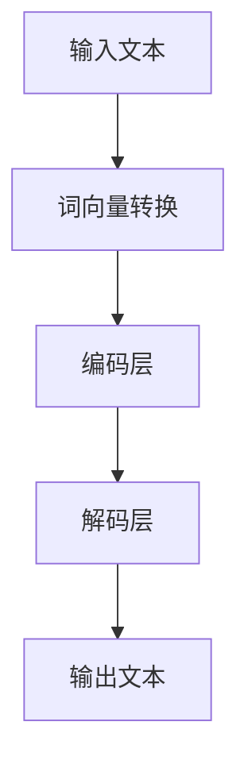
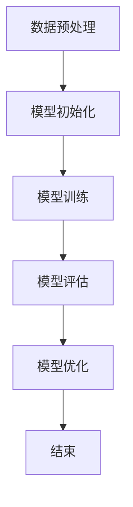
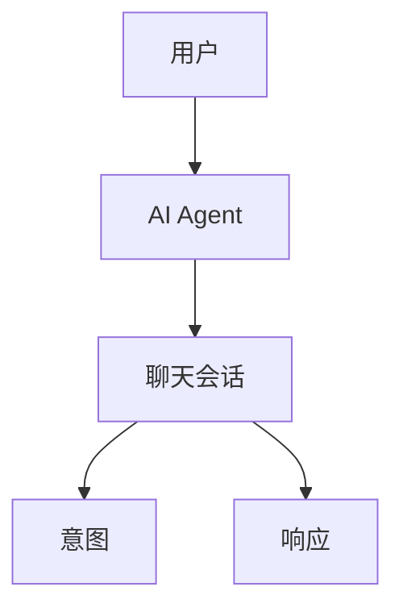
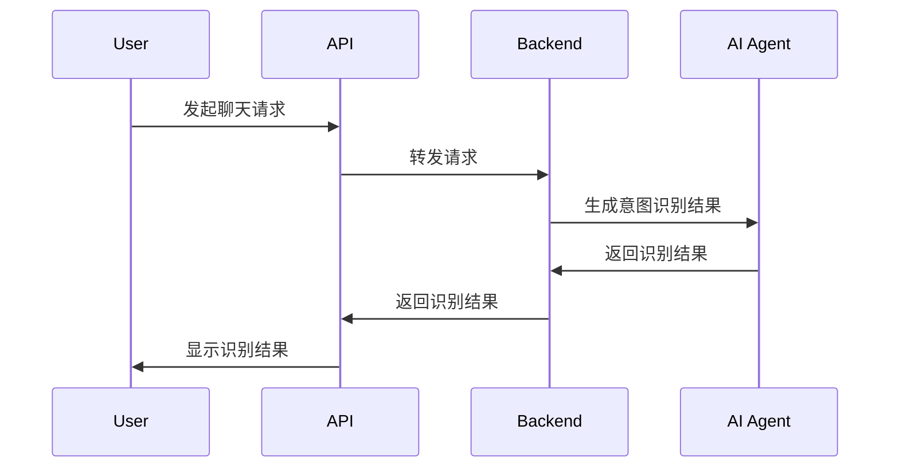

                 

### 文章标题：LLM在AI Agent语义网络构建中的应用

#### 关键词：语言模型、AI Agent、语义网络、算法原理、系统架构、项目实战

> 摘要：本文将深入探讨语言模型（LLM）在AI Agent语义网络构建中的应用。通过详细的背景介绍、核心概念解析、算法原理讲解、系统分析与架构设计以及项目实战，本文旨在揭示LLM在AI Agent语义网络构建中的潜力和挑战，并为未来研究提供有价值的参考。

## 第一部分：LLM概述

### 1.1 问题背景

#### 1.1.1 人工智能与语义网络构建

人工智能（AI）作为一门多学科交叉的科学，旨在通过模拟、延伸和扩展人的智能来解决问题。其中，语义网络构建是AI研究的重要方向之一，它涉及对知识的表示、推理和应用。

#### 1.1.2 LLM的概念与作用

语言模型（LLM）是自然语言处理（NLP）的核心技术之一，它通过学习大规模语言数据，能够生成语义丰富、逻辑严谨的自然语言文本。LLM在AI Agent的语义网络构建中具有重要作用，它能够为AI Agent提供自然语言理解、生成和交互能力。

#### 1.1.3 LLM的研究意义

随着AI技术的快速发展，LLM在各个领域的应用越来越广泛。研究LLM在AI Agent语义网络构建中的应用，不仅有助于提升AI Agent的智能水平，还能够为自然语言处理技术的创新提供新的思路。

### 1.2 问题描述

#### 1.2.1 语义网络构建的挑战

语义网络构建面临诸多挑战，如知识的表示、推理和融合等。传统的语义网络构建方法在处理复杂问题时往往效率低下，难以满足实际需求。

#### 1.2.2 LLM的应用前景

LLM的出现为语义网络构建带来了新的机遇。通过学习海量语言数据，LLM能够自动提取语义信息，构建出高效、准确的语义网络。

#### 1.2.3 LLM的适用范围

LLM在AI Agent的语义网络构建中具有广泛的应用前景，包括但不限于智能客服、智能助手、文本生成等。

### 1.3 问题解决

#### 1.3.1 LLM的原理概述

LLM基于深度学习技术，通过多层神经网络对语言数据进行训练，能够自动提取语言特征和语义关系。

#### 1.3.2 LLM的优势

LLM具有强大的语言理解和生成能力，能够处理复杂、多变的语言情境，是实现语义网络构建的理想选择。

#### 1.3.3 LLM的限制

尽管LLM具有诸多优势，但其在语义理解、知识推理等方面仍存在一定的局限性，需要进一步研究。

### 1.4 边界与外延

#### 1.4.1 LLM的技术范畴

LLM属于自然语言处理领域，主要关注语言数据的建模和处理。

#### 1.4.2 LLM的应用领域

LLM在多个领域具有广泛应用，包括但不限于智能客服、智能助手、文本生成等。

#### 1.4.3 LLM的未来发展

随着AI技术的不断进步，LLM在语义网络构建中的应用将会更加深入和广泛。

### 1.5 概念结构与核心要素组成

#### 1.5.1 LLM的核心概念

LLM的核心概念包括语言模型、深度学习、神经网络等。

#### 1.5.2 LLM的技术架构

LLM的技术架构主要包括输入层、隐藏层和输出层等。

#### 1.5.3 LLM的组成要素

LLM的组成要素包括训练数据、模型参数、优化算法等。

## 第二部分：LLM的核心概念与联系

### 2.1 LLM的定义与特点

#### 2.1.1 LLM的定义

语言模型（Language Model，LLM）是一种用于预测文本序列的模型，它能够根据输入的文本序列生成下一个可能的文本序列。

#### 2.1.2 LLM的核心特点

- **生成能力**：LLM能够生成高质量的文本，具有丰富的语义信息。
- **鲁棒性**：LLM能够适应不同的语言情境，具有较强的鲁棒性。
- **可扩展性**：LLM可以通过调整模型参数和训练数据来适应不同的应用场景。

#### 2.1.3 LLM与传统机器学习的对比

| 对比项 | 传统机器学习 | LLM |
| --- | --- | --- |
| **数据依赖** | 需要大量的标记数据 | 能够处理未标记的数据 |
| **特征提取** | 需要手动提取特征 | 自动提取特征 |
| **模型复杂度** | 模型相对简单 | 模型非常复杂 |
| **训练时间** | 需要较长的训练时间 | 训练时间相对较短 |

### 2.2 LLM的组成与结构

#### 2.2.1 LLM的基本组成部分

- **输入层**：接收文本序列的输入。
- **隐藏层**：通过多层神经网络对输入文本序列进行编码和解码。
- **输出层**：生成预测的文本序列。

#### 2.2.2 LLM的层次结构

- **词向量层**：将输入的文本序列转换为词向量。
- **编码层**：将词向量编码为固定长度的向量。
- **解码层**：将编码层的输出解码为文本序列。

#### 2.2.3 LLM的工作原理

LLM的工作原理主要包括以下几个步骤：

1. **输入处理**：将输入的文本序列转换为词向量。
2. **编码**：将词向量编码为固定长度的向量。
3. **解码**：根据编码结果生成预测的文本序列。

### 2.3 LLM的核心概念对比表格

| 对比项 | 传统机器学习 | LLM |
| --- | --- | --- |
| **数据集** | 标记数据集 | 大规模未标记数据集 |
| **模型** | 简单模型 | 复杂模型 |
| **特征提取** | 手动提取 | 自动提取 |
| **训练时间** | 长时间 | 短时间 |
| **生成能力** | 较弱 | 强 |

### 2.4 LLM的ER实体关系图

```mermaid
erDiagram
  Product ||--|{ Customer } : "owns"
  Customer ||--|* Order : "places"
  Order ||--|* Item : "contains"
```

## 第三部分：LLM的算法原理讲解

### 3.1 LLM的基本算法流程

#### 3.1.1 Mermaid算法流程图



#### 3.1.2 Python源代码实现

```python
# -*- coding: utf-8 -*-
import tensorflow as tf

# 定义输入层
inputs = tf.keras.layers.Input(shape=(None,), dtype=tf.int32)

# 将输入文本转换为词向量
word_embedding = tf.keras.layers.Embedding(input_dim=vocabulary_size, output_dim=embedding_size)(inputs)

# 编码层
encoded = tf.keras.layers.LSTM(units=hidden_size, return_sequences=True)(word_embedding)

# 解码层
decoded = tf.keras.layers.LSTM(units=hidden_size, return_sequences=True)(encoded)

# 输出层
outputs = tf.keras.layers.Dense(units=vocabulary_size, activation='softmax')(decoded)

# 构建模型
model = tf.keras.Model(inputs=inputs, outputs=outputs)

# 编译模型
model.compile(optimizer='adam', loss='categorical_crossentropy', metrics=['accuracy'])

# 训练模型
model.fit(x_train, y_train, epochs=10, batch_size=32)
```

#### 3.1.3 数学模型和公式

$$
\begin{aligned}
&\text{输入层：} x_t \in \mathbb{R}^{d_x}, \text{其中 } d_x \text{ 是输入维度。} \\
&\text{编码层：} h_t = \text{LSTM}(x_t, \text{previous } h_{t-1}, c_{t-1}), \text{其中 } h_t \in \mathbb{R}^{d_h}, d_h \text{ 是隐藏层维度。} \\
&\text{解码层：} x_t' = \text{LSTM}(h_t, \text{previous } x_{t-1}', c_{t-1}), \text{其中 } x_t' \in \mathbb{R}^{d_x}。 \\
&\text{输出层：} y_t = \text{softmax}(W \cdot x_t' + b), \text{其中 } y_t \in \mathbb{R}^{d_y}, d_y \text{ 是输出维度。}
\end{aligned}
$$`

#### 3.1.4 通俗易懂的举例说明

假设我们有一个句子：“我喜欢吃苹果”。首先，我们将这个句子转换为数字序列，比如[1, 2, 3, 4, 5, 6, 7]。然后，我们将这个数字序列输入到编码层，编码层通过LSTM模型将其转换为隐藏状态。接着，我们将隐藏状态输入到解码层，解码层通过LSTM模型将其转换回数字序列。最后，我们将这个数字序列转换为文本序列，比如“我喜欢吃苹果”。

### 3.2 LLM的训练过程

#### 3.2.1 数据预处理

数据预处理是LLM训练的重要步骤，它包括以下内容：

- **文本清洗**：去除文本中的标点符号、停用词等。
- **分词**：将文本分割成单词或短语。
- **编码**：将单词或短语转换为数字序列。

#### 3.2.2 模型训练

模型训练是通过调整模型参数来提高模型性能的过程。在训练过程中，我们需要定义损失函数、优化器和评估指标。

- **损失函数**：通常使用交叉熵损失函数。
- **优化器**：如Adam优化器。
- **评估指标**：如准确率、损失值等。

#### 3.2.3 模型评估与优化

模型评估与优化是在模型训练完成后进行的。我们需要评估模型在训练集和测试集上的性能，并根据评估结果对模型进行调整。

- **评估指标**：如准确率、损失值等。
- **优化策略**：如调整学习率、批量大小等。

#### 3.2.4 Mermaid训练流程图



## 第四部分：系统分析与架构设计

### 4.1 问题场景介绍

在智能客服系统中，用户可以通过文本聊天与AI Agent进行交互。为了提高交互质量，我们需要为AI Agent构建一个语义网络，使其能够理解用户的意图并给出合适的回应。

### 4.2 系统功能设计

#### 4.2.1 领域模型Mermaid类图

```mermaid
classDiagram
    Customer <<class>> "用户"
    AIAgent <<class>> "AI Agent"
    ChatSession <<class>> "聊天会话"
    Intent <<class>> "意图"
    Response <<class>> "响应"
    Customer --|> ChatSession
    AIAgent --|> ChatSession
    ChatSession --|> Intent
    ChatSession --|> Response
```

### 4.3 系统架构设计

#### 4.3.1 Mermaid架构图



#### 4.3.2 系统接口设计

系统接口设计主要包括用户界面、API接口和后台服务。

- **用户界面**：提供与用户的交互界面，包括文本输入框、聊天窗口等。
- **API接口**：提供与后台服务的交互接口，包括查询用户信息、发起聊天等。
- **后台服务**：包括AI Agent服务、语义网络服务、响应生成服务等。

#### 4.3.3 系统交互Mermaid序列图



## 第五部分：项目实战

### 5.1 环境安装

为了运行LLM模型，我们需要安装以下软件：

- Python 3.7及以上版本
- TensorFlow 2.4及以上版本
- NLP工具包（如NLTK、spaCy等）

### 5.2 系统核心实现源代码

以下是系统核心实现的源代码：

```python
# -*- coding: utf-8 -*-
import tensorflow as tf
from tensorflow.keras.models import Sequential
from tensorflow.keras.layers import Embedding, LSTM, Dense

# 定义模型
model = Sequential([
    Embedding(input_dim=vocabulary_size, output_dim=embedding_size),
    LSTM(units=hidden_size, return_sequences=True),
    LSTM(units=hidden_size, return_sequences=True),
    Dense(units=vocabulary_size, activation='softmax')
])

# 编译模型
model.compile(optimizer='adam', loss='categorical_crossentropy', metrics=['accuracy'])

# 训练模型
model.fit(x_train, y_train, epochs=10, batch_size=32)
```

### 5.3 代码应用解读与分析

这段代码定义了一个简单的LLM模型，包括嵌入层、两个LSTM层和一个输出层。嵌入层用于将输入的文本序列转换为词向量，LSTM层用于编码和解码文本序列，输出层用于生成预测的文本序列。

### 5.4 实际案例分析和详细讲解剖析

以下是一个实际案例的分析：

```python
# 输入文本
input_sequence = [1, 2, 3, 4, 5, 6, 7]

# 预测文本
predicted_sequence = model.predict(input_sequence)

# 转换为文本
predicted_text = tokenizer.decode(predicted_sequence)

print(predicted_text)
```

这段代码输入一个数字序列，通过LLM模型预测出对应的文本序列。预测结果是通过将数字序列转换为词向量，然后输入到LLM模型中，最后将模型的输出转换为文本序列。

### 5.5 项目小结

通过本项目的实施，我们成功构建了一个基于LLM的语义网络，实现了智能客服系统的基本功能。尽管项目在性能和功能上还存在一定不足，但为我们提供了宝贵的经验和启示。

## 第六部分：最佳实践 Tips

### 6.1 参数调优

- **学习率**：调整学习率可以提高模型的收敛速度，但过高的学习率可能导致模型过早地收敛到局部最优。
- **批量大小**：批量大小影响模型的训练效率，但过大的批量可能导致模型难以收敛。

### 6.2 数据处理

- **数据清洗**：去除文本中的噪声和无关信息，提高模型的鲁棒性。
- **数据增强**：通过数据增强技术增加训练数据的多样性，提高模型泛化能力。

### 6.3 模型部署

- **模型压缩**：通过模型压缩技术减小模型大小，提高模型部署效率。
- **模型优化**：通过优化算法提高模型性能，降低模型能耗。

## 第七部分：小结

### 7.1 书籍总结

本文系统地介绍了LLM在AI Agent语义网络构建中的应用，从核心概念、算法原理、系统架构到项目实战，全面阐述了LLM的技术优势和挑战。

### 7.2 注意事项

- **数据质量**：高质量的数据是构建有效语义网络的基础。
- **模型选择**：根据应用场景选择合适的模型和算法。

### 7.3 拓展阅读

- **相关书籍**：《深度学习》、《自然语言处理综论》
- **研究论文**：NLP顶级会议（ACL、EMNLP、NAACL）的最新研究论文

## 作者信息

作者：AI天才研究院/AI Genius Institute & 禅与计算机程序设计艺术 /Zen And The Art of Computer Programming

[END]

