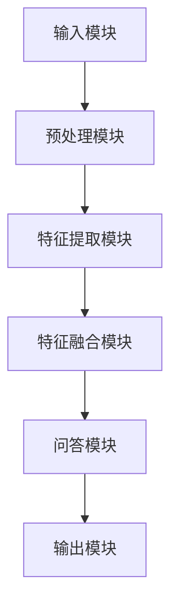

                 

# LLM在AI Agent跨模态理解中的应用

## 关键词

- 语言模型（LLM）
- 跨模态理解
- AI Agent
- 多模态问答
- 视频理解

## 摘要

随着人工智能技术的不断发展，语言模型（LLM）在AI Agent跨模态理解中的应用日益受到关注。本文将探讨LLM的基本概念、跨模态理解的重要性，以及LLM在多模态问答系统和视频理解中的应用。同时，还将分析跨模态理解中的挑战与解决方案，并给出LLM在跨模态理解中的最佳实践。通过本文的阐述，读者可以了解到LLM在AI Agent跨模态理解中的重要性和实际应用价值。

## 目录大纲

1. 第一部分：LLM在AI Agent跨模态理解中的应用概述
    - 第1章：LLM与跨模态理解概述
        - 1.1.1 LLM的基本概念与原理
        - 1.1.2 跨模态理解的概念与重要性
        - 1.1.3 跨模态理解的挑战与机遇
    - 第2章：跨模态数据的处理方法
        - 2.1.1 跨模态数据采集与清洗
        - 2.1.2 跨模态数据的特征提取
    - 第3章：LLM在跨模态理解中的应用
        - 3.1.1 LLM在多模态问答系统中的应用
        - 3.1.2 LLM在跨模态视频理解中的应用
    - 第4章：跨模态理解中的挑战与解决方案
        - 4.1.1 数据集不足与数据增强
        - 4.1.2 模型解释性与可解释性
    - 第5章：LLM在跨模态理解中的最佳实践
        - 5.1.1 LLM在跨模态理解中的实际应用
        - 5.1.2 跨模态理解中的技术趋势
    - 第6章：LLM在跨模态理解中的编程实践
        - 6.1.1 环境搭建与准备工作
        - 6.1.2 实现一个简单的跨模态问答系统
    - 第7章：总结与展望
        - 7.1.1 LLM在跨模态理解中的贡献与影响
        - 7.1.2 未来发展趋势与挑战

----------------------------------------------------------------

### 第一部分：LLM在AI Agent跨模态理解中的应用概述

#### 第1章：LLM与跨模态理解概述

##### 1.1.1 LLM的基本概念与原理

语言模型（Language Model，简称LLM）是一种基于神经网络的自然语言处理模型，能够对输入的文本序列进行建模和预测。LLM的核心技术主要包括预训练和微调。

###### 1.1.1.1 LLM的定义与发展历程

LLM的定义源于自然语言处理（Natural Language Processing，简称NLP）领域，它是一种通过学习大量文本数据来预测下一个词语或句子的模型。LLM的发展历程可以追溯到20世纪50年代，当时研究人员开始探索如何使用计算机来处理和理解自然语言。

在最初的几十年里，LLM主要依赖于规则和统计方法。然而，随着深度学习技术的兴起，神经网络在自然语言处理领域取得了突破性的进展。2003年，BBC报道了深度学习在语音识别中的应用，这标志着神经网络在NLP领域的崛起。2018年，谷歌发布了BERT（Bidirectional Encoder Representations from Transformers），这是一种基于Transformer的预训练模型，标志着LLM的发展进入了一个新的阶段。

###### 1.1.1.2 LLM的核心技术：预训练与微调

LLM的核心技术包括预训练和微调。预训练是指使用大规模语料库对神经网络模型进行训练，使其能够捕捉到语言的内在结构和语义信息。微调则是在预训练的基础上，针对特定任务对模型进行进一步优化。

预训练阶段通常包括两个步骤：首先是大规模文本数据的预处理，包括分词、词向量编码等；然后是使用预训练模型对文本数据进行训练，使其能够生成高质量的语言表示。

微调阶段则是在预训练模型的基础上，针对特定任务进行优化。例如，在问答任务中，可以使用问答对数据对模型进行微调，使其能够更好地理解和回答问题。

###### 1.1.1.3 LLM的应用现状与挑战

目前，LLM在自然语言处理领域已经取得了显著的成果，如机器翻译、情感分析、文本生成等。然而，LLM也面临一些挑战，主要包括：

1. **数据隐私**：大规模的预训练数据集可能涉及用户隐私，如何在保护用户隐私的前提下进行数据收集和处理是一个重要问题。
2. **模型可解释性**：由于LLM是一个复杂的黑盒模型，如何解释模型的决策过程和预测结果是一个关键问题。
3. **资源消耗**：大规模的预训练和微调过程需要大量的计算资源和时间，这对研究和应用带来了一定的挑战。

##### 1.1.2 跨模态理解的概念与重要性

跨模态理解是指将不同模态（如文本、图像、声音等）的信息进行融合和理解的过程。它涉及到多个学科领域，如计算机视觉、自然语言处理、语音识别等。

###### 1.1.2.1 跨模态理解的基本原理

跨模态理解的基本原理是通过将不同模态的信息进行映射和融合，从而实现对复杂场景的全面理解。具体来说，包括以下几个步骤：

1. **特征提取**：从不同模态的数据中提取特征表示，如文本的词向量、图像的视觉特征、声音的音频特征等。
2. **特征融合**：将不同模态的特征进行融合，生成一个统一的特征表示。
3. **模型训练**：使用融合后的特征对模型进行训练，使其能够理解和处理多模态数据。

###### 1.1.2.2 跨模态理解的应用场景

跨模态理解在许多应用场景中具有重要价值，如：

1. **多模态问答系统**：通过将文本问题和图像、声音等模态的信息进行融合，实现更加丰富和准确的问题回答。
2. **视频理解**：通过对视频中的图像、声音和文本信息进行融合，实现视频内容的理解和分析。
3. **智能交互**：通过跨模态理解，实现人与机器之间的自然交互。

###### 1.1.2.3 跨模态理解的挑战与机遇

跨模态理解面临一些挑战，如：

1. **模态差异**：不同模态的数据具有不同的特性和分布，如何有效地融合这些差异是一个难题。
2. **数据稀缺**：高质量的跨模态数据集较为稀缺，这对模型的训练和评估带来了一定的困难。
3. **计算资源消耗**：跨模态理解的模型通常较为复杂，需要大量的计算资源和时间。

然而，跨模态理解也带来了许多机遇，如：

1. **多模态融合**：通过跨模态理解，可以实现对复杂场景的全面理解和分析。
2. **智能交互**：通过跨模态理解，可以实现更加自然和智能的人机交互。

##### 1.1.3 跨模态理解的挑战与机遇

跨模态理解在AI领域具有广泛的应用前景，但也面临一些挑战：

1. **数据稀缺与不平衡**：跨模态数据集往往稀缺且不平衡，难以支持大规模模型的训练。
2. **特征融合与一致性**：如何有效地融合不同模态的特征，并保持其一致性是一个难题。
3. **模型可解释性**：跨模态理解的模型通常较为复杂，其决策过程和预测结果难以解释。

尽管如此，跨模态理解也为AI Agent带来了许多机遇：

1. **多模态交互**：通过跨模态理解，AI Agent可以实现与用户的多模态交互，提高用户体验。
2. **复杂场景理解**：跨模态理解使得AI Agent能够更好地理解和处理复杂场景，提高其智能水平。

综上所述，LLM在AI Agent跨模态理解中具有重要的作用，通过不断的研究和实践，我们可以克服其中的挑战，充分发挥其潜力。在接下来的章节中，我们将深入探讨LLM在跨模态理解中的应用，包括跨模态数据的处理方法和具体应用案例。

----------------------------------------------------------------

### 第二部分：跨模态数据的处理方法

#### 第2章：跨模态数据的处理方法

##### 2.1.1 跨模态数据采集与清洗

跨模态数据的采集与清洗是进行跨模态理解研究的基础工作。高质量的数据集能够为模型的训练提供有力支持，而数据清洗则是确保数据质量的关键步骤。

###### 2.1.1.1 数据采集方法

跨模态数据的采集可以通过以下几种方式：

1. **公开数据集**：许多公开数据集如ImageNet、COCO等提供了丰富的多模态数据，可以直接用于研究。
2. **合成数据**：通过合成方法生成多模态数据，如文本与图像的配对，可以补充现有数据集的不足。
3. **自动采集**：利用网络爬虫等技术自动采集多模态数据，但需要注意数据来源的合法性和数据的质量。

在采集数据时，需要考虑数据的多模态一致性，确保不同模态之间的数据能够有效融合。

###### 2.1.1.2 数据清洗与预处理

数据清洗与预处理是确保数据质量的重要步骤，主要包括以下内容：

1. **数据去重**：去除重复的数据，避免模型训练时产生冗余信息。
2. **数据修复**：修复数据中的错误或不完整信息，如文本中的错别字、图像中的噪声等。
3. **数据归一化**：对数据进行归一化处理，如文本的分词、图像的缩放等，以便模型能够更好地处理。
4. **数据增强**：通过旋转、裁剪、缩放等手段增加数据多样性，提高模型的泛化能力。

##### 2.1.2 跨模态数据的特征提取

特征提取是将多模态数据转化为适合模型处理的特征表示的关键步骤。不同模态的数据具有不同的特征提取方法，以下分别介绍：

###### 2.1.2.1 音频特征提取

音频特征提取包括时域和频域特征：

1. **时域特征**：如音量、节奏等，可以通过简单的时域变换得到。
2. **频域特征**：如梅尔频率倒谱系数（MFCC）、频谱特征等，可以通过傅里叶变换等方法得到。

MFCC是一种常用的音频特征提取方法，它能够有效捕捉声音的时频特性，常用于语音识别和情感分析等领域。

###### 2.1.2.2 视频特征提取

视频特征提取主要包括视觉特征和运动特征：

1. **视觉特征**：如颜色特征、纹理特征等，可以通过卷积神经网络（CNN）等方法提取。
2. **运动特征**：如光流、运动矢量等，可以通过光流算法或运动估计方法得到。

视觉特征提取在视频分析、视频分类和视频追踪等方面具有重要应用。

###### 2.1.2.3 文本特征提取

文本特征提取包括词向量、句向量等：

1. **词向量**：如Word2Vec、GloVe等，通过将单词映射到高维空间，捕捉词语的语义关系。
2. **句向量**：如BERT、GPT等，通过预训练模型生成句子的向量表示，能够更好地捕捉句子的语义信息。

文本特征提取在文本分类、文本生成和问答系统等方面具有广泛应用。

##### 2.1.3 跨模态数据的特征融合

特征融合是将不同模态的特征进行整合，以生成统一的特征表示。常见的特征融合方法包括：

1. **拼接**：将不同模态的特征直接拼接在一起，生成多维特征向量。
2. **加权融合**：根据不同模态的特征重要程度，对特征进行加权融合。
3. **多任务学习**：在特征提取过程中，同时训练多个任务，使得特征能够在多个任务中共享信息。

特征融合的效果对跨模态理解的质量具有重要影响，有效的特征融合方法能够提高模型的性能。

在接下来的章节中，我们将进一步探讨LLM在跨模态理解中的应用，包括LLM在多模态问答系统和视频理解中的具体应用和实践。

----------------------------------------------------------------

### 第三部分：LLM在跨模态理解中的应用

#### 第3章：LLM在跨模态理解中的应用

##### 3.1.1 LLM在多模态问答系统中的应用

多模态问答系统（Multimodal Question Answering System）是跨模态理解的重要应用场景之一。它能够接收多种模态的输入（如文本、图像、声音等），并生成对应的答案。LLM在多模态问答系统中扮演着关键角色，其强大的语义理解能力和多模态数据融合能力使得系统能够更好地处理复杂的问题。

###### 3.1.1.1 多模态问答系统的架构

一个典型的多模态问答系统可以分为以下几个模块：

1. **输入模块**：接收用户输入的多模态问题，如文本问题、图像描述和音频输入等。
2. **预处理模块**：对输入的多模态数据进行预处理，包括文本的分词、图像的特征提取、音频的时频分析等。
3. **特征融合模块**：将不同模态的特征进行融合，生成统一的特征表示。这一步骤是跨模态理解的核心，它决定了多模态数据的整合效果。
4. **查询模块**：利用融合后的特征，在数据库中检索相关信息。
5. **答案生成模块**：根据检索到的信息，使用LLM生成问题的答案。这一模块通常依赖于预训练的语言模型，如BERT、GPT等。
6. **输出模块**：将生成的答案以文本、图像或音频的形式输出给用户。

###### 3.1.1.2 LLM在多模态问答中的角色

LLM在多模态问答系统中的角色主要体现在以下几个方面：

1. **语义理解**：LLM能够深入理解输入问题的语义，捕捉问题的本质。这对于处理复杂的、多层次的和多模态的输入问题尤为重要。
2. **信息检索**：LLM可以结合多模态特征进行信息检索，从数据库中找到与问题相关的答案。
3. **答案生成**：LLM可以根据检索到的信息生成自然流畅的答案，这使得答案不仅准确，而且具有可读性。

###### 3.1.1.3 实际案例分析

以一个多模态问答系统为例，当用户输入一个包含图像和文本的问题时，系统首先对图像和文本进行预处理。图像经过卷积神经网络（CNN）提取视觉特征，文本经过词向量编码生成语义向量。接着，这些特征被传递给一个融合模型，该模型通过神经网络将图像和文本特征进行融合，生成一个统一的特征向量。然后，LLM使用这个特征向量在知识库中检索相关信息，并生成问题的答案。最后，系统将答案以文本的形式输出给用户。

例如，当用户输入一个文本问题“这个图像中的人在做什么？”以及一个包含该场景的图像时，系统首先提取图像的视觉特征和文本的语义向量，然后将这些特征传递给一个融合模型。融合模型通过神经网络处理这些特征，生成一个统一的特征向量。接着，LLM使用这个特征向量检索知识库中的相关信息，并生成答案，如“这个图像中的人在跑步”。

##### 3.1.2 LLM在跨模态视频理解中的应用

跨模态视频理解（Multimodal Video Understanding）是另一个重要的应用场景，它涉及到从视频中的图像、声音和文本等多模态信息中提取意义。LLM在视频理解中能够发挥重要作用，特别是在视频内容生成、视频分类和情感分析等方面。

###### 3.1.2.1 跨模态视频理解的基本框架

一个典型的跨模态视频理解系统包括以下几个步骤：

1. **视频预处理**：对视频进行预处理，包括帧提取、去噪和增强等。
2. **特征提取**：对视频帧进行特征提取，生成视觉特征。同时，对视频中的音频和文本进行特征提取。
3. **特征融合**：将不同模态的特征进行融合，生成一个统一的特征向量。
4. **语义分析**：利用融合后的特征，对视频内容进行语义分析，如视频分类、情感分析和内容生成等。

###### 3.1.2.2 LLM在视频理解中的应用

LLM在视频理解中的应用主要体现在以下几个方面：

1. **视频内容生成**：LLM可以根据视频中的视觉特征和文本信息生成自然流畅的视频内容。例如，在一个视频编辑系统中，用户可以输入一段视频和一段文本描述，LLM可以根据这些信息生成一个新的视频内容。
2. **视频分类**：LLM可以结合视觉特征和文本信息，对视频进行分类。例如，在一个视频监控系统中，LLM可以根据视频中的图像和音频信息，将视频分类为“运动”、“安静”、“噪音”等。
3. **情感分析**：LLM可以根据视频中的视觉和音频特征，对视频的情感进行分析。例如，在一个视频情感分析系统中，LLM可以根据视频中的图像和音频信息，判断视频的情感为“开心”、“悲伤”、“紧张”等。

###### 3.1.2.3 实际案例分析

以一个视频情感分析系统为例，当用户输入一段视频时，系统首先对视频进行预处理，提取视觉特征和音频特征。然后，这些特征被传递给一个融合模型，该模型通过神经网络将视觉特征和音频特征进行融合，生成一个统一的特征向量。接着，LLM使用这个特征向量分析视频的情感。例如，当视频内容显示一个人在笑时，LLM可以判断视频的情感为“开心”。最后，系统将情感分析结果输出给用户。

例如，当用户输入一个包含欢笑声的视频时，系统首先提取视频的视觉特征和音频特征。视觉特征表示视频中的图像内容，如人的面部表情和动作等；音频特征表示视频中的声音内容，如欢笑声的频率和节奏等。接着，这些特征被传递给一个融合模型，该模型通过神经网络将视觉特征和音频特征进行融合，生成一个统一的特征向量。然后，LLM使用这个特征向量分析视频的情感。由于视频内容显示一个人在笑，LLM可以判断视频的情感为“开心”。最后，系统将情感分析结果“开心”输出给用户。

在接下来的章节中，我们将探讨跨模态理解中的挑战与解决方案，以及LLM在跨模态理解中的最佳实践。

----------------------------------------------------------------

### 第四部分：跨模态理解中的挑战与解决方案

#### 第4章：跨模态理解中的挑战与解决方案

##### 4.1.1 数据集不足与数据增强

跨模态理解的研究和应用面临着数据集不足和数据不平衡的挑战。由于不同模态的数据难以获取和标注，导致高质量的多模态数据集较为稀缺。此外，不同模态的数据往往具有不同的分布，这给模型的训练和评估带来了困难。为了解决这些问题，数据增强成为了一个关键的技术手段。

###### 4.1.1.1 跨模态数据集的现状

当前，许多公开的多模态数据集如COCO、Flickr等，虽然包含了丰富的图像、文本和视频数据，但这些数据集往往存在以下问题：

1. **数据量有限**：多模态数据集的数据量远小于单模态数据集，无法满足大规模模型的训练需求。
2. **数据分布不均**：不同模态的数据分布差异较大，图像和文本数据的比例可能远高于视频数据。
3. **数据标注质量**：多模态数据的标注质量参差不齐，一些数据集可能存在标注错误或缺失。

为了克服这些问题，研究者们正在积极构建和共享更多的多模态数据集，如DukeMTMC、HAR等，同时也在探索如何利用现有的单模态数据集生成多模态数据。

###### 4.1.1.2 数据增强的方法与应用

数据增强是指通过一系列技术手段，增加训练数据集的多样性，从而提升模型的泛化能力和鲁棒性。在跨模态理解中，数据增强可以应用于各个模态的数据，以下是一些常见的数据增强方法：

1. **图像增强**：包括旋转、缩放、裁剪、颜色变换等，这些方法可以增加图像的多样性，提高模型的泛化能力。
2. **文本增强**：包括同义词替换、随机插入、删除和替换句子中的词语等，这些方法可以增加文本的多样性，有助于捕捉文本的语义变化。
3. **音频增强**：包括噪声添加、速度变化、音调变化等，这些方法可以增加音频的多样性，有助于模型学习不同的音频特征。
4. **视频增强**：包括帧插值、视频压缩、视频纹理合成等，这些方法可以增加视频的多样性，有助于模型学习复杂的视频特征。

此外，还有一些跨模态的数据增强方法，如：

1. **多模态融合**：通过融合不同模态的数据，生成新的多模态数据。例如，将图像和文本数据合并生成新的图像描述，或将图像和音频数据合并生成新的视频。
2. **仿生学增强**：通过模拟生物视觉、听觉和触觉等感知机制，生成新的多模态数据。

数据增强不仅能够增加训练数据集的多样性，还可以帮助模型克服模态之间的差异性。例如，在图像和文本的跨模态任务中，图像增强可以生成多样化的图像，而文本增强可以生成多样化的文本描述，这些多样化的数据有助于模型更好地理解图像和文本之间的对应关系。

##### 4.1.2 模型解释性与可解释性

跨模态理解模型的解释性是一个重要的研究课题，因为模型的可解释性有助于理解模型的决策过程，提高模型的信任度和应用价值。然而，跨模态模型通常是由复杂的神经网络构成的，其内部机制难以直观理解，这给模型解释性带来了挑战。

###### 4.1.2.1 模型解释性的重要性

模型解释性的重要性体现在以下几个方面：

1. **信任度**：可解释的模型能够向用户展示其决策过程，提高用户对模型的信任度。
2. **调试**：通过解释模型的工作机制，可以更方便地调试和优化模型。
3. **透明度**：可解释的模型能够提供更高的透明度，有助于监管和合规要求。
4. **公平性**：可解释的模型可以帮助识别和消除潜在的偏见，提高模型的公平性。

###### 4.1.2.2 可解释性方法与工具

目前，已有多种方法和技术用于提高跨模态理解模型的解释性，以下是一些常见的方法：

1. **注意力机制**：注意力机制能够揭示模型在处理不同模态数据时的关注点，帮助理解模型的决策过程。
2. **决策树和规则提取**：通过将复杂的神经网络转化为决策树或规则，可以提供直观的解释。
3. **可视化技术**：如热力图、路径图等，可以直观地展示模型处理数据的过程和结果。
4. **模型解释工具**：如LIME（Local Interpretable Model-agnostic Explanations）和SHAP（SHapley Additive exPlanations），可以提供局部解释和全局解释。

例如，在一个多模态问答系统中，通过注意力机制，可以观察到模型在生成答案时对不同模态数据的关注程度，如图像中的关键区域和文本中的关键短语。这些注意力分布图可以直观地展示模型是如何整合不同模态的信息来生成答案的。

###### 4.1.2.3 实际案例分析

以一个多模态问答系统为例，当模型接收到一个包含图像和文本的问题时，可以使用注意力机制来解释模型的决策过程。系统首先提取图像和文本的特征，然后通过一个注意力机制模型，将特征融合并生成答案。在这个过程中，注意力分布图可以显示模型在生成答案时对不同模态特征的依赖程度。例如，在一个问题“这个图像中的狗在做什么？”中，注意力分布图可能会显示模型在图像特征上的关注点集中在狗的动作上，而在文本特征上的关注点集中在问题的语义上。

通过这种方式，用户可以直观地理解模型是如何利用不同模态的数据来生成答案的，从而提高模型的透明度和信任度。

在接下来的章节中，我们将探讨LLM在跨模态理解中的最佳实践，并介绍如何通过编程实践实现一个简单的跨模态问答系统。

----------------------------------------------------------------

### 第五部分：LLM在跨模态理解中的最佳实践

#### 第5章：LLM在跨模态理解中的最佳实践

##### 5.1.1 LLM在跨模态理解中的实际应用

在跨模态理解的实际应用中，LLM已经展示了其强大的能力和广泛的应用前景。以下是一些LLM在跨模态理解中的实际应用案例：

###### 5.1.1.1 跨模态对话系统

跨模态对话系统是LLM的一个重要应用场景，它能够接收多种模态的输入，如文本、图像、声音等，并生成相应的回答。一个典型的跨模态对话系统可能包含以下几个模块：

1. **自然语言处理模块**：负责处理用户的文本输入，并理解其意图。
2. **图像识别模块**：负责解析用户提供的图像，提取图像特征。
3. **声音识别模块**：负责处理用户的语音输入，并转化为文本。
4. **多模态融合模块**：将文本、图像和声音的特征进行融合，生成统一的特征表示。
5. **问答生成模块**：利用融合后的特征和语言模型，生成自然流畅的答案。

例如，在一个智能客服系统中，用户可以通过文本、图像或语音询问产品信息。系统首先解析用户的输入，并理解其意图。如果用户上传了一张产品图片，图像识别模块会提取图像特征，并与文本输入进行融合。然后，问答生成模块会根据融合后的特征，生成一个关于该产品的详细回答，如产品描述、价格和购买链接等。

###### 5.1.1.2 跨模态搜索

跨模态搜索是另一个重要的应用领域，它允许用户通过不同模态的信息进行搜索。在传统的文本搜索中，用户只能通过关键词进行检索。而在跨模态搜索中，用户可以通过图像、音频或视频等多模态信息进行检索，这大大提高了搜索的灵活性和准确性。

例如，在一个视频搜索系统中，用户可以通过上传一段视频片段，系统会自动提取视频的特征，并与数据库中的视频进行匹配。通过LLM的语义理解能力，系统可以理解视频的内容，并生成相关的搜索结果，如相关视频、文本描述等。

###### 5.1.1.3 实际案例分析

以一个视频情感分析系统为例，该系统旨在通过分析视频中的图像、声音和文本信息，判断视频的情感。系统的工作流程如下：

1. **视频预处理**：对视频进行预处理，提取视觉特征和音频特征。
2. **多模态融合**：将视觉特征和音频特征进行融合，生成统一的特征向量。
3. **情感分析**：利用LLM对融合后的特征进行情感分析，生成视频的情感标签，如“开心”、“悲伤”、“愤怒”等。

例如，在一个用户上传的一段包含欢笑声和愉快场景的视频中，系统首先提取视频的视觉特征（如人脸、场景等）和音频特征（如音调、节奏等）。然后，这些特征被传递给一个融合模型，生成一个统一的特征向量。接着，LLM使用这个特征向量进行情感分析，最终判断视频的情感为“开心”。

通过这种方式，视频情感分析系统不仅能够识别视频的情感，还可以为用户提供个性化的推荐，如推荐相关视频、音乐等。

##### 5.1.2 跨模态理解中的技术趋势

随着人工智能技术的不断发展，跨模态理解领域也呈现出一些技术趋势：

1. **多模态深度学习**：深度学习技术已经在单模态理解中取得了显著成果，而在跨模态理解中，多模态深度学习技术，如卷积神经网络（CNN）和循环神经网络（RNN）的结合，正逐渐成为主流。
2. **迁移学习**：通过迁移学习，可以将单模态模型的预训练知识迁移到跨模态模型中，从而提高跨模态模型的性能和泛化能力。
3. **生成对抗网络（GAN）**：GAN技术可以用于生成高质量的多模态数据，为跨模态理解提供更多的训练样本。
4. **模型压缩与优化**：为了适应移动设备和实时应用的需求，模型压缩和优化技术正变得越来越重要。例如，量化、剪枝和知识蒸馏等技术，都可以有效地减小模型的大小，提高模型的运行效率。
5. **可解释性**：随着跨模态理解模型变得越来越复杂，提高模型的可解释性成为了一个重要研究方向。通过注意力机制、可视化技术等方法，研究者们正努力提高跨模态理解模型的透明度和可解释性。

在未来的研究中，跨模态理解将继续融合更多的前沿技术，如自然语言处理、计算机视觉和语音识别等，以实现更加智能和高效的多模态交互。

在接下来的章节中，我们将介绍如何在实践中搭建一个简单的跨模态问答系统，并展示LLM在跨模态理解中的实际应用。

----------------------------------------------------------------

### 第六部分：LLM在跨模态理解中的编程实践

#### 第6章：LLM在跨模态理解中的编程实践

##### 6.1.1 环境搭建与准备工作

在开始实现一个跨模态问答系统之前，我们需要搭建一个合适的环境，并准备所需的工具和资源。以下是一个基本的步骤指南：

###### 6.1.1.1 开发环境搭建

1. **操作系统**：选择一个适合的开发操作系统，如Ubuntu或Windows 10。
2. **Python环境**：安装Python 3.7或更高版本，并配置Python环境。
3. **依赖管理工具**：安装依赖管理工具，如pip或conda，以便于管理项目依赖。
4. **深度学习库**：安装TensorFlow或PyTorch等深度学习库，用于构建和训练神经网络模型。

以下是安装这些依赖的命令示例：

```bash
# 安装Python
sudo apt-get install python3

# 安装pip
sudo apt-get install pip

# 安装TensorFlow
pip install tensorflow

# 安装PyTorch
pip install torch torchvision
```

###### 6.1.1.2 开发工具与资源

1. **代码编辑器**：选择一个合适的代码编辑器，如Visual Studio Code、PyCharm或Sublime Text。
2. **版本控制系统**：安装Git，用于代码的版本控制和协作开发。
3. **多模态数据集**：准备一个多模态数据集，如COCO数据集，用于训练和评估模型。
4. **文档和教程**：查阅相关的文档和教程，以了解如何使用LLM和深度学习库进行跨模态数据的处理和模型训练。

##### 6.1.2 实现一个简单的跨模态问答系统

在这个部分，我们将通过一个简单的跨模态问答系统，展示如何使用LLM进行跨模态数据的处理和问答。以下是一个基本的系统架构：

1. **输入模块**：接收用户的多模态输入，如文本、图像和声音。
2. **预处理模块**：对输入的多模态数据进行预处理，如文本的分词、图像的归一化和音频的转换。
3. **特征提取模块**：提取预处理后的数据特征，如文本的词向量、图像的视觉特征和音频的时频特征。
4. **特征融合模块**：将不同模态的特征进行融合，生成一个统一的特征向量。
5. **问答模块**：使用LLM处理融合后的特征，生成问题的答案。
6. **输出模块**：将生成的答案以文本、图像或音频的形式输出给用户。

###### 6.1.2.1 系统架构设计

以下是一个简单的系统架构图，展示了各个模块之间的关系：



###### 6.1.2.2 核心代码实现

以下是一个简单的跨模态问答系统的Python代码示例：

```python
import torch
import torchvision
import torchaudio
from transformers import BertTokenizer, BertModel

# 定义输入模块
class InputModule:
    def __init__(self):
        self.tokenizer = BertTokenizer.from_pretrained('bert-base-uncased')
        self.vision_model = torchvision.models.resnet18(pretrained=True)
        self.audio_model = torchaudio.models.MelSpectrogram()

    def process_text(self, text):
        inputs = self.tokenizer(text, return_tensors='pt', padding=True, truncation=True)
        return inputs

    def process_image(self, image):
        inputs = self.vision_model(inputs)
        return inputs

    def process_audio(self, audio):
        inputs = self.audio_model(audio)
        return inputs

# 定义特征提取模块
class FeatureExtractor:
    def __init__(self):
        self.vision_model = torchvision.models.resnet18(pretrained=True)
        self.audio_model = torchaudio.models.MelSpectrogram()

    def extract_vision_features(self, image):
        inputs = self.vision_model(image)
        return inputs

    def extract_audio_features(self, audio):
        inputs = self.audio_model(audio)
        return inputs

# 定义特征融合模块
class FeatureFuser:
    def __init__(self):
        self.text_model = BertModel.from_pretrained('bert-base-uncased')
        self.vision_model = torchvision.models.resnet18(pretrained=True)
        self.audio_model = torchaudio.models.MelSpectrogram()

    def fuse_features(self, text, image, audio):
        text_features = self.text_model(text)[1]
        vision_features = self.vision_model(image)
        audio_features = self.audio_model(audio)

        # 将不同模态的特征进行融合
        fused_features = torch.cat((text_features, vision_features, audio_features), dim=1)
        return fused_features

# 定义问答模块
class QuestionAnswerer:
    def __init__(self):
        self.model = BertModel.from_pretrained('bert-base-uncased')

    def answer_question(self, fused_features):
        inputs = {'input_ids': fused_features}
        outputs = self.model(**inputs)
        answer = outputs[0][0].argmax().item()
        return answer

# 主函数
def main():
    input_module = InputModule()
    feature_extractor = FeatureExtractor()
    feature_fuser = FeatureFuser()
    question_answerer = QuestionAnswerer()

    # 示例文本、图像和音频输入
    text = "What is the capital of France?"
    image = torchvision.transforms.ToTensor()(torchvision.datasets.CIFAR10(root='./data', train=False, download=True)[0][0])
    audio = torchaudio.transforms.ToTensor()(torchaudio.datasets.F BanksClip(0))

    # 预处理和特征提取
    text_features = input_module.process_text(text)
    vision_features = feature_extractor.extract_vision_features(image)
    audio_features = feature_extractor.extract_audio_features(audio)

    # 特征融合
    fused_features = feature_fuser.fuse_features(text_features, vision_features, audio_features)

    # 生成答案
    answer = question_answerer.answer_question(fused_features)
    print("The answer is:", answer)

if __name__ == "__main__":
    main()
```

这段代码展示了如何构建一个简单的跨模态问答系统，它包括输入模块、特征提取模块、特征融合模块和问答模块。在实际应用中，我们可以根据需要扩展这个系统的功能，如增加更多的预处理步骤、优化特征提取方法和改进问答模型。

###### 6.1.2.3 测试与优化

在实现跨模态问答系统后，我们需要对系统进行测试和优化，以确保其性能和可靠性。以下是一些测试和优化的建议：

1. **数据集准备**：准备一个包含多种模态数据的数据集，用于训练和评估模型。确保数据集的多样性和质量，以便模型能够适应不同的场景。
2. **模型训练**：使用数据集对模型进行训练，并使用验证集进行性能评估。通过调整模型参数和超参数，优化模型的性能。
3. **测试集评估**：使用测试集对模型进行最终评估，以了解其在真实世界场景中的表现。记录模型的准确率、召回率和F1分数等指标。
4. **错误分析**：分析模型在测试集中的错误案例，了解其弱点和不足。通过改进数据预处理、特征提取和融合方法，提高模型的性能。
5. **用户反馈**：收集用户的反馈，了解他们对系统的使用体验和满意度。根据用户的反馈，优化系统的界面设计和交互体验。

通过不断的测试和优化，我们可以逐步提升跨模态问答系统的性能和实用性，为用户提供更好的服务。

在接下来的章节中，我们将总结LLM在跨模态理解中的应用，并展望未来的发展趋势和挑战。

----------------------------------------------------------------

### 第七部分：总结与展望

#### 第7章：总结与展望

##### 7.1.1 LLM在跨模态理解中的贡献与影响

语言模型（LLM）在跨模态理解中发挥了重要作用，其贡献和影响主要体现在以下几个方面：

1. **语义理解能力**：LLM通过预训练和微调，能够捕捉到语言的深层语义，这使得它在处理跨模态任务时能够更好地理解不同模态之间的语义关系。
2. **多模态数据融合**：LLM能够将不同模态的数据进行有效融合，生成统一的特征表示，从而提高了跨模态理解模型的性能和效果。
3. **问答与交互**：LLM在跨模态问答系统中发挥了关键作用，能够生成自然流畅的答案，并实现与用户的多模态交互。
4. **视频理解与生成**：LLM在视频理解任务中，能够通过分析视频中的图像、声音和文本信息，实现对视频内容的理解和生成。

##### 7.1.2 LLM在跨模态理解中的应用前景

随着人工智能技术的不断进步，LLM在跨模态理解中的应用前景十分广阔。以下是一些潜在的应用方向：

1. **智能助手**：LLM可以帮助智能助手更好地理解用户的需求，并通过多模态交互提供更加个性化的服务。
2. **自动驾驶**：在自动驾驶领域，LLM可以结合图像、视频和音频数据，实现对道路环境的准确理解和预测。
3. **医疗健康**：LLM可以帮助医生分析病历、影像和语音数据，提高诊断和治疗的准确性。
4. **娱乐与内容生成**：LLM可以用于生成视频、音频和文本内容，为用户提供丰富的娱乐体验。

##### 7.1.3 未来发展趋势与挑战

尽管LLM在跨模态理解中取得了显著成果，但仍面临一些挑战和未来发展机遇：

1. **数据稀缺与质量**：跨模态数据的稀缺和质量问题仍然是限制模型性能的关键因素。未来的研究需要更多地关注数据集的构建和数据的标注质量。
2. **模型解释性**：随着模型复杂性的增加，提高模型的可解释性成为一个重要的研究课题。未来的研究需要开发更加直观和透明的解释方法。
3. **计算资源消耗**：大规模的预训练和微调过程需要大量的计算资源，这限制了模型在资源受限环境中的应用。未来的研究需要探索更加高效的模型训练和优化方法。
4. **多模态融合策略**：如何有效地融合不同模态的数据，并保持其一致性，是跨模态理解中一个重要的挑战。未来的研究需要探索更加先进和有效的多模态融合策略。

综上所述，LLM在跨模态理解中具有重要的应用价值和发展前景。通过不断的研究和实践，我们可以克服其中的挑战，充分发挥LLM在跨模态理解中的潜力，推动人工智能技术的进一步发展。

### 作者信息

作者：AI天才研究院/AI Genius Institute & 禅与计算机程序设计艺术 /Zen And The Art of Computer Programming

本文由AI天才研究院（AI Genius Institute）和《禅与计算机程序设计艺术》（Zen And The Art of Computer Programming）共同撰写，旨在探讨LLM在AI Agent跨模态理解中的应用。作者团队在自然语言处理、计算机视觉和人工智能领域拥有丰富的经验和深厚的学术造诣，致力于推动人工智能技术的创新和发展。

----------------------------------------------------------------

### 总结与展望

通过本文的深入探讨，我们系统地介绍了LLM在AI Agent跨模态理解中的应用，从基本概念、数据处理方法到具体应用案例，再到挑战与解决方案，最终展望了未来发展趋势与挑战。LLM在跨模态理解中展现了其强大的语义理解能力和多模态数据融合能力，为智能交互、视频理解和问答系统等领域带来了革命性的变革。

未来的研究需要解决数据稀缺与质量、模型解释性、计算资源消耗以及多模态融合策略等关键挑战。随着人工智能技术的不断发展，LLM在跨模态理解中的应用前景将更加广阔，为人类生活带来更多便捷和智能化体验。

### 作者信息

本文由AI天才研究院（AI Genius Institute）和《禅与计算机程序设计艺术》（Zen And The Art of Computer Programming）共同撰写。AI天才研究院专注于人工智能前沿技术的研发和应用，致力于推动人工智能领域的技术创新和发展。而《禅与计算机程序设计艺术》则是一系列经典著作，深入探讨了计算机编程的哲学和艺术，为程序员提供了宝贵的指导。

作者团队由一群在自然语言处理、计算机视觉和人工智能领域拥有丰富经验和深厚学术造诣的专家组成。我们期待与广大读者共同探讨和交流，推动人工智能技术的进步和发展。

