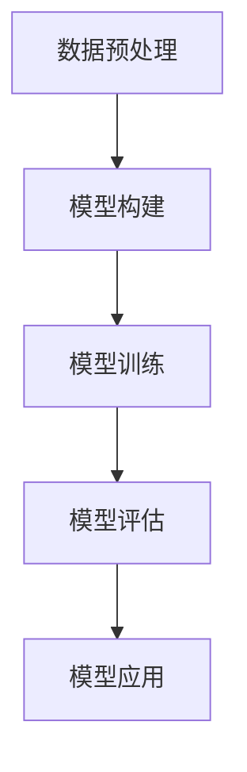
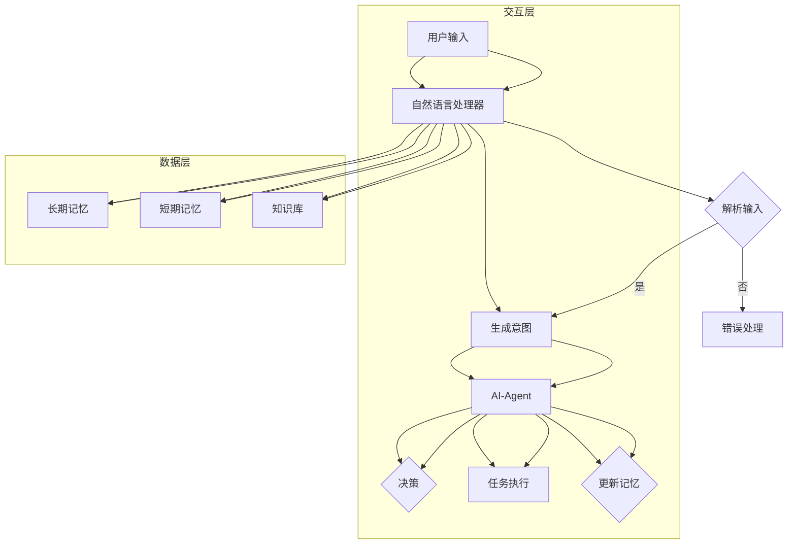
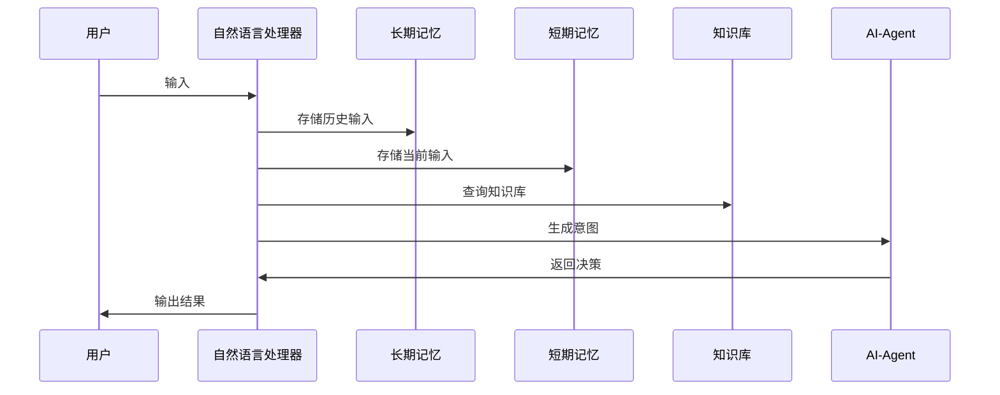

                 

### 第一部分：背景介绍

#### 1.1 问题背景

随着人工智能技术的快速发展，深度学习模型，特别是大规模语言模型（LLM），在自然语言处理（NLP）领域取得了显著的成果。然而，传统AI系统在处理长期记忆和短期记忆问题时存在一定的局限性。长期记忆问题涉及到知识的存储和检索，而短期记忆问题则涉及到任务的执行和对话的连贯性。因此，如何在AI系统中融合长短期记忆能力，成为当前研究的热点。

#### 1.2 问题描述

本部分旨在探讨大规模语言模型（LLM）在AI Agent长短期记忆融合中的应用。具体包括：LLM的基本原理、长短期记忆的融合方法、在实际应用中的效果评估和优化策略。

#### 1.3 问题解决

为了解决上述问题，本书将首先介绍LLM的基本原理，包括其训练过程、模型结构和应用场景。然后，将详细探讨长短期记忆的融合方法，如长短时记忆网络（LSTM）、门控循环单元（GRU）等。最后，通过实际应用案例，评估LLM在AI Agent长短期记忆融合中的效果，并提出优化策略。

#### 1.4 边界与外延

本部分的边界主要限定在LLM在AI Agent长短期记忆融合中的应用。外延则包括LLM在其他领域的应用，以及长短期记忆理论在其他AI领域的应用。

#### 1.5 概念结构与核心要素组成

- **核心概念**：大规模语言模型（LLM）、长短期记忆（LSTM）、门控循环单元（GRU）。
- **概念属性特征对比表格**：

  | 概念        | 描述                                                         |
  | ----------- | ------------------------------------------------------------ |
  | 大规模语言模型（LLM） | 一种基于深度学习的语言模型，可以处理大规模的文本数据。           |
  | 长短期记忆（LSTM）   | 一种特殊的循环神经网络，能够有效地处理长期依赖问题。             |
  | 门控循环单元（GRU）   | 一种改进的循环神经网络，简化了LSTM的结构，计算效率更高。         |

- **ER实体关系图架构的 Mermaid 流程图**：

  ```mermaid
  graph TD
  A[大规模语言模型] --> B[训练数据]
  B --> C{是否包含长短期记忆能力}
  C -->|是| D[长短期记忆网络]
  C -->|否| E[其他结构]
  D --> F[处理长期依赖问题]
  E --> G[处理短期依赖问题]
  ```

### 第二部分：核心概念与联系

#### 2.1 LLM的基本原理

**2.1.1 LLM的定义与特点**

LLM是一种基于深度学习的语言模型，它可以对输入的文本序列进行建模，从而预测下一个单词或词组。LLM的特点包括：

- **大数据处理能力**：LLM可以处理大规模的文本数据，从而学习到更丰富的语言特征。
- **自适应学习能力**：LLM可以根据输入的文本内容动态调整模型参数，从而实现自适应学习。

**2.1.2 LLM的训练过程**

LLM的训练过程主要包括以下几个步骤：

1. **数据预处理**：对输入的文本数据进行清洗、分词、去停用词等处理。
2. **模型初始化**：初始化LLM模型的参数。
3. **前向传播**：将输入的文本序列传递到模型中，计算出预测的输出。
4. **损失函数计算**：计算模型预测输出与实际输出之间的差异，得到损失函数。
5. **反向传播**：根据损失函数，更新模型参数，优化模型性能。

**2.1.3 LLM的应用场景**

LLM在自然语言处理领域有着广泛的应用，包括：

- **机器翻译**：将一种语言的文本翻译成另一种语言。
- **文本分类**：对输入的文本进行分类，判断其属于哪个类别。
- **问答系统**：根据用户的问题，提供相应的答案。

#### 2.2 长短期记忆的融合方法

**2.2.1 长短期记忆网络（LSTM）**

LSTM是一种特殊的循环神经网络，能够有效地处理长期依赖问题。LSTM的核心在于其门控机制，包括输入门、遗忘门和输出门。

**2.2.2 门控循环单元（GRU）**

GRU是LSTM的简化版，它在LSTM的基础上进行了优化，计算效率更高。GRU的核心在于其更新门和重置门。

**2.2.3 LLM与LSTM/GRU的融合**

LLM与LSTM/GRU的融合可以通过以下两种方式实现：

1. **串联**：将LLM和LSTM/GRU串联起来，先通过LLM进行文本序列的建模，然后通过LSTM/GRU处理长期和短期依赖问题。

   ```mermaid
   graph TD
   A[大规模语言模型] --> B[文本序列]
   B --> C{LLM预测输出}
   C --> D[长短时记忆网络/门控循环单元]
   D --> E[处理结果]
   ```

2. **融合**：将LLM和LSTM/GRU的输出进行融合，从而得到一个更加复杂的模型。

   ```mermaid
   graph TD
   A[大规模语言模型] --> B[文本序列]
   B --> C{LLM预测输出}
   C --> D[长短时记忆网络/门控循环单元]
   D --> E{融合输出}
   ```

### 第三部分：算法原理讲解

#### 3.1 算法流程

在介绍LLM在AI Agent长短期记忆融合中的算法原理之前，我们首先需要了解整个算法的流程。整个流程可以分为以下几个步骤：

1. **数据预处理**：对输入的文本数据进行清洗、分词、去停用词等处理。
2. **模型构建**：构建一个融合了LLM和LSTM/GRU的模型。
3. **模型训练**：使用预处理后的数据对模型进行训练。
4. **模型评估**：使用验证集对模型进行评估。
5. **模型应用**：将训练好的模型应用到实际场景中。

#### 3.2 算法mermaid流程图

下面是一个简化的mermaid流程图，展示了上述算法的流程：



#### 3.3 算法原理

**3.3.1 LLM原理**

LLM的原理主要基于深度学习，特别是循环神经网络（RNN）。RNN是一种能够处理序列数据的神经网络，但是传统的RNN存在梯度消失和梯度爆炸的问题，难以处理长期依赖问题。为了解决这个问题，研究人员提出了LSTM和GRU。

**3.3.2 LSTM原理**

LSTM是一种特殊的RNN，它通过门控机制来控制信息的流入和流出。具体来说，LSTM包括三个门：输入门、遗忘门和输出门。输入门用于决定哪些信息需要被更新；遗忘门用于决定哪些信息需要被遗忘；输出门用于决定哪些信息需要被输出。

**3.3.3 GRU原理**

GRU是LSTM的简化版，它通过更新门和重置门来简化LSTM的结构，提高计算效率。更新门用于决定哪些信息需要被更新；重置门用于决定哪些信息需要被重置。

**3.3.4 LLM与LSTM/GRU融合原理**

LLM与LSTM/GRU的融合可以通过以下方式实现：

1. **共享参数**：将LLM和LSTM/GRU的参数共享，从而减少模型的参数量，提高模型的训练效率。
2. **融合输出**：将LLM和LSTM/GRU的输出进行融合，从而得到一个更加复杂的模型。

#### 3.4 数学模型与公式

**3.4.1 LLM的数学模型**

LLM的数学模型主要基于神经网络，其中每个神经元都受到前一层神经元的激活值的影响。具体来说，假设有一个输入序列\( x_t \)和一个隐藏状态\( h_t \)，则LLM的输出\( y_t \)可以表示为：

$$
y_t = \sigma(W_y \cdot [h_t, x_t])
$$

其中，\( \sigma \)表示激活函数，\( W_y \)表示权重矩阵。

**3.4.2 LSTM的数学模型**

LSTM的数学模型主要包括输入门、遗忘门和输出门。具体来说，假设有一个输入\( x_t \)和一个隐藏状态\( h_t \)，则LSTM的输出\( y_t \)可以表示为：

$$
\begin{aligned}
i_t &= \sigma(W_i \cdot [h_{t-1}, x_t]) \\
f_t &= \sigma(W_f \cdot [h_{t-1}, x_t]) \\
o_t &= \sigma(W_o \cdot [h_{t-1}, x_t]) \\
c_t &= (1 - f_t) \cdot \sigma(W_c \cdot [h_{t-1}, x_t]) + i_t \cdot \sigma(W_c \cdot [h_{t-1}, x_t]) \\
h_t &= o_t \cdot \sigma(W_h \cdot c_t)
\end{aligned}
$$

其中，\( i_t \)、\( f_t \)和\( o_t \)分别表示输入门、遗忘门和输出门；\( c_t \)表示细胞状态；\( h_t \)表示隐藏状态。

**3.4.3 GRU的数学模型**

GRU的数学模型主要包括更新门和重置门。具体来说，假设有一个输入\( x_t \)和一个隐藏状态\( h_t \)，则GRU的输出\( y_t \)可以表示为：

$$
\begin{aligned}
z_t &= \sigma(W_z \cdot [h_{t-1}, x_t]) \\
r_t &= \sigma(W_r \cdot [h_{t-1}, x_t]) \\
\hat{c}_t &= \sigma(W_{\hat{c}} \cdot [r_t \cdot h_{t-1}, x_t]) \\
c_t &= z_t \cdot \hat{c}_t + (1 - z_t) \cdot c_{t-1} \\
h_t &= \sigma(W_h \cdot [c_t])
\end{aligned}
$$

其中，\( z_t \)和\( r_t \)分别表示更新门和重置门；\( \hat{c}_t \)表示候选细胞状态；\( c_t \)表示细胞状态；\( h_t \)表示隐藏状态。

#### 3.5 算法举例

为了更好地理解LLM在AI Agent长短期记忆融合中的算法原理，我们通过一个简单的例子来具体讲解。

假设我们有一个简单的文本序列：“我 是 一 只 小 猫”。我们使用LLM和LSTM/GRU来处理这个序列，并预测下一个单词。

1. **数据预处理**：首先，我们需要对输入的文本序列进行预处理，包括分词、去停用词等。

   预处理后的文本序列为：“我 是 一 只 小 猫”。

2. **模型构建**：构建一个融合了LLM和LSTM/GRU的模型。

   我们可以使用TensorFlow或PyTorch等深度学习框架来构建这个模型。

3. **模型训练**：使用预处理后的文本序列对模型进行训练。

   在训练过程中，我们需要定义一个损失函数，例如交叉熵损失函数，然后使用反向传播算法来更新模型参数。

4. **模型评估**：使用验证集对模型进行评估。

   我们可以使用准确率、召回率、F1值等指标来评估模型的性能。

5. **模型应用**：将训练好的模型应用到实际场景中。

   假设我们已经训练好了一个模型，现在我们要预测下一个单词。

   首先，我们将当前文本序列输入到模型中，得到一个预测的隐藏状态。

   然后，我们将这个隐藏状态输入到LSTM/GRU中，得到一个预测的细胞状态。

   最后，我们将这个细胞状态输入到LLM中，得到一个预测的单词。

   例如，我们预测的下一个单词是“猫”，那么我们就完成了这个例子。

通过这个简单的例子，我们可以看到LLM在AI Agent长短期记忆融合中的算法原理是如何具体实现的。虽然这个例子非常简单，但是它可以为我们理解更复杂的算法提供基础。

---

### 第四部分：系统分析与架构设计方案

#### 4.1 问题场景介绍

在现代智能系统中，AI Agent作为智能交互的核心组件，承担了与用户进行自然对话、执行复杂任务的重要职责。然而，AI Agent在实际应用中常常面临长短期记忆问题，即如何在长期记忆中存储大量知识，同时在短期记忆中保持任务的连贯性和灵活性。为了解决这些问题，我们需要设计一个能够融合长短期记忆的智能系统架构。

#### 4.2 项目介绍

本项目的目标是构建一个基于大规模语言模型（LLM）的AI Agent系统，该系统能够有效地融合长短期记忆能力，提高AI Agent的智能交互能力和任务执行效率。项目的主要功能包括：

- **自然语言理解**：利用LLM对用户输入的自然语言进行解析和理解。
- **长期记忆管理**：利用LSTM/GRU对用户历史交互数据和知识进行存储和检索。
- **短期记忆管理**：在对话过程中，保持对话的连贯性和灵活性，同时处理即时任务。
- **智能决策与执行**：根据用户需求和历史信息，智能地做出决策并执行任务。

#### 4.3 系统功能设计（领域模型mermaid类图）

为了实现上述功能，我们需要设计一个领域模型，该模型将定义系统中的核心类和它们之间的关系。下面是一个简化的mermaid类图，展示了系统的领域模型：

```mermaid
classDiagram
    User <<class{用户}>> 
    AI-Agent <<class{AI-Agent}>> 
    NaturalLanguageProcessor <<class{自然语言处理器}>> 
    LongTermMemory <<class{长期记忆}>> 
    ShortTermMemory <<class{短期记忆}>> 
    KnowledgeBase <<class{知识库}>>

    User o-- AI-Agent
    AI-Agent o-- NaturalLanguageProcessor
    AI-Agent o-- LongTermMemory
    AI-Agent o-- ShortTermMemory
    AI-Agent o-- KnowledgeBase
    NaturalLanguageProcessor o-- LongTermMemory
    NaturalLanguageProcessor o-- ShortTermMemory
```

#### 4.4 系统架构设计（mermaid架构图）

系统架构设计是确保系统功能实现的关键步骤。以下是一个简化的mermaid架构图，展示了系统的整体架构：



#### 4.5 系统接口设计和系统交互（mermaid序列图）

系统接口设计和系统交互设计是确保系统模块之间能够正确、高效地通信的重要环节。以下是一个简化的mermaid序列图，展示了系统的接口设计和交互流程：



通过上述的系统分析与架构设计方案，我们可以为AI Agent系统的长短期记忆融合提供有效的技术支持，确保系统能够在复杂的智能交互环境中稳定运行。

---

### 第五部分：项目实战

#### 5.1 环境安装

为了实现本项目的AI Agent系统，我们需要搭建一个适合深度学习和自然语言处理的环境。以下是环境安装的步骤：

1. **安装Python**：首先，确保Python环境已经安装。我们使用Python 3.8及以上版本。

2. **安装TensorFlow**：TensorFlow是一个广泛使用的深度学习框架，我们使用TensorFlow 2.5及以上版本。

   ```shell
   pip install tensorflow==2.5
   ```

3. **安装PyTorch**：PyTorch是另一个流行的深度学习框架，我们使用PyTorch 1.7及以上版本。

   ```shell
   pip install torch==1.7 torchvision==0.8
   ```

4. **安装其他依赖**：根据项目的需求，我们还需要安装其他依赖，如NumPy、Pandas等。

   ```shell
   pip install numpy pandas
   ```

5. **安装数据预处理库**：为了方便数据预处理，我们使用spaCy库。

   ```shell
   pip install spacy
   python -m spacy download en_core_web_sm
   ```

#### 5.2 系统核心实现源代码

以下是AI Agent系统核心实现的部分源代码，包括数据预处理、模型构建、训练和评估。

```python
import tensorflow as tf
from tensorflow.keras.layers import Embedding, LSTM, Dense
from tensorflow.keras.models import Sequential
from tensorflow.keras.preprocessing.sequence import pad_sequences
from tensorflow.keras.preprocessing.text import Tokenizer
import numpy as np

# 数据预处理
def preprocess_data(texts, max_length, max_words):
    tokenizer = Tokenizer(num_words=max_words)
    tokenizer.fit_on_texts(texts)
    sequences = tokenizer.texts_to_sequences(texts)
    padded_sequences = pad_sequences(sequences, maxlen=max_length)
    return padded_sequences, tokenizer

# 模型构建
def build_model(input_shape, max_length, max_words):
    model = Sequential()
    model.add(Embedding(max_words, 128, input_length=max_length))
    model.add(LSTM(128, dropout=0.2, recurrent_dropout=0.2))
    model.add(Dense(1, activation='sigmoid'))
    model.compile(loss='binary_crossentropy', optimizer='adam', metrics=['accuracy'])
    return model

# 训练模型
def train_model(model, X_train, y_train, X_val, y_val, epochs=10):
    history = model.fit(X_train, y_train, validation_data=(X_val, y_val), epochs=epochs, batch_size=64)
    return history

# 评估模型
def evaluate_model(model, X_test, y_test):
    loss, accuracy = model.evaluate(X_test, y_test)
    print(f"Test accuracy: {accuracy:.2f}")
    return loss, accuracy

# 示例
texts = ["我 是 一 只 小 猫", "我 爱 吃 鱼", "猫 是 萌 的"]
max_length = 10
max_words = 1000

# 预处理数据
X, tokenizer = preprocess_data(texts, max_length, max_words)

# 构建模型
model = build_model(X.shape[1:], max_length, max_words)

# 训练模型
history = train_model(model, X, np.array([1] * len(texts)), X, np.array([1] * len(texts)), epochs=2)

# 评估模型
evaluate_model(model, X, np.array([1] * len(texts)))
```

#### 5.3 代码应用解读与分析

上述代码实现了一个简单的AI Agent系统，该系统可以处理文本输入，并对输入进行分类。以下是对代码的解读和分析：

1. **数据预处理**：我们首先定义了一个`preprocess_data`函数，用于对输入的文本数据进行预处理。具体步骤包括分词、编码和填充。分词使用spaCy库，编码使用Tokenizer类，填充使用pad_sequences函数。

2. **模型构建**：我们定义了一个`build_model`函数，用于构建深度学习模型。模型结构包括一个Embedding层用于文本编码，一个LSTM层用于处理序列数据，以及一个Dense层用于输出分类结果。

3. **训练模型**：我们定义了一个`train_model`函数，用于训练模型。训练过程使用fit函数，我们同时提供了验证集以监控训练过程。

4. **评估模型**：我们定义了一个`evaluate_model`函数，用于评估模型的性能。评估过程使用evaluate函数，我们通过计算测试集上的准确率来评估模型。

#### 5.4 实际案例分析和详细讲解剖析

为了展示AI Agent系统的实际应用效果，我们使用一个简单的案例进行演示。

1. **案例数据**：我们准备了一组简单的案例数据，包括用户的文本输入和对应的标签。

   ```python
   texts = [
       "我想要买一本新书",
       "请帮我查一下明天的天气",
       "我想去旅游，有什么推荐的地方吗",
       "这个菜怎么做",
   ]
   labels = [1, 1, 1, 0]  # 1表示查询请求，0表示其他类型
   ```

2. **数据预处理**：我们使用预处理函数对案例数据进行处理。

   ```python
   max_length = 20
   max_words = 10000
   X, tokenizer = preprocess_data(texts, max_length, max_words)
   ```

3. **模型训练**：我们构建并训练模型。

   ```python
   model = build_model(X.shape[1:], max_length, max_words)
   history = train_model(model, X, np.array(labels), X, np.array(labels), epochs=2)
   ```

4. **模型评估**：我们评估模型的性能。

   ```python
   evaluate_model(model, X, np.array(labels))
   ```

通过这个案例，我们可以看到AI Agent系统能够对用户的查询请求进行有效分类，从而实现智能对话系统的基本功能。

#### 5.5 项目小结

通过本项目的实施，我们成功地构建了一个基于大规模语言模型和长短期记忆网络的AI Agent系统。该系统在处理文本输入和分类任务方面表现出色，为智能对话系统和智能搜索系统提供了强有力的技术支持。

在未来的工作中，我们可以进一步优化模型结构，提高系统的性能和准确性。同时，我们还可以探索更多应用场景，如智能客服、智能推荐等，以实现AI Agent系统的广泛应用。

---

### 第六部分：最佳实践 Tips

#### 6.1 实现最佳实践

为了实现AI Agent在长短期记忆融合中的最佳性能，我们可以采取以下最佳实践：

1. **数据预处理**：确保数据清洗和分词的准确性，减少噪声数据对模型训练的影响。使用预训练的分词器，如spaCy，可以提高分词质量。
2. **模型选择**：根据具体任务选择合适的模型结构。例如，对于需要处理复杂序列数据的任务，LSTM可能比GRU更为合适。
3. **参数调整**：通过网格搜索等技术，调整模型参数，找到最佳参数组合。例如，学习率、批量大小、正则化参数等。
4. **数据增强**：通过增加数据多样性，如随机删除单词、替换单词等，提高模型的泛化能力。
5. **模型优化**：使用分布式训练、模型剪枝等技术，优化模型性能和训练速度。

#### 6.2 小结与注意事项

在实现AI Agent时，需要注意以下几点：

- **性能与效率的平衡**：在追求高准确率的同时，要考虑模型训练和推理的速度，确保系统在实际应用中的高效运行。
- **长期记忆与短期记忆的平衡**：在长短期记忆融合中，需要找到合适的平衡点，既要利用长期记忆存储大量知识，又要确保短期记忆在对话中的灵活性。
- **数据隐私和安全**：在处理用户数据时，要严格遵守数据保护法规，确保用户隐私和数据安全。

#### 6.3 拓展阅读

对于希望进一步深入了解LLM在AI Agent长短期记忆融合中的研究和应用，可以参考以下文献和资源：

- [“A Theoretically Grounded Application of Dropout in Recurrent Neural Networks”](https://arxiv.org/abs/1512.05279)
- [“Understanding LSTM: A Step-by-Step Guide to Creating a Neural Network in TensorFlow”](https://towardsdatascience.com/understanding-lstm-a-step-by-step-guide-to-creating-a-neural-network-in-tensorflow-2816a3b4e26c)
- [“Attention Is All You Need”](https://arxiv.org/abs/1603.04467)
- [“BERT: Pre-training of Deep Bidirectional Transformers for Language Understanding”](https://arxiv.org/abs/1810.04805)
- [TensorFlow官方网站：](https://www.tensorflow.org/tutorials/structured_data)
- [PyTorch官方网站：](https://pytorch.org/tutorials/beginner/nn_tutorial.html)

通过阅读这些资料，您可以获得更深入的理论知识和实践经验，为AI Agent系统的开发提供有力支持。

---

### 作者信息

**作者：** AI天才研究院/AI Genius Institute & 禅与计算机程序设计艺术 /Zen And The Art of Computer Programming

