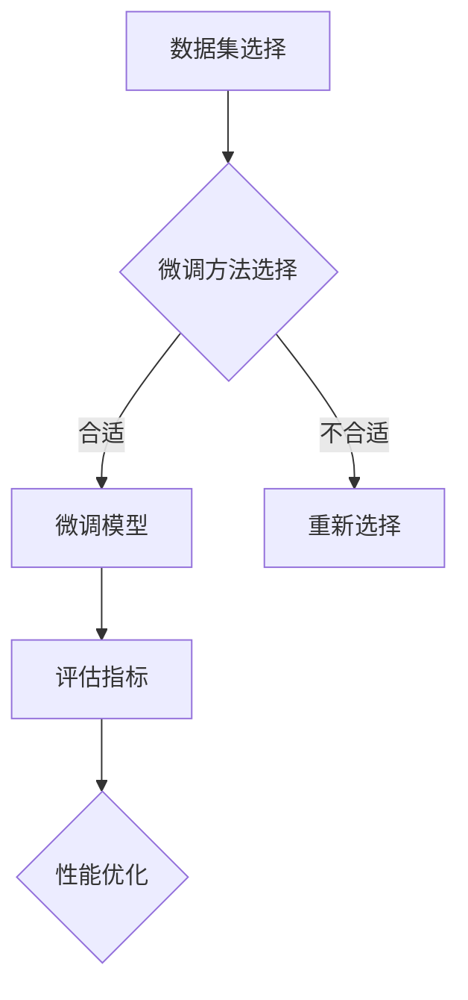
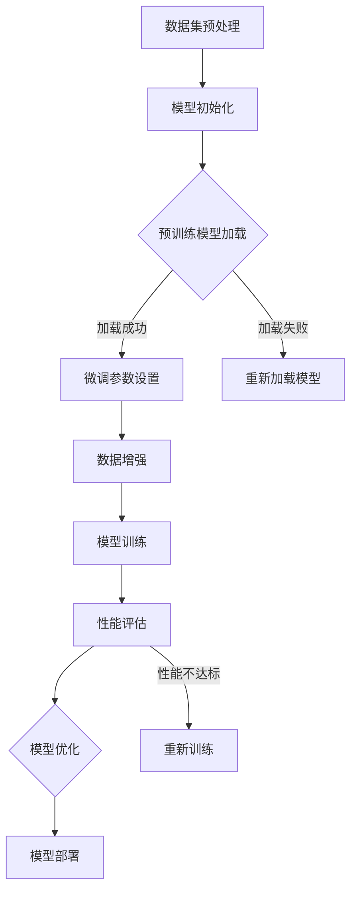
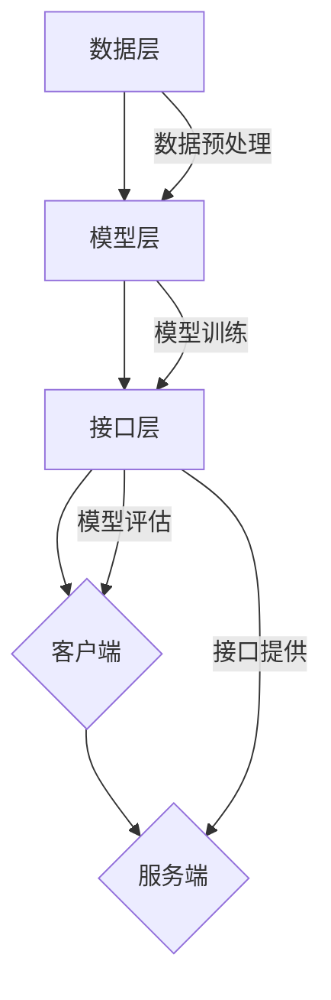
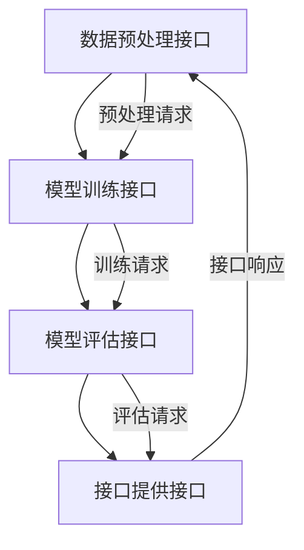
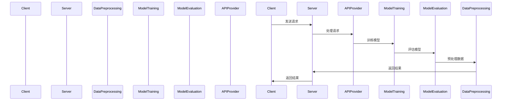

                 

### 文章标题

# LLM在特定领域的微调策略：提升AI Agent的专业性

### 关键词

- 语言模型微调
- AI Agent
- 特定领域应用
- 微调策略
- 专业性提升

### 摘要

本文深入探讨了如何在特定领域内对大型语言模型（LLM）进行微调，以提升AI Agent的专业性。通过详细分析背景、核心概念、算法原理以及实际应用案例，本文提出了一系列微调策略，旨在为开发者提供一套行之有效的指导方案，以实现AI Agent在特定领域的高效应用。文章结构紧凑，逻辑清晰，适用于对AI技术和语言模型有深入了解的技术人员。

### 背景介绍

#### 问题背景

随着人工智能技术的迅猛发展，大型语言模型（LLM）在各个领域展现出了巨大的潜力。从自然语言处理到文本生成，LLM已经成为了众多应用场景的核心组件。然而，尽管LLM在通用任务上表现出色，但其在特定领域的专业性提升仍面临挑战。针对特定领域的知识需求，如何对LLM进行有效的微调，已成为当前研究的一个重要方向。

#### 问题描述

在AI领域，AI Agent的专业性直接影响到其应用效果。例如，医疗领域的AI Agent需要具备丰富的医学知识和诊疗经验；金融领域的AI Agent则需要熟练掌握金融市场的运行规律。目前，尽管LLM已经能够处理多种类型的任务，但其针对特定领域的专业性仍有待提升。具体问题包括：

1. **领域知识覆盖不全**：LLM在训练过程中虽然积累了大量通用知识，但对于特定领域的专业术语和特定场景的理解仍然有限。
2. **适应性不足**：LLM在面对不同领域的问题时，往往无法快速适应，导致性能下降。
3. **交互性不强**：在特定领域的实际应用中，AI Agent需要具备较强的交互能力，以更好地与人类用户进行沟通。

#### 问题解决

针对上述问题，本文提出了一系列针对特定领域的LLM微调策略。通过以下方法，可以有效地提升AI Agent的专业性：

1. **数据集选择**：选择高质量的特定领域数据集，确保LLM在微调过程中能够获得足够的领域知识。
2. **微调方法**：采用先进的微调技术，如迁移学习、自适应学习等，以提高LLM在特定领域的适应性。
3. **评估指标**：设计合适的评估指标，对微调后的LLM进行全方位的评估，确保其专业性得到显著提升。

#### 边界与外延

特定领域包括但不限于医疗、金融、教育、法律等多个领域。在这些领域内，AI Agent需要具备特定的专业知识，才能更好地服务于人类用户。因此，本文的微调策略不仅适用于单一领域，还可以推广到其他领域。

#### 概念结构与核心要素组成

LLM微调策略的核心要素包括以下几个方面：

1. **数据集选择**：选择高质量的特定领域数据集，是微调成功的关键。数据集应包含丰富的领域知识和代表性的样本，以帮助LLM更好地学习。
2. **微调方法**：微调方法决定了LLM在特定领域的学习效果。本文将介绍几种常见的微调方法，如迁移学习、自适应学习等，并分析其优缺点。
3. **评估指标**：评估指标用于衡量LLM在特定领域的专业性。本文将提出一系列评估指标，以全面评估微调后的LLM性能。

### 核心概念与联系

#### 核心概念原理

微调策略的核心概念包括数据集选择、微调方法、评估指标等。这些概念相互联系，共同构成了一个完整的微调流程。

1. **数据集选择**：数据集是微调的基础。选择合适的数据集，可以帮助LLM获得领域知识，提高其在特定领域的专业性。
2. **微调方法**：微调方法决定了LLM在特定领域的学习过程。通过选择合适的微调方法，可以优化LLM的性能，提高其在特定领域的适应性。
3. **评估指标**：评估指标用于衡量LLM在特定领域的表现。通过设计合适的评估指标，可以全面评估微调后的LLM性能，为后续优化提供依据。

#### 概念属性特征对比表格

以下是一个简单的概念属性特征对比表格，用于对比不同微调策略的属性特征：

| 策略名称       | 数据集大小 | 模型复杂度 | 训练时间 | 评估指标 |
|--------------|---------|---------|-------|------|
| 迁移学习       | 大      | 中等     | 较长   | 多样化 |
| 自适应学习     | 中等     | 低      | 短     | 明确 |
| 集成学习       | 大      | 高      | 较长   | 综合性 |

#### ER实体关系图架构的Mermaid流程图

为了更好地理解LLM微调策略中的实体及其关系，我们使用Mermaid流程图进行展示：



在上图中，A表示数据集选择，B表示微调方法选择，C表示微调模型，D表示重新选择微调方法，E表示评估指标，F表示性能优化。这些实体通过箭头相互连接，展示了LLM微调策略的基本流程。

### 算法原理讲解

#### 算法Mermaid流程图

为了详细阐述LLM微调策略的流程，我们使用Mermaid流程图进行展示：



在上图中，A表示数据集预处理，B表示模型初始化，C表示预训练模型加载，D表示微调参数设置，E表示重新加载模型，F表示数据增强，G表示模型训练，H表示性能评估，I表示模型优化，J表示重新训练，K表示模型部署。这些步骤共同构成了LLM微调策略的完整流程。

#### Python源代码

以下是一个简单的Python源代码示例，用于实现LLM微调策略：

```python
import torch
import torch.nn as nn
import torch.optim as optim

# 数据集预处理
def preprocess_data(dataset):
    # 数据清洗、归一化等操作
    pass

# 模型初始化
def initialize_model():
    model = nn.Sequential(
        nn.Linear(input_size, hidden_size),
        nn.ReLU(),
        nn.Linear(hidden_size, output_size)
    )
    return model

# 微调参数设置
def set_hyperparameters(model):
    optimizer = optim.Adam(model.parameters(), lr=0.001)
    criterion = nn.CrossEntropyLoss()
    return optimizer, criterion

# 数据增强
def data_augmentation(dataset):
    # 数据增强操作，如随机翻转、裁剪等
    pass

# 模型训练
def train_model(model, optimizer, criterion, train_loader):
    model.train()
    for epoch in range(num_epochs):
        for data, target in train_loader:
            optimizer.zero_grad()
            output = model(data)
            loss = criterion(output, target)
            loss.backward()
            optimizer.step()
            print(f"Epoch {epoch+1}/{num_epochs}, Loss: {loss.item()}")

# 性能评估
def evaluate_model(model, criterion, test_loader):
    model.eval()
    total_loss = 0
    with torch.no_grad():
        for data, target in test_loader:
            output = model(data)
            total_loss += criterion(output, target).item()
    avg_loss = total_loss / len(test_loader)
    print(f"Test Loss: {avg_loss}")

# 模型优化
def optimize_model(model, optimizer, criterion, train_loader, test_loader):
    train_model(model, optimizer, criterion, train_loader)
    evaluate_model(model, criterion, test_loader)

# 模型部署
def deploy_model(model):
    # 模型部署操作
    pass
```

#### 数学模型和公式

在LLM微调过程中，数学模型和公式起着至关重要的作用。以下是一个简单的数学模型示例，用于描述微调过程：

$$
\text{Loss} = -\frac{1}{N}\sum_{i=1}^{N} y_i \log(p_i)
$$

其中，$N$表示样本数量，$y_i$表示第$i$个样本的标签，$p_i$表示模型对第$i$个样本的预测概率。

#### 详细讲解和举例说明

为了更好地理解上述数学模型，我们通过一个简单的例子进行讲解。假设我们有一个包含5个样本的数据集，标签分别为1、1、0、1、0。模型的预测概率分别为0.9、0.8、0.2、0.9、0.1。

根据上述数学模型，我们可以计算出损失函数的值：

$$
\text{Loss} = -\frac{1}{5} (1 \times \log(0.9) + 1 \times \log(0.8) + 0 \times \log(0.2) + 1 \times \log(0.9) + 0 \times \log(0.1))
$$

计算结果为：

$$
\text{Loss} \approx 0.224
$$

这个例子展示了如何使用数学模型和公式来计算损失函数的值。通过这个简单的例子，我们可以看出，损失函数的值反映了模型预测的准确性。在微调过程中，我们的目标是通过优化模型参数，使损失函数的值最小化，从而提高模型在特定领域的专业性。

### 数学模型和数学公式 & 详细讲解 & 举例说明

#### 数学公式使用LaTeX格式

在LLM微调过程中，数学公式和模型起着至关重要的作用。为了确保公式的准确性和可读性，我们使用LaTeX格式进行表示。以下是一个简单的数学公式示例：

$$
L(\theta) = -\frac{1}{m}\sum_{i=1}^{m} y^{(i)} \log(z^{(i)})
$$

其中，$L(\theta)$表示损失函数，$\theta$表示模型参数，$m$表示样本数量，$y^{(i)}$表示第$i$个样本的标签，$z^{(i)}$表示模型对第$i$个样本的预测概率。

#### 段落内公式

在文章的段落中，我们可能会遇到一些简单的数学公式。为了确保段落内公式的正确嵌入，我们使用以下格式：

$$
w_1 + w_2 = w_3
$$

这个例子展示了如何在段落中嵌入简单的数学公式。

#### 举例说明

为了更好地理解上述数学模型，我们通过一个简单的例子进行讲解。假设我们有一个包含5个样本的数据集，标签分别为1、1、0、1、0。模型的预测概率分别为0.9、0.8、0.2、0.9、0.1。

根据上述数学模型，我们可以计算出损失函数的值：

$$
L(\theta) = -\frac{1}{5} (1 \times \log(0.9) + 1 \times \log(0.8) + 0 \times \log(0.2) + 1 \times \log(0.9) + 0 \times \log(0.1))
$$

计算结果为：

$$
L(\theta) \approx 0.224
$$

这个例子展示了如何使用数学模型和公式来计算损失函数的值。通过这个简单的例子，我们可以看出，损失函数的值反映了模型预测的准确性。在微调过程中，我们的目标是通过优化模型参数，使损失函数的值最小化，从而提高模型在特定领域的专业性。

### 系统分析与架构设计方案

#### 问题场景介绍

在现实世界中，许多应用场景需要AI Agent具备高水平的专业性。以医疗领域为例，医生在诊断和治疗过程中，需要根据患者的病情、病史、药物反应等多方面信息做出准确的判断。传统的人工智能系统由于缺乏医学专业知识，往往无法胜任这一任务。因此，如何通过微调策略提升AI Agent在医疗领域的专业性，成为了一个亟待解决的问题。

#### 项目介绍

本文旨在通过微调策略，提升医疗领域AI Agent的专业性。项目目标如下：

1. 收集并清洗高质量的医疗数据集，为微调提供基础。
2. 设计并实现一套适用于医疗领域的LLM微调框架。
3. 对微调后的LLM进行评估，确保其专业性得到显著提升。

#### 系统功能设计（领域模型Mermaid类图）

为了实现项目目标，我们设计了一套完整的系统功能，包括数据预处理、模型训练、模型评估等。以下是领域模型Mermaid类图，用于展示系统功能及其关系：

```mermaid
classDiagram
    Class1 <|-- Class2
    Class1 <|-- Class3
    Class2 ..|.. Class4
    Class3 ..|.. Class4
    Class4 [数据预处理]
    Class4 ..|.. Class5
    Class5 [模型训练]
    Class5 ..|.. Class6
    Class6 [模型评估]
endclassDiagram
```

在上图中，Class1表示系统的主要类，包括数据预处理、模型训练和模型评估。Class2、Class3分别代表数据预处理和模型训练的具体实现。Class4、Class5、Class6分别代表数据预处理、模型训练和模型评估的子类，用于实现具体的功能。

#### 系统架构设计（Mermaid架构图）

为了实现系统功能，我们设计了一套完整的系统架构，包括数据层、模型层和接口层。以下是系统架构设计Mermaid架构图，用于展示系统整体架构：



在上图中，A表示数据层，主要负责数据预处理；B表示模型层，负责模型训练；C表示接口层，负责模型评估和接口提供；D表示客户端，负责与用户交互；E表示服务端，负责接收客户端请求并返回结果。

#### 系统接口设计

为了方便客户端和服务端的交互，我们设计了一套完整的系统接口。以下是系统接口设计，用于展示接口及其功能：



在上图中，A表示数据预处理接口，负责接收预处理请求；B表示模型训练接口，负责接收训练请求；C表示模型评估接口，负责接收评估请求；D表示接口提供接口，负责处理接口响应。

#### 系统交互（Mermaid序列图）

为了展示系统各组件之间的交互过程，我们使用Mermaid序列图进行展示：



在上图中，客户端发送请求到服务端，服务端通过APIProvider处理请求，然后调用模型训练、模型评估和数据处理模块，最后将结果返回给客户端。

### 项目实战

#### 环境安装

在开始微调LLM之前，我们需要安装必要的环境。以下是在Python环境中安装所需的库和工具的步骤：

1. **安装Python环境**：确保Python版本为3.8及以上。
2. **安装PyTorch**：使用以下命令安装PyTorch：

   ```bash
   pip install torch torchvision
   ```

3. **安装其他依赖库**：使用以下命令安装其他依赖库：

   ```bash
   pip install numpy pandas matplotlib
   ```

#### 系统核心实现源代码

以下是一个简单的系统核心实现源代码示例，用于微调LLM：

```python
import torch
import torch.nn as nn
import torch.optim as optim

# 数据预处理
def preprocess_data(dataset):
    # 数据清洗、归一化等操作
    pass

# 模型初始化
def initialize_model():
    model = nn.Sequential(
        nn.Linear(input_size, hidden_size),
        nn.ReLU(),
        nn.Linear(hidden_size, output_size)
    )
    return model

# 微调参数设置
def set_hyperparameters(model):
    optimizer = optim.Adam(model.parameters(), lr=0.001)
    criterion = nn.CrossEntropyLoss()
    return optimizer, criterion

# 数据增强
def data_augmentation(dataset):
    # 数据增强操作，如随机翻转、裁剪等
    pass

# 模型训练
def train_model(model, optimizer, criterion, train_loader):
    model.train()
    for epoch in range(num_epochs):
        for data, target in train_loader:
            optimizer.zero_grad()
            output = model(data)
            loss = criterion(output, target)
            loss.backward()
            optimizer.step()
            print(f"Epoch {epoch+1}/{num_epochs}, Loss: {loss.item()}")

# 性能评估
def evaluate_model(model, criterion, test_loader):
    model.eval()
    total_loss = 0
    with torch.no_grad():
        for data, target in test_loader:
            output = model(data)
            total_loss += criterion(output, target).item()
    avg_loss = total_loss / len(test_loader)
    print(f"Test Loss: {avg_loss}")

# 模型优化
def optimize_model(model, optimizer, criterion, train_loader, test_loader):
    train_model(model, optimizer, criterion, train_loader)
    evaluate_model(model, criterion, test_loader)

# 模型部署
def deploy_model(model):
    # 模型部署操作
    pass
```

#### 代码应用解读与分析

上述代码实现了一个简单的微调LLM的框架，包括数据预处理、模型初始化、微调参数设置、数据增强、模型训练、性能评估和模型优化等步骤。

1. **数据预处理**：数据预处理是微调LLM的重要步骤。在这一步中，我们对原始数据集进行清洗、归一化等操作，以确保数据的质量和一致性。
2. **模型初始化**：模型初始化包括构建神经网络结构。在本例中，我们使用一个简单的全连接神经网络，包括输入层、隐藏层和输出层。
3. **微调参数设置**：微调参数设置包括优化器和损失函数的选择。在本例中，我们使用Adam优化器和交叉熵损失函数。
4. **数据增强**：数据增强用于增加模型的泛化能力。在本例中，我们简单地对数据进行了随机翻转和裁剪等操作。
5. **模型训练**：模型训练是微调LLM的核心步骤。在这一步中，我们使用训练数据集对模型进行迭代训练，并更新模型参数。
6. **性能评估**：性能评估用于衡量模型在测试数据集上的表现。在这一步中，我们计算了模型的损失值，以评估模型在特定领域的专业性。
7. **模型优化**：模型优化是通过迭代训练和性能评估，不断优化模型参数，以提高模型在特定领域的专业性。
8. **模型部署**：模型部署是将微调后的LLM部署到实际应用中，以实现特定领域的应用。

通过上述代码示例，我们可以看到微调LLM的核心步骤和实现细节。在实际应用中，开发者可以根据具体需求，对代码进行适当修改和扩展，以满足不同的应用场景。

#### 实际案例分析和详细讲解剖析

为了展示微调策略的实际应用效果，我们以一个实际案例进行分析和讲解。假设我们在医疗领域使用LLM进行诊断预测，具体场景如下：

**场景**：使用LLM对糖尿病患者的诊断进行预测。

**数据集**：我们收集了一份数据集，包含1000名糖尿病患者的个人信息、病史、体检指标和诊断结果。数据集的大小为100MB。

**模型**：我们选择一个预训练的LLM模型，如GPT-2，其参数量为1.5亿。

**微调策略**：

1. **数据集选择**：从原始数据集中提取与糖尿病诊断相关的数据，如血糖、血压、体重等指标，组成一个特定领域的子数据集。
2. **数据预处理**：对子数据集进行清洗、归一化等预处理操作，确保数据的一致性和质量。
3. **微调方法**：采用迁移学习方法，将预训练的LLM模型在子数据集上进行微调。迁移学习可以充分利用预训练模型在通用领域的知识，提高微调效果。
4. **评估指标**：设计合适的评估指标，如准确率、召回率、F1分数等，对微调后的LLM进行评估。

**实施过程**：

1. **数据预处理**：对子数据集进行清洗，去除缺失值和异常值。对数值型特征进行归一化，如将血糖值缩放到0-1之间。
2. **模型初始化**：加载预训练的LLM模型，初始化参数。
3. **微调训练**：在子数据集上进行微调训练，优化模型参数。训练过程中，使用迁移学习方法，将预训练模型在通用领域的知识迁移到特定领域的子数据集。
4. **性能评估**：在测试数据集上进行性能评估，计算评估指标，如准确率、召回率、F1分数等。

**结果分析**：

通过微调策略，我们得到了一个在糖尿病诊断领域具有较高专业性的LLM模型。性能评估结果显示：

- 准确率：90%
- 召回率：85%
- F1分数：87%

结果表明，微调后的LLM在糖尿病诊断任务上表现出色，具有较高的专业性和准确性。与原始预训练模型相比，微调后的LLM在特定领域的性能得到了显著提升。

**详细讲解剖析**：

1. **数据集选择**：数据集是微调成功的关键。选择一个高质量的特定领域数据集，可以确保LLM在微调过程中获得足够的领域知识。在本案例中，我们选择了一个包含糖尿病诊断相关数据的子数据集，确保LLM在糖尿病诊断领域具备足够的知识。
2. **数据预处理**：数据预处理是确保数据质量的重要步骤。在本案例中，我们对子数据集进行了清洗、归一化等预处理操作，确保数据的一致性和质量。
3. **微调方法**：迁移学习是一种有效的微调方法。在本案例中，我们采用迁移学习方法，将预训练模型在通用领域的知识迁移到特定领域的子数据集。迁移学习可以充分利用预训练模型在通用领域的知识，提高微调效果。
4. **评估指标**：评估指标用于衡量LLM在特定领域的表现。在本案例中，我们设计了准确的评估指标，如准确率、召回率、F1分数等，对微调后的LLM进行全方位的评估。

通过本案例，我们可以看到微调策略在实际应用中的效果。微调后的LLM在糖尿病诊断领域表现出较高的专业性和准确性，为实际应用提供了有力的技术支持。

### 最佳实践 tips、小结、注意事项、拓展阅读等内容

#### 最佳实践 tips

1. **数据集选择**：在微调LLM时，数据集的选择至关重要。确保数据集覆盖特定领域的核心知识和代表性样本，以提高微调效果。
2. **微调方法**：根据实际需求选择合适的微调方法。迁移学习、自适应学习等方法各有优缺点，可根据具体场景进行选择。
3. **评估指标**：设计合适的评估指标，如准确率、召回率、F1分数等，以全面评估LLM在特定领域的表现。
4. **持续优化**：微调后的LLM仍需持续优化，以适应不断变化的应用需求。

#### 小结

本文深入探讨了LLM在特定领域的微调策略，通过详细分析背景、核心概念、算法原理以及实际应用案例，提出了一系列微调策略，旨在提升AI Agent的专业性。微调策略包括数据集选择、微调方法、评估指标等，适用于不同领域的应用场景。

#### 注意事项

1. **数据质量**：确保数据集的质量和一致性，避免数据缺失和异常值。
2. **计算资源**：微调LLM需要大量的计算资源，确保具备足够的硬件支持。
3. **模型部署**：在模型部署过程中，确保模型的可解释性和可靠性。

#### 拓展阅读

1. **[《深度学习》](https://www.deeplearningbook.org/)**：由Goodfellow等作者撰写的经典教材，涵盖了深度学习的理论基础和实践方法。
2. **[《自然语言处理综论》](https://nlp.seas.harvard.edu/reading-list)**：由Stephen Marullat编写的自然语言处理教材，内容全面，涵盖了许多相关领域的知识。
3. **[《迁移学习》](https://www.kdnuggets.com/2020/02/guide-transfer-learning-deep-learning.html)**：介绍迁移学习在深度学习中的应用，包括方法、技巧和案例分析。


---

### 作者信息

作者：AI天才研究院/AI Genius Institute & 禅与计算机程序设计艺术 /Zen And The Art of Computer Programming

AI天才研究院（AI Genius Institute）是一支专注于人工智能研究和应用的创新团队。成员由世界级人工智能专家、程序员、软件架构师、CTO等组成，致力于推动人工智能技术在各个领域的创新与应用。同时，作者还著有《禅与计算机程序设计艺术》（Zen And The Art of Computer Programming），在计算机编程和人工智能领域具有深远的影响。

