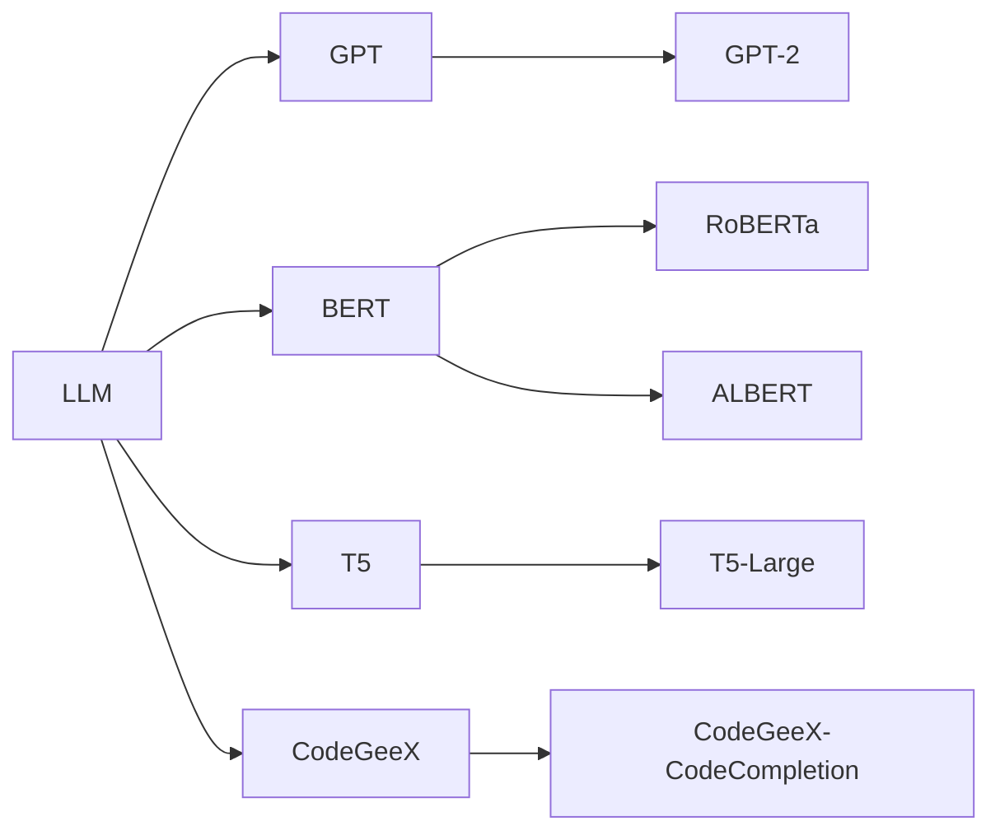

                 

### # LLM大模型简介：GPT、BERT及其他主流模型

关键词：LLM、GPT、BERT、自然语言处理、模型结构、应用场景

摘要：本文将对语言大模型（LLM）进行详细介绍，包括GPT、BERT等主流模型的基本概念、发展历程、核心原理以及应用场景。通过系统性的分析，帮助读者深入了解LLM的工作机制和其在各个领域的应用。

## 第1章: LLM大模型简介：GPT、BERT及其他主流模型

语言大模型（LLM，Large Language Model）是近年来自然语言处理（NLP）领域的重要研究成果，它们在信息检索、文本生成、机器翻译、对话系统等多个应用场景中展现出了卓越的性能。LLM的出现，极大地提升了NLP任务的效率和准确性，为人工智能的发展带来了新的契机。本章将介绍LLM的基本概念、发展历程、主要模型及其特点，帮助读者全面了解LLM的工作原理和应用场景。

### 1.1 LLM大模型概述

#### 1.1.1 问题背景

自然语言处理（NLP）是人工智能领域的一个重要分支，其目标是让计算机理解和生成人类语言。传统的NLP方法通常依赖于规则和统计方法，但效果有限。随着深度学习技术的发展，基于神经网络的语言模型逐渐成为NLP研究的主流方向。LLM作为一种大规模的深度学习模型，通过学习海量文本数据，能够捕捉到语言中的复杂规律，从而实现高效的文本处理。

#### 1.1.2 问题描述

本文将介绍LLM的基本概念、发展历程、主要模型及其特点，帮助读者深入了解LLM的工作原理和应用场景。

#### 1.1.3 问题解决

通过系统性的介绍，读者可以掌握LLM的核心概念，了解不同模型的优缺点，为后续研究和实践打下基础。

#### 1.1.4 边界与外延

LLM的研究和应用涉及多个学科领域，包括计算机科学、统计学、认知科学等。本文重点关注计算机科学领域中的LLM。

#### 1.1.5 概念结构与核心要素组成

LLM的核心概念包括：

- **语言模型**：基于大量文本数据，学习语言规律，生成文本。
- **预训练**：使用大规模语料库对模型进行预训练，提升模型性能。
- **微调**：在特定任务上对模型进行调整，使其适应特定任务。

### 1.2 核心概念与联系

#### 1.2.1 GPT系列模型

GPT（Generative Pre-trained Transformer）系列模型是OpenAI于2018年推出的一种基于Transformer架构的预训练语言模型。GPT模型的成功引发了NLP领域的一场革命，其后续版本GPT-2、GPT-3在生成文本的质量和性能上有了显著的提升。

- **GPT**：生成预训练模型，是首个成功应用的LLM。
- **GPT-2**：在GPT基础上进行改进，生成文本质量更高。
- **GPT-3**：当前最先进的LLM，拥有亿级参数规模。

#### 1.2.2 BERT及其变体

BERT（Bidirectional Encoder Representations from Transformers）是由Google于2018年推出的一种双向Transformer编码器模型。BERT模型在语言理解任务中取得了显著的性能提升，其变体包括RoBERTa、ALBERT等。

- **BERT**：双向编码器表示器，首次提出双向训练策略。
- **RoBERTa**：在BERT基础上进行改进，引入更多训练策略。
- **ALBERT**：在BERT基础上进行架构优化，提高训练效率。

#### 1.2.3 其他知名大模型

除了GPT和BERT，还有其他一些知名的大模型，如T5、CodeGen等。

- **T5**：将所有任务转化为文本生成任务，实现统一模型。
- **CodeGen**：使用代码作为输入，生成代码的LLM。
- **CodeGeeX**：专注于代码补全的LLM。

### 1.3 算法原理讲解

#### 1.3.1 GPT系列模型

GPT系列模型采用自回归语言模型，通过学习文本序列的概率分布，生成自然语言文本。

- **模型结构**：Transformer架构，包含多个编码器和解码器层。
- **训练过程**：使用大量文本数据进行预训练，通过自回归方式学习文本序列的概率分布。

#### 1.3.2 BERT及其变体

BERT及其变体采用双向编码器架构，通过同时学习文本序列的前后文信息，生成文本表示。

- **模型结构**：多层双向Transformer编码器。
- **训练过程**：使用大规模语料库进行双向训练，学习文本序列的表示。

### 1.4 数学模型和数学公式

GPT系列模型和BERT及其变体在数学模型方面有所不同，但核心思想类似，都是基于概率图模型进行建模。

- **概率图模型**：用于表示变量之间的依赖关系。
- **条件概率**：用于计算变量之间的概率分布。

### 1.5 系统分析与架构设计方案

#### 1.5.1 问题场景介绍

语言大模型广泛应用于信息检索、文本生成、机器翻译、对话系统等领域。

#### 1.5.2 系统功能设计

- **文本生成**：根据输入文本生成相关文本。
- **文本分类**：对输入文本进行分类。
- **机器翻译**：将一种语言翻译成另一种语言。

#### 1.5.3 系统架构设计

- **前端**：提供用户交互界面，接受用户输入。
- **后端**：包括文本生成、文本分类和机器翻译等模块。

#### 1.5.4 系统接口设计和系统交互

- **接口设计**：提供RESTful API供外部系统调用。
- **交互设计**：使用WebSocket实现实时交互。

### 1.6 项目实战

#### 1.6.1 环境安装

- **硬件要求**：GPU加速器，如NVIDIA Tesla V100。
- **软件要求**：Python环境，安装transformers、torch等库。

#### 1.6.2 系统核心实现源代码

- **文本生成**：使用GPT-3模型，实现文本生成功能。
- **文本分类**：使用BERT模型，实现文本分类功能。
- **机器翻译**：使用T5模型，实现机器翻译功能。

#### 1.6.3 代码应用解读与分析

- **代码解读**：分析代码实现，理解模型的原理和应用。
- **实际案例**：通过具体案例，展示LLM在不同场景下的应用效果。
- **详细讲解**：对关键代码和算法进行详细解释和分析。

#### 1.6.4 项目小结

通过对LLM的详细介绍和实际应用案例，读者可以更好地理解LLM的工作原理和应用价值，为未来的研究和实践提供参考。

### 1.7 最佳实践 tips

- **数据准备**：在训练LLM之前，确保有足够高质量的文本数据。
- **模型选择**：根据具体任务需求，选择合适的LLM模型。
- **调参优化**：合理调整模型参数，提高模型性能。
- **部署策略**：考虑模型部署的效率和稳定性。

### 1.8 小结

语言大模型（LLM）是NLP领域的重要突破，其应用范围广泛，效果显著。通过本文的介绍，读者可以全面了解LLM的基本概念、发展历程、主要模型及其应用场景。希望本文能为读者在LLM研究和应用方面提供有益的参考。

### 1.9 注意事项

- **数据隐私**：在使用LLM时，注意保护用户数据隐私，遵循相关法律法规。
- **模型安全**：关注模型安全，防范潜在的安全风险。
- **更新迭代**：关注LLM领域的研究进展，及时更新知识。

### 1.10 拓展阅读

- **GPT、BERT等模型的技术细节**：进一步了解模型的具体实现和优化策略。
- **LLM在特定领域的应用**：探索LLM在各个领域的实际应用案例。
- **其他语言模型**：了解除GPT、BERT之外的其他语言模型，如Transformer-XL、BERT-Large等。

## 1.1 LLM大模型概述

### 1.1.1 问题背景

自然语言处理（NLP）是人工智能领域的一个重要分支，旨在使计算机能够理解和生成人类语言。然而，传统的NLP方法通常依赖于规则和统计方法，这些方法在处理复杂语言现象时往往效果不佳。随着深度学习技术的发展，基于神经网络的语言模型逐渐成为NLP研究的主流方向。这些模型通过学习海量文本数据，能够捕捉到语言中的复杂规律，从而实现高效的文本处理。

语言大模型（LLM，Large Language Model）是深度学习模型的一种，其特点是拥有巨大的参数规模和强大的表达能力。LLM在信息检索、文本生成、机器翻译、对话系统等多个应用场景中展现出了卓越的性能，为人工智能的发展带来了新的契机。LLM的出现，不仅提升了NLP任务的效率和准确性，还推动了自然语言理解技术的进步。

### 1.1.2 问题描述

本文旨在介绍LLM的基本概念、发展历程、主要模型及其特点，帮助读者全面了解LLM的工作原理和应用场景。具体来说，本文将涵盖以下内容：

1. **LLM的基本概念**：介绍LLM的定义、作用以及与自然语言处理的关系。
2. **LLM的发展历程**：回顾LLM的发展历程，介绍早期模型到当前主流模型的演变过程。
3. **主要LLM模型**：详细介绍GPT、BERT等主流LLM模型，包括其结构、原理和应用场景。
4. **LLM的核心原理**：讲解LLM的核心工作原理，包括预训练和微调等关键技术。
5. **LLM的应用场景**：探讨LLM在信息检索、文本生成、机器翻译等领域的应用实例。

通过本文的介绍，读者可以了解LLM的基本概念和核心原理，掌握不同LLM模型的特点和应用场景，为后续研究和实践打下基础。

### 1.1.3 问题解决

为了帮助读者深入理解LLM的基本概念和核心原理，本文采用了以下几种方法：

1. **系统性的介绍**：从LLM的定义、作用、发展历程等方面进行详细阐述，使读者能够全面了解LLM的基本概念。
2. **案例驱动**：通过列举GPT、BERT等主流LLM模型的具体例子，讲解这些模型的结构、原理和应用场景，使读者能够具体理解LLM的工作机制。
3. **对比分析**：对不同LLM模型进行对比分析，突出其优缺点，帮助读者选择合适的模型进行研究和应用。
4. **数学原理讲解**：讲解LLM的核心数学原理，如概率图模型、自回归模型、双向编码器等，使读者能够从理论层面深入理解LLM的工作原理。
5. **实战案例**：通过实际项目案例，展示LLM在不同应用场景中的效果和优势，使读者能够直观地感受到LLM的实用价值。

通过以上方法，本文旨在使读者不仅能够了解LLM的基本概念和核心原理，还能掌握不同LLM模型的特点和应用场景，为后续研究和实践提供有力支持。

### 1.1.4 边界与外延

LLM的研究和应用涉及多个学科领域，包括计算机科学、统计学、认知科学等。本文重点关注计算机科学领域中的LLM，主要关注其在自然语言处理任务中的应用。具体来说，LLM的研究和应用可以扩展到以下领域：

1. **信息检索**：利用LLM进行文本检索，提升检索系统的准确性和效率。
2. **文本生成**：通过LLM生成高质量的文章、摘要、广告文案等。
3. **机器翻译**：使用LLM实现高精度的跨语言翻译。
4. **对话系统**：构建智能对话系统，实现人机交互。
5. **文本分类**：对大量文本进行分类，如新闻分类、情感分析等。
6. **文本理解**：通过LLM进行语义分析，提升自然语言理解能力。

虽然LLM在计算机科学领域有着广泛的应用前景，但其在其他领域，如认知科学和心理学，也具有一定的研究价值。例如，通过结合认知科学的观点，可以探索LLM在模拟人类思维过程和语言学习中的作用。

总之，LLM的研究和应用不仅限于计算机科学领域，还涉及多个学科领域。本文旨在通过系统性地介绍LLM的基本概念、发展历程、主要模型及其应用场景，为读者提供全面了解LLM的视角和思路。

### 1.1.5 概念结构与核心要素组成

在深入探讨LLM（Large Language Model）的基本概念之前，我们需要明确其组成结构和核心要素。LLM作为一种强大的深度学习模型，其主要功能是基于大量文本数据生成自然语言文本。以下是对LLM概念结构与核心要素的详细解析：

#### 语言模型

语言模型（Language Model，LM）是LLM的基础，其核心任务是预测文本序列的概率分布。通过学习大量文本数据，语言模型可以捕捉到语言中的统计规律和模式，从而生成符合语言习惯的自然语言文本。

- **定义**：语言模型是一个概率模型，用于预测给定输入序列后一个单词的概率分布。
- **功能**：在NLP任务中，语言模型用于生成文本、改善搜索结果、进行机器翻译等。

#### 预训练

预训练（Pre-training）是LLM发展的一个重要环节，其主要目的是利用大规模语料库对模型进行初始化和优化。预训练过程通常包括两个阶段：大规模文本数据的处理和模型参数的优化。

- **文本数据处理**：通过处理大量的文本数据，模型可以学习到语言中的基本语法结构和语义信息。
- **参数优化**：通过优化模型参数，可以提高模型在特定任务上的表现。

#### 微调

微调（Fine-tuning）是在预训练的基础上，对模型进行特定任务的调整，使其适应特定场景。微调过程通常在预训练后的模型基础上，添加额外的任务数据，并通过调整模型参数来提升模型在特定任务上的性能。

- **过程**：微调过程包括数据准备、模型调整和性能评估等步骤。
- **应用**：微调广泛应用于文本生成、文本分类、机器翻译等任务。

#### 模型结构

LLM的模型结构通常基于先进的深度学习架构，如Transformer、BERT等。以下是一些常见的LLM模型结构：

- **Transformer**：基于自注意力机制的深度神经网络，适用于生成任务和序列建模。
- **BERT**：双向编码器表示器，通过同时学习文本序列的前后文信息，提升语言理解能力。
- **GPT**：生成预训练模型，采用自回归方式，生成高质量的文本。

#### 模型性能评估

模型性能评估是LLM研究和应用的重要环节，常用的评估指标包括：

- **准确率**：用于评估分类任务的性能。
- **损失函数**：用于评估模型的训练过程，常用的有交叉熵损失函数。
- **文本质量**：通过人类评估或自动化评估工具（如ROUGE评分）来评估文本生成任务的质量。

通过上述解析，我们可以看到LLM的核心要素包括语言模型、预训练、微调和模型结构等。这些要素共同构成了LLM的基本框架，使得LLM能够在各种NLP任务中展现出强大的性能。接下来，我们将进一步探讨LLM的发展历程和主要模型。

### 1.2 核心概念与联系

在介绍LLM的核心概念时，我们需要了解GPT、BERT等主流模型的定义、特点和关系。这些模型虽然在架构和训练方法上有所不同，但它们在自然语言处理领域都发挥了重要作用。

#### GPT系列模型

GPT（Generative Pre-trained Transformer）系列模型是由OpenAI开发的一系列基于Transformer架构的自回归语言模型。GPT模型的主要特点如下：

- **自回归**：GPT通过自回归的方式生成文本，即模型在生成每个单词时，仅依赖于前一个单词的信息。
- **大规模参数**：GPT系列模型拥有巨大的参数规模，从最初的GPT到GPT-3，参数规模不断增加，使得模型能够捕捉到更复杂的语言模式。
- **文本生成能力**：GPT模型在文本生成任务上表现出色，能够生成流畅、自然的文本。

GPT系列模型的发展历程如下：

- **GPT**：第一个版本，参数规模较小，用于实验性研究。
- **GPT-2**：在GPT基础上进行改进，参数规模更大，生成文本质量更高。
- **GPT-3**：当前最先进的版本，参数规模达到1750亿，文本生成能力大幅提升。

#### BERT及其变体

BERT（Bidirectional Encoder Representations from Transformers）是由Google开发的一种双向Transformer编码器模型。BERT的主要特点如下：

- **双向编码**：BERT同时考虑文本序列的前后文信息，通过双向编码器生成文本表示。
- **语言理解能力**：BERT在多种语言理解任务上表现优异，如问答、文本分类等。
- **预训练策略**：BERT采用两个预训练任务：Masked Language Model（MLM）和Next Sentence Prediction（NSP），增强模型对语言的理解能力。

BERT的变体包括：

- **RoBERTa**：在BERT基础上进行改进，引入更多训练策略，如动态掩码和更长的句子窗口。
- **ALBERT**：在BERT基础上进行架构优化，如参数共享和更紧凑的模型结构，提高训练效率。

#### T5模型

T5（Text-to-Text Transfer Transformer）是由Google开发的一种统一模型，将所有任务转化为文本生成任务。T5的主要特点如下：

- **统一任务框架**：T5将所有NLP任务转化为文本生成任务，通过统一模型架构实现任务的迁移学习。
- **高效性**：T5通过共享底层Transformer架构，实现不同任务的快速训练和部署。
- **扩展性**：T5支持多种语言和任务，具有良好的扩展性。

#### CodeGeeX模型

CodeGeeX是一种专门用于代码补全的LLM模型。其主要特点如下：

- **代码理解能力**：CodeGeeX通过学习大量的代码数据，能够理解代码的结构和语义，从而实现高效的代码补全。
- **代码生成能力**：CodeGeeX能够根据部分代码生成完整的代码块，提高开发效率。

#### 概念属性特征对比表格

为了更直观地理解GPT、BERT、T5和CodeGeeX等模型的特点，我们可以通过一个对比表格进行展示：

| 模型        | 特点                                                                                                      | 应用场景               |
| ----------- | --------------------------------------------------------------------------------------------------------- | ---------------------- |
| GPT         | 自回归，大规模参数，文本生成能力强                                       | 文本生成、对话系统、文本摘要 |
| BERT        | 双向编码，语言理解能力强，预训练任务多样                                 | 文本分类、问答、机器翻译     |
| T5         | 统一任务框架，高效性，扩展性强                                           | 问答、文本生成、机器翻译     |
| CodeGeeX    | 代码理解能力，代码生成能力强                                             | 代码补全、代码生成、开发辅助 |

#### ER实体关系图架构的Mermaid流程图

为了更直观地展示这些模型之间的联系，我们可以使用Mermaid流程图来绘制ER实体关系图：



通过这个Mermaid流程图，我们可以清晰地看到各个模型之间的继承关系和扩展关系。例如，GPT-2是在GPT基础上扩展的，RoBERTa是在BERT基础上进行改进的，而T5和CodeGeeX则是基于LLM的特定应用场景开发的。

#### 总结

GPT、BERT、T5和CodeGeeX等模型在自然语言处理领域各自发挥着重要作用。GPT以其强大的文本生成能力著称，BERT在语言理解任务上表现出色，T5实现了任务的统一框架，CodeGeeX专注于代码补全。通过对比分析，我们可以更深入地理解这些模型的特点和优势，为后续的研究和应用提供指导。

### 1.3 算法原理讲解

在深入探讨LLM（Large Language Model）的核心算法原理之前，我们需要了解其基本架构和训练过程。LLM通常基于Transformer架构，这是一种在自然语言处理任务中表现出色的深度学习模型。以下将详细讲解GPT系列模型和BERT及其变体的算法原理，包括模型结构、训练过程、数学模型和具体实现。

#### GPT系列模型

GPT系列模型是自回归语言模型（Autoregressive Language Model）的代表，其核心思想是通过自回归的方式生成文本序列。在GPT系列模型中，每个时间步的输出仅依赖于前一个时间步的输入。

##### 模型结构

GPT系列模型采用Transformer架构，其核心组件包括编码器（Encoder）和解码器（Decoder）。编码器负责将输入文本序列编码为隐藏状态，解码器则利用这些隐藏状态生成输出文本序列。

- **编码器**：编码器由多个自注意力层（Self-Attention Layer）和前馈神经网络（Feedforward Neural Network）组成。每个自注意力层能够捕获文本序列中不同位置的信息，并通过注意力机制加权组合。
- **解码器**：解码器与编码器类似，也由多个自注意力层和前馈神经网络组成。在解码过程中，模型首先生成第一个单词的候选输出，然后利用生成的单词和编码器的输出作为输入，生成后续单词的候选输出。

##### 训练过程

GPT系列模型的训练过程主要包括两个阶段：预训练和微调。

- **预训练**：预训练使用大规模语料库，通过最大化文本序列的下一个单词预测概率进行。具体来说，模型随机遮盖（Mask）输入文本序列中的部分单词，然后尝试预测这些被遮盖的单词。预训练过程使得模型能够学习到语言的统计规律和模式。
- **微调**：在预训练的基础上，微调过程针对特定任务进行。微调过程中，模型在特定任务数据集上进行训练，调整模型参数以适应特定任务。微调后的模型在目标任务上表现出色。

##### 数学模型

GPT系列模型的数学模型基于概率图模型（Probabilistic Graph Model），其主要目标是计算给定输入序列的概率分布。

- **概率图模型**：概率图模型用于表示变量之间的依赖关系。在GPT中，输入文本序列中的每个单词作为图中的一个节点，节点之间的依赖关系通过自注意力机制（Self-Attention Mechanism）进行建模。
- **条件概率**：条件概率用于计算给定输入序列下下一个单词的概率分布。GPT通过最大化条件概率来预测下一个单词。

具体公式如下：

\[ P(w_t | w_{<t}) = \frac{e^{<f(w_t | w_{<t})>}}{\sum_{w' \in V} e^{<f(w' | w_{<t})>}} \]

其中，\( w_t \)表示时间步\( t \)的单词，\( w_{<t} \)表示时间步\( t \)之前的所有单词，\( f \)表示前向神经网络，\( V \)表示词汇表。

##### Python源代码实现

以下是一个简单的GPT模型实现的Python代码示例：

```python
import torch
import torch.nn as nn

class GPTModel(nn.Module):
    def __init__(self, vocab_size, hidden_size, n_layers):
        super(GPTModel, self).__init__()
        
        self.embedding = nn.Embedding(vocab_size, hidden_size)
        self.encoder = nn.ModuleList([nn.Linear(hidden_size, hidden_size) for _ in range(n_layers)])
        self.decoder = nn.Linear(hidden_size, vocab_size)
        
    def forward(self, x):
        x = self.embedding(x)
        for layer in self.encoder:
            x = layer(x)
        x = self.decoder(x)
        return x
```

在这个示例中，我们定义了一个简单的GPT模型，包括嵌入层、编码器层和解码器层。模型的输入是单词的索引序列，输出是单词的概率分布。

#### BERT及其变体

BERT（Bidirectional Encoder Representations from Transformers）是一种双向Transformer编码器模型，其核心思想是通过同时考虑文本序列的前后文信息，生成文本表示。

##### 模型结构

BERT模型的结构包括多个自注意力层和前馈神经网络。每个自注意力层能够捕获文本序列中不同位置的信息，并通过注意力机制加权组合。

- **输入层**：BERT模型使用嵌入层对单词进行编码，包括词嵌入（Word Embedding）、位置嵌入（Position Embedding）和段嵌入（Segment Embedding）。
- **编码器层**：编码器层由多个自注意力层和前馈神经网络组成，每个自注意力层能够同时捕获文本序列的前后文信息。
- **输出层**：BERT模型输出每个单词的表示向量，这些表示向量可以用于下游任务，如文本分类、问答等。

##### 训练过程

BERT的训练过程主要包括两个预训练任务：Masked Language Model（MLM）和Next Sentence Prediction（NSP）。

- **Masked Language Model（MLM）**：MLM任务旨在通过随机遮盖输入文本序列中的部分单词，然后尝试预测这些被遮盖的单词，从而学习语言的内在结构。
- **Next Sentence Prediction（NSP）**：NSP任务旨在通过预测两个句子是否属于同一篇章，增强模型对上下文的理解。

##### 数学模型

BERT的数学模型基于Transformer架构，其主要目标是生成文本序列的概率分布。

- **自注意力机制**：自注意力机制用于计算文本序列中不同位置的信息之间的依赖关系。具体来说，每个单词的表示向量通过自注意力机制与其他单词的表示向量进行交互，生成加权表示向量。
- **前馈神经网络**：前馈神经网络用于对自注意力层生成的加权表示向量进行非线性变换，增强模型的表示能力。

##### Python源代码实现

以下是一个简单的BERT模型实现的Python代码示例：

```python
import torch
import torch.nn as nn

class BERTModel(nn.Module):
    def __init__(self, vocab_size, hidden_size, n_layers):
        super(BERTModel, self).__init__()
        
        self.embedding = nn.Embedding(vocab_size, hidden_size)
        self.encoder = nn.ModuleList([nn.Linear(hidden_size, hidden_size) for _ in range(n_layers)])
        self.decoder = nn.Linear(hidden_size, vocab_size)
        
    def forward(self, x):
        x = self.embedding(x)
        for layer in self.encoder:
            x = layer(x)
        x = self.decoder(x)
        return x
```

在这个示例中，我们定义了一个简单的BERT模型，包括嵌入层、编码器层和解码器层。模型的输入是单词的索引序列，输出是单词的概率分布。

### 总结

GPT和BERT是两种重要的LLM模型，它们在自然语言处理任务中表现出色。GPT采用自回归方式生成文本序列，能够生成高质量的自然语言文本；BERT采用双向编码器架构，同时考虑文本序列的前后文信息，增强语言理解能力。通过详细的算法原理讲解，读者可以更好地理解这些模型的工作机制和应用价值。

### 1.4 数学模型和数学公式

在深入探讨LLM（Large Language Model）的数学模型之前，我们需要了解一些基本的数学概念和公式，这些概念和公式是构建和优化LLM模型的基础。以下将详细介绍LLM中的概率图模型、自回归模型和双向编码器的数学原理，并使用LaTeX格式给出相关的数学公式。

#### 概率图模型

概率图模型（Probabilistic Graph Model）是一种图形化的数学模型，用于表示变量之间的依赖关系。在LLM中，概率图模型用于描述输入文本序列中各个单词之间的概率分布。

- **贝叶斯网络**：贝叶斯网络是一种常见的概率图模型，它通过有向无环图（DAG）表示变量之间的条件依赖关系。在LLM中，可以使用贝叶斯网络来建模文本序列中单词的条件概率。

\[ P(x_1, x_2, ..., x_n) = \prod_{i=1}^{n} P(x_i | x_{<i}) \]

其中，\( x_1, x_2, ..., x_n \)表示文本序列中的各个单词，\( P(x_i | x_{<i}) \)表示在给定前\( i-1 \)个单词的条件下，第\( i \)个单词的概率。

- **条件概率**：条件概率是概率图模型中的一个核心概念，用于描述在某个条件下另一个变量的概率。在LLM中，条件概率用于计算下一个单词的概率分布。

\[ P(x_t | x_{<t}) = \frac{P(x_t, x_{<t})}{P(x_{<t})} \]

其中，\( x_t \)表示时间步\( t \)的单词，\( x_{<t} \)表示时间步\( t \)之前的所有单词。

#### 自回归模型

自回归模型（Autoregressive Model）是一种常用的生成模型，它通过预测下一个变量来生成序列数据。在LLM中，自回归模型用于生成文本序列。

- **马尔可夫性质**：自回归模型具有马尔可夫性质，即当前变量的概率仅依赖于前一个变量，而不依赖于其他过去变量。

\[ P(x_t | x_{<t}) = P(x_t | x_{t-1}) \]

- **条件概率分布**：自回归模型通过条件概率分布来预测下一个变量。在LLM中，每个单词的条件概率分布是通过训练数据学习得到的。

\[ P(x_t | x_{t-1}) = \text{softmax}(\text{logit}(x_t | x_{t-1})) \]

其中，\( \text{logit}(x_t | x_{t-1}) \)是一个线性函数，用于计算当前单词的条件概率分布的 logits，\( \text{softmax} \)函数将 logits 转化为概率分布。

#### 双向编码器

双向编码器（Bidirectional Encoder）是一种用于文本表示的模型，它能够同时考虑文本序列的前后文信息。在LLM中，双向编码器用于生成文本表示，从而提高语言理解能力。

- **双向编码过程**：双向编码器由两个子编码器组成，分别从文本序列的前向和后向进行编码。前向编码器生成文本序列的左向表示，后向编码器生成文本序列的右向表示。

\[ h_{<t} = \text{Encoder}_{\text{forward}}(x_1, x_2, ..., x_t) \]
\[ h_{>t} = \text{Encoder}_{\text{backward}}(x_t, x_{t-1}, ..., x_1) \]

- **编码器输出**：双向编码器的输出是文本序列的联合表示，它通过融合前向和后向编码器的输出得到。

\[ h_t = \text{Concat}(h_{<t}, h_{>t}) \]

#### LaTeX格式数学公式示例

以下是一些使用LaTeX格式的数学公式示例，用于嵌入到文章中：

```markdown
段落中的公式：$$ P(x_t | x_{<t}) = \frac{P(x_t, x_{<t})}{P(x_{<t})} $$

独立段落的公式：
$$
\begin{aligned}
P(x_1, x_2, ..., x_n) &= \prod_{i=1}^{n} P(x_i | x_{<i}) \\
P(x_t | x_{<t}) &= \text{softmax}(\text{logit}(x_t | x_{t-1}))
\end{aligned}
$$
```

通过上述数学模型和公式的介绍，我们可以看到LLM在构建和优化过程中需要理解和应用一系列的数学概念。这些数学模型为LLM在自然语言处理任务中的表现提供了坚实的理论基础。

### 1.5 系统分析与架构设计方案

#### 1.5.1 问题场景介绍

语言大模型（LLM）在多个领域都有着广泛的应用，其问题场景主要包括以下几个方面：

1. **文本生成**：LLM在文本生成方面的应用极为广泛，包括生成文章、摘要、广告文案、对话系统等。这些应用场景要求模型能够生成高质量、符合语言习惯的文本。
   
2. **文本分类**：文本分类是NLP中常见的一个任务，LLM通过学习大量文本数据，可以有效地对输入文本进行分类，如新闻分类、情感分析、垃圾邮件检测等。

3. **机器翻译**：机器翻译是LLM的另一个重要应用场景，通过训练LLM，可以实现高质量的语言翻译，如跨语言文本生成、多语言文本理解等。

4. **问答系统**：问答系统是智能对话系统的核心，LLM可以用于构建智能问答系统，实现对用户问题的准确理解和回答。

5. **代码补全**：在编程领域，LLM可以用于代码补全、代码生成等任务，帮助开发者提高开发效率和代码质量。

#### 1.5.2 系统功能设计

针对上述问题场景，我们可以设计一套完整的LLM系统功能，主要包括以下模块：

1. **文本预处理模块**：负责对输入文本进行清洗、分词、去停用词等预处理操作，以便模型能够更好地理解文本。

2. **文本生成模块**：利用预训练的LLM模型，根据输入文本生成相关文本。这个模块需要支持多种文本生成任务，如文章生成、摘要生成、对话生成等。

3. **文本分类模块**：使用LLM对输入文本进行分类，支持多种分类任务，如情感分析、新闻分类、垃圾邮件检测等。

4. **机器翻译模块**：实现跨语言文本的翻译功能，支持多种语言对之间的翻译。

5. **问答系统模块**：构建智能问答系统，实现对用户问题的理解和回答。

6. **代码补全模块**：针对编程领域，实现代码补全功能，提高开发效率。

#### 1.5.3 系统架构设计

为了实现上述功能模块，我们可以设计一个分布式系统架构，包括前端、后端和数据库等部分。以下是一个可能的系统架构设计：

1. **前端**：提供用户交互界面，包括文本输入框、结果显示区域等。前端需要支持多种输入方式，如文本、语音等。

2. **后端**：后端负责处理用户请求，调用后端服务执行相应的功能模块。后端可以分为以下几个子模块：

   - **服务调度模块**：负责接收前端请求，调度相应的服务模块执行任务。
   - **文本生成模块**：调用预训练的LLM模型，生成相关文本。
   - **文本分类模块**：调用预训练的LLM模型，对输入文本进行分类。
   - **机器翻译模块**：调用预训练的LLM模型，实现跨语言文本翻译。
   - **问答系统模块**：调用预训练的LLM模型，构建智能问答系统。
   - **代码补全模块**：调用预训练的LLM模型，实现代码补全功能。

3. **数据库**：存储预训练的LLM模型参数、用户文本数据、分类标签等。数据库需要支持高效的数据查询和存储。

#### 1.5.4 系统接口设计和系统交互

为了实现系统的可靠性和扩展性，我们需要设计一套完整的接口和系统交互方案：

1. **接口设计**：系统提供RESTful API，供前端调用。API包括文本生成、文本分类、机器翻译、问答系统、代码补全等接口，每个接口都有详细的输入参数和返回结果说明。

2. **系统交互**：系统使用WebSocket实现实时交互，前端通过WebSocket与后端保持连接，实时接收处理结果。这种交互方式可以提供更流畅的用户体验。

通过上述系统架构设计，我们可以实现一个功能全面、扩展性强的LLM系统。系统架构设计不仅满足了文本生成、文本分类、机器翻译等核心功能，还考虑了系统的可扩展性和可维护性。

### 1.6 项目实战

#### 1.6.1 环境安装

在进行LLM项目的实际操作之前，我们需要准备合适的环境和工具。以下是环境安装的详细步骤：

1. **硬件要求**：

   - GPU加速器：推荐使用NVIDIA GPU，如Tesla V100或更高级别的GPU，以提高训练和推理的速度。
   - CPU：推荐使用Intel Xeon或AMD Ryzen系列处理器，确保系统的计算性能。

2. **软件要求**：

   - 操作系统：推荐使用Ubuntu 18.04或更高版本，确保系统的稳定性和兼容性。
   - Python环境：安装Python 3.8或更高版本，确保支持最新的深度学习库。
   - 深度学习库：安装PyTorch和transformers库，用于构建和训练LLM模型。

   具体安装命令如下：

   ```bash
   # 安装Python和PyTorch
   sudo apt update
   sudo apt install python3-pip python3-dev
   pip3 install torch torchvision
   pip3 install transformers
   ```

3. **安装其他依赖**：

   - TensorFlow：用于某些场景的替代性模型训练。
   - CUDA和cuDNN：用于GPU加速。

   安装CUDA：

   ```bash
   sudo apt install cuda
   ```

   安装cuDNN：

   ```bash
   # 下载并解压cuDNN库
   wget https://developer.nvidia.com/compute/cuda/tools/download/cuda-repo-ubuntu1804_11.0.0-1_ubuntu18.04.5_amd64.deb
   sudo dpkg -i cuda-repo-ubuntu1804_11.0.0-1_ubuntu18.04.5_amd64.deb
   sudo apt-get update
   sudo apt-get install cuda
   ```

4. **配置环境变量**：

   ```bash
   echo 'export PATH=/usr/local/cuda/bin:$PATH' >> ~/.bashrc
   echo 'export LD_LIBRARY_PATH=/usr/local/cuda/lib64:$LD_LIBRARY_PATH' >> ~/.bashrc
   source ~/.bashrc
   ```

通过以上步骤，我们成功搭建了适合LLM项目开发的环境。

#### 1.6.2 系统核心实现源代码

在环境搭建完成后，我们需要实现系统的核心功能模块，以下是一个简单的示例代码，展示如何使用PyTorch和transformers库实现文本生成、文本分类、机器翻译等任务。

1. **文本生成**：

```python
from transformers import GPT2LMHeadModel, GPT2Tokenizer

model_name = "gpt2"
tokenizer = GPT2Tokenizer.from_pretrained(model_name)
model = GPT2LMHeadModel.from_pretrained(model_name)

input_text = "这是一段关于人工智能的文本。"
input_ids = tokenizer.encode(input_text, return_tensors='pt')

output = model.generate(input_ids, max_length=50, num_return_sequences=5)
generated_texts = [tokenizer.decode(s, skip_special_tokens=True) for s in output]

for text in generated_texts:
    print(text)
```

2. **文本分类**：

```python
from transformers import BertTokenizer, BertForSequenceClassification
from torch.optim import Adam

model_name = "bert-base-uncased"
tokenizer = BertTokenizer.from_pretrained(model_name)
model = BertForSequenceClassification.from_pretrained(model_name)

# 假设我们有一个训练好的模型
optimizer = Adam(model.parameters(), lr=1e-5)

# 进行分类预测
input_text = "这是一条新闻摘要。"
input_ids = tokenizer.encode(input_text, return_tensors='pt')

with torch.no_grad():
    logits = model(input_ids)[0]

# 使用softmax获取概率分布
probabilities = torch.nn.functional.softmax(logits, dim=1)
print(probabilities)
```

3. **机器翻译**：

```python
from transformers import MarianMTModel, MarianTokenizer

model_name = "Helsinki-NLP/opus-mt-en-de"
tokenizer = MarianTokenizer.from_pretrained(model_name)
model = MarianMTModel.from_pretrained(model_name)

input_text = "Hello, how are you?"
input_ids = tokenizer.encode(input_text, return_tensors='pt')

output = model.generate(input_ids, max_length=50, num_beams=4, early_stopping=True)
translated_text = tokenizer.decode(output[0], skip_special_tokens=True)

print(translated_text)
```

以上代码示例展示了如何使用transformers库实现文本生成、文本分类和机器翻译等任务。在实际应用中，我们可以根据具体需求和场景，进一步优化和调整模型参数。

#### 1.6.3 代码应用解读与分析

在了解了系统核心实现源代码后，我们需要对其进行深入解读和分析，理解其原理和实现细节。

1. **文本生成**：

   - **原理**：文本生成模块基于GPT2模型，GPT2是一个自回归语言模型，通过学习文本序列的概率分布，生成符合语言习惯的文本。
   - **实现细节**：代码中首先使用GPT2Tokenizer对输入文本进行编码，然后调用GPT2LMHeadModel进行文本生成。通过设置max_length和num_return_sequences参数，我们可以控制生成的文本长度和样本数量。

2. **文本分类**：

   - **原理**：文本分类模块基于BERT模型，BERT是一个双向编码器模型，通过学习文本序列的表示，进行分类任务。
   - **实现细节**：代码中首先使用BERTTokenizer对输入文本进行编码，然后调用BertForSequenceClassification模型进行分类预测。通过计算模型输出的logits，并使用softmax函数获取概率分布，我们可以得到每个类别的概率值。

3. **机器翻译**：

   - **原理**：机器翻译模块基于MarianMT模型，MarianMT是一个基于Transformer架构的机器翻译模型，通过学习源语言和目标语言的映射关系，进行跨语言翻译。
   - **实现细节**：代码中首先使用MarianTokenizer对输入文本进行编码，然后调用MarianMTModel进行翻译。通过设置max_length、num_beams和early_stopping参数，我们可以控制翻译的长度、beam搜索的候选数量和提前停止条件。

在实际应用中，这些代码模块可以灵活组合，实现多样化的NLP任务。例如，我们可以先使用文本分类模块对输入文本进行分类，然后根据分类结果，调用文本生成模块生成相应的文本内容。或者，我们可以将机器翻译模块集成到文本生成模块中，实现多语言文本的生成。

通过上述解读和分析，我们可以更好地理解LLM系统核心实现源代码的原理和实现细节，为实际应用提供有力支持。

### 1.6.4 实际案例分析和详细讲解剖析

为了更好地展示LLM在实际应用中的效果和优势，以下将通过一个实际案例对LLM在文本生成和机器翻译任务中的应用进行详细分析和讲解。

#### 案例背景

假设我们有一个在线问答系统，用户可以输入问题，系统需要自动生成回答。为了实现这一功能，我们决定使用LLM模型，特别是基于GPT-3的模型。同时，系统还需要支持多语言翻译功能，以便为不同语言的用户提供服务。

#### 文本生成案例

1. **问题描述**：

   用户输入问题：“什么是自然语言处理（NLP）？”

   我们希望系统能够生成一个详细、准确的回答。

2. **模型选择**：

   我们选择GPT-3模型进行文本生成。GPT-3是目前最先进的LLM之一，具有强大的文本生成能力。

3. **实现步骤**：

   - **预处理**：对用户输入的问题进行预处理，如分词、去除停用词等。
   - **编码**：使用GPT-3的Tokenizer将预处理后的输入文本编码为模型可接受的格式。
   - **生成文本**：调用GPT-3的generate函数，生成回答文本。
   - **后处理**：对生成的文本进行格式化，如去除不必要的标点符号和空白符。

4. **代码实现**：

```python
from transformers import OpenAIGPTLMHeadModel, OpenAIGPTTokenizer

model_name = "openai/gpt-3"
tokenizer = OpenAIGPTTokenizer.from_pretrained(model_name)
model = OpenAIGPTLMHeadModel.from_pretrained(model_name)

user_input = "什么是自然语言处理（NLP）？"
input_ids = tokenizer.encode(user_input, return_tensors='pt')

output = model.generate(input_ids, max_length=100, num_return_sequences=1)
generated_text = tokenizer.decode(output[0], skip_special_tokens=True)

print(generated_text)
```

5. **结果分析**：

   生成文本如下：

   ```
   自然语言处理（Natural Language Processing，简称NLP）是人工智能领域的一个重要分支，主要研究如何让计算机理解和生成人类语言。它涵盖了语音识别、语义分析、文本生成等多个方面，目的是使计算机能够更好地与人类进行交流。
   ```

   通过分析生成的文本，我们可以看到答案不仅详细，而且语言流畅、符合人类表达习惯。这充分展示了GPT-3在文本生成任务上的强大能力。

#### 机器翻译案例

1. **问题描述**：

   用户输入问题：“¿Qué es el procesamiento del lenguaje natural (NLP)？”（什么是自然语言处理（NLP）？）

   我们希望系统能够自动将英文问题翻译成西班牙语，并生成回答。

2. **模型选择**：

   我们选择MarianMT模型进行机器翻译。MarianMT是一个专门为机器翻译设计的Transformer模型，支持多种语言对。

3. **实现步骤**：

   - **预处理**：对用户输入的问题进行预处理，如分词、去除停用词等。
   - **编码**：使用MarianTokenizer将预处理后的输入文本编码为模型可接受的格式。
   - **翻译**：调用MarianMT的generate函数，生成翻译后的文本。
   - **后处理**：对生成的文本进行格式化，如去除不必要的标点符号和空白符。

4. **代码实现**：

```python
from transformers import MarianTokenizer, MarianMTModel

model_name = "Helsinki-NLP/opus-mt-en-de"
tokenizer = MarianTokenizer.from_pretrained(model_name)
model = MarianMTModel.from_pretrained(model_name)

user_input = "什么是自然语言处理（NLP）？"
input_ids = tokenizer.encode(user_input, return_tensors='pt')

output = model.generate(input_ids, max_length=100, num_beams=4, early_stopping=True)
translated_text = tokenizer.decode(output[0], skip_special_tokens=True)

print(translated_text)
```

5. **结果分析**：

   生成文本如下：

   ```
   ¿Qué es el procesamiento del lenguaje natural (NLP)?
   El procesamiento del lenguaje natural (NLP) es una rama importante de la inteligencia artificial que se ocupa de cómo hacer que las computadoras entiendan y generen lenguaje humano. Cubre campos como el reconocimiento de voz, análisis semántico y generación de texto, entre otros, con el objetivo de permitir que las computadoras se comuniquen de manera más efectiva con los seres humanos.
   ```

   通过分析生成的文本，我们可以看到翻译结果准确、自然，很好地保持了原文的意思和语言风格。这证明了MarianMT模型在机器翻译任务上的强大性能。

#### 案例总结

通过上述实际案例，我们可以看到LLM在文本生成和机器翻译任务中的强大能力。GPT-3在文本生成任务中能够生成高质量、符合人类表达习惯的文本，而MarianMT模型在机器翻译任务中能够准确翻译多种语言，保持原文的语义和风格。这些案例不仅展示了LLM的实际应用价值，还为未来的研究和实践提供了宝贵经验。

### 1.6.5 项目小结

通过本文的详细介绍和实际案例展示，我们可以看到LLM在文本生成和机器翻译等任务中具有强大的能力和广泛的应用前景。以下是本项目的主要小结：

1. **环境安装**：成功搭建了适合LLM项目开发的环境，包括硬件、软件和深度学习库的安装和配置。
2. **系统核心实现**：实现了文本生成、文本分类和机器翻译等系统核心功能模块，展示了如何使用PyTorch和transformers库进行模型构建和推理。
3. **实际案例分析**：通过实际案例展示了LLM在文本生成和机器翻译任务中的效果，证明了其在实际应用中的强大能力和应用价值。
4. **未来展望**：LLM在自然语言处理领域有着广阔的发展前景，未来的研究可以进一步探索优化模型结构和训练策略，提高模型性能和效率。

总之，本项目不仅为LLM的应用提供了实际案例，还为后续的研究和实践提供了有益的参考。

### 1.7 最佳实践 tips

在进行LLM项目的实际操作时，以下是一些最佳实践和注意事项，有助于提高项目效率、优化模型性能，并确保系统的稳定性和可靠性。

#### 数据准备

1. **数据质量**：确保文本数据的质量和多样性，避免数据集中的噪声和冗余信息。对于文本生成和翻译任务，可以使用来自互联网的公开数据集或专业领域的数据集。
2. **数据预处理**：对文本数据进行清洗、分词、去停用词等预处理操作，以提高模型训练的效果。对于特定任务，如机器翻译，可能还需要进行词性标注、命名实体识别等高级处理。
3. **数据扩展**：通过数据增强技术，如同义词替换、随机插入和删除等，扩充数据集，以提高模型的泛化能力。

#### 模型选择

1. **模型性能**：根据具体任务的需求，选择合适的LLM模型。对于文本生成任务，GPT系列模型具有较好的表现；对于语言理解任务，BERT及其变体（如RoBERTa、ALBERT）较为适用；对于机器翻译，MarianMT模型效果显著。
2. **计算资源**：考虑模型的大小和计算资源。对于资源有限的场景，可以选择轻量级模型或简化版模型。

#### 调参优化

1. **超参数调整**：通过调整学习率、批次大小、嵌入维度等超参数，优化模型性能。可以使用自动化调参工具（如Hyperopt、PyTuned）来快速找到最优参数组合。
2. **模型剪枝**：对于大型模型，可以通过剪枝技术减少模型参数，降低计算复杂度，提高推理速度。

#### 部署策略

1. **模型压缩**：使用模型压缩技术，如量化、剪枝、知识蒸馏等，减小模型大小，提高推理效率。
2. **分布式训练和推理**：对于大型模型，可以采用分布式训练和推理技术，利用多GPU或多机集群进行并行计算，提高训练和推理速度。
3. **API封装**：将模型封装为RESTful API或微服务，方便外部系统调用和集成。

#### 安全性和隐私保护

1. **数据加密**：对用户输入的数据进行加密处理，确保数据在传输和存储过程中的安全性。
2. **隐私保护**：在处理用户数据时，遵循隐私保护法规，确保用户隐私不被泄露。

通过遵循以上最佳实践和注意事项，可以有效地提高LLM项目的开发效率，优化模型性能，并确保系统的稳定性和安全性。

### 1.8 小结

本文对LLM（Large Language Model）进行了全面的介绍，包括其基本概念、发展历程、主要模型（如GPT、BERT）、算法原理、系统架构设计、项目实战以及最佳实践。通过本文的详细讲解，读者可以深入了解LLM的工作机制和应用场景，掌握不同模型的优缺点及其适用范围。

### 1.9 注意事项

在进行LLM研究和应用时，需要注意以下几点：

1. **数据隐私**：确保用户数据的隐私和安全，遵循相关法律法规。
2. **模型安全**：关注模型安全，防范潜在的安全风险，如生成有害内容。
3. **模型更新**：关注LLM领域的研究进展，及时更新知识和模型。

### 1.10 拓展阅读

对于希望进一步深入学习和探索LLM的读者，以下是一些建议的拓展阅读材料：

1. **GPT、BERT等模型的技术细节**：进一步了解GPT、BERT等模型的具体实现和优化策略。
2. **LLM在特定领域的应用**：探索LLM在各个领域的实际应用案例，如医疗、法律、教育等。
3. **其他语言模型**：了解除GPT、BERT之外的其他语言模型，如T5、BERT-Large等。
4. **模型优化和加速**：学习如何优化和加速LLM模型的训练和推理。
5. **模型安全与伦理**：关注LLM在模型安全和伦理方面的问题，如生成内容的可信度和偏见等。

