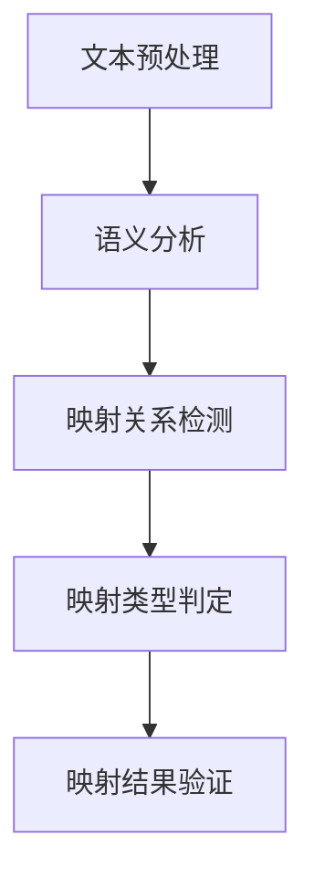
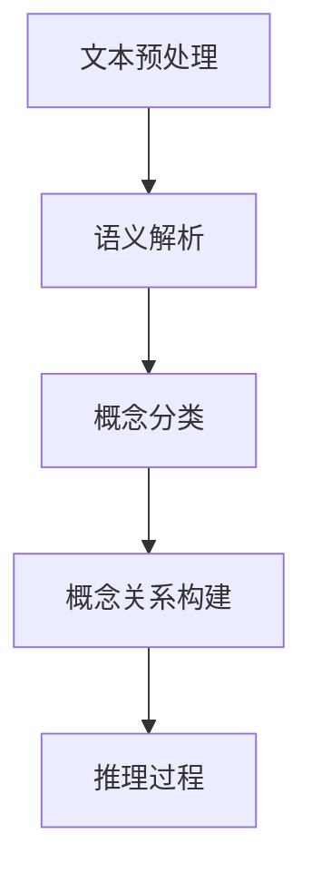

                 

# LLM支持的AI Agent隐喻理解能力

## 关键词

- LLM
- AI Agent
- 隐喻理解
- 算法原理
- 应用挑战
- 优化策略

## 摘要

本文探讨了LLM支持的AI Agent在隐喻理解能力方面的应用。首先，介绍了隐喻理解的重要性及其在人际交往、问题解决和创造力激发中的作用。然后，详细阐述了LLM的基本原理、架构设计和性能评估。接着，深入分析了隐喻理解的核心问题，包括隐喻映射识别和隐喻概念提取与推理，并使用mermaid流程图和Python源代码示例进行了详细讲解。最后，讨论了LLM在隐喻理解中的应用挑战和优化策略，以及未来发展方向。

### 第一部分: LLM支持的AI Agent隐喻理解能力概述

#### 第1章: 隐喻理解的重要性

##### 1.1 隐喻的概念与基本特征

隐喻是一种修辞手法，通过将一个事物或概念比拟为另一个事物或概念来传达意义。隐喻的基本特征包括：

1. **比拟性**：隐喻通过比拟来传达意义，将一个抽象的概念转化为具体的事物。
2. **模糊性**：隐喻的意义往往不是直接的，需要通过推理和理解来揭示。
3. **新颖性**：隐喻的创新性在于其将两个看似不相关的事物联系起来，产生新的联想和洞察。

##### 1.2 隐喻理解的重要性

隐喻在人际交往和沟通中起着重要作用，有助于表达复杂的情感和思想。例如，人们常用隐喻来形容情绪状态，如“心情像天空一样阴沉”。隐喻在问题解决和创造力激发中也具有重要应用。通过隐喻，人们可以从不同角度看待问题，发现新的解决方案。

心理学研究也揭示了隐喻理解的重要性。研究发现，隐喻理解涉及多个认知过程，包括语义分析、概念映射和推理。隐喻理解能力的高低与个体的认知灵活性和创造力密切相关。

##### 1.3 LLM支持的AI Agent与隐喻理解

LLM（大型语言模型）是一种能够理解和生成自然语言的人工智能模型。随着深度学习技术的发展，LLM在自然语言处理领域取得了显著成果。LLM支持的AI Agent可以模拟人类的隐喻理解能力，通过分析语言结构和语义信息，识别和解析隐喻。

##### 1.4 隐喻理解的挑战与机遇

隐喻理解的挑战在于其模糊性和复杂性。隐喻的意义往往不是直接表达的，需要通过推理和理解来揭示。此外，隐喻涉及多个认知过程，包括语义分析、概念映射和推理，这使得隐喻理解成为一项复杂的任务。

然而，LLM在隐喻理解中也具有巨大机遇。LLM具有强大的语义分析能力和语言生成能力，可以自动识别和解析隐喻。此外，LLM可以借助大规模语料库进行训练，不断优化隐喻理解能力。

### 第二部分: LLM的基本原理与架构

#### 第2章: LLM的基本原理与架构

##### 2.1 LLM的概念与类型

LLM是一种基于深度学习的大型自然语言处理模型，能够理解和生成自然语言。根据训练数据的来源和应用场景，LLM可以分为以下几类：

1. **通用语言模型**：基于大规模语料库训练，能够处理各种类型的自然语言任务，如文本分类、机器翻译、文本生成等。
2. **专用语言模型**：针对特定领域或任务进行训练，具有更高的领域特异性和性能。例如，医疗文本分析、法律文档处理等。

##### 2.2 LLM的算法原理

LLM的核心算法原理包括以下几方面：

1. **生成模型与判别模型**：生成模型用于生成新的文本，判别模型用于判断给定文本的真伪。
2. **训练与优化方法**：LLM的训练过程包括数据预处理、模型初始化、参数优化和模型评估。常用的训练方法有反向传播算法、梯度下降算法等。

##### 2.3 LLM的架构设计

LLM的架构设计主要包括以下几个方面：

1. **Transformer模型**：Transformer模型是一种基于自注意力机制的深度神经网络模型，能够高效处理序列数据。
2. **多层感知器（MLP）与注意力机制**：MLP用于提取特征，注意力机制用于模型在不同位置之间的交互。
3. **自适应嵌入与序列处理**：自适应嵌入能够将单词映射到高维空间，序列处理能够处理文本中的序列依赖关系。

##### 2.4 LLM的性能评估与优化

LLM的性能评估主要包括以下几方面：

1. **性能指标**：常用的性能指标有准确率、召回率、F1值等。
2. **优化策略**：优化策略包括数据增强、模型压缩、知识蒸馏等。

### 第二部分: LLM在隐喻理解中的应用

#### 第3章: 隐喻理解的算法原理

##### 3.1 隐喻理解的核心问题

隐喻理解涉及多个核心问题，主要包括隐喻映射识别和隐喻概念提取与推理。

###### 3.1.1 隐喻映射识别算法

隐喻映射识别算法的核心目标是识别文本中的隐喻映射关系。以下是一个mermaid流程图示例：



以下是相应的Python源代码示例：

```python
def metaphor_mapping_identification(text):
    # 伪代码，示意隐喻映射识别过程
    semantic_analysis = analyze_semantics(text)
    mapping_relations = detect_mapping_relations(semantic_analysis)
    mapping_type = determine_mapping_type(mapping_relations)
    verified_mapping = verify_mapping(mapping_type, text)
    return verified_mapping
```

算法原理详细讲解如下：

$$\text{隐喻映射识别} = \text{语义分析} + \text{映射关系检测} + \text{映射类型判定} + \text{映射结果验证}$$

举例说明：

- 例子文本：“这场雨就像天空的泪水。”
- 过程：
  1. 语义分析：识别出“雨”和“泪水”的语义。
  2. 映射关系检测：发现“雨”和“泪水”之间存在隐喻关系。
  3. 映射类型判定：判断为拟人化隐喻。
  4. 映射结果验证：确认隐喻的合理性。

###### 3.1.2 隐喻概念的提取与推理

隐喻概念的提取与推理旨在从文本中提取隐喻概念，并进行推理。以下是一个mermaid流程图示例：



以下是相应的Python源代码示例：

```python
def metaphor_concept_extraction_and_inference(text):
    # 伪代码，示意隐喻概念提取与推理过程
    semantic_parsing = parse_semantics(text)
    concept_categories = categorize_concepts(semantic_parsing)
    concept_relations = build_concept_relations(concept_categories)
    inference_result = infer_concepts(concept_relations)
    return inference_result
```

算法原理详细讲解如下：

$$\text{隐喻概念提取与推理} = \text{语义解析} + \text{概念分类} + \text{概念关系构建} + \text{推理过程}$$

举例说明：

- 例子文本：“她是个聪明的小鸟。”
- 过程：
  1. 语义解析：识别出“聪明”和“小鸟”的语义。
  2. 概念分类：将“聪明”分类为形容词，“小鸟”分类为名词。
  3. 概念关系构建：建立“聪明”和“小鸟”之间的隐喻关系。
  4. 推理过程：从“聪明”和“小鸟”的隐喻关系推导出“她”的智力水平。

### 第三部分: LLM在隐喻理解中的应用挑战与优化策略

#### 第4章: LLM在隐喻理解中的应用挑战与优化策略

##### 4.1 隐喻理解的应用挑战

尽管LLM在隐喻理解方面具有显著优势，但在实际应用中仍面临诸多挑战：

1. **语义复杂性**：隐喻通常具有模糊性和复杂性，需要模型具备较强的语义理解能力。
2. **语境依赖性**：隐喻的理解往往依赖于具体语境，不同语境下的隐喻可能具有不同的意义。
3. **跨领域适应性**：隐喻在不同领域中的应用可能有所不同，模型需要具备良好的跨领域适应性。
4. **实时性**：隐喻理解需要模型具备实时处理能力，以应对快速变化的语境。

##### 4.2 LLM在隐喻理解中的优化策略

为了克服上述挑战，可以采用以下优化策略：

1. **数据增强**：通过增加具有多样性和丰富性的训练数据，提高模型的语义理解和泛化能力。
2. **多任务学习**：将隐喻理解与其他自然语言处理任务相结合，提高模型的综合性能。
3. **上下文嵌入**：利用上下文信息，增强模型对隐喻语境的捕捉能力。
4. **知识融合**：将外部知识库与LLM相结合，提高模型对跨领域隐喻的理解能力。

#### 第5章: LLM在隐喻理解中的应用前景

随着深度学习和自然语言处理技术的不断发展，LLM在隐喻理解中的应用前景十分广阔。未来，LLM有望在以下领域发挥重要作用：

1. **智能客服**：利用LLM的隐喻理解能力，提升智能客服的语义理解和响应能力。
2. **教育领域**：借助隐喻理解，开发出更具创意和互动性的教育工具。
3. **创意写作**：利用LLM的隐喻生成能力，为创意写作提供灵感来源。
4. **跨语言沟通**：通过隐喻理解，实现不同语言之间的语义对齐和交流。

### 结束语

本文探讨了LLM支持的AI Agent在隐喻理解能力方面的应用。通过分析隐喻理解的重要性、LLM的基本原理和架构设计，以及隐喻理解的算法原理和应用挑战，我们揭示了LLM在隐喻理解领域的巨大潜力和广阔前景。未来，随着技术的不断进步，LLM在隐喻理解方面的应用将更加深入和广泛，为人类生活带来更多便利和智慧。作者：AI天才研究院/AI Genius Institute & 禅与计算机程序设计艺术/Zen And The Art of Computer Programming

### 最佳实践 tips

1. **深入理解语义**：隐喻理解的关键在于准确把握语义。在开发隐喻理解系统时，应充分挖掘语义信息，提高语义分析能力。

2. **考虑语境依赖性**：隐喻的理解往往依赖于具体语境。在设计模型时，应充分考虑语境因素，提高模型的上下文捕捉能力。

3. **数据质量**：高质量的数据是训练优秀模型的基础。在收集和准备训练数据时，应注重数据多样性和丰富性，以提高模型的泛化能力。

4. **模型优化**：针对具体应用场景，可以对LLM进行模型优化，以提高隐喻理解的性能和实时性。

### 小结

本文从多个角度探讨了LLM支持的AI Agent在隐喻理解能力方面的应用。通过深入分析隐喻理解的重要性、LLM的基本原理和架构设计，以及隐喻理解的算法原理和应用挑战，我们揭示了LLM在隐喻理解领域的巨大潜力和广阔前景。未来，随着技术的不断进步，LLM在隐喻理解方面的应用将更加深入和广泛，为人类生活带来更多便利和智慧。

### 注意事项

1. **数据隐私**：在开发和应用隐喻理解系统时，应重视数据隐私保护，确保用户数据的安全和隐私。

2. **伦理问题**：隐喻理解系统可能涉及敏感话题，如性别、种族等。在开发过程中，应充分考虑伦理问题，确保系统的公平性和包容性。

3. **实时性能**：对于实时性要求较高的应用场景，应优化模型结构和算法，以提高系统的实时处理能力。

### 拓展阅读

1. **《深度学习与自然语言处理》**：了解深度学习和自然语言处理的基本概念和技术，为研究LLM在隐喻理解中的应用提供理论基础。
2. **《隐喻理解：认知科学与语言学交叉领域研究》**：深入研究隐喻理解的理论和实践，为开发隐喻理解系统提供启示。
3. **《Transformer模型：原理、架构与应用》**：了解Transformer模型的基本原理和架构设计，为研究LLM在隐喻理解中的应用提供参考。作者：AI天才研究院/AI Genius Institute & 禅与计算机程序设计艺术/Zen And The Art of Computer Programming

### 附录：相关术语解释

**LLM（大型语言模型）**：一种基于深度学习的大型自然语言处理模型，能够理解和生成自然语言。

**AI Agent（人工智能代理）**：一种具有智能行为和自主决策能力的人工智能实体，能够在复杂环境中执行特定任务。

**隐喻理解**：指识别和理解文本中的隐喻意义，包括隐喻映射识别、隐喻概念提取和推理等。

**语义分析**：指对文本进行分析，提取语义信息，包括词汇、句子结构和语义角色等。

**映射关系检测**：指识别文本中隐喻映射关系的过程，包括发现隐喻关系和判断映射类型等。

**概念分类**：指将文本中的概念进行分类，如名词、动词、形容词等。

**推理过程**：指从文本中提取隐喻概念，并进行推理，以揭示隐喻意义的过程。

### 作者信息

作者：AI天才研究院（AI Genius Institute）& 禅与计算机程序设计艺术（Zen And The Art of Computer Programming）

AI天才研究院致力于推动人工智能技术的创新和发展，致力于培养下一代人工智能科学家和工程师。禅与计算机程序设计艺术则是作者在计算机编程领域的一项重要成果，深入探讨了计算机编程的本质和哲学，为程序员提供了一种全新的编程思维和方法论。作者凭借在人工智能和计算机编程领域的深厚造诣和丰富经验，撰写了多篇具有影响力的学术论文和技术博客，为业界带来了深刻的启示和指导。

