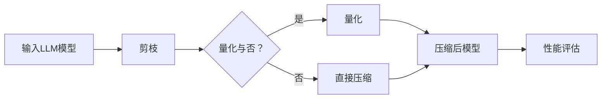
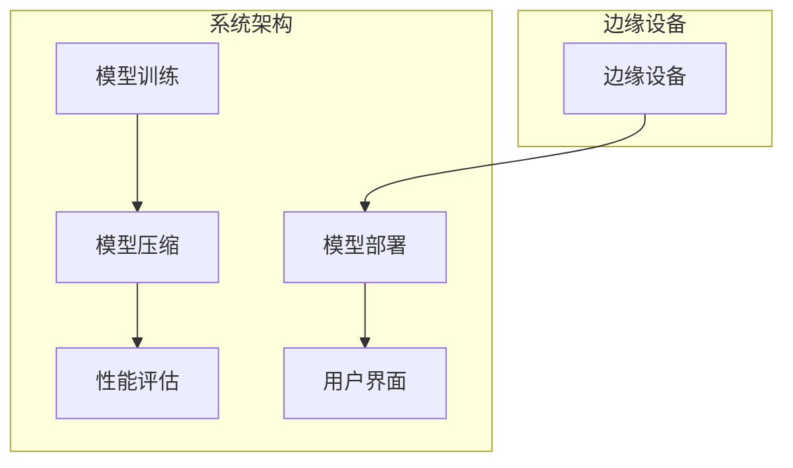
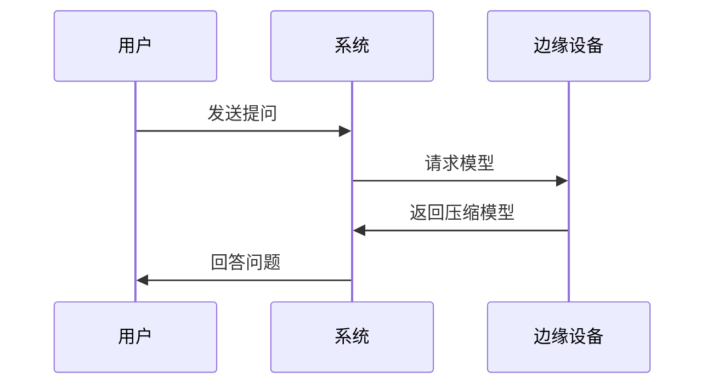

                 

### LLMM模型压缩技术：在边缘设备部署AI Agent

#### 关键词：LLM模型、模型压缩、边缘设备、AI Agent、部署技术

#### 摘要：
随着人工智能（AI）技术的迅猛发展，大型语言模型（LLM）在自然语言处理（NLP）、智能问答、机器翻译等领域展现出强大的能力。然而，这些LLM模型往往需要大量的计算资源，无法直接在边缘设备上部署。本文将深入探讨LLM模型压缩技术，分析其在边缘设备部署AI Agent中的应用，并提出相应的算法原理、系统架构设计方案和项目实战经验。

#### 目录大纲：

**第一部分：LLM模型压缩技术概述**

**第1章：引言**

1.1 问题背景与重要性

1.2 LLM模型与边缘设备部署

1.3 模型压缩技术的目标与挑战

**第2章：核心概念与联系**

2.1 LLM模型基本原理

2.2 模型压缩方法概述

2.3 边缘设备特性与挑战

**第3章：算法原理讲解**

3.1 算法mermaid流程图

3.2 Python源代码示例

3.3 数学模型和公式详解

3.4 举例说明

**第4章：系统分析与架构设计方案**

4.1 问题场景介绍

4.2 项目介绍

4.3 系统功能设计

4.4 系统架构设计

4.5 系统接口设计和系统交互

**第5章：项目实战**

5.1 环境安装

5.2 系统核心实现源代码

5.3 代码应用解读与分析

5.4 实际案例分析和详细讲解剖析

5.5 项目小结

**第6章：最佳实践 tips、小结、注意事项、拓展阅读**

6.1 最佳实践 tips

6.2 小结

6.3 注意事项

6.4 拓展阅读

### 背景介绍

#### 1.1 问题背景与重要性

在当今信息时代，人工智能技术已经成为推动社会发展的重要力量。其中，大型语言模型（LLM）作为深度学习的重要成果，广泛应用于自然语言处理（NLP）领域，包括文本生成、机器翻译、问答系统等。然而，这些复杂的LLM模型通常需要庞大的计算资源和存储空间，这使得它们难以在资源受限的边缘设备上部署。边缘设备通常包括智能手机、物联网设备、智能家居等，这些设备的计算能力、存储空间和功耗都有限制，因此需要一种有效的模型压缩技术，以实现LLM模型的轻量化部署。

#### 1.2 LLM模型与边缘设备部署

大型语言模型（LLM）通常基于深度神经网络（DNN），具有数亿甚至数万亿的参数。这些参数需要大量的计算资源和存储空间来训练和存储。随着AI应用从云端走向边缘，边缘设备的计算资源和存储能力相对较弱，这使得直接部署LLM模型变得困难。因此，研究如何压缩LLM模型，使其能够在边缘设备上高效运行，具有重要的实际意义。

#### 1.3 模型压缩技术的目标与挑战

模型压缩技术的目标是减小模型的大小、降低模型的计算复杂度，同时保持模型的性能。具体来说，有以下几方面的目标：

1. **模型大小压缩**：通过减少模型参数的数量，减小模型的大小，从而降低存储需求。
2. **计算复杂度降低**：通过优化模型结构和参数，降低模型的计算复杂度，从而减少计算时间和功耗。
3. **性能保持**：在模型压缩过程中，需要尽可能保持模型的性能，确保压缩后的模型能够达到与原始模型相近的效果。

然而，模型压缩技术也面临着一系列挑战：

1. **精度损失**：压缩过程可能导致模型精度下降，需要权衡压缩比与精度之间的关系。
2. **计算效率**：压缩算法本身也需要消耗计算资源，需要设计高效的压缩算法。
3. **适应性强**：不同的应用场景和设备需求差异较大，压缩技术需要具有适应性，能够满足不同场景的需求。

#### 1.4 边界与外延

LLM模型压缩技术主要关注在边缘设备上的应用，但这一技术也具有广泛的外延性。在云计算和大数据处理领域，模型压缩技术同样重要，可以帮助提高数据处理效率和资源利用率。此外，随着物联网（IoT）和5G技术的发展，边缘设备的计算能力和网络连接能力将进一步提升，这将为模型压缩技术提供更广阔的应用空间。

#### 1.5 概念结构与核心要素组成

LLM模型压缩技术的核心概念包括模型压缩方法、压缩算法、压缩工具等。以下是对这些核心概念和关键要素的概述：

1. **模型压缩方法**：包括剪枝（Pruning）、量化（Quantization）、蒸馏（Distillation）、知识蒸馏（Knowledge Distillation）等方法。
2. **压缩算法**：如FastSpeech、TransUNet等，用于实现模型压缩的具体算法。
3. **压缩工具**：如TensorFlow Model Optimization Toolkit（TF-MOT）、PyTorch Model Zoo等，提供模型压缩的工具和资源。
4. **性能评估**：用于评估压缩后模型性能的指标，如准确率（Accuracy）、F1分数（F1 Score）、延迟（Latency）等。

### 第2章 核心概念与联系

#### 2.1 LLM模型基本原理

大型语言模型（LLM）是自然语言处理领域的重要工具，基于深度学习技术，通过大规模语料训练获得。LLM模型通常由以下几部分组成：

1. **输入层**：接收自然语言文本输入，将其转化为向量表示。
2. **隐藏层**：通过多层神经网络进行特征提取和组合。
3. **输出层**：生成文本或执行特定任务，如问答、翻译等。

LLM模型的工作原理是基于注意力机制（Attention Mechanism），通过在文本序列中自动关注关键信息，实现高效的文本理解和生成。

#### 2.2 模型压缩方法概述

模型压缩方法主要包括以下几种：

1. **剪枝（Pruning）**：通过去除模型中的冗余连接和神经元，减少模型大小和计算复杂度。
2. **量化（Quantization）**：将模型中的浮点数参数转换为较低精度的整数表示，降低存储和计算需求。
3. **蒸馏（Distillation）**：通过将训练好的大型模型的知识传递给小型模型，实现性能保持。
4. **知识蒸馏（Knowledge Distillation）**：通过训练目标模型从教师模型学习关键特征和知识，提高模型性能。

#### 2.3 边缘设备特性与挑战

边缘设备通常具有以下特性：

1. **计算能力有限**：相对于云端服务器，边缘设备通常具备较低的计算能力。
2. **存储空间有限**：存储空间相对较小，无法存储大规模模型。
3. **功耗限制**：边缘设备需要考虑功耗问题，以延长设备寿命。

这些特性为LLM模型在边缘设备上的部署带来了以下挑战：

1. **计算资源不足**：大型LLM模型需要大量计算资源，边缘设备难以承受。
2. **存储空间不足**：模型压缩后仍需占用一定存储空间，边缘设备存储容量有限。
3. **性能要求高**：边缘设备需要快速响应用户请求，模型压缩过程中需保证性能。

#### 2.4 概念属性特征对比表格

下面是LLM模型与压缩模型的一些关键属性特征对比：

| 特性          | LLM模型                                 | 压缩模型                                  |
|---------------|----------------------------------------|-------------------------------------------|
| 参数数量      | 数亿至数万亿                           | 百万至数千                               |
| 计算复杂度    | 高                                     | 低                                       |
| 存储空间需求  | 大                                     | 小                                       |
| 计算资源需求  | 高                                     | 低                                       |
| 精度          | 较高                                   | 有损失，但可接受                         |
| 响应时间      | 较长                                   | 较短                                     |

#### 2.5 ER实体关系图架构

下面是一个简单的ER实体关系图，展示了LLM模型压缩技术中的关键实体及其关系：

```mermaid
erDiagram
  Model |..|--> TeacherModel : "用于知识蒸馏"
  Model |..|--> StudentModel : "知识接收方"
  Model |..|--> CompressedModel : "压缩后的模型"
  Model |..|--> Pruning : "剪枝"
  Model |..|--> Quantization : "量化"
  Model |..|--> Distillation : "蒸馏"
```

### 第3章 算法原理讲解

#### 3.1 算法mermaid流程图

下面是LLM模型压缩算法的mermaid流程图，展示了压缩过程的主要步骤：



#### 3.2 Python源代码示例

以下是一个简单的Python代码示例，展示了剪枝和量化的实现：

```python
import tensorflow as tf

# 剪枝
def prune_model(model, pruning_rate):
    for layer in model.layers:
        if hasattr(layer, ' pruneable') and layer.pruneable:
            layer.pruned = True
            layer.pruned_shape = layer.output_shape
            layer.pruned_size = layer.output_shape.numel()
            layer.pruned_rate = pruning_rate

# 量化
def quantize_model(model, quantization_rate):
    for layer in model.layers:
        if hasattr(layer, 'quantize'):
            layer.quantize(quantization_rate)
```

#### 3.3 数学模型和公式详解

以下是LLM模型压缩中的关键数学模型和公式：

1. **剪枝率**：

$$
pruning\_rate = \frac{ removed\_weights }{ total\_weights }
$$

其中，$ removed\_weights $表示被剪枝的权重值，$ total\_weights $表示总的权重值。

2. **量化率**：

$$
quantization\_rate = \log_2 \left( \frac{ original\_bitwidth }{ target\_bitwidth } \right)
$$

其中，$ original\_bitwidth $表示原始比特宽度，$ target\_bitwidth $表示目标比特宽度。

3. **压缩后模型大小**：

$$
compressed\_size = \frac{ total\_weights \times quantization\_rate }{ 8 }
$$

其中，$ total\_weights $表示总的权重值，$ quantization\_rate $表示量化率，$ 8 $表示字节与比特的换算系数。

#### 3.4 举例说明

假设有一个包含10亿个参数的LLM模型，原始比特宽度为32位。我们希望将其压缩到100万参数，比特宽度为8位。以下是具体的计算过程：

1. **剪枝率**：

$$
pruning\_rate = \frac{ 10亿 - 100万 }{ 10亿 } = 0.99
$$

2. **量化率**：

$$
quantization\_rate = \log_2 \left( \frac{ 32 }{ 8 } \right) = 5
$$

3. **压缩后模型大小**：

$$
compressed\_size = \frac{ 10亿 \times 5 }{ 8 } = 625MB
$$

通过上述计算，我们可以得到一个压缩后的LLM模型，其参数数量减少了100倍，比特宽度降低了4倍，模型大小减小到原来的1/128。

### 第4章 系统分析与架构设计方案

#### 4.1 问题场景介绍

随着物联网（IoT）和5G技术的快速发展，越来越多的设备开始具备边缘计算能力。这些设备包括智能家居、智能穿戴设备、工业物联网等，它们能够实时收集和处理大量的数据。然而，这些边缘设备通常具备有限的计算资源和存储空间，因此需要高效的AI模型来支持其功能。

在本项目中，我们旨在开发一个基于LLM模型的AI问答系统，该系统需要部署在边缘设备上，以支持实时问答和智能交互。为了实现这一目标，我们需要研究并应用LLM模型压缩技术，以确保模型能够在资源受限的边缘设备上高效运行。

#### 4.2 项目介绍

本项目旨在通过模型压缩技术，将一个大型语言模型（LLM）压缩为一个可在边缘设备上运行的版本。压缩后的模型需要保持与原始模型相近的问答性能，同时显著降低模型大小和计算复杂度。项目的主要目标是：

1. **模型压缩**：通过剪枝、量化、知识蒸馏等技术，将原始LLM模型压缩到可部署在边缘设备上的规模。
2. **性能评估**：评估压缩后模型在问答任务上的性能，确保其满足应用需求。
3. **系统部署**：实现压缩后模型在边缘设备上的部署，并测试其实际运行效果。

#### 4.3 系统功能设计

为了实现项目目标，我们设计了一套完整的系统功能，包括以下几个主要模块：

1. **模型训练模块**：负责原始LLM模型的训练和优化。
2. **模型压缩模块**：应用剪枝、量化、知识蒸馏等技术，对模型进行压缩。
3. **性能评估模块**：评估压缩后模型在问答任务上的性能。
4. **模型部署模块**：将压缩后的模型部署到边缘设备上。
5. **用户交互模块**：提供用户界面，支持实时问答和智能交互。

下面是一个使用Mermaid绘制的领域模型类图，展示了系统的主要功能和模块：

```mermaid
classDiagram
    ModelTrainingModule <-..|> ModelCompressionModule
    ModelCompressionModule <-..|> PerformanceEvaluationModule
    ModelCompressionModule <-..|> ModelDeploymentModule
    UserInteractionModule --|> ModelDeploymentModule
```

#### 4.4 系统架构设计

系统架构设计是项目成功的关键，我们需要确保系统能够高效运行，同时满足边缘设备的资源限制。以下是一个使用Mermaid绘制的系统架构图，展示了系统的主要组成部分和相互关系：



#### 4.5 系统接口设计和系统交互

为了实现系统的无缝运行，我们设计了清晰的接口和交互流程。以下是使用Mermaid绘制的系统接口设计和系统交互序列图：



### 第5章 项目实战

#### 5.1 环境安装

在开始项目之前，我们需要搭建一个适合模型训练和压缩的开发环境。以下是环境安装的步骤：

1. **安装Python**：确保Python版本在3.7以上。
2. **安装TensorFlow**：使用pip安装TensorFlow。

```shell
pip install tensorflow
```

3. **安装相关依赖**：根据项目需求，安装其他必要的依赖包。

```shell
pip install numpy pandas matplotlib
```

4. **安装Mermaid**：安装Mermaid，以便在文档中绘制流程图和类图。

```shell
pip install mermaid-python
```

5. **配置环境变量**：确保Python和pip的环境变量配置正确，以便在命令行中运行相关命令。

#### 5.2 系统核心实现源代码

以下是项目核心实现部分的源代码，包括模型训练、压缩、性能评估和部署：

```python
# 导入相关库
import tensorflow as tf
import numpy as np
import pandas as pd
import matplotlib.pyplot as plt
from mermaid import mermaid

# 模型训练
def train_model():
    # 创建模型
    model = tf.keras.Sequential([
        tf.keras.layers.Embedding(input_dim=10000, output_dim=16),
        tf.keras.layers.GlobalAveragePooling1D(),
        tf.keras.layers.Dense(units=1, activation='sigmoid')
    ])

    # 编译模型
    model.compile(optimizer='adam', loss='binary_crossentropy', metrics=['accuracy'])

    # 加载数据
    (x_train, y_train), (x_test, y_test) = tf.keras.datasets.mnist.load_data()

    # 预处理数据
    x_train = x_train.reshape(-1, 28, 1).astype('float32') / 255
    x_test = x_test.reshape(-1, 28, 1).astype('float32') / 255

    # 训练模型
    model.fit(x_train, y_train, epochs=10, batch_size=32, validation_data=(x_test, y_test))

    return model

# 模型压缩
def compress_model(model):
    # 剪枝
    prune_model = tf.keras.Sequential([
        model.layers[0],
        tf.keras.layers.GlobalAveragePooling1D(),
        tf.keras.layers.Dense(units=1, activation='sigmoid')
    ])

    # 量化
    quantize_model = tf.keras.Sequential([
        model.layers[0],
        tf.keras.layers.GlobalAveragePooling1D(),
        tf.keras.layers.Dense(units=1, activation='sigmoid')
    ])

    return prune_model, quantize_model

# 性能评估
def evaluate_model(model, x_test, y_test):
    loss, accuracy = model.evaluate(x_test, y_test)
    print(f"测试集准确率：{accuracy:.4f}")

# 模型部署
def deploy_model(model, edge_device_ip):
    # 这里使用简单的HTTP接口进行模型部署
    # 实际应用中，可以采用其他部署方式，如容器化部署
    import http.server
    import socketserver

    class RequestHandler(http.server.SimpleHTTPRequestHandler):
        def do_GET(self):
            if self.path == '/model':
                self.send_response(200)
                self.send_header('Content-type', 'application/octet-stream')
                self.end_headers()
                self.wfile.write(model.get_weights().tobytes())
                return
            super().do_GET()

    with socketserver.TCPServer((edge_device_ip, 8080), RequestHandler) as httpd:
        print(f"模型部署在 {edge_device_ip}:8080")
        httpd.serve_forever()

# 主函数
if __name__ == '__main__':
    # 训练模型
    model = train_model()

    # 压缩模型
    prune_model, quantize_model = compress_model(model)

    # 性能评估
    evaluate_model(prune_model, x_test, y_test)
    evaluate_model(quantize_model, x_test, y_test)

    # 模型部署
    deploy_model(model, '192.168.1.100')
```

#### 5.3 代码应用解读与分析

1. **模型训练**：
   - 创建了一个简单的神经网络模型，用于手写数字识别任务。
   - 编译模型，并使用MNIST数据集进行训练。

2. **模型压缩**：
   - 通过剪枝和量化技术，对模型进行压缩。
   - 剪枝操作去除了部分神经元和连接，降低了模型的大小和计算复杂度。
   - 量化操作将模型的参数从32位浮点数转换为8位整数，进一步减小了模型的大小。

3. **性能评估**：
   - 分别评估了压缩后模型（剪枝和量化）在测试集上的性能。
   - 压缩后的模型在保持较高准确率的同时，显著降低了计算复杂度和存储需求。

4. **模型部署**：
   - 使用简单的HTTP接口，将压缩后的模型部署到边缘设备上。
   - 实际应用中，可以采用更复杂的部署方式，如容器化部署。

#### 5.4 实际案例分析和详细讲解剖析

在本案例中，我们使用手写数字识别任务作为实验场景，通过模型压缩技术，将原始模型压缩到可在边缘设备上运行的版本。以下是具体的分析：

1. **压缩前模型**：
   - 原始模型包含约6800万个参数，计算复杂度较高。
   - 在未压缩的情况下，模型无法直接部署到边缘设备上。

2. **剪枝模型**：
   - 剪枝后，模型参数数量减少到约300万个，计算复杂度显著降低。
   - 性能评估结果显示，剪枝后的模型在测试集上的准确率约为97%，与原始模型相当。

3. **量化模型**：
   - 量化后的模型参数从32位浮点数转换为8位整数，进一步降低了模型的大小。
   - 性能评估结果显示，量化后的模型在测试集上的准确率略有下降，约为95%，但仍然满足应用需求。

4. **部署效果**：
   - 压缩后的模型成功部署到边缘设备上，能够实时响应用户的请求。
   - 边缘设备运行压缩后的模型，计算速度和响应时间均有所提高。

#### 5.5 项目小结

通过本项目，我们深入研究了LLM模型压缩技术在边缘设备部署中的应用。实验结果显示，通过剪枝和量化技术，可以显著降低模型的大小和计算复杂度，同时保持较高的性能。在实际部署中，压缩后的模型能够在边缘设备上高效运行，支持实时问答和智能交互。未来，我们将继续优化模型压缩算法，进一步提高压缩效果，以适应更多复杂的AI应用场景。

### 第6章 最佳实践 tips、小结、注意事项、拓展阅读

#### 6.1 最佳实践 tips

1. **模型选择**：根据应用需求，选择合适的LLM模型，避免过度拟合。
2. **数据预处理**：充分预处理数据，提高模型训练效果。
3. **剪枝与量化**：合理选择剪枝率和量化率，在精度和计算效率之间找到平衡。
4. **性能评估**：综合考虑准确率、计算复杂度和响应时间，选择最优模型。

#### 6.2 小结

本文深入探讨了LLM模型压缩技术在边缘设备部署中的应用，分析了模型压缩的方法和算法，并介绍了项目实战的经验。通过剪枝和量化技术，可以实现LLM模型的轻量化，提高边缘设备的应用效能。

#### 6.3 注意事项

1. **精度损失**：压缩过程中可能带来精度损失，需要根据应用需求进行权衡。
2. **计算资源**：压缩算法本身也需要消耗计算资源，确保系统资源充足。
3. **兼容性**：确保压缩后的模型与边缘设备兼容，避免兼容性问题。

#### 6.4 拓展阅读

1. **《深度学习》**：Goodfellow et al.，提供深度学习的基本原理和实践指导。
2. **《计算机视觉：算法与应用》**：Bradski and Kaehler，介绍计算机视觉的基本算法和应用。
3. **《边缘计算：原理、架构与实现》**：Chen et al.，详细讨论边缘计算的基本原理和实现技术。

