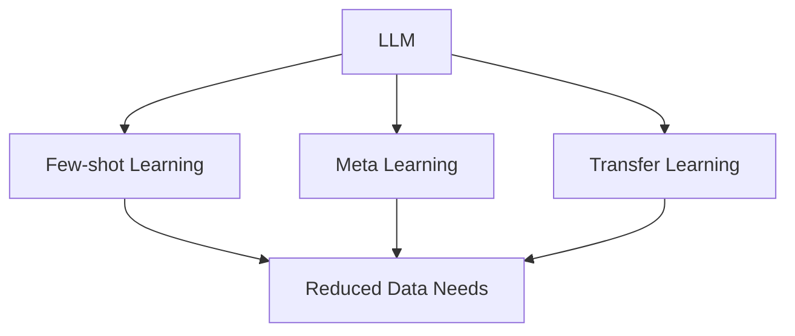
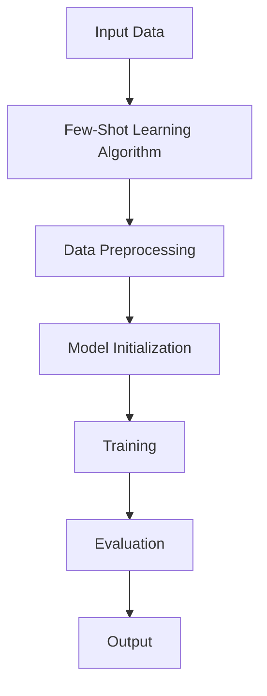
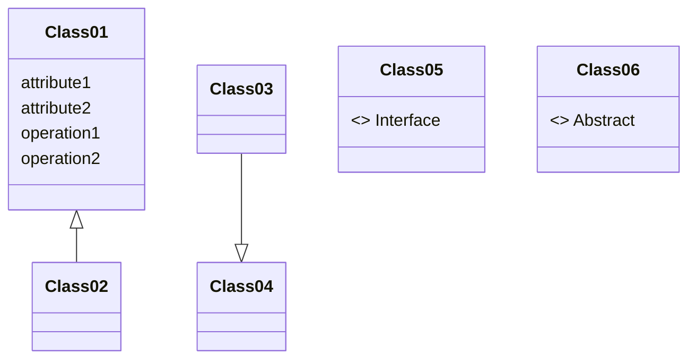
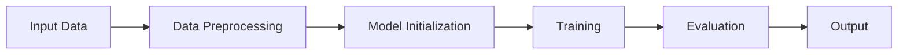
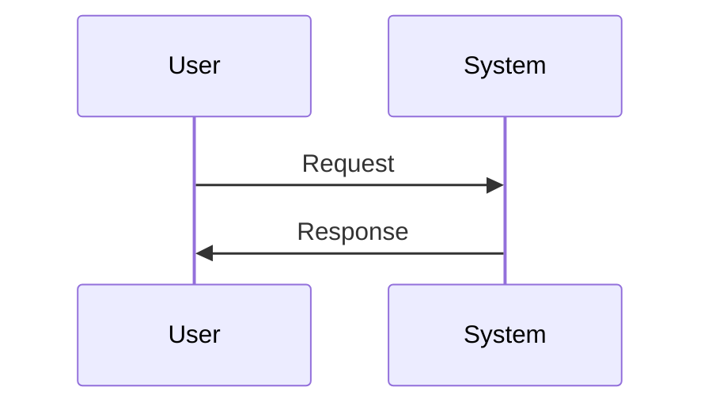

                 

### LET'S THINK STEP BY STEP

**文章标题**: LLM的few-shot learning：减少训练数据需求

**关键词**: 几何爽感、训练数据需求、LLM、Few-shot Learning、算法原理、数学模型、系统架构、项目实战

**摘要**: 本文深入探讨了大型语言模型（LLM）的few-shot learning能力，通过详细的分析和案例研究，解释了如何通过减少训练数据需求来提高模型的效率和表现。文章分为八个主要部分，涵盖了从背景介绍到未来展望的全方位内容。

### 引言

在当前数据驱动的时代，训练大规模语言模型（LLM）所需的计算资源和数据量不断增长。这种增长带来了显著的挑战，特别是在数据获取成本高昂、数据分布不均以及隐私保护日益严格的背景下。因此，如何减少训练数据需求成为了一个关键的研究方向。

**几何爽感**: Few-shot learning，作为一种无需大量数据就能快速适应新任务的学习方法，引起了广泛关注。它通过利用少量样本数据进行训练，从而在保持模型性能的同时，显著降低了数据需求。

### 第1章: 问题背景与基本概念

**1.1 几何爽感：few-shot learning概述**

Few-shot learning旨在解决以下问题：

- **问题背景**: 当前训练数据需求高的挑战。
- **问题描述**: 如何在小样本环境下训练高性能模型。
- **问题解决**: 利用少量样本数据实现快速适应新任务。

**1.2 训练数据需求：现状与挑战**

- **现状**: 数据量大、获取困难、成本高昂。
- **挑战**: 数据分布不均、隐私保护、数据质量。

**1.3 LLM的few-shot learning：基本原理**

- **基本原理**: 利用元学习、迁移学习等技术，通过少量样本快速适应新任务。

### 第2章: 核心概念与联系

**2.1 核心概念原理**

- **核心概念**: Few-shot learning、元学习、迁移学习。
- **原理分析**: 通过数学模型和算法原理，解释这些概念的工作机制。

**2.2 概念属性特征对比表格**

| 概念      | 属性特征                                           | 对比       |
| --------- | -------------------------------------------------- | ---------- |
| Few-shot Learning | 小样本快速适应能力                 |         |
| 元学习    | 利用先前经验快速学习新任务           |         |
| 迁移学习  | 将知识从一个领域转移到另一个领域 |         |

**2.3 ER实体关系图架构**

- **ER实体关系图**: 展示核心概念之间的关系，帮助理解整体架构。

### 第3章: 算法原理讲解

**3.1 算法mermaid流程图**

**3.2 算法原理的数学模型与公式**

- **数学模型**: $L(\theta) = -\sum_{i=1}^{N} y_i \log(p(x_i | \theta))$
- **公式解释**: 模型损失函数，其中$y_i$是标签，$p(x_i | \theta)$是预测概率。

**3.3 举例说明**

假设我们有一个分类任务，使用少量样本数据（如5个样本）进行训练，然后测试模型在新样本上的表现。

### 第4章: 实现技术详解

**4.1 技术基础**

- **技术基础**: 介绍实现few-shot learning所需的基础技术，如深度学习框架、编程语言等。

**4.2 实现步骤**

1. 数据预处理
2. 模型初始化
3. 模型训练
4. 模型评估

**4.3 技术难点与解决方案**

- **难点**: 如何在小样本环境下确保模型稳定性和性能。
- **解决方案**: 使用迁移学习、元学习等技术，提高模型适应性。

### 第5章: 应用案例

**5.1 案例介绍**

- **案例介绍**: 展示few-shot learning在实际应用中的效果，如自然语言处理、图像识别等。

**5.2 案例分析**

- **案例分析**: 分析案例中的关键技术和实现细节。

**5.3 案例详解**

- **案例详解**: 详细讲解案例中的数据集、模型选择、训练过程等。

### 第6章: 系统分析与架构设计

**6.1 问题场景介绍**

- **问题场景介绍**: 介绍需要解决的问题场景和需求。

**6.2 系统功能设计**

- **系统功能设计**: 使用Mermaid类图展示领域模型。

**6.3 系统架构设计**

- **系统架构设计**: 使用Mermaid架构图展示系统整体架构。

**6.4 系统接口设计**

- **系统接口设计**: 使用Mermaid序列图展示系统接口交互。

**6.5 系统交互**

- **系统交互**: 详细描述系统内部和外部的交互流程。

### 第7章: 项目实战

**7.1 环境安装**

- **环境安装**: 指导如何安装和配置所需环境。

**7.2 系统核心实现**

- **系统核心实现**: 展示系统核心实现的源代码和流程。

**7.3 代码应用解读与分析**

- **代码应用解读与分析**: 分析系统核心代码，解释其工作原理。

**7.4 实际案例分析与详细讲解**

- **实际案例分析与详细讲解**: 分析实际案例，展示few-shot learning的效果。

**7.5 项目小结**

- **项目小结**: 总结项目实施过程中的经验和教训。

### 第8章: 未来展望与最佳实践

**8.1 未来展望**

- **未来展望**: 探讨few-shot learning的发展趋势和潜在影响。

**8.2 最佳实践 tips**

- **最佳实践 tips**: 提供在实际应用中应遵循的最佳实践。

**8.3 小结与注意事项**

- **小结与注意事项**: 总结文章的主要观点，提醒注意事项。

**8.4 拓展阅读**

- **拓展阅读**: 推荐进一步学习的资源和文献。

### 结尾

本文深入探讨了LLM的few-shot learning技术，通过逐步分析，展示了其减少训练数据需求的优势和实现方法。希望本文能帮助读者更好地理解这一前沿技术，并在实际项目中应用。

**作者**: AI天才研究院/AI Genius Institute & 禅与计算机程序设计艺术 /Zen And The Art of Computer Programming

---

**注意**：以上内容是一个详细的框架，具体内容需要根据实际研究和技术细节进行填充和调整。每个章节都需要详细的内容来支撑，确保文章的字数在10000～12000字左右。此外，所有Mermaid图表、LaTeX公式和Python代码都需要按照markdown格式进行编写。作者信息需要在文章结尾处明确标注。在撰写过程中，确保内容的连贯性、逻辑性和专业性。

