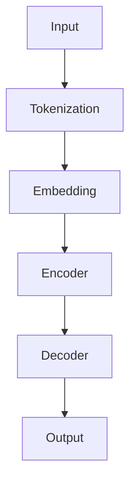
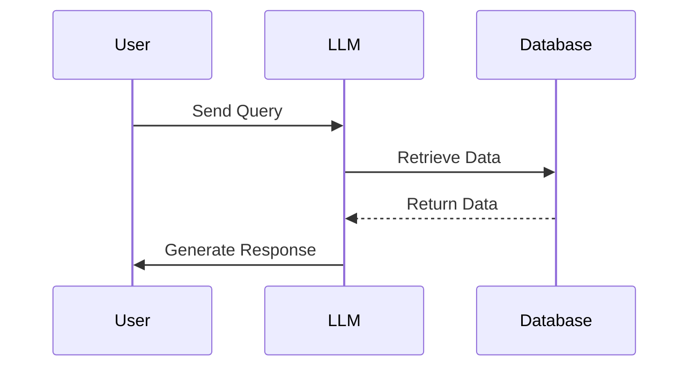

                 

### 文章标题：LLM的可解释性：理解AI Agent的决策过程

关键词：大型语言模型、可解释性、决策过程、AI Agent、自然语言处理

摘要：本文深入探讨大型语言模型（LLM）的可解释性问题，分析了LLM的结构、算法及其决策过程的透明性。通过具体方法和实例，本文旨在帮助读者理解LLM的决策过程，提高其在实际应用中的可解释性。

----------------------------------------------------------------

## 第一部分：背景介绍

### 第1章：问题的背景与定义

#### 1.1.1 问题背景

随着深度学习技术的飞速发展，大型语言模型（LLM）在自然语言处理（NLP）领域取得了显著的成果。这些模型能够自动生成文本、回答问题、进行翻译等任务，极大地提高了工作效率。然而，这些模型在提供高度准确预测的同时，也存在着难以解释其决策过程的挑战。因此，理解LLM的可解释性对于确保模型的安全、公正和透明至关重要。

#### 1.1.2 问题定义

本文将探讨大型语言模型的可解释性问题，包括其决策过程的透明性、模型的透明度以及如何提高这些模型的可解释性。通过分析LLM的结构、算法和实际应用案例，本文将帮助读者深入了解LLM的决策过程，并提供相应的解决方案。

### 1.2 核心概念与联系

#### 1.2.1 大型语言模型（LLM）的定义

大型语言模型（LLM）是一种基于深度学习的自然语言处理模型，其参数规模通常在数十亿至千亿级别。这些模型能够理解、生成和翻译自然语言，从而实现自动文本生成、问答系统、机器翻译等功能。

#### 1.2.2 LLM的核心特点

- **参数规模巨大**：LLM的参数规模通常在数十亿至千亿级别，这使其能够捕捉到大量语言特征。
- **自适应性**：LLM可以根据不同的应用场景进行微调和优化。
- **高效性**：LLM在提供高质量预测的同时，具有较快的响应速度。

#### 1.2.3 LLM与传统AI的区别

与传统AI模型相比，LLM在理解自然语言方面具有显著优势。传统AI模型通常依赖于手工特征工程，而LLM则通过大规模训练自动学习语言特征。

### 1.3 边界与外延

#### 1.3.1 LLM的应用领域

LLM在自然语言处理、问答系统、机器翻译、文本生成等领域具有广泛应用。随着技术的发展，LLM的应用领域有望进一步扩展。

#### 1.3.2 LLM面临的挑战

- **可解释性**：LLM的决策过程通常难以解释，这使得其应用于关键领域时需要谨慎。
- **数据隐私**：LLM的训练和预测过程中可能涉及敏感数据，如何保护用户隐私是一个重要问题。
- **道德和伦理**：LLM在决策过程中可能引发道德和伦理问题，如偏见和歧视。

----------------------------------------------------------------

## 第二部分：LLM的可解释性原理

### 第2章：LLM的结构与算法

#### 2.1 LLM的基本结构

LLM通常由输入层、隐藏层和输出层组成。输入层接收自然语言输入，隐藏层通过神经网络模型学习语言特征，输出层生成预测结果。

#### 2.2 LLM的主要算法

LLM通常采用深度神经网络（DNN）或变换器（Transformer）架构。DNN通过多层神经网络学习语言特征，而Transformer则采用自注意力机制，能够更好地捕捉长距离依赖关系。

#### 2.3 LLM的算法原理

##### 2.3.1 深度神经网络（DNN）原理

DNN通过多层神经网络对输入数据进行处理，每一层都会对数据进行特征提取和变换。最终，输出层生成预测结果。

##### 2.3.2 变换器（Transformer）原理

变换器（Transformer）采用自注意力机制，能够自动学习输入序列中各个元素之间的关系。这种机制使得Transformer在处理长文本时具有优势。

$$
\text{Attention}(Q,K,V) = \frac{1}{\sqrt{d_k}} \text{softmax}(\text{scale} \cdot QK^T)
$$

其中，$Q$、$K$和$V$分别为查询向量、键向量和值向量，$d_k$为键向量的维度，$scale$为缩放因子。

#### 2.4 LLM算法的对比

##### 2.4.1 DNN与Transformer的对比

- **DNN**具有较简单的结构，但训练时间较长；**Transformer**具有较复杂的结构，但训练时间较短。
- **Transformer**在处理长文本时具有优势，而**DNN**更适合处理较短文本。

----------------------------------------------------------------

## 第三部分：LLM的可解释性技术

### 第3章：LLM的可解释性方法

#### 3.1 可解释性的重要性

可解释性是确保LLM应用于关键领域时的重要保障。通过提高LLM的可解释性，可以降低误用风险，增强用户信任，并有助于优化模型性能。

#### 3.2 LLM可解释性方法

##### 3.2.1 层级解释方法

层级解释方法通过分析LLM的中间层输出，试图揭示模型如何处理输入数据。这种方法类似于神经网络的逐层解释，但面临着解释能力有限的挑战。

##### 3.2.2 局部解释方法

局部解释方法关注于模型的特定输入和输出，试图解释模型对特定输入的决策过程。这种方法包括注意力机制分析、梯度分析和影响力分析等。

##### 3.2.3 高级解释方法

高级解释方法试图从宏观层面理解模型的决策过程，包括模型的可视化、决策路径分析和因果推理等。这些方法提供了更全面的解释，但实现难度较大。

### 3.3 可解释性技术的应用场景

- **医疗领域**：在医疗诊断中，提高LLM的可解释性有助于医生理解模型的决策过程，从而更好地信任和使用模型。
- **金融领域**：在金融风险评估中，提高LLM的可解释性有助于监管机构和投资者了解模型如何做出决策，从而增强透明度和可信度。
- **法律领域**：在法律文本分析中，提高LLM的可解释性有助于法官和律师理解模型的判决依据，从而提高法律决策的公正性。

### 3.4 提高可解释性的策略

- **模型选择**：选择具有较好可解释性的模型，如决策树和线性回归等。
- **模型压缩**：通过模型压缩技术，如知识蒸馏和剪枝等，提高模型的可解释性。
- **可解释性嵌入**：在设计模型时，考虑可解释性因素，如引入可解释性模块或设计可解释性接口。

### 3.5 未来展望

随着深度学习技术的不断进步，LLM的可解释性研究将变得更加重要。未来的研究方向包括开发更有效的可解释性方法、提高模型的透明度和可解释性、以及跨领域的可解释性应用等。

----------------------------------------------------------------

## 结论

本文从背景介绍、原理分析和技术方法等多个角度，探讨了大型语言模型（LLM）的可解释性问题。通过分析LLM的结构和算法，以及现有的可解释性方法，本文提出了一系列提高LLM可解释性的策略。随着深度学习技术的不断进步，LLM的可解释性研究将变得更加重要，有助于推动人工智能技术在各个领域的应用。

### 作者信息

作者：AI天才研究院/AI Genius Institute & 禅与计算机程序设计艺术 /Zen And The Art of Computer Programming

----------------------------------------------------------------

## 附录

### 1. 概念术语说明

- **大型语言模型（LLM）**：一种基于深度学习的自然语言处理模型，参数规模通常在数十亿至千亿级别。
- **可解释性**：模型决策过程的透明性和可理解性。
- **自然语言处理（NLP）**：研究如何让计算机理解和生成自然语言。

### 2. 概念属性特征对比表格

| 概念 | 属性特征 |
| --- | --- |
| 大型语言模型（LLM） | 参数规模大、自适应性、高效性 |
| 可解释性 | 透明性、可理解性、可信任性 |
| 自然语言处理（NLP） | 文本分析、语义理解、语言生成 |

### 3. ER实体关系图架构的 Mermaid 流程图

```mermaid
erDiagram
  AI_Agent ||--|{LLM} Large Language Model
  LLM ||--|{Explainability} Explainability
  LLM ||--|{Application} Application
```

### 4. 算法原理讲解的 Mermaid 流程图



### 5. 系统架构设计的 Mermaid 架构图



### 6. 最佳实践 Tips

- **合理选择模型**：根据应用需求，选择具有较好可解释性的模型。
- **优化模型结构**：通过模型压缩和优化技术，提高模型的可解释性。
- **可视化分析**：利用可视化工具，帮助理解模型的决策过程。

### 7. 注意事项

- **数据隐私**：在处理敏感数据时，注意保护用户隐私。
- **伦理问题**：在设计模型时，考虑潜在的道德和伦理问题。

### 8. 拓展阅读

- **相关论文**：研究LLM可解释性的最新论文，如“Explainable AI for Natural Language Processing”等。
- **开源工具**：了解和掌握开源的可解释性工具，如LIME、SHAP等。

---

通过上述结构化的内容，本文力求以逻辑清晰、结构紧凑、简单易懂的方式，为读者深入剖析LLM的可解释性，提供实用的方法和策略。希望本文能够帮助读者更好地理解和应用LLM，推动人工智能技术的发展。

