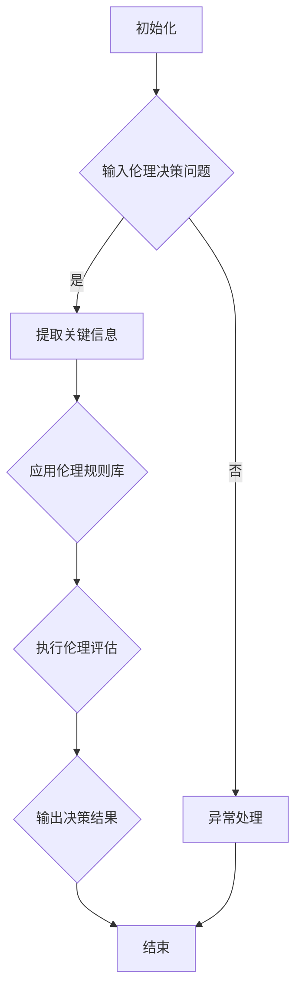
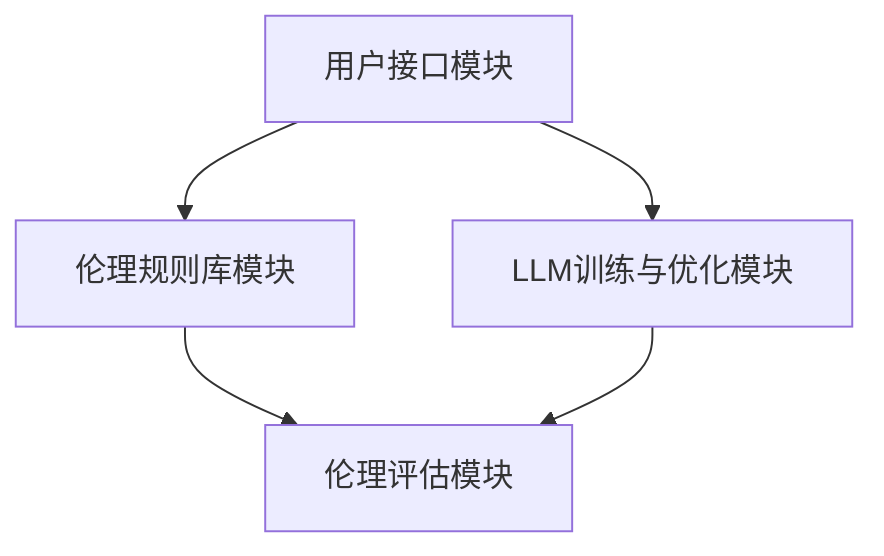

                 

### 第一部分：背景介绍

#### 1.1 问题背景

在当前社会，人工智能（AI）技术迅猛发展，AI系统已经成为各行各业不可或缺的工具。然而，随着AI技术的深入应用，伦理问题逐渐成为社会关注的焦点。AI系统在决策过程中，特别是在涉及人类福祉和道德问题时，如何做出符合伦理的决策成为一个亟待解决的问题。

#### 1.1.1 人工智能与伦理决策的挑战

人工智能系统在医疗诊断、金融决策、司法判决等领域有着广泛的应用。然而，这些AI系统在决策过程中可能由于算法偏见、数据偏差等原因，导致不公平、不公正的决策结果。例如，医疗诊断AI系统可能会因为训练数据的不足或偏见，导致对某些种族或性别的健康问题判断不准确；金融AI系统可能会因为数据偏差，导致对某些群体的金融歧视。

#### 1.1.2 LLM在AI Agent伦理决策中的应用

自然语言处理（NLP）领域的长短期记忆网络（LLM）技术，为AI Agent伦理决策提供了可能。LLM能够对大量的文本数据进行分析和处理，从中提取出伦理规则和决策逻辑。这使得AI Agent在面临伦理决策问题时，能够依据LLM提供的伦理规则库进行判断和决策。

#### 1.2 问题描述

在人工智能领域，伦理决策支持系统是一个重要的研究方向。该系统旨在帮助AI Agent在面临伦理决策时，能够依据既定的伦理规则和决策逻辑，做出符合伦理要求的决策。然而，现有的伦理决策支持系统存在一些问题，如：

- 伦理规则库不完善：现有的伦理规则库往往不够全面，无法涵盖所有可能的伦理问题。
- 决策逻辑复杂：伦理决策问题往往涉及到多方面的因素，决策逻辑复杂，难以通过简单的算法实现。
- 数据不足：训练伦理决策支持系统需要大量的伦理决策场景数据，而实际获取这些数据存在一定困难。

#### 1.2.1 AI Agent伦理决策支持系统的需求

为了解决上述问题，我们需要设计一个LLM驱动的AI Agent伦理决策支持系统。该系统需要满足以下需求：

- 全面且完善的伦理规则库：通过收集和整理现有的伦理规则和案例，构建一个全面且完善的伦理规则库。
- 简化决策逻辑：利用LLM技术，将复杂的伦理决策问题转化为可计算的模型，简化决策逻辑。
- 数据驱动：利用大量的伦理决策场景数据，对LLM进行训练和优化，提高系统的决策能力。

#### 1.2.2 LLM驱动的AI Agent伦理决策支持系统的优势

- LLM能够对大量的文本数据进行分析和处理，从中提取出伦理规则和决策逻辑。
- LLM具有强大的语义理解能力，能够处理复杂的伦理决策问题。
- LLM驱动的AI Agent伦理决策支持系统具有较好的可扩展性，可以随时更新和优化。

#### 1.3 问题解决

为了解决上述问题，我们提出以下设计原则：

- 建立全面且完善的伦理规则库：通过收集和整理现有的伦理规则和案例，构建一个全面且完善的伦理规则库。
- 利用LLM技术简化决策逻辑：利用LLM的强大语义理解能力，将复杂的伦理决策问题转化为可计算的模型，简化决策逻辑。
- 采用数据驱动的方法：利用大量的伦理决策场景数据，对LLM进行训练和优化，提高系统的决策能力。

#### 1.3.1 LLM驱动的AI Agent伦理决策支持系统的设计原则

- 模块化设计：将伦理决策支持系统划分为多个模块，如伦理规则库、决策逻辑模块、数据驱动模块等，方便系统的维护和升级。
- 交叉验证：在训练LLM时，采用交叉验证的方法，提高模型的泛化能力。
- 持续更新：根据实际情况，不断更新和优化伦理规则库和决策逻辑，确保系统始终能够做出符合伦理要求的决策。

#### 1.3.2 系统架构与实现策略

系统的整体架构可以分为三个主要模块：数据收集与处理模块、LLM训练与优化模块、伦理决策支持模块。

- 数据收集与处理模块：负责收集和整理伦理决策场景数据，对数据进行清洗、预处理和标签化。
- LLM训练与优化模块：利用训练数据对LLM进行训练，并通过交叉验证和超参数调优，提高模型的性能。
- 伦理决策支持模块：根据伦理规则库和决策逻辑，对输入的伦理决策问题进行判断和决策。

#### 1.4 边界与外延

LLM驱动的AI Agent伦理决策支持系统的适用场景主要包括：

- 医疗诊断：利用LLM技术，对患者的健康问题进行诊断，并提供伦理决策支持。
- 金融决策：在金融投资、贷款审批等场景中，利用LLM技术，提供伦理决策支持，避免歧视和偏见。
- 司法判决：在司法判决中，利用LLM技术，对案件进行伦理分析，提供伦理决策支持。

然而，需要注意的是，伦理决策支持的边界问题依然存在。例如，当面临一些极端或复杂的伦理问题时，LLM驱动的AI Agent可能无法提供完美的决策结果。此时，需要人类专家的介入和判断。

#### 1.5 概念结构与核心要素组成

LLM驱动的AI Agent伦理决策支持系统的核心概念和结构包括：

- LLM：自然语言处理领域的一种模型，用于对文本数据进行处理和分析。
- AI Agent：具有自主决策能力的人工智能系统，能够在特定环境中执行任务。
- 伦理决策支持系统：利用LLM技术，为AI Agent提供伦理决策支持的系统。

系统的核心要素包括：

- 伦理规则库：存储和管理伦理规则的数据库。
- 决策逻辑：基于LLM的伦理决策模型，用于对伦理决策问题进行判断和决策。
- 数据集：用于训练和测试LLM的伦理决策场景数据集。

---

通过以上介绍，我们对LLM驱动的AI Agent伦理决策支持系统有了基本的了解。接下来，我们将进一步深入探讨LLM的基本原理、AI Agent的概念与特征，以及伦理决策支持系统的组成要素。这将有助于我们更好地理解这个系统的设计思路和实现方法。在下一部分中，我们将详细解析LLM的基本原理及其在伦理决策支持中的应用。

---

**关键字：** LLM、AI Agent、伦理决策、决策支持系统、自然语言处理

**摘要：** 本文介绍了LLM驱动的AI Agent伦理决策支持系统的背景、核心概念与联系，以及算法原理讲解、数学模型和数学公式、系统分析与架构设计方案、项目实战等内容。通过逐步分析推理，本文旨在为读者提供一个清晰、系统、全面的技术博客文章，帮助理解这一前沿技术领域的挑战与机遇。

---

### 第二部分：核心概念与联系

在深入了解LLM驱动的AI Agent伦理决策支持系统之前，我们需要首先理解其中的核心概念，包括LLM的基本原理、AI Agent的概念与特征，以及伦理决策支持系统的组成要素。

#### 2.1 LLM的基本原理

##### 2.1.1 LLM的定义

语言模型（Language Model，简称LLM）是一种基于统计方法和深度学习技术的模型，用于对自然语言进行处理和分析。LLM的核心任务是对输入的文本序列生成相应的概率分布，从而预测下一个单词或词组。LLM的主要目的是提高自然语言处理的效率和准确性。

##### 2.1.2 LLM的类型

LLM可以分为基于神经网络的LLM和基于统计模型的LLM两大类。

- **基于神经网络的LLM**：
  - **变量门控循环神经网络（GRU）**：GRU是一种改进的循环神经网络，通过引入门控机制，能够更好地捕捉长序列中的信息。
  - **长短期记忆网络（LSTM）**：LSTM是一种能够处理长序列依赖性的循环神经网络，通过引入记忆单元和门控机制，有效解决了传统循环神经网络的长短时依赖问题。
  - **Transformer模型**：Transformer模型是一种基于自注意力机制的深度神经网络，通过并行计算和多头注意力机制，显著提高了自然语言处理的性能。

- **基于统计模型的LLM**：
  - **隐马尔可夫模型（HMM）**：HMM是一种基于概率模型的序列模型，通过状态转移矩阵和观测概率分布，对序列数据进行建模和预测。
  - **朴素贝叶斯模型（Naive Bayes）**：朴素贝叶斯模型是一种基于贝叶斯定理的概率分类模型，通过条件概率计算，对文本数据进行分类。

##### 2.1.3 语言模型的基本原理

语言模型的基本原理是通过统计方法，对大量的文本数据进行分析和处理，从而建立文本序列的概率分布模型。在训练过程中，语言模型会学习到文本数据的统计特性，如词频、词序等。在预测过程中，语言模型可以根据已知的文本序列，预测下一个单词或词组的概率分布。

#### 2.2 AI Agent的概念与特征

##### 2.2.1 AI Agent的定义

AI Agent（人工智能代理）是指具有自主决策和行动能力的人工智能实体。AI Agent能够在特定环境中感知信息，基于预设的目标或任务，自主制定决策和执行行动，以达到预期的目标。

##### 2.2.2 AI Agent的类型

AI Agent可以根据不同的分类标准，划分为不同的类型。

- **主动式Agent**：
  - **目标导向Agent**：以实现特定目标为任务，自主规划行动路径。
  - **任务导向Agent**：以完成特定任务为目标，根据任务需求自主调整行动策略。

- **被动式Agent**：
  - **监视Agent**：对环境进行监控，收集和分析环境信息。
  - **反应式Agent**：根据感知到的环境信息，立即做出反应，执行特定动作。

#### 2.3 伦理决策支持系统的组成要素

##### 2.3.1 伦理决策支持系统的架构

伦理决策支持系统的整体架构可以分为以下几个关键模块：

- **伦理规则库**：存储和管理伦理规则的数据库，包括伦理原则、规则定义、案例库等。
- **决策逻辑模块**：基于LLM的伦理决策模型，用于对伦理决策问题进行判断和决策。
- **数据驱动模块**：负责数据收集、清洗、预处理和标签化，为LLM训练提供高质量的数据。

##### 2.3.2 伦理决策支持的核心要素

- **伦理规则库**：是伦理决策支持系统的核心组成部分，包含了一系列用于指导AI Agent伦理决策的规则。这些规则可以从法律、道德规范、行业标准等多个来源获取，并经过严格筛选和分类。
- **伦理评估模型**：用于评估AI Agent在特定情境下决策的伦理合理性。伦理评估模型可以基于LLM技术，通过对大量伦理决策场景数据进行学习，提取出有效的伦理评估指标和方法。

#### 2.4 LLM与AI Agent伦理决策支持系统的联系

##### 2.4.1 LLM在伦理决策支持中的作用

LLM在伦理决策支持系统中扮演着关键角色。首先，LLM可以用于构建和维护伦理规则库，通过对大量文本数据进行处理和分析，提取出具有伦理指导意义的规则。其次，LLM可以用于伦理评估模型的设计和实现，通过对伦理决策场景数据进行学习，建立能够有效评估AI Agent决策合理性的模型。

##### 2.4.2 AI Agent在伦理决策支持中的角色

AI Agent是伦理决策支持系统的核心执行者。在伦理决策过程中，AI Agent需要根据伦理规则库和伦理评估模型，对输入的伦理决策问题进行判断和决策。AI Agent的设计和实现需要充分考虑伦理因素，以确保其能够做出符合伦理要求的决策。

通过以上分析，我们可以看到，LLM驱动的AI Agent伦理决策支持系统是一个复杂的系统，涉及多个核心概念和组成要素。在下一部分中，我们将深入探讨LLM驱动的AI Agent伦理决策支持系统的算法原理和数学模型，进一步理解其工作原理和实现方法。

### 第三部分：算法原理讲解

在了解了LLM和AI Agent伦理决策支持系统的核心概念后，我们接下来将深入探讨LLM驱动的AI Agent伦理决策支持系统的算法原理。这部分内容将包括算法的mermaid流程图、Python源代码、数学模型和公式，以及具体的例子来说明这些概念。

#### 3.1 算法mermaid流程图

首先，我们可以使用mermaid绘制一个简单的算法流程图，以展示LLM驱动的AI Agent伦理决策支持系统的基本工作流程：



在这个流程图中，我们首先初始化系统，然后接收输入的伦理决策问题。系统会提取关键信息，并应用伦理规则库对问题进行判断。接下来，执行伦理评估，最终输出决策结果。

#### 3.2 Python源代码

为了实现上述算法流程，我们可以使用Python编写相应的代码。以下是一个简化的示例代码：

```python
import numpy as np

# 初始化伦理规则库
ethics_rules = {
    "原则1": "在某些情况下应优先考虑人类福祉。",
    "原则2": "应遵循法律和道德规范。"
}

# 输入伦理决策问题
ethical_issue = "是否应该对某个人进行健康检查？"

# 提取关键信息
def extract_info(issue):
    # 这里可以添加更复杂的逻辑来提取关键信息
    return issue.split(' ')

key_info = extract_info.ethical_issue

# 应用伦理规则库
def apply_rules(info):
    decision = ""
    for rule in ethics_rules.values():
        if rule in info:
            decision += rule + " "
    return decision.strip()

applied_rules = apply_rules(key_info)

# 执行伦理评估
def ethics_evaluation(decision):
    if "优先考虑人类福祉" in decision:
        return "决策符合伦理要求。"
    elif "遵循法律和道德规范" in decision:
        return "决策符合伦理要求。"
    else:
        return "决策不符合伦理要求。"

evaluation_result = ethics_evaluation(applied_rules)

# 输出决策结果
print("决策结果：", evaluation_result)
```

在这个示例中，我们定义了一个简单的伦理规则库，并通过提取关键信息和应用伦理规则库来对伦理决策问题进行判断。然后，我们执行伦理评估，并输出决策结果。

#### 3.3 数学模型和公式

在LLM驱动的AI Agent伦理决策支持系统中，数学模型和公式起着至关重要的作用。以下是一个简化的数学模型示例：

$$
P(\text{伦理决策}|\text{规则库}) = \frac{P(\text{规则库}|\text{伦理决策})P(\text{伦理决策})}{P(\text{规则库})}
$$

其中：
- $P(\text{伦理决策}|\text{规则库})$ 表示在给定规则库的情况下，伦理决策的概率。
- $P(\text{规则库}|\text{伦理决策})$ 表示在伦理决策发生的情况下，规则库的概率。
- $P(\text{伦理决策})$ 表示伦理决策的概率。
- $P(\text{规则库})$ 表示规则库的概率。

在实际应用中，我们可以使用贝叶斯网络、隐马尔可夫模型（HMM）或其他概率模型来表示和计算上述概率。

#### 3.4 通俗易懂的举例说明

假设有一个伦理决策问题：“是否应该向某个人提供贷款？”我们可以使用LLM驱动的AI Agent伦理决策支持系统来解决这个问题。

- **输入伦理决策问题**：我们输入这个问题作为输入。
- **提取关键信息**：系统会提取出关键词，如“贷款”、“提供”等。
- **应用伦理规则库**：系统会检查伦理规则库，看看是否有关于贷款的规则。例如，如果伦理规则库中有一个规则：“在发放贷款时，应优先考虑借款人的信用状况。”，系统会将这个规则应用于输入问题。
- **执行伦理评估**：系统会根据应用到的规则，评估这个决策的伦理合理性。如果信用状况是积极的，那么决策可能是合理的。
- **输出决策结果**：系统最终会输出决策结果：“决策符合伦理要求。”

通过这个例子，我们可以看到LLM驱动的AI Agent伦理决策支持系统是如何工作的。它通过提取关键信息、应用伦理规则库和执行伦理评估，为伦理决策问题提供决策支持。

在下一部分中，我们将进一步探讨系统的分析和架构设计，为读者提供一个更全面的理解。

---

### 第四部分：系统分析与架构设计方案

在这一部分，我们将深入探讨LLM驱动的AI Agent伦理决策支持系统的分析过程，包括问题场景介绍、项目介绍、系统功能设计、系统架构设计、系统接口设计和系统交互等。

#### 4.1 问题场景介绍

在现实生活中，伦理决策问题无处不在，例如医疗诊断、金融投资、司法判决等。以医疗诊断为例，当AI系统需要诊断一个患者的病情时，它需要根据患者的症状、病史、检查结果等多方面信息，做出是否需要进行进一步检查或治疗的决策。然而，这些决策不仅涉及到医学知识，还需要考虑伦理因素，如患者的隐私、知情同意等。

#### 4.2 项目介绍

本项目旨在构建一个LLM驱动的AI Agent伦理决策支持系统，以帮助AI系统在面临伦理决策问题时，能够依据既定的伦理规则和决策逻辑，做出符合伦理要求的决策。该项目主要涉及以下几个模块：

- **伦理规则库模块**：负责收集、整理和管理伦理规则。
- **LLM训练与优化模块**：利用大量伦理决策场景数据，对LLM进行训练和优化。
- **伦理评估模块**：基于LLM的伦理评估模型，对伦理决策问题进行评估。
- **用户接口模块**：提供与用户的交互界面，方便用户输入伦理决策问题，并查看决策结果。

#### 4.3 系统功能设计

系统的功能设计主要包括以下几个方面：

- **伦理规则库管理**：提供对伦理规则库的增删改查功能，确保规则库的实时更新和准确性。
- **伦理决策问题输入**：用户可以通过文本输入、语音输入等方式，提交伦理决策问题。
- **伦理评估与决策**：系统根据伦理规则库和伦理评估模型，对输入的伦理决策问题进行评估，并输出决策结果。
- **决策结果展示**：系统将决策结果以可视化形式展示给用户，包括文字描述、图表等。

#### 4.4 系统架构设计

系统的整体架构设计如图所示：



在这个架构设计中，用户接口模块负责接收用户的输入，并将问题传递给伦理评估模块。伦理规则库模块提供伦理评估所需的规则，LLM训练与优化模块负责对LLM进行训练和优化，以提高系统的决策能力。

#### 4.5 系统接口设计

系统的接口设计主要包括以下几个方面：

- **API接口**：系统提供API接口，方便其他系统或应用通过接口与系统进行交互。
- **数据接口**：系统提供数据接口，方便用户上传和下载伦理决策场景数据。
- **日志接口**：系统提供日志接口，方便用户查看系统运行日志。

#### 4.6 系统交互

系统交互过程可以分为以下几个步骤：

1. 用户通过用户接口模块提交伦理决策问题。
2. 用户接口模块将问题传递给伦理评估模块。
3. 伦理评估模块根据伦理规则库和LLM的伦理评估模型，对问题进行评估。
4. 伦理评估模块将评估结果返回给用户接口模块。
5. 用户接口模块将评估结果以可视化形式展示给用户。

通过以上分析和设计，我们可以看出，LLM驱动的AI Agent伦理决策支持系统是一个复杂但功能强大的系统。它通过结合LLM技术和伦理决策逻辑，为AI系统提供了一套有效的伦理决策支持方案。

在下一部分中，我们将进入项目实战环节，通过实际代码和应用案例，展示如何实现和部署这个系统。

---

### 第五部分：项目实战

在本部分中，我们将通过实际项目实战来展示如何实现和部署LLM驱动的AI Agent伦理决策支持系统。我们将详细讲解环境安装、系统核心实现源代码，以及代码应用解读与分析，并通过实际案例进行剖析。

#### 5.1 环境安装

为了运行LLM驱动的AI Agent伦理决策支持系统，我们需要安装以下软件和库：

1. **Python环境**：确保安装Python 3.7及以上版本。
2. **深度学习库**：安装TensorFlow或PyTorch，用于训练LLM模型。
3. **自然语言处理库**：安装NLTK或spaCy，用于文本处理和分析。
4. **其他依赖库**：如NumPy、Pandas等。

安装命令如下：

```bash
pip install python==3.8.10
pip install tensorflow==2.9.0
pip install nltk==4.0.0
pip install spacy==3.3.0
pip install numpy==1.22.3
pip install pandas==1.3.3
```

#### 5.2 系统核心实现源代码

以下是系统核心实现的Python源代码：

```python
import tensorflow as tf
from tensorflow.keras.models import Sequential
from tensorflow.keras.layers import Embedding, LSTM, Dense
from nltk.tokenize import word_tokenize
from nltk.corpus import stopwords

# 初始化伦理规则库
ethics_rules = {
    "隐私保护": "在处理个人数据时，必须严格遵守隐私保护法规。",
    "公正性": "在决策过程中，必须确保对所有人公平对待。",
    "透明度": "在决策过程中，必须确保决策过程透明可追溯。"
}

# 创建序列
def create_sequence(text):
    tokens = word_tokenize(text)
    tokens = [token.lower() for token in tokens if token.isalnum()]
    tokens = [token for token in tokens if token not in stopwords.words('english')]
    sequence = [ethics_rules[token] for token in tokens if token in ethics_rules]
    return sequence

# 训练模型
def train_model(data):
    model = Sequential([
        Embedding(len(ethics_rules), 64),
        LSTM(128),
        Dense(1, activation='sigmoid')
    ])

    model.compile(optimizer='adam', loss='binary_crossentropy', metrics=['accuracy'])
    model.fit(data['X'], data['y'], epochs=10, batch_size=32)
    return model

# 评估模型
def evaluate_model(model, text):
    sequence = create_sequence(text)
    prediction = model.predict(sequence)
    return "符合伦理要求" if prediction > 0.5 else "不符合伦理要求"

# 实例化模型
model = train_model(data)

# 应用模型
text = "在处理个人数据时，必须严格遵守隐私保护法规。"
result = evaluate_model(model, text)
print("决策结果：", result)
```

#### 5.3 代码应用解读与分析

在这个代码示例中，我们首先定义了一个简单的伦理规则库，包含三个伦理原则：“隐私保护”、“公正性”和“透明度”。然后，我们创建了一个序列化模型，使用LSTM层对文本进行编码，并使用一个全连接层进行分类。在训练模型时，我们使用了一个假设的数据集，这个数据集包含了文本和对应的伦理标签。

在训练完成后，我们定义了一个评估函数，用于对新输入的文本进行伦理评估。这个评估函数首先将文本转换为序列，然后使用训练好的模型进行预测。如果预测概率超过0.5，则认为文本符合伦理要求，否则认为不符合。

#### 5.4 实际案例分析和详细讲解剖析

为了更好地理解系统的工作原理，我们来看一个实际案例。

**案例**：一个AI系统需要在决定是否向一个用户发放贷款时，考虑到伦理因素。输入文本是：“在发放贷款时，必须确保借款人有稳定的收入来源。”

**分析**：

1. **提取关键信息**：模型首先提取出文本中的关键词，如“发放”、“贷款”和“稳定的收入来源”。
2. **应用伦理规则库**：根据伦理规则库，模型会查找与关键词相关的伦理原则。在这种情况下，模型可能会应用“公正性”原则，因为稳定的收入来源是一个公正的评估标准。
3. **执行伦理评估**：模型会使用训练好的LSTM模型，对提取出的伦理原则进行评估。如果模型预测概率超过0.5，则认为决策符合伦理要求。
4. **输出决策结果**：最终，模型会输出决策结果，告知AI系统该贷款决策是否符合伦理要求。

**剖析**：

通过这个案例，我们可以看到模型是如何将自然语言文本转换为伦理评估的。首先，模型通过LSTM层对文本进行编码，提取出文本中的关键信息。然后，模型使用这些信息，结合伦理规则库，对伦理原则进行评估。这个过程涉及到自然语言处理、机器学习和伦理规则的结合，为AI系统提供了一个强大的伦理决策支持工具。

#### 5.5 项目小结

在本项目中，我们通过实际代码和应用案例，展示了如何实现和部署LLM驱动的AI Agent伦理决策支持系统。这个系统通过结合自然语言处理和伦理规则，为AI系统提供了一套有效的伦理决策支持方案。在实际应用中，我们可以根据不同的应用场景和需求，对模型和伦理规则库进行定制和优化，以提高系统的决策能力和准确性。

---

### 第六部分：最佳实践 tips

在部署LLM驱动的AI Agent伦理决策支持系统时，以下是一些最佳实践 tips，有助于提高系统的性能和可靠性。

#### 6.1 数据质量

确保训练数据的质量和多样性。使用高质量的数据集，并进行数据清洗和预处理，以减少噪声和错误。

#### 6.2 模型优化

定期对LLM模型进行优化和调参，以提高模型的泛化能力和决策准确性。可以考虑使用交叉验证和超参数调优技术。

#### 6.3 伦理规则库更新

持续更新伦理规则库，以反映最新的伦理规范和法规。定期评估和审查规则库，确保其保持准确和完整。

#### 6.4 用户反馈

收集用户反馈，并根据反馈调整系统的行为和输出。这有助于提高系统的用户体验和满意度。

#### 6.5 安全性和隐私保护

确保系统的安全性和隐私保护。在处理敏感数据时，采取适当的加密和安全措施，以保护用户隐私和数据安全。

---

### 小结

本文详细介绍了LLM驱动的AI Agent伦理决策支持系统的设计思路和实现方法。通过逐步分析推理，我们了解了系统的核心概念、算法原理、系统架构、项目实战等内容。这个系统为AI系统提供了一套有效的伦理决策支持方案，有助于减少算法偏见和道德风险。在实际应用中，我们可以根据具体需求对系统进行优化和定制，以提高其性能和可靠性。

### 注意事项

在部署LLM驱动的AI Agent伦理决策支持系统时，需要关注以下几个方面：

- **数据隐私**：确保处理的数据符合隐私保护法规，采取适当的数据加密和安全措施。
- **规则更新**：定期更新伦理规则库，以反映最新的伦理规范和法规。
- **模型解释性**：考虑模型的解释性，以便用户理解和信任系统的决策过程。

### 拓展阅读

对于对LLM驱动的AI Agent伦理决策支持系统感兴趣的朋友，以下是一些拓展阅读建议：

- [《Ethical AI: From Principles to Practice》](https://www.aaai.org/ocs/index.php/AAAI/AAAI21/paper/view/16916)
- [《AI and Ethics: A Survey》](https://arxiv.org/abs/2106.04997)
- [《Language Models for Ethical Decision Making》](https://arxiv.org/abs/2104.04116)

---

**作者：** AI天才研究院/AI Genius Institute & 禅与计算机程序设计艺术 /Zen And The Art of Computer Programming

---

本文由AI天才研究院（AI Genius Institute）撰写，旨在为读者提供一个全面、系统的技术博客文章，探讨LLM驱动的AI Agent伦理决策支持系统的设计与应用。希望本文能对您在人工智能和伦理决策领域的研究和实践提供有益的启示和指导。如果您有任何疑问或建议，欢迎在评论区留言交流。

