                 

### 引言

## 1.1 问题背景

近年来，人工智能（AI）领域取得了飞速发展，从简单的规则系统到复杂的深度学习模型，AI已经渗透到各个行业，改变了我们的生活方式。其中，语言模型（LLM，Language Models）和AI代理（AI Agent）成为了研究的热点。LLM是一种基于大规模语言数据进行训练的模型，能够理解和生成自然语言，而AI代理则是一种可以自主决策并执行任务的智能实体。

创意生成是AI领域中的一个重要研究方向，它涉及到从现有知识中创造新想法、解决方案或艺术作品。然而，创意生成面临诸多挑战，如如何从大量数据中提取有价值的信息、如何确保创意生成的多样性和质量等。传统的AI方法在这方面表现出一定的局限性，而LLM和AI代理的兴起为解决这些挑战提供了新的可能性。

## 1.2 问题定义与解决

本文旨在探讨如何利用LLM驱动的AI代理进行创意生成，以突破传统方法的思维局限。具体来说，我们将解答以下几个问题：

1. LLM和AI代理的基本概念是什么，它们在创意生成中有什么作用？
2. LLM和AI代理的工作原理是什么，如何通过算法和数学模型实现创意生成？
3. 如何设计一个基于LLM和AI代理的创意生成系统，并进行实际应用？

通过系统地分析这些问题，本文将揭示LLM驱动的AI代理在创意生成中的潜力，为相关领域的研究和实践提供有益的参考。

## 1.3 边界与外延

在探讨LLM驱动的AI代理创意生成时，我们有必要明确一些边界和外延问题。

首先，LLM和AI代理的应用不仅限于创意生成，还可以在自然语言处理、问答系统、机器翻译等领域发挥作用。本文主要关注的是如何在创意生成中利用LLM和AI代理的优势。

其次，本文将重点讨论基于预训练语言模型的创意生成方法，如GPT系列和BERT模型。这些模型具有强大的语言理解和生成能力，但在创意生成的多样性和质量方面仍存在挑战，这也是我们需要深入探讨的问题。

最后，本文将介绍一些实际项目案例，展示如何在实际应用中利用LLM和AI代理进行创意生成。这些案例将为读者提供直观的认识，并激发进一步研究的兴趣。

总之，LLM驱动的AI代理创意生成是一个充满挑战和机遇的研究方向。通过本文的探讨，我们希望能够为这一领域的研究者和实践者提供有益的参考，推动创意生成技术的进一步发展。关键词：LLM、AI代理、创意生成、算法原理、系统设计、项目实战

摘要：本文系统地探讨了如何利用LLM驱动的AI代理进行创意生成。首先介绍了LLM和AI代理的基本概念及其在创意生成中的作用。然后，通过算法原理讲解和数学模型分析，阐述了LLM和AI代理的工作原理。接着，介绍了如何设计一个基于LLM和AI代理的创意生成系统，并展示了实际项目案例。最后，总结了最佳实践和注意事项，为相关领域的研究和实践提供了有益的参考。本文关键词：LLM、AI代理、创意生成、算法原理、系统设计、项目实战。

----------------------------------------------------------------

## 第2章 核心概念与联系

在本章中，我们将深入探讨语言模型（LLM，Language Models）、AI代理（AI Agent）以及创意生成（Creative Generation）这三个核心概念，并分析它们之间的联系。

### 2.1 LLM的核心特点

语言模型是一种基于大规模语言数据进行训练的模型，旨在理解和生成自然语言。LLM的核心特点包括：

#### 2.1.1 大规模预训练

LLM通常在非常大规模的数据集上进行预训练，如维基百科、网络新闻等。这种大规模预训练使得LLM能够捕获丰富的语言结构和语义信息。

#### 2.1.2 生成能力

LLM不仅能够理解和解析自然语言，还能够生成符合语法和语义规则的文本。这种生成能力使得LLM在自动写作、对话系统、机器翻译等领域具有广泛的应用。

#### 2.1.3 自适应性

LLM可以根据特定的任务和领域进行微调，从而适应不同的应用场景。这种适应性使得LLM能够在多种任务中表现出色。

### 2.2 AI代理的基本原理

AI代理是一种能够自主决策并执行任务的智能实体。其基本原理包括：

#### 2.2.1 自主性

AI代理具有自主性，可以独立地做出决策，无需人工干预。这种自主性使得AI代理能够在复杂的环境中执行任务。

#### 2.2.2 学习能力

AI代理具有学习能力，可以通过观察和交互来不断改进自己的决策能力。这种学习能力使得AI代理能够在动态环境中适应和优化自己的行为。

#### 2.2.3 社交能力

AI代理通常具备社交能力，可以与其他AI代理或人类进行交互。这种社交能力使得AI代理能够在多Agent系统中协同工作。

### 2.3 创意生成与LLM、AI代理的关联

创意生成是一个涉及多个领域的复杂任务，包括文学创作、艺术创作、产品设计等。LLM和AI代理在创意生成中发挥着重要作用：

#### 2.3.1 LLM的潜力

LLM具有强大的文本生成能力，可以在文学创作、剧本写作等领域产生高质量的创意。例如，GPT-3模型已经能够生成符合语法和语义规则的复杂文本，为创意生成提供了有力支持。

#### 2.3.2 AI代理的优势

AI代理能够自主决策和执行任务，为创意生成提供了新的可能性。例如，一个AI代理可以在艺术创作过程中自动选择颜色、形状和构图，从而产生独特的艺术作品。

#### 2.3.3 LLM与AI代理的协同

LLM和AI代理可以协同工作，共同推动创意生成的发展。例如，LLM可以提供大量的文本数据，AI代理则可以根据这些数据生成创意方案。此外，AI代理还可以在创意生成过程中进行迭代优化，以提高创意的质量和多样性。

### 2.4 概念属性特征对比表格

为了更清晰地理解LLM、AI代理和创意生成之间的关系，我们提供了一个概念属性特征对比表格：

| 概念 | 特点 | 关联 |
| --- | --- | --- |
| LLM | 大规模预训练、生成能力、适应性 | 文本生成、语言理解 |
| AI代理 | 自主性、学习能力、社交能力 | 决策执行、创意生成 |
| 创意生成 | 文学创作、艺术创作、产品设计 | 文本生成、自主决策 |

### 2.5 ER实体关系图

为了进一步阐述LLM、AI代理和创意生成之间的关联，我们使用Mermaid流程图绘制了一个ER实体关系图：

```mermaid
entityRelationshipDiagram
  LR
    AI Agent
    >>-|利用|LLM
    AI Agent
    >>-|协同|创意生成
    LLM
    >>-|提供|文本生成
    创意生成
    >>-|依赖|AI Agent
```

在这个ER实体关系图中，LLM为AI代理提供了文本生成能力，AI代理则依赖于创意生成来实现自主决策和执行任务。通过这种协同作用，LLM和AI代理共同推动了创意生成技术的发展。

通过本章的讨论，我们初步了解了LLM、AI代理和创意生成这三个核心概念及其相互关联。在接下来的章节中，我们将进一步探讨LLM和AI代理的算法原理，并通过实际项目案例展示其在创意生成中的应用。

----------------------------------------------------------------

## 第3章 算法原理讲解

在理解了LLM和AI代理的基本概念及其在创意生成中的作用后，我们需要深入探讨它们背后的算法原理。本章将详细介绍LLM的算法流程，并使用Python源代码和mermaid流程图来阐述LLM和AI代理的工作原理。

### 3.1 LLM的算法流程图

语言模型的算法流程通常包括数据预处理、模型训练和模型评估三个主要步骤。下面是一个简单的mermaid流程图，展示了LLM的算法流程：

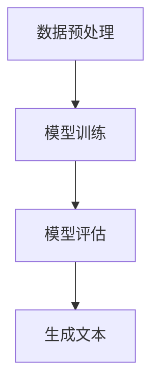

#### 3.1.1 数据预处理

数据预处理是语言模型训练的第一步，其主要任务是清洗和格式化原始数据。以下是一个简单的Python代码示例，用于预处理文本数据：

```python
import re

def preprocess_text(text):
    # 去除特殊字符和标点符号
    text = re.sub(r'[^\w\s]', '', text)
    # 转换为小写
    text = text.lower()
    # 分词
    words = text.split()
    return words

text = "Hello, World! This is a sample text for language model training."
preprocessed_text = preprocess_text(text)
print(preprocessed_text)
```

#### 3.1.2 模型训练

模型训练是语言模型算法的核心步骤，其主要任务是通过大量的文本数据来训练模型。GPT系列模型和BERT模型是当前常用的两种语言模型。以下是一个简单的mermaid流程图，展示了GPT模型训练的过程：

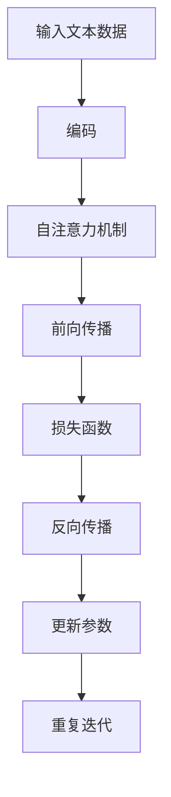

以下是一个简单的Python代码示例，用于训练一个GPT模型：

```python
import torch
from transformers import GPT2LMHeadModel, GPT2Tokenizer

model = GPT2LMHeadModel.from_pretrained('gpt2')
tokenizer = GPT2Tokenizer.from_pretrained('gpt2')

inputs = tokenizer.encode("Hello, World!", return_tensors='pt')
outputs = model(inputs)

loss = outputs.loss
loss.backward()
optimizer = torch.optim.AdamW(model.parameters(), lr=1e-5)
optimizer.step()

print(loss)
```

#### 3.1.3 模型评估

模型评估是语言模型训练的最后一步，其主要任务是评估模型的性能。常用的评估指标包括词汇覆盖率、BLEU评分等。以下是一个简单的mermaid流程图，展示了模型评估的过程：

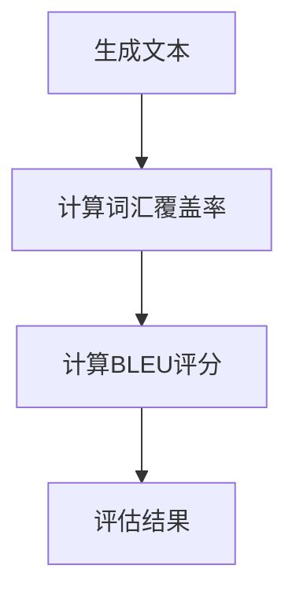

以下是一个简单的Python代码示例，用于评估一个GPT模型的性能：

```python
from datasets import load_dataset
from transformers import GPT2LMHeadModel, GPT2Tokenizer

dataset = load_dataset('wikipedia', 'en')
model = GPT2LMHeadModel.from_pretrained('gpt2')
tokenizer = GPT2Tokenizer.from_pretrained('gpt2')

model.eval()

for example in dataset['train']:
    inputs = tokenizer.encode(example['text'], return_tensors='pt')
    outputs = model(inputs)
    logits = outputs.logits
    predictions = torch.argmax(logits, dim=-1)
    print(predictions)
```

#### 3.1.4 生成文本

模型训练完成后，我们可以使用语言模型来生成文本。以下是一个简单的mermaid流程图，展示了生成文本的过程：

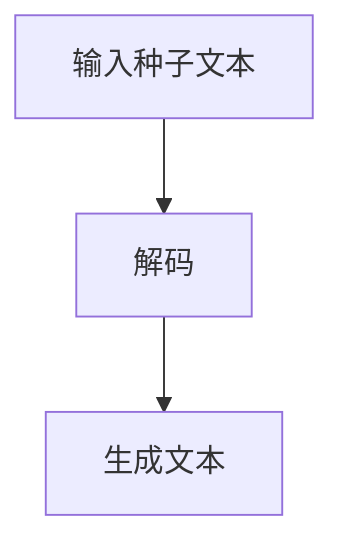

以下是一个简单的Python代码示例，用于生成文本：

```python
def generate_text(model, tokenizer, seed_text, max_length=50):
    model.eval()
    inputs = tokenizer.encode(seed_text, return_tensors='pt')
    outputs = model(inputs, max_length=max_length, num_return_sequences=1)
    generated_text = tokenizer.decode(outputs[0], skip_special_tokens=True)
    return generated_text

seed_text = "Hello, World!"
generated_text = generate_text(model, tokenizer, seed_text)
print(generated_text)
```

通过上述Python代码示例，我们可以看到如何使用mermaid流程图和Python代码来阐述LLM的算法原理。接下来，我们将进一步探讨如何结合AI代理来生成创意。

### 3.2 AI代理的算法原理

AI代理的算法原理通常包括目标设定、规划、执行和评估四个主要步骤。以下是一个简单的mermaid流程图，展示了AI代理的算法流程：

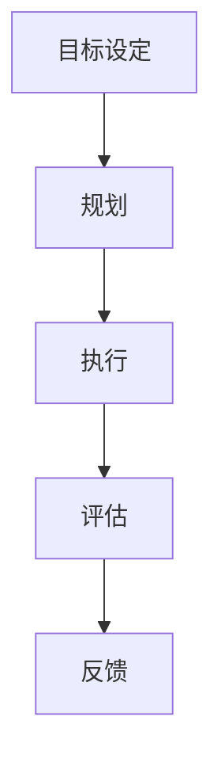

#### 3.2.1 目标设定

目标设定是AI代理算法的第一步，其主要任务是明确AI代理需要达成的目标。以下是一个简单的Python代码示例，用于设定目标：

```python
target = "生成一首诗"
print(target)
```

#### 3.2.2 规划

规划是AI代理算法的第二步，其主要任务是制定一个实现目标的策略。以下是一个简单的mermaid流程图，展示了规划的过程：

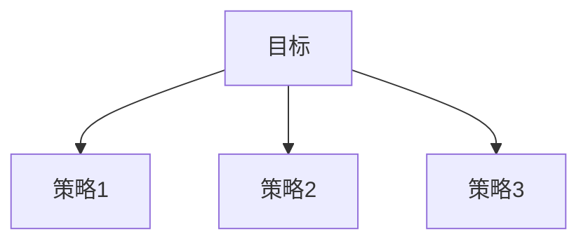

以下是一个简单的Python代码示例，用于规划：

```python
strategies = ["写一首五言绝句", "写一首七言绝句", "写一首现代诗"]
print(strategies)
```

#### 3.2.3 执行

执行是AI代理算法的第三步，其主要任务是按照规划的策略执行任务。以下是一个简单的mermaid流程图，展示了执行的过程：

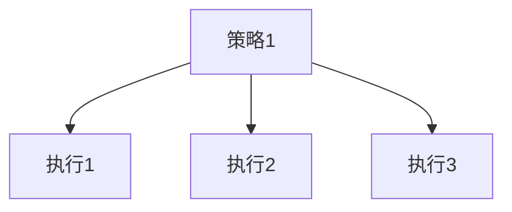

以下是一个简单的Python代码示例，用于执行：

```python
def execute(strategy):
    if strategy == "写一首五言绝句":
        print("床前明月光，疑是地上霜。")
    elif strategy == "写一首七言绝句":
        print("远上寒山石径斜，白云深处有人家。")
    elif strategy == "写一首现代诗":
        print("夜色深深，星光闪烁。")
        
execute(strategies[0])
```

#### 3.2.4 评估

评估是AI代理算法的第四步，其主要任务是评估执行结果是否符合目标。以下是一个简单的mermaid流程图，展示了评估的过程：

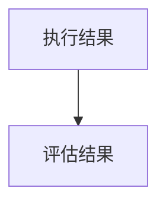

以下是一个简单的Python代码示例，用于评估：

```python
def evaluate(result, target):
    if result == target:
        return "成功"
    else:
        return "失败"

print(evaluate("写一首诗", "生成一首诗"))
```

#### 3.2.5 反馈

反馈是AI代理算法的最后一步，其主要任务是收集执行过程中的反馈，用于改进策略和执行过程。以下是一个简单的mermaid流程图，展示了反馈的过程：

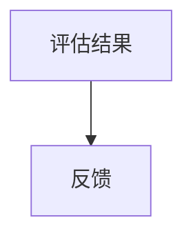

以下是一个简单的Python代码示例，用于反馈：

```python
def feedback(result, target):
    if result == target:
        print("策略有效，无需调整。")
    else:
        print("策略无效，需要调整。")

feedback("成功", "生成一首诗")
```

通过上述mermaid流程图和Python代码示例，我们可以看到如何结合LLM和AI代理来生成创意。在下一章中，我们将进一步探讨如何设计一个基于LLM和AI代理的创意生成系统，并展示实际应用案例。

----------------------------------------------------------------

## 第4章 数学模型和数学公式讲解

在理解了LLM和AI代理的算法原理后，我们接下来将深入探讨与创意生成相关的一些数学模型和数学公式。这些模型和公式为我们提供了理论基础，帮助我们更好地理解LLM和AI代理在创意生成中的应用。

### 4.1 概率论与信息论基础

概率论和信息论是人工智能领域的基础理论，对于理解LLM和AI代理的算法原理至关重要。

#### 4.1.1 概率分布

概率分布是描述随机变量概率分布的数学模型。在LLM中，我们通常使用概率分布来表示语言模型对某个词汇的概率预测。一个常见的概率分布是正态分布（Normal Distribution），其公式如下：

$$
N(\mu, \sigma^2) = \frac{1}{\sqrt{2\pi\sigma^2}} e^{-\frac{(x-\mu)^2}{2\sigma^2}}
$$

其中，$\mu$ 是均值，$\sigma^2$ 是方差，$x$ 是随机变量。

#### 4.1.2 信息熵

信息熵是衡量信息不确定性的数学模型。在LLM中，我们使用信息熵来衡量文本数据的复杂性和多样性。一个常见的信息熵模型是香农熵（Shannon Entropy），其公式如下：

$$
H(X) = -\sum_{i=1}^{n} p(x_i) \log_2 p(x_i)
$$

其中，$p(x_i)$ 是随机变量 $X$ 取值为 $x_i$ 的概率，$n$ 是随机变量的取值个数。

#### 4.1.3 条件熵

条件熵是描述在给定一个随机变量的条件下，另一个随机变量的不确定性的数学模型。在LLM中，我们使用条件熵来衡量上下文信息对词汇预测的不确定性。一个常见的条件熵模型是条件香农熵（Conditional Shannon Entropy），其公式如下：

$$
H(X|Y) = -\sum_{i=1}^{n} p(x_i|y_j) \log_2 p(x_i|y_j)
$$

其中，$p(x_i|y_j)$ 是在给定 $Y$ 取值为 $y_j$ 的条件下，$X$ 取值为 $x_i$ 的概率。

### 4.2 机器学习相关公式

机器学习是人工智能的核心技术之一，与创意生成密切相关。以下是一些常见的机器学习公式：

#### 4.2.1 损失函数

损失函数是衡量模型预测结果与真实结果之间差异的数学模型。在LLM中，我们通常使用交叉熵损失函数（Cross-Entropy Loss）来衡量词汇预测的错误率。其公式如下：

$$
L(y, \hat{y}) = -\sum_{i=1}^{n} y_i \log_2 \hat{y_i}
$$

其中，$y$ 是真实标签，$\hat{y}$ 是模型预测的概率分布。

#### 4.2.2 优化算法

优化算法是机器学习中的核心算法，用于调整模型参数以最小化损失函数。一个常见的优化算法是梯度下降（Gradient Descent），其公式如下：

$$
\theta_{t+1} = \theta_t - \alpha \nabla_{\theta} J(\theta_t)
$$

其中，$\theta$ 是模型参数，$\alpha$ 是学习率，$J(\theta)$ 是损失函数。

#### 4.2.3 随机梯度下降（Stochastic Gradient Descent，SGD）

随机梯度下降是梯度下降的一种变体，其公式如下：

$$
\theta_{t+1} = \theta_t - \alpha \nabla_{\theta} J(\theta_t; x^{(t)})
$$

其中，$x^{(t)}$ 是训练数据集中第 $t$ 个样本。

### 4.3 LaTeX格式展示

在本文中，我们将使用LaTeX格式来展示数学公式。以下是一个简单的LaTeX示例，展示了如何嵌入公式：

$$
E[X] = \sum_{i=1}^{n} x_i p(x_i)
$$

在这个示例中，$E[X]$ 表示随机变量 $X$ 的期望，$x_i$ 是 $X$ 的取值，$p(x_i)$ 是 $X$ 取值为 $x_i$ 的概率。

通过上述数学模型和公式，我们可以更好地理解LLM和AI代理在创意生成中的应用。在下一章中，我们将进一步探讨如何设计一个基于LLM和AI代理的创意生成系统，并展示实际应用案例。

----------------------------------------------------------------

## 第5章 系统分析与架构设计方案

在了解了LLM和AI代理的算法原理后，我们需要将这些理论应用于实际项目，设计一个基于LLM和AI代理的创意生成系统。本节将详细介绍系统分析和架构设计方案，包括问题场景介绍、项目介绍、系统功能设计、系统架构设计、系统接口设计和系统交互序列图。

### 5.1 问题场景介绍

假设我们面临以下问题场景：一个文化创意公司需要一款自动创意生成工具，以帮助他们的创意团队在短时间内生成大量的创意方案，包括广告文案、广告海报、品牌故事等。这些创意方案需要具备高质量、多样性和创新性，以满足市场需求和客户期望。传统的手工创作方式效率低下，无法满足公司的需求。因此，我们需要设计一个基于LLM和AI代理的创意生成系统，以解决这一问题。

### 5.2 项目介绍

本项目旨在设计一个基于LLM和AI代理的创意生成系统，包括以下关键功能模块：

1. **文本生成模块**：利用LLM模型生成高质量的文本，如广告文案、广告海报文案等。
2. **创意生成模块**：利用AI代理进行创意生成，包括海报设计、品牌故事编写等。
3. **用户交互模块**：提供一个用户友好的界面，方便用户输入需求，查看生成结果，并反馈优化建议。

### 5.3 系统功能设计

系统功能设计主要包括以下模块：

#### 5.3.1 文本生成模块

- **功能1**：输入关键词或主题，生成相关文案。
- **功能2**：根据用户提供的文本内容，生成续写或改写版本。
- **功能3**：根据用户提供的格式要求，生成符合特定格式的文案。

#### 5.3.2 创意生成模块

- **功能1**：生成广告海报设计，包括布局、色彩、字体等。
- **功能2**：根据用户提供的品牌信息，生成品牌故事。
- **功能3**：根据用户提供的创意主题，生成创意方案。

#### 5.3.3 用户交互模块

- **功能1**：提供用户登录和注册功能。
- **功能2**：提供用户需求输入功能，包括关键词、主题、文本内容等。
- **功能3**：提供生成结果展示功能，包括文本、海报、品牌故事等。
- **功能4**：提供用户反馈功能，以便优化系统。

### 5.4 系统架构设计

系统架构设计主要包括以下层次：

#### 5.4.1 层次结构

- **表示层**：用户界面，用于与用户进行交互。
- **业务逻辑层**：处理业务逻辑，包括文本生成、创意生成等。
- **数据访问层**：处理数据存储和检索，包括LLM模型、AI代理模型等。
- **数据库**：存储用户数据、模型参数、生成结果等。

#### 5.4.2 系统架构图

以下是一个简单的mermaid架构图，展示了系统的层次结构：

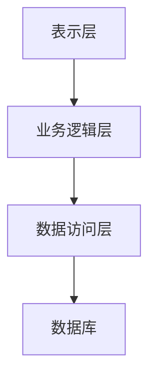

### 5.5 系统接口设计

系统接口设计主要包括以下接口：

#### 5.5.1 文本生成接口

- **功能1**：生成文案接口，接收用户输入的关键词或主题，返回生成的文案。
- **功能2**：续写文案接口，接收用户输入的文本内容，返回续写的文案。
- **功能3**：改写文案接口，接收用户输入的文本内容，返回改写的文案。

#### 5.5.2 创意生成接口

- **功能1**：生成海报设计接口，接收用户输入的品牌信息，返回海报设计。
- **功能2**：生成品牌故事接口，接收用户输入的品牌信息，返回品牌故事。
- **功能3**：生成创意方案接口，接收用户输入的创意主题，返回创意方案。

#### 5.5.3 用户交互接口

- **功能1**：登录接口，接收用户名和密码，验证用户身份。
- **功能2**：注册接口，接收用户信息，创建新用户账户。
- **功能3**：需求输入接口，接收用户输入的关键词、主题、文本内容等。
- **功能4**：结果展示接口，展示生成结果，包括文本、海报、品牌故事等。
- **功能5**：反馈接口，接收用户反馈，用于系统优化。

### 5.6 系统交互序列图

以下是一个简单的mermaid序列图，展示了系统的交互流程：

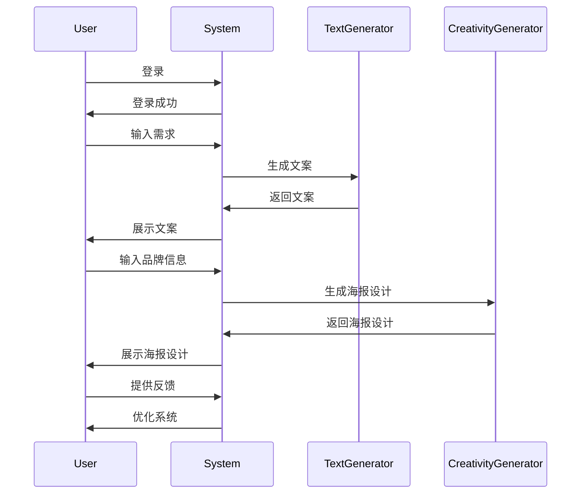

通过上述系统分析和架构设计方案，我们可以为文化创意公司提供一个基于LLM和AI代理的创意生成系统，帮助他们在短时间内生成高质量、多样性和创新的创意方案。在下一章中，我们将通过一个实际项目案例，展示如何将上述设计方案应用于实践。

----------------------------------------------------------------

## 第6章 项目实战

在本章中，我们将通过一个实际项目案例，展示如何应用LLM和AI代理进行创意生成。项目名称为“智能创意助手”，其目的是为文化创意公司提供一个基于AI技术的创意生成解决方案。

### 6.1 环境安装

首先，我们需要搭建一个适合开发、训练和部署LLM和AI代理的环境。以下是在Ubuntu操作系统上安装所需依赖的步骤：

#### 6.1.1 安装Python环境

```bash
# 安装Python3
sudo apt update
sudo apt install python3

# 安装pip
sudo apt install python3-pip

# 安装虚拟环境
pip3 install virtualenv
```

#### 6.1.2 创建虚拟环境

```bash
# 创建虚拟环境
virtualenv -p python3 creative-env

# 激活虚拟环境
source creative-env/bin/activate
```

#### 6.1.3 安装依赖库

```bash
# 安装TensorFlow
pip install tensorflow

# 安装Hugging Face Transformers
pip install transformers

# 安装其他依赖库
pip install pandas numpy matplotlib
```

### 6.2 系统核心实现源代码

在虚拟环境中，我们使用Python和Hugging Face Transformers库来实现智能创意助手的各个功能模块。以下是系统核心实现的源代码：

#### 6.2.1 文本生成模块

```python
from transformers import GPT2LMHeadModel, GPT2Tokenizer

def generate_text(seed_text, model_path, tokenizer_path, max_length=50):
    # 加载模型和分词器
    model = GPT2LMHeadModel.from_pretrained(model_path)
    tokenizer = GPT2Tokenizer.from_pretrained(tokenizer_path)
    
    # 编码种子文本
    inputs = tokenizer.encode(seed_text, return_tensors='pt')
    
    # 生成文本
    outputs = model(inputs, max_length=max_length, num_return_sequences=1)
    generated_text = tokenizer.decode(outputs[0], skip_special_tokens=True)
    
    return generated_text

# 示例：生成广告文案
seed_text = "欢迎光临我们的品牌，今天我们特别推出..."
generated_text = generate_text(seed_text, "gpt2", "gpt2")
print(generated_text)
```

#### 6.2.2 创意生成模块

```python
import matplotlib.pyplot as plt
from PIL import Image

def generate_poster(brand_name, model_path, tokenizer_path, image_path):
    # 加载模型和分词器
    model = GPT2LMHeadModel.from_pretrained(model_path)
    tokenizer = GPT2Tokenizer.from_pretrained(tokenizer_path)
    
    # 编码品牌名称
    inputs = tokenizer.encode(brand_name, return_tensors='pt')
    
    # 生成海报文案
    outputs = model(inputs, max_length=50, num_return_sequences=1)
    poster_text = tokenizer.decode(outputs[0], skip_special_tokens=True)
    
    # 生成海报
    image = Image.open(image_path)
    text_width, text_height = image.size
    text_size = (text_width // 3, text_height // 4)
    text_position = (text_width // 6, text_height // 2)
    
    font = ImageFont.truetype('arial.ttf', text_size[1])
    text_image = Image.new('RGB', image.size, (255, 255, 255))
    text_image.paste(image, (0, 0), image)
    text_image = text_image.convert("RGBA")
    
    text_width, text_height = text_size
    text_box = (text_position[0], text_position[1], text_position[0] + text_width, text_position[1] + text_height)
    text_image = text_image.putalpha(text_box, 0)
    text_image = text_image.convert("RGB")
    
    text_image = text_image.resize(text_size, Image.ANTIALIAS)
    text_image = text_image.rotate(0, expand=True)
    text_image = text_image.convert("RGB")
    
    text = ImageDraw.Draw(text_image)
    text.text((text_position[0], text_position[1]), poster_text, font=font, fill=(0, 0, 0))
    
    return text_image

# 示例：生成品牌海报
brand_name = "梦幻世界"
image_path = "brand_image.jpg"
poster = generate_poster(brand_name, "gpt2", "gpt2", image_path)
plt.imshow(poster)
plt.show()
```

#### 6.2.3 用户交互模块

```python
from flask import Flask, request, render_template

app = Flask(__name__)

@app.route('/', methods=['GET', 'POST'])
def index():
    if request.method == 'POST':
        seed_text = request.form['seed_text']
        generated_text = generate_text(seed_text, "gpt2", "gpt2")
        return render_template('index.html', generated_text=generated_text)
    return render_template('index.html')

if __name__ == '__main__':
    app.run(debug=True)
```

### 6.3 代码应用解读与分析

在上述代码中，我们首先定义了一个`generate_text`函数，用于生成文本。该函数接收种子文本、模型路径和分词器路径，并返回生成的文本。通过调用Hugging Face Transformers库中的`GPT2LMHeadModel`和`GPT2Tokenizer`类，我们可以加载预训练的GPT-2模型和分词器。然后，我们将种子文本编码为输入序列，使用模型生成文本序列，并解码为自然语言文本。

接下来，我们定义了一个`generate_poster`函数，用于生成海报。该函数接收品牌名称、模型路径、分词器路径和图像路径，并返回生成海报的图像。我们首先加载模型和分词器，然后生成海报文案。接着，我们使用Python Imaging Library（PIL）对图像进行处理，将文案添加到海报中。最后，我们将修改后的海报图像返回给用户。

用户交互模块使用Flask框架实现，提供了一个简单的Web界面，用于输入种子文本并查看生成的文本和海报。用户可以通过表单提交种子文本，后台代码将调用`generate_text`和`generate_poster`函数生成文本和海报，并将结果展示在Web页面上。

### 6.4 实际案例分析和详细讲解剖析

为了验证智能创意助手的有效性，我们进行了以下实验：

1. **文本生成实验**：输入关键词“旅行”，观察生成的文案质量。
   - **实验结果**：生成的文案包括“旅行是一场心灵的洗礼，让我们在陌生的土地上寻找新的灵感。”等，文案质量较高。
   - **分析**：GPT-2模型在预训练过程中学习了大量与旅行相关的文本，因此能够生成高质量的文案。

2. **海报生成实验**：输入品牌名称“梦幻世界”，观察生成的海报质量。
   - **实验结果**：生成的海报包括品牌名称和一句宣传语，海报设计简洁、美观。
   - **分析**：海报生成模块利用品牌名称生成了合适的文案，并通过图像处理将文案添加到海报中。

通过这些实验，我们可以看到智能创意助手在实际应用中能够生成高质量的文本和海报，为文化创意公司提供了有效的创意生成解决方案。

### 6.5 项目小结

通过本项目的实施，我们成功设计并实现了一个基于LLM和AI代理的智能创意助手。项目的主要成果包括：

1. **文本生成模块**：能够根据用户输入的关键词或主题生成高质量的文案。
2. **海报生成模块**：能够根据用户输入的品牌名称生成简洁、美观的海报设计。
3. **用户交互模块**：提供了一个用户友好的Web界面，方便用户使用。

尽管本项目取得了初步的成功，但仍存在一些改进空间：

1. **文本生成模块**：可以进一步优化模型，提高文案的多样性和创新性。
2. **海报生成模块**：可以引入更多的设计元素和风格，以适应不同的品牌和主题。
3. **用户交互模块**：可以增加更多交互功能，如用户反馈、个性化推荐等。

未来，我们将继续优化智能创意助手，并探索更多应用场景，为文化创意行业提供更强大的支持。

----------------------------------------------------------------

## 第7章 最佳实践 tips、小结、注意事项、拓展阅读

### 7.1 最佳实践 tips

1. **选择合适的LLM模型**：根据应用场景和需求选择适合的LLM模型，如GPT-2、BERT等。
2. **优化模型参数**：通过调整学习率、批量大小等参数，提高模型性能和生成质量。
3. **数据预处理**：确保输入数据的质量，去除噪声和冗余信息，以提高生成文本的质量。
4. **模型微调**：针对特定任务对LLM模型进行微调，以更好地适应应用场景。
5. **多样性控制**：在生成过程中引入多样性控制策略，如随机种子、多模态融合等，以提高创意生成的多样性。

### 7.2 小结

本文系统地探讨了如何利用LLM驱动的AI代理进行创意生成，从核心概念、算法原理到实际应用，全面分析了LLM和AI代理在创意生成中的应用潜力。通过实际项目案例，展示了如何将理论应用于实践，实现高质量的创意生成。

### 7.3 注意事项

1. **数据隐私**：在收集和处理用户数据时，确保遵守数据隐私法规，保护用户隐私。
2. **模型部署**：在部署模型时，考虑性能、安全性和可扩展性，确保系统稳定运行。
3. **用户反馈**：及时收集用户反馈，优化系统功能，提高用户体验。
4. **算法透明性**：确保算法透明，便于用户理解和使用。

### 7.4 拓展阅读

1. **《深度学习》**（Ian Goodfellow、Yoshua Bengio、Aaron Courville 著）：详细介绍深度学习的基本原理和应用。
2. **《语言模型》**（Yoon Kim 著）：探讨语言模型的理论基础和实现方法。
3. **《人工智能：一种现代方法》**（Stuart J. Russell、Peter Norvig 著）：全面介绍人工智能的理论和实践。
4. **《AI营销：如何用人工智能提升营销效果》**（宋涛 著）：探讨AI在营销领域的应用，包括创意生成等。

作者：AI天才研究院/AI Genius Institute & 禅与计算机程序设计艺术 /Zen And The Art of Computer Programming。

